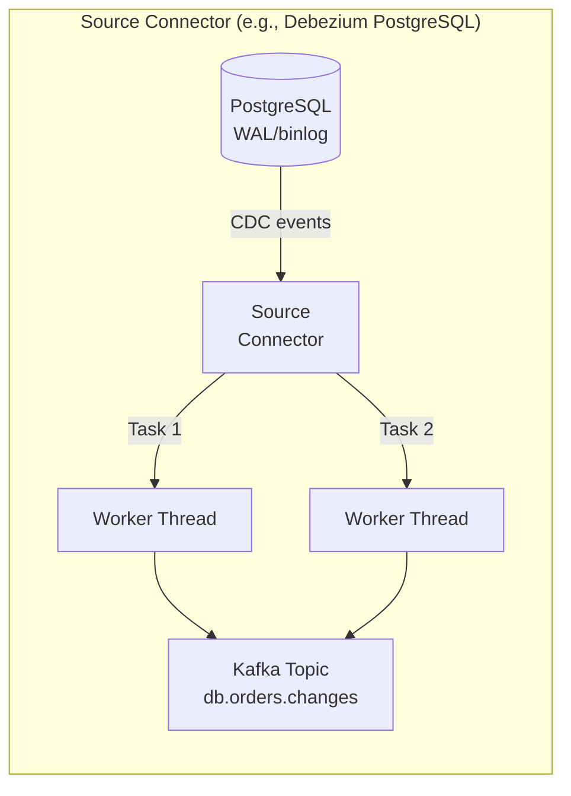
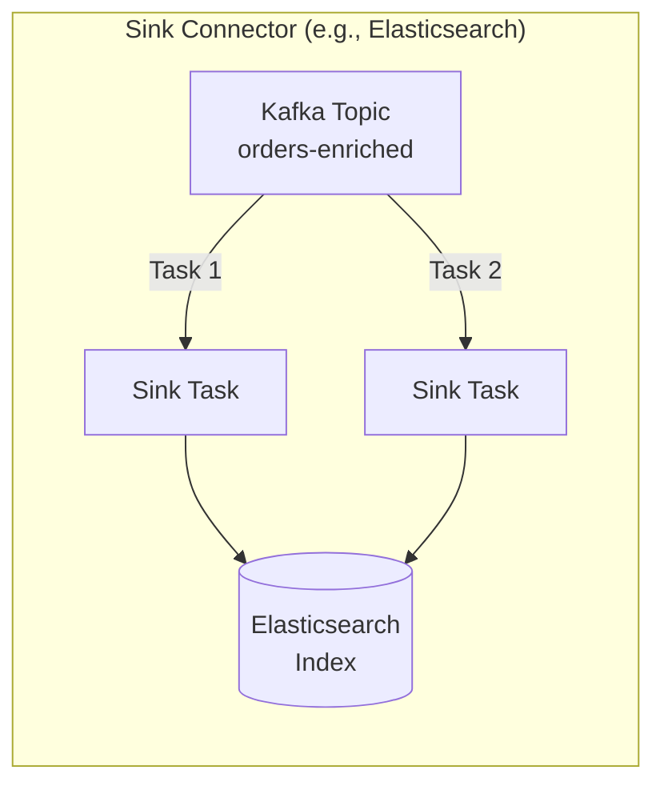
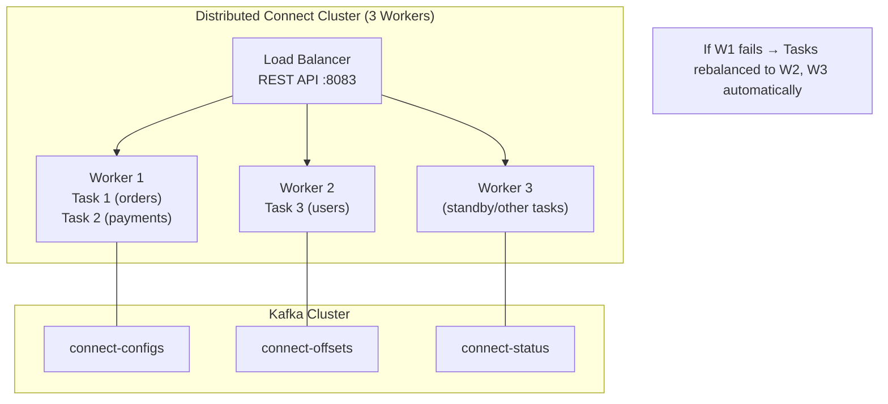
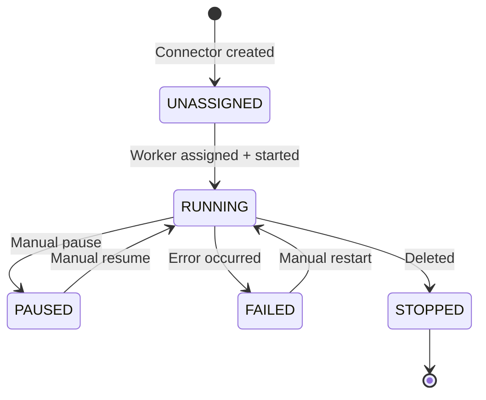
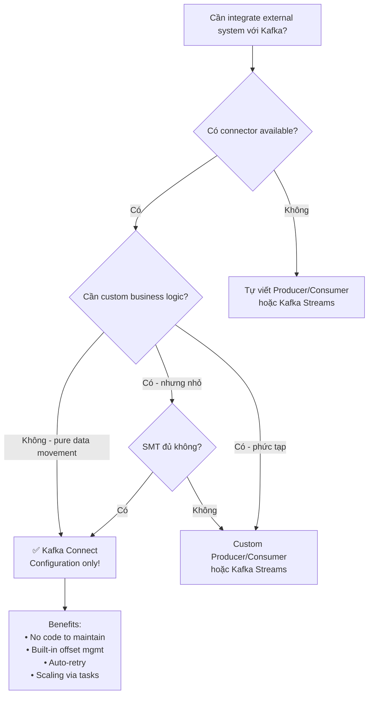

# Kafka Connect: Tổng quan

## Mục lục

- [Kafka Connect là gì?](#kafka-connect-là-gì)
- [Kafka Connect vs Tự viết Producer/Consumer](#kafka-connect-vs-tự-viết-producerconsumer)
- [Kiến trúc: Source và Sink Connectors](#kiến-trúc-source-và-sink-connectors)
- [Worker Architecture](#worker-architecture)
- [Standalone vs Distributed Mode](#standalone-vs-distributed-mode)
- [Data Transformation: Single Message Transforms (SMT)](#data-transformation-single-message-transforms-smt)
- [REST API: Quản lý Connectors](#rest-api-quản-lý-connectors)
- [Connector Lifecycle](#connector-lifecycle)
- [Khi nào dùng Kafka Connect](#khi-nào-dùng-kafka-connect)

---

## Kafka Connect là gì?

**Kafka Connect** là một **framework tích hợp dữ liệu** — nó tự động hóa việc di chuyển dữ liệu giữa Kafka và các hệ thống bên ngoài (Databases, S3, Elasticsearch, v.v.) **mà không cần viết code**.

```
┌─────────────────────────────────────────────────────────────────────────────────┐
│                    KAFKA CONNECT IN THE ECOSYSTEM                               │
├─────────────────────────────────────────────────────────────────────────────────┤
│                                                                                 │
│  External Systems ──────────────────────────────────── External Systems         │
│  (Databases, APIs,          Kafka Connect              (Databases, S3,          │
│   Files, Streams)   ─────────────────────────────────  Elasticsearch, ...)      │
│                                                                                 │
│  ┌──────────────┐   Source   ┌─────────────────────┐   Sink   ┌──────────────┐  │
│  │  PostgreSQL  │ ─────────▶ │                     │ ───────▶ │ Elasticsearch│  │
│  │  MySQL       │            │   Apache Kafka      │          │ AWS S3       │  │
│  │  MongoDB     │            │   (Topics)          │          │ BigQuery     │  │
│  │  REST API    │            │                     │          │ Snowflake    │  │
│  │  CSV Files   │ ◀───────── │                     │ ◀─────── │ JDBC (any DB)│  │
│  └──────────────┘   Sink     └─────────────────────┘  Source  └──────────────┘  │
│                                                                                 │
│  All without writing a single Producer or Consumer!                             │
└─────────────────────────────────────────────────────────────────────────────────┘
```

**Kafka Connect = Plugin-based integration framework:**
- **Source Connector**: Pulls data từ external system → writes to Kafka topic
- **Sink Connector**: Reads from Kafka topic → pushes data to external system
- **Tasks**: Parallel workers thực hiện actual data movement
- **Workers**: JVM processes host connectors và tasks

---

## Kafka Connect vs Tự viết Producer/Consumer

| Tiêu chí | Custom Producer/Consumer | Kafka Connect |
|---------|--------------------------|---------------|
| **Development time** | ❌ Nhiều tuần | ✅ Vài giờ (config only) |
| **Schema handling** | ❌ Tự implement | ✅ Built-in Schema Registry |
| **Offset management** | ✅ Full control | ✅ Auto-managed |
| **Error handling** | ❌ Tự implement | ✅ Built-in retry/DLT |
| **Scaling** | ❌ Tự manage | ✅ Auto via task config |
| **Monitoring** | ❌ Tự implement | ✅ Built-in JMX/REST |
| **Custom logic** | ✅ Unlimited | ⚠️ Limited (SMT only) |
| **CDC support** | ❌ Complex | ✅ Debezium built-in |
| **Maintainability** | ❌ Phải maintain code | ✅ Just config files |

> [!TIP]
> **Khi nào tự viết Producer/Consumer**: Cần business logic phức tạp, xử lý đặc biệt, hoặc tích hợp với hệ thống không có connector. Với tích hợp "dữ liệu thuần", Kafka Connect tiết kiệm rất nhiều công sức.

---

## Kiến trúc: Source và Sink Connectors

### Source Connector — External → Kafka



**Ví dụ các Source Connectors phổ biến:**

| Connector | Source | Use Case |
|-----------|--------|---------|
| **Debezium PostgreSQL** | PostgreSQL WAL | CDC — capture DB changes |
| **Debezium MySQL** | MySQL binlog | CDC — capture DB changes |
| **JDBC Source** | Any JDBC DB | Polling-based DB ingestion |
| **S3 Source** | AWS S3 | Batch file ingestion |
| **MongoDB CDC** | MongoDB oplog | CDC from MongoDB |
| **HTTP Source** | REST API | API polling |

### Sink Connector — Kafka → External



**Ví dụ các Sink Connectors phổ biến:**

| Connector | Sink | Use Case |
|-----------|------|---------|
| **Elasticsearch Sink** | Elasticsearch | Search indexing |
| **S3 Sink** | AWS S3 | Data lake, archiving |
| **JDBC Sink** | Any JDBC DB | Write to relational DB |
| **BigQuery Sink** | Google BigQuery | Analytics warehouse |
| **Snowflake Sink** | Snowflake | Data warehouse |
| **Redis Sink** | Redis | Cache population |
| **HTTP Sink** | REST API | Webhook delivery |

---

## Worker Architecture

```
┌─────────────────────────────────────────────────────────────────────────────────┐
│                    KAFKA CONNECT WORKER INTERNALS                               │
├─────────────────────────────────────────────────────────────────────────────────┤
│                                                                                 │
│  Worker Process (JVM):                                                          │
│  ┌───────────────────────────────────────────────────────────────────────────┐  │
│  │  Connector 1: Debezium PostgreSQL (Source)                                │  │
│  │  ┌──────────────────┐  ┌──────────────────┐  ┌──────────────────┐         │  │
│  │  │  Task 1          │  │  Task 2          │  │  Task 3          │         │  │
│  │  │  Table: orders   │  │  Table: payments │  │  Table: users    │         │  │
│  │  │  (polling WAL)   │  │  (polling WAL )  │  │  (polling WAL)   │         │  │
│  │  └──────────┬───────┘  └──────────┬───────┘  └──────────┬───────┘         │  │
│  │             │                     │                     │                 │  │
│  │             └──────────┬──────────┘                     │                 │  │
│  │                        ▼                                ▼                 │  │
│  │             Kafka Producer API              Kafka Producer API            │  │
│  └───────────────────────────────────────────────────────────────────────────┘  │
│                                                                                 │
│  Internal Topics (managed by Connect framework):                                │
│  • connect-configs: Connector configurations                                    │
│  • connect-offsets: Source connector offsets (what's been published)            │
│  • connect-status:  Connector/task status                                       │
└─────────────────────────────────────────────────────────────────────────────────┘
```

**Offset management** cho Source Connectors:
- Connect tự lưu offset vào topic `connect-offsets`
- Nếu worker restart → resume từ saved offset — không miss data
- Khác với Consumer offset: Source offset là vị trí trong source system (e.g., DB LSN, file position)

---

## Standalone vs Distributed Mode

### Standalone Mode

```yaml
# connect-standalone.properties
bootstrap.servers=localhost:9092
key.converter=org.apache.kafka.connect.json.JsonConverter
value.converter=org.apache.kafka.connect.json.JsonConverter
offset.storage.file.filename=/tmp/connect.offsets
```

```bash
# Run standalone
connect-standalone.sh connect-standalone.properties my-connector.properties
```

**Dùng khi**: Development, testing, single-machine ETL jobs.

**Nhược điểm**: Single point of failure, không scale được.

### Distributed Mode (Production)

```yaml
# connect-distributed.properties
bootstrap.servers=localhost:9092
group.id=connect-cluster

# Internal topics
config.storage.topic=connect-configs
offset.storage.topic=connect-offsets
status.storage.topic=connect-status

# Replication for HA
config.storage.replication.factor=3
offset.storage.replication.factor=3
status.storage.replication.factor=3

# Converters
key.converter=io.confluent.connect.avro.AvroConverter
value.converter=io.confluent.connect.avro.AvroConverter
key.converter.schema.registry.url=http://schema-registry:8081
value.converter.schema.registry.url=http://schema-registry:8081
```



**Ưu điểm**: HA, horizontal scaling, REST API management, automatic task rebalancing.

---

## Data Transformation: Single Message Transforms (SMT)

SMTs cho phép transform data **inline** trước khi ghi vào Kafka (Source) hoặc sau khi đọc từ Kafka (Sink):

```json
{
  "name": "postgres-source-connector",
  "config": {
    "connector.class": "io.debezium.connector.postgresql.PostgresConnector",
    "transforms": "unwrap,addField,maskSensitive",

    "transforms.unwrap.type": "io.debezium.transforms.ExtractNewRecordState",
    "transforms.unwrap.drop.tombstones": "false",

    "transforms.addField.type": "org.apache.kafka.connect.transforms.InsertField$Value",
    "transforms.addField.static.field": "source_system",
    "transforms.addField.static.value": "postgres-prod",

    "transforms.maskSensitive.type": "org.apache.kafka.connect.transforms.MaskField$Value",
    "transforms.maskSensitive.fields": "credit_card_number,ssn",
    "transforms.maskSensitive.replacement": "****"
  }
}
```

**Các SMTs built-in phổ biến:**

| SMT | Mục đích |
|-----|---------|
| `InsertField` | Thêm field mới (static, timestamp, topic name) |
| `ReplaceField` | Rename hoặc drop fields |
| `MaskField` | Mask sensitive data (PII) |
| `Filter` | Drop messages theo condition |
| `ExtractField` | Lấy nested field ra top-level |
| `TimestampConverter` | Convert timestamp formats |
| `ValueToKey` | Dùng value field làm message key |
| `Flatten` | Flatten nested JSON schema |

---

## REST API: Quản lý Connectors

Kafka Connect expose REST API mặc định trên port **8083**:

```bash
# Xem tất cả connectors đang chạy
curl http://localhost:8083/connectors

# Tạo connector mới
curl -X POST http://localhost:8083/connectors \
  -H "Content-Type: application/json" \
  -d '{
    "name": "postgres-orders-source",
    "config": {
      "connector.class": "io.debezium.connector.postgresql.PostgresConnector",
      "database.hostname": "postgres",
      "database.port": "5432",
      "database.user": "kafka_user",
      "database.password": "secret",
      "database.dbname": "orders_db",
      "table.include.list": "public.orders,public.payments",
      "topic.prefix": "db"
    }
  }'

# Xem status connector
curl http://localhost:8083/connectors/postgres-orders-source/status

# Xem status từng task
curl http://localhost:8083/connectors/postgres-orders-source/tasks

# Pause connector (tạm dừng)
curl -X PUT http://localhost:8083/connectors/postgres-orders-source/pause

# Resume connector
curl -X PUT http://localhost:8083/connectors/postgres-orders-source/resume

# Restart failed task
curl -X POST http://localhost:8083/connectors/postgres-orders-source/tasks/0/restart

# Xóa connector
curl -X DELETE http://localhost:8083/connectors/postgres-orders-source

# Validate connector config trước khi tạo
curl -X PUT http://localhost:8083/connector-plugins/PostgresConnector/config/validate \
  -H "Content-Type: application/json" \
  -d '{ ... config ... }'
```

---

## Connector Lifecycle



**Task States:**

| State | Ý nghĩa | Hành động |
|-------|---------|----------|
| `RUNNING` | Task đang hoạt động | Monitor lag |
| `PAUSED` | Task bị pause | Resume khi ready |
| `FAILED` | Task gặp lỗi | Restart task, check logs |
| `UNASSIGNED` | Chưa được gán vào worker | Chờ rebalance |

---

## Khi nào dùng Kafka Connect



**Checklist cho Kafka Connect:**

```
✅ Dùng Kafka Connect khi:
   [ ] Tích hợp DB → Kafka (CDC hoặc polling)
   [ ] Kafka → Data warehouse (S3, BigQuery, Snowflake)
   [ ] Kafka → Search (Elasticsearch)
   [ ] Backup/archival Kafka data
   [ ] ETL đơn giản giữa hệ thống
   [ ] Team muốn tránh viết boilerplate code

❌ Không dùng Kafka Connect khi:
   [ ] Cần complex business logic transformation
   [ ] Source system không có connector
   [ ] Cần full control over error handling
   [ ] Cần custom authentication mechanism phức tạp
```

<Cards>
  <Card title="Connectors Deep Dive" href="/connect/connectors/" description="Debezium CDC, JDBC, S3 — config chi tiết và best practices" />
  <Card title="Kafka Streams" href="/streams/streams-overview/" description="Khi cần xử lý và transform trong Kafka" />
  <Card title="Transactions" href="/producers-consumers/transactions/" description="Outbox Pattern vs CDC approach" />
</Cards>
