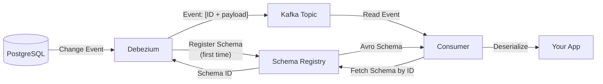

# Connectors: Debezium, JDBC & S3

## Mục lục

- [Docker Compose: Full Connect Stack](#docker-compose-full-connect-stack)
- [Debezium PostgreSQL — CDC Source](#debezium-postgresql--cdc-source)
- [Debezium: Event Format và Schema](#debezium-event-format-và-schema)
- [JDBC Source Connector — Polling](#jdbc-source-connector--polling)
- [JDBC Sink Connector — Write to DB](#jdbc-sink-connector--write-to-db)
- [S3 Sink Connector — Data Lake](#s3-sink-connector--data-lake)
- [Elasticsearch Sink Connector](#elasticsearch-sink-connector)
- [Schema Evolution với Schema Registry](#schema-evolution-với-schema-registry)
- [Error Handling & Dead Letter Queue](#error-handling--dead-letter-queue)
- [Monitoring Connectors](#monitoring-connectors)

---

## Docker Compose: Full Connect Stack

```yaml
# docker-compose.yml — Full Kafka Connect environment
version: '3.8'

services:
  zookeeper:
    image: confluentinc/cp-zookeeper:7.5.0
    environment:
      ZOOKEEPER_CLIENT_PORT: 2181

  kafka:
    image: confluentinc/cp-kafka:7.5.0
    depends_on: [zookeeper]
    ports:
      - "9092:9092"
    environment:
      KAFKA_ZOOKEEPER_CONNECT: zookeeper:2181
      KAFKA_ADVERTISED_LISTENERS: PLAINTEXT://kafka:29092,PLAINTEXT_HOST://localhost:9092
      KAFKA_LISTENER_SECURITY_PROTOCOL_MAP: PLAINTEXT:PLAINTEXT,PLAINTEXT_HOST:PLAINTEXT
      KAFKA_OFFSETS_TOPIC_REPLICATION_FACTOR: 1

  schema-registry:
    image: confluentinc/cp-schema-registry:7.5.0
    depends_on: [kafka]
    ports:
      - "8081:8081"
    environment:
      SCHEMA_REGISTRY_KAFKASTORE_BOOTSTRAP_SERVERS: kafka:29092
      SCHEMA_REGISTRY_HOST_NAME: schema-registry

  kafka-connect:
    image: confluentinc/cp-kafka-connect:7.5.0
    depends_on: [kafka, schema-registry]
    ports:
      - "8083:8083"
    environment:
      CONNECT_BOOTSTRAP_SERVERS: kafka:29092
      CONNECT_REST_PORT: 8083
      CONNECT_GROUP_ID: connect-cluster
      CONNECT_CONFIG_STORAGE_TOPIC: connect-configs
      CONNECT_OFFSET_STORAGE_TOPIC: connect-offsets
      CONNECT_STATUS_STORAGE_TOPIC: connect-status
      CONNECT_CONFIG_STORAGE_REPLICATION_FACTOR: 1
      CONNECT_OFFSET_STORAGE_REPLICATION_FACTOR: 1
      CONNECT_STATUS_STORAGE_REPLICATION_FACTOR: 1
      CONNECT_KEY_CONVERTER: io.confluent.connect.avro.AvroConverter
      CONNECT_VALUE_CONVERTER: io.confluent.connect.avro.AvroConverter
      CONNECT_KEY_CONVERTER_SCHEMA_REGISTRY_URL: http://schema-registry:8081
      CONNECT_VALUE_CONVERTER_SCHEMA_REGISTRY_URL: http://schema-registry:8081
      CONNECT_PLUGIN_PATH: /usr/share/java,/usr/share/confluent-hub-components
    # Install connectors on startup
    command:
      - bash
      - -c
      - |
        confluent-hub install --no-prompt debezium/debezium-connector-postgresql:2.4.2
        confluent-hub install --no-prompt confluentinc/kafka-connect-s3:10.5.9
        confluent-hub install --no-prompt confluentinc/kafka-connect-elasticsearch:14.0.12
        /etc/confluent/docker/run

  postgres:
    image: postgres:15
    ports:
      - "5432:5432"
    environment:
      POSTGRES_DB: orders_db
      POSTGRES_USER: postgres
      POSTGRES_PASSWORD: postgres
    command:
      - postgres
      - -c
      - wal_level=logical    # Required for CDC!
      - -c
      - max_replication_slots=5
      - -c
      - max_wal_senders=5
```

---

## Debezium PostgreSQL — CDC Source

**Debezium** là CDC connector mạnh nhất — đọc trực tiếp từ PostgreSQL WAL (Write-Ahead Log), không cần polling.

### Setup PostgreSQL cho CDC

```sql
-- Tạo user có replication privileges
CREATE USER debezium_user REPLICATION LOGIN PASSWORD 'secret';
GRANT SELECT ON ALL TABLES IN SCHEMA public TO debezium_user;

-- Tạo publication (PostgreSQL 10+)
CREATE PUBLICATION debezium_pub FOR TABLE orders, payments, users;

-- Verify WAL level
SHOW wal_level;  -- Must be 'logical'
```

### Connector Configuration

```json
{
  "name": "postgres-cdc-connector",
  "config": {
    "connector.class": "io.debezium.connector.postgresql.PostgresConnector",

    "database.hostname": "postgres",
    "database.port": "5432",
    "database.user": "debezium_user",
    "database.password": "secret",
    "database.dbname": "orders_db",
    "database.server.name": "db",

    "plugin.name": "pgoutput",

    "table.include.list": "public.orders,public.payments",

    "topic.prefix": "db",

    "slot.name": "debezium_slot",

    "publication.name": "debezium_pub",

    "snapshot.mode": "initial",

    "heartbeat.interval.ms": "10000",

    "decimal.handling.mode": "double",

    "transforms": "unwrap",
    "transforms.unwrap.type": "io.debezium.transforms.ExtractNewRecordState",
    "transforms.unwrap.drop.tombstones": "false",
    "transforms.unwrap.delete.handling.mode": "rewrite",
    "transforms.unwrap.add.fields": "op,table,source.ts_ms"
  }
}
```

### Snapshot Modes

| Mode | Khi nào dùng | Hành vi |
|------|-------------|---------|
| `initial` | Lần đầu setup | Snapshot toàn bộ data hiện có, rồi stream changes |
| `never` | Chỉ cần changes từ bây giờ | Bỏ qua snapshot, chỉ stream từ WAL position hiện tại |
| `always` | Test/reset | Snapshot mỗi lần restart (cẩn thận với data lớn) |
| `initial_only` | Migrate data một lần | Chỉ snapshot, dừng sau khi xong |
| `exported` | Zero-downtime migration | Lấy consistent snapshot tại một LSN cụ thể |

---

## Debezium: Event Format và Schema

Debezium tạo ra **structured change events** với đầy đủ thông tin:

### Raw Event (trước ExtractNewRecordState SMT)

```json
{
  "before": {
    "id": "ord-123",
    "status": "PROCESSING",
    "amount": 100.00
  },
  "after": {
    "id": "ord-123",
    "status": "COMPLETED",
    "amount": 100.00
  },
  "source": {
    "version": "2.4.2",
    "connector": "postgresql",
    "name": "db",
    "ts_ms": 1703001234567,
    "schema": "public",
    "table": "orders",
    "txId": 42,
    "lsn": 12345678,
    "xmin": null
  },
  "op": "u",
  "ts_ms": 1703001234890
}
```

### Sau ExtractNewRecordState SMT (Flattened)

```json
{
  "id": "ord-123",
  "status": "COMPLETED",
  "amount": 100.00,
  "__op": "u",
  "__table": "orders",
  "__source_ts_ms": 1703001234567
}
```

### Operation Codes

| `op` | Ý nghĩa | `before` | `after` |
|------|--------|---------|--------|
| `r` | Read (snapshot) | null | full row |
| `c` | Create (INSERT) | null | new row |
| `u` | Update (UPDATE) | old row | new row |
| `d` | Delete (DELETE) | old row | null |
| `t` | Truncate | null | null |

### Consume Debezium Events trong Spring Boot

```java
@Service
@Slf4j
public class OrderCdcConsumer {

    @KafkaListener(
        topics = "db.public.orders",     // Debezium topic: {prefix}.{schema}.{table}
        groupId = "order-cdc-consumer"
    )
    public void handleOrderChange(OrderChangeEvent event,
            @Header(KafkaHeaders.RECEIVED_KEY) String key) {

        String operation = event.getOp();  // c/u/d/r

        switch (operation) {
            case "c" -> handleOrderCreated(event.getAfter());
            case "u" -> handleOrderUpdated(event.getBefore(), event.getAfter());
            case "d" -> handleOrderDeleted(event.getBefore());
            default  -> log.debug("Ignoring operation: {}", operation);
        }
    }

    private void handleOrderCreated(OrderDto order) {
        log.info("New order: {}", order.getId());
        searchIndexService.indexOrder(order);
        analyticsService.recordNewOrder(order);
    }

    private void handleOrderUpdated(OrderDto before, OrderDto after) {
        if (!before.getStatus().equals(after.getStatus())) {
            log.info("Order {} status: {} → {}", after.getId(), before.getStatus(), after.getStatus());
            notificationService.notifyStatusChange(after);
        }
    }

    private void handleOrderDeleted(OrderDto deleted) {
        searchIndexService.removeOrder(deleted.getId());
    }
}
```

---

## JDBC Source Connector — Polling

Dùng khi không cần CDC (không có WAL access) hoặc source không phải PostgreSQL/MySQL:

```json
{
  "name": "jdbc-products-source",
  "config": {
    "connector.class": "io.confluent.connect.jdbc.JdbcSourceConnector",
    "connection.url": "jdbc:postgresql://postgres:5432/catalog_db",
    "connection.user": "kafka_user",
    "connection.password": "secret",

    "mode": "timestamp+incrementing",
    "timestamp.column.name": "updated_at",
    "incrementing.column.name": "id",

    "table.whitelist": "products,categories",

    "topic.prefix": "jdbc.",

    "poll.interval.ms": "5000",

    "numeric.mapping": "best_fit",

    "transforms": "createKey,extractKey",
    "transforms.createKey.type": "org.apache.kafka.connect.transforms.ValueToKey",
    "transforms.createKey.fields": "id",
    "transforms.extractKey.type": "org.apache.kafka.connect.transforms.ExtractField$Key",
    "transforms.extractKey.field": "id"
  }
}
```

**JDBC Source Modes:**

| Mode | Tracking | Dùng khi |
|------|---------|---------|
| `bulk` | Không — full scan mỗi lần | Table nhỏ, không có tracking column |
| `incrementing` | ID column (INT/BIGINT) | INSERT only, không UPDATE/DELETE |
| `timestamp` | Timestamp column | INSERT + UPDATE (no DELETE) |
| `timestamp+incrementing` | Cả hai | INSERT + UPDATE với unique ID |

> [!WARNING]
> **JDBC Source limitations vs Debezium:**
> - Không detect DELETE operations
> - Polling delay (tối thiểu `poll.interval.ms`)
> - Load trên database (SELECT queries)
> - Không đảm bảo exactly-once khi crash

---

## JDBC Sink Connector — Write to DB

```json
{
  "name": "jdbc-orders-sink",
  "config": {
    "connector.class": "io.confluent.connect.jdbc.JdbcSinkConnector",
    "connection.url": "jdbc:postgresql://postgres:5432/analytics_db",
    "connection.user": "writer_user",
    "connection.password": "secret",

    "topics": "orders-enriched,payments-processed",

    "auto.create": "true",

    "auto.evolve": "true",

    "insert.mode": "upsert",

    "pk.mode": "record_key",

    "pk.fields": "id",

    "fields.whitelist": "id,customer_id,status,total_amount,created_at",

    "batch.size": "3000",

    "consumer.override.max.poll.records": "2000"
  }
}
```

**Insert Modes:**

| Mode | SQL | Dùng khi |
|------|-----|---------|
| `insert` | `INSERT INTO` | Append-only, no duplicates |
| `upsert` | `INSERT ... ON CONFLICT UPDATE` | Handle updates, idempotent |
| `update` | `UPDATE SET` | Only update existing rows |

---

## S3 Sink Connector — Data Lake

```json
{
  "name": "s3-orders-archival",
  "config": {
    "connector.class": "io.confluent.connect.s3.S3SinkConnector",

    "tasks.max": "4",

    "topics": "orders-completed,payments-completed",

    "s3.region": "us-east-1",
    "s3.bucket.name": "my-data-lake",
    "s3.part.size": "67108864",

    "storage.class": "io.confluent.connect.s3.storage.S3Storage",

    "s3.path.style.access.enabled": "false",

    "flush.size": "10000",
    "rotate.interval.ms": "3600000",
    "rotate.schedule.interval.ms": "3600000",

    "format.class": "io.confluent.connect.s3.format.parquet.ParquetFormat",

    "schema.compatibility": "FULL",

    "locale": "en_US",
    "timezone": "UTC",

    "timestamp.extractor": "RecordField",
    "timestamp.field": "created_at",

    "partitioner.class": "io.confluent.connect.storage.partitioner.TimeBasedPartitioner",
    "path.format": "'year'=YYYY/'month'=MM/'day'=dd/'hour'=HH",

    "s3.credentials.provider.class": "com.amazonaws.auth.WebIdentityTokenFileCredentialsProvider"
  }
}
```

**Kết quả — S3 path structure:**
```
s3://my-data-lake/
  topics/
    orders-completed/
      year=2024/
        month=01/
          day=15/
            hour=10/
              orders-completed+0+0000000000.parquet
              orders-completed+1+0000000000.parquet
```

**Format options:**

| Format | File Extension | Dùng khi |
|--------|---------------|---------|
| `JsonFormat` | `.json` | Human-readable, debug |
| `AvroFormat` | `.avro` | Schema evolution, compact |
| `ParquetFormat` | `.parquet` | Analytics (Athena, Spark, BigQuery) |

---

## Elasticsearch Sink Connector

```json
{
  "name": "elasticsearch-orders-sink",
  "config": {
    "connector.class": "io.confluent.connect.elasticsearch.ElasticsearchSinkConnector",

    "tasks.max": "2",
    "topics": "orders-enriched",

    "connection.url": "https://elasticsearch:9200",
    "connection.username": "elastic",
    "connection.password": "secret",

    "type.name": "_doc",

    "key.ignore": "false",

    "schema.ignore": "true",

    "behavior.on.malformed.documents": "warn",

    "behavior.on.null.values": "delete",

    "batch.size": "2000",
    "linger.ms": "100",

    "flush.timeout.ms": "10000",
    "max.retries": "5",
    "retry.backoff.ms": "100",

    "write.method": "UPSERT",

    "transforms": "routeByRegion",
    "transforms.routeByRegion.type": "io.confluent.connect.transforms.TopicRoutingTransform",
    "transforms.routeByRegion.topic.regex": "orders-(.*)",
    "transforms.routeByRegion.topic.replacement": "orders-index"
  }
}
```

---

## Schema Evolution với Schema Registry

Khi dùng Avro converter + Schema Registry, Debezium tự động register schemas:



**Schema Compatibility Modes:**

| Mode | Cho phép | Best for |
|------|---------|---------|
| `BACKWARD` | Thêm field với default value | Consumers cũ vẫn đọc được |
| `FORWARD` | Xóa field có default value | Producers cũ vẫn gửi được |
| `FULL` | Thêm VÀ xóa (với default) | Safest for evolution |
| `NONE` | Không validate | Dev only |

---

## Error Handling & Dead Letter Queue

```json
{
  "name": "postgres-cdc-connector",
  "config": {
    "errors.tolerance": "all",

    "errors.log.enable": "true",
    "errors.log.include.messages": "true",

    "errors.deadletterqueue.topic.name": "connect-dlt",
    "errors.deadletterqueue.topic.replication.factor": "3",
    "errors.deadletterqueue.context.headers.enable": "true",

    "errors.retry.timeout": "300000",
    "errors.retry.delay.max.ms": "60000"
  }
}
```

**Inspect DLT messages:**

```bash
# Xem messages trong DLT với headers
kafka-console-consumer.sh \
  --bootstrap-server localhost:9092 \
  --topic connect-dlt \
  --from-beginning \
  --property print.headers=true

# Headers chứa thông tin lỗi:
# connect.errors.exception.class.name: java.lang.NullPointerException
# connect.errors.exception.message: Column 'amount' cannot be null
# connect.errors.topic: orders-enriched
# connect.errors.partition: 2
# connect.errors.offset: 12345
```

---

## Monitoring Connectors

### JMX Metrics (qua Prometheus)

```yaml
# jmx-exporter config cho Kafka Connect
rules:
  - pattern: "kafka.connect<type=connector-metrics, connector=(.+)><>(connector-status)"
    name: kafka_connect_connector_status
    labels:
      connector: "$1"

  - pattern: "kafka.connect<type=source-task-metrics, connector=(.+), task=(.+)><>(source-record-write-rate)"
    name: kafka_connect_source_record_write_rate
    labels:
      connector: "$1"
      task: "$2"

  - pattern: "kafka.connect<type=sink-task-metrics, connector=(.+), task=(.+)><>(sink-record-lag-max)"
    name: kafka_connect_sink_record_lag_max
    labels:
      connector: "$1"
      task: "$2"
```

### Key Metrics to Watch

| Metric | Alert khi |
|--------|----------|
| `connector-status` | Không phải `RUNNING` |
| `source-record-write-rate` | = 0 (stopped producing) |
| `sink-record-lag-max` | > 10,000 (falling behind) |
| `failed-task-count` | > 0 |
| `rebalancing` | True quá lâu |

### Health Check Script

```bash
#!/bin/bash
# check-connectors.sh

CONNECT_URL="http://localhost:8083"
FAILED=0

for connector in $(curl -s $CONNECT_URL/connectors | jq -r '.[]'); do
    status=$(curl -s $CONNECT_URL/connectors/$connector/status \
        | jq -r '.connector.state')

    if [ "$status" != "RUNNING" ]; then
        echo "❌ $connector is $status"
        FAILED=1
    else
        echo "✅ $connector is RUNNING"
    fi
done

exit $FAILED
```

<Cards>
  <Card title="Connect Overview" href="/connect/connect-overview/" description="Architecture, REST API, Worker modes" />
  <Card title="Transactions & Outbox" href="/producers-consumers/transactions/" description="So sánh Outbox Pattern vs Debezium CDC" />
  <Card title="Operations: Monitoring" href="/operations/monitoring/" description="JMX, Prometheus, Grafana cho Kafka cluster" />
</Cards>
