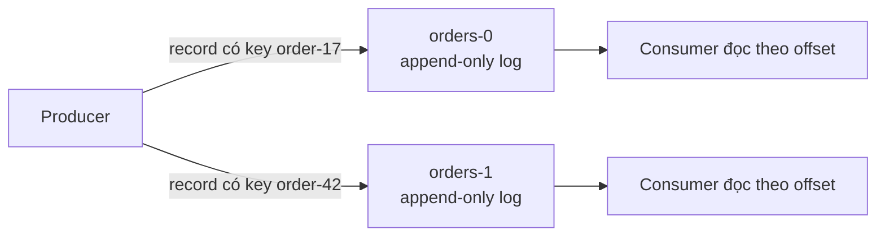
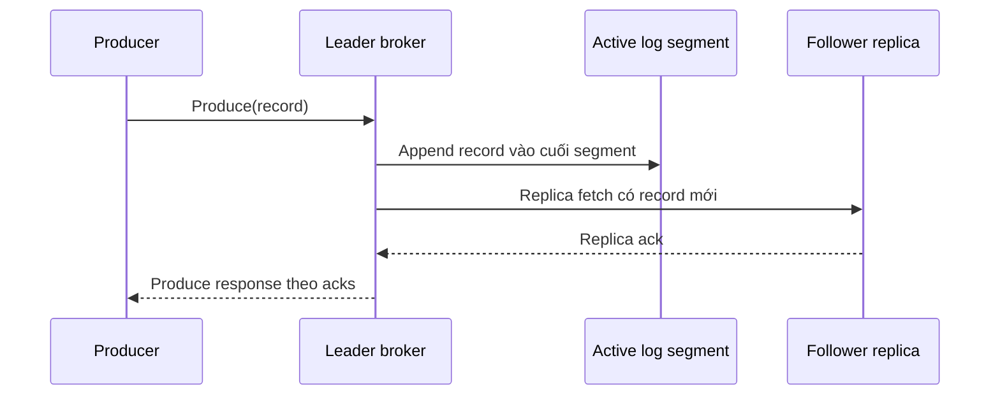
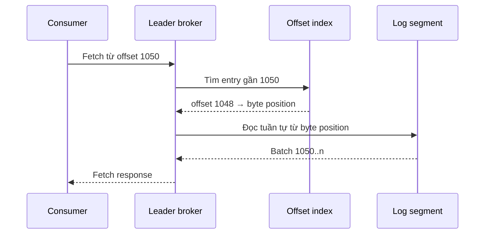

<Callout type="info" title="Phạm vi bài viết">
  Bài này giải thích storage model của một partition Kafka. Phần replication được trình bày riêng trong <a href="/core-concepts/brokers-cluster/">Brokers &amp; Cluster</a>; phần offset commit của consumer nằm trong <a href="/core-concepts/offsets/">Offsets</a>.
</Callout>

## Mục lục

- [Append-only log là gì?](#append-only-log-là-gì)
- [Một partition là một log độc lập](#một-partition-là-một-log-độc-lập)
- [Luồng ghi record](#luồng-ghi-record)
- [Log segment và các file index](#log-segment-và-các-file-index)
  - [Active segment và closed segment](#active-segment-và-closed-segment)
  - [Offset index và time index](#offset-index-và-time-index)
- [Đọc record theo offset](#đọc-record-theo-offset)
- [Retention và log compaction](#retention-và-log-compaction)
- [Vì sao append-only nhanh?](#vì-sao-append-only-nhanh)
- [Những điều append-only không đảm bảo](#những-điều-append-only-không-đảm-bảo)
- [Cấu hình và vận hành](#cấu-hình-và-vận-hành)
- [Tóm tắt](#tóm-tắt)

## Append-only log là gì?

**Append-only log** là một chuỗi record chỉ cho phép ghi thêm ở cuối. Kafka dùng mô hình này để lưu dữ liệu của mỗi partition.

Ví dụ, partition `orders-0` đã có ba record. Khi có đơn hàng mới, broker thêm record đó vào cuối log. Broker không tìm một vị trí bất kỳ trong file để chèn hoặc cập nhật record cũ.

```text
Partition orders-0

Offset:   0           1           2           3
       ┌─────────┬─────────┬─────────┬─────────┐
Log:   │ created │ paid    │ shipped │ created │  ← record mới append ở cuối
       └─────────┴─────────┴─────────┴─────────┘
          order-1   order-1   order-1   order-2
```

Mỗi record nhận một **offset** tăng dần trong phạm vi partition. Offset là vị trí logic của record trong log, không phải ID toàn cục của topic hay toàn cluster.

<Callout type="idea" title="Mô hình cần nhớ">
  Kafka không xem message là vật thể bị “lấy ra rồi xóa”. Kafka giữ một log bền vững; mỗi consumer tự nhớ offset mình đã xử lý đến đâu và có thể đọc lại dữ liệu còn trong retention.
</Callout>

## Một partition là một log độc lập

Một topic được chia thành nhiều partition. Mỗi partition có log riêng, offset riêng và thứ tự riêng.



Vì record được append tuần tự trong từng partition, Kafka đảm bảo thứ tự ghi cho các record **trong cùng partition**. Kafka không tạo một thứ tự tổng quát giữa `orders-0` và `orders-1`.

Nếu tất cả event của một đơn hàng phải đúng thứ tự, producer cần dùng `orderId` làm key. Partitioner sẽ route cùng key vào cùng partition, với điều kiện số partition không thay đổi.

| Khái niệm | Phạm vi | Ý nghĩa |
|---|---|---|
| Topic | Logic | Tập hợp các partition cùng loại dữ liệu |
| Partition | Vật lý/logical storage unit | Một log có thứ tự, được một leader broker quản lý |
| Offset | Trong một partition | Vị trí tăng dần của record |
| Consumer position | Theo consumer group và partition | Offset consumer sẽ đọc tiếp |

## Luồng ghi record

Khi producer gửi record đến leader của partition, leader broker thực hiện append vào active segment. Với topic có replication, follower replica fetch record từ leader để sao chép log đó.



Record đã được ghi không bị sửa tại chỗ. Nếu business cần biểu diễn “đơn hàng bị hủy”, cách thông thường là append một event mới như `OrderCancelled`; không cập nhật byte của event `OrderCreated` trước đó.

Điều này mang lại hai lợi ích trực tiếp:

- Ghi tuần tự vào cuối file rẻ hơn nhiều so với tìm và sửa vị trí ngẫu nhiên trên disk.
- Lịch sử sự kiện vẫn còn để consumer mới, hệ thống đối soát hoặc pipeline analytics replay lại.

<Callout type="warn" title="Append không đồng nghĩa với flush ngay xuống disk">
  “Append vào log” mô tả cách Kafka tổ chức dữ liệu. Độ bền thực tế còn phụ thuộc vào replication, `acks`, ISR và chính sách flush/page cache của hệ điều hành. Đừng suy luận rằng mọi `Produce` response đều tương ứng với một lệnh `fsync` riêng lẻ.
</Callout>

## Log segment và các file index

Một partition có thể chứa hàng triệu record. Kafka không duy trì cả partition trong một file `.log` duy nhất. Log được chia thành các **segment** có kích thước giới hạn để xoay vòng, xóa retention và recovery dễ hơn.

```text
<log.dirs>/topics/orders-0/
├── 00000000000000000000.log       # segment bắt đầu từ offset 0
├── 00000000000000000000.index     # offset index của segment 0
├── 00000000000000000000.timeindex # timestamp index của segment 0
├── 00000000000000001024.log       # segment bắt đầu từ offset 1024
├── 00000000000000001024.index
├── 00000000000000001024.timeindex
├── 00000000000000002048.log       # active segment hiện tại
├── 00000000000000002048.index
└── 00000000000000002048.timeindex
```

Tên file là **base offset**: offset của record đầu tiên trong segment. Ví dụ, `00000000000000001024.log` chứa record bắt đầu từ offset `1024`, không nhất thiết kết thúc chính xác ở `2047`.

### Active segment và closed segment

Tại một thời điểm, mỗi partition chỉ có một **active segment**. Record mới chỉ được ghi nối tiếp vào segment này.

Khi active segment đạt `segment.bytes` hoặc đủ lâu theo `segment.ms`, Kafka đóng segment đó và tạo active segment mới. Segment đã đóng không nhận record mới; vì vậy Kafka có thể xóa hoặc compact toàn bộ segment một cách an toàn hơn.

```text
Closed segment                     Active segment
┌─────────────────────────┐       ┌─────────────────────────┐
│ 0.log                   │       │ 1024.log                │
│ [0] [1] ... [1023]      │       │ [1024] [1025] ...       │
└─────────────────────────┘       └─────────────────────────┘
  có thể bị retention xóa            chỉ append ở cuối
```

### Offset index và time index

Kafka không cần quét toàn bộ `.log` từ đầu để tìm một offset. Mỗi segment có các index thưa (sparse index):

- `.index`: ánh xạ một số offset sang vị trí byte trong `.log`.
- `.timeindex`: ánh xạ một số timestamp sang offset gần đó.
- `.txnindex`: xuất hiện khi cần theo dõi transaction, hỗ trợ trả dữ liệu đúng với isolation level của consumer.

Index thưa không lưu entry cho mọi record. Kafka tìm entry gần nhất trong index, nhảy đến byte position tương ứng, rồi quét tuần tự một đoạn ngắn để đến record đích. Đây là trade-off tốt giữa bộ nhớ, disk space và tốc độ tìm kiếm.

## Đọc record theo offset

Consumer không “pop” record khỏi Kafka. Consumer gửi fetch request với vị trí hiện tại, chẳng hạn offset `1050`. Broker xác định segment chứa offset đó, dùng index để tìm gần đúng, sau đó trả về một batch record bắt đầu từ vị trí phù hợp.



Consumer có thể commit offset `1051` sau khi xử lý record `1050`. Offset commit này không thay đổi log; nó chỉ lưu checkpoint rằng consumer group sẽ đọc tiếp từ đâu khi restart hoặc rebalance.

<Callout type="info" title="Replay là hệ quả tự nhiên của log">
  Khi retention còn dữ liệu, consumer có thể reset offset về quá khứ để reprocess. Đây là lý do Kafka phù hợp cho audit, backfill analytics và khôi phục pipeline, thay vì chỉ làm hàng đợi tạm thời.
</Callout>

## Retention và log compaction

Append-only không có nghĩa log tăng vô hạn. Kafka quản lý dữ liệu cũ theo `cleanup.policy` ở cấp topic.

| Chính sách | Kafka loại bỏ gì? | Phù hợp cho |
|---|---|---|
| `delete` | Các segment cũ vượt `retention.ms` hoặc `retention.bytes` | Event history, log, clickstream |
| `compact` | Record cũ của cùng key, giữ record mới nhất theo key | Bảng trạng thái, CDC, cache rebuild |
| `delete,compact` | Vừa compact theo key vừa xóa dữ liệu quá cũ | State cần giới hạn thời gian |

### Retention theo thời gian hoặc dung lượng

Với `cleanup.policy=delete`, Kafka chỉ xóa các **closed segment** đủ điều kiện. Vì vậy dữ liệu có thể sống lâu hơn một chút so với `retention.ms`: active segment chưa thể bị xóa dù record đầu tiên trong đó đã cũ.

```properties
# Topic-level configuration minh họa
cleanup.policy=delete
retention.ms=604800000       # 7 ngày
retention.bytes=10737418240  # 10 GiB mỗi partition
segment.bytes=1073741824     # 1 GiB
```

### Log compaction không phải UPDATE

Với compacted topic, Kafka vẫn append mọi record mới. Log cleaner chạy bất đồng bộ sau đó mới loại bớt record cũ có cùng key.

```text
Trước compaction:
[ user-1 → bronze ] [ user-2 → silver ] [ user-1 → gold ]

Sau compaction:
[ user-2 → silver ] [ user-1 → gold ]
```

Compaction đảm bảo consumer đọc từ đầu log cuối cùng sẽ thấy trạng thái mới nhất cho mỗi key, trong giới hạn các quy tắc tombstone và cleaner. Nó **không** đảm bảo mọi consumer luôn chỉ nhận bản ghi mới nhất tại mọi thời điểm.

## Vì sao append-only nhanh?

Kafka đạt throughput cao không chỉ vì append-only log, nhưng đây là nền tảng quan trọng.

1. **Sequential I/O**: broker ghi liên tiếp ở cuối active segment. Disk và filesystem xử lý kiểu truy cập tuần tự hiệu quả hơn truy cập ngẫu nhiên.
2. **Ít cập nhật metadata trên đường ghi**: broker không cần tìm record cũ rồi sửa nó cho từng event.
3. **Batch-friendly**: producer có thể gom nhiều record vào một request; broker ghi batch đó gần như liên tiếp vào log.
4. **Tận dụng page cache**: dữ liệu mới ghi thường nằm trong cache của hệ điều hành. Consumer đọc ngay sau đó có thể nhận dữ liệu từ RAM thay vì chờ disk.
5. **Phù hợp replication**: follower chỉ cần fetch phần log mà nó còn thiếu, theo cùng thứ tự như leader.

Trong một hệ thống thanh toán, thay vì cập nhật dòng `balance` cho mỗi giao dịch trong Kafka, hãy append `MoneyTransferred`, `FeeCharged` hoặc `TransferReversed`. Dòng event có thể được xử lý để tạo projection số dư ở database riêng, trong khi log giữ lịch sử phục vụ đối soát.

## Những điều append-only không đảm bảo

| Hiểu nhầm | Thực tế |
|---|---|
| Append-only nghĩa là không bao giờ xóa | Retention và compaction vẫn dọn dữ liệu theo policy. |
| Một topic có thứ tự tuyệt đối | Thứ tự chỉ được bảo đảm trong một partition. |
| Offset là số record liên tục mãi mãi | Offset tăng dần nhưng có thể có khoảng trống sau compaction hoặc transaction abort. |
| Kafka là database truy vấn ngẫu nhiên | Kafka tối ưu cho append và scan tuần tự theo offset, không thay thế OLTP database. |
| Log không đổi nghĩa là dữ liệu luôn an toàn | Cần replication factor, `acks=all` và `min.insync.replicas` phù hợp để chịu lỗi broker. |

## Cấu hình và vận hành

Các cấu hình dưới đây tác động trực tiếp đến vòng đời segment và dung lượng lưu trữ:

| Cấu hình | Tác động | Lưu ý |
|---|---|---|
| `retention.ms` | Thời gian giữ record với policy `delete` | Đặt theo nhu cầu replay/audit, không theo cảm tính. |
| `retention.bytes` | Dung lượng tối đa mỗi partition | Tổng disk cần tính cả replication factor. |
| `segment.bytes` | Kích thước tối đa của một segment | Segment quá lớn làm retention xóa chậm hơn; quá nhỏ tăng số file/index. |
| `segment.ms` | Thời gian tối đa trước khi roll segment | Hữu ích cho topic ít traffic. |
| `cleanup.policy` | `delete`, `compact` hoặc cả hai | Chọn theo semantics dữ liệu. |
| `min.cleanable.dirty.ratio` | Ngưỡng dữ liệu cũ trước khi compaction | Chỉ áp dụng cho compacted topic. |

Khi vận hành, hãy theo dõi disk usage theo broker, tốc độ tăng log, số lượng partition và độ trễ của log cleaner. Retention không phải backup: nếu cần giữ dữ liệu dài hạn hoặc khôi phục sau sự cố nghiêm trọng, hãy có chiến lược backup/replication sang cluster hoặc object storage riêng.

## Tóm tắt

- Mỗi partition Kafka là một append-only log có thứ tự.
- Record mới được append vào active segment; record cũ không bị cập nhật tại chỗ.
- Offset xác định vị trí đọc, còn consumer commit lưu tiến độ xử lý độc lập với log.
- Segment và sparse index giúp Kafka vừa ghi tuần tự nhanh vừa tìm dữ liệu theo offset hiệu quả.
- Retention và compaction quyết định log giữ lại dữ liệu nào và trong bao lâu.

<Cards>
  <Card title="Topics & Partitions" href="/core-concepts/topics-partitions/" description="Nền tảng về topic, partition, segment và retention." />
  <Card title="Brokers & Cluster" href="/core-concepts/brokers-cluster/" description="Leader, follower, ISR và replication của log partition." />
  <Card title="Zero-copy" href="/core-concepts/zero-copy/" description="Cách Kafka gửi dữ liệu từ log đến socket với ít copy hơn." />
</Cards>
