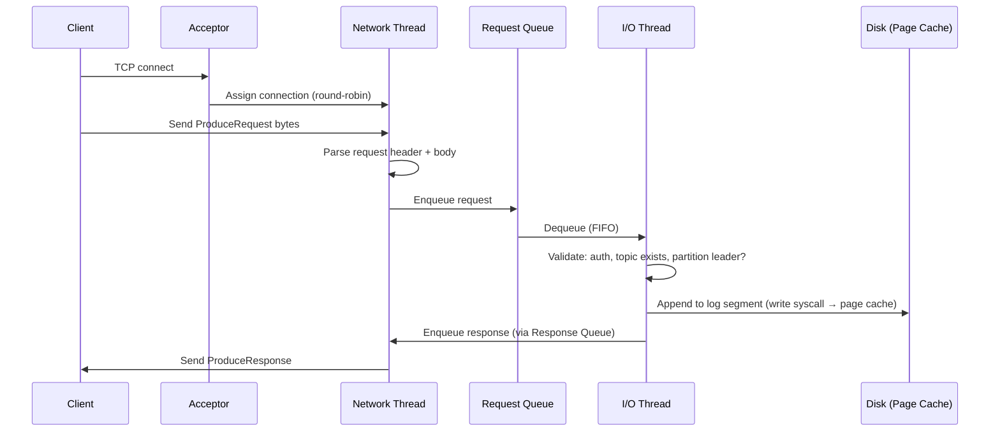
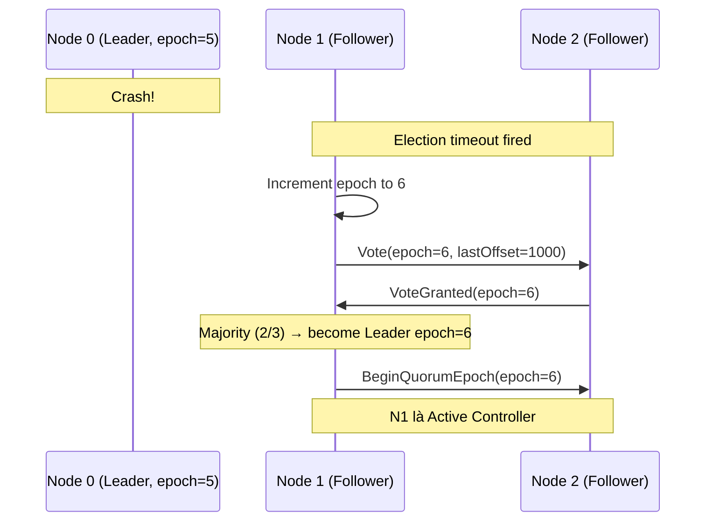
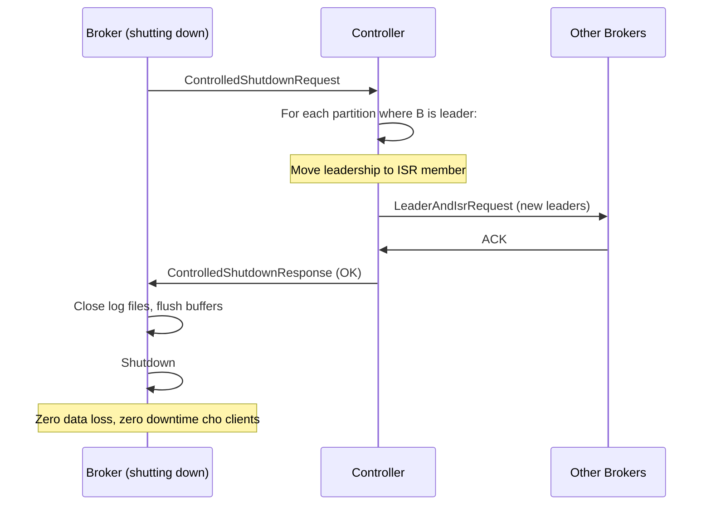

## Mục lục

- [Bối cảnh: Một broker xử lý 800.000 requests/s như thế nào?](#1-bối-cảnh-một-broker-xử-lý-800000-requestss-như-thế-nào)
- [Request Handling Pipeline — Reactor pattern](#2-request-handling-pipeline--reactor-pattern)
- [Purgatory — Delayed operations](#3-purgatory--delayed-operations)
- [Controller — Bộ não của cluster](#4-controller--bộ-não-của-cluster)
- [KRaft — Raft consensus thay ZooKeeper](#5-kraft--raft-consensus-thay-zookeeper)
- [Replication Protocol — Fetch-based, pull model](#6-replication-protocol--fetch-based-pull-model)
- [ISR Management — Shrink & Expand internals](#7-isr-management--shrink--expand-internals)
- [Leader Election — Khi broker crash](#8-leader-election--khi-broker-crash)
- [Unclean Leader Election — Data loss trade-off](#9-unclean-leader-election--data-loss-trade-off)
- [Broker Startup & Shutdown — Graceful vs Crash](#10-broker-startup--shutdown--graceful-vs-crash)
- [Inter-Broker Communication Protocol](#11-inter-broker-communication-protocol)
- [Disk Layout & Log Manager](#12-disk-layout--log-manager)
- [Quotas & Throttling — Multi-tenant isolation](#13-quotas--throttling--multi-tenant-isolation)
- [Common Pitfalls & Tuning](#14-common-pitfalls--tuning)
- [Tóm tắt — Cheat sheet](#15-tóm-tắt--cheat-sheet)

---

## 1. Bối cảnh: Một broker xử lý 800.000 requests/s như thế nào?

Kafka broker là một **Java process** (JVM). Không có magic hardware — chỉ là software trên commodity server. Nhưng một broker đơn lẻ (32 cores, 128GB RAM, 12 SSD RAID-10) có thể handle:

- **800.000+ ProduceRequests/s** (batched)
- **2 GB/s** write throughput
- **3 GB/s** read throughput (consumers + replication)
- **~3ms** p99 produce latency (acks=1)

Bí quyết: **Reactor pattern** + **zero-copy** + **OS page cache** + **sequential I/O**.

> [!IMPORTANT]
> Kafka broker **KHÔNG** là single-threaded. Nó dùng mô hình **multi-threaded Reactor** giống Nginx/Netty: tách rõ network I/O khỏi disk I/O, cho phép tận dụng tối đa CPU và disk parallelism mà không cần lock nặng.

---

## 2. Request Handling Pipeline — Reactor pattern

### 2.1. Thread model

```
┌─────────────────────────────────────────────────────────────────────────┐
│                        KAFKA BROKER REQUEST PIPELINE                     │
├─────────────────────────────────────────────────────────────────────────┤
│                                                                         │
│  Clients ─────┐                                                         │
│               ▼                                                         │
│  ┌──────────────────┐                                                   │
│  │  Acceptor Thread  │  1 per listener (port 9092)                      │
│  │  (accept TCP)     │  Accept connection → assign to Network Thread    │
│  └────────┬─────────┘                                                   │
│           │ round-robin                                                  │
│  ┌────────▼─────────┐                                                   │
│  │  Network Threads  │  num.network.threads = 3 (default)               │
│  │  (NIO Selector)   │  Read request → enqueue → dequeue response → write│
│  └────────┬─────────┘                                                   │
│           │                                                             │
│  ┌────────▼──────────────────────┐                                      │
│  │       Request Queue            │  queued.max.requests = 500          │
│  │  (bounded blocking queue)      │                                     │
│  └────────┬──────────────────────┘                                      │
│           │                                                             │
│  ┌────────▼─────────┐                                                   │
│  │   I/O Threads     │  num.io.threads = 8 (default)                    │
│  │  (Request Handler)│  Process request: validate → write log → respond │
│  └────────┬─────────┘                                                   │
│           │                                                             │
│  ┌────────▼──────────────────────┐                                      │
│  │      Response Queue            │  (per Network Thread)               │
│  │  (unbounded)                   │                                     │
│  └───────────────────────────────┘                                      │
│                                                                         │
└─────────────────────────────────────────────────────────────────────────┘
```

### 2.2. Từng bước xử lý ProduceRequest



### 2.3. Tại sao tách Network và I/O threads?

| Thread type | Blocking on | Nếu gộp chung |
|-------------|-------------|----------------|
| Network Thread | Socket read/write (fast, NIO non-blocking) | Bị block bởi slow disk → connection starvation |
| I/O Thread | Disk write (có thể slow khi page cache miss) | Bị block bởi slow client → waste CPU |

Tách ra → Network thread luôn responsive cho connections mới, I/O thread chuyên xử lý logic + disk.

---

## 3. Purgatory — Delayed operations

### 3.1. Bài toán: acks=all cần chờ followers

Khi Producer gửi với `acks=all`, I/O Thread **không thể** trả response ngay — phải chờ tất cả ISR replicate xong. Nhưng nếu I/O Thread block chờ → exhaust I/O thread pool → broker chết.

### 3.2. Giải pháp: Request Purgatory

```
┌──────────────────────────────────────────────────────────────────┐
│                     REQUEST PURGATORY                             │
│                                                                  │
│  Delayed operation được "park" ở đây cho đến khi:                │
│    (1) Condition thỏa mãn (ISR all ack)    → complete + respond  │
│    (2) Timeout (request.timeout.ms)         → error response     │
│                                                                  │
│  Kiểu "condition variable" — I/O Thread KHÔNG block              │
│                                                                  │
│  Operations trong Purgatory:                                     │
│  • DelayedProduce: chờ ISR ack (acks=all)                       │
│  • DelayedFetch: chờ đủ data (fetch.min.bytes)                   │
│  • DelayedJoin: chờ tất cả consumers join (rebalance)            │
│  • DelayedHeartbeat: chờ heartbeat timeout                       │
└──────────────────────────────────────────────────────────────────┘
```

### 3.3. Timing Wheel — Efficient timeout management

Purgatory dùng **Hierarchical Timing Wheel** để quản lý hàng triệu delayed operations mà không tốn CPU polling:

```
Timing Wheel (tickMs=1ms, wheelSize=20, interval=20ms):
┌────┬────┬────┬────┬────┬────┬────┬────┬────┬────┬─...─┬────┐
│ t0 │ t1 │ t2 │ t3 │ t4 │ t5 │ t6 │ t7 │ t8 │ t9 │     │t19│
│[op]│    │[op]│    │    │[op]│    │    │    │    │     │    │
└────┴────┴────┴────┴────┴────┴────┴────┴────┴────┴─...─┴────┘
  ↑ current tick

Mỗi tick advance 1 slot. Operations trong slot hiện tại: check condition hoặc expire.
Insert: O(1). Expire: O(1). Tốt hơn priority queue (O(log n) per operation).
```

---

## 4. Controller — Bộ não của cluster

### 4.1. Vai trò Controller

**Controller** là một broker đặc biệt (elected) chịu trách nhiệm **cluster-level metadata management**:

| Trách nhiệm | Chi tiết |
|-------------|---------|
| Leader election | Khi broker die, chọn leader mới cho mỗi partition |
| ISR changes | Xử lý ISR shrink/expand notifications |
| Topic creation/deletion | Assign partitions cho brokers, cập nhật metadata |
| Broker registration | Track broker liveness |
| Partition reassignment | Rebalance partitions khi thêm/bớt broker |

### 4.2. Controller election (ZooKeeper mode)

```
Khi cluster khởi động (ZK mode):
1. Mỗi broker try tạo ephemeral znode /controller
2. Broker đầu tiên tạo được → CONTROLLER
3. Các broker khác watch znode /controller
4. Nếu controller die → ephemeral node mất → watch fire
5. Các broker còn lại race tạo /controller mới → broker đầu tiên thắng

┌─────────────────────────────────────────────┐
│ ZooKeeper znodes cho Kafka:                 │
│                                             │
│ /controller         → {"brokerid": 1, ...}  │  ← ephemeral
│ /brokers/ids/0      → broker 0 info         │  ← ephemeral
│ /brokers/ids/1      → broker 1 info         │  ← ephemeral
│ /brokers/topics/orders → partition map      │
│ /admin/reassign_partitions → pending moves  │
└─────────────────────────────────────────────┘
```

---

## 5. KRaft — Raft consensus thay ZooKeeper

### 5.1. Tại sao bỏ ZooKeeper?

| Vấn đề ZooKeeper | KRaft solution |
|-------------------|----------------|
| External dependency (cần cluster riêng) | Metadata quorum chạy trong Kafka brokers |
| Bottleneck metadata updates (ZK watches) | Event-driven log-based replication |
| Giới hạn ~200K partitions (ZK session overhead) | Millions of partitions |
| Split-brain scenarios | Raft guarantees (leader uniqueness per term) |
| Operational complexity (2 clusters) | Một cluster duy nhất |

### 5.2. KRaft Architecture

```
┌─────────────────────────────────────────────────────────────────────────┐
│                        KRAFT CLUSTER                                     │
├─────────────────────────────────────────────────────────────────────────┤
│                                                                         │
│  Controller Quorum (3 voters):                                          │
│  ┌────────────┐   ┌────────────┐   ┌────────────┐                      │
│  │ Controller │   │ Controller │   │ Controller │                      │
│  │  (LEADER)  │   │ (FOLLOWER) │   │ (FOLLOWER) │                      │
│  │  Node 0    │   │  Node 1    │   │  Node 2    │                      │
│  └─────┬──────┘   └─────┬──────┘   └─────┬──────┘                      │
│        │                 │                 │                             │
│        └────── Raft Log (__cluster_metadata topic) ──────┘              │
│                                                                         │
│  Broker Nodes (data plane):                                             │
│  ┌────────────┐   ┌────────────┐   ┌────────────┐                      │
│  │  Broker 3  │   │  Broker 4  │   │  Broker 5  │                      │
│  │(fetch meta)│   │(fetch meta)│   │(fetch meta)│                      │
│  └────────────┘   └────────────┘   └────────────┘                      │
│                                                                         │
│  Combined mode: Controller + Broker trong cùng 1 process (dev/small)    │
└─────────────────────────────────────────────────────────────────────────┘
```

### 5.3. Metadata Log — __cluster_metadata

KRaft lưu **toàn bộ cluster metadata** dưới dạng replicated log (giống commit log thường):

```
__cluster_metadata topic (single partition, RF = controller quorum size):
[epoch=1: BrokerRegistration(id=0)]
[epoch=1: TopicCreation(orders, 6 partitions)]
[epoch=1: PartitionAssignment(orders-0 → leader:0, replicas:[0,1,2])]
[epoch=2: ISRChange(orders-0, ISR=[0,1])]  ← follower 2 bị lag
[epoch=2: LeaderChange(orders-0, leader:1)] ← broker 0 down
...
```

Mỗi broker **fetch metadata log** và apply locally → **eventually consistent** view of cluster state.

### 5.4. Raft Leader Election trong KRaft



---

## 6. Replication Protocol — Fetch-based, pull model

### 6.1. Followers PULL từ Leader (không phải push)

```
┌─────────────────────────────────────────────────────────────┐
│ Replication = Followers gửi FetchRequest đến Leader          │
│ (cùng API mà Consumer dùng, khác ở replica.id != -1)        │
│                                                             │
│  Leader (Broker 1):                                         │
│  Partition 0: [0][1][2][3][4][5][6][7][8][9]  LEO=10        │
│                                                             │
│  Follower (Broker 2):                                       │
│  Partition 0: [0][1][2][3][4][5][6][7]        LEO=8         │
│               │                                             │
│               └─ FetchRequest(offset=8) ──▶ Leader          │
│                  Leader trả records [8][9]                   │
│               ◀── FetchResponse ──────────                  │
│               append [8][9] → LEO=10                        │
└─────────────────────────────────────────────────────────────┘
```

### 6.2. Replica Fetcher Thread

Mỗi follower broker chạy **ReplicaFetcherThread** cho mỗi source broker:

```
Broker 2 follow 5 partitions từ Broker 1:
  ReplicaFetcherThread-0-1 (fetch từ broker 1)
    → Batch fetch: FetchRequest([P0:offset=8, P1:offset=100, P3:offset=50, ...])
    → 1 request cho nhiều partitions → ít overhead

num.replica.fetchers = 1 (default)
  → 1 thread per source broker
  → Tăng lên 2-4 nếu replication lag cao
```

### 6.3. Fetch pipelining

Followers fetch liên tục trong tight loop. `replica.fetch.wait.max.ms` (default 500ms) = max time Leader hold request khi chưa có data mới (long-poll, giảm empty fetch overhead).

---

## 7. ISR Management — Shrink & Expand internals

### 7.1. ISR Shrink — Follower bị loại

```
Condition: Follower chưa fetch trong replica.lag.time.max.ms (default 30s)

Timeline:
T=0s:    Follower last fetch successful. Leader LEO=100.
T=5s:    Leader LEO=200. Follower chưa fetch (network issue).
T=10s:   Leader LEO=350. Follower vẫn chưa fetch.
T=30s:   Leader LEO=1000. Follower chưa fetch > 30s
         → Leader đánh dấu follower OUT-OF-SYNC
         → ISR shrink: {Leader, F1, F2} → {Leader, F1}
         → Update metadata (AlterISR request → Controller)
```

### 7.2. ISR Expand — Follower quay lại

```
Condition: Follower LEO >= Leader HW (High Watermark)

Timeline:
T=30s:   Follower bị loại ISR. Follower LEO=100, Leader HW=800.
T=31s:   Follower recover, start fetching aggressively
T=35s:   Follower LEO=500 (catching up...)
T=40s:   Follower LEO=800 >= Leader HW=800
         → Leader thêm follower vào ISR
         → ISR expand: {Leader, F1} → {Leader, F1, F2}
```

### 7.3. High Watermark advance

```
HW = min(LEO of all ISR members)

Khi follower report fetch offset trong FetchRequest:
  Leader cập nhật remote LEO → tính lại HW
  HW tăng → consumer có thể đọc thêm messages

Producer (acks=all) response khi: HW advance qua offset vừa ghi
```

---

## 8. Leader Election — Khi broker crash

### 8.1. Clean leader election (ISR non-empty)

```
Broker 1 (Leader P0) crash:
1. Controller detect qua heartbeat timeout (hoặc ZK session expire)
2. Controller chọn leader mới từ ISR: first member of ISR list
3. Controller gửi LeaderAndIsrRequest tới new leader
4. New leader bắt đầu accept produce/fetch requests
5. Controller update metadata → broadcast UpdateMetadata tới all brokers
6. Clients refresh metadata → redirect requests tới new leader

Thời gian: ~100ms - 1s (tùy cluster size và detection speed)
```

### 8.2. Preferred leader election

Mỗi partition có **preferred leader** (broker đầu tiên trong replica list). Controller chạy **auto leader rebalance** (default `auto.leader.rebalance.enable=true`) mỗi 300s để move leadership về preferred replica → distribute load đều.

---

## 9. Unclean Leader Election — Data loss trade-off

### 9.1. Scenario

```
RF=3, ISR={B1(Leader), B2, B3}
Bước 1: B2, B3 bị lag → ISR shrink thành {B1}
Bước 2: B1 crash → ISR = {} (trống!)

Không ai trong ISR còn sống. Hai lựa chọn:
  (A) unclean.leader.election.enable=false (DEFAULT)
      → Partition OFFLINE cho đến khi B1 recover
      → KHÔNG mất data, nhưng MẤT availability

  (B) unclean.leader.election.enable=true
      → Cho B2 hoặc B3 (out-of-sync) làm leader
      → CÓ availability, nhưng MẤT DATA (messages B2/B3 chưa có)
```

### 9.2. Khi nào dùng?

| Scenario | Recommendation |
|----------|---------------|
| Financial transactions | `false` — KHÔNG BAO GIỜ mất data |
| Metrics/logs (tolerant) | `true` — availability quan trọng hơn |
| CDC (changelog) | `false` — mất event = inconsistent state |

> [!WARNING]
> Unclean election có thể gây **divergent replicas**: B2 trở thành leader với data khác B1. Khi B1 recover, nó phải **truncate** log về HW của B2 → messages mất vĩnh viễn. Đây là **không thể undo**.

---

## 10. Broker Startup & Shutdown — Graceful vs Crash

### 10.1. Graceful shutdown (controlled.shutdown.enable=true)



### 10.2. Hard crash

```
Broker crash (kill -9, power loss):
1. Controller detect failure (heartbeat timeout: broker.session.timeout.ms = 18s)
2. Controller elect new leaders cho affected partitions
3. Khi broker restart:
   a. Load all log segments
   b. Rebuild in-memory index từ .log files (nếu .index corrupted)
   c. Truncate logs > HW (có thể có uncommitted messages)
   d. Register với Controller
   e. Start fetching từ new leaders
```

### 10.3. Recovery time factors

| Factor | Impact |
|--------|--------|
| Số partitions trên broker | Mỗi partition cần load index |
| `num.recovery.threads.per.data.dir` | Parallel log recovery (default 1, tăng!) |
| Unclean segments | Cần scan toàn bộ để rebuild index |
| `log.flush.interval.messages` | Nếu đã fsync → ít data cần recover |

---

## 11. Inter-Broker Communication Protocol

### 11.1. Binary protocol (custom TCP)

Kafka dùng **custom binary protocol** (không phải HTTP/gRPC):

```
Request format:
┌──────────────────────────────────────────────────────┐
│ Size (4 bytes) │ API Key (2) │ API Version (2) │     │
│ Correlation ID (4) │ Client ID (string) │ Body (...) │
└──────────────────────────────────────────────────────┘

Mỗi API có key riêng:
  0  = Produce
  1  = Fetch
  3  = Metadata
  4  = LeaderAndIsr
  6  = UpdateMetadata
  22 = InitProducerId
  ...
```

### 11.2. API versioning

Mỗi API support multiple versions (backward compatible). Client gửi ApiVersionsRequest trước để biết broker support version nào → dùng version cao nhất cả hai support.

---

## 12. Disk Layout & Log Manager

### 12.1. Multi-disk support

```yaml
# server.properties
log.dirs=/data/kafka-logs-1,/data/kafka-logs-2,/data/kafka-logs-3

# Kafka phân bổ partitions across disks (round-robin khi tạo)
/data/kafka-logs-1/orders-0/    ← Partition 0
/data/kafka-logs-2/orders-1/    ← Partition 1
/data/kafka-logs-3/orders-2/    ← Partition 2
/data/kafka-logs-1/orders-3/    ← Partition 3 (quay lại disk 1)
```

### 12.2. Log Manager responsibilities

```
LogManager:
├── Startup: load all logs, recover unclean segments
├── Background threads:
│   ├── Log Retention: xóa segments quá retention (1 thread default)
│   ├── Log Flusher: periodic fsync (nếu configured)
│   ├── Log Cleaner: compaction (num.cleaner.threads, default 1)
│   └── Checkpoint: ghi recovery-point-offset-checkpoint mỗi 60s
└── Shutdown: flush + close all logs
```

---

## 13. Quotas & Throttling — Multi-tenant isolation

### 13.1. Quota types

| Quota | Unit | Áp dụng cho |
|-------|------|-------------|
| `producer_byte_rate` | bytes/sec | Limit produce throughput per client |
| `consumer_byte_rate` | bytes/sec | Limit fetch throughput per client |
| `request_percentage` | % of I/O threads | Limit CPU per client |
| `controller_mutation_rate` | mutations/sec | Limit topic create/delete |

### 13.2. Throttling mechanism

Khi client vượt quota, broker **delay response** (không reject):

```
Client gửi Produce 10MB/s, quota = 5MB/s:
  → Broker ghi bình thường
  → Response bao gồm throttle_time_ms = 1000
  → Client (well-behaved) sleep 1s trước request tiếp
  → Nếu client không sleep → broker delay gửi response 1s (server-side throttle)
```

---

## 14. Common Pitfalls & Tuning

| Pitfall | Triệu chứng | Root cause | Fix |
|---------|-------------|-----------|-----|
| Request queue full | `RequestQueueSize` spike, timeout | I/O threads quá ít so với load | Tăng `num.io.threads` (= 2× cores) |
| Uneven partition distribution | 1 broker hot, khác idle | Partitions không balanced | Run `kafka-reassign-partitions` |
| Slow recovery after crash | Broker offline 10+ phút | Nhiều partitions, single recovery thread | Tăng `num.recovery.threads.per.data.dir=4` |
| Network thread saturation | Connection drops | Quá nhiều connections per broker | Tăng `num.network.threads`, dùng connection pooling |
| Controller overload | Leader election slow (>30s) | >10K partitions, single controller thread | Upgrade to KRaft, giảm partitions per broker |
| Disk I/O bottleneck | High `request-latency-avg` | Page cache miss, consumer catch-up | Thêm RAM, hoặc tách data disks |

---

## 15. Tóm tắt — Cheat sheet

```
BROKER REQUEST PIPELINE (Reactor Pattern):
  Client → Acceptor → Network Thread (NIO) → Request Queue
                                                    ↓
  Client ← Network Thread ← Response Queue ← I/O Thread (disk + logic)

CONTROLLER (cluster brain):
  ZK mode: ephemeral znode election, single controller broker
  KRaft:   Raft consensus, 3-node quorum, __cluster_metadata log

REPLICATION (pull model):
  Followers FetchRequest → Leader → FetchResponse (same API as consumers)
  ISR = followers caught up within replica.lag.time.max.ms (30s)
  HW = min(LEO of ISR) → consumer visibility boundary

LEADER ELECTION:
  Clean: pick first ISR member (no data loss)
  Unclean: pick out-of-sync replica (data loss, availability)

5 NGUYÊN TẮC:
1. Network threads xử lý socket, I/O threads xử lý logic — ĐỪNG gộp
2. Purgatory giữ acks=all requests không block I/O threads
3. KRaft thay ZooKeeper — metadata là replicated log
4. ISR = safety net — min.insync.replicas=2 cho production
5. Graceful shutdown = zero downtime — luôn preferred trước kill -9
```
