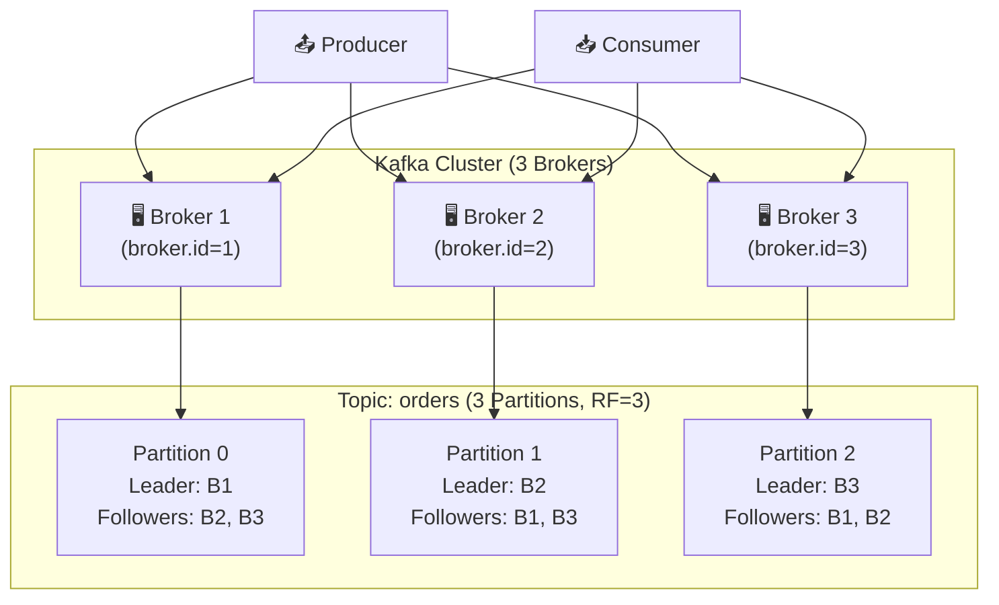
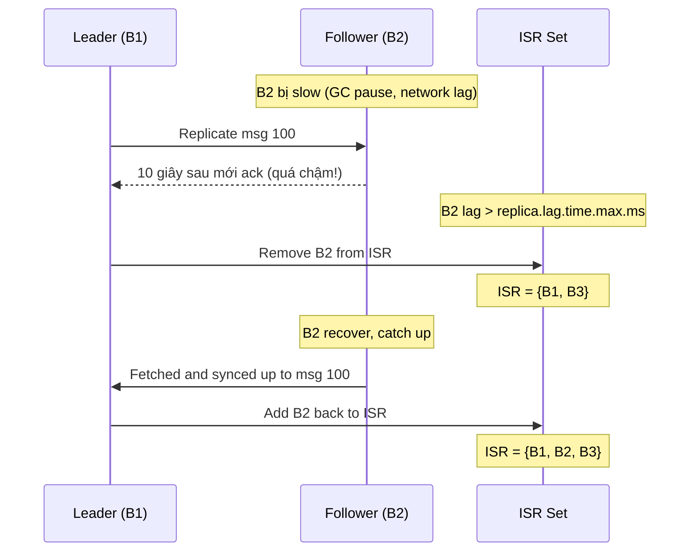

# Brokers & Cluster

## Mục lục

- [Broker là gì?](#broker-là-gì)
- [Kafka Cluster Architecture](#kafka-cluster-architecture)
- [Leader và Follower](#leader-và-follower)
- [ISR — In-Sync Replicas](#isr--in-sync-replicas)
- [Replication Factor](#replication-factor)
- [Fault Tolerance Scenarios](#fault-tolerance-scenarios)
- [Cluster Configuration](#cluster-configuration)

---

## Broker là gì?

**Broker** là một Kafka server node — process Java chạy trên máy chủ, chịu trách nhiệm:
- Nhận messages từ Producers
- Lưu trữ messages vào disk (commit log)
- Phục vụ messages cho Consumers
- Replication với các brokers khác

```
┌─────────────────────────────────────────────────┐
│                  Kafka Broker                   │
├─────────────────────────────────────────────────┤
│                                                 │
│  ┌──────────────┐  ┌──────────────┐             │
│  │  Partition 0 │  │  Partition 2 │             │
│  │  (Leader)    │  │  (Follower)  │             │
│  │              │  │              │             │
│  │ Log Segment  │  │ Log Segment  │             │
│  │ [0, 1, 2...] │  │ [0, 1, 2...] │             │
│  └──────────────┘  └──────────────┘             │
│                                                 │
│  Network Layer (Producers ↔ Consumers)          │
│  Storage Layer (Disk-based Commit Log)          │
└─────────────────────────────────────────────────┘
```

| Component | Mô tả | Analogy |
|-----------|-------|---------|
| **Broker** | Kafka server node | Bưu cục chi nhánh |
| **Topic** | Danh mục message logic | Nhãn hộp thư |
| **Partition** | Phân đoạn log có thứ tự | Ngăn hộp thư cụ thể |
| **Leader** | Xử lý tất cả reads/writes / replica primary | Nhân viên tại quầy |
| **Follower** | Sao lưu dữ liệu từ leader | Bản sao lưu trữ |
| **ISR** | Replicas đã sync đầy đủ với leader | Bản sao đã xác thực |

---

## Kafka Cluster Architecture

Một Kafka cluster gồm nhiều brokers hoạt động cùng nhau:



**Phân bố load tự động**: Kafka phân phối partition leaders đều giữa các brokers để cân bằng tải.

---

## Leader và Follower

Mỗi partition có một **Leader** và nhiều **Followers** (Replicas):

```
┌──────────────────────────────────────────────────────────────────────┐
│          Topic: orders — Partition 0 — Replication Flow              │
├──────────────────────────────────────────────────────────────────────┤
│                                                                      │
│   Producer ──────────────────────────▶ Leader (Broker 1)             │
│                               Write     │                            │
│                              Request    │  Replicate                 │
│                                         ├──────────────▶ Follower    │
│                                         │              (Broker 2)    │
│                                         │                            │
│                                         └──────────────▶ Follower    │
│                                                        (Broker 3)    │
│                                                                      │
│   Consumer ──────────────────────────▶ Leader (Broker 1)             │
│                               Read      (ONLY Leader serves reads)   │
└──────────────────────────────────────────────────────────────────────┘
```

**Nguyên tắc quan trọng:**
- **Chỉ Leader** nhận reads và writes từ Producers/Consumers
- **Followers** passively pull data từ Leader để sao chép
- Nếu Leader fail → một Follower trong ISR được **elect** thành Leader mới

---

## ISR — In-Sync Replicas

**ISR (In-Sync Replicas)** là tập hợp replicas đã **catch up đầy đủ** với Leader.

```
Broker 1 (Leader P0):  [msg0, msg1, msg2, msg3, msg4]  ← Latest
Broker 2 (Follower):   [msg0, msg1, msg2, msg3, msg4]  ← In-Sync ✅
Broker 3 (Follower):   [msg0, msg1, msg2]               ← Lagging ❌ Out of ISR

ISR = {Broker1, Broker2}
```

### ISR và `acks` Setting

Cấu hình `acks` của Producer quyết định bao nhiêu replicas phải xác nhận trước khi message được coi là "committed":

| `acks` | Ý nghĩa | Độ bền | Throughput | Rủi ro |
|--------|---------|-------|-----------|-------|
| `0` | Không chờ ack nào | ❌ Thấp nhất | ✅ Cao nhất | Mất data khi broker fail |
| `1` | Chờ Leader ack | ⚠️ Trung bình | ✅ Cao | Mất data nếu Leader fail trước khi replicate |
| `all` | Chờ tất cả ISR ack | ✅ Cao nhất | ⚠️ Thấp hơn | Không mất data nếu ISR > 1 |

> [!IMPORTANT]
> `acks=all` chỉ an toàn khi ISR có **ít nhất 2 replicas**. Nếu chỉ còn 1 replica (Leader) trong ISR → `acks=all` vẫn return sau khi Leader ack, dễ mất data.
>
> Dùng `min.insync.replicas=2` để đảm bảo tối thiểu 2 replicas phải trong ISR.

---

## Replication Factor

**Replication Factor (RF)** = số bản sao của mỗi partition.

```
Replication Factor = 3:

Partition 0: [Broker1 LEADER] [Broker2 follower] [Broker3 follower]
Partition 1: [Broker2 LEADER] [Broker1 follower] [Broker3 follower]
Partition 2: [Broker3 LEADER] [Broker1 follower] [Broker2 follower]

→ Cluster có thể mất 2 brokers và vẫn hoạt động bình thường
```

**Rule of thumb:**
- Dev/Test: RF = 1 (không cần HA)
- Production: **RF = 3** — tiêu chuẩn công nghiệp
- Mission-critical: RF = 3 + `min.insync.replicas = 2`

### Tạo topic với replication factor

```bash
kafka-topics.sh --bootstrap-server localhost:9092 \
    --create \
    --topic orders \
    --partitions 6 \
    --replication-factor 3
```

### Cấu hình trong Spring Boot (Topic tự động tạo)

```java
@Configuration
public class KafkaTopicConfig {

    @Bean
    public NewTopic ordersTopic() {
        return TopicBuilder.name("orders")
            .partitions(6)
            .replicas(3)
            .config(TopicConfig.MIN_IN_SYNC_REPLICAS_CONFIG, "2")
            .build();
    }
}
```

---

## Fault Tolerance Scenarios

### Kịch bản 1: Broker thông thường fail

```
Trước:
Broker 1 (Leader P0): ✅ Active → serving reads/writes
Broker 2 (Follower P0): ✅ ISR
Broker 3 (Follower P0): ✅ ISR

💥 Broker 1 fail

Sau: (~seconds)
Broker 2: 🆕 Elected as new Leader (vì trong ISR)
Broker 3 (Follower P0): ✅ ISR
ISR = {Broker2, Broker3}

→ Downtime: thường < 30 giây (election + client reconnect)
→ Không mất data (vì Broker 2 đã có toàn bộ data)
```

### Kịch bản 2: Broker lag → Bị loại khỏi ISR



---

## Cluster Configuration

### Broker Configuration cơ bản

```properties
# server.properties
broker.id=1
listeners=PLAINTEXT://0.0.0.0:9092
log.dirs=/var/kafka/logs

# Replication
default.replication.factor=3
min.insync.replicas=2

# Retention
log.retention.hours=168     # 7 days
log.retention.bytes=-1       # Unlimited by size
log.segment.bytes=1073741824 # 1GB per segment

# Performance
num.network.threads=8
num.io.threads=16
socket.send.buffer.bytes=102400
socket.receive.buffer.bytes=102400
```

### Monitoring Cluster Health

```bash
# Xem tất cả topics và partition detail
kafka-topics.sh --bootstrap-server localhost:9092 --describe --topic orders

# Output:
# Topic: orders   PartitionCount: 6   ReplicationFactor: 3
# Topic: orders   Partition: 0   Leader: 1   Replicas: 1,2,3   Isr: 1,2,3
# Topic: orders   Partition: 1   Leader: 2   Replicas: 2,1,3   Isr: 2,1,3
# ...

# Kiểm tra under-replicated partitions (ISR < RF)
kafka-topics.sh --bootstrap-server localhost:9092 \
    --describe --under-replicated-partitions

# Xem leader distribution
kafka-topics.sh --bootstrap-server localhost:9092 \
    --describe --unavailable-partitions
```

> [!WARNING]
> Nếu thấy **under-replicated partitions** trong production → **khẩn cấp**. Một broker đang bị lag hoặc đã down. Cluster dễ mất data nếu thêm một broker nữa fail.

<Cards>
  <Card title="Topics & Partitions" href="/core-concepts/topics-partitions/" description="Cấu trúc topic, partition, log append và retention" />
  <Card title="Producers" href="/core-concepts/producers/" description="Cách producer gửi message, batching và acks" />
  <Card title="Partitioning Strategy" href="/core-concepts/partitioning-strategy/" description="Keys, hot partitions và các giải pháp" />
</Cards>
