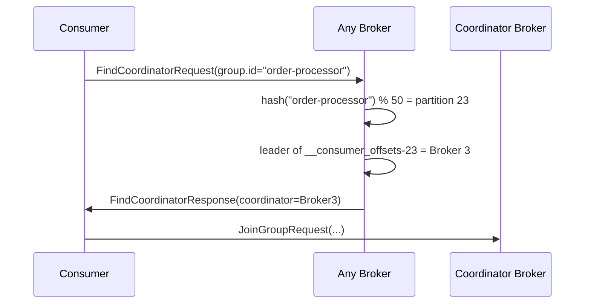
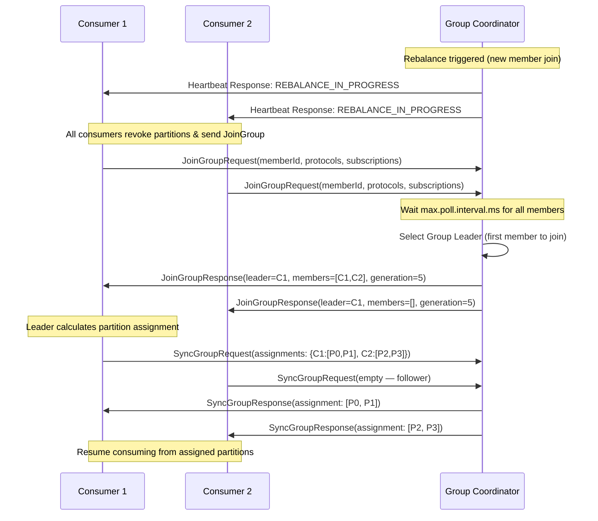
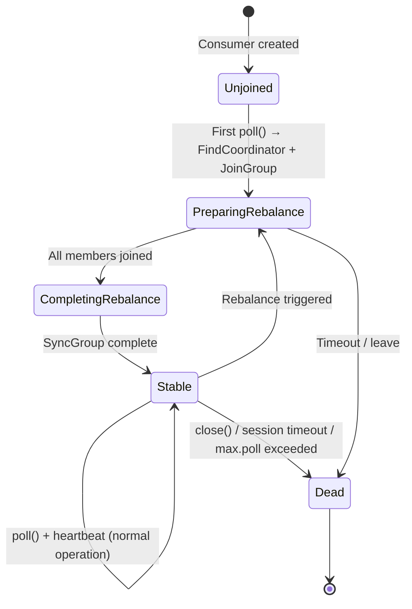
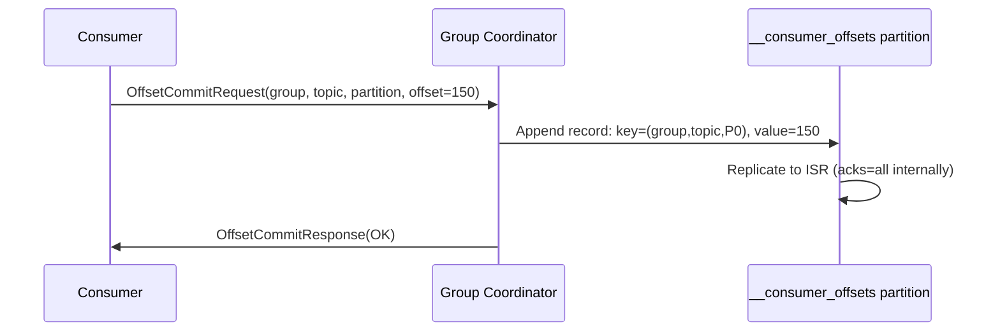

## Mục lục

- [Bối cảnh: Rebalance 45 giây — ứng dụng tê liệt](#1-bối-cảnh-rebalance-45-giây--ứng-dụng-tê-liệt)
- [Consumer Group — Model phân phối partition](#2-consumer-group--model-phân-phối-partition)
- [Group Coordinator — Broker chuyên trách](#3-group-coordinator--broker-chuyên-trách)
- [Rebalance Protocol — JoinGroup/SyncGroup flow](#4-rebalance-protocol--joingroupsyncgroup-flow)
- [Partition Assignment Strategies](#5-partition-assignment-strategies)
- [Heartbeat Thread — Liveness detection](#6-heartbeat-thread--liveness-detection)
- [Eager Rebalance — Stop-the-World problem](#7-eager-rebalance--stop-the-world-problem)
- [Cooperative Sticky Rebalance — Incremental revolution](#8-cooperative-sticky-rebalance--incremental-revolution)
- [Static Group Membership — Tránh rebalance khi rolling restart](#9-static-group-membership--tránh-rebalance-khi-rolling-restart)
- [Consumer Lifecycle States](#10-consumer-lifecycle-states)
- [Session Timeout vs Heartbeat vs Max Poll Interval](#11-session-timeout-vs-heartbeat-vs-max-poll-interval)
- [Group Coordinator Internals — __consumer_offsets](#12-group-coordinator-internals--__consumer_offsets)
- [Multi-Group Pattern — Fan-Out & Isolation](#13-multi-group-pattern--fan-out--isolation)
- [Common Pitfalls & Production Tuning](#14-common-pitfalls--production-tuning)
- [Tóm tắt — Cheat sheet](#15-tóm-tắt--cheat-sheet)

---

## 1. Bối cảnh: Rebalance 45 giây — ứng dụng tê liệt

Team bạn chạy **payment processing service** với 6 instances, subscribe topic `payments` (12 partitions). Mỗi lần deploy rolling restart:

```
Instance 1 shutdown:
  → Rebalance triggered (stop ALL consumers 45s)
  → TOÀN BỘ 6 instances DỪNG xử lý payment trong 45 giây
  → Payment queue backlog tăng lên 500.000 messages
  → Alert "consumer lag critical" fire khắp nơi

Instance 1 restart:
  → Rebalance TRIGGERED LẠI (thêm 45s nữa!)
  → Tổng downtime = 90 giây cho 1 instance restart
```

Với 6 instances rolling restart = **6 × 90s = 9 phút** gần như không xử lý payment. Đây là **Eager Rebalance problem** — và là lý do Kafka phát triển Cooperative Rebalance và Static Membership.

> [!IMPORTANT]
> Rebalance là "necessary evil" của Consumer Groups. Hiểu cơ chế internal giúp bạn chọn đúng strategy: từ Eager (default cũ, stop-the-world) → Cooperative-Sticky (incremental) → Static Membership (avoid rebalance entirely). Mỗi cái trade-off khác nhau.

---

## 2. Consumer Group — Model phân phối partition

### 2.1. Rule cốt lõi

```
RULE: Trong 1 consumer group, mỗi partition chỉ được CHÍNH XÁC 1 consumer xử lý.
      Một consumer có thể xử lý nhiều partitions.

Topic: orders (6 partitions)
Group: order-processor

Scenario A: 3 consumers (< partitions)
  Consumer 1 → P0, P1       (2 partitions)
  Consumer 2 → P2, P3       (2 partitions)
  Consumer 3 → P4, P5       (2 partitions)
  → Load balanced

Scenario B: 6 consumers (= partitions)
  Consumer 1 → P0
  Consumer 2 → P1
  ...
  Consumer 6 → P5
  → Maximum parallelism

Scenario C: 8 consumers (> partitions)
  Consumer 1-6 → P0-P5 (mỗi consumer 1 partition)
  Consumer 7 → IDLE (không có partition nào)
  Consumer 8 → IDLE
  → WASTE! Thêm consumer vượt partitions = KHÔNG có lợi
```

### 2.2. Multiple Groups — Fan-Out pattern

```
Topic: user-events (4 partitions)

Group A: "analytics"          Group B: "notification"
  Consumer A1 → P0, P1          Consumer B1 → P0, P1, P2, P3
  Consumer A2 → P2, P3

  Cả 2 groups đọc CÙNG messages nhưng CỨ ĐỘC LẬP
  → Pub/Sub pattern: 1 message, N readers
  → Mỗi group track offset riêng
```

---

## 3. Group Coordinator — Broker chuyên trách

### 3.1. Ai là Group Coordinator?

Mỗi consumer group có **1 broker** đóng vai Group Coordinator. Chọn bằng:

```java
// Partition trong __consumer_offsets topic mà group này map tới:
int partitionId = Math.abs(groupId.hashCode() % offsetsTopicPartitionCount);  // 50 partitions

// Broker nào là LEADER của partition đó = Group Coordinator
Broker coordinator = leaderOf(__consumer_offsets, partitionId);
```

### 3.2. Coordinator responsibilities

| Trách nhiệm | Chi tiết |
|-------------|---------|
| **Group management** | Track members, handle JoinGroup/SyncGroup/Heartbeat |
| **Rebalance orchestration** | Trigger rebalance, fence zombie consumers |
| **Offset storage** | Ghi committed offsets vào `__consumer_offsets` |
| **Member timeout** | Detect dead consumers qua heartbeat |
| **Generation management** | Increment `generationId` mỗi rebalance |

### 3.3. FindCoordinator flow



---

## 4. Rebalance Protocol — JoinGroup/SyncGroup flow

### 4.1. Full rebalance sequence



### 4.2. Generation ID

Mỗi rebalance tăng `generationId`. Requests với generation cũ bị **reject** → fencing zombie consumers (consumer chậm từ generation cũ không thể commit offset).

### 4.3. Group Leader vs Group Coordinator

| | Group Coordinator | Group Leader |
|--|---|---|
| **Là ai** | Một **broker** | Một **consumer** (member) |
| **Chọn bằng** | hash(groupId) → partition leader | Coordinator chọn (first to join) |
| **Vai trò** | Orchestrate protocol, store offsets | **Tính toán partition assignment** |
| **Tại sao leader tính assignment** | Decouple logic khỏi broker → client-side flexibility, custom assignors |

---

## 5. Partition Assignment Strategies

### 5.1. Built-in strategies

| Strategy | Config value | Mô tả | Trade-off |
|----------|-------------|-------|-----------|
| **Range** | `org.apache.kafka.clients.consumer.RangeAssignor` | Chia range partitions per topic | Có thể uneven nếu #partitions không chia hết |
| **RoundRobin** | `...RoundRobinAssignor` | Round-robin across all partitions, all topics | Đều hơn Range, nhưng topic mới trigger full rebalance |
| **Sticky** | `...StickyAssignor` | Giữ assignment cũ càng nhiều càng tốt | Minimize partition movement khi rebalance |
| **CooperativeSticky** | `...CooperativeStickyAssignor` | Sticky + incremental rebalance | **RECOMMENDED** — no stop-the-world |

### 5.2. Range assignment example

```
Topic: orders (6 partitions), 4 consumers
  Range per topic: P_count / C_count = 6/4 = 1 extra

  C0: P0, P1   (2 partitions — gets extra)
  C1: P2, P3   (2 partitions — gets extra)
  C2: P4       (1 partition)
  C3: P5       (1 partition)

Problem: Nếu subscribe 3 topics × 6 partitions:
  C0 luôn nhận extra → uneven load!
```

### 5.3. Sticky assignment — Minimize movement

```
Trước rebalance (3 consumers, 6 partitions):
  C0: P0, P1
  C1: P2, P3
  C2: P4, P5

C2 leave → rebalance:

Range assignor (recalculate từ đầu):
  C0: P0, P1, P2   (3 partitions — 1 mới)
  C1: P3, P4, P5   (3 partitions — 2 mới, P2 mất)
  → 3 partitions di chuyển

Sticky assignor (giữ max cũ):
  C0: P0, P1, P4   (giữ P0,P1 + nhận P4 từ C2)
  C1: P2, P3, P5   (giữ P2,P3 + nhận P5 từ C2)
  → 2 partitions di chuyển (tối thiểu!)
```

---

## 6. Heartbeat Thread — Liveness detection

### 6.1. Heartbeat thread (background, tách riêng)

Từ Kafka 0.10.1+, consumer có **dedicated heartbeat thread** (tách khỏi poll thread):

```
┌─────────────────────────────────────────────────────────────────┐
│                     Consumer Instance                            │
├─────────────────────────────────────────────────────────────────┤
│                                                                 │
│  ┌─────────────────────┐      ┌──────────────────────────┐      │
│  │  Poll Thread         │      │  Heartbeat Thread         │      │
│  │  (your code)         │      │  (background, daemon)     │      │
│  │                     │      │                          │      │
│  │  while(true) {       │      │  while(true) {            │      │
│  │    records = poll(); │      │    sendHeartbeat();       │      │
│  │    process(records); │      │    sleep(heartbeat.ms);   │      │
│  │    commit();         │      │  }                        │      │
│  │  }                   │      │                          │      │
│  └─────────────────────┘      └──────────────────────────┘      │
│                                                                 │
└─────────────────────────────────────────────────────────────────┘
```

### 6.2. Tại sao tách heartbeat thread?

Trước 0.10.1, heartbeat gửi trong `poll()`. Nếu processing chậm (30s per batch) → heartbeat chậm → Coordinator nghĩ consumer chết → **unnecessary rebalance**.

Tách thread → heartbeat gửi đều đặn dù processing lâu. Coordinator dùng `max.poll.interval.ms` (riêng) để detect consumer "stuck" (poll quá chậm).

---

## 7. Eager Rebalance — Stop-the-World problem

### 7.1. Cơ chế Eager (trước Kafka 2.4)

```
Eager rebalance steps:
1. Coordinator gửi REBALANCE_IN_PROGRESS qua Heartbeat
2. TẤT CẢ consumers REVOKE MỌI partitions (stop processing)
3. Tất cả gửi JoinGroupRequest
4. Leader tính assignment
5. SyncGroup → consumers nhận assignment mới
6. Resume processing

Timeline:
  T=0s:    Rebalance triggered
  T=0.1s:  All consumers stop processing ← TOÀN BỘ DỪNG
  T=0.1-5s: JoinGroup (wait all members)
  T=5-10s: SyncGroup
  T=10s:   Resume
  TOTAL:   ~10-45 giây KHÔNG XỬ LÝ GÌ
```

### 7.2. Impact

```
6 consumers × 12 partitions, deploy 1 instance:
  Rebalance 1 (leave):  ALL 6 stop 30s
  Rebalance 2 (rejoin): ALL 6 stop 30s
  → 60s downtime cho 1 deploy

Rolling restart 6 instances:
  6 × 60s = 360s (6 phút!) partial/full downtime
```

---

## 8. Cooperative Sticky Rebalance — Incremental revolution

### 8.1. Key insight: Chỉ revoke partitions CẦN di chuyển

```
Cooperative rebalance:
1. Coordinator trigger rebalance
2. Leader tính assignment mới
3. CHỈ partitions cần di chuyển bị revoke
4. Consumers KHÔNG dừng partitions ổn định
5. 2 rebalance rounds (revoke → assign)

Timeline:
  T=0s:  Rebalance triggered
  T=0.1s: Round 1: Leader determines P4, P5 need to move from C2 to C0, C1
           → CHỈ C2 revoke P4, P5
           → C0, C1 TIẾP TỤC xử lý P0-P3 bình thường!
  T=5s:  Round 2: C0 nhận P4, C1 nhận P5
  T=5s:  Done — downtime chỉ cho 2/6 partitions
```

### 8.2. Config (Spring Boot)

```yaml
spring:
  kafka:
    consumer:
      properties:
        partition.assignment.strategy: org.apache.kafka.clients.consumer.CooperativeStickyAssignor
```

> [!WARNING]
> **Không thể mix** Eager và Cooperative assignors trong cùng group. Khi migrate: phải deploy tất cả consumers với Cooperative trước khi remove Eager khỏi config. Sai → `InconsistentGroupProtocolException`.

---

## 9. Static Group Membership — Tránh rebalance khi rolling restart

### 9.1. Vấn đề

Mỗi lần consumer restart, nó nhận `memberId` mới → Coordinator coi là "new member" → trigger rebalance.

### 9.2. Giải pháp: group.instance.id

```yaml
spring:
  kafka:
    consumer:
      properties:
        group.instance.id: payment-processor-1   # UNIQUE per instance, STABLE across restarts
        session.timeout.ms: 300000               # 5 phút — cho phép restart lâu mà không rebalance
```

### 9.3. Cơ chế

```
Static membership:
  Consumer start: JoinGroup(group.instance.id="pp-1")
  → Coordinator map "pp-1" → memberId="abc123"
  → Assignment: pp-1 → [P0, P1]

  Consumer restart (trong session.timeout):
  → JoinGroup(group.instance.id="pp-1")
  → Coordinator: "pp-1 quay lại? Giữ nguyên assignment!"
  → KHÔNG rebalance
  → Consumer resume P0, P1 ngay lập tức

  Chỉ rebalance nếu: session timeout hết mà instance chưa quay lại
```

### 9.4. Rolling restart với Static Membership

```
6 instances, session.timeout=300s, restart time < 60s:

T=0:   Stop instance 1 (instance.id="pp-1")
       → Coordinator: "pp-1 mất heartbeat, nhưng còn 300s timeout"
       → KHÔNG rebalance! 5 instances khác tiếp tục bình thường.
       → Partitions của pp-1 tạm KHÔNG ai xử lý (acceptable trade-off)
T=30s: Instance 1 restart, JoinGroup(instance.id="pp-1")
       → Coordinator: "pp-1 quay lại" → nhận lại P0, P1
       → KHÔNG rebalance
TOTAL DOWNTIME: 0 giây cho 5/6 instances, 30 giây cho 2/12 partitions
```

---

## 10. Consumer Lifecycle States



---

## 11. Session Timeout vs Heartbeat vs Max Poll Interval

### 11.1. Ba timers khác nhau

| Config | Default | Ai quản lý | Ý nghĩa |
|--------|---------|-----------|---------|
| `heartbeat.interval.ms` | 3000 (3s) | Consumer → Coordinator | Tần suất gửi heartbeat |
| `session.timeout.ms` | 45000 (45s) | Coordinator | Nếu không nhận heartbeat → consumer dead |
| `max.poll.interval.ms` | 300000 (5m) | Consumer internal | Nếu poll() không gọi → consumer "stuck" → leave group |

### 11.2. Mối quan hệ

```
session.timeout.ms > 3 × heartbeat.interval.ms
  (cần ít nhất 3 heartbeat misses trước khi coi là dead)

max.poll.interval.ms > longest processing time
  (nếu 1 batch mất 2 phút xử lý, set > 120s)
```

### 11.3. Scenario phân biệt

```
Scenario A: Network partition (heartbeat mất)
  Heartbeat thread chạy nhưng packets bị drop
  → 45s không nhận heartbeat → session timeout
  → Coordinator: consumer dead → rebalance
  → Consumer nhận REBALANCE → rejoin

Scenario B: Processing quá lâu (poll chậm)
  Heartbeat thread VẪN chạy (OK)
  Nhưng poll() không gọi trong 5 phút
  → Client-side: max.poll.interval exceeded
  → Consumer tự leave group → rebalance
  → Log: "Member left group due to max poll interval exceeded"
```

---

## 12. Group Coordinator Internals — __consumer_offsets

### 12.1. Group metadata trong __consumer_offsets

`__consumer_offsets` lưu **2 loại data**:

```
Type 1: Committed Offsets
  Key:   (group.id, topic, partition)
  Value: (offset, metadata, commit_timestamp)

Type 2: Group Metadata
  Key:   (group.id)
  Value: (protocol_type, generation, leader, members[])
```

### 12.2. Coordinator crash — Failover

```
Coordinator broker crash:
1. __consumer_offsets partition leader elected mới (standard Kafka leader election)
2. New leader = new Group Coordinator
3. New coordinator load group state từ __consumer_offsets log
4. Consumers detect coordinator failure (heartbeat fail)
5. Consumers FindCoordinator → tìm new coordinator
6. Rejoin group → rebalance
```

### 12.3. Consumer Offset Commit



---

## 13. Multi-Group Pattern — Fan-Out & Isolation

### 13.1. Use case: Same data, different processing

```
Topic: order-events

Group "order-fulfillment":     Group "analytics":        Group "audit-log":
  3 consumers                    2 consumers               1 consumer
  Process orders                 Update dashboards         Write to compliance DB
  Low latency needed            Can lag behind             Batch processing OK
  auto.commit=false             auto.commit=true           auto.commit=false
```

### 13.2. Isolation benefits

- **Independent offsets**: analytics lag không ảnh hưởng fulfillment
- **Independent scaling**: scale mỗi group riêng
- **Independent failures**: 1 group crash không ảnh hưởng groups khác
- **Independent configs**: mỗi group tune riêng (max.poll, timeout, etc.)

---

## 14. Common Pitfalls & Production Tuning

| Pitfall | Triệu chứng | Root cause | Fix |
|---------|-------------|-----------|-----|
| Rebalance liên tục ("rebalance storm") | Consumer repeatedly joining/leaving | Processing > `max.poll.interval.ms` | Tăng interval, giảm `max.poll.records` |
| Consumer idle (không nhận partition) | Logs: "No partitions assigned" | Consumers > partitions | Giảm instances hoặc tăng partitions |
| Deployment gây 5+ phút downtime | All consumers stop during deploy | Eager rebalance | Dùng CooperativeSticky + Static Membership |
| Offset commit lag | Re-process messages sau restart | Auto-commit interval quá dài | `auto.commit.interval.ms=1000` hoặc manual commit |
| Coordinator overloaded | Heartbeat timeout false positive | Quá nhiều groups trên 1 coordinator broker | Spread groups, tune `offsets.topic.num.partitions` |
| Consumer stuck after rebalance | Không poll sau SyncGroup | ConsumerRebalanceListener block quá lâu | Async cleanup trong listener |

### 14.1. Production config recommendation

```yaml
spring:
  kafka:
    consumer:
      properties:
        # Assignment
        partition.assignment.strategy: org.apache.kafka.clients.consumer.CooperativeStickyAssignor
        # Static membership (for stable services)
        group.instance.id: ${HOSTNAME}
        # Timeouts
        session.timeout.ms: 45000
        heartbeat.interval.ms: 5000
        max.poll.interval.ms: 600000
        max.poll.records: 500
```

---

## 15. Tóm tắt — Cheat sheet

```
CONSUMER GROUP MODEL:
  1 partition → exactly 1 consumer (within group)
  N groups → N independent readers (fan-out)
  Consumers > partitions → idle consumers (waste)

REBALANCE PROTOCOL:
  FindCoordinator → JoinGroup → SyncGroup → Stable → (trigger) → Repeat
  Coordinator = broker leading __consumer_offsets partition for this group
  Group Leader = consumer that calculates assignment

REBALANCE TYPES:
  Eager:       ALL stop → reassign → resume     (stop-the-world, legacy)
  Cooperative: ONLY moved partitions stop        (incremental, recommended)
  Static:      No rebalance if restart < timeout (zero-downtime deploys)

THREE TIMEOUTS:
  heartbeat.interval.ms  = how often send heartbeat (3s)
  session.timeout.ms     = coordinator patience for heartbeat (45s)
  max.poll.interval.ms   = client patience for slow processing (5m)

5 NGUYÊN TẮC:
1. CooperativeStickyAssignor = default cho mọi project mới
2. Static membership (group.instance.id) cho stable services
3. max.poll.interval > slowest batch processing time
4. Consumers ≤ partitions — thêm consumer vượt = vô nghĩa
5. Multiple groups cho multiple use cases — đừng cố multiplex trong 1 group
```
