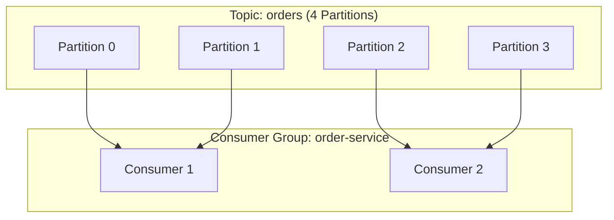
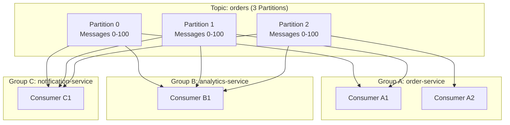
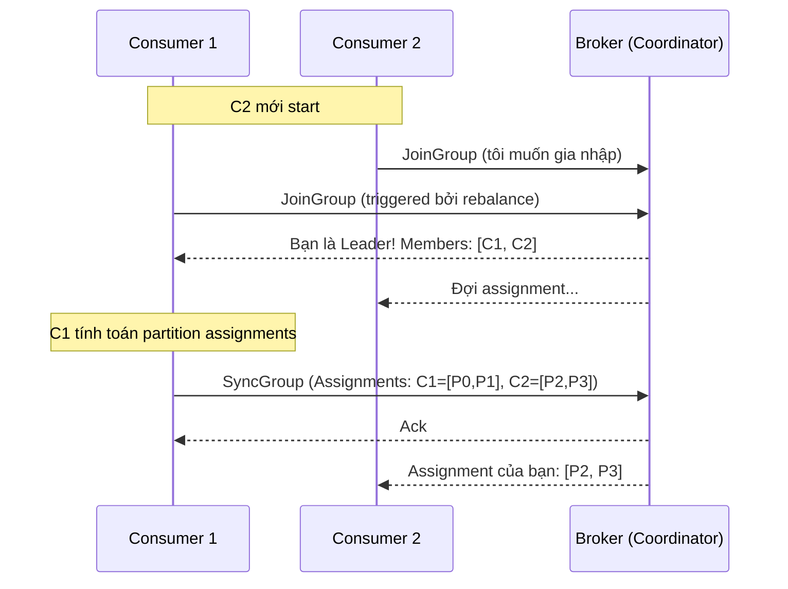
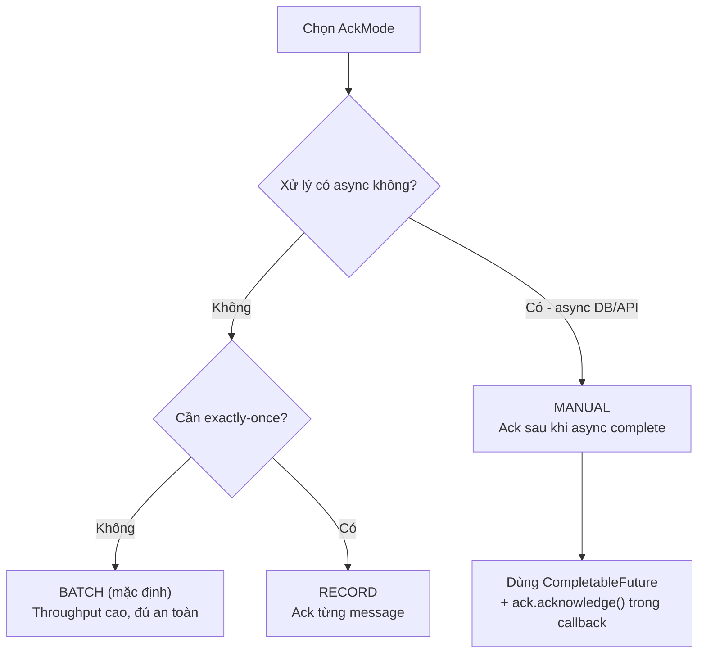

# Consumer Groups

## Mục lục

- [Tổng quan](#tổng-quan)
- [Quy tắc Partition-Consumer Mapping](#quy-tắc-partition-consumer-mapping)
- [Multiple Consumer Groups — Pub/Sub](#multiple-consumer-groups--pubsub)
- [Rebalancing Protocol](#rebalancing-protocol)
- [Real World: Scaling Event](#real-world-scaling-event)
- [AckMode trong Spring Kafka](#ackmode-trong-spring-kafka)
- [Best Practices](#best-practices)

---

## Tổng quan

**Consumer Group** là một nhóm logic các consumer cùng nhau đọc dữ liệu từ một hoặc nhiều topic. Đây là cơ chế cho phép Kafka vừa scale horizontally (load balancing) vừa hỗ trợ Pub/Sub pattern.

Mỗi consumer group được định danh bằng một `group.id` duy nhất. Kafka theo dõi offset đã xử lý của **từng group**, không phải từng consumer instance.



---

## Quy tắc Partition-Consumer Mapping

Đây là quy tắc cốt lõi — cần nhớ kỹ:

| Quy tắc | Mô tả | Ví dụ |
|---------|-------|-------|
| **Partition → 1 Consumer (trong group)** | Mỗi partition chỉ được đọc bởi **đúng một** consumer trong cùng group | P0 → C1 (không phải C1 VÀ C2) |
| **Partition → Nhiều Consumer (khác group)** | Cùng partition có thể được đọc bởi consumers từ **các group khác nhau** | P0 → C1 (Group A) VÀ CB1 (Group B) |
| **Consumer → Nhiều Partition** | Một consumer có thể đọc từ **nhiều partition** đồng thời | C1 đọc P0 VÀ P1 |

> [!IMPORTANT]
> **Tổng kết**: Trong một group là mapping 1:1 (partition → consumer). Giữa các group là many-to-many. Một consumer xử lý được nhiều partition, nhưng một partition chỉ có một consumer per group.

### Hậu quả khi có nhiều consumer hơn partition

Nếu bạn có **10 Partitions** và start **15 Consumers**, **5 consumer sẽ không làm gì** — họ ở trạng thái idle chờ rebalance.

```
Partitions:  [P0] [P1] [P2] [P3] [P4] [P5] [P6] [P7] [P8] [P9]
                ↓    ↓    ↓    ↓    ↓    ↓    ↓    ↓    ↓    ↓
Consumers:  [ C1][ C2][ C3][ C4][ C5][ C6][ C7][ C8][ C9][C10][C11][C12][C13][C14][C15]
                                                                    ↑    ↑    ↑    ↑    ↑
                                                               IDLE (lãng phí tài nguyên)
```

---

## Multiple Consumer Groups — Pub/Sub

Đây là cách Kafka hỗ trợ **Pub/Sub pattern**: nhiều service độc lập nhau cùng nhận một message.



**Điểm quan trọng**: Mỗi group theo dõi offset **độc lập**. Group A ở offset 85, Group B ở offset 45 — hai group tiến độc lập, không ảnh hưởng nhau.

| Group | Service | Offset hiện tại | Ghi chú |
|-------|---------|----------------|---------|
| `order-service` | Xử lý đơn hàng | ~85 | Nhanh hơn |
| `analytics-service` | Phân tích dữ liệu | ~45 | Xử lý chậm hơn, không sao |
| `notification-service` | Gửi thông báo | ~92 | Gần real-time |

---

## Rebalancing Protocol

**Rebalancing** là quá trình Kafka phân lại partitions cho consumers. Đây là cơ chế đảm bảo fault tolerance và elastic scaling.

### Khi nào Rebalance xảy ra?

1. **Consumer mới gia nhập** group
2. **Consumer rời đi** (graceful shutdown hoặc crash/mất heartbeat)
3. **Topic metadata thay đổi** (thêm partitions mới)

### Giao thức Rebalancing (3 bước)



#### Bước 1: FindCoordinator

Consumer tìm broker nào đang là **Group Coordinator** cho group của mình.

```
Coordinator Partition = hash(group.id) % __consumer_offsets_partitions
```

Broker chứa partition này sẽ là Coordinator.

#### Bước 2: JoinGroup

Tất cả consumer gửi `JoinGroup` request. Coordinator chọn ra một consumer làm **Leader** (thường là consumer đầu tiên).

#### Bước 3: SyncGroup

Leader consumer **tính toán** partition assignment (ai nhận partition nào), gửi lên Coordinator. Coordinator broadcast kết quả cho tất cả members.

> [!NOTE]
> Trong thời gian rebalancing xảy ra, toàn bộ consumer trong group **tạm dừng** xử lý (stop-the-world). Đây là lý do cần tránh rebalance thường xuyên trong production.

---

## Real World: Scaling Event

### Kịch bản: Topic `orders` với 4 Partitions

**Bước 1: Ban đầu — 1 Consumer**
```
[P0] [P1] [P2] [P3]
  └────┴────┴────┘
        ↓
      [C1]  ← Xử lý tất cả 4 partitions
```

**Bước 2: Scale up — Start thêm C2**
```
Rebalance trigger!

[P0] [P1] [P2] [P3]
  └────┘    └────┘
    ↓          ↓
  [C1]       [C2]   ← Load được chia đôi
```

**Bước 3: C2 crash — Mất heartbeat**
```
Coordinator chờ session.timeout.ms (mặc định 45s)
→ Rebalance trigger!

[P0] [P1] [P2] [P3]
  └────┴────┴────┘
        ↓
      [C1]  ← C1 lại nhận tất cả (từ committed offset của C2)
```

> [!TIP]
> **Key insight**: Khi C2 crash, C1 tiếp tục từ **committed offset của C2**, không phải từ đầu. Offset được lưu theo group, không theo consumer instance.

---

## AckMode trong Spring Kafka

`AckMode` điều khiển **khi nào offset được commit** vào Kafka. Đây là một trong những config quan trọng nhất ảnh hưởng đến độ tin cậy và throughput.

### So sánh các AckMode

| AckMode | Commit khi nào | Throughput | Duplicate Risk | Dùng khi |
|---------|----------------|-----------|----------------|----------|
| `RECORD` | Sau mỗi record được xử lý | 🐢 Thấp | ✅ Tối thiểu | Dữ liệu critical, exactly-once |
| `BATCH` | Sau tất cả records trong `poll()` batch | 🚀 Cao | ⚠️ Moderate | Mặc định — balance tốt |
| `TIME` | Sau khoảng thời gian cấu hình | 🚗 Trung bình | ⚠️ Moderate | Time-based commits |
| `COUNT` | Sau N records được xử lý | 🚗 Trung bình | ⚠️ Moderate | Count-based commits |
| `MANUAL` | Khi gọi `Acknowledgment.acknowledge()` | ⚙️ Tùy chỉnh | ✅ Bạn kiểm soát | Processing logic phức tạp |
| `MANUAL_IMMEDIATE` | Ngay lập tức khi gọi `acknowledge()` | ⚙️ Tùy chỉnh | ✅ Tối thiểu | Cần commit real-time |

> [!TIP]
> **Mặc định của Spring**: `BATCH` mode. Với hầu hết ứng dụng, đây là lựa chọn tốt. Chuyển sang `MANUAL` khi cần acknowledge sau khi async processing hoàn thành.

### Cấu hình AckMode trong Spring Boot

```java
@Configuration
@EnableKafka
public class KafkaConsumerConfig {

    @Bean
    public ConcurrentKafkaListenerContainerFactory<String, String> kafkaListenerContainerFactory(
            ConsumerFactory<String, String> consumerFactory) {

        var factory = new ConcurrentKafkaListenerContainerFactory<String, String>();
        factory.setConsumerFactory(consumerFactory);

        // Cấu hình AckMode
        factory.getContainerProperties().setAckMode(
            ContainerProperties.AckMode.MANUAL_IMMEDIATE
        );

        return factory;
    }
}
```

### Dùng MANUAL AckMode

```java
@KafkaListener(topics = "orders", groupId = "order-group")
public void listen(String message, Acknowledgment ack) {
    try {
        // Xử lý message
        processOrder(message);

        // Chỉ acknowledge khi xử lý thành công
        ack.acknowledge();

    } catch (Exception e) {
        // Không acknowledge → message sẽ được retry
        log.error("Xử lý thất bại, không commit offset: {}", e.getMessage());
        // Có thể throw để trigger error handler
    }
}
```

### Khi nào dùng MANUAL?



---

## Best Practices

### Thiết kế Consumer Group

| Thực hành | Lý do |
|-----------|-------|
| Giữ `group.id` nhất quán giữa các deployment | Thay đổi group.id = mất toàn bộ offset history, phải đọc lại từ đầu |
| Số consumers ≤ số partitions | Consumer thừa sẽ idle, lãng phí tài nguyên |
| Thiết kế partition count = max expected consumers | Không thể giảm partitions sau khi tạo topic |
| Tách biệt consumer groups cho các use cases khác nhau | Mỗi service nên có group.id riêng |

### Tránh Rebalance Storms

```yaml
spring:
  kafka:
    consumer:
      # Tăng timeout để tránh rebalance do GC pause hay slow processing
      properties:
        session.timeout.ms: 45000        # Mặc định 45s
        heartbeat.interval.ms: 15000     # Nên = 1/3 session.timeout
        max.poll.interval.ms: 300000     # Thời gian tối đa giữa 2 lần poll()
        max.poll.records: 100            # Giảm số records/poll nếu processing chậm
```

> [!CAUTION]
> **Lỗi phổ biến**: Nếu processing time > `max.poll.interval.ms`, Kafka sẽ coi consumer là "dead" và trigger rebalance, dù consumer vẫn đang chạy. Giải pháp: giảm `max.poll.records` hoặc tăng `max.poll.interval.ms`.

### Giám sát Consumer Group

```bash
# Xem tất cả consumer groups
kafka-consumer-groups.sh --bootstrap-server localhost:9092 --list

# Xem chi tiết group: offset, lag, assignment
kafka-consumer-groups.sh --bootstrap-server localhost:9092 \
    --describe --group order-group

# Output mẫu:
# GROUP       TOPIC   PARTITION  CURRENT-OFFSET  LOG-END-OFFSET  LAG   CONSUMER-ID
# order-group orders  0          1523            1530            7     consumer-1-xxx
# order-group orders  1          892             900             8     consumer-2-xxx
```

<Cards>
  <Card title="Offset Management" href="/core-concepts/offsets/" description="Deep dive vào cách Kafka lưu trữ và quản lý offset, 5 kịch bản lifecycle" />
  <Card title="Partitioning Strategy" href="/core-concepts/partitioning-strategy/" description="Message keys, hot partitions, key salting và custom partitioner" />
  <Card title="Consumer API" href="/producers-consumers/consumer-api/" description="@KafkaListener, headers, concurrency trong Spring Boot" />
</Cards>
