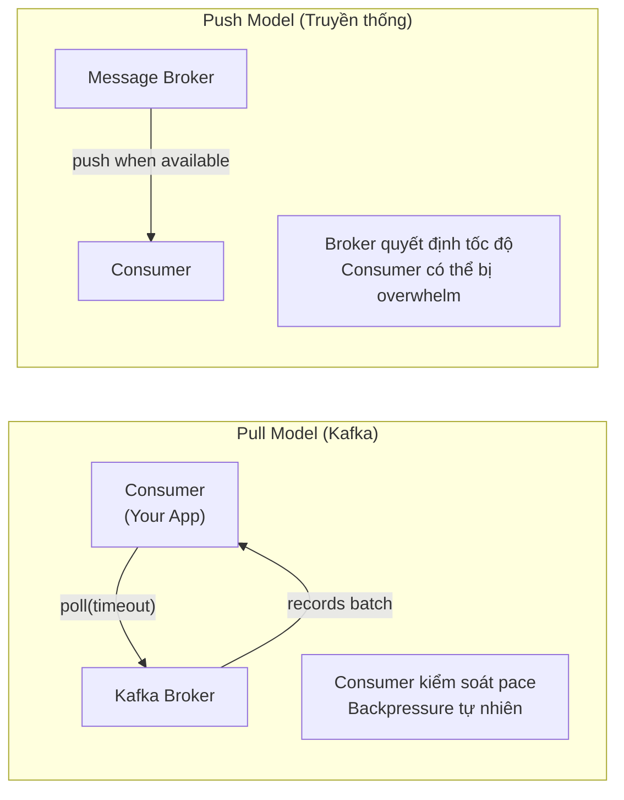
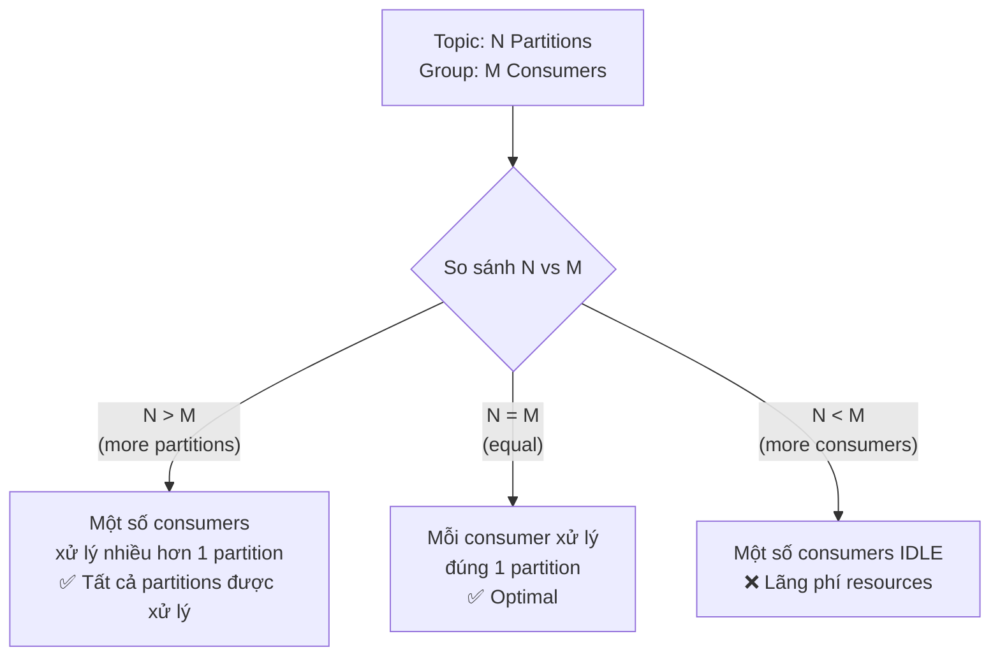
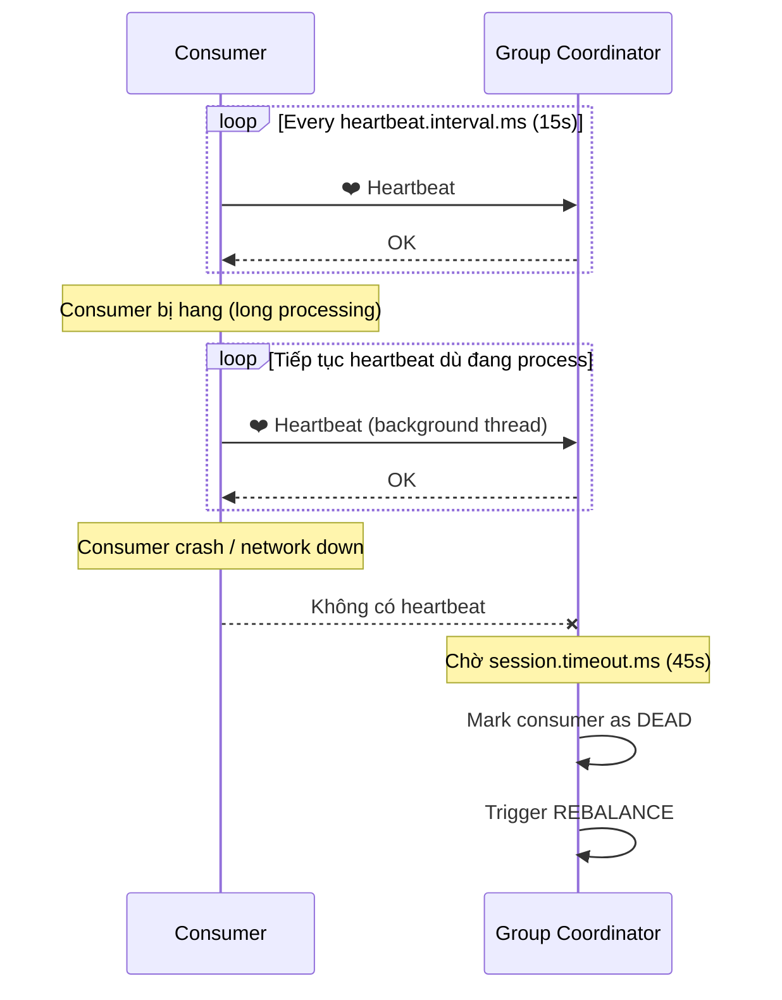
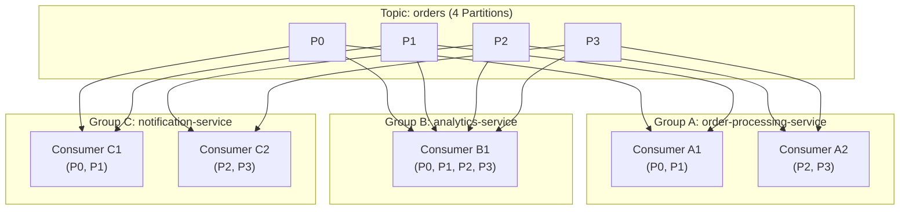
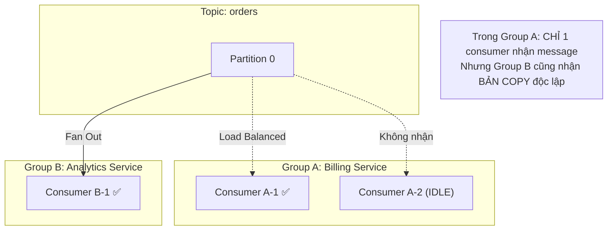

# Consumers (Fundamentals)

## Mục lục

- [Consumer là gì?](#consumer-là-gì)
- [Pull Model — Consumer tự lấy data](#pull-model--consumer-tự-lấy-data)
- [Consumer Group](#consumer-group)
- [Partition Assignment Rules](#partition-assignment-rules)
- [Heartbeat & Session Timeout](#heartbeat--session-timeout)
- [auto.offset.reset](#autooffsetreset)
- [Fan-Out vs Load Balancing](#fan-out-vs-load-balancing)
- [Common Misconceptions](#common-misconceptions)

---

## Consumer là gì?

**Consumer** là ứng dụng **đọc (subscribe) messages** từ Kafka topic. Không giống message queue truyền thống, Kafka Consumer **tự kiểm soát** việc đọc — quyết định đọc từ offset nào, tốc độ nào.

```
Kafka Topic: orders (4 Partitions)
┌──────┐ ┌──────┐ ┌──────┐ ┌──────┐
│  P0  │ │  P1  │ │  P2  │ │  P3  │
│[0..n]│ │[0..n]│ │[0..n]│ │[0..n]│
└──┬───┘ └──┬───┘ └──┬───┘ └──┬───┘
   │        │        │        │
   └────────┴────────┴────────┘
                    │
                    ▼ poll()
          ┌─────────────────┐
          │    Consumer     │
          │  (Your App)     │
          │                 │
          │ process(record) │
          └─────────────────┘
```

---

## Pull Model — Consumer tự lấy data

Kafka dùng **Pull model** (Consumer tự poll), không phải Push model (Broker push data):



**Lợi ích của Pull model:**
- Consumer tự quyết định tốc độ xử lý → **natural backpressure**
- Consumer slow → chỉ poll ít hơn, không bị broker overwhelm
- Cho phép **batch processing**: poll nhiều records cùng lúc
- Consumer có thể replay bất kỳ offset nào

---

## Consumer Group

**Consumer Group** = nhóm consumers cùng chia sẻ load của một topic.

```
Topic: orders (6 Partitions)
┌────┐ ┌────┐ ┌────┐ ┌────┐ ┌────┐ ┌────┐
│ P0 │ │ P1 │ │ P2 │ │ P3 │ │ P4 │ │ P5 │
└─┬──┘ └─┬──┘ └─┬──┘ └─┬──┘ └─┬──┘ └─┬──┘
  │      │      │      │      │      │
  └──────┴──────┼──────┴──────┴──────┘
                │  Consumer Group: "order-service"
         ┌──────┴──────┐
     [C1: P0,P1]   [C2: P2,P3]   [C3: P4,P5]
```

**Rule bất biến**: Trong một consumer group, **một partition chỉ được xử lý bởi đúng một consumer** tại một thời điểm → đảm bảo ordering per partition.

---

## Partition Assignment Rules



| Partitions | Consumers | Phân phối | Nhận xét |
|-----------|----------|----------|---------|
| 4 | 1 | C1: P0,P1,P2,P3 | ✅ Hoạt động |
| 4 | 2 | C1: P0,P1 / C2: P2,P3 | ✅ Balanced |
| 4 | 4 | C1:P0 / C2:P1 / C3:P2 / C4:P3 | ✅ Optimal |
| 4 | 6 | 4 active, **2 idle** | ⚠️ Lãng phí |

> [!TIP]
> **Thiết kế topic:** Chọn số partition = bội số của số consumer instances dự kiến. Ví dụ: 3 instances × 4 threads = 12 consumers → tạo 12 partitions.

---

## Heartbeat & Session Timeout

Consumer duy trì **heartbeat** để báo với Broker rằng nó vẫn sống:



### Cấu hình timeout quan trọng

```yaml
spring:
  kafka:
    consumer:
      properties:
        # Heartbeat — báo "tôi sống" với Coordinator
        heartbeat.interval.ms: 15000     # 15 giây — nên = 1/3 session timeout

        # Session — thời gian tối đa không nhận heartbeat trước khi coi là dead
        session.timeout.ms: 45000        # 45 giây

        # Poll interval — thời gian tối đa giữa 2 lần poll()
        # Nếu processing mất quá lâu → tăng giá trị này
        max.poll.interval.ms: 300000     # 5 phút

        # Số records tối đa mỗi poll() — tune theo processing time
        max.poll.records: 100
```

**Hai loại timeout khác nhau:**

| Timeout | Điều kiện trigger | Hậu quả |
|---------|-----------------|--------|
| `session.timeout.ms` | Không nhận heartbeat trong X ms | Consumer bị coi là dead, rebalance |
| `max.poll.interval.ms` | Khoảng cách giữa 2 poll() quá lớn | Consumer bị kicked khỏi group, rebalance |

> [!WARNING]
> **`max.poll.interval.ms` trap phổ biến:** Nếu xử lý 1 batch (100 records) mất 400 giây nhưng `max.poll.interval.ms=300000` (5 phút = 300s) → consumer bị kicked khỏi group, rebalance → lặp lại mãi.
>
> **Fix:** Giảm `max.poll.records` hoặc tăng `max.poll.interval.ms`.

---

## auto.offset.reset

Khi consumer lần đầu đọc một partition (không có committed offset), **`auto.offset.reset`** quyết định đọc từ đâu:

```mermaid
flowchart TD
    A["Consumer start\ngroup.id = 'my-group'"] --> B{Có committed offset\ntrong __consumer_offsets?}

    B -->|"✅ Có"| C["Resume từ\ncommitted offset"]

    B -->|"❌ Không có (group mới)"] --> D{auto.offset.reset?}

    D -->|"earliest"| E["Đọc từ Offset 0\nProcess TẤT CẢ messages\n(kể cả cũ)"]
    D -->|"latest"| F["Đọc từ cuối log\nChỉ nhận messages MỚI\n(bỏ qua existing)"]
    D -->|"none"| G["Throw Exception!\nNoOffsetForPartitionException"]
```

**Chọn giá trị nào?**

| Giá trị | Dùng khi | Rủi ro |
|---------|---------|-------|
| `earliest` | Cần xử lý tất cả dữ liệu, ETL, reprocessing | Có thể xử lý data cũ không mong muốn |
| `latest` | Chỉ quan tâm events mới (notifications, realtime) | Bỏ qua backlog data |
| `none` | Muốn fail rõ ràng nếu không có offset | Exception khi start |

---

## Fan-Out vs Load Balancing

Đây là concept quan trọng nhất về Consumer Group:



**Kết quả:**
- **Trong Group A**: Load balanced — mỗi consumer xử lý 2 partitions
- **Across Groups**: Fan-Out — cùng 1 message được xử lý bởi cả 3 services
- Group A, B, C đều nhận **toàn bộ** messages → Kafka như Pub/Sub system

> [!NOTE]
> Đây là sức mạnh cốt lõi của Kafka: **một topic, nhiều consumers độc lập**. Không cần fanout queue hay routing logic phức tạp. Thêm service mới? Chỉ cần tạo consumer group mới với group.id mới.

---

## Common Misconceptions

### "Một partition chỉ kết nối 1 consumer?"

**Trả lời**: Đúng VÀ Sai — phụ thuộc vào **Consumer Group**.

| Scope | Behavior | Ví dụ |
|-------|----------|-------|
| **Trong 1 Group** | 1 partition → đúng 1 consumer | Group A: P0 chỉ được xử lý bởi C1 |
| **Across Groups** | 1 partition → nhiều consumers, mỗi group 1 bản copy | Group A + Group B đều đọc P0 |



---

### "Kafka guarantee global ordering?"

**Sai** — Kafka chỉ guarantee ordering **trong 1 partition**, không phải across toàn bộ topic.

```
Gửi: msg-A (key="user1") → Partition 0
Gửi: msg-B (key="user2") → Partition 1

Consumer đọc P1 trước P0 → thấy B trước A!
```

**Fix**: Dùng cùng **Key** cho các events cần ordering (ví dụ: `orderId`, `userId`).

> [!TIP]
> Nếu không dùng key → round-robin partitioning → **không có ordering guarantee**.

---

### "Kafka push data cho consumer?"

**Sai** — Kafka Consumer **POLL** (pull), không phải push.

```
Push (RabbitMQ):  Broker → Consumer (broker quyết định pace)
Pull (Kafka):     Consumer → Broker (consumer quyết định pace)
```

**Lợi ích của Pull model**:
- Consumer slow → poll ít hơn → **natural backpressure**
- Consumer fast → poll nhiều hơn → tự động scale
- Consumer có thể replay từ bất kỳ offset nào

---

### "Thêm consumer để xử lý nhanh hơn?"

**Trap** — "Idle Consumer Problem": không thể có nhiều active consumers hơn số partitions.

```
Topic: 6 partitions
Group: 8 consumers

→ 6 consumers active (xử lý partitions)
→ 2 consumers IDLE (lãng phí resources!)
```

**Formula**: `Active Consumers = min(Total Consumers, Total Partitions)`

| Partitions | Consumers | Active | Idle | Nhận xét |
|-----------|----------|--------|------|---------|
| 6 | 3 | 3 | 0 | ✅ Có thể scale thêm |
| 6 | 6 | 6 | 0 | ✅ Optimal |
| 6 | 8 | 6 | **2** | ❌ 2 consumers lãng phí |

> [!WARNING]
> Thêm consumer instance mà không tăng partitions → consumer mới sẽ **idle**, không giúp xử lý nhanh hơn.

---

### "Auto-commit an toàn rồi?"

**Không** — auto-commit có thể gây duplicate processing.

```
Timeline:
1. Consumer poll() → nhận message
2. Auto-commit chạy (offset +1) ← commit TRƯỚC khi xử lý xong
3. Consumer xử lý message...
4. 💥 Consumer crash!
5. Consumer restart → tiếp tục từ offset đã commit
6. → Message bị SKIP (chưa xử lý xong nhưng offset đã commit)

HOẶC ngược lại:
1. Consumer poll() → nhận message
2. Consumer xử lý message xong
3. 💥 Crash TRƯỚC khi auto-commit chạy
4. Consumer restart → đọc lại message cũ
5. → Message bị DUPLICATE
```

**Fix**: Dùng `enable.auto.commit=false` + manual acknowledge.

---

### "Kafka hoạt động như queue (FIFO)?"

**Không hoàn toàn** — Kafka là **log** (append-only), không phải queue.

| Aspect | Queue (RabbitMQ) | Kafka (Log) |
|--------|-----------------|-------------|
| **Message sau khi consume** | Bị xóa (ack → delete) | Giữ lại (consumer tự track offset) |
| **Replay** | Không thể | Dễ dàng (reset offset) |
| **Multiple consumers** | Cần fanout exchange | Tự nhiên (multiple groups) |
| **Ordering** | Queue-level FIFO | Partition-level FIFO |

> [!TIP]
> Kafka KHÔNG xóa message khi consumer xử lý xong. Message chỉ bị xóa khi hết retention (time/size) hoặc compact.

<Cards>
  <Card title="Consumer Groups" href="/core-concepts/consumer-groups/" description="Rebalancing protocol và AckMode deep dive" />
  <Card title="Offset Management" href="/core-concepts/offsets/" description="__consumer_offsets internals và 5 lifecycle scenarios" />
  <Card title="Consumer API" href="/producers-consumers/consumer-api/" description="@KafkaListener, headers, concurrency trong Spring Boot" />
</Cards>
