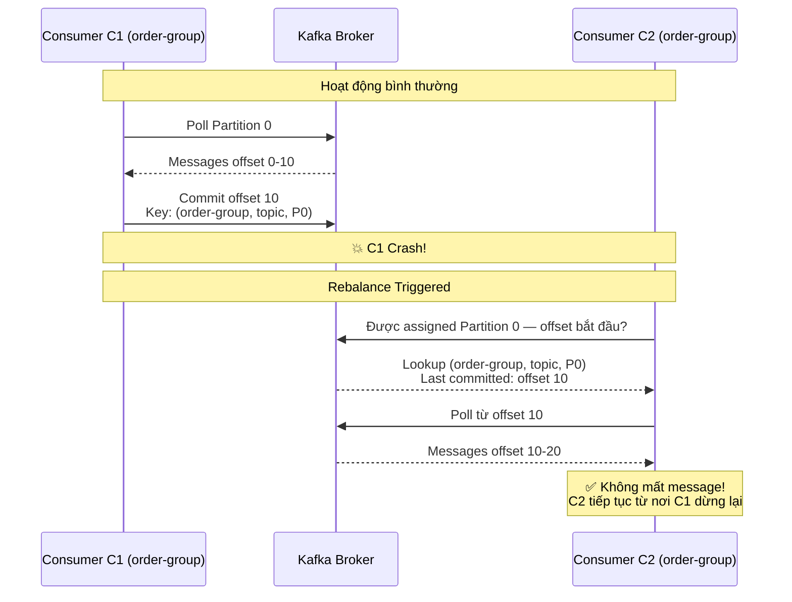
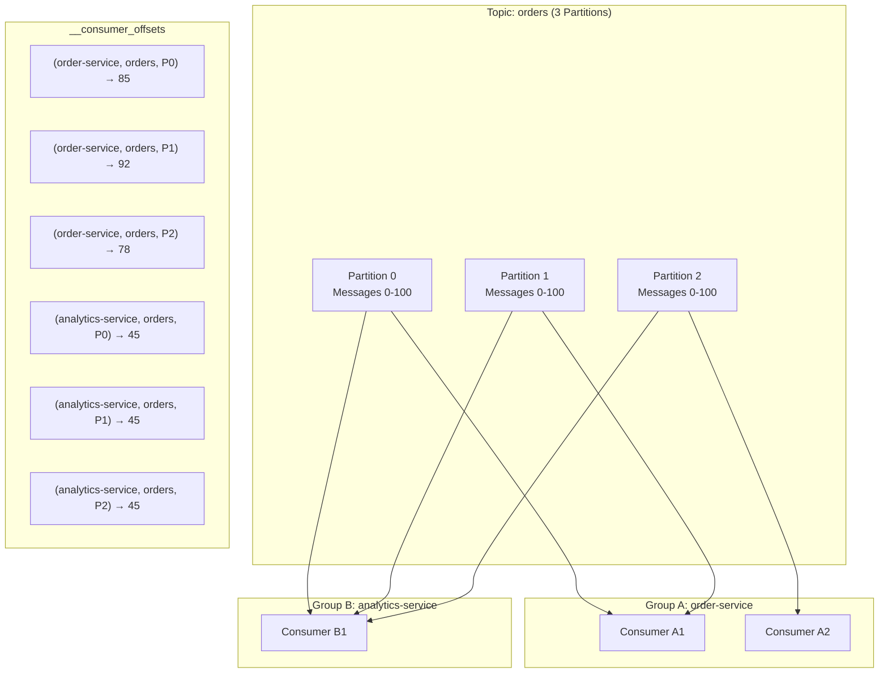
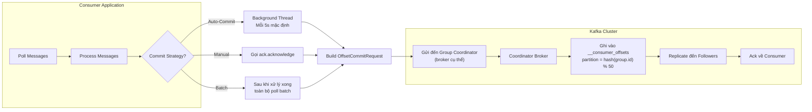
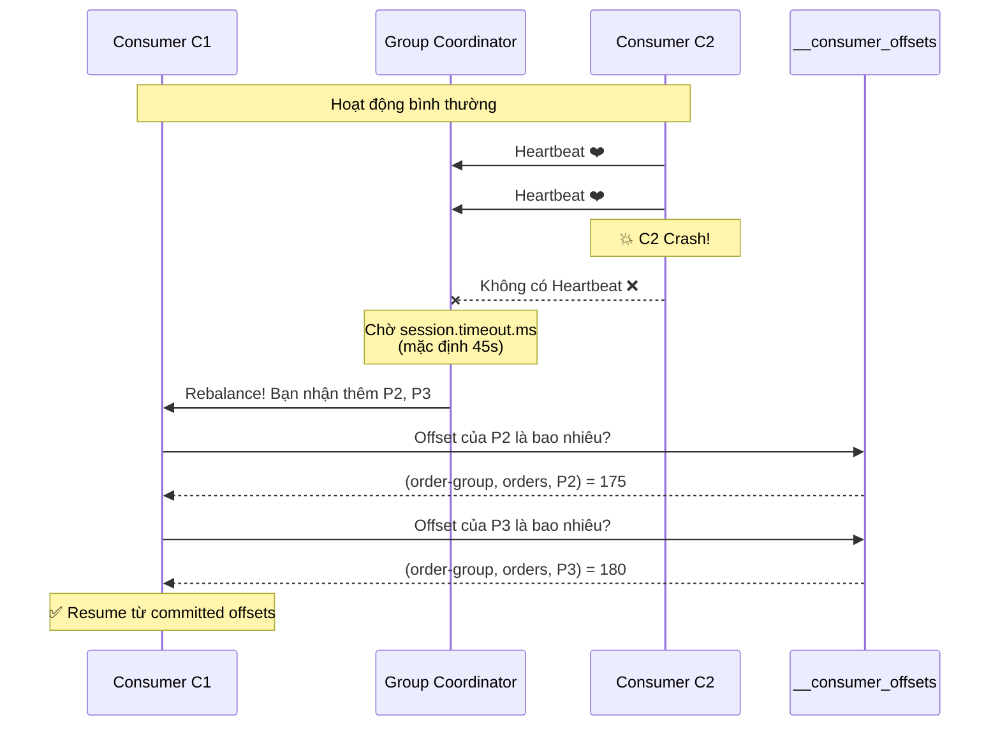
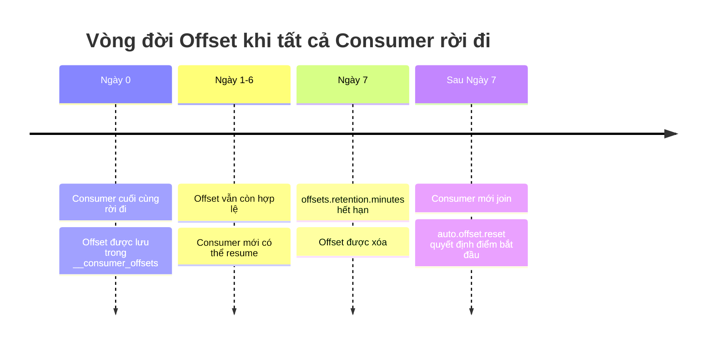
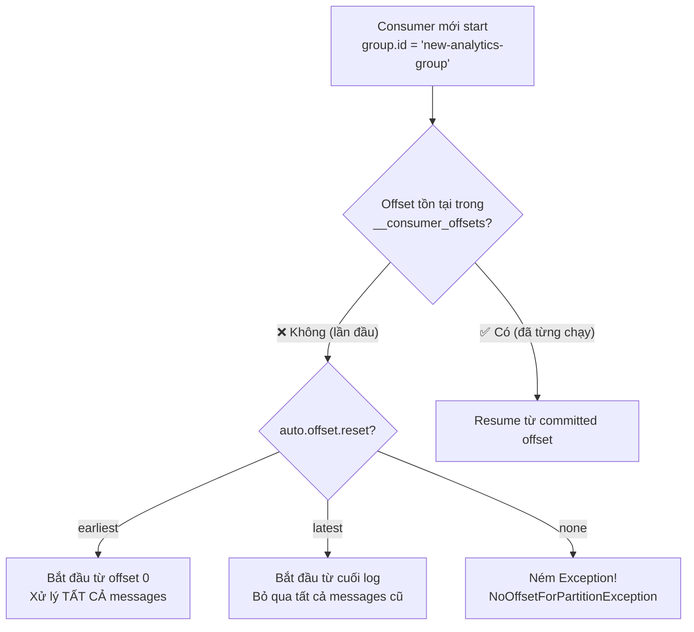
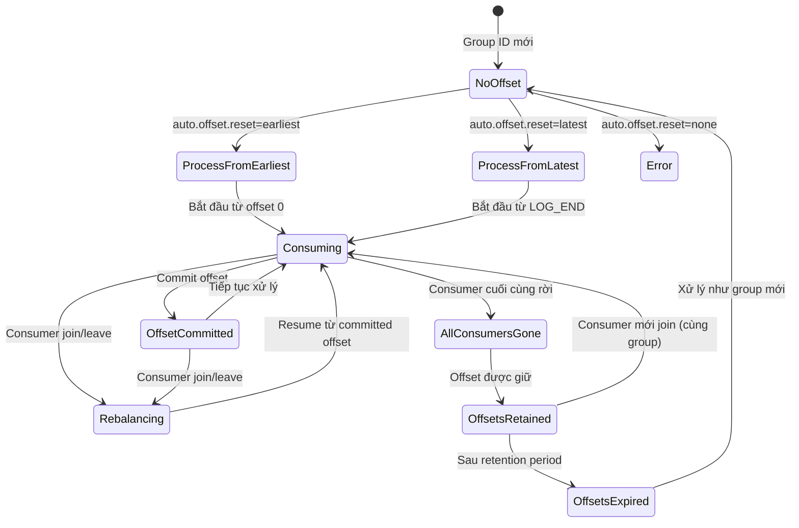
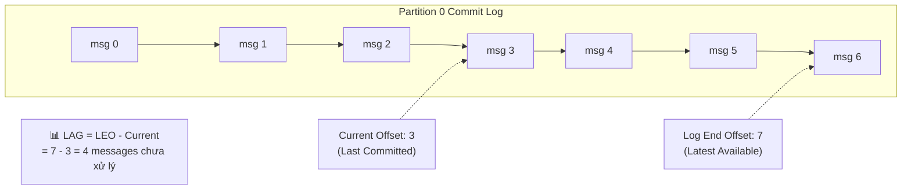
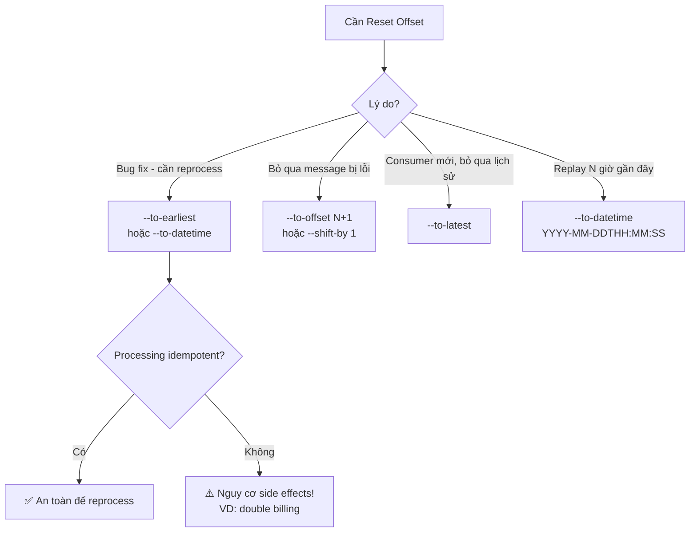

# Offset Management

## Mục lục

- [Offset là gì?](#offset-là-gì)
- [Topic \_\_consumer\_offsets](#topic-__consumer_offsets)
- [Key Structure — Tại sao track theo Group?](#key-structure--tại-sao-track-theo-group)
- [Multiple Consumer Groups — Independent Offsets](#multiple-consumer-groups--independent-offsets)
- [Offset Commit Flow](#offset-commit-flow)
- [5 Kịch bản Lifecycle](#5-kịch-bản-lifecycle)
- [State Machine: Vòng Đời Consumer](#state-machine-vòng-đời-consumer)
- [Offset Behavior Matrix](#offset-behavior-matrix)
- [CLI Commands & Operations](#cli-commands--operations)
- [Consumer Lag](#consumer-lag)
- [Reset Offset Strategies](#reset-offset-strategies)
- [Monitoring trong Spring Boot](#monitoring-trong-spring-boot)
- [Common Pitfalls](#common-pitfalls)

---

## Offset là gì?

**Offset** là một số nguyên tăng dần, đánh dấu vị trí của mỗi message trong một partition. Đây là cơ chế Kafka dùng để các consumer biết "tôi đã đọc đến đâu".

```
┌───────────────────────────────────────────────────────────────┐
│                     Partition 0 (Commit Log)                  │
├─────┬─────┬─────┬─────┬─────┬─────┬─────┬─────┬─────┬─────┬───┤
│ msg │ msg │ msg │ msg │ msg │ msg │ msg │ msg │ msg │ msg │ . │
│  0  │  1  │  2  │  3  │  4  │  5  │  6  │  7  │  8  │  9  │ . │
├─────┴─────┴─────┴─────┴─────┴─────┴─────┴─────┴─────┴─────┴───┤
│  ↑                         ↑                               ↑  │
│ Offset 0               Offset 5                    Latest (9) │
│ (Oldest)           (Consumer Position)              (Newest)  │
└───────────────────────────────────────────────────────────────┘

Write Direction ────────────────────────────────────────────────→
```

**Consumer Lag** = Log End Offset - Current Offset (= số message chưa xử lý)

---

## Topic `__consumer_offsets`

Kafka lưu toàn bộ offset của consumer trong một topic nội bộ đặc biệt: **`__consumer_offsets`**.

### Đặc điểm của topic này

| Thuộc tính | Giá trị | Ghi chú |
|-----------|---------|---------|
| Số partitions | 50 (mặc định) | `offsets.topic.num.partitions` |
| Replication Factor | 3 | `offsets.topic.replication.factor` |
| Cleanup policy | Log compaction | Chỉ giữ offset mới nhất per key |
| Ai quản lý | Kafka broker | Không ghi trực tiếp vào đây |

> [!NOTE]
> **Lịch sử**: Trước Kafka 0.9, offset được lưu trong ZooKeeper. Điều này gây ra vấn đề scalability nghiêm trọng, nên Kafka đã chuyển sang lưu trong topic thông thường (có compaction).

### Log Compaction giúp gì?

Log compaction đảm bảo `__consumer_offsets` chỉ giữ **offset mới nhất** của mỗi `(group, topic, partition)`. Các offset cũ hơn sẽ bị cleanup dần.

```
Trước compaction:
[key: (g1,orders,P0)→50] [key: (g1,orders,P0)→75] [key: (g1,orders,P0)→100]

Sau compaction:
[key: (g1,orders,P0)→100]  ← Chỉ giữ bản mới nhất
```

---

## Key Structure — Tại sao track theo Group?

### Cấu trúc Key-Value trong `__consumer_offsets`

```
┌────────────────────────────────────────────────────────────────────────────┐
│                     __consumer_offsets Internal Topic                      │
├────────────────────────────────────────────────────────────────────────────┤
│                                                                            │
│  ┌─────────────────────────────────┐     ┌─────────────────────────────┐   │
│  │ Key (Composite)                 │     │ Value                       │   │
│  ├─────────────────────────────────┤     ├─────────────────────────────┤   │
│  │ • Consumer Group ID             │ ──▶ │ • Committed Offset          │   │
│  │ • Topic Name                    │     │ • Metadata (optional)       │   │
│  │ • Partition Number              │     │ • Commit Timestamp          │   │
│  └─────────────────────────────────┘     └─────────────────────────────┘   │
│                                                                            │
│  Ví dụ thực tế:                                                            │
│  (order-group, orders, 0)  →  { offset: 1523, timestamp: ... }             │
│  (order-group, orders, 1)  →  { offset: 892,  timestamp: ... }             │
│  (order-group, orders, 2)  →  { offset: 2105, timestamp: ... }             │
│  (analytics-group, orders, 0) → { offset: 500, timestamp: ... }            │
│  (analytics-group, orders, 1) → { offset: 500, timestamp: ... }            │
└────────────────────────────────────────────────────────────────────────────┘
```

**Key = `(group.id, topic, partition)`** — KHÔNG phải per consumer instance.

### Lợi ích của Group-Level Tracking

| Lợi ích | Giải thích |
|---------|-----------|
| **Fault Tolerance** | Consumer crash → consumer khác resume từ đúng offset |
| **Elastic Scaling** | Thêm/bớt consumer không mất progress |
| **Stateless Consumers** | Consumer không cần lưu state local — Kafka là source of truth |
| **Multiple Groups** | Các group theo dõi tiến độ hoàn toàn độc lập |

### Minh họa: Consumer crash, Group không mất dữ liệu



---

## Multiple Consumer Groups — Independent Offsets



**Lưu ý**: Group A ở offset ~85, Group B ở offset 45. Chúng tiến hoàn toàn độc lập!

---

## Offset Commit Flow



---

## 5 Kịch bản Lifecycle

### Kịch bản 1: Consumer Crash

```
┌─────────────────────────────────────────────────────────────────────────────────┐
│                    TRƯỚC: Hoạt động bình thường                                 │
├─────────────────────────────────────────────────────────────────────────────────┤
│                                                                                 │
│   Topic: orders (4 Partitions)                                                  │
│   ┌─────┐ ┌─────┐ ┌─────┐ ┌─────┐                                               │
│   │ P0  │ │ P1  │ │ P2  │ │ P3  │                                               │
│   └──┬──┘ └──┬──┘ └──┬──┘ └──┬──┘                                               │
│      └───┬───┘       └───┬───┘                                                  │
│          ▼               ▼                                                      │
│     ┌─────────┐     ┌─────────┐                                                 │
│     │Consumer │     │Consumer │   Consumer Group: order-group                   │
│     │   C1    │     │   C2    │                                                 │
│     │ P0, P1  │     │ P2, P3  │                                                 │
│     └─────────┘     └─────────┘                                                 │
│                                                                                 │
│   Offsets:                                                                      │
│   (order-group, orders, P0) → 150                                               │
│   (order-group, orders, P1) → 200                                               │
│   (order-group, orders, P2) → 175   ← C2 đang xử lý đến đây                     │
│   (order-group, orders, P3) → 180   ← C2 đang xử lý đến đây                     │
└─────────────────────────────────────────────────────────────────────────────────┘

                              💥 C2 CRASH!

┌─────────────────────────────────────────────────────────────────────────────────┐
│                    SAU: Rebalance hoàn thành                                    │
├─────────────────────────────────────────────────────────────────────────────────┤
│                                                                                 │
│   ┌─────┐ ┌─────┐ ┌─────┐ ┌─────┐                                               │
│   │ P0  │ │ P1  │ │ P2  │ │ P3  │                                               │
│   └──┬──┘ └──┬──┘ └──┬──┘ └──┬──┘                                               │
│      └───────┴───────┴───────┘                                                  │
│                    ▼                                                            │
│               ┌─────────┐                                                       │
│               │   C1    │   C1 nhận TẤT CẢ partitions                           │
│               │P0,P1,P2,│                                                       │
│               │   P3    │                                                       │
│               └─────────┘                                                       │
│                                                                                 │
│   Offsets: (KHÔNG THAY ĐỔI! Offset được giữ nguyên)                             │
│   (order-group, orders, P2) → 175  ← C1 tiếp tục TỪ ĐÂY                         │
│   (order-group, orders, P3) → 180  ← C1 tiếp tục TỪ ĐÂY                         │
└─────────────────────────────────────────────────────────────────────────────────┘
```

**Timeline của Consumer Crash:**



---

### Kịch bản 2: Consumer Mới Gia Nhập

```
┌─────────────────────────────────────────────────────────────────────────────────┐
│                    TRƯỚC: 1 Consumer đang xử lý                                 │
├─────────────────────────────────────────────────────────────────────────────────┤
│                                                                                 │
│   ┌─────┐ ┌─────┐ ┌─────┐ ┌─────┐                                               │
│   │ P0  │ │ P1  │ │ P2  │ │ P3  │                                               │
│   │@100 │ │@150 │ │@200 │ │@175 │  ← Offset hiện tại                            │
│   └──┬──┘ └──┬──┘ └──┬──┘ └──┬──┘                                               │
│      └───────┴───────┴───────┘                                                  │
│                  ▼                                                              │
│             ┌─────────┐                                                         │
│             │   C1    │   Đang xử lý tất cả 4 partitions                        │
│             └─────────┘                                                         │
└─────────────────────────────────────────────────────────────────────────────────┘

                              🆕 C2 GIA NHẬP!

┌─────────────────────────────────────────────────────────────────────────────────┐
│                    SAU: Load được chia đều                                      │
├─────────────────────────────────────────────────────────────────────────────────┤
│                                                                                 │
│   ┌─────┐ ┌─────┐ ┌─────┐ ┌─────┐                                               │
│   │ P0  │ │ P1  │ │ P2  │ │ P3  │                                               │
│   │@100 │ │@150 │ │@200 │ │@175 │  ← Offset KHÔNG THAY ĐỔI                      │
│   └──┬──┘ └──┬──┘ └──┬──┘ └──┬──┘                                               │
│      └───┬───┘       └───┬───┘                                                  │
│          ▼               ▼                                                      │
│     ┌─────────┐     ┌─────────┐                                                 │
│     │   C1    │     │   C2    │                                                 │
│     │ P0, P1  │     │ P2, P3  │                                                 │
│     └─────────┘     └─────────┘                                                 │
│                                                                                 │
│   C2 bắt đầu P2 từ offset 200, P3 từ offset 175 (offset của GROUP!)             │
│   ✅ C2 KHÔNG bắt đầu từ 0 — dùng committed offset của group                    │
│                                                                                 │
└─────────────────────────────────────────────────────────────────────────────────┘
```

**Hiểu đúng**: Khi C2 gia nhập:
1. C2 không có offset riêng — dùng **offset của group**
2. C2 tiếp tục từ nơi group đã commit (offset 200 cho P2, 175 cho P3)
3. Không message nào bị xử lý lại, không message nào bị bỏ qua

---

### Kịch bản 3: Graceful Shutdown vs Crash

| Aspect | Graceful Shutdown | Crash |
|--------|------------------|-------|
| **Cách phát hiện** | Consumer gửi `LeaveGroup` request | Coordinator phát hiện mất heartbeat |
| **Thời gian phát hiện** | Ngay lập tức | `session.timeout.ms` (mặc định 45s) |
| **Uncommitted work** | Có thể commit trước khi rời | Bị mất — sẽ bị reprocess |
| **Trigger Rebalance** | Ngay lập tức | Sau khi timeout |
| **Offset Impact** | Last offset được commit, preserved | Last committed offset preserved |

```mermaid
flowchart TD
    subgraph "Graceful Shutdown"
        A1[Consumer gọi close] --> A2[Commit pending offsets]
        A2 --> A3[Gửi LeaveGroup đến Coordinator]
        A3 --> A4[Rebalance ngay lập tức]
        A4 --> A5["✅ Không mất message\n✅ Không duplicate"]
    end

    subgraph "Crash"
        B1["💥 Process killed/OOM/Network"] --> B2[Không gửi heartbeat]
        B2 --> B3["Chờ session.timeout.ms\n(45 giây)"]
        B3 --> B4[Coordinator đánh dấu consumer dead]
        B4 --> B5[Rebalance được trigger]
        B5 --> B6["⚠️ Uncommitted messages\nsẽ bị reprocess"]
    end
```



---

### Kịch bản 4: Tất cả Consumer Rời Đi

```
┌─────────────────────────────────────────────────────────────────────────────────┐
│                    TẤT CẢ CONSUMER RỜI ĐI                                       │
├─────────────────────────────────────────────────────────────────────────────────┤
│                                                                                 │
│   Topic: orders (4 Partitions)                                                  │
│   ┌─────┐ ┌─────┐ ┌─────┐ ┌─────┐                                               │
│   │ P0  │ │ P1  │ │ P2  │ │ P3  │   Không có consumer nào!                      │
│   └─────┘ └─────┘ └─────┘ └─────┘                                               │
│                                                                                 │
│   __consumer_offsets: VẪN CÒN TỒN TẠI!                                          │
│   (order-group, orders, P0) → offset: 500                                       │
│   (order-group, orders, P1) → offset: 600                                       │
│   (order-group, orders, P2) → offset: 550                                       │
│   (order-group, orders, P3) → offset: 580                                       │
│                                                                                 │
│   Offset được giữ trong: offsets.retention.minutes (mặc định: 7 ngày)           │
└─────────────────────────────────────────────────────────────────────────────────┘

                    ⏰ 3 ngày sau... Consumer mới start

┌─────────────────────────────────────────────────────────────────────────────────┐
│                    CONSUMER MỚI VỚI CÙNG GROUP ID                               │
├─────────────────────────────────────────────────────────────────────────────────┤
│                                                                                 │
│   ┌─────┐ ┌─────┐ ┌─────┐ ┌─────┐                                               │
│   │ P0  │ │ P1  │ │ P2  │ │ P3  │                                               │
│   │@500 │ │@600 │ │@550 │ │@580 │  ← Resume từ stored offset!                   │
│   └──┬──┘ └──┬──┘ └──┬──┘ └──┬──┘                                               │
│      └───────┴───────┴───────┘                                                  │
│                  ▼                                                              │
│             ┌─────────┐                                                         │
│             │ C1 MỚI  │   Dùng group.id = "order-group"                         │
│             └─────────┘                                                         │
│                                                                                 │
│   ✅ Tiếp tục từ offset 500, 600, 550, 580 — không reprocess!                   │
└─────────────────────────────────────────────────────────────────────────────────┘
```

**Vòng đời Offset Retention:**



---

### Kịch bản 5: Consumer Group Mới (Chưa từng consume)



**Ví dụ thực tế: Hai group khác nhau:**

```
Topic: orders (Messages 0-1000 tồn tại)

Group A: "order-processing-group" (đã chạy nhiều tuần)
  → Current offset: 950 → Tiếp tục từ 950

Group B: "new-analytics-group" (mới tạo, chưa chạy bao giờ)
  → Không có offset trong __consumer_offsets

  Nếu auto.offset.reset=earliest → Bắt đầu từ 0 (xử lý tất cả 1000 messages)
  Nếu auto.offset.reset=latest   → Bắt đầu từ 1000 (chờ messages mới)
```

---

## State Machine: Vòng Đời Consumer



---

## Offset Behavior Matrix

| Sự kiện | Ảnh hưởng đến Offset | Hành vi Recovery |
|---------|---------------------|-----------------|
| **Consumer crash** | Preserved trong `__consumer_offsets` | Consumer khác resume từ committed offset |
| **Graceful shutdown** | Offset cuối được commit, preserved | Giống crash nhưng rebalance ngay lập tức |
| **Consumer mới gia nhập** | Offset không thay đổi | Consumer mới dùng committed offset của group |
| **Consumer bị remove** | Offset vẫn còn | Partition được redistribute, dùng existing offset |
| **Tất cả consumer rời** | Giữ trong `offsets.retention.minutes` | Consumer mới resume nếu còn trong retention |
| **Consumer group mới** | Không có offset | `auto.offset.reset` quyết định |
| **Offset hết hạn** | Bị xóa khỏi `__consumer_offsets` | Xử lý như group mới |

> [!CAUTION]
> **Pitfalls phổ biến:**
> 1. **Thay đổi `group.id` giữa các deployment** → Mất toàn bộ offset progress, bắt đầu từ đầu
> 2. **Processing time > `auto.commit.interval`** → Nguy cơ xử lý duplicate khi crash
> 3. **Offset hết hạn trong maintenance dài** → Có thể reprocess hoặc skip messages không mong muốn

---

## CLI Commands & Operations

### Xem Consumer Groups

```bash
# Liệt kê tất cả consumer groups
kafka-consumer-groups.sh --bootstrap-server localhost:9092 --list

# Mô tả chi tiết một group (offset, lag, assignment)
kafka-consumer-groups.sh --bootstrap-server localhost:9092 \
    --describe --group order-group

# Output mẫu:
# GROUP        TOPIC    PARTITION  CURRENT-OFFSET  LOG-END-OFFSET  LAG   CONSUMER-ID
# order-group  orders   0          1523            1530            7     consumer-1-xxx
# order-group  orders   1          892             900             8     consumer-1-xxx
# order-group  orders   2          2105            2105            0     consumer-2-xxx
```

---

## Consumer Lag

**Consumer Lag** = số message mà consumer chưa xử lý được.



### Giải thích Lag

| Lag | Trạng thái | Hành động |
|----|-----------|-----------|
| **0** | Consumer bắt kịp | ✅ Healthy |
| **1-100** | Fluctuation nhỏ, bình thường | 👀 Monitor |
| **100-1000** | Consumer đang chậm lại | ⚠️ Điều tra |
| **1000+** | Backlog nghiêm trọng | 🚨 Scale up hoặc fix processing |
| **Đang tăng** | Ngày càng tệ hơn | 🔥 Urgent |

---

## Reset Offset Strategies

Đôi khi cần reprocess messages (bug fix, feature mới). Kafka cho phép reset offset khi consumer group **đã dừng hoàn toàn**.

> [!CAUTION]
> **Trước khi reset offset:**
> 1. Dừng tất cả consumers trong group trước
> 2. Đảm bảo processing logic idempotent nếu reprocess
> 3. Dùng `--dry-run` để xem trước kết quả
> 4. Cân nhắc downstream effects (có gửi duplicate events không?)

```bash
# ⚠️ QUAN TRỌNG: Dừng tất cả consumers trong group trước!

# Reset về earliest (reprocess tất cả)
kafka-consumer-groups.sh --bootstrap-server localhost:9092 \
    --group order-group --reset-offsets --to-earliest \
    --topic orders --execute

# Reset về latest (bỏ qua backlog, chờ message mới)
kafka-consumer-groups.sh --bootstrap-server localhost:9092 \
    --group order-group --reset-offsets --to-latest \
    --topic orders --execute

# Reset về offset cụ thể
kafka-consumer-groups.sh --bootstrap-server localhost:9092 \
    --group order-group --reset-offsets --to-offset 1000 \
    --topic orders:0 --execute  # chỉ partition 0

# Reset về thời điểm cụ thể
kafka-consumer-groups.sh --bootstrap-server localhost:9092 \
    --group order-group --reset-offsets \
    --to-datetime 2024-01-15T10:00:00.000 \
    --topic orders --execute

# Dịch chuyển offset (lùi 100 messages)
kafka-consumer-groups.sh --bootstrap-server localhost:9092 \
    --group order-group --reset-offsets --shift-by -100 \
    --topic orders --execute
```

**Flowchart chọn Reset Strategy:**



---

## Monitoring trong Spring Boot

### Dùng KafkaListenerEndpointRegistry

```java
@Autowired
private KafkaListenerEndpointRegistry registry;

// Xem partition đang được assign
public void logConsumerPositions() {
    registry.getListenerContainers().forEach(container -> {
        container.getAssignedPartitions().forEach(tp -> {
            log.info("Assigned: topic={}, partition={}", tp.topic(), tp.partition());
        });
    });
}
```

### Dùng AdminClient để inspect Consumer Groups

```java
public void describeConsumerGroup(String groupId) {
    try (AdminClient admin = AdminClient.create(
            Map.of("bootstrap.servers", "localhost:9092"))) {

        DescribeConsumerGroupsResult result = admin
            .describeConsumerGroups(List.of(groupId));

        ConsumerGroupDescription description =
            result.describedGroups().get(groupId).get();

        description.members().forEach(member -> {
            log.info("Member: {}", member.consumerId());
            log.info("Partitions: {}", member.assignment().topicPartitions());
        });
    }
}
```

### Spring Boot Actuator Kafka Metrics

Nếu dùng Spring Boot Actuator, các metrics quan trọng được expose:

| Metric | Mô tả |
|--------|-------|
| `kafka.consumer.records.lag` | Lag hiện tại per partition |
| `kafka.consumer.records.lag.max` | Lag tối đa across partitions |
| `kafka.consumer.fetch.manager.records.consumed.total` | Tổng records đã consume |
| `kafka.consumer.coordinator.commit.latency.avg` | Latency commit trung bình |

```yaml
# Bật trong application.yml
management:
  endpoints:
    web:
      exposure:
        include: health,metrics,prometheus
  metrics:
    enable:
      kafka: true
```

---

## Common Pitfalls

> [!IMPORTANT]
> **Debug tip khi consumer reprocess messages sau restart:**
> 1. `enable.auto.commit=true` nhưng processing chậm hơn `auto.commit.interval.ms`?
> 2. `group.id` có thay đổi giữa các restart không?
> 3. `auto.offset.reset` policy có đang reset offset không?

> [!CAUTION]
> **Auto-commit risk**: Nếu app crash sau khi xử lý message nhưng **trước** khi auto-commit, message sẽ được xử lý lại. Với dữ liệu critical, luôn dùng manual commit.

```yaml
spring:
  kafka:
    consumer:
      # Tắt auto-commit cho dữ liệu critical
      enable-auto-commit: false
```

<Cards>
  <Card title="Consumer Groups" href="/core-concepts/consumer-groups/" description="Rebalancing protocol, AckMode và scaling strategies" />
  <Card title="Partitioning Strategy" href="/core-concepts/partitioning-strategy/" description="Message keys, hot partitions, key salting" />
  <Card title="Exactly-Once Semantics" href="/producers-consumers/exactly-once/" description="EOS và idempotency patterns để tránh duplicate" />
</Cards>
