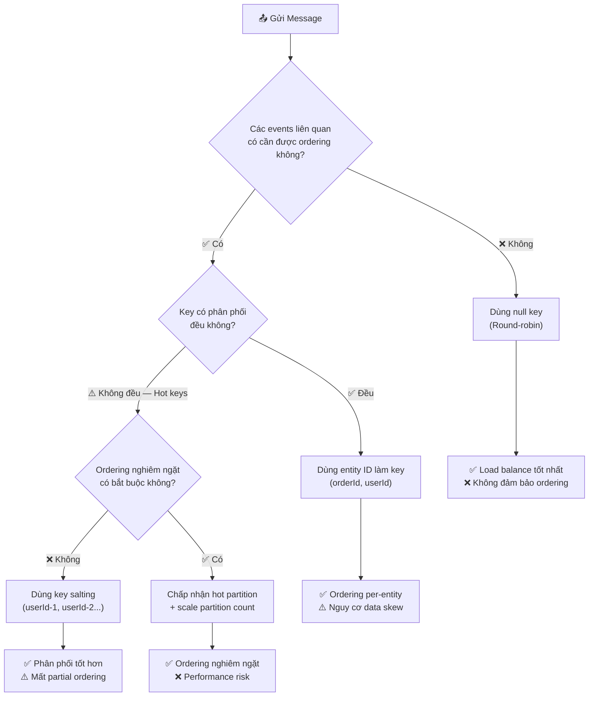
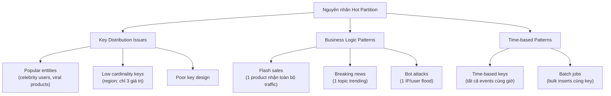
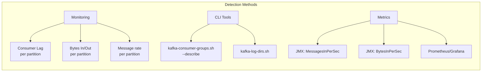
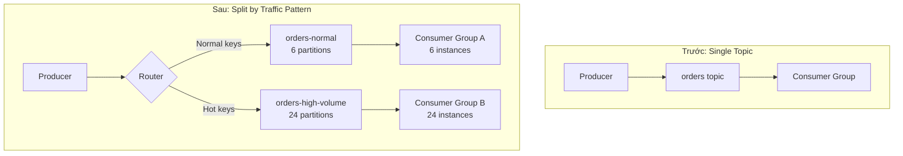
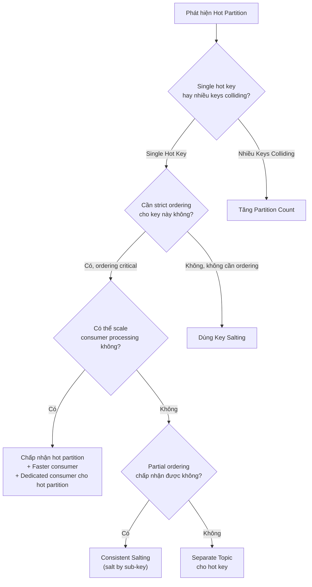

# Partitioning Strategy

## Mục lục

- [Message Key là gì?](#message-key-là-gì)
- [Decision: Có nên dùng Key không?](#decision-có-nên-dùng-key-không)
- [Option A: Không có Key](#option-a-không-có-key)
- [Option B: Có Key](#option-b-có-key)
- [Key Strategy Comparison](#key-strategy-comparison)
- [Trade-off Matrix](#trade-off-matrix)
- [Hot Partitions](#hot-partitions)
- [Phát hiện Hot Partition](#phát-hiện-hot-partition)
- [Giải pháp xử lý Hot Partition](#giải-pháp-xử-lý-hot-partition)
- [Prometheus Alerting](#prometheus-alerting)
- [Best Practices](#best-practices)

---

## Message Key là gì?

Mỗi message Kafka có thể có một **key** tùy chọn. Key quyết định message sẽ đến **partition nào**.

```
┌──────────────────────────────────────┐
│           Kafka Message              │
├──────────────┬───────────────────────┤
│ Key          │ "order-123"           │
│ Value        │ { orderId: 123, ... } │
│ Headers      │ { trace-id: "abc" }   │
│ Timestamp    │ 1704067200000         │
│ Partition    │ Tính từ hash(key)     │
└──────────────┴───────────────────────┘
```

**Công thức phân partition:**

```
Partition = hash(key) % num_partitions
```

Nếu key là `null` → Kafka dùng **Sticky Partitioning** (gom vào một partition cho đến hết batch, rồi switch).

---

## Decision: Có nên dùng Key không?



---

## Option A: Không có Key

Khi truyền `null` làm key, Kafka dùng **Sticky Partitioning**:

- Gom messages vào **một partition** cho đến hết batch
- Sau đó switch sang partition tiếp theo
- Hiệu quả gần giống Round-Robin

```java
// Gửi không có key
kafkaTemplate.send("orders", orderData);
// hoặc tường minh:
kafkaTemplate.send("orders", null, orderData);
```

**Kết quả:**

```
P0: ████████████████░░░░░░  ~25% traffic
P1: ████████████████░░░░░░  ~25% traffic
P2: ████████████████░░░░░░  ~25% traffic
P3: ████████████████░░░░░░  ~25% traffic
✅ Load balance hoàn hảo
❌ Không có ordering đảm bảo
```

**Khi nào dùng?**
- Log events, metrics, analytics
- Events độc lập không cần thứ tự (vd: "user clicked button")
- Khi throughput quan trọng hơn ordering

---

## Option B: Có Key

Khi truyền key, tất cả messages có **cùng key** luôn đến **cùng partition**:

```java
// Gửi với key — orderId quyết định partition
kafkaTemplate.send("orders", orderId, orderData);

// Template: send(topic, key, value)
kafkaTemplate.send("orders", "order-123", myOrderObj);
```

**Kết quả:**

```
hash("order-123") % 4 = 2

P0: ████░░░░░░░░░░░░░░░░░░  Các orders khác
P1: ███████░░░░░░░░░░░░░░░  Các orders khác
P2: ████████████████████░░  order-123, order-456, order-789...
P3: ████░░░░░░░░░░░░░░░░░░  Các orders khác

✅ Tất cả events của order-123 → P2 → đảm bảo ordering
⚠️ Phụ thuộc distribution của keys
```

**Khi nào dùng?**
- State machine (Created → Paid → Shipped → Delivered) — **phải dùng key**
- Events của cùng một entity cần ordering (user actions, order updates)
- Stateful processing per entity

---

## Key Strategy Comparison

| Strategy | Key Value | Partition Selection | Ordering | Load Balance | Use Case |
|----------|-----------|-------------------|----------|-------------|----------|
| **No Key** | `null` | Sticky/Round-robin | ❌ Không | ✅ Hoàn hảo | Logs, metrics, independent events |
| **Entity Key** | `orderId` | `hash % partitions` | ✅ Per-entity | ⚠️ Phụ thuộc distribution | Order events, user actions |
| **Compound Key** | `region:userId` | `hash % partitions` | ✅ Per-compound | ⚠️ Tốt hơn single | Multi-tenant systems |
| **Salted Key** | `userId-{0-9}` | Trải đều 10 partitions | ⚠️ Partial | ✅ Tốt hơn với hot keys | Celebrity/VIP users |
| **Explicit Partition** | Bất kỳ | Bạn tự chọn | ⚠️ Manual | ⚠️ Manual | Special routing |

---

## Trade-off Matrix

> **Quy tắc vàng**: Bạn đánh đổi Load Balancing để lấy Ordering.

| Yêu cầu | No Key | Entity Key | Salted Key |
|---------|--------|-----------|-----------|
| Max Throughput | ✅ Tốt nhất | ⚠️ Variable | ✅ Tốt |
| Ordering per Entity | ❌ Không có | ✅ Đảm bảo | ⚠️ Partial |
| Load Balance | ✅ Hoàn hảo | ⚠️ Nguy cơ skew | ✅ Tốt hơn |
| Độ đơn giản | ✅ Dễ | ✅ Dễ | ⚠️ Phức tạp |

---

## Hot Partitions

**Hot Partition** là partition nhận lượng traffic **không tương xứng** so với các partition khác, gây ra bottleneck, consumer lag, và nguy cơ system failure.

### Minh họa Hot Partition

```
┌─────────────────────────────────────────────────────────────────────────────────┐
│                         HOT PARTITION VISUALIZED                                │
├─────────────────────────────────────────────────────────────────────────────────┤
│                                                                                 │
│   Topic: user-events (6 Partitions)                                             │
│                                                                                 │
│   Messages/sec per partition:                                                   │
│                                                                                 │
│   P0: ████░░░░░░░░░░░░░░░░░░░░░░░░░░  500 msg/s   ✅ Bình thường                │
│   P1: ███░░░░░░░░░░░░░░░░░░░░░░░░░░░  400 msg/s   ✅ Bình thường                │
│   P2: █████████████████████████████░  50,000 msg/s 🔥 HOT!                      │
│   P3: ████░░░░░░░░░░░░░░░░░░░░░░░░░░  450 msg/s   ✅ Bình thường                │
│   P4: ███░░░░░░░░░░░░░░░░░░░░░░░░░░░  380 msg/s   ✅ Bình thường                │
│   P5: ████░░░░░░░░░░░░░░░░░░░░░░░░░░  420 msg/s   ✅ Bình thường                │
│                                                                                 │
│   Consumer Lag:                                                                 │
│   P0: 0    P1: 0    P2: 2,500,000 🚨    P3: 0    P4: 0    P5: 0                 │
│                                                                                 │
│   P2 nhận 100x nhiều hơn → Consumer không thể bắt kịp!                          │
└─────────────────────────────────────────────────────────────────────────────────┘
```

### Nguyên nhân Hot Partition



---

### Ví dụ Thực Tế

#### Ví dụ 1: E-Commerce Flash Sale

```
┌─────────────────────────────────────────────────────────────────────────────────┐
│                    KỊCH BẢN: Black Friday Flash Sale                            │
├─────────────────────────────────────────────────────────────────────────────────┤
│                                                                                 │
│   Topic: order-events, Key: productId                                           │
│                                                                                 │
│   Ngày bình thường:                                                             │
│   Product A (100/sec) → [P0]  ✅                                                │
│   Product B (120/sec) → [P1]  ✅                                                │
│   Product C ( 80/sec) → [P2]  ✅                                                │
│   Product D (110/sec) → [P3]  ✅  → Balanced                                    │
│                                                                                 │
│   Flash Sale (iPhone giảm 50%):                                                 │
│   Product A ( 100/sec) → [P0]  ✅                                               │
│   iPhone   (50,000/sec) → [P1]  🔥 ĐANG SỤP!                                    │
│   Product C (  80/sec) → [P2]  ✅                                               │
│   Product D ( 110/sec) → [P3]  ✅                                               │
│                                                                                 │
│   Hậu quả:                                                                      │
│   - Consumer P1 lag 5 tiếng                                                     │
│   - Đơn hàng bị queue hàng giờ                                                  │
│   - Khách hàng thấy "đang xử lý..." mãi                                         │
│   - Thiệt hại doanh thu!                                                        │
└─────────────────────────────────────────────────────────────────────────────────┘
```

#### Ví dụ 2: Social Media Viral (Twitter/X Effect)

```
Kịch bản: Notification service, Key = targetUserId

Khi @elonmusk tweet → 150 triệu followers nhận notification
  → Key = userId của từng follower → PHÂN PHỐI ĐỀU ✅ Không hot partition

Khi 10,000 người @mention @elonmusk →
  → Key = "elonmusk" (người nhận notification)
  → Tất cả 10,000 notifications → CÙNG PARTITION 🔥 HOT!
```

#### Ví dụ 3: IoT Sensor Data

```
Topic: sensor-readings, Key: regionId

NYC:   50,000 sensors → 500K msg/sec → [P0] 🔥
Rural:    500 sensors →   5K msg/sec → [P1] ✅
Tokyo: 80,000 sensors → 800K msg/sec → [P2] 🔥🔥

Giải pháp: Đổi key từ regionId → sensorId
→ 130,500 unique keys → phân phối đều
```

---

## Phát hiện Hot Partition

### CLI Detection

```bash
# Xem consumer lag per partition — tìm LAG không đều
kafka-consumer-groups.sh --bootstrap-server localhost:9092 \
    --describe --group order-service

# Output cho thấy hot partition:
# GROUP         TOPIC    PARTITION  CURRENT-OFFSET  LOG-END-OFFSET  LAG
# order-service orders   0          1000            1005            5        ← OK
# order-service orders   1          500             2500000         2499500  ← 🔥 HOT!
# order-service orders   2          800             810             10       ← OK

# Xem kích thước log per partition
kafka-log-dirs.sh --bootstrap-server localhost:9092 \
    --describe --topic-list orders
```

### JMX Metrics để monitor



---

## Giải pháp xử lý Hot Partition

### Solution 1: Key Salting ✅ Khuyến nghị cho hầu hết cases

Thêm suffix ngẫu nhiên vào hot key để phân tán messages:

```
Trước salting: key = "celebrity-user-123" → hash() % 6 = Partition 2 🔥

Salted keys:
"celebrity-user-123-0" → hash() % 6 = P0
"celebrity-user-123-1" → hash() % 6 = P3
"celebrity-user-123-2" → hash() % 6 = P1
"celebrity-user-123-3" → hash() % 6 = P5
...

Kết quả: 50,000 msg/sec chia đều ~10 partitions = 5,000/partition ✅
Trade-off: Mất strict ordering cho hot key (chấp nhận được trong hầu hết cases)
```

**Java Implementation:**

```java
@Service
public class SaltedKeyProducer {

    private final KafkaTemplate<String, OrderEvent> kafkaTemplate;
    private final Random random = new Random();

    private static final int SALT_BUCKETS = 10;

    // Hot keys đã biết — load từ config/database
    private final Set<String> hotKeys = Set.of(
        "celebrity-user-123",
        "viral-product-456",
        "breaking-news-topic"
    );

    public void sendEvent(String key, OrderEvent event) {
        String finalKey = key;

        // Chỉ áp dụng salting cho known hot keys
        if (hotKeys.contains(key)) {
            int salt = random.nextInt(SALT_BUCKETS);
            finalKey = key + "-" + salt;
        }

        kafkaTemplate.send("orders", finalKey, event);
    }

    // Khi cần partial ordering trong hot key (cùng session → cùng bucket)
    public void sendEventWithConsistentSalt(String key, String subKey, OrderEvent event) {
        String finalKey = key;

        if (hotKeys.contains(key)) {
            // Dùng subKey hash để consistent routing trong hot key
            int salt = Math.abs(subKey.hashCode()) % SALT_BUCKETS;
            finalKey = key + "-" + salt;
        }

        kafkaTemplate.send("orders", finalKey, event);
    }
}
```

---

### Solution 2: Custom Partitioner

Kiểm soát hoàn toàn logic routing:

```java
/**
 * Partitioner tùy chỉnh xử lý hot keys đặc biệt
 */
public class HotKeyAwarePartitioner implements Partitioner {

    private final Set<String> hotKeys = ConcurrentHashMap.newKeySet();
    private final AtomicInteger roundRobinCounter = new AtomicInteger(0);

    @Override
    public void configure(Map<String, ?> configs) {
        // Load hot keys từ config
        String hotKeyList = (String) configs.get("hot.keys");
        if (hotKeyList != null) {
            Arrays.stream(hotKeyList.split(","))
                  .map(String::trim)
                  .forEach(hotKeys::add);
        }
    }

    @Override
    public int partition(String topic, Object key, byte[] keyBytes,
                        Object value, byte[] valueBytes, Cluster cluster) {

        List<PartitionInfo> partitions = cluster.partitionsForTopic(topic);
        int numPartitions = partitions.size();

        if (key == null) {
            // Null key: round-robin
            return Math.abs(roundRobinCounter.getAndIncrement()) % numPartitions;
        }

        String keyStr = key.toString();

        if (hotKeys.contains(keyStr)) {
            // Hot key: phân tán across ALL partitions
            return Math.abs(roundRobinCounter.getAndIncrement()) % numPartitions;
        }

        // Normal key: dùng murmur2 hash mặc định
        return Utils.toPositive(Utils.murmur2(keyBytes)) % numPartitions;
    }

    @Override
    public void close() {}
}
```

**Cấu hình trong application.yml:**

```yaml
spring:
  kafka:
    producer:
      properties:
        partitioner.class: com.example.HotKeyAwarePartitioner
        hot.keys: celebrity-user-123,viral-product-456
```

---

### Solution 3: Separate Topics

Tách hot keys ra topic riêng với nhiều partitions hơn:



```java
@Service
public class TopicRoutingProducer {

    private final KafkaTemplate<String, OrderEvent> kafkaTemplate;
    private final Set<String> hotKeys;

    private static final String NORMAL_TOPIC = "orders-normal";
    private static final String HIGH_VOLUME_TOPIC = "orders-high-volume";

    public void sendEvent(String key, OrderEvent event) {
        String topic = hotKeys.contains(key) ? HIGH_VOLUME_TOPIC : NORMAL_TOPIC;
        kafkaTemplate.send(topic, key, event);
    }
}
```

---

### Solution 4: Tăng số Partitions

> [!WARNING]
> **Hiểu đúng**: Tăng partitions **KHÔNG fix** single hot key problem!

```
Trước: 6 partitions
hash("hot-key") % 6 = Partition 2 🔥

Sau: 24 partitions
hash("hot-key") % 24 = Partition 14 🔥

→ Hot key vẫn CHỈ đến 1 partition (nay là P14 thay vì P2)
→ Vẫn hot partition!
```

**Khi nào tăng partition THỰC SỰ giúp ích:**
- Nhiều **hot keys khác nhau** đang collision vào cùng partition
- Cần nhiều consumer parallelism hơn
- Không phải single key causing all traffic

---

### Solution Comparison Matrix

| Giải pháp | Ordering giữ được? | Độ phức tạp | Throughput Gain | Dùng khi |
|----------|-------------------|------------|-----------------|----------|
| **Key Salting** | ❌ Mất với hot keys | Thấp | Cao (10x+) | Hầu hết trường hợp |
| **Consistent Salting** | ⚠️ Partial (trong bucket) | Trung bình | Trung bình | Cần partial ordering |
| **Custom Partitioner** | ❌ Mất với hot keys | Trung bình | Cao | Hot keys có thể dự đoán |
| **Separate Topics** | ✅ Trong mỗi topic | Cao | Rất cao | Traffic patterns rất khác biệt |
| **Tăng Partitions** | ✅ Đầy đủ | Thấp | ⚠️ Chỉ khi nhiều hot keys collision | Multiple hot keys colliding |

### Decision Flowchart



---

## Prometheus Alerting

```yaml
groups:
  - name: kafka-hot-partition-alerts
    rules:
      # Alert khi một partition có traffic gấp 10x trung bình
      - alert: KafkaHotPartitionDetected
        expr: |
          kafka_server_brokertopicmetrics_messagesin_total{topic="orders"}
          / on(topic) group_left
          avg(kafka_server_brokertopicmetrics_messagesin_total{topic="orders"}) by (topic)
          > 10
        for: 5m
        labels:
          severity: warning
        annotations:
          summary: "Hot partition phát hiện trong topic {{ $labels.topic }}"

      # Alert khi consumer lag đang tăng nhanh
      - alert: KafkaPartitionLagGrowing
        expr: |
          delta(kafka_consumergroup_lag{topic="orders"}[5m]) > 10000
        for: 5m
        labels:
          severity: critical
        annotations:
          summary: "Partition {{ $labels.partition }} lag đang tăng nhanh"
```

---

## Best Practices

> [!TIP]
> **Phòng bệnh hơn chữa bệnh:**
> 1. Thiết kế key với uniform distribution ngay từ đầu
> 2. Monitor partition metrics từ ngày đầu deploy
> 3. Chuẩn bị salting strategy trước khi hot keys xuất hiện
> 4. Load test với data distribution thực tế (skewed data, không phải uniform)

> [!CAUTION]
> **Lỗi phổ biến:**
> 1. Dùng `null` key nghĩ là phân phối đều — đúng, nhưng mất ordering hoàn toàn
> 2. Nghĩ rằng thêm partitions sẽ fix single hot key — không đúng
> 3. Không test với production-like skewed data distribution
> 4. Bỏ qua hot partitions cho đến khi consumer lag trở nên critical

### Quick Reference — Công thức chọn Key

```
Cần ordering per entity?
  → Có: Dùng entity ID (orderId, userId)
      → Có nguy cơ hot key? Dùng Salting
  → Không: Dùng null key (max throughput)

Key đã chọn gây hot partition?
  → Ordering critical: Consistent Salting hoặc Separate Topic
  → Ordering không quan trọng: Random Salting
  → Nhiều keys collision: Tăng Partitions
```

<Cards>
  <Card title="Consumer Groups" href="/core-concepts/consumer-groups/" description="Rebalancing, AckMode và partition assignment rules" />
  <Card title="Offset Management" href="/core-concepts/offsets/" description="5 lifecycle scenarios, CLI reset, consumer lag monitoring" />
  <Card title="Exactly-Once" href="/producers-consumers/exactly-once/" description="EOS và idempotency để xử lý duplicate messages" />
</Cards>
