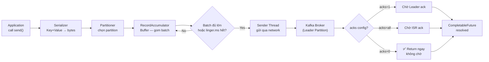

# Producers (Fundamentals)

## Mục lục

- [Producer là gì?](#producer-là-gì)
- [Producer Pipeline](#producer-pipeline)
- [Batching & Linger.ms](#batching--lingerms)
- [Acks & Reliability](#acks--reliability)
- [Retry & Idempotency](#retry--idempotency)
- [Producer Configuration Reference](#producer-configuration-reference)

---

## Producer là gì?

**Producer** là bất kỳ ứng dụng nào **gửi (publish) messages** vào Kafka topic. Producer quyết định:
- Gửi vào **topic** nào
- Gửi vào **partition** nào (qua key hoặc custom partitioner)
- **Độ đảm bảo** (acks setting)

```
Your Application
      │
      ▼
┌─────────────────────────────────────────────┐
│              Kafka Producer                  │
│  ┌──────────┐  ┌───────────┐  ┌──────────┐ │
│  │Serialize │→│  Partition │→│  Buffer  │ │
│  │ Key+Val  │  │  Selector │  │  (Batch) │ │
│  └──────────┘  └───────────┘  └──────────┘ │
└─────────────────────────────────────────────┘
      │
      ▼ network
Kafka Broker (Leader Partition)
```

---

## Producer Pipeline

Từ lúc gọi `send()` đến khi message đến Broker, message đi qua pipeline:



---

## Batching & Linger.ms

Producer **gom nhiều messages vào một batch** trước khi gửi — tăng đáng kể throughput.

### Hai cơ chế trigger gửi batch

```
┌──────────────────────────────────────────────────────────────────┐
│                    RecordAccumulator Buffer                       │
│                                                                  │
│  Partition 0 Batch: [msg1][msg2][msg3]...          16KB max     │
│  Partition 1 Batch: [msg1]                                       │
│  Partition 2 Batch: [msg1][msg2]                                 │
│                                                                  │
│  Trigger gửi khi:                                                │
│  1. Batch size >= batch.size (mặc định 16KB)  → Flush ngay      │
│  2. linger.ms hết hạn (mặc định 0ms)          → Flush dù chưa  │
│                                                full              │
└──────────────────────────────────────────────────────────────────┘
```

### Tác dụng của linger.ms

```
linger.ms = 0 (mặc định):
  msg1 gửi ngay → 1 request/message → latency thấp, throughput thấp

linger.ms = 10:
  msg1, msg2, msg3 trong 10ms → 1 request/nhiều messages → throughput cao
  Trade-off: thêm 0-10ms latency
```

### Cấu hình production-ready

```yaml
spring:
  kafka:
    producer:
      batch-size: 32768        # 32KB — lớn hơn mặc định 16KB
      linger-ms: 10            # Chờ 10ms để gom batch
      buffer-memory: 67108864  # 64MB total buffer
      compression-type: lz4   # Nén batch trước khi gửi
```

**Compression trade-off:**

| Codec | Compress ratio | CPU cost | Tốt nhất cho |
|-------|---------------|---------|-------------|
| none | 1x | 0 | Default, latency critical |
| gzip | 3-5x | Cao | Archival, kích thước quan trọng |
| snappy | 2-3x | Thấp | Balanced (Google recommend) |
| **lz4** | 2-3x | Rất thấp | **Production recommended** |
| zstd | 3-5x | Trung bình | Kafka 2.1+, tốt nhất về ratio/speed |

---

## Acks & Reliability

`acks` quyết định **khi nào Producer coi message là "đã gửi thành công"**:

```
acks=0 (Fire and Forget):
  Producer → Broker  (không chờ gì cả)
  ✅ Throughput tối đa
  ❌ Có thể mất data nếu broker down

acks=1 (Leader Ack):
  Producer → Leader → ✅ ACK về Producer
              │
              └──→ Follower (async, sau khi đã ACK)
  ⚠️ Trade-off: Nếu Leader crash trước khi replicate → mất data
  ✅ Good balance cho non-critical data

acks=all/-1 (Full ISR Ack):
  Producer → Leader → Follower1 → ✅
                    → Follower2 → ✅
                    → ACK về Producer (chỉ sau khi TẤT CẢ ISR ack)
  ✅ Không mất data (nếu ISR size >= 2)
  ⚠️ Latency cao hơn một chút
```

> [!TIP]
> **Cho production:** Luôn dùng `acks=all` + `min.insync.replicas=2`. Đây là cấu hình đảm bảo **không mất data** trong khi vẫn có thể tolerate 1 broker failure.

---

## Retry & Idempotency

### Vấn đề với Retry đơn giản

```
Scenario: Producer gửi message, timeout → retry

Producer ──send msg A──▶ Broker  (broker nhận được, đang process)
         ←─ TIMEOUT ──── (network issue)
Producer ──retry msg A──▶ Broker  (broker nhận lần 2!)

Kết quả: msg A bị ghi 2 lần → DUPLICATE!
```

### Idempotent Producer — Giải pháp

Kích hoạt `enable.idempotence=true` → Kafka tự dedup:

```
Producer gán mỗi message một ID duy nhất:
  (ProducerID, PartitionID, SequenceNumber)

Broker nhớ sequence number đã nhận:
  - Message mới: write vào log ✅
  - Message duplicate (same seq): bỏ qua ✅ (không ghi lại)

→ Exactly-once delivery trong phạm vi một partition, một session
```

```yaml
spring:
  kafka:
    producer:
      acks: all
      retries: 2147483647      # Retry tối đa
      properties:
        enable.idempotence: true
        max.in.flight.requests.per.connection: 5
        delivery.timeout.ms: 120000
```

> [!WARNING]
> `enable.idempotence=true` yêu cầu: `acks=all` và `max.in.flight.requests.per.connection <= 5`. Spring Kafka tự validate các ràng buộc này. Nếu cấu hình sai, app sẽ fail khi start.

### Retry có giới hạn vs Unlimited

```
retries=3: Thử tối đa 3 lần trong delivery.timeout.ms
           → Sau 3 lần fail: CompletableFuture.exceptionally() được gọi

retries=MAX_INT (2147483647): Thử mãi trong delivery.timeout.ms (mặc định 120s)
                               → Sau 120s: timeout exception
                               → Khuyến nghị với idempotent producer
```

---

## Producer Configuration Reference

| Property | Mặc định | Khuyến nghị Production | Mô tả |
|----------|---------|----------------------|-------|
| `acks` | `1` | `all` | Độ đảm bảo ack |
| `retries` | `2147483647` | `2147483647` | Số lần retry |
| `batch.size` | `16384` (16KB) | `32768` (32KB) | Kích thước batch |
| `linger.ms` | `0` | `10-20` | Thời gian chờ gom batch |
| `buffer.memory` | `33554432` (32MB) | `67108864` (64MB) | Buffer tổng |
| `compression.type` | `none` | `lz4` | Nén messages |
| `enable.idempotence` | `false` | `true` | Tránh duplicate |
| `max.in.flight.requests` | `5` | `5` | Concurrent requests |
| `delivery.timeout.ms` | `120000` (2 phút) | `120000` | Tổng timeout |

<Cards>
  <Card title="Producer API" href="/producers-consumers/producer-api/" description="KafkaTemplate methods và send patterns trong Spring Boot" />
  <Card title="Partitioning Strategy" href="/core-concepts/partitioning-strategy/" description="Keys, hot partitions và giải pháp" />
  <Card title="Exactly-Once" href="/producers-consumers/exactly-once/" description="Idempotent producer và transactions" />
</Cards>
