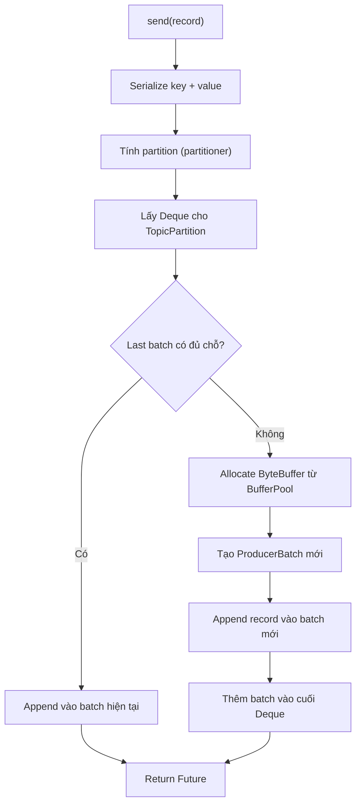
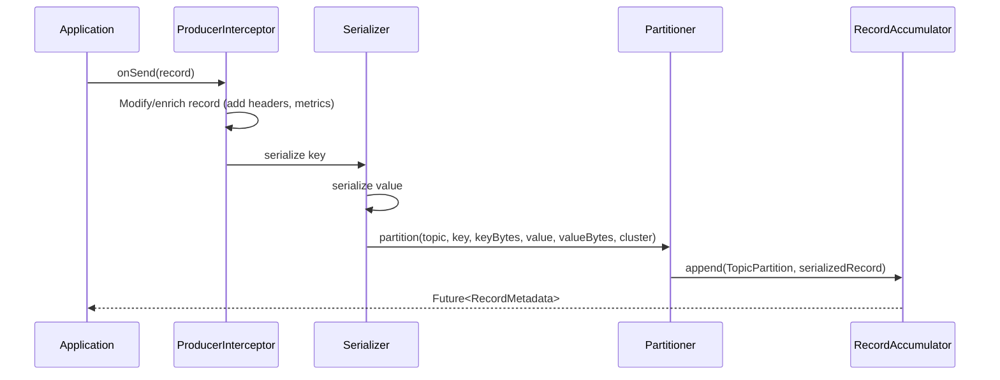

## Mục lục

- [Bối cảnh: Tại sao send() không thực sự gửi message ngay?](#1-bối-cảnh-tại-sao-send-không-thực-sự-gửi-message-ngay)
- [Kiến trúc tổng thể — 2 threads, 1 buffer](#2-kiến-trúc-tổng-thể--2-threads-1-buffer)
- [RecordAccumulator — Bộ nhớ đệm trung tâm](#3-recordaccumulator--bộ-nhớ-đệm-trung-tâm)
- [Batching Algorithm — batch.size vs linger.ms](#4-batching-algorithm--batchsize-vs-lingerms)
- [BufferPool — Memory management không GC](#5-bufferpool--memory-management-không-gc)
- [Sender Thread — Network I/O loop](#6-sender-thread--network-io-loop)
- [Acks Protocol — Reliability vs Latency](#7-acks-protocol--reliability-vs-latency)
- [Retry Internals — max.in.flight và ordering](#8-retry-internals--maxinflight-và-ordering)
- [Idempotent Producer — PID + Sequence Number](#9-idempotent-producer--pid--sequence-number)
- [Sticky Partitioning — Tối ưu cho null key](#10-sticky-partitioning--tối-ưu-cho-null-key)
- [Interceptors & Serialization Pipeline](#11-interceptors--serialization-pipeline)
- [Compression — Khi nào và tại sao compress ở producer](#12-compression--khi-nào-và-tại-sao-compress-ở-producer)
- [Metrics quan trọng & Tuning](#13-metrics-quan-trọng--tuning)
- [Common Pitfalls](#14-common-pitfalls)
- [Tóm tắt — Cheat sheet](#15-tóm-tắt--cheat-sheet)

---

## 1. Bối cảnh: Tại sao send() không thực sự gửi message ngay?

Bạn gọi `producer.send(record)` và nghĩ message bay đi ngay lập tức. Thực tế:

```java
Future<RecordMetadata> future = producer.send(record);
// Message CHƯA gửi đến broker — nó nằm trong buffer!
// Network request xảy ra SAU ĐÓ, bởi một thread khác.
```

Nếu `send()` gửi từng message qua network → mỗi message tốn 1 round-trip (~1ms LAN, ~50ms cross-AZ). Với 100.000 msg/s bạn cần 100.000 round-trips/s → **không thể scale**.

Kafka Producer giải quyết bằng **batching**: gom messages vào buffer, gửi cả batch 1 lần. Trade-off: **latency tăng nhẹ, throughput tăng mạnh**:

```
Không batch: 100.000 msg × 1ms RTT = 100s để gửi hết
Batch 1000:  100 batch × 1ms RTT = 0.1s để gửi hết (1000x nhanh hơn!)
```

> [!IMPORTANT]
> `send()` là **asynchronous và non-blocking** (trừ khi buffer đầy). Nó chỉ serialize message rồi đặt vào buffer. Thread gọi `send()` **không bao giờ** chạm network — đó là việc của Sender thread.

---

## 2. Kiến trúc tổng thể — 2 threads, 1 buffer

```
┌─────────────────────────────────────────────────────────────────────────────┐
│                         Kafka Producer (1 instance)                          │
├─────────────────────────────────────────────────────────────────────────────┤
│                                                                             │
│  ┌──────────────┐         ┌─────────────────────────┐                       │
│  │ Application  │ send()  │   RecordAccumulator      │                       │
│  │   Thread     │────────▶│                         │                       │
│  │ (your code)  │         │  ┌─────┐ ┌─────┐ ┌───┐ │         ┌──────────┐  │
│  └──────────────┘         │  │Batch│ │Batch│ │...│ │ drain()  │  Sender  │  │
│                           │  │ P0  │ │ P1  │ │   │ │────────▶│  Thread   │  │
│  ┌──────────────┐         │  └─────┘ └─────┘ └───┘ │         │(single)  │  │
│  │ Application  │ send()  │                         │         │          │  │
│  │   Thread     │────────▶│  ┌─────────────────┐    │         │ Network  │  │
│  │ (your code)  │         │  │   BufferPool     │    │         │ Client   │──────▶ Broker
│  └──────────────┘         │  │  (reusable mem)  │    │         └──────────┘  │
│                           │  └─────────────────┘    │                       │
│                           └─────────────────────────┘                       │
└─────────────────────────────────────────────────────────────────────────────┘
```

| Component | Thread | Vai trò |
|-----------|--------|---------|
| **Application thread(s)** | Bất kỳ thread nào gọi `send()` | Serialize, partition, append to batch |
| **RecordAccumulator** | Shared (thread-safe) | Buffer batches per partition |
| **BufferPool** | Shared | Quản lý `ByteBuffer` reusable, tránh GC |
| **Sender thread** | Single background thread | Drain batches, tạo ProduceRequest, nhận response |
| **NetworkClient** | Trong Sender thread | Manage connections, multiplex requests |

---

## 3. RecordAccumulator — Bộ nhớ đệm trung tâm

### 3.1. Cấu trúc dữ liệu

```java
// Simplified từ Kafka source
public class RecordAccumulator {
    // Mỗi TopicPartition có 1 Deque<ProducerBatch>
    private final ConcurrentMap<TopicPartition, Deque<ProducerBatch>> batches;
    private final BufferPool free;          // pool ByteBuffer
    private final int batchSize;            // batch.size config
    private final long lingerMs;            // linger.ms config
    private final long totalMemory;         // buffer.memory config
}
```

### 3.2. Append flow



### 3.3. Thread safety

`send()` có thể gọi từ nhiều threads cùng lúc. Kafka dùng **lock per-partition** (không phải global lock):

```java
// Mỗi Deque<ProducerBatch> đi kèm với lock riêng
synchronized (deque) {
    ProducerBatch last = deque.peekLast();
    if (last != null) {
        FutureRecordMetadata future = last.tryAppend(timestamp, key, value, headers, ...);
        if (future != null) return future;  // success — append vào batch hiện tại
    }
}
// Nếu batch đầy → allocate bên ngoài lock → acquire lock lại → thêm batch mới
```

---

## 4. Batching Algorithm — batch.size vs linger.ms

### 4.1. Hai điều kiện gửi batch

Một batch được gửi khi **một trong hai** điều kiện thỏa:

```
Gửi batch khi:
  (1) batch.size đầy (default 16KB)      → Throughput-driven
  HOẶC
  (2) linger.ms hết (default 0ms)        → Latency-driven
  HOẶC
  (3) buffer.memory đầy (back-pressure)  → Force drain
```

### 4.2. linger.ms = 0 (default) — Gửi ngay lập tức?

Không hẳn. Khi `linger.ms=0`, Sender thread sẽ drain batch **ngay khi nó thức dậy**. Nhưng Sender thread không poll liên tục — nó sleep giữa các iteration. Trong thời gian sleep đó, nhiều records có thể append vào cùng batch:

```
Timeline (linger.ms=0, batch.size=16KB):

T=0ms: send(record1) → append vào batch P0 (batch size: 200B)
T=0.1ms: send(record2) → append vào batch P0 (batch size: 400B)
T=0.2ms: Sender wakes up → drain batch P0 (400B, chưa đầy nhưng linger=0)
          → Gửi ProduceRequest chứa 2 records

Với linger.ms=20:
T=0ms: send(record1) → append
T=0.1ms: send(record2) → append
...
T=19.9ms: send(record50) → append (batch: 10KB)
T=20ms: Sender wakes up → drain batch P0 (10KB, 50 records)
          → Gửi 1 ProduceRequest chứa 50 records (hiệu quả hơn!)
```

### 4.3. Công thức throughput

```
Effective batch size = min(batch.size, throughput × linger.ms)

Ví dụ: throughput 1MB/s, linger.ms=20
  → batch tích được 1MB × 0.02s = 20KB mỗi 20ms
  → Nếu batch.size=16KB → batch đầy trước linger hết → gửi khi 16KB

Ví dụ: throughput 100KB/s, linger.ms=20
  → batch tích được 100KB × 0.02s = 2KB mỗi 20ms
  → batch.size=16KB chưa đầy → gửi khi linger hết (batch 2KB)
```

---

## 5. BufferPool — Memory management không GC

### 5.1. Vấn đề GC

Producer gửi 500.000 msg/s, mỗi batch 16KB. Nếu mỗi batch `new byte[16384]`:
- 500.000 / (16KB / avg_msg_size) = hàng nghìn allocations/s
- Tất cả trở thành garbage → GC pause → latency spike

### 5.2. BufferPool solution

```java
// Kafka BufferPool (simplified)
public class BufferPool {
    private final long totalMemory;           // buffer.memory (default 32MB)
    private final int poolableSize;           // = batch.size (default 16KB)
    private final Deque<ByteBuffer> free;     // pool các buffer kích thước poolableSize
    private long nonPooledAvailableMemory;    // memory chưa allocate

    public ByteBuffer allocate(int size, long maxTimeToBlock) {
        if (size == poolableSize && !free.isEmpty()) {
            return free.pollFirst();  // O(1), không GC!
        }
        // Nếu size != poolableSize (batch lớn hơn) → allocate mới
        // Nếu hết memory → block thread gọi send() tới maxTimeToBlock
    }

    public void deallocate(ByteBuffer buffer) {
        if (buffer.capacity() == poolableSize) {
            buffer.clear();
            free.add(buffer);  // Trả lại pool, reuse
        } else {
            nonPooledAvailableMemory += buffer.capacity();
        }
    }
}
```

### 5.3. Back-pressure: buffer.memory đầy

Khi tổng memory đã dùng = `buffer.memory` (32MB default):
- `send()` bị **BLOCK** (chờ Sender giải phóng batch đã gửi thành công)
- Block tối đa `max.block.ms` (60s default)
- Quá thời gian → throw `TimeoutException`

> [!WARNING]
> `buffer.memory` đầy = **back-pressure tự nhiên** của Producer. Nhưng nếu bạn thấy `send()` bị block thường xuyên → Sender thread bị bottleneck (network chậm, broker quá tải, hoặc `acks=all` chờ replication lâu).

---

## 6. Sender Thread — Network I/O loop

### 6.1. Main loop

```java
// Simplified Sender.run()
while (running) {
    // 1. Drain ready batches từ RecordAccumulator
    Map<Integer, List<ProducerBatch>> batches = accumulator.drain(cluster, ...);

    // 2. Group batches by destination broker (node)
    Map<Integer, ProduceRequest> requests = groupByNode(batches);

    // 3. Send requests (non-blocking, buffered in NetworkClient)
    for (Map.Entry<Integer, ProduceRequest> entry : requests) {
        client.send(entry.getValue(), callback);
    }

    // 4. Poll network events (receive responses, handle timeouts)
    client.poll(timeout);

    // 5. Handle completed requests (invoke callbacks)
    handleCompletedRequests();
}
```

### 6.2. In-flight requests

`max.in.flight.requests.per.connection` (default 5) cho phép Sender gửi 5 requests tới cùng broker **mà chưa nhận response**:

```
Timeline (max.in.flight=5):
T=0:  Send batch1 → Broker1
T=1:  Send batch2 → Broker1     (không chờ ack batch1!)
T=2:  Send batch3 → Broker1
T=3:  Receive ack batch1
T=4:  Send batch4 → Broker1     (vẫn 4 in-flight: 2,3,4 + vừa gửi)
...
```

Throughput = `batch_size × max_in_flight / RTT`

### 6.3. Connection management

Sender duy trì **1 TCP connection per broker**. Tất cả requests tới cùng broker multiplex qua 1 connection (Kafka protocol hỗ trợ pipelining):

```
App Thread 1 → send(P0) ─┐
App Thread 2 → send(P0) ─┤→ RecordAccumulator → Sender → TCP conn → Broker 1
App Thread 3 → send(P1) ─┘                              (ProduceRequest: [P0 batch, P1 batch])
```

---

## 7. Acks Protocol — Reliability vs Latency

### 7.1. Ba mức acks

```
┌─────────────────────────────────────────────────────────────────────────────┐
│ acks=0: "Fire and Forget"                                                   │
│                                                                             │
│ Producer ──send──▶ [Broker]    Producer KHÔNG chờ response                  │
│                                Leader có thể chưa ghi xong, có thể mất     │
│ Latency: ~0ms thêm | Durability: THẤP NHẤT | Throughput: CAO NHẤT          │
├─────────────────────────────────────────────────────────────────────────────┤
│ acks=1: "Leader Acknowledged" (default)                                     │
│                                                                             │
│ Producer ──send──▶ [Leader ghi log] ──ack──▶ Producer                       │
│                    Followers chưa replicate khi ack                          │
│ Latency: +1ms LAN | Durability: TRUNG BÌNH | Throughput: CAO                │
├─────────────────────────────────────────────────────────────────────────────┤
│ acks=all (-1): "All ISR Acknowledged"                                       │
│                                                                             │
│ Producer ──send──▶ [Leader] ──replicate──▶ [Follower 1] ──ack──┐            │
│                              ──replicate──▶ [Follower 2] ──ack──┤            │
│                              min.insync.replicas đủ ────────────┴──▶ ack    │
│ Latency: +5-20ms (cross-broker) | Durability: CAO NHẤT | Throughput: THẤP   │
└─────────────────────────────────────────────────────────────────────────────┘
```

### 7.2. min.insync.replicas

Với `acks=all`, broker chờ **tất cả ISR** ack. Nhưng nếu ISR chỉ còn Leader (các follower bị lag)?

```
Scenario nguy hiểm:
  RF=3, ISR shrink còn {Leader} (2 followers bị lag)
  acks=all + min.insync.replicas=1 (default)
  → Leader tự ack → nếu Leader crash → DATA LOST!

Scenario an toàn:
  RF=3, min.insync.replicas=2
  → Cần ít nhất 2 ISR members (Leader + 1 Follower) mới ack
  → Nếu ISR < 2 → Producer nhận NotEnoughReplicasException
  → Data không mất nhưng availability giảm
```

> [!IMPORTANT]
> Combo production chuẩn: `RF=3 + acks=all + min.insync.replicas=2`. Chịu được 1 broker down mà không mất data VÀ không mất availability. Đây là **strongest guarantee** Kafka cung cấp.

---

## 8. Retry Internals — max.in.flight và ordering

### 8.1. Khi nào retry?

Producer retry khi nhận **retriable errors**: `NetworkException`, `NotLeaderOrFollowerException`, `RequestTimedOut`.

```
Retry config:
  retries = Integer.MAX_VALUE (default since Kafka 2.1)
  retry.backoff.ms = 100 (chờ 100ms giữa các retry)
  delivery.timeout.ms = 120000 (tổng thời gian tối đa để deliver, bao gồm retry)
```

### 8.2. Ordering problem với max.in.flight > 1

```
Scenario: max.in.flight=5, acks=1, KHÔNG idempotent

T=0: Send Batch1 (offset 0-99)   → Broker
T=1: Send Batch2 (offset 100-199) → Broker
T=2: Batch1 FAIL (leader change)
T=3: Batch2 SUCCESS (offset 100-199 ghi vào broker)
T=4: Retry Batch1 → SUCCESS (ghi SAU batch2!)

Kết quả trên broker: [100-199] [0-99]  ← THỨ TỰ BỊ ĐẢO!
```

### 8.3. Giải pháp: enable.idempotence=true

Khi idempotent producer bật (default từ Kafka 3.0):
- Broker **reject** batch out-of-order dựa trên sequence number
- Producer retry đúng thứ tự
- `max.in.flight.requests.per.connection` có thể lên tới **5** mà vẫn giữ ordering

```
Với idempotent (max.in.flight=5):
T=0: Send Batch1 (seq=0)
T=1: Send Batch2 (seq=1)
T=2: Batch1 FAIL, Batch2 arrives at broker
T=3: Broker thấy seq=1 nhưng chưa có seq=0 → OutOfOrderSequenceException
T=4: Producer nhận lỗi → reset in-flight → retry Batch1 trước
T=5: Batch1 success (seq=0) → Batch2 success (seq=1) → ĐÚNG THỨ TỰ!
```

---

## 9. Idempotent Producer — PID + Sequence Number

### 9.1. Duplicate problem

```
Scenario: acks=all, network timeout

Producer ──send──▶ Broker (Leader ghi OK, replicate OK)
                   ← ack LOST (network blip)
Producer nghĩ: "failed!" → retry ──send──▶ Broker
                   Broker ghi LẦN 2 → DUPLICATE MESSAGE!
```

### 9.2. Cơ chế idempotent

```
┌────────────────────────────────────────────────────────────────┐
│ Idempotent Producer                                            │
│                                                                │
│ Khi khởi tạo:                                                  │
│   InitProducerIdRequest → Broker (coordinator)                 │
│   Response: PID=42, Epoch=0                                    │
│                                                                │
│ Mỗi batch gửi đi:                                             │
│   ProduceRequest {                                             │
│     producerId: 42                                             │
│     producerEpoch: 0                                           │
│     baseSequence: <tăng dần per partition>                     │
│     records: [...]                                             │
│   }                                                            │
│                                                                │
│ Broker kiểm tra:                                               │
│   expected_seq[PID=42, P0] = 5                                 │
│   incoming baseSequence = 5 → OK, ghi                          │
│   incoming baseSequence = 5 (retry) → DUPLICATE, ack nhưng ko ghi │
│   incoming baseSequence = 7 → OUT_OF_ORDER_SEQUENCE → reject   │
└────────────────────────────────────────────────────────────────┘
```

### 9.3. Giới hạn của Idempotent Producer

| Giới hạn | Lý do |
|----------|-------|
| Chỉ dedup **trong cùng session** | PID đổi khi producer restart → broker không nhận ra duplicate cross-session |
| Chỉ dedup per partition | Sequence number track per (PID, partition) |
| `max.in.flight ≤ 5` | Broker chỉ buffer 5 in-flight sequences |
| **Không** protect consumer-side duplicate | Idempotent chỉ ở broker write layer |

> [!NOTE]
> Idempotent Producer = **exactly-once semantics ở producer-to-broker layer**. Để có exactly-once end-to-end cần kết hợp với **Transactions** (consume-transform-produce pattern).

---

## 10. Sticky Partitioning — Tối ưu cho null key

### 10.1. Vấn đề Round-Robin (trước Kafka 2.4)

Với messages không có key, producer cũ dùng round-robin:

```
Round-Robin (pre-2.4):
  record1 → P0 (batch P0: 200B — chưa đầy)
  record2 → P1 (batch P1: 200B — chưa đầy)
  record3 → P2 (batch P2: 200B — chưa đầy)
  ...
  Mỗi batch chỉ có 1 record → linger.ms hết → gửi batch nhỏ!
  → Nhiều request nhỏ = overhead = throughput thấp
```

### 10.2. Sticky Partitioning (Kafka 2.4+)

```
Sticky Partition (post-2.4):
  record1 → P0 (batch P0: 200B)
  record2 → P0 (batch P0: 400B)
  record3 → P0 (batch P0: 600B)
  ...
  record80 → P0 (batch P0: 16KB — ĐẦY!)
  → Gửi batch P0 (đầy 16KB, hiệu quả!)
  → Switch sang P1 cho batch tiếp theo
  record81 → P1 (batch P1: 200B)
  ...
```

Kết quả: **batches lớn hơn, ít requests hơn, throughput tăng 2-3x** so với round-robin.

---

## 11. Interceptors & Serialization Pipeline

### 11.1. Full pipeline khi gọi send()



### 11.2. Interceptor use cases

```java
public class MetricsInterceptor implements ProducerInterceptor<String, String> {
    @Override
    public ProducerRecord<String, String> onSend(ProducerRecord<String, String> record) {
        // Thêm header trace-id cho distributed tracing
        record.headers().add("trace-id", MDC.get("traceId").getBytes());
        record.headers().add("sent-at", String.valueOf(System.currentTimeMillis()).getBytes());
        return record;
    }

    @Override
    public void onAcknowledgement(RecordMetadata metadata, Exception exception) {
        // Record latency metric
        if (exception == null) {
            metrics.recordSuccess(metadata.topic(), metadata.partition());
        } else {
            metrics.recordFailure(metadata.topic(), exception.getClass().getSimpleName());
        }
    }
}
```

---

## 12. Compression — Khi nào và tại sao compress ở producer

### 12.1. Compression happens at BATCH level

```
Không compress:
  Batch = [Record1 (500B)] [Record2 (500B)] ... [Record32 (500B)] = 16KB trên wire

Compress (lz4):
  Batch = LZ4([Record1][Record2]...[Record32]) = ~4KB trên wire (75% smaller!)
```

### 12.2. So sánh compression codecs

| Codec | Compression ratio | Speed (compress) | Speed (decompress) | CPU | Best for |
|-------|-------------------|------------------|--------------------|----|----------|
| **none** | 1x | ∞ | ∞ | 0 | Low latency, CPU-bound |
| **lz4** | 2-3x | Rất nhanh | Rất nhanh | Thấp | **Default choice** |
| **snappy** | 2-3x | Nhanh | Nhanh | Thấp | Legacy Kafka |
| **zstd** | 3-5x | Trung bình | Nhanh | Cao hơn | Tối ưu bandwidth |
| **gzip** | 3-5x | Chậm | Trung bình | Cao | Max compression (hiếm dùng) |

### 12.3. End-to-end compression flow

```
Producer (compress) → Broker (KHÔNG decompress) → Consumer (decompress)
                           ↑
              Zero-copy vẫn hoạt động vì broker không touch data!
```

> [!WARNING]
> Nếu topic config `compression.type` khác producer config → broker **phải decompress rồi recompress** → mất zero-copy, CPU broker tăng vọt. Best practice: set `compression.type=producer` ở topic (default) để broker forward nguyên dạng.

---

## 13. Metrics quan trọng & Tuning

### 13.1. Key metrics

| Metric (JMX) | Ý nghĩa | Alert threshold |
|--------------|---------|-----------------|
| `record-send-rate` | Messages/s gửi thành công | Giảm > 50% so với baseline |
| `record-error-rate` | Messages/s bị lỗi | > 0 kéo dài > 1 phút |
| `request-latency-avg` | Avg latency per request | > 100ms (LAN) |
| `batch-size-avg` | Avg bytes per batch | < 1KB = batch quá nhỏ, tăng linger.ms |
| `records-per-request-avg` | Records per ProduceRequest | Càng cao càng tốt |
| `buffer-available-bytes` | Memory còn trống | < 10% total = sắp block |
| `waiting-threads` | Threads bị block chờ buffer | > 0 = back-pressure |
| `bufferpool-wait-time` | Thời gian chờ buffer (ns) | > 0 thường xuyên = cần tăng buffer.memory |

### 13.2. Tuning matrix

| Mục tiêu | Config | Giá trị |
|-----------|--------|---------|
| **Max throughput** | `linger.ms=50-200`, `batch.size=256KB-1MB`, `compression=lz4`, `acks=1` | |
| **Min latency** | `linger.ms=0`, `batch.size=16KB`, `compression=none`, `acks=1` | |
| **Max durability** | `acks=all`, `min.insync.replicas=2`, `enable.idempotence=true` | |
| **Balanced** (recommended) | `linger.ms=20`, `batch.size=64KB`, `compression=lz4`, `acks=all`, `idempotence=true` | |

---

## 14. Common Pitfalls

| Pitfall | Triệu chứng | Root cause | Fix |
|---------|-------------|-----------|-----|
| `send()` block hàng giây | Application thread bị chờ | `buffer.memory` đầy | Tăng buffer.memory hoặc giảm throughput |
| Message bị duplicate | Cùng message xuất hiện 2 lần | `enable.idempotence=false` + retry | Bật idempotent (default Kafka 3.0+) |
| Ordering bị đảo | Message A ghi sau B | `max.in.flight>1` + retry (pre-idempotent) | Bật idempotent hoặc set in.flight=1 |
| Throughput thấp dù bandwidth dư | `batch-size-avg` < 1KB | `linger.ms=0` + traffic thấp | Tăng linger.ms lên 20-100ms |
| `TimeoutException` từ send() | Producer timeout 120s | Broker quá tải / partition leader unavailable | Check broker health, tăng `delivery.timeout.ms` tạm |
| CPU producer spike | CPU 100% | Compression quá nặng (gzip) | Đổi sang lz4 hoặc zstd |

---

## 15. Tóm tắt — Cheat sheet

```
KAFKA PRODUCER ARCHITECTURE:
  App Thread(s) → send() → RecordAccumulator (batches per partition)
                                    ↓ drain()
                           Sender Thread (single) → NetworkClient → Broker

BATCHING:
  Gửi khi: batch.size ĐẦY  hoặc  linger.ms HẾT  hoặc  buffer.memory FULL

RELIABILITY (acks):
  acks=0: fire-and-forget (fastest, data loss possible)
  acks=1: leader-only ack (default pre-3.0, balanced)
  acks=all: all ISR ack (strongest, combine with min.insync.replicas=2)

IDEMPOTENCY:
  PID + Sequence Number per (producer, partition)
  → Broker dedup retried batches → no duplicate writes
  → max.in.flight up to 5 WITH ordering guarantee

5 NGUYÊN TẮC:
1. send() KHÔNG gửi ngay — nó chỉ buffer, Sender thread gửi
2. Batch size & linger.ms trade throughput vs latency
3. buffer.memory đầy = back-pressure (send block)
4. Idempotent producer = default từ Kafka 3.0 — đừng tắt
5. Compression ở producer, decompress ở consumer, broker forward nguyên dạng
```
