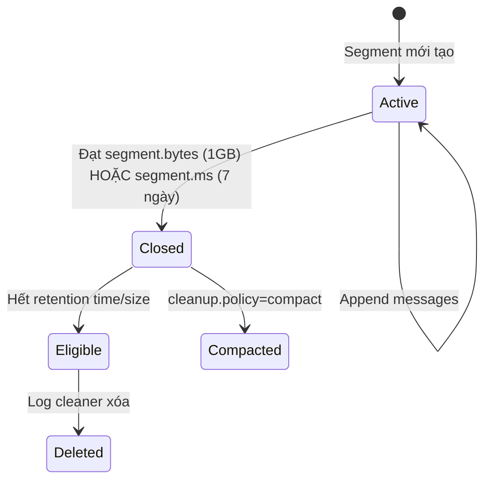
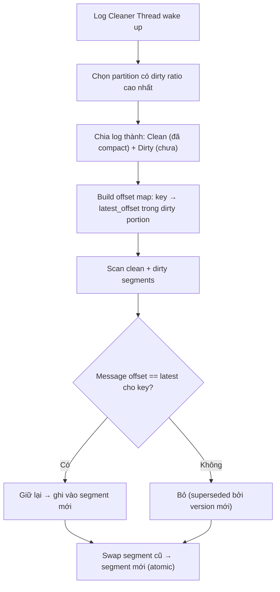
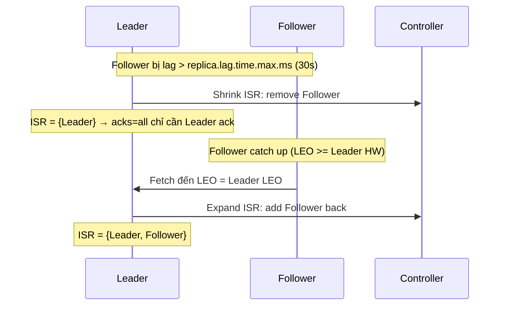

## Mục lục

- [Bối cảnh: Tại sao Kafka nhanh hơn database 100x trên cùng phần cứng?](#1-bối-cảnh-tại-sao-kafka-nhanh-hơn-database-100x-trên-cùng-phần-cứng)
- [Topic — Log abstraction và immutability](#2-topic--log-abstraction-và-immutability)
- [Partition — Đơn vị parallel thực sự](#3-partition--đơn-vị-parallel-thực-sự)
- [Cấu trúc vật lý trên disk — Segment files](#4-cấu-trúc-vật-lý-trên-disk--segment-files)
- [Index files — Binary search O(log n) cho offset lookup](#5-index-files--binary-search-olog-n-cho-offset-lookup)
- [Zero-Copy — sendfile() syscall và tại sao Kafka bypass JVM heap](#6-zero-copy--sendfile-syscall-và-tại-sao-kafka-bypass-jvm-heap)
- [Page Cache — Kafka đọc/ghi qua OS kernel](#7-page-cache--kafka-đọcghi-qua-os-kernel)
- [Log Compaction — Giữ snapshot mới nhất per key](#8-log-compaction--giữ-snapshot-mới-nhất-per-key)
- [Retention — Time-based vs Size-based vs Compact](#9-retention--time-based-vs-size-based-vs-compact)
- [Message Format — RecordBatch internals (v2)](#10-message-format--recordbatch-internals-v2)
- [Partition Key và ordering guarantee](#11-partition-key-và-ordering-guarantee)
- [Replication — ISR, High Watermark và Log End Offset](#12-replication--isr-high-watermark-và-log-end-offset)
- [Chọn số partitions — công thức và trade-offs](#13-chọn-số-partitions--công-thức-và-trade-offs)
- [Common Pitfalls & Anti-patterns](#14-common-pitfalls--anti-patterns)
- [Tóm tắt — Cheat sheet](#15-tóm-tắt--cheat-sheet)

---

## 1. Bối cảnh: Tại sao Kafka nhanh hơn database 100x trên cùng phần cứng?

Một SSD thông thường đọc random ở **~10.000 IOPS** (mỗi lần 4KB = ~40 MB/s). Nhưng sequential read/write trên cùng SSD đó đạt **500–3000 MB/s**. Kafka khai thác triệt để sự khác biệt này:

```
Random I/O (Database):
┌────┐ ┌────┐ ┌────┐ ┌────┐    Seek → Read → Seek → Read ...
│ B3 │ │ B7 │ │ B1 │ │ B9 │    Mỗi seek ~0.1ms SSD, ~8ms HDD
└────┘ └────┘ └────┘ └────┘    Throughput: ~40 MB/s (SSD)

Sequential I/O (Kafka):
┌────┬────┬────┬────┬────┬────┬────┬────┐  Append only, no seek
│ M0 │ M1 │ M2 │ M3 │ M4 │ M5 │ M6 │ M7 │  Throughput: 500-3000 MB/s (SSD)
└────┴────┴────┴────┴────┴────┴────┴────┘
```

Kafka đạt **hàng triệu messages/giây** bằng tổ hợp 4 kỹ thuật:

| Kỹ thuật | Cơ chế | Mục trong doc |
|----------|--------|---------------|
| Sequential I/O | Append-only log, không bao giờ random write | §4 |
| Page Cache | Đọc/ghi qua OS kernel cache, bypass JVM GC | §7 |
| Zero-Copy | `sendfile()` syscall — data không copy qua user space | §6 |
| Batching | Gom nhiều message thành RecordBatch, compress 1 lần | §10 |

> [!IMPORTANT]
> Kafka **không** nhanh vì nó là "in-memory system". Nó nhanh vì **thiết kế I/O pattern phù hợp với phần cứng** — sequential disk + OS page cache + zero-copy networking. Hiểu rõ điều này mới hiểu tại sao tuning Kafka lại khác hoàn toàn với tuning database.

---

## 2. Topic — Log abstraction và immutability

**Topic** là abstraction ở mức logic — kênh để tổ chức messages. Nhưng bên dưới, mỗi topic chỉ là **tập hợp các partition logs** trên disk.

```
Topic: "order-events" (3 partitions, RF=3)
├── Partition 0 → Leader trên Broker 1, Follower trên Broker 2, 3
├── Partition 1 → Leader trên Broker 2, Follower trên Broker 1, 3
└── Partition 2 → Leader trên Broker 3, Follower trên Broker 1, 2
```

### 2.1. Immutability — Tại sao không cho sửa/xóa message?

Kafka commit log là **append-only, immutable**:
- Producer chỉ **append** vào cuối log
- Không có operation "update message at offset X" hay "delete message at offset Y"
- Message chỉ bị xóa khi **retention** hết hạn (broker background thread dọn)

Lợi ích của immutability:

| Lợi ích | Giải thích |
|---------|-----------|
| Sequential write | Chỉ ghi cuối file → tận dụng tối đa disk throughput |
| No locking | Readers không block writers (offset khác nhau, không cùng vùng nhớ) |
| Replay | Consumer đọc lại từ bất kỳ offset nào mà không ảnh hưởng ai |
| Replication đơn giản | Follower chỉ cần fetch từ offset đã biết → cuối, không cần conflict resolution |

---

## 3. Partition — Đơn vị parallel thực sự

### 3.1. Partition = Unit of parallelism

Mỗi partition là **một ordered, append-only sequence** riêng biệt. Kafka scale bằng cách **tăng partitions**, không phải tăng kích thước một partition.

```
Topic: orders (6 partitions) — 3 consumers
┌──────────┐ ┌──────────┐ ┌──────────┐ ┌──────────┐ ┌──────────┐ ┌──────────┐
│    P0    │ │    P1    │ │    P2    │ │    P3    │ │    P4    │ │    P5    │
└────┬─────┘ └────┬─────┘ └────┬─────┘ └────┬─────┘ └────┬─────┘ └────┬─────┘
     │            │            │            │            │            │
     └──── C1 ────┘            └──── C2 ────┘            └──── C3 ────┘
   (2 partitions)            (2 partitions)            (2 partitions)
```

**Rule cốt lõi**: Trong một consumer group, mỗi partition chỉ được **một consumer** xử lý. Vì vậy:
- `max_parallelism = số partitions`
- Nếu consumers > partitions → consumer dư sẽ **idle**

### 3.2. Ordering guarantee

Kafka chỉ đảm bảo **ordering trong partition**, không đảm bảo ordering cross-partition:

```
Partition 0: [order#1-created, t=100] [order#1-paid, t=200] [order#1-shipped, t=300]
             → GUARANTEED: created < paid < shipped ✓

Cross-partition: order#1 (P0) và order#2 (P1) → KHÔNG đảm bảo thứ tự ✗
```

---

## 4. Cấu trúc vật lý trên disk — Segment files

### 4.1. Directory layout

Mỗi partition trên disk là một **directory**, chứa nhiều **segment files**:

```
/var/kafka-logs/order-events-0/          ← Partition 0 của topic "order-events"
├── 00000000000000000000.log             ← Segment 1: offset 0–4521
├── 00000000000000000000.index           ← Offset index cho segment 1
├── 00000000000000000000.timeindex       ← Timestamp index cho segment 1
├── 00000000000000004522.log             ← Segment 2: offset 4522–9843
├── 00000000000000004522.index
├── 00000000000000004522.timeindex
├── 00000000000000009844.log             ← Active segment (đang ghi)
├── 00000000000000009844.index
├── 00000000000000009844.timeindex
├── leader-epoch-checkpoint
└── partition.metadata
```

**Tên file = base offset** (offset đầu tiên trong segment đó), zero-padded 20 chữ số.

### 4.2. Segment lifecycle



| Config | Default | Ý nghĩa |
|--------|---------|---------|
| `log.segment.bytes` | 1 GB | Kích thước tối đa mỗi segment |
| `log.segment.ms` | 7 ngày | Thời gian tối đa trước khi roll segment mới |
| `log.retention.hours` | 168 (7 ngày) | Retention time |
| `log.retention.bytes` | -1 (vô hạn) | Max size per partition |

### 4.3. Tại sao chia segments?

Nếu không chia, một partition sẽ là **một file khổng lồ** → problems:
1. **Retention**: Không thể xóa phần đầu file mà không rewrite toàn bộ
2. **Memory-mapped I/O**: OS không thể mmap file lớn hơn RAM hiệu quả
3. **Recovery**: Nếu crash, phải scan toàn bộ file để rebuild index

Segments cho phép Kafka **xóa/compact từng segment** mà không ảnh hưởng hoạt động đọc/ghi.

---

## 5. Index files — Binary search O(log n) cho offset lookup

### 5.1. Bài toán: Tìm message ở offset X

Consumer gửi `FetchRequest(offset=7500)`. Kafka cần tìm **byte position** của offset 7500 trên disk. Nếu quét tuần tự từ đầu file → O(n) không chấp nhận được.

### 5.2. Two-level lookup

Kafka giải quyết bằng **hai bước**:

```
Bước 1: Binary search trên danh sách segment files
         → Tìm segment chứa offset 7500 (tên file ≤ 7500 và file kế > 7500)
         → Tìm được: 00000000000000004522.log

Bước 2: Binary search trong .index file của segment đó
         → .index chứa sparse entries: (relative_offset → physical_position)
         → Tìm entry lớn nhất ≤ 7500
         → Scan tuần tự từ đó đến offset 7500
```

### 5.3. Cấu trúc .index file

File `.index` là **sparse index** — không lưu mọi offset, chỉ lưu mỗi `log.index.interval.bytes` (default 4KB):

```
.index file format (mỗi entry = 8 bytes):
┌──────────────────┬──────────────────┐
│ relative_offset  │ physical_position │
│   (4 bytes)      │    (4 bytes)      │
├──────────────────┼──────────────────┤
│      0           │        0          │  ← offset 4522 ở byte 0 trong .log
│     78           │     16384         │  ← offset 4600 ở byte 16384
│    156           │     32768         │  ← offset 4678 ở byte 32768
│    ...           │      ...          │
└──────────────────┴──────────────────┘
```

`relative_offset = absolute_offset - base_offset_of_segment`

### 5.4. .timeindex file

Tương tự `.index` nhưng map **timestamp → offset**:

```
.timeindex format (mỗi entry = 12 bytes):
┌──────────────────┬──────────────────┐
│   timestamp      │  relative_offset  │
│   (8 bytes)      │    (4 bytes)      │
├──────────────────┼──────────────────┤
│ 1705305600000    │       0           │  ← timestamp 2024-01-15T12:00 → offset 4522
│ 1705305660000    │      78           │  ← 1 phút sau → offset 4600
│      ...         │      ...          │
└──────────────────┴──────────────────┘
```

Dùng cho: `kafka-consumer-groups.sh --reset-offsets --to-datetime`

> [!NOTE]
> Index files được **memory-mapped (mmap)** vào RAM. Binary search trên mmap data = tốc độ RAM, không cần disk seek. Đây là lý do Kafka cần đủ RAM cho page cache — **RAM dành cho OS, không phải JVM heap**.

---

## 6. Zero-Copy — sendfile() syscall và tại sao Kafka bypass JVM heap

### 6.1. Traditional data path (không có zero-copy)

Khi một ứng dụng Java thông thường đọc file và gửi qua network:

```
4 lần copy, 4 context switch:

Disk → [DMA copy] → Kernel Read Buffer
        → [CPU copy] → User Space Buffer (JVM heap)     ← context switch
        → [CPU copy] → Kernel Socket Buffer              ← context switch
        → [DMA copy] → NIC (Network Card)

Tổng: 4 copy operations, data đi qua user space
```

### 6.2. Zero-copy path (Kafka dùng sendfile)

```
2 lần copy, 0 user space involvement:

Disk → [DMA copy] → Kernel Read Buffer (= Page Cache)
        → [DMA scatter/gather] → NIC (Network Card)

Tổng: 2 DMA copy, data KHÔNG BAO GIỜ đi qua JVM heap
```

Kafka gọi `FileChannel.transferTo()` (Java wrapper cho Linux `sendfile()` syscall):

```java
// Kafka source: kafka/log/UnifiedLog.scala (simplified)
fileRecords.channel.transferTo(position, count, socketChannel)
// OS thực hiện: sendfile(out_fd=socket, in_fd=log_file, offset, count)
```

### 6.3. Impact đo được

| Metric | Truyền thống | Zero-copy | Tỷ lệ |
|--------|-------------|-----------|--------|
| CPU usage | 100% (1 core) | ~15% | 6.7x giảm |
| Context switches | 4 per message batch | 2 | 2x giảm |
| Throughput (10GbE) | ~400 MB/s | ~1.2 GB/s | 3x tăng |
| GC pressure | Cao (data qua heap) | Gần 0 | ∞ |

> [!IMPORTANT]
> Zero-copy chỉ hoạt động khi **data trên disk = data gửi đi** (không transform). Đây là lý do Kafka **không** decompress/recompress data ở broker — producer compress, consumer decompress, broker chỉ forward bytes. Nếu bạn bật `compression.type` ở broker khác với producer → mất zero-copy.

---

## 7. Page Cache — Kafka đọc/ghi qua OS kernel

### 7.1. Kafka KHÔNG quản lý cache riêng

Khác với database (có buffer pool riêng), Kafka **hoàn toàn dựa vào OS page cache**:

```
┌─────────────────────────────────────────────────────┐
│                     JVM Heap                        │
│  (chỉ chứa metadata, request handling logic)       │
│  Recommended: 4-6 GB — KHÔNG tăng thêm!            │
└─────────────────────────────────────────────────────┘

┌─────────────────────────────────────────────────────┐
│                   OS Page Cache                      │
│  (chứa actual message data — log segments)          │
│  Recommended: CÀNG NHIỀU CÀNG TỐT                   │
│  Máy 64GB RAM: JVM 6GB + OS 58GB page cache         │
└─────────────────────────────────────────────────────┘

┌─────────────────────────────────────────────────────┐
│                      Disk                           │
│  /var/kafka-logs/topic-partition/*.log              │
└─────────────────────────────────────────────────────┘
```

### 7.2. Write path — tận dụng page cache

```
Producer gửi message:
1. Kafka append vào file (write syscall)
2. OS KHÔNG ghi disk ngay → ghi vào page cache (dirty page)
3. OS background flush dirty pages ra disk (pdflush/writeback thread)
4. Kafka gọi fsync chỉ khi cần (hoặc để OS quyết định)

Kết quả: Producer thấy write latency = memory speed (~μs), không phải disk speed (~ms)
```

### 7.3. Read path — hot data từ page cache

```
Consumer đọc message (tail-read — đọc data vừa ghi):
1. Consumer FetchRequest(offset=latest-10)
2. Data VẪN CÒN trong page cache (vì vừa ghi)
3. Kafka đọc = đọc RAM (qua page cache), KHÔNG chạm disk
4. Kết hợp zero-copy → data từ page cache → NIC trực tiếp

Consumer đọc message (catch-up — đọc data cũ):
1. Consumer FetchRequest(offset=rất_cũ)
2. Data KHÔNG còn trong page cache
3. OS phải đọc từ disk → page fault → load vào page cache
4. Latency tăng đáng kể (disk I/O)
```

> [!TIP]
> **Rule of thumb**: Nếu consumer lag < lượng data fit trong page cache → consumer đọc thuần RAM, throughput cực cao. Nếu lag quá lớn → disk read, throughput giảm 10-100x. Đây là lý do **monitoring consumer lag** cực kỳ quan trọng.

---

## 8. Log Compaction — Giữ snapshot mới nhất per key

### 8.1. Bài toán

Bạn dùng Kafka làm changelog (CDC): mỗi message là trạng thái mới nhất của một entity. Sau 1 năm có hàng tỷ messages, nhưng bạn chỉ cần **trạng thái cuối cùng** của mỗi key.

### 8.2. Cơ chế Log Compaction

```
Trước compaction (key = user_id):
Offset:  0        1        2        3        4        5        6        7
Key:    [U1]     [U2]     [U1]     [U3]     [U2]     [U1]     [U3]     [U4]
Value:  [v1.0]   [v2.0]   [v1.1]   [v3.0]   [v2.1]   [v1.2]   [v3.1]   [v4.0]

Sau compaction:
Offset:  5        4        6        7          ← offset GIỮ NGUYÊN, không đổi
Key:    [U1]     [U2]     [U3]     [U4]
Value:  [v1.2]   [v2.1]   [v3.1]   [v4.0]   ← Chỉ giữ bản mới nhất per key
```

### 8.3. Compaction internals — Log Cleaner Thread



**Dirty ratio** = `bytes_dirty / (bytes_clean + bytes_dirty)`. Config `min.cleanable.dirty.ratio` (default 0.5) quyết định khi nào compaction bắt đầu.

### 8.4. Tombstone — Xóa key vĩnh viễn

Gửi message với `value = null` → **tombstone marker**. Log cleaner giữ tombstone trong `delete.retention.ms` (default 24h) rồi xóa hoàn toàn:

```java
// Xóa key "user-123" khỏi compacted topic
producer.send(new ProducerRecord<>("users-changelog", "user-123", null));
```

---

## 9. Retention — Time-based vs Size-based vs Compact

| Policy | Config | Hành vi | Use case |
|--------|--------|---------|----------|
| **Time** | `retention.ms=604800000` | Xóa segment khi mọi message > 7 ngày | Event log thông thường |
| **Size** | `retention.bytes=107374182400` | Xóa segment cũ nhất khi partition > 100GB | Giới hạn disk |
| **Compact** | `cleanup.policy=compact` | Giữ message mới nhất per key mãi mãi | Changelog, CDC |
| **Compact+Delete** | `cleanup.policy=compact,delete` | Compact + xóa sau retention | Changelog có TTL |

> [!WARNING]
> Retention xóa **per segment**, không per message. Nếu `segment.bytes=1GB` và `retention.ms=1h`, một segment chứa messages từ phút 0→55 chỉ bị xóa khi **message cuối cùng** trong đó > 1h. Trong thực tế, data có thể tồn tại lâu hơn `retention.ms` một chút.

---

## 10. Message Format — RecordBatch internals (v2)

### 10.1. Kafka Message Format v2 (từ Kafka 0.11+)

Kafka không lưu từng message riêng lẻ — nó gom thành **RecordBatch**:

```
RecordBatch (trên disk và trên wire):
┌─────────────────────────────────────────────────────────────────┐
│ Batch Header (61 bytes)                                         │
├─────────────────────────────────────────────────────────────────┤
│ baseOffset (8)        │ batchLength (4)     │ partitionLeaderEpoch (4) │
│ magic (1) = 2         │ crc (4)             │ attributes (2)           │
│ lastOffsetDelta (4)   │ firstTimestamp (8)  │ maxTimestamp (8)         │
│ producerId (8)        │ producerEpoch (2)   │ baseSequence (4)         │
│ recordCount (4)       │                     │                          │
├─────────────────────────────────────────────────────────────────┤
│ Record 0: [length, attributes, timestampDelta, offsetDelta,     │
│            keyLength, key, valueLength, value, headers]          │
│ Record 1: [...]                                                 │
│ Record N: [...]                                                 │
└─────────────────────────────────────────────────────────────────┘
```

### 10.2. Tại sao batch format quan trọng?

| Tính năng | Nhờ batch format |
|-----------|-----------------|
| **Compression** | Toàn bộ batch compress 1 lần (gzip/lz4/zstd/snappy), hiệu quả hơn compress từng msg |
| **Idempotency** | `producerId + producerEpoch + baseSequence` → broker detect duplicate batch |
| **Transactions** | `attributes` bit flag đánh dấu batch thuộc transaction, batch marker (commit/abort) |
| **Fewer syscalls** | 1 write cho cả batch (có thể 1000+ messages) thay vì 1000 writes |

### 10.3. Delta encoding

Trong batch, mỗi record chỉ lưu **delta** so với batch header:
- `timestampDelta = record.timestamp - batch.firstTimestamp` (thay vì 8 bytes absolute)
- `offsetDelta = record.offset - batch.baseOffset` (thay vì 8 bytes absolute)

→ Tiết kiệm đáng kể bytes khi batch có nhiều records.

---

## 11. Partition Key và ordering guarantee

### 11.1. Key → Partition mapping

```java
// DefaultPartitioner (Kafka 3.x+):
if (key == null) {
    // Sticky Partitioning: gửi vào cùng partition cho đến batch đầy
    // → giảm latency (không chờ linger.ms cho mỗi partition riêng)
    return stickyPartition;
} else {
    // Murmur2 hash:
    return Utils.toPositive(Utils.murmur2(key)) % numPartitions;
}
```

### 11.2. Hậu quả khi thay đổi số partitions

```
Trước: 3 partitions
  hash("order-123") % 3 = 1  → Partition 1

Sau: 6 partitions (kafka-topics --alter --partitions 6)
  hash("order-123") % 6 = 4  → Partition 4  ← KEY KHÁC PARTITION!
```

> [!WARNING]
> **Tăng partitions = phá vỡ key-based ordering** cho messages mới. Messages cũ vẫn ở partition cũ, nhưng messages mới cùng key có thể đi partition khác. Đây là lý do nên **chọn đủ partitions từ đầu** và cực kỳ thận trọng khi tăng. Không có cách "rebalance" messages cũ.

### 11.3. Custom Partitioner

```java
public class OrderRegionPartitioner implements Partitioner {
    @Override
    public int partition(String topic, Object key, byte[] keyBytes,
                         Object value, byte[] valueBytes, Cluster cluster) {
        String orderId = (String) key;
        String region = extractRegion(orderId);  // VN, US, EU
        int numPartitions = cluster.partitionCountForTopic(topic);

        // Region-based: VN → P0-1, US → P2-3, EU → P4-5
        return regionToPartitionRange(region, numPartitions);
    }
}
```

---

## 12. Replication — ISR, High Watermark và Log End Offset

### 12.1. Ba con số quan trọng

```
Partition 0, Leader trên Broker 1:

Leader Log:     [0][1][2][3][4][5][6][7][8][9]
                                         ↑ LEO (Log End Offset) = 10

Follower 1 Log: [0][1][2][3][4][5][6][7]
                                      ↑ LEO = 8

Follower 2 Log: [0][1][2][3][4][5][6][7][8]
                                         ↑ LEO = 9

ISR = {Leader, F1, F2}
High Watermark (HW) = min(LEO of all ISR) = 8
                       ↑ Consumer chỉ đọc được đến offset 7 (< HW)
```

### 12.2. Tại sao consumer không đọc được message chưa fully replicated?

Nếu consumer đọc offset 9 (chỉ có Leader và F2 có), rồi Leader crash → F1 trở thành Leader mới → **offset 9 không tồn tại** → consumer đã nhận "ghost message" bị mất.

High Watermark đảm bảo: **consumer chỉ thấy messages mà tất cả ISR đã có** → không bao giờ mất data sau leader failover.

### 12.3. ISR shrink & expand



---

## 13. Chọn số partitions — công thức và trade-offs

### 13.1. Công thức

```
P = max(T_p / t_p, T_c / t_c)

Trong đó:
  T_p = Target throughput tổng (MB/s hoặc msg/s)
  t_p = Throughput per partition ở producer (đo được)
  T_c = Target throughput tổng ở consumer
  t_c = Throughput per partition ở consumer (đo được)
```

### 13.2. Trade-offs

| Nhiều partitions ↑ | Ít partitions ↓ |
|--------------------|-----------------|
| ✅ Throughput cao hơn (parallel) | ✅ Ít file handles, ít memory |
| ✅ Nhiều consumers hơn | ✅ Rebalance nhanh hơn |
| ❌ Tốn file descriptors (3 files/segment × segments/partition × partitions) | ❌ Giới hạn parallelism |
| ❌ Rebalance chậm hơn | ❌ Throughput bị giới hạn |
| ❌ Leader election chậm (controller phải elect từng partition) | ✅ Leader election nhanh |
| ❌ End-to-end latency tăng nhẹ | ✅ Latency thấp hơn |

### 13.3. Guidelines thực tế

| Throughput mục tiêu | Số partitions đề xuất |
|---------------------|----------------------|
| < 10 MB/s | 3–6 |
| 10–100 MB/s | 6–30 |
| 100–500 MB/s | 30–100 |
| > 500 MB/s | 100+ (cần benchmark) |

---

## 14. Common Pitfalls & Anti-patterns

| Pitfall | Hậu quả | Giải pháp |
|---------|---------|-----------|
| JVM heap quá lớn (>8GB) | GC pause dài, page cache bị chiếm | Giữ heap 4-6GB, dành RAM cho OS |
| Quá nhiều partitions trên 1 broker | File descriptor exhaustion, slow recovery | Max ~4000 partitions/broker |
| Tăng partitions topic đã có key | Key-to-partition mapping bị phá vỡ | Plan ahead, hoặc dùng custom partitioner |
| `log.flush.interval.messages=1` | Mỗi message fsync → throughput giảm 100x | Dùng replication thay vì fsync (mặc định) |
| Consumer lag > page cache size | Mọi read = disk I/O | Scale consumers, tăng RAM broker |
| `unclean.leader.election.enable=true` | Data loss khi out-of-sync follower thành leader | Set `false` cho topic quan trọng |

---

## 15. Tóm tắt — Cheat sheet

```
KAFKA STORAGE = Sequential Append-Only Log
                + Segment Files (1GB chunks)
                + Sparse Index (binary search)
                + Page Cache (OS-managed, not JVM)
                + Zero-Copy (sendfile syscall)
                + Batch Format (compress + deduplicate per batch)

Performance formula:
  Throughput ∝ (Partitions × Sequential I/O) + Page Cache Hit Rate + Zero-Copy
  Latency ∝ 1 / (Batch Size × Linger.ms) + Replication Acks

5 nguyên tắc:
1. Kafka nhanh vì SEQUENTIAL I/O — tôn trọng disk pattern
2. RAM broker = Page Cache — ĐỪNG tăng JVM heap
3. Zero-copy chỉ hoạt động khi broker KHÔNG transform data
4. Partition = unit of parallelism — chọn đủ từ đầu
5. High Watermark bảo vệ consumer khỏi data loss
```
