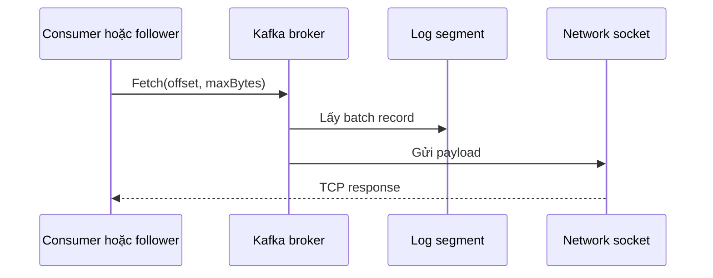
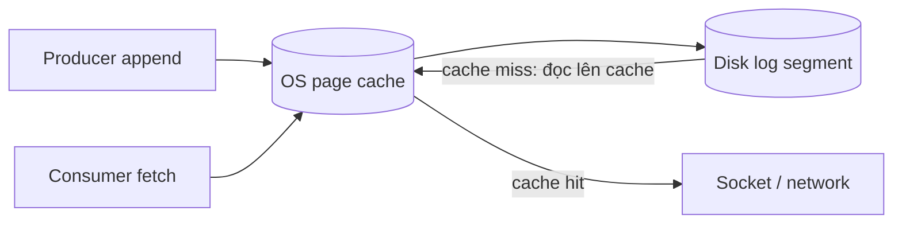

<Callout type="info" title="Phạm vi bài viết">
  Zero-copy ở đây nói về đường đọc dữ liệu từ log segment của broker đến socket mạng khi Kafka phục vụ consumer hoặc follower replica. Đây không phải cơ chế đảm bảo dữ liệu, cũng không phải mọi byte trong toàn bộ pipeline Kafka đều không bị copy.
</Callout>

## Mục lục

- [Zero-copy là gì?](#zero-copy-là-gì)
- [Bài toán khi gửi dữ liệu từ disk ra network](#bài-toán-khi-gửi-dữ-liệu-từ-disk-ra-network)
- [Đường dữ liệu truyền thống](#đường-dữ-liệu-truyền-thống)
- [Đường dữ liệu zero-copy của Kafka](#đường-dữ-liệu-zero-copy-của-kafka)
- [Vai trò của page cache](#vai-trò-của-page-cache)
- [Kafka dùng zero-copy ở đâu?](#kafka-dùng-zero-copy-ở-đâu)
- [Lợi ích và giới hạn](#lợi-ích-và-giới-hạn)
  - [Điều zero-copy cải thiện](#điều-zero-copy-cải-thiện)
  - [Khi zero-copy không áp dụng trực tiếp](#khi-zero-copy-không-áp-dụng-trực-tiếp)
- [Mối liên hệ với batching, compression và TLS](#mối-liên-hệ-với-batching-compression-và-tls)
- [Cách nhìn đúng khi tuning](#cách-nhìn-đúng-khi-tuning)
- [Tóm tắt](#tóm-tắt)

## Zero-copy là gì?

**Zero-copy** là kỹ thuật giảm việc sao chép payload qua buffer của ứng dụng khi chuyển dữ liệu giữa file và network socket. Trong Kafka, kỹ thuật này đặc biệt hữu ích khi broker đọc record đã có trong log segment và gửi chúng cho consumer hoặc follower replica.

Tên gọi dễ gây hiểu nhầm. “Zero-copy” không có nghĩa dữ liệu chưa từng được copy trong phần cứng hay không đi qua RAM. Ý chính là broker tránh đưa toàn bộ payload vào **user space** của JVM rồi lại copy xuống kernel socket buffer trước khi gửi.

```text
Mục tiêu: giảm một vòng đi qua user space của broker

log segment / page cache  ───────────────►  socket  ───────────────►  network
                         kernel xử lý                  NIC gửi đi
```

<Callout type="idea" title="Cách nhớ ngắn">
  Append-only log giúp Kafka ghi dữ liệu vào cuối file nhanh. Zero-copy giúp Kafka đọc dữ liệu đã có trong file và phát nó ra mạng với ít CPU copy hơn. Hai cơ chế hỗ trợ nhau, nhưng giải quyết hai chặng khác nhau.
</Callout>

## Bài toán khi gửi dữ liệu từ disk ra network

Một consumer gửi `FetchRequest` đến leader broker, yêu cầu record từ offset nào đó. Broker phải lấy bytes trong log segment và đưa chúng lên socket TCP để gửi về consumer.

Nếu mỗi lần fetch broker phải đọc bytes từ kernel vào một `byte[]`/`ByteBuffer` của JVM, sau đó lại ghi bytes đó xuống kernel socket buffer, CPU sẽ tốn công copy dữ liệu lớn qua lại. Với nhiều consumer, follower replica và payload lớn, chi phí này nhanh chóng trở thành bottleneck.



Điểm cần tối ưu là hai bước giữa `Log segment` và `Network socket`, không phải protocol fetch của consumer.

## Đường dữ liệu truyền thống

Trong mô hình I/O thông thường, ứng dụng thực hiện `read()` file rồi `write()` socket. Payload có thể đi qua nhiều buffer:

```text
1. Disk đọc block vào kernel page cache
2. Kernel copy block sang user-space buffer của JVM/process
3. JVM/process gọi write()
4. Kernel copy payload sang socket buffer
5. NIC DMA dữ liệu để truyền qua network

┌─────────┐  copy   ┌─────────────┐  copy   ┌────────────┐
│ Page    │ ──────► │ User-space  │ ──────► │ Socket     │ ───► NIC
│ cache   │         │ buffer/JVM  │         │ buffer     │
└─────────┘         └─────────────┘         └────────────┘
```

Hai lần copy qua user space đặc biệt tốn kém khi dữ liệu đang có sẵn trong page cache. JVM còn phải cấp phát và quản lý buffer, khiến CPU và garbage collector có thêm áp lực.

## Đường dữ liệu zero-copy của Kafka

Kafka có thể dùng Java NIO `FileChannel.transferTo()`. Trên Linux và những môi trường hỗ trợ phù hợp, lời gọi này tận dụng primitive của hệ điều hành như `sendfile` để truyền bytes từ file/page cache đến socket mà không cần một bản payload trung gian trong JVM.

```text
1. Consumer gửi FetchRequest
2. Broker xác định segment và byte range cần gửi
3. Kafka gọi FileChannel.transferTo(..., socketChannel)
4. Kernel chuyển dữ liệu từ page cache đến socket buffer
5. NIC gửi dữ liệu đi

┌─────────┐                  ┌────────────┐
│ Page    │ ───────────────► │ Socket     │ ───► NIC ───► Consumer
│ cache   │   kernel path    │ buffer     │
└─────────┘                  └────────────┘
       ▲
       │
  Kafka/JVM chỉ điều phối file range; không giữ bản payload trung gian
```

Điều quan trọng là broker vẫn phải xây dựng phần protocol metadata của response, ví dụ header và thông tin record batch. Zero-copy chủ yếu tối ưu phần payload file có thể chuyển thẳng. Đừng hình dung toàn bộ response Kafka không hề chạm JVM.

## Vai trò của page cache

**Page cache** là vùng RAM do hệ điều hành dùng để cache nội dung file. Kafka chủ động dựa nhiều vào cache này thay vì cố cache toàn bộ topic data trong Java heap.

Khi producer append record vào log, record thường đi vào page cache trước. Nếu consumer đọc record ngay sau đó, kernel có thể phục vụ dữ liệu trực tiếp từ RAM. Nếu cache miss, kernel mới phải đọc page từ disk.



Zero-copy phát huy hiệu quả nhất khi record cần gửi đã có trong page cache. Đây là tình huống phổ biến với event stream nóng: vừa được producer ghi vào, consumer đã fetch ngay.

<Callout type="warn" title="Không cấu hình heap để chứa toàn bộ Kafka data">
  Dành toàn bộ RAM cho `KAFKA_HEAP_OPTS` thường phản tác dụng. Kafka cần RAM còn lại cho filesystem page cache. Heap quá lớn có thể làm GC nặng hơn và làm giảm cache hữu ích cho log segment.
</Callout>

## Kafka dùng zero-copy ở đâu?

Zero-copy phù hợp với đường truyền mà broker chỉ cần chuyển tiếp record batch đã được lưu trong log:

| Luồng dữ liệu | Có thể hưởng lợi? | Lý do |
|---|---|---|
| Leader broker → consumer | Có | Broker gửi record từ local log segment qua fetch response. |
| Leader broker → follower replica | Có | Follower cũng fetch phần log chưa đồng bộ từ leader. |
| Producer → leader broker | Không phải chặng zero-copy kinh điển | Broker cần nhận, kiểm tra và append payload producer gửi vào log. |
| Consumer xử lý → database | Không | Đây là đường xử lý trong ứng dụng consumer, ngoài broker. |

Zero-copy không làm thay đổi semantics của Kafka. Ordering vẫn theo partition, replication vẫn dựa vào ISR, và consumer vẫn cần commit offset đúng lúc.

## Lợi ích và giới hạn

### Điều zero-copy cải thiện

- **Giảm CPU copy**: broker không cần copy toàn bộ record payload qua user-space buffer cho mỗi fetch.
- **Giảm pressure lên JVM**: ít buffer payload tạm thời hơn, giảm allocation và GC pressure.
- **Tăng throughput đọc**: cùng một broker có thể phục vụ nhiều dữ liệu hơn khi CPU không bị chiếm bởi thao tác copy.
- **Tận dụng cache hệ điều hành**: dữ liệu nóng có thể đi từ page cache ra network rất hiệu quả.

Ví dụ, một broker phục vụ nhiều consumer analytics đang đọc lại cùng topic. Record batch nằm trong page cache có thể được kernel chuyển đến socket cho từng fetch mà Java không phải deserialize rồi copy từng record vào heap.

### Khi zero-copy không áp dụng trực tiếp

Zero-copy không phải phép màu và không phải tất cả Fetch response đều đi cùng một đường truyền tối ưu:

- Dữ liệu không có trong page cache vẫn cần được đọc từ disk trước.
- Broker phải xử lý metadata của protocol và kiểm tra request; chỉ payload thích hợp mới có thể đi theo file-to-socket path.
- Các transform cần đọc/chỉnh byte payload ở user space sẽ làm mất lợi thế chuyển thẳng.
- TLS thường yêu cầu mã hóa payload trước khi ghi ra socket. Việc này cản trở đường `sendfile` trực tiếp vốn giả định bytes trong file có thể gửi nguyên trạng.
- Network, disk, partition skew hoặc replication lag vẫn có thể là bottleneck dù zero-copy hoạt động.

<Callout type="info" title="TLS là một trade-off hợp lý">
  Bảo mật dữ liệu trong transit quan trọng hơn tối ưu cực đại của zero-copy. Khi bật TLS, hãy chấp nhận thêm CPU cho encryption và sizing broker phù hợp; không nên tắt TLS chỉ để theo đuổi throughput benchmark.
</Callout>

## Mối liên hệ với batching, compression và TLS

Các kỹ thuật này cùng xuất hiện trong đường dữ liệu Kafka, nhưng tác động ở các điểm khác nhau.

| Kỹ thuật | Tối ưu chính | Trade-off |
|---|---|---|
| Producer batching | Giảm số request và tăng kích thước I/O tuần tự | Tăng một phần latency do chờ gom batch |
| Compression | Giảm bytes trên network và disk | Tốn CPU nén/giải nén |
| Append-only log | Ghi record vào storage tuần tự | Không hỗ trợ update ngẫu nhiên như OLTP database |
| Page cache | Phục vụ dữ liệu nóng từ RAM | Cần chừa RAM ngoài JVM heap |
| Zero-copy | Giảm copy user-space khi file → socket | Không phải mọi đường truyền hoặc TLS path đều tận dụng như nhau |

Compression thường được thực hiện ở producer theo record batch. Kafka broker có thể lưu và chuyển tiếp compressed batch mà không cần giải nén chỉ để gửi cho consumer. Đây là lý do compression và zero-copy có thể bổ trợ nhau: ít byte hơn cần truyền, và ít copy hơn ở broker.

## Cách nhìn đúng khi tuning

Đừng thêm hoặc bớt một cấu hình với mục tiêu “bật zero-copy”; Kafka và JVM/hệ điều hành thường tự chọn đường I/O phù hợp. Công việc thực tế là loại bỏ bottleneck của hệ thống.

<Steps>
<Step>

### Đo bottleneck trước

Theo dõi broker CPU, network throughput, disk I/O wait, request latency, fetch throughput và page faults. Nếu network đã đầy hoặc một partition quá nóng, zero-copy không giải quyết nguyên nhân gốc.

</Step>
<Step>

### Chừa RAM cho page cache

Không cấp tất cả RAM vật lý cho JVM heap. Đánh giá working set của log nóng và quan sát cache hit/miss bằng metric hệ điều hành.

</Step>
<Step>

### Tối ưu batch và compression theo workload

Với workload throughput cao, thử `linger.ms`, `batch.size` và `compression.type` rồi benchmark end-to-end. Với alert thời gian thực, ưu tiên latency và độ bền hơn batch quá lớn.

</Step>
<Step>

### Kiểm tra tính cân bằng của partition

Một hot partition khiến broker leader của partition đó quá tải, dù cluster còn rảnh. Chọn key và số partition hợp lý trước khi tuning chi tiết I/O.

</Step>
</Steps>

Các metric đáng xem trong production:

- CPU user/system và context switch của broker host.
- Network receive/send bytes của từng broker.
- Disk read/write latency, disk utilization và I/O wait.
- Request latency theo Produce/Fetch request.
- Consumer lag và bytes consumed để phân biệt producer burst với consumer chậm.
- Heap usage/GC pause **và** lượng RAM còn lại cho OS page cache.

## Tóm tắt

- Zero-copy giảm việc copy payload qua user space khi broker gửi log data ra network.
- Kafka có thể dùng `FileChannel.transferTo()` và primitive hệ điều hành như `sendfile` cho đường file/page-cache đến socket.
- Page cache rất quan trọng: record nóng thường được đọc từ RAM, không phải từ disk.
- Zero-copy chủ yếu hỗ trợ leader phục vụ consumer và follower replica; không tối ưu mọi bước producer-to-consumer.
- Batching, compression, partition design, TLS, disk và network vẫn quyết định hiệu năng tổng thể.

<Cards>
  <Card title="Append-Only Log" href="/core-concepts/append-only-log/" description="Cách partition Kafka lưu record, segment, index và retention." />
  <Card title="Performance Tuning" href="/operations/performance-tuning/" description="Batching, compression, consumer và broker tuning." />
  <Card title="Partitioning Strategy" href="/core-concepts/partitioning-strategy/" description="Tránh hot partition và thiết kế key để scale." />
</Cards>
