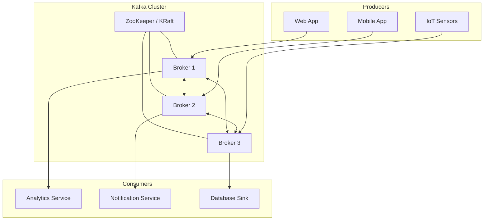

# Tổng quan Apache Kafka

## Mục lục

- [Kafka là gì?](#kafka-là-gì)
- [Vấn đề Kafka giải quyết](#vấn-đề-kafka-giải-quyết)
- [Kiến trúc tổng thể](#kiến-trúc-tổng-thể)
- [Các thành phần chính](#các-thành-phần-chính)
- [Use Cases phổ biến](#use-cases-phổ-biến)
- [Kafka trong hệ sinh thái](#kafka-trong-hệ-sinh-thái)

---

## Kafka là gì?

Apache Kafka là một **distributed event streaming platform** — nền tảng truyền dữ liệu theo dạng sự kiện (event) có khả năng mở rộng cao. Kafka được thiết kế để:

- **Publish và subscribe** dòng dữ liệu (stream of records) giống như message queue
- **Lưu trữ bền vững** (durable storage) các stream theo thứ tự và có khả năng replay lại
- **Xử lý real-time** các stream khi chúng xảy ra

```
┌─────────────────────────────────────────────────────────┐
│                   Apache Kafka Cluster                  │
│                                                         │
│  ┌──────────┐    ┌──────────────────┐    ┌──────────┐   │
│  │ Producer │───▶│  Kafka Broker(s) │───▶│ Consumer │   │
│  └──────────┘    │                  │    └──────────┘   │
│                  │  Topic: orders   │                   │
│  ┌──────────┐    │  ┌────┬────┬───┐ │    ┌──────────┐   │
│  │ Producer │───▶│  │ P0 │ P1 │P2 │ │───▶│ Consumer │   │
│  └──────────┘    │  └────┴────┴───┘ │    └──────────┘   │
│                  └──────────────────┘                   │
└─────────────────────────────────────────────────────────┘
```

> [!IMPORTANT]
> Kafka **không phải** là một message queue thông thường. Kafka lưu trữ message lâu dài (configurable, mặc định 7 ngày) và nhiều consumer có thể đọc cùng một message mà không xóa nó.

---

## Vấn đề Kafka giải quyết

### Trước khi có Kafka

Trong các hệ thống truyền thống, khi số lượng services tăng lên, việc kết nối point-to-point trở nên rất phức tạp:

```
┌──────────┐    ┌──────────┐    ┌──────────┐
│Service A │───▶│Service B │    │Service C │
│          │───▶│          │───▶│          │
│          │    └──────────┘    └──────────┘
│          │         ▲               ▲
└──────────┘         │               │
     ▲               └───────────────┘
     │           Point-to-Point: n*(n-1)/2 connections
```

**Vấn đề:**
- Với 10 services: 90 connections
- Mỗi service cần biết địa chỉ của các services khác
- Khó scale, khó maintain, dễ tạo ra bottleneck

### Với Kafka

```
┌──────────┐    ┌────────────────┐    ┌──────────┐
│Service A │───▶│                │───▶│Service B │
│          │    │                │    └──────────┘
│Service C │───▶│  Kafka Cluster │───▶│Service D │
│          │    │                │    └──────────┘
│Service E │───▶│                │───▶│Service F │
└──────────┘    └────────────────┘    └──────────┘
```

**Lợi ích:**
- Decoupling hoàn toàn giữa producers và consumers
- Mỗi service chỉ cần biết Kafka, không cần biết nhau
- Dễ thêm consumer mới mà không ảnh hưởng producer

---

## Kiến trúc tổng thể



---

## Các thành phần chính

| Thành phần | Mô tả |
|------------|-------|
| **Topic** | Kênh dữ liệu — nơi messages được publish và subscribe |
| **Partition** | Topic được chia thành nhiều partition để scale và song song hóa |
| **Broker** | Server Kafka, lưu trữ và phục vụ messages |
| **Producer** | Ứng dụng gửi message vào Kafka |
| **Consumer** | Ứng dụng đọc message từ Kafka |
| **Consumer Group** | Nhóm consumers cùng xử lý một topic song song |
| **Offset** | Vị trí của message trong partition — đơn vị theo dõi tiến độ đọc |
| **ZooKeeper / KRaft** | Quản lý metadata cluster (KRaft là mode mới không cần ZooKeeper) |

---

## Use Cases phổ biến

| Use Case | Ví dụ thực tế |
|----------|--------------|
| **Event Streaming** | Tracking user activity, clickstream analytics |
| **Messaging** | Thay thế ActiveMQ/RabbitMQ cho high-throughput scenarios |
| **Activity Tracking** | Audit logs, fraud detection |
| **Metrics Aggregation** | Thu thập metrics từ nhiều services, đẩy vào monitoring |
| **Log Aggregation** | Centralized logging từ nhiều services |
| **Stream Processing** | Real-time ETL, aggregations với Kafka Streams |
| **Event Sourcing** | Lưu trữ toàn bộ lịch sử thay đổi state |
| **CDC** | Change Data Capture — sync database changes real-time |

> [!TIP]
> Kafka phù hợp nhất khi cần throughput cao (hàng triệu messages/giây), low latency, và khả năng replay lại dữ liệu. Nếu chỉ cần message queue đơn giản với số lượng ít, RabbitMQ có thể là lựa chọn đơn giản hơn.

---

## Kafka trong hệ sinh thái

```
┌─────────────────────────────────────────────────┐
│              Kafka Ecosystem                    │
│                                                 │
│  ┌──────────────┐    ┌─────────────────────┐    │
│  │ Kafka Core   │    │   Kafka Streams     │    │
│  │ (Messaging)  │    │ (Stream Processing) │    │
│  └──────────────┘    └─────────────────────┘    │
│                                                 │
│  ┌──────────────┐    ┌─────────────────────┐    │
│  │ Kafka Connect│    │   Schema Registry   │    │
│  │ (Connectors) │    │   (Data Contracts)  │    │
│  └──────────────┘    └─────────────────────┘    │
│                                                 │
│  ┌──────────────┐    ┌─────────────────────┐    │
│  │   ksqlDB     │    │   Kafka REST Proxy  │    │
│  │ (SQL on Kafka│    │   (HTTP Interface)  │    │
│  └──────────────┘    └─────────────────────┘    │
└─────────────────────────────────────────────────┘
```

**Tích hợp phổ biến:**
- **Spring Boot** — `spring-kafka` library, phổ biến nhất trong Java ecosystem
- **Apache Flink / Spark** — Big data processing từ Kafka streams
- **Elasticsearch** — Kafka Connect Elasticsearch Sink Connector
- **Debezium** — CDC connector, đọc binlog từ MySQL/PostgreSQL vào Kafka

<Cards>
  <Card title="Core Concepts" description="Topics, Partitions, Brokers, Offsets" href="/core-concepts/topics-partitions/" />
  <Card title="Setup môi trường" description="Cài đặt Kafka với Docker" href="/setup/docker-setup/" />
  <Card title="Producers & Consumers" description="API và cấu hình cơ bản" href="/producers-consumers/producer-api/" />
</Cards>
