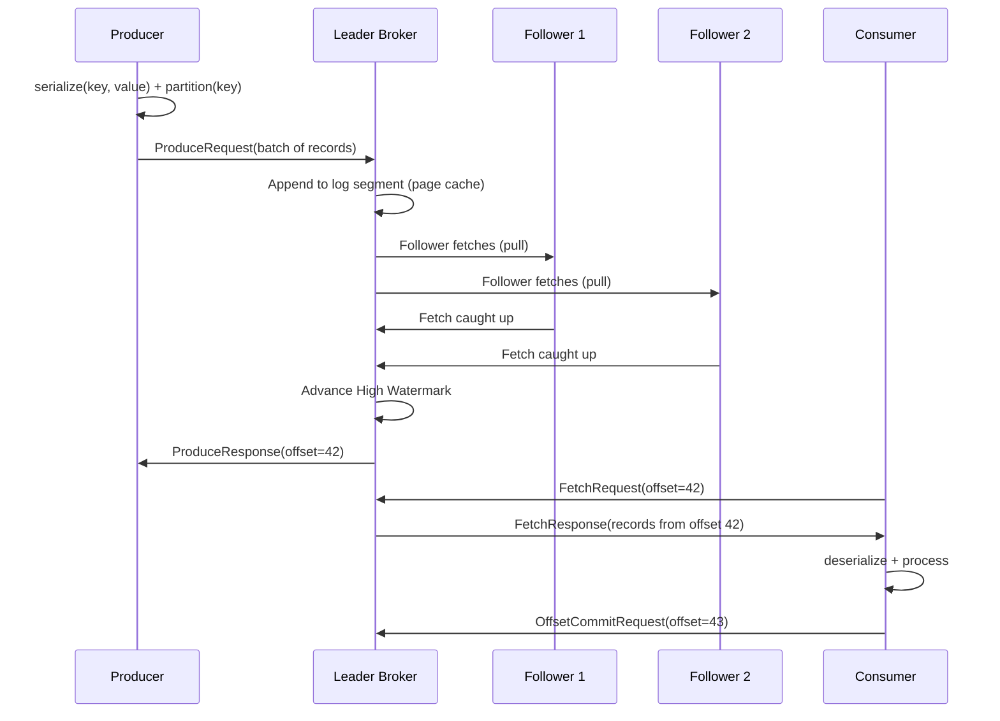

## Mục lục

- [Bối cảnh: Microservices trao đổi data — Synchronous hell](#1-bối-cảnh-microservices-trao-đổi-data--synchronous-hell)
- [Kafka là gì — Distributed Commit Log](#2-kafka-là-gì--distributed-commit-log)
- [Kiến trúc tổng thể — 5 thành phần chính](#3-kiến-trúc-tổng-thể--5-thành-phần-chính)
- [Message Flow — End-to-End journey](#4-message-flow--end-to-end-journey)
- [CAP Theorem & Kafka's position](#5-cap-theorem--kafkas-position)
- [Kafka vs Message Queue — Fundamental differences](#6-kafka-vs-message-queue--fundamental-differences)
- [Event-Driven Architecture — Kafka as backbone](#7-event-driven-architecture--kafka-as-backbone)
- [Delivery Guarantees — The spectrum](#8-delivery-guarantees--the-spectrum)
- [Data Model — Records, Batches, Topics](#9-data-model--records-batches-topics)
- [Cluster Metadata — ZooKeeper/KRaft](#10-cluster-metadata--zookeeperkraft)
- [Kafka Ecosystem — Connect, Streams, Schema Registry](#11-kafka-ecosystem--connect-streams-schema-registry)
- [Use Cases — 10 real-world patterns](#12-use-cases--10-real-world-patterns)
- [Scalability Model — How Kafka scales to millions msg/s](#13-scalability-model--how-kafka-scales-to-millions-msgs)
- [Failure Modes & Recovery](#14-failure-modes--recovery)
- [Tóm tắt — Mental Model](#15-tóm-tắt--mental-model)

---

## 1. Bối cảnh: Microservices trao đổi data — Synchronous hell

Hệ thống e-commerce: Order Service cần thông báo cho Inventory, Payment, Notification, Analytics. Approach ban đầu — direct HTTP calls:

```
Order Service → POST /api/inventory/reserve   (timeout 3s)
             → POST /api/payment/charge       (timeout 5s)
             → POST /api/notification/send    (timeout 2s)
             → POST /api/analytics/track      (timeout 1s)

Problems:
  1. Latency: 3+5+2+1 = 11s tổng (sequential) hoặc max(3,5,2,1) = 5s (parallel)
  2. Coupling: Order service biết mọi downstream services
  3. Availability: 1 service down → Order Service fail (nếu sequential)
  4. Scalability: Peak 10x traffic → TẤT CẢ services phải scale
  5. Adding new consumer: Sửa Order Service code + deploy
```

Kafka giải quyết bằng **event-driven decoupling**:

```
Order Service → produce("order-events", orderCreated)  (async, ~5ms)
  ↓ Done! Order Service không biết/quan tâm ai consume.

Kafka topic "order-events":
  → Consumer: Inventory Service (reserve stock)
  → Consumer: Payment Service (charge card)
  → Consumer: Notification Service (send email)
  → Consumer: Analytics Service (track metrics)
  → Consumer: [ANY FUTURE SERVICE] (no code change in Order Service!)
```

> [!IMPORTANT]
> Kafka không chỉ là "message queue nhanh hơn". Nó là **distributed commit log** — thiết kế từ đầu cho **high throughput, durable, replayable, ordered event streaming**. Hiểu architectural decisions giúp bạn tận dụng đúng capability và tránh anti-patterns.

---

## 2. Kafka là gì — Distributed Commit Log

### 2.1. Core abstraction: Append-only log

```
┌─────────────────────────────────────────────────────────────────────┐
│                    KAFKA = DISTRIBUTED COMMIT LOG                     │
│                                                                     │
│  Giống git log: append-only, immutable, ordered, replayable         │
│                                                                     │
│  Partition 0:                                                       │
│  ┌────┬────┬────┬────┬────┬────┬────┬────┬────┬────┐               │
│  │ e0 │ e1 │ e2 │ e3 │ e4 │ e5 │ e6 │ e7 │ e8 │ e9 │ ← append    │
│  └────┴────┴────┴────┴────┴────┴────┴────┴────┴────┘               │
│    ↑                         ↑                    ↑                  │
│  oldest                   consumer              newest               │
│  (retention)              position              (producer)           │
│                                                                     │
│  Properties:                                                        │
│  • Append-only: chỉ ghi cuối, KHÔNG sửa/xóa                        │
│  • Immutable: record một khi ghi là vĩnh viễn (cho đến retention)   │
│  • Ordered: offset tăng dần, guaranteed order within partition       │
│  • Persistent: ghi trên disk, survive restart                       │
│  • Replayable: consumer đọc lại từ bất kỳ offset                   │
└─────────────────────────────────────────────────────────────────────┘
```

### 2.2. Tại sao "commit log" quan trọng?

| Tính chất | Database WAL | Git Log | Kafka Log | Ý nghĩa |
|-----------|-------------|---------|-----------|---------|
| Append-only | ✓ | ✓ | ✓ | Sequential I/O = nhanh |
| Immutable | ✓ | ✓ | ✓ | No locking, no conflict |
| Ordered | ✓ | ✓ | ✓ (per partition) | Causality preserved |
| Replayable | ✗ (truncate after checkpoint) | ✓ | ✓ | Time-travel, reprocess |
| Distributed | ✗ (single node) | ✗ (single repo) | ✓ | Scale + fault tolerance |

---

## 3. Kiến trúc tổng thể — 5 thành phần chính

```
┌─────────────────────────────────────────────────────────────────────────────┐
│                          KAFKA CLUSTER ARCHITECTURE                          │
├─────────────────────────────────────────────────────────────────────────────┤
│                                                                             │
│  ┌──────────┐  ┌──────────┐  ┌──────────┐                                  │
│  │Producer 1│  │Producer 2│  │Producer N│     ① PRODUCERS                   │
│  └────┬─────┘  └────┬─────┘  └────┬─────┘     Ghi events vào topics        │
│       │              │              │                                        │
│       ▼              ▼              ▼                                        │
│  ┌──────────────────────────────────────────────┐                           │
│  │               KAFKA CLUSTER                   │  ② BROKERS               │
│  │  ┌────────┐  ┌────────┐  ┌────────┐         │  Lưu trữ + replicate     │
│  │  │Broker 0│  │Broker 1│  │Broker 2│         │  data trên disk           │
│  │  │        │  │        │  │        │         │                           │
│  │  │ P0(L)  │  │ P1(L)  │  │ P2(L)  │         │  ③ TOPICS & PARTITIONS   │
│  │  │ P1(F)  │  │ P2(F)  │  │ P0(F)  │         │  Topic chia thành         │
│  │  │ P2(F)  │  │ P0(F)  │  │ P1(F)  │         │  partitions, replicated   │
│  │  └────────┘  └────────┘  └────────┘         │                           │
│  │                                              │                           │
│  │  ┌─────────────────────────────────┐         │  ④ METADATA (KRaft/ZK)   │
│  │  │  Controller Quorum (KRaft)      │         │  Cluster state, leader    │
│  │  │  or ZooKeeper ensemble          │         │  election, ISR            │
│  │  └─────────────────────────────────┘         │                           │
│  └──────────────────────────────────────────────┘                           │
│       │              │              │                                        │
│       ▼              ▼              ▼                                        │
│  ┌──────────┐  ┌──────────┐  ┌──────────┐                                  │
│  │Consumer 1│  │Consumer 2│  │Consumer M│     ⑤ CONSUMERS                   │
│  │ Group A  │  │ Group A  │  │ Group B  │     Đọc events, track offset      │
│  └──────────┘  └──────────┘  └──────────┘                                  │
│                                                                             │
└─────────────────────────────────────────────────────────────────────────────┘
```

| Component | Vai trò | Analogy |
|-----------|---------|---------|
| **Producer** | Ghi events vào topic | Author ghi sách |
| **Broker** | Server lưu trữ data, serve requests | Thư viện |
| **Topic** | Logical category (address) | Tên ngăn sách |
| **Partition** | Physical ordered log | Một cuộn sách cụ thể |
| **Consumer** | Đọc events, track position | Người đọc với bookmark |

---

## 4. Message Flow — End-to-End journey



### 4.1. Timing breakdown (acks=all, LAN)

```
Producer serialize + partition:     ~0.01ms
Network: Producer → Leader:         ~0.5ms
Leader append to page cache:        ~0.01ms
Replication to 2 followers:         ~1-2ms
Leader ack to Producer:             ~0.5ms
                              TOTAL: ~2-3ms (produce latency)

Consumer FetchRequest → Response:   ~1-5ms (depends on fetch.min.bytes)
```

---

## 5. CAP Theorem & Kafka's position

### 5.1. CAP Trade-offs

```
CAP Theorem: Distributed system can only guarantee 2 of 3:
  C = Consistency (all readers see same data)
  A = Availability (every request gets a response)
  P = Partition tolerance (system works despite network splits)

Kafka's choice: CP (with tunable A)
  P: Always (network splits happen)
  C: Guaranteed via ISR + acks=all + min.insync.replicas
  A: Sacrificed when ISR < min.insync.replicas (writes rejected)
```

### 5.2. Tunable consistency/availability

| Config combo | Behavior | CAP |
|-------------|----------|-----|
| `acks=all + min.insync.replicas=2` | Reject writes if ISR < 2 | CP (strong C, reduced A) |
| `acks=1` | Leader-only ack, follower may be behind | AP-ish (weak C, high A) |
| `unclean.leader.election=true` | Allow out-of-sync replica as leader | AP (may lose data) |
| `unclean.leader.election=false` | Partition offline if no ISR | CP (no data loss) |

---

## 6. Kafka vs Message Queue — Fundamental differences

| | Traditional MQ (RabbitMQ, SQS) | Kafka |
|--|---|---|
| **Model** | Queue (message consumed once, deleted) | Log (message retained, multiple consumers) |
| **Consumption** | Destructive read (remove from queue) | Non-destructive read (offset-based) |
| **Replay** | ✗ (message gone after consume) | ✓ (seek to any offset) |
| **Ordering** | Per-queue (limited) | Per-partition (strong) |
| **Scaling** | Add queues (shared-nothing) | Add partitions (parallel log) |
| **Retention** | Until consumed | Time/size based (days/weeks) |
| **Consumer model** | Competing consumers (1 msg → 1 consumer) | Consumer groups + fan-out |
| **Throughput** | 10K-100K msg/s | 1M+ msg/s |
| **Use case** | Task queue, RPC, work distribution | Event streaming, CDC, log aggregation |

---

## 7. Event-Driven Architecture — Kafka as backbone

### 7.1. Event Sourcing pattern

```
Truyền thống (state-based):
  Database stores CURRENT STATE
  UPDATE orders SET status='shipped' WHERE id=123
  → Lịch sử BIẾN MẤT (trừ khi audit trail riêng)

Event Sourcing (Kafka):
  Topic stores ALL EVENTS (changelog)
  [OrderCreated] [OrderPaid] [OrderShipped] [OrderDelivered]
  → State = replay events from beginning
  → Có thể rebuild state tại BẤT KỲ thời điểm (time-travel)
```

### 7.2. CQRS (Command Query Responsibility Segregation)

```
Commands (writes) → Kafka topic → Event Handlers → Read Models
                                                    ├── PostgreSQL (transactional queries)
                                                    ├── Elasticsearch (full-text search)
                                                    └── Redis (real-time dashboard)

Kafka là "single source of truth" — Read Models là "projections"
```

---

## 8. Delivery Guarantees — The spectrum

```
┌─────────────────────────────────────────────────────────────────────────┐
│                    DELIVERY GUARANTEE SPECTRUM                            │
├──────────────────┬──────────────────────┬───────────────────────────────┤
│   AT-MOST-ONCE   │   AT-LEAST-ONCE      │   EXACTLY-ONCE               │
│                  │                      │                               │
│   May lose       │   May duplicate      │   Neither lose nor duplicate  │
│   Never dup      │   Never lose         │                               │
│                  │                      │                               │
│   How: commit    │   How: process       │   How: idempotent producer    │
│   before process │   then commit        │   + transactions + read_      │
│                  │                      │   committed consumer          │
│                  │                      │                               │
│   Cost: lowest   │   Cost: medium       │   Cost: highest              │
│   Latency: best  │   Latency: good      │   Latency: worst             │
├──────────────────┼──────────────────────┼───────────────────────────────┤
│   Use: metrics,  │   Use: most apps     │   Use: financial, CDC,       │
│   logs (OK to    │   (dedup at consumer │   state machines              │
│   lose some)     │   if needed)         │                               │
└──────────────────┴──────────────────────┴───────────────────────────────┘
```

---

## 9. Data Model — Records, Batches, Topics

### 9.1. Record (message)

```
Record = {
  key:       byte[] (optional — used for partitioning + compaction)
  value:     byte[] (the actual data payload)
  headers:   [(key, value), ...] (metadata, tracing, schema version)
  timestamp: long (event time hoặc ingestion time)
  offset:    long (assigned by broker, unique per partition)
}
```

### 9.2. Hierarchy

```
Cluster
└── Topic (logical category)
    └── Partition (ordered log, unit of parallelism)
        └── Segment (physical file, ~1GB)
            └── RecordBatch (group of records, unit of compression)
                └── Record (individual message)
```

---

## 10. Cluster Metadata — ZooKeeper/KRaft

| | ZooKeeper (legacy) | KRaft (modern, Kafka 3.3+) |
|--|---|---|
| **Architecture** | External ZK ensemble (3-5 nodes) | Internal controller quorum |
| **Consensus** | ZAB protocol | Raft protocol |
| **Metadata storage** | ZK znodes | __cluster_metadata topic |
| **Scalability** | ~200K partitions | Millions of partitions |
| **Operational** | 2 separate clusters to manage | 1 cluster |
| **Migration** | N/A | ZK → KRaft migration supported |

---

## 11. Kafka Ecosystem — Connect, Streams, Schema Registry

```
┌────────────────────────────────────────────────────────────┐
│                     KAFKA ECOSYSTEM                          │
├────────────────────────────────────────────────────────────┤
│                                                            │
│  ┌──────────────┐  Data integration (DB ↔ Kafka)           │
│  │Kafka Connect │  Source connectors: DB, files → Kafka     │
│  │              │  Sink connectors: Kafka → DB, S3, ES      │
│  └──────────────┘                                          │
│                                                            │
│  ┌──────────────┐  Stream processing (library)             │
│  │Kafka Streams │  Stateful transformations, aggregations   │
│  │              │  KStream, KTable, windowing, joins        │
│  └──────────────┘                                          │
│                                                            │
│  ┌──────────────┐  Schema management                       │
│  │Schema Registry│  Avro/Protobuf/JSON Schema enforcement   │
│  │(Confluent)   │  Schema evolution, compatibility checks  │
│  └──────────────┘                                          │
│                                                            │
│  ┌──────────────┐  SQL interface                           │
│  │ksqlDB        │  SQL-like queries over streams            │
│  │              │  CREATE STREAM, SELECT, JOIN, WINDOW      │
│  └──────────────┘                                          │
│                                                            │
└────────────────────────────────────────────────────────────┘
```

---

## 12. Use Cases — 10 real-world patterns

| # | Pattern | Ví dụ | Tại sao Kafka |
|---|---------|-------|---------------|
| 1 | **Event Streaming** | User activity tracking | High throughput, ordered, durable |
| 2 | **Messaging** | Async service communication | Decoupling, fan-out |
| 3 | **Log Aggregation** | Centralized logging (ELK) | Scalable ingestion |
| 4 | **CDC (Change Data Capture)** | DB replication (Debezium) | Ordered changes, compaction |
| 5 | **Stream Processing** | Real-time analytics | Kafka Streams/ksqlDB |
| 6 | **Event Sourcing** | Audit trail, state rebuild | Immutable log, replay |
| 7 | **Metrics Pipeline** | Application metrics → Prometheus | High cardinality, async |
| 8 | **Integration** | Legacy → Modern data flow | Kafka Connect ecosystem |
| 9 | **CQRS** | Separate read/write models | Topic as single source of truth |
| 10 | **Saga/Choreography** | Distributed transactions | Event-driven coordination |

---

## 13. Scalability Model — How Kafka scales to millions msg/s

```
Kafka scales HORIZONTALLY:

Level 1: More Partitions → More Parallelism
  1 partition:  max 1 consumer → limited by 1 consumer speed
  100 partitions: max 100 consumers → 100× throughput

Level 2: More Brokers → More Capacity
  3 brokers:  3 × disk throughput, 3 × network bandwidth
  30 brokers: 30 × capacity (partitions spread across all)

Level 3: More Producers → Independent Writers
  Producers are independent, share nothing
  1 producer or 1000 producers → Kafka handles (broker absorbs)

Throughput = Partitions × min(ProducerSpeed, ConsumerSpeed, BrokerDiskSpeed)
```

---

## 14. Failure Modes & Recovery

| Failure | Impact | Recovery |
|---------|--------|----------|
| **1 broker crash** | Partitions on it unavailable briefly | Leader election ~1s, followers become leaders |
| **Minority brokers crash** | Reduced capacity | Automatic (ISR-based election) |
| **Majority brokers crash** | Cluster unavailable | Manual intervention, data safe on disk |
| **Disk failure** | Partitions on disk lost | JBOD: partition lost, RF>1 = replicated elsewhere |
| **Network partition** | Split-brain possible | ISR shrink, min.insync.replicas prevents split-write |
| **Consumer crash** | Partitions idle briefly | Rebalance ~10-45s, re-assign to other consumers |
| **Producer crash** | Messages in flight may duplicate | Idempotent producer = no duplicates on retry |

---

## 15. Tóm tắt — Mental Model

```
KAFKA = DISTRIBUTED COMMIT LOG:
  Append-only, immutable, ordered, replayable, persistent
  NOT a database. NOT a message queue. It's a LOG.

ARCHITECTURE (5 components):
  Producer → Broker Cluster (Topics/Partitions) → Consumer
  Metadata: KRaft (Raft consensus) or ZooKeeper (legacy)

WHY KAFKA IS FAST:
  Sequential I/O + Page Cache + Zero-Copy + Batching
  → Millions msg/s on commodity hardware

SCALING:
  Partitions = parallelism unit
  Brokers = capacity unit
  Consumer groups = independent readers

GUARANTEES (tunable):
  Durability: acks=all + min.insync.replicas=2 + RF=3
  Ordering:   per-partition only
  Exactly-once: idempotent + transactions + read_committed

ECOSYSTEM:
  Connect (integration) + Streams (processing) + Schema Registry (governance)

MENTAL MODEL:
  "Kafka là git log cho events — append-only, immutable, distributed, replayable.
   Producers commit events, consumers read from any point in history."
```
