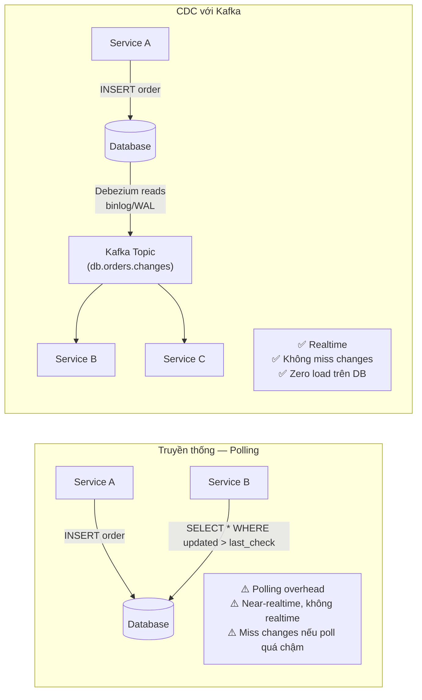
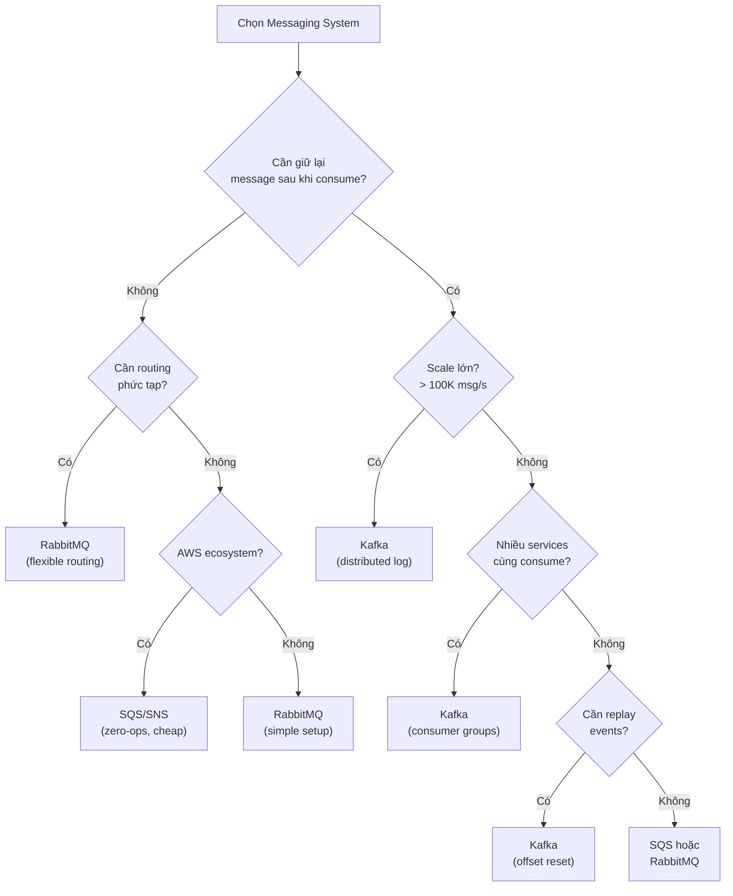

# Kafka vs Các Hệ Thống Khác

## Mục lục

- [Kafka là gì thực sự?](#kafka-là-gì-thực-sự)
- [Kafka vs RabbitMQ](#kafka-vs-rabbitmq)
- [Kafka vs AWS SQS/SNS](#kafka-vs-aws-sqssns)
- [Kafka vs Redis Pub/Sub](#kafka-vs-redis-pubsub)
- [Kafka vs Database (CDC)](#kafka-vs-database-cdc)
- [Decision Matrix](#decision-matrix)
- [Khi nào KHÔNG dùng Kafka](#khi-nào-không-dùng-kafka)

---

## Kafka là gì thực sự?

Kafka **không chỉ là message queue**. Nó là **distributed commit log** — một stream platform:

```
┌─────────────────────────────────────────────────────────────────────┐
│              Kafka Là Gì? (3 Khả Năng Trong 1)                      │
├─────────────────────────────────────────────────────────────────────┤
│                                                                     │
│  1. Message Queue / Event Bus                                       │
│     Producer → Kafka → Consumer (nhiều consumers độc lập)           │
│                                                                     │
│  2. Stream Processing Platform                                      │
│     Real-time data transformation (Kafka Streams, ksqlDB)           │
│                                                                     │
│  3. Storage / Event Log                                             │
│     Lưu trữ events lâu dài (retention: days/weeks/forever)          │
│     Replay lại history bất kỳ lúc nào                               │
│                                                                     │
│  ⚡ RabbitMQ, SQS chỉ làm được điểm 1                                │
└─────────────────────────────────────────────────────────────────────┘
```

---

## Kafka vs RabbitMQ

Đây là so sánh phổ biến nhất. Cả hai đều là message broker, nhưng triết lý thiết kế **hoàn toàn khác nhau**.

### Triết lý cốt lõi

```
RabbitMQ — "Smart Broker, Dumb Consumer"
  Broker quyết định message đến consumer nào (routing, complex rules)
  Message bị XÓA sau khi consumer ack
  Consumer không biết về message của nhau

Kafka — "Dumb Broker, Smart Consumer"
  Consumer tự quyết định đọc từ đâu (offset)
  Message được GIỮ LẠI theo retention policy
  Nhiều consumer groups đọc cùng data độc lập
```

### So sánh chi tiết

| Tiêu chí | Kafka | RabbitMQ |
|---------|-------|---------|
| **Mô hình** | Commit Log (pull) | Message Queue (push) |
| **Message retention** | Theo thời gian (mặc định 7 ngày) | Xóa sau khi ack |
| **Ordering** | ✅ Trong partition | ❌ Không đảm bảo (trừ single queue) |
| **Throughput** | ✅ Rất cao (millions/s) | ⚠️ Cao (100K/s) |
| **Replay** | ✅ Có — reset offset | ❌ Không — đã ack là mất |
| **Fan-out** | ✅ Tự nhiên (multiple groups) | ⚠️ Cần Exchange/Fanout setup |
| **Routing** | ❌ Đơn giản (topic/partition) | ✅ Rất mạnh (headers, bindings) |
| **Complexity** | ⚠️ Cao hơn (ZK/KRaft, partition) | ✅ Đơn giản hơn |
| **Message size** | ⚠️ Best cho small-medium (< 1MB) | ✅ Linh hoạt hơn |
| **Consumer scale** | ✅ Giới hạn bởi partition count | ✅ Không giới hạn |

### Use case điển hình

```
Dùng Kafka khi:                      Dùng RabbitMQ khi:
✅ Event streaming (audit log)        ✅ Task queue (email, job)
✅ Nhiều services cùng consume        ✅ Complex routing rules
✅ Cần replay events                  ✅ Small scale, simple setup
✅ High throughput (> 100K/s)        ✅ RPC-style messaging
✅ Event sourcing                     ✅ Teams quen Spring AMQP
✅ CDC (Change Data Capture)
```

---

## Kafka vs AWS SQS/SNS

Nếu đang dùng AWS, SQS/SNS thường là lựa chọn mặc định. Khi nào Kafka thay thế được?

| Tiêu chí | Kafka (self-managed) | Kafka (MSK) | SQS | SNS |
|---------|---------------------|------------|-----|-----|
| **Managed** | ❌ Tự quản lý | ✅ AWS managed | ✅ Fully managed | ✅ Fully managed |
| **Ordering** | ✅ Per-partition | ✅ Per-partition | ⚠️ FIFO queue (tốn kém) | ❌ Không |
| **Retention** | ✅ Cấu hình được | ✅ Cấu hình được | ⚠️ Max 14 ngày | ❌ Không lưu |
| **Replay** | ✅ Có | ✅ Có | ❌ Không | ❌ Không |
| **Throughput** | ✅ Unlimited | ✅ Unlimited | ⚠️ 300 TPS (standard) | ✅ Cao |
| **Fan-out** | ✅ Consumer groups | ✅ Consumer groups | ❌ Cần SNS+SQS combo | ✅ Pub/Sub |
| **Price** | 💰 Server cost | 💰💰 MSK cost | ✅ Per message | ✅ Per message |
| **Operational** | ❌ Phức tạp | ✅ Dễ | ✅ Zero-ops | ✅ Zero-ops |

### SQS+SNS Fan-out vs Kafka

```
AWS Pattern (SQS+SNS Fan-out):
                   SNS Topic
                      │
        ┌─────────────┼─────────────┐
        ▼             ▼             ▼
   SQS Queue A   SQS Queue B   SQS Queue C
        │             │             │
  Service A      Service B      Service C

Vấn đề: Mỗi service cần 1 SQS queue riêng
        Thêm service → thêm queue → thêm config
        Không replay được

Kafka Pattern:
                  Kafka Topic
                      │
        Consumer Group A → Service A
        Consumer Group B → Service B
        Consumer Group C → Service C

Thêm service → chỉ cần tạo consumer group mới
Replay? Reset offset của group đó
```

---

## Kafka vs Redis Pub/Sub

Redis Pub/Sub thường được dùng cho realtime UI (WebSocket, notifications). So với Kafka:

| Tiêu chí | Kafka | Redis Pub/Sub |
|---------|-------|-------------|
| **Delivery** | ✅ At-least-once đảm bảo | ❌ Fire-and-forget |
| **Persistence** | ✅ Disk-based | ❌ Chỉ in-memory |
| **Retention** | ✅ Days/weeks | ❌ Không (subscriber offline = miss) |
| **Consumer offline** | ✅ Resume từ offset | ❌ Mất messages |
| **Scale** | ✅ Millions/s | ⚠️ Giới hạn RAM |
| **Latency** | ⚠️ Low (ms) | ✅ Ultra-low (sub-ms) |
| **Simplicity** | ⚠️ Phức tạp | ✅ Rất đơn giản |
| **Use case chính** | Event streaming | Realtime UI updates |

> [!TIP]
> **Mô hình lai phổ biến**: Kafka làm event backbone (guaranteed delivery, persistence), Redis làm realtime layer (WebSocket notifications, live dashboard). Kafka consumer nhận event → push lên Redis → WebSocket đến browser.

---

## Kafka vs Database (CDC)

**Change Data Capture (CDC)** là pattern dùng Kafka để stream database changes:



**Ưu điểm CDC qua Kafka:**
- Capture **mọi thay đổi** từ DB (INSERT, UPDATE, DELETE)
- Zero polling overhead trên Database
- Nhiều consumers nhận cùng changes
- Có thể rebuild view/cache từ đầu (replay)

---

## Decision Matrix



---

## Khi nào KHÔNG dùng Kafka

Kafka không phải silver bullet. Với các bài toán sau, nên chọn công cụ khác:

> [!CAUTION]
> **Đừng dùng Kafka khi:**

| Bài toán | Tại sao Kafka là overkill | Dùng gì thay thế |
|---------|--------------------------|-----------------|
| **Simple task queue** (send email, resize image) | Kafka quá phức tạp cho at-most-once tasks | RabbitMQ, SQS, Celery |
| **RPC/Request-Reply** (API calls) | Kafka không thiết kế cho synchronous request/response | REST API, gRPC |
| **Small team, simple scale** | Operational overhead cao (cluster, monitoring) | SQS, RabbitMQ |
| **Large messages** (> 1MB) | Kafka optimize cho small-medium messages | S3 + SQS reference pattern |
| **Complex message routing** | Kafka routing đơn giản (topic/partition) | RabbitMQ với exchanges |
| **Startup MVP** | Quá sớm để cần Kafka scale | SQS + Lambda là đủ |

> [!NOTE]
> **Rule of thumb:** Nếu team bạn < 10 engineers và traffic < 10K req/s, khả năng cao bạn không cần Kafka. SQS hoặc RabbitMQ sẽ đơn giản hơn nhiều. Thêm Kafka khi bạn có **concrete scaling problems** hoặc cần **event replay**.

<Cards>
  <Card title="Kafka Overview" href="/fundamentals/kafka-overview/" description="Kiến trúc tổng quan và các core concepts" />
  <Card title="Tại sao Kafka?" href="/fundamentals/why-kafka/" description="Use cases và giá trị của Kafka trong hệ thống" />
  <Card title="Topics & Partitions" href="/core-concepts/topics-partitions/" description="Bắt đầu học core concepts" />
</Cards>
