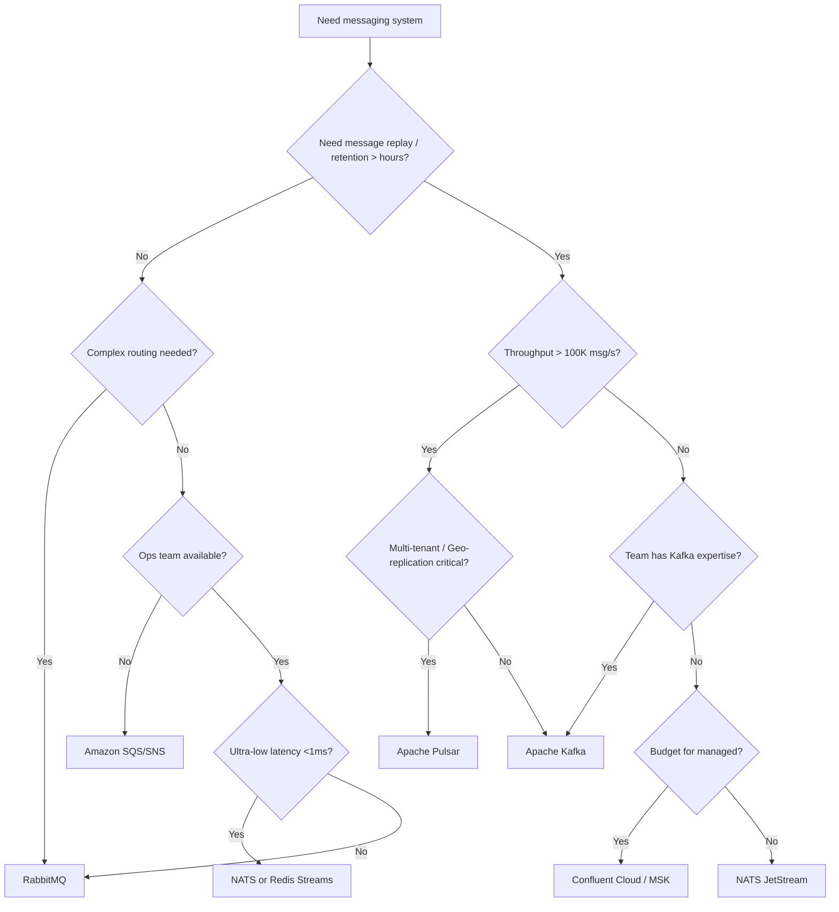

## Mục lục

- [Bối cảnh: Chọn message broker — Quyết định ảnh hưởng 5 năm](#1-bối-cảnh-chọn-message-broker--quyết-định-ảnh-hưởng-5-năm)
- [Mental Model — Queue vs Log vs Hybrid](#2-mental-model--queue-vs-log-vs-hybrid)
- [Kafka vs RabbitMQ — Chi tiết kiến trúc](#3-kafka-vs-rabbitmq--chi-tiết-kiến-trúc)
- [Kafka vs Apache Pulsar — Next-gen challenger](#4-kafka-vs-apache-pulsar--next-gen-challenger)
- [Kafka vs Amazon SQS/SNS — Managed vs Self-hosted](#5-kafka-vs-amazon-sqssns--managed-vs-self-hosted)
- [Kafka vs Redis Streams — When speed trumps durability](#6-kafka-vs-redis-streams--when-speed-trumps-durability)
- [Kafka vs NATS/NATS JetStream — Cloud-native messaging](#7-kafka-vs-natsnats-jetstream--cloud-native-messaging)
- [Performance Benchmarks — Numbers that matter](#8-performance-benchmarks--numbers-that-matter)
- [Delivery Guarantees — Compared](#9-delivery-guarantees--compared)
- [Operational Complexity — Total Cost of Ownership](#10-operational-complexity--total-cost-of-ownership)
- [Ecosystem & Integrations](#11-ecosystem--integrations)
- [Decision Matrix — Khi nào dùng gì](#12-decision-matrix--khi-nào-dùng-gì)
- [Migration Patterns — Từ X sang Kafka](#13-migration-patterns--từ-x-sang-kafka)
- [Anti-patterns — Khi KHÔNG nên dùng Kafka](#14-anti-patterns--khi-không-nên-dùng-kafka)
- [Tóm tắt — Decision Flowchart](#15-tóm-tắt--decision-flowchart)

---

## 1. Bối cảnh: Chọn message broker — Quyết định ảnh hưởng 5 năm

Tech Lead phải chọn messaging infrastructure cho platform mới. Team đang evaluate:

```
Requirements:
  - 500K events/sec peak
  - 7 ngày retention (replay capability)
  - Multiple consumer groups (analytics, billing, notification)
  - Exactly-once cho billing events
  - Team size: 5 backend engineers (không có dedicated infra team)

Options trên bàn:
  1. Kafka (self-hosted hoặc Confluent Cloud)
  2. RabbitMQ (đã dùng cho task queue hiện tại)
  3. Amazon SQS/SNS (managed, no ops)
  4. Apache Pulsar (heard it's "better Kafka")
  5. NATS JetStream (lightweight, cloud-native)
```

> [!IMPORTANT]
> Không có "best messaging system" — chỉ có **best fit cho use case và team**. Mỗi system thiết kế với assumptions khác nhau về data model, ordering, retention, và operational complexity. Document này giúp bạn hiểu **architectural trade-offs** ở mức deep enough để quyết định đúng.

---

## 2. Mental Model — Queue vs Log vs Hybrid

```
┌─────────────────────────────────────────────────────────────────────────────┐
│                    MESSAGING SYSTEM ARCHETYPES                               │
├────────────────────┬───────────────────────┬────────────────────────────────┤
│      QUEUE         │        LOG            │        HYBRID                   │
│   (RabbitMQ, SQS)  │   (Kafka, Redpanda)   │   (Pulsar, NATS JetStream)    │
├────────────────────┼───────────────────────┼────────────────────────────────┤
│                    │                       │                                │
│ • Destructive read │ • Non-destructive read│ • Configurable                 │
│   (msg deleted     │   (offset-based,      │   (queue or log semantics)     │
│    after ack)      │    retained)          │                                │
│                    │                       │                                │
│ • Per-message      │ • Per-partition       │ • Per-subscription             │
│   routing          │   ordering            │   flexibility                  │
│                    │                       │                                │
│ • Push model       │ • Pull model          │ • Push + Pull                  │
│   (broker → consumer│   (consumer → broker) │                                │
│                    │                       │                                │
│ • TTL per message  │ • Retention per topic │ • Both                         │
│                    │                       │                                │
│ Best: Task queues, │ Best: Event streaming,│ Best: Mixed workloads,         │
│ RPC, work          │ CDC, log aggregation, │ multi-tenancy                  │
│ distribution       │ replay                │                                │
└────────────────────┴───────────────────────┴────────────────────────────────┘
```

---

## 3. Kafka vs RabbitMQ — Chi tiết kiến trúc

### 3.1. Architectural comparison

| Aspect | Kafka | RabbitMQ |
|--------|-------|----------|
| **Core model** | Distributed commit log | Message broker (AMQP) |
| **Storage** | Disk-first (append-only log) | Memory-first (overflow to disk) |
| **Ordering** | Per-partition (strong) | Per-queue (redelivery can break order) |
| **Routing** | Topic + partition key | Exchange → Binding → Queue (flexible routing) |
| **Consumer model** | Pull (consumer controls pace) | Push (broker pushes to consumer) |
| **Message lifecycle** | Retained until retention expires | Deleted after consumer ack |
| **Protocol** | Custom binary (Kafka protocol) | AMQP 0.9.1, MQTT, STOMP |
| **Scaling unit** | Partition (add partitions = more throughput) | Queue (add consumers = more throughput) |

### 3.2. Performance internals — Why Kafka is faster for streaming

```
Kafka write path:
  Producer → batch (16-256KB) → compress → 1 network request
           → Leader append to page cache (sequential write)
           → OS flushes to disk asynchronously
  Throughput: 500-2000 MB/s per broker

RabbitMQ write path:
  Producer → per-message → broker memory → persist to Mnesia/disk
           → Route through exchange → copy to each bound queue
           → Each queue has its own copy in memory + disk
  Throughput: 20-80K msg/s per node (with persistence)
```

```
Kafka read path:
  Consumer → FetchRequest(offset) → zero-copy from page cache → NIC
  No tracking per-message state. No deletion. Just offset advancement.

RabbitMQ read path:
  Broker pushes to consumer → consumer ack → broker marks delivered
  → broker deletes message from queue → rebalance queue state
  Per-message state tracking = overhead per message
```

### 3.3. RabbitMQ strengths (khi nào chọn RabbitMQ)

| Feature | RabbitMQ advantage | Kafka equivalent |
|---------|-------------------|-----------------|
| **Flexible routing** | Exchange types: direct, topic, fanout, headers | Consumer filtering (less flexible) |
| **Per-message TTL** | Message expires individually | Only segment-level retention |
| **Priority queues** | Messages have priority levels | Not supported natively |
| **Request/Reply** | Built-in RPC pattern | ReplyingKafkaTemplate (more complex) |
| **Message delay** | Dead Letter Exchange + TTL → delayed delivery | No native delay (need workaround) |
| **Small messages, low latency** | Sub-ms with transient messages | Batching adds latency |

### 3.4. Kết luận

```
Chọn Kafka khi:
  ✓ High throughput (>100K msg/s)
  ✓ Event streaming / log aggregation
  ✓ Message replay / reprocessing needed
  ✓ Multiple consumers per message (fan-out)
  ✓ Long retention (days/weeks)
  ✓ Exactly-once semantics needed
  ✓ Ordered processing critical

Chọn RabbitMQ khi:
  ✓ Complex routing logic (header-based, topic patterns)
  ✓ Task queue / work distribution
  ✓ Request/Reply (RPC) pattern
  ✓ Message priority needed
  ✓ Small team, simple operational requirements
  ✓ Low message volume (<50K msg/s)
  ✓ Per-message TTL / delayed delivery
```

---

## 4. Kafka vs Apache Pulsar — Next-gen challenger

### 4.1. Architectural difference

```
Kafka architecture:
  ┌─────────────────────────────────────┐
  │        Broker = Compute + Storage    │  ← tightly coupled
  │  ┌─────────┐  ┌─────────┐          │
  │  │Partition │  │Partition │  (data)  │
  │  │  Leader  │  │ Follower │          │
  │  └─────────┘  └─────────┘          │
  └─────────────────────────────────────┘

Pulsar architecture (separated):
  ┌──────────────────┐     ┌──────────────────┐
  │   Broker Layer    │     │  BookKeeper Layer │
  │   (stateless,     │────▶│  (stateful,       │
  │    compute only)  │     │   storage only)   │
  └──────────────────┘     └──────────────────┘
       ↑ scale independently ↑
```

### 4.2. Detailed comparison

| Aspect | Kafka | Pulsar |
|--------|-------|--------|
| **Storage** | Coupled (broker = storage) | Separated (BookKeeper) |
| **Scaling** | Add broker = add compute + storage | Scale compute & storage independently |
| **Multi-tenancy** | Limited (quotas) | Native (namespaces, isolation) |
| **Geo-replication** | MirrorMaker 2 (async) | Built-in geo-replication (sync/async) |
| **Protocol** | Kafka protocol only | Kafka protocol + native Pulsar protocol |
| **Subscription modes** | Consumer group (shared) | Exclusive, Shared, Failover, Key_Shared |
| **Message backlog** | On broker disk (affects broker) | On BookKeeper (isolated from broker) |
| **Tiered storage** | KIP-405 (emerging, Kafka 3.6+) | Native (offload to S3/GCS) |
| **Delayed messages** | Not supported | Native support |
| **Schema** | Schema Registry (separate) | Built-in schema registry |

### 4.3. Khi nào Pulsar tốt hơn

```
Chọn Pulsar khi:
  ✓ Multi-tenant platform (nhiều team share cluster)
  ✓ Cần geo-replication built-in (active-active across regions)
  ✓ Storage tiering quan trọng (hot/warm/cold tiers)
  ✓ Mixed workloads: streaming + queuing trên cùng platform
  ✓ Cần scale storage independently khỏi compute

Chọn Kafka khi:
  ✓ Ecosystem lớn hơn (Connect, Streams, ksqlDB, Debezium)
  ✓ Community + talent pool lớn hơn
  ✓ Simpler architecture (ít moving parts)
  ✓ Mature operational tooling
  ✓ Kafka Streams / ksqlDB cho stream processing
  ✓ Most use cases don't need Pulsar's complexity
```

---

## 5. Kafka vs Amazon SQS/SNS — Managed vs Self-hosted

### 5.1. Architecture comparison

```
Amazon SQS:
  Fully managed queue. No partitions. No ordering (Standard) or FIFO.
  Auto-scales. Pay per request. No ops.

Amazon SNS:
  Pub/Sub fan-out. Push to SQS, Lambda, HTTP, email.
  No persistence (fire-and-forget to subscribers).

SNS + SQS combo ≈ Kafka's consumer group pattern (nhưng khác cơ bản):
  SNS topic → fan-out → SQS queue per consumer group → consumer polls SQS
```

### 5.2. Comparison

| Aspect | Kafka | SQS/SNS |
|--------|-------|---------|
| **Ops burden** | High (cluster management) | Zero (fully managed) |
| **Ordering** | Per-partition (strong) | FIFO: per message-group (256 groups), Standard: no ordering |
| **Throughput** | 1M+ msg/s | Standard: unlimited. FIFO: 3000 msg/s per queue |
| **Retention** | Configurable (hours–months) | 4 days (max 14 days) |
| **Replay** | ✓ (seek to any offset) | ✗ (message deleted after consume) |
| **Message size** | 1MB default (configurable) | 256KB (extend with S3 pointer) |
| **Cost model** | Infrastructure (fixed) | Per-request (variable) |
| **Exactly-once** | ✓ (transactions) | ✓ (FIFO dedup, 5-min window) |
| **Consumer model** | Pull (offset-based) | Pull (visibility timeout) |

### 5.3. Cost comparison (example: 100M messages/day)

```
Kafka (self-hosted, 3 brokers, AWS):
  3 × r5.2xlarge (8 vCPU, 64GB) = $1,458/month
  3 × 2TB gp3 EBS = $480/month
  Total: ~$2,000/month (fixed, regardless of message count)

SQS Standard:
  100M requests × $0.40/million = $40/month
  (but: no replay, no ordering, 256KB max)

Kafka (Confluent Cloud):
  100M messages/day ≈ 10TB/month throughput
  Basic cluster: ~$1,500-3,000/month
  (managed, no ops, but less control)
```

### 5.4. Decision

```
Chọn SQS/SNS khi:
  ✓ Team không có capacity quản lý Kafka cluster
  ✓ Workload < 100K msg/s
  ✓ Không cần replay
  ✓ Message ordering không critical (hoặc dùng FIFO)
  ✓ Budget = pay-per-use (traffic không ổn định)

Chọn Kafka khi:
  ✓ Need replay / reprocessing
  ✓ Need event streaming (not just task queue)
  ✓ High throughput (>100K msg/s)
  ✓ Need strong ordering per key
  ✓ Multiple consumer groups
  ✓ Long retention (weeks/months)
```

---

## 6. Kafka vs Redis Streams — When speed trumps durability

### 6.1. Architecture

```
Redis Streams:
  In-memory data structure (like Redis List, but with consumer groups)
  Append-only stream. Consumer groups with ACK.
  Persistence: RDB snapshots + AOF (async, can lose last seconds)

Kafka:
  Disk-first (page cache for speed, disk for durability)
  Synchronous replication (acks=all for no data loss)
```

### 6.2. Comparison

| Aspect | Kafka | Redis Streams |
|--------|-------|---------------|
| **Latency** | 2-10ms (batching + replication) | <1ms (in-memory) |
| **Throughput** | 1M+ msg/s per cluster | 100K-500K msg/s per node |
| **Durability** | Synchronous disk + replication | Async (可 lose last 1s on crash) |
| **Retention** | Days/weeks (disk) | Limited by RAM (expensive for large retention) |
| **Consumer groups** | ✓ (sophisticated) | ✓ (basic, similar concept) |
| **Exactly-once** | ✓ (transactions) | ✗ (at-least-once only) |
| **Message size** | 1MB+ | Practical limit ~100KB (memory) |
| **Replay** | Full replay from any offset | XRANGE (but expensive if large) |
| **Operational** | Complex (cluster) | Simple (single process or cluster) |

### 6.3. Decision

```
Chọn Redis Streams khi:
  ✓ Ultra-low latency required (<1ms)
  ✓ Data volume fits in RAM
  ✓ Can tolerate some data loss (last 1-2s)
  ✓ Already running Redis
  ✓ Simple stream processing needs

Chọn Kafka khi:
  ✓ Durability critical (no data loss)
  ✓ Large data volumes (TB-scale retention)
  ✓ Complex stream processing (Kafka Streams)
  ✓ Exactly-once required
  ✓ Long-term retention (days/weeks)
```

---

## 7. Kafka vs NATS/NATS JetStream — Cloud-native messaging

### 7.1. NATS architecture

```
NATS Core: pub/sub + request/reply. Fire-and-forget. No persistence.
  → Ultra lightweight, <10MB binary, <50ms startup
  → Designed for microservice communication (ephemeral messages)

NATS JetStream: persistence layer on top of NATS
  → Streams (log-like), consumers, ack, replay
  → Competing with Kafka for persistence workloads
```

### 7.2. Comparison

| Aspect | Kafka | NATS JetStream |
|--------|-------|----------------|
| **Resource footprint** | Heavy (JVM, GB heap, disk) | Light (<50MB binary, Go) |
| **Startup time** | 30-60s (JVM + recovery) | <1s |
| **Ordering** | Per-partition | Per-stream or per-subject |
| **Throughput** | Higher sustained (1M+) | Lower sustained (~300K on single node) |
| **Latency** | 2-10ms | <1ms (core), 1-5ms (JetStream) |
| **Exactly-once** | ✓ | ✓ (double-ack dedup) |
| **Ecosystem** | Massive (Connect, Streams, etc.) | Growing (smaller) |
| **Operational** | Complex | Simple (single binary) |
| **Multi-protocol** | Kafka protocol | NATS protocol + MQTT + WebSocket |

### 7.3. Decision

```
Chọn NATS JetStream khi:
  ✓ Cloud-native / Kubernetes-native deployment
  ✓ Need lightweight footprint (edge, IoT)
  ✓ Mixed messaging patterns (pub/sub + queue + request/reply)
  ✓ Small to medium data volumes
  ✓ Team prefers simplicity over ecosystem

Chọn Kafka khi:
  ✓ Large-scale event streaming (>100K msg/s sustained)
  ✓ Need Kafka Connect ecosystem (100+ connectors)
  ✓ Need Kafka Streams / ksqlDB
  ✓ Mature operational tooling required
  ✓ Large team with Kafka expertise
```

---

## 8. Performance Benchmarks — Numbers that matter

### 8.1. Throughput (single node/broker, persistent, 1KB messages)

| System | Write (msg/s) | Read (msg/s) | Notes |
|--------|---------------|--------------|-------|
| **Kafka** | 800K-1.5M | 1-3M | Batching + zero-copy + page cache |
| **Pulsar** | 500K-1M | 800K-1.5M | BookKeeper overhead |
| **RabbitMQ** | 20K-80K | 30K-100K | Per-message routing overhead |
| **Redis Streams** | 200K-500K | 300K-800K | In-memory, limited by CPU |
| **NATS JetStream** | 200K-400K | 300K-600K | Single binary, no JVM |
| **SQS FIFO** | 3K | N/A | AWS hard limit per queue |

### 8.2. Latency (p99, persistent, acks=all equivalent)

| System | Produce p99 | Consume p99 | Notes |
|--------|-------------|-------------|-------|
| **Kafka** | 5-20ms | 1-5ms | Batching + replication |
| **Pulsar** | 5-15ms | 2-8ms | Journal write + ack |
| **RabbitMQ** | 1-5ms | <1ms | Push model, low batch |
| **Redis Streams** | <1ms | <1ms | In-memory |
| **NATS JetStream** | 1-5ms | <1ms | Lightweight |

> [!NOTE]
> Benchmarks depend heavily on configuration, hardware, message size, and replication factor. Numbers above are **indicative** for common production configurations. Always benchmark with YOUR workload on YOUR infrastructure.

---

## 9. Delivery Guarantees — Compared

| System | At-most-once | At-least-once | Exactly-once |
|--------|-------------|---------------|-------------|
| **Kafka** | ✓ (acks=0) | ✓ (acks=all) | ✓ (transactions) |
| **RabbitMQ** | ✓ (no ack) | ✓ (publisher confirm + consumer ack) | ✗ (dedup at app layer) |
| **Pulsar** | ✓ | ✓ | ✓ (transactions, similar to Kafka) |
| **SQS** | ✓ | ✓ (visibility timeout) | ✓ (FIFO dedup, 5-min window) |
| **Redis Streams** | ✓ | ✓ (XACK) | ✗ |
| **NATS JetStream** | ✓ | ✓ (double ack) | ✓ (dedup by msg-id) |

---

## 10. Operational Complexity — Total Cost of Ownership

| | Kafka | RabbitMQ | Pulsar | SQS | NATS |
|--|---|---|---|---|---|
| **Components** | Broker + KRaft (or ZK) | Broker + Mnesia | Broker + BookKeeper + ZK | None (managed) | Single binary |
| **Minimum prod nodes** | 3 brokers + 3 KRaft | 3 (quorum queue) | 3 brokers + 3 BK + 3 ZK | 0 | 3 |
| **Monitoring** | JMX + Prometheus + Grafana | Management UI + Prometheus | Similar to Kafka | CloudWatch | Built-in dashboard |
| **Upgrade difficulty** | Rolling restart (careful) | Blue/green recommended | Complex (BK + broker) | Automatic | Rolling restart |
| **Team expertise needed** | High | Medium | Very High | Low | Low-Medium |
| **Managed options** | Confluent, MSK, Aiven | CloudAMQP, AmazonMQ | StreamNative | AWS native | Synadia |

---

## 11. Ecosystem & Integrations

| | Kafka | RabbitMQ | Pulsar | SQS/SNS | NATS |
|--|---|---|---|---|---|
| **Connectors** | 200+ (Kafka Connect) | Limited (Shovel) | ~50 (Pulsar IO) | Lambda, EventBridge | Limited |
| **Stream processing** | Kafka Streams, ksqlDB, Flink | ✗ | Pulsar Functions | Kinesis Analytics | ✗ |
| **Schema management** | Schema Registry | ✗ | Built-in | ✗ | ✗ |
| **CDC** | Debezium (production-proven) | ✗ | CDC connectors | DMS | ✗ |
| **Client libraries** | Java, Python, Go, C/C++, .NET, Rust, JS | All major languages | Java, Python, Go, C++ | AWS SDKs (all) | All major languages |

---

## 12. Decision Matrix — Khi nào dùng gì

| Requirement | Best choice | Runner-up |
|-------------|-------------|-----------|
| **High throughput event streaming** | Kafka | Pulsar |
| **Task queue / work distribution** | RabbitMQ | SQS |
| **Zero ops / fully managed** | SQS/SNS | Confluent Cloud |
| **Ultra-low latency (<1ms)** | Redis Streams or NATS | RabbitMQ |
| **Multi-tenant platform** | Pulsar | Kafka (with quotas) |
| **CDC / database replication** | Kafka (Debezium) | Pulsar |
| **IoT / Edge / Lightweight** | NATS | Redis Streams |
| **Complex routing (headers, patterns)** | RabbitMQ | Pulsar |
| **Event sourcing / CQRS** | Kafka | Pulsar |
| **Request/Reply (RPC over messaging)** | NATS or RabbitMQ | Kafka (ReplyingTemplate) |
| **Geo-replication (active-active)** | Pulsar | Kafka (MirrorMaker 2) |

---

## 13. Migration Patterns — Từ X sang Kafka

### 13.1. RabbitMQ → Kafka

```
Phase 1: Dual-write (producer gửi cả RabbitMQ + Kafka)
Phase 2: Consumer groups migrate từng service từ RabbitMQ → Kafka
Phase 3: Tắt RabbitMQ producers
Phase 4: Decommission RabbitMQ

Challenges:
  - Routing logic (exchange bindings) → partition key design
  - Per-message TTL → segment retention
  - Priority queues → not supported (redesign needed)
  - Push model → Pull model (consumer code changes)
```

### 13.2. SQS → Kafka

```
Phase 1: Add Kafka producer alongside SQS send
Phase 2: Consumers read from Kafka (with SQS as fallback)
Phase 3: Remove SQS sends

Benefits gained:
  + Replay capability
  + Multiple consumer groups
  + Higher throughput
  + Strong ordering

Lost:
  - Zero-ops (now need Kafka cluster management)
  - Per-message visibility timeout → manual offset management
```

---

## 14. Anti-patterns — Khi KHÔNG nên dùng Kafka

| Anti-pattern | Problem | Better choice |
|-------------|---------|---------------|
| **Kafka as database** | Not designed for random reads/updates | Use actual DB (Postgres, MongoDB) |
| **Kafka for RPC** | Latency too high for sync request/reply | Use gRPC, HTTP, NATS |
| **Tiny messages (<100 bytes), low volume** | Overhead per batch > payload | Redis pub/sub, NATS core |
| **Complex routing per message** | No exchange/binding concept | RabbitMQ |
| **Kafka without replay need** | Unnecessary complexity | SQS (simpler) |
| **Single consumer, simple task queue** | Kafka overkill | RabbitMQ, SQS, Celery |
| **Kafka for real-time chat** | Latency not suitable for <50ms requirement | WebSocket + Redis pub/sub |

---

## 15. Tóm tắt — Decision Flowchart



```
QUICK DECISION:
  Event Streaming + High Throughput + Replay → KAFKA
  Task Queue + Routing + Low Volume → RABBITMQ
  Zero Ops + AWS Native → SQS/SNS
  Multi-Tenant + Geo-Replication → PULSAR
  Lightweight + Cloud-Native → NATS JETSTREAM
  Ultra-Low Latency + In-Memory → REDIS STREAMS

5 NGUYÊN TẮC CHỌN:
1. Kafka KHÔNG phải silver bullet — đừng dùng cho RPC hay task queue
2. Operational complexity = hidden cost lớn nhất (Kafka > Pulsar > RabbitMQ > NATS > SQS)
3. Throughput benchmarks chỉ có ý nghĩa với YOUR workload + YOUR hardware
4. Ecosystem (Connect, Streams, Debezium) thường quan trọng hơn raw performance
5. Start simple (SQS/RabbitMQ) → migrate to Kafka khi THỰC SỰ cần replay/streaming
```
