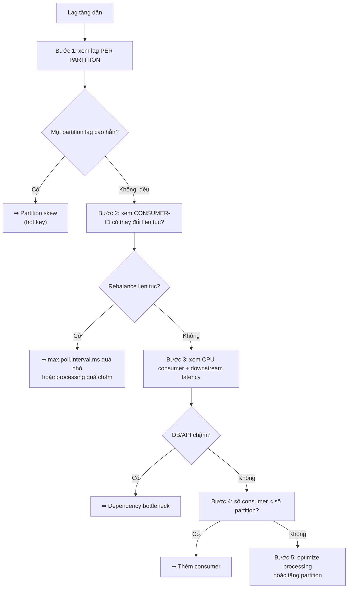

## Mục lục

- [Câu hỏi phỏng vấn](#1-câu-hỏi-phỏng-vấn)
- [Câu trả lời 30 giây](#2-câu-trả-lời-30-giây)
- [Bắt đầu từ: Consumer lag là gì, tính ra sao](#3-bắt-đầu-từ-consumer-lag-là-gì-tính-ra-sao)
- [Bước quan trọng nhất: xem lag per partition](#4-bước-quan-trọng-nhất-xem-lag-per-partition)
- [Nguyên nhân 1: Processing chậm hơn produce rate](#5-nguyên-nhân-1-processing-chậm-hơn-produce-rate)
- [Nguyên nhân 2: Partition skew (hot partition)](#6-nguyên-nhân-2-partition-skew-hot-partition)
- [Nguyên nhân 3: Rebalance storm](#7-nguyên-nhân-3-rebalance-storm)
- [Nguyên nhân 4: GC pause & third-party dependency](#8-nguyên-nhân-4-gc-pause--third-party-dependency)
- [Quy trình chẩn đoán 5 bước](#9-quy-trình-chẩn-đoán-5-bước)
- [Tình huống thực tế: DB chậm → lag bốc khói](#10-tình-huống-thực-tế-db-chậm--lag-bốc-khói)
- [Câu hỏi đào sâu](#11-câu-hỏi-đào-sâu)
- [Tóm tắt — Cheat sheet & 3 nguyên tắc](#12-tóm-tắt--cheat-sheet--3-nguyên-tắc)

---

## 1. Câu hỏi phỏng vấn

> *"Topic `orders` của em, consumer group `order-service` ban đầu lag = 0, chạy ngon lành. Nhưng sau 2 ngày, lag tăng dần lên vài nghìn, rồi vài chục nghìn, dù traffic không có gì đột biến. Em đã thêm consumer mà lag vẫn tăng. Vì sao? Và làm sao tìm đúng chỗ để fix?"*

Câu hỏi này kiểm tra một điều: bạn có hiểu lag là **triệu chứng**, không phải bệnh — và có phương pháp chẩn đoán đúng, thay vì "thêm consumer rồi cầu nguyện".

> [!IMPORTANT]
> Lag = `Log End Offset − Committed Offset` = số message chưa xử lý. Lag **tăng dần** (không phải tăng theo spike) nghĩa là **throughput consume bền vững nhỏ hơn throughput produce**. Thêm consumer chỉ giúp khi bottleneck ở CPU/parallelism; nếu bottleneck ở DB downstream, ở hot partition, hoặc ở rebalance liên tục thì thêm consumer có khi còn làm tệ hơn.

---

## 2. Câu trả lời 30 giây

> Lag tăng dần = consume chậm hơn produce **một cách bền vững**. Bốn nguyên nhân chính: (1) **processing mỗi message quá chậm** — gọi DB/API chậm, thêm consumer chỉ khi còn partition trống; (2) **partition skew** — toàn bộ traffic dồn vào 1 partition do hot key, các consumer khác idle; (3) **rebalance storm** — consumer liên tục rời/vào group (do `max.poll.interval.ms` quá nhỏ so với processing time), xử lý dang dở bị gián; (4) **GC pause hoặc dependency (DB/HTTP) chậm** làm consumer bị block.
>
> Chẩn đoán: xem lag **per partition** (không phải tổng) để phát hiện skew; xem `max.poll.interval.ms` so với processing time để phát hiện rebalance; xem log downstream để phát hiện dependency chậm. Fix đúng gốc: làm consumer idempotent rồi tăng `max.poll.records`, cân hot key, hoặc dùng retry topic tách processing lỗi ra khỏi flow chính.

---

## 3. Bắt đầu từ: Consumer lag là gì, tính ra sao

Trước khi tìm "vì sao lag tăng", phải hiểu rõ lag đo bằng gì. Một partition là một dòng message có thứ tự, mỗi message có một **offset** (số thứ tự):

```
┌───────────────────────────────────────────────────────────────┐
│                     Partition 0 (Commit Log)                  │
├─────┬─────┬─────┬─────┬─────┬─────┬─────┬─────┬─────┬─────┬───┤
│ msg │ msg │ msg │ msg │ msg │ msg │ msg │ msg │ msg │ msg │ . │
│  0  │  1  │  2  │  3  │  4  │  5  │  6  │  7  │  8  │  9  │ . │
├─────┴─────┴─────┴─────┴─────┴─────┴─────┴─────┴─────┴─────┴───┤
│  ↑                  ↑                                   ↑     │
│ Offset 0          Offset 3                         Offset 9   │
│ (cũ nhất)        (Consumer đang              (mới nhất = LEO) │
│                     ở đây)                                    │
└───────────────────────────────────────────────────────────────┘
```

Có 2 con số quan trọng:
- **Committed Offset** = vị trí consumer đã xử lý xong và commit (= 3 trong ví dụ)
- **Log End Offset (LEO)** = vị trí message mới nhất trên partition (= 9)

```
Consumer Lag = LEO − Committed Offset
             = 9 − 3 = 6
             → consumer còn 6 message chưa xử lý
```

> [!NOTE]
> Lag đo "khoảng cách" giữa producer (đã ghi đến LEO) và consumer (đã xử lý đến committed offset). Lag = 0 nghĩa là consumer bắt kịp producer. Lag > 0 nghĩa là consumer đang tụt hậu. **Lag tăng** = khoảng cách này ngày càng lớn.

### Ngưỡng diễn giải lag

| Lag | Trạng thái | Hành động |
|-----|-----------|-----------|
| **0** | Consumer bắt kịp | ✅ Healthy |
| **1–100** | Dao động nhỏ, bình thường | 👀 Monitor |
| **100–1.000** | Đang chậm lại | ⚠️ Điều tra |
| **1.000+** | Backlog nghiêm trọng | 🚨 Scale up / fix |
| **Đang tăng liên tục** | Ngày càng tệ | 🔥 Urgent |

---

## 4. Bước quan trọng nhất: xem lag per partition

Đây là bước **quan trọng nhất** khi chẩn đoán lag. Đừng xem "lag tổng = 5.000" rồi vội kết luận — phải xem **lag chia cho từng partition**:

```bash
kafka-consumer-groups.sh --bootstrap-server localhost:9092 \
    --describe --group order-service

# GROUP          TOPIC    PARTITION  CURRENT-OFFSET  LOG-END-OFFSET  LAG
# order-service  orders   0          1523            1530            7
# order-service  orders   1          892             900             8
# order-service  orders   2          2105            5000            2895    ← ⚠️
# order-service  orders   3          180             185             5
```

Chỉ cần nhìn vào bảng này, bạn đã có thể phân loại ngay vấn đề:

| Hình thái lag | Ý nghĩa | Nguyên nhân nhiều khả năng |
|---------------|---------|----------------------------|
| Lag **đều** ở mọi partition | Bottleneck chung | Processing chậm, thiếu consumer, dependency chậm |
| Lag **tập trung 1–2 partition** | Bottleneck cục bộ | Partition skew (hot key) |
| Lag tăng + log rebalance | Consumer liên tục bị gián | Rebalance storm |
| Lag tăng + GC/dependency log | Consumer bị block | GC pause, downstream chậm |

> [!TIP]
> Trong ví dụ trên, partition 2 có lag = 2.895, gấp vài trăm lần các partition khác → gần như chắc chắn là **partition skew**. Nếu 4 partition đều lag ~7.000 → bottleneck tổng. Bước này định hướng toàn bộ quá trình chẩn đoán phía sau.

---

## 5. Nguyên nhân 1: Processing chậm hơn produce rate

Đây là nguyên nhân trực tiếp nhất: **thời gian xử lý 1 message × số message/poll > thời gian giữa 2 lần poll**. Nghĩa là consumer "không theo kịp" producer.

### Bài toán cụ thể

Giả sử:
- Produce rate: 1.000 msg/s (đều đặn)
- Mỗi message cần gọi DB mất 100ms
- Topic có 3 partition → tối đa 3 consumer song song

```
Tính toán throughput consume tối đa:
  • 1 consumer xử lý:  1 message / 0.1s = 10 msg/s
  • 3 consumer song song: 3 × 10 = 30 msg/s
  → Produce 1.000/s, consume 30/s
  → Thâm hụt 970 msg mỗi giây
  → Sau 1 giờ: lag = 970 × 3600 = ~3.5 triệu message  💀
```

### Vì sao "thêm consumer" không giúp?

Nhớ lại quy tắc Kafka: **1 partition → tối đa 1 consumer trong group**. Vậy:

```
3 partition, processing 10 msg/s mỗi consumer:
   1 consumer  → 10 msg/s   ❌ (thiếu)
   3 consumer  → 30 msg/s   ✅ tối đa (đã hết partition để gán)
   6 consumer  → 30 msg/s   ❌ 3 consumer IDLE, không tăng throughput!
```

Khi đã đạt `consumer = partition`, thêm consumer thứ 4, 5, 6 đều **vô nghĩa** — chúng không có partition để xử lý. Muốn tăng throughput lúc này chỉ còn cách:

| Cách | Ý tưởng | Rủi ro |
|------|---------|--------|
| **Tăng số partition** | Cho phép thêm consumer song song | Phá ordering (xem bài partition) |
| **Tối ưu processing** | Giảm thời gian xử lý mỗi message | Cần refactor code |
| **Batch DB write** | Gom nhiều message rồi ghi 1 lần | Cần idempotent |
| **Song song hóa trong consumer** | Dùng thread pool xử lý nhiều message cùng lúc | Mất ordering per-partition |

> [!IMPORTANT]
> Đây là lý do "thêm consumer mà lag vẫn tăng" — khi số consumer đã bằng số partition, thêm nữa là vô ích. Phải đi tìm **gốc rễ** (processing chậm) thay vì "đổ thêm người vào".

---

## 6. Nguyên nhân 2: Partition skew (hot partition)

Đây là nguyên nhân **đáng lừa nhất**, vì lag per partition (mục 4) cho thấy một vấn đề cục bộ mà lag tổng không phát hiện được.

### Hiện tượng

Khi dùng **message key**, Kafka quyết định partition bằng `hash(key) % num_partitions`. Nếu một key chiếm phần lớn traffic (gọi là **hot key**), toàn bộ traffic đó dồn vào **1 partition duy nhất**:

```
Topic: orders (4 partitions), key = userId

TÌNH HUỐNG BÌNH THƯỜNG (key phân bố đều):
   P0: 25%   P1: 25%   P2: 25%   P3: 25%
   → 4 consumer đều bận, tải cân bằng → lag đều

TÌNH HUỐNG HOT KEY (1 user VIP chiếm 80% traffic):
   hash("user-VIP") % 4 = 2
   P0: 5%    P1: 5%    P2: 80%    P3: 5%
   → Consumer 2 quá tải (80% traffic)
   → Consumer 1, 3, 4 gần như RẢNH (5% mỗi cái)
   → Partition 2 bị tụt, các partition khác theo kịp
```

### Vì sao đây là cái bẫy?

Vì bạn có **4 partition, 4 consumer** — theo lý thuyết là đã tối ưu. Nhưng thực tế chỉ có **1 partition (P2) làm việc thực sự**, 3 consumer còn lại gần như idle. Thêm consumer thứ 5, 6, 7 → vẫn vô ích, vì P2 vẫn chỉ được gán cho 1 consumer duy nhất.

```text
Lag per partition cho thấy vấn đề:

   P0: lag = 7      (consumer 1 theo kịp)
   P1: lag = 8      (consumer 2 theo kịp)
   P2: lag = 2895   (consumer 3 quá tải) ← HOT PARTITION
   P3: lag = 5      (consumer 4 theo kịp)

   → Nếu chỉ nhìn lag tổng = 2915, sẽ tưởng "thiếu consumer"
   → Thực ra: 3 consumer đang rảnh, 1 consumer quá tải
   → Thêm consumer KHÔNG GIẢI QUYẾT được vấn đề này
```

### Cách xử lý (tóm tắt)

| Giải pháp | Ý tưởng | Khi nào dùng | Ảnh hưởng ordering? |
|-----------|---------|--------------|---------------------|
| **Key salting** | Thêm hậu tố random: `userId-0`, `userId-1`… rồi rotate | Cần chia đều hot key | Có (mỗi salt là 1 sub-stream) |
| **Custom Partitioner** | Logic phức tạp hơn hash | Cần routing theo business rule | Có |
| **Tách topic riêng** | Hot entity có topic riêng | Hot key cố định, rõ ràng | Không |
| **Tăng partition** | Thêm partition để giảm skew | Cần thêm consumer song song | Có (hash key đổi) |

Chi tiết 4 giải pháp (kèm code Java) trong bài [Partitioning Strategy](/core-concepts/partitioning-strategy/).

> [!CAUTION]
> Partition skew là nguyên nhân khiến team "thêm consumer rồi cầu nguyện" mà không đỡ. Luôn xem lag per partition trước khi ra quyết định scale.

---

## 7. Nguyên nhân 3: Rebalance storm

Nguyên nhân này rất khó đoán vì **bề ngoài trông giống "consumer đang chạy"**, nhưng thực ra consumer liên tục bị gián đoạn. Hiểu đơn giản: consumer **bị đẩy ra rồi join lại group liên tục**.

### Hiện tượng

Mỗi consumer phải gọi `poll()` định kỳ để báo "tôi vẫn sống". Nếu khoảng cách giữa 2 lần poll **vượt `max.poll.interval.ms`** (mặc định 5 phút), Kafka coi consumer đã chết → trigger rebalance.

```
max.poll.interval.ms = 300000 (5 phút)
Processing thực tế mỗi batch = 7 phút

Timeline:
   poll() batch 100 records ──▶ bắt đầu xử lý
   │
   │ ... xử lý ...
   │
   phút thứ 5: Kafka: "đã 5 phút chưa poll lại, consumer chết!"
   phút thứ 5: Trigger rebalance → partition bị thu hồi + gán lại
   │
   phút thứ 7: Consumer xong, gọi poll() → "tôi không còn partition!"
   phút thứ 7: Re-join group → nhận lại partition → poll batch mới
   │ ... xử lý 7 phút ...
   │ → lại vượt max.poll.interval → lại rebalance → ...
   │
   Kết quả: consumer luôn "giữ" partition < 5 phút rồi mất
            → throughput thực tế gần = 0, lag tăng vọt
```

### Vì sao nguy hiểm?

Vì nó **tự duy trì**: rebalance làm processing chậm → chậm quá → lại trigger rebalance → lại chậm → … Đây là vòng lặp xấu gọi là **rebalance storm**. Hậu quả: lag tăng đột biến dù traffic không đổi, consumer dùng CPU bình thường, không có exception rõ ràng.

### Dấu hiệu nhận biết

- Lag tăng + log đầy `Member ... has failed` / `Revoke partition` events
- `kafka-consumer-groups --describe` thấy `CONSUMER-ID` **thay đổi liên tục** (mỗi lần join là 1 ID mới)
- Throughput thấp dù CPU rảnh, không có DB chậm

### Cách khắc phục

```yaml
spring:
  kafka:
    consumer:
      properties:
        max.poll.interval.ms: 600000    # tăng lên 10 phút (phải > max processing time)
        max.poll.records: 20            # GIẢM số record/poll → xử lý nhanh hơn trong window
        session.timeout.ms: 45000
```

Hai núm quan trọng:

| Tham số | Tác dụng | Khuyến nghị |
|---------|----------|-------------|
| **Giảm `max.poll.records`** | Batch nhỏ hơn → xử lý xong trước `max.poll.interval.ms` | ✅ An toàn, ưu tiên làm trước |
| **Tăng `max.poll.interval.ms`** | Cho phép batch lớn hơn | ⚠️ Che giấu vấn đề processing chậm |

> [!IMPORTANT]
> Quy tắc: `max.poll.records × worst_case_processing_time < max.poll.interval.ms`. Nếu vi phạm → rebalance storm → lag tăng theo cấp số nhân. Ưu tiên giảm `max.poll.records` trước, vì nó giải quyết gốc rễ (batch quá lớn) thay vì che giấu.

---

## 8. Nguyên nhân 4: GC pause & third-party dependency

Nguyên nhân cuối: consumer bị **block** ngoài ý muốn. Hai thủ phạm phổ biến:

### Thủ phạm A: GC pause (Stop-The-World)

Java consumer có thể bị **Garbage Collection pause** vài giây. Trong lúc GC, consumer "đứng" không gọi poll → nếu pause lâu hơn `session.timeout.ms` → Kafka tưởng consumer chết → rebalance → lag tăng.

```
Consumer đang xử lý bình thường
   │
   ▼
GC pause 60 giây (heap quá đầy)
   │
   ▼
session.timeout.ms = 45 giây → Kafka: "consumer chết!"
   │
   ▼
Trigger rebalance → partition gán cho consumer khác
   │
   ▼
Consumer sống lại sau GC → không còn partition → join lại → rebalance tiếp
```

**Dấu hiệu**: GC log có pause > 1 giây, lag tăng đúng lúc GC pause.

### Thủ phạm B: Dependency downstream chậm

Consumer gọi DB hoặc HTTP API **chậm/treo**:

```
Consumer gọi downstream API:
   bình thường: 50 ms/call  → 100 msg/s mỗi consumer
   giờ DB overload: 30 giây/call (connection pool đầy)

   max.poll.records = 100, mỗi call 30s
   → batch = 100 × 30s = 3000 giây = 50 phút
   → vượt max.poll.interval.ms (5 phút)
   → rebalance → lag tăng
```

**Dấu hiệu**: downstream latency P99 tăng vọt, consumer log treo ở "calling DB/API".

> [!WARNING]
> Đây là lý do consumer lag thường là **canary (chim cảnh báo)** cho thấy một hệ thống khác đang có vấn đề. Khi DB chậm, consumer không kịp xử lý → lag tăng → devops nhìn vào Kafka mà original cause nằm ở DB. **Phải monitor lag + downstream latency cùng nhau**.

---

## 9. Quy trình chẩn đoán 5 bước



### Bảng tra nhanh nguyên nhân theo triệu chứng

| Triệu chứng | Nguyên nhân nhiều khả năng | Hành động đầu tiên |
|-------------|---------------------------|-------------------|
| Lag đều ở mọi partition, không có rebalance | Processing chậm / thiếu consumer | Thêm consumer (nếu < partition) |
| Lag tập trung 1–2 partition | Partition skew (hot key) | Xem key distribution |
| Lag tăng + log rebalance dày | Rebalance storm | Giảm `max.poll.records` |
| Lag tăng + GC/downstream chậm | Dependency hoặc GC bottleneck | Tune GC / fix DB |
| Lag tăng đột biến rồi giảm | Traffic spike tạm thời | Không phải bệnh, đợi qua |

> [!TIP]
> Nguyên tắc chẩn đoán: **luôn bắt đầu bằng lag per partition**. Nó định hướng toàn bộ quá trình — nếu sai bước này, các bước sau đều sai hướng.

---

## 10. Tình huống thực tế: DB chậm → lag bốc khói

### Bối cảnh

Service `order-service` consume topic `orders` (8 partition, 8 consumer), lưu vào PostgreSQL. Cấu hình tối ưu: consumer = partition. Bình thường: 1.000 order/s, mỗi insert PostgreSQL 5ms → 8 consumer × 125 order/s × ... thực tế đủ bắt kịp produce rate. Lag = 0 ổn định.

### Sự cố

Một ngày, lag tăng từ 0 lên **500.000** trong 2 giờ. Team phản ứng theo thứ tự sai lầm:

**Phản ứng 1 — "thêm consumer":** tăng từ 8 lên 16 consumer → **lag vẫn tăng** (vì chỉ có 8 partition, 8 consumer mới idle).

**Phản ứng 2 — "restart consumer":** restart tất cả → lag giảm vài phút rồi tăng tiếp.

**Phản ứng 3 — "restart Kafka":** không đỡ.

### Chẩn đoán đúng theo quy trình 5 bước

```
Bước 1: lag per partition
   → kết quả: LAG ĐỀU ở mọi partition
   → loại skew, hướng tới bottleneck tổng

Bước 2: CONSUMER-ID có thay đổi liên tục?
   → kết quả: CÓ, log đầy "Revoke partition" / "Rebalance"
   → phát hiện rebalance storm!

Bước 3: xem downstream latency
   → kết quả: log consumer thấy "INSERT INTO orders" P99 = 8 GIÂY (!)
   → PostgreSQL đang nghẽn, không phải Kafka
```

### Tìm ra gốc rễ

PostgreSQL table `orders` **phình to** (2 tháng không VACUUM), index bloat → mỗi INSERT tốn **8 giây** thay vì 5ms (chậm 1.600 lần). Consumer bị block 8s × `max.poll.records` → vượt `max.poll.interval.ms` → rebalance storm → lag tăng đột biến.

```
Bình thường:   8 consumer × 125 order/s × 5ms = theo kịp produce
Sau khi DB nghẽn: 8 consumer × 1 order/s × 8s = 8 order/s
                 → produce 1.000/s, consume 8/s
                 → thâm hụt 992/s
                 → sau 2 giờ: lag = 992 × 7200 ≈ 7 triệu (thực tế 500k vì có rebalance gián đoạn)
```

### Fix đúng gốc

```
Fix ngắn hạn (trong ngày):
   ✅ VACUUM ANALYZE orders;         → INSERT trở lại 5ms
   ✅ Giảm max.poll.records = 10      → batch xong trước max.poll.interval.ms

Fix dài hạn:
   ✅ Tune autovacuum (chạy thường hơn)
   ✅ Monitor INSERT latency P99, alert khi > 100ms
   ✅ Tách retry ra retry-topic (poison pill không stall main flow)
   ✅ Alert khi consumer lag > ngưỡng VÀ downstream P99 tăng
```

> [!WARNING]
> Bài học: consumer lag thường là **canary** báo hiệu một hệ thống khác đang bệnh. Thêm consumer mà không tìm gốc rễ = đổ thêm người vào phòng cháy trong khi vòi nước bị tắc. **Luôn hỏi "lag vì consume chậm, hay vì downstream chậm?" trước khi hành động**.

---

## 11. Câu hỏi đào sâu

> **"Vì sao không xử lý song song trong consumer để tăng throughput?"**
> Có thể, nhưng **mất ordering per-partition**. Nếu dùng `ExecutorService` xử lý nhiều message đồng thời từ cùng partition, các message có thể hoàn thành theo thứ tự lộn xộn — commit offset khi chưa xử lý xong cái trước nguy cơ skip message khi crash. Chỉ nên song song hóa khi message **độc lập** và processing **idempotent**.

> **"Dùng commit `RECORD` vs `BATCH` ảnh hưởng lag thế nào?"**
> `RECORD` (commit mỗi message) an toàn hơn nhưng **chậm hơn** → lag dễ tăng hơn. `BATCH` (mặc định) nhanh hơn nhưng nếu crash giữa batch, phải reprocess cả batch. Cân bằng giữa throughput và duplicate risk. Xem chi tiết [Consumer Groups — AckMode](/core-concepts/consumer-groups/#ackmode-trong-spring-kafka).

> **"Khi nào nên dùng DLQ để giảm lag?"**
> Khi có **poison pill** — một message gây lỗi xử lý, bị reprocess vô tận, **block** partition. Đẩy sang DLQ để main flow tiếp tục, xử lý poison pill riêng. Đây là nội dung bài [Retry & DLT](/producers-consumers/retry-dlt/).

> **"Lag = 0 nhưng vẫn có vấn đề được không?"**
> Có. Lag = 0 chỉ nói "consumer đã commit đủ", không nói "processing thành công". Nếu consumer auto-commit mà processing fail → lag = 0 nhưng message bị **bỏ qua**. Đây là lý do nên tắt auto-commit cho data critical.

---

## 12. Tóm tắt — Cheat sheet & 3 nguyên tắc

### Cheat sheet

```
╔═══════════════════════════════════════════════════════════════╗
║  Lag = LEO − Committed Offset                                 ║
║  Luôn xem lag PER PARTITION, không chỉ tổng                   ║
║  ───────────────────────────────────────────────────────────  ║
║  Lag đều       → processing chậm / thiếu consumer             ║
║  Lag 1-2 P     → partition skew (hot key)                     ║
║  Lag + rebal.  → max.poll.interval.ms < processing time       ║
║  Lag + GC/dep. → downstream đang bệnh                         ║
║  ───────────────────────────────────────────────────────────  ║
║  Thêm consumer giúp ⇔ còn partition trống                     ║
║  Giảm max.poll.records ⇔ làm batch xong trong poll interval   ║
╚═══════════════════════════════════════════════════════════════╝
```

### 3 nguyên tắc áp dụng ngay

> [!IMPORTANT]
> **1. Lag là triệu chứng, hãy chẩn đoán trước khi xử lý.**
> Đừng vội "thêm consumer". Xem lag per partition → xem có rebalance không → xem downstream latency. Thêm consumer sai chỗ (skew / dependency) chỉ làm tệ thêm.
>
> **2. Theo dõi lag + downstream cùng nhau.**
> Alert lag một mình không đủ — cần alert kèm DB latency, API latency, GC pause. Consumer lag tăng thường là hồi chuông đầu tiên báo "hệ thống khác đang có vấn đề".
>
> **3. Cân `max.poll.records` với `max.poll.interval.ms`.**
> Quy tắc: `max.poll.records × worst_case_processing_time < max.poll.interval.ms`. Nếu vi phạm → rebalance storm → lag tăng theo cấp số nhân. Giảm `max.poll.records` thường an toàn hơn tăng interval.

### Quote cuối

> Consumer lag giống **sốt** — nó chỉ nói "có gì đó không ổn", không nói bệnh ở đâu. Một bác sĩ giỏi không vội kê thuốc hạ sốt (thêm consumer) mà tìm ổ nhiễm trùng (DB chậm, hot key, rebalance). Hiểu được điều đó, bạn sẽ ngừng đổ lỗi cho Kafka và bắt đầu tìm đúng chỗ để fix.

<Cards>
  <Card title="Consumer Groups" href="/core-concepts/consumer-groups/" description="Partition-consumer mapping, AckMode, vì sao số consumer bị chặn bởi số partition" />
  <Card title="Offset Management" href="/core-concepts/offsets/" description="Consumer lag, commit strategies, reset offset và 5 kịch bản lifecycle" />
  <Card title="Partitioning Strategy" href="/core-concepts/partitioning-strategy/" description="Hot partitions, key salting — gốc rễ của partition skew" />
</Cards>
