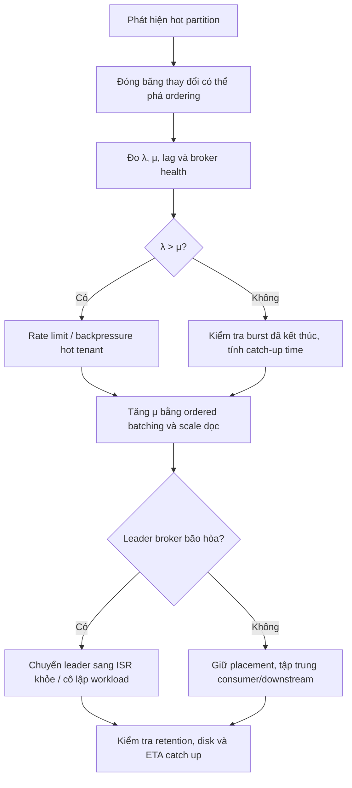

## Mục lục

- [Câu hỏi phỏng vấn](#1-câu-hỏi-phỏng-vấn)
- [Câu trả lời 30 giây](#2-câu-trả-lời-30-giây)
- [Sự thật nền tảng: strict ordering tạo ra một ordered lane](#3-sự-thật-nền-tảng-strict-ordering-tạo-ra-một-ordered-lane)
- [Trước khi xử lý: xác định chính xác thứ đang nóng](#4-trước-khi-xử-lý-xác-định-chính-xác-thứ-đang-nóng)
- [Incident playbook trong 15 phút đầu](#5-incident-playbook-trong-15-phút-đầu)
- [Biện pháp 1: giảm arrival rate bằng backpressure và quota](#6-biện-pháp-1-giảm-arrival-rate-bằng-backpressure-và-quota)
- [Biện pháp 2: tăng tốc ordered consumer mà không phá thứ tự](#7-biện-pháp-2-tăng-tốc-ordered-consumer-mà-không-phá-thứ-tự)
- [Biện pháp 3: chuyển leader và cô lập blast radius](#8-biện-pháp-3-chuyển-leader-và-cô-lập-blast-radius)
- [Biện pháp 4: dùng durable buffer để hấp thụ burst](#9-biện-pháp-4-dùng-durable-buffer-để-hấp-thụ-burst)
- [Bảo vệ dữ liệu khi backlog đã lớn](#10-bảo-vệ-dữ-liệu-khi-backlog-đã-lớn)
- [Vì sao các phản ứng phổ biến không hiệu quả](#11-vì-sao-các-phản-ứng-phổ-biến-không-hiệu-quả)
- [Kiểm tra lại phạm vi ordering thực sự](#12-kiểm-tra-lại-phạm-vi-ordering-thực-sự)
- [Thiết kế dài hạn khi strict ordering là bắt buộc](#13-thiết-kế-dài-hạn-khi-strict-ordering-là-bắt-buộc)
- [Tình huống thực tế: VIP tenant làm nóng partition thanh toán](#14-tình-huống-thực-tế-vip-tenant-làm-nóng-partition-thanh-toán)
- [Câu hỏi đào sâu](#15-câu-hỏi-đào-sâu)
- [Tóm tắt — Cheat sheet và câu trả lời mẫu](#16-tóm-tắt--cheat-sheet-và-câu-trả-lời-mẫu)

---

## 1. Câu hỏi phỏng vấn

> *"Topic `payment-events` partition theo `merchantId`. Một merchant lớn đột ngột tạo 70% traffic, khiến một partition có lag tăng liên tục. Em không thể salt key vì mọi giao dịch của merchant phải được xử lý đúng thứ tự. Tại thời điểm sự cố đang xảy ra, em làm gì? Có thể vừa giữ strict ordering vừa scale partition đó không?"*

Câu hỏi này kiểm tra ba năng lực:

1. Bạn có nhận ra **giới hạn tuần tự** của strict ordering hay không.
2. Bạn có biết tách **incident mitigation** khỏi **architectural fix** hay không.
3. Bạn có ưu tiên bảo vệ correctness, dữ liệu và toàn cluster thay vì thay đổi partition key trong hoảng loạn hay không.

> [!IMPORTANT]
> Nếu mọi event của một key có quan hệ phụ thuộc tuần tự, key đó là **một ordered processing lane**. Không thể đơn giản thêm partition hoặc thêm consumer để chạy song song mà vẫn giữ nguyên semantics. Trong incident, ba đòn bẩy thật sự là: **giảm tốc độ vào**, **tăng tốc xử lý tuần tự**, hoặc **chấp nhận backlog có kiểm soát**. Chuyển leader chỉ giúp cô lập tài nguyên, không biến một lane thành nhiều lane.

---

## 2. Câu trả lời 30 giây

> Trước tiên em không salt key và không tăng partition một cách mù quáng, vì strict ordering biến hot key thành một ordered lane. Em đo tốc độ vào `λ` và tốc độ xử lý `μ` trên chính partition đó. Nếu `λ > μ`, lag chắc chắn tăng; xử lý tức thời là rate limit hot tenant hoặc trả backpressure, đồng thời dùng durable buffer nếu không được phép mất request.
>
> Sau đó em tăng `μ` mà vẫn giữ thứ tự: scale dọc consumer, batch DB write, cache lookup, bỏ synchronous logging và tối ưu downstream. Nếu broker leader bị bão hòa, em chuyển leadership sang một in-sync replica khỏe hơn hoặc cô lập partition trên broker riêng; việc này giảm blast radius nhưng không tăng parallelism. Em cũng kiểm tra retention và disk để backlog không bị xóa trước khi catch up. Dài hạn, em đặt quota/admission control theo tenant, capacity-plan theo hot key và xác định ordering thực sự cần ở cấp merchant, account hay transaction.

---

## 3. Sự thật nền tảng: strict ordering tạo ra một ordered lane

Kafka đảm bảo thứ tự trong phạm vi **một partition**. Với một consumer group, một partition tại một thời điểm được gán cho một consumer. Nếu mọi event của `merchant-42` đều vào partition P3:

```text
Producer                                      Consumer Group

merchant-42 events                            one ordered lane
E100 ─┐                                       ┌──────────────┐
E101 ─┼──▶ Partition P3: E100, E101, E102 ──▶│ Consumer C3  │
E102 ─┘                                       └──────────────┘
```

Nếu `E101` cần state do `E100` tạo ra, ta không thể xử lý chúng độc lập:

```text
E100: balance = 100
E101: withdraw 80       ← phải thấy kết quả E100
E102: withdraw 30       ← phải thấy kết quả E101
```

### 3.1 Công thức quyết định backlog

Gọi:

- `λ` — arrival rate: số record producer ghi vào partition mỗi giây.
- `μ` — service rate: số record consumer xử lý và commit mỗi giây.
- `L` — lag hiện tại.

```text
Tốc độ tăng backlog = λ − μ
```

Ví dụ:

```text
λ = 10.000 record/s
μ =  6.000 record/s

Backlog tăng = 4.000 record/s
Sau 10 phút = 4.000 × 600 = 2.400.000 record
```

Khi đã giảm traffic hoặc tăng processing để `μ > λ`, thời gian catch up xấp xỉ:

```text
Catch-up time = L / (μ − λ)
```

Ví dụ lag đang là 2,4 triệu, sau mitigation `μ = 8.000/s`, `λ = 4.000/s`:

```text
Catch-up time = 2.400.000 / (8.000 − 4.000)
              = 600 giây
              = 10 phút
```

> [!IMPORTANT]
> Nếu `λ` trung bình dài hạn vẫn lớn hơn `μ`, mọi buffer cuối cùng đều đầy và mọi lag cuối cùng đều tăng. Đây là bài toán capacity, không phải lỗi cấu hình Kafka.

### 3.2 Kafka ordering không tự động đồng nghĩa business ordering

Ngay cả khi dùng một partition, strict business ordering vẫn cần thiết kế ở producer và consumer:

- Nhiều producer cùng ghi một key không tự biết event nào xảy ra trước về mặt nghiệp vụ.
- Retry producer phải tránh tạo thứ tự ngoài dự kiến; nên dùng idempotent producer và `acks=all` cho dữ liệu quan trọng.
- Event nên có `sequenceNumber` hoặc `version` để consumer phát hiện thiếu, trùng hoặc đảo thứ tự nghiệp vụ.
- Consumer phải commit offset sau khi side effect tương ứng hoàn tất.
- Downstream write nên idempotent để chịu được duplicate khi consumer crash hoặc rebalance.

Một schema tối thiểu:

```json
{
  "merchantId": "merchant-42",
  "sequenceNumber": 10042,
  "eventId": "evt-7f8d",
  "eventType": "PAYMENT_CAPTURED",
  "occurredAt": "2026-03-22T10:15:30Z"
}
```

---

## 4. Trước khi xử lý: xác định chính xác thứ đang nóng

"Hot partition" có thể chỉ ba bottleneck khác nhau. Biện pháp xử lý của chúng không giống nhau.

| Loại bottleneck | Dấu hiệu | Hành động có giá trị nhất |
|-----------------|----------|---------------------------|
| **Broker leader nóng** | Produce/fetch latency cao, broker CPU/network/disk bão hòa | Chuyển leader, cô lập broker, giảm traffic |
| **Consumer lane nóng** | Broker ổn nhưng lag P3 tăng, downstream chậm | Rate limit, tối ưu ordered processing |
| **Cả hai cùng nóng** | Partition ingress cao và consumer không theo kịp | Containment trước, sau đó xử lý cả broker và consumer |

### 4.1 Xem lag theo từng partition

```bash
kafka-consumer-groups.sh \
  --bootstrap-server kafka:9092 \
  --group payment-service \
  --describe
```

Ví dụ:

```text
TOPIC          PARTITION  CURRENT-OFFSET  LOG-END-OFFSET  LAG
payment-events 0          1,200,100       1,200,200       100
payment-events 1          1,500,010       1,500,090        80
payment-events 2          1,100,000       1,100,100       100
payment-events 3          2,000,000       4,400,000   2,400,000  ← HOT
```

Không chỉ chụp một lần. Hãy lấy ít nhất hai mẫu cách nhau 30–60 giây:

```text
λ ≈ ΔLOG-END-OFFSET / Δtime
μ ≈ ΔCURRENT-OFFSET / Δtime
```

### 4.2 Xác định leader, replicas và ISR

```bash
kafka-topics.sh \
  --bootstrap-server kafka:9092 \
  --topic payment-events \
  --describe
```

Cần ghi lại cho partition nóng:

- Leader hiện tại.
- Danh sách replicas.
- Danh sách ISR.
- Có under-replicated hay không.

Ví dụ:

```text
Topic: payment-events  Partition: 3  Leader: 1
Replicas: 1,2,3  Isr: 1,2,3
```

Broker 2 hoặc 3 có thể là ứng viên nhận leadership vì đã có bản sao đồng bộ. Nhưng phải kiểm tra tài nguyên của broker đích trước khi chuyển.

### 4.3 Kiểm tra broker và downstream

Metrics cần đặt cạnh nhau:

| Tầng | Metrics cần xem |
|------|-----------------|
| Broker | Produce/fetch latency, bytes in/out, request handler idle, network processor idle, disk latency |
| Partition | Delta LEO, lag, leader placement, ISR |
| Consumer | Records consumed/s, poll latency, processing latency, rebalance count, CPU/GC |
| Downstream | DB/API P95-P99, connection pool, timeout, error/retry rate |

> [!NOTE]
> Kafka không phải lúc nào cũng cung cấp sẵn throughput theo từng partition trong một metric duy nhất. Cách thực dụng là đo delta LEO để ước lượng record rate, kết hợp telemetry từ producer để biết bytes và phân bố key.

---

## 5. Incident playbook trong 15 phút đầu



### Phút 0–3: bảo vệ correctness

Không thực hiện các thay đổi sau trong hoảng loạn:

- Không đổi key hoặc thêm random salt ngay trên producer đang chạy.
- Không tăng partition rồi kỳ vọng hot key tự chia ra.
- Không bật thread pool xử lý cùng partition nếu chưa có ordered commit/resequencing.
- Không đẩy event lỗi sang DLT nếu event sau phụ thuộc event lỗi.
- Không dùng unclean leader election chỉ để giảm tải.

### Phút 3–7: đo và phân loại

1. Chụp lag per partition hai lần.
2. Tính `λ`, `μ` và tốc độ tăng lag.
3. Xác định leader broker và ISR.
4. So sánh broker saturation với downstream latency.
5. Xác định hot traffic thuộc tenant/client nào để có thể throttle chính xác.

### Phút 7–15: containment

Ưu tiên theo thứ tự:

1. Rate limit hot tenant để đưa `λ` xuống dưới `μ`.
2. Nếu không thể từ chối, chuyển request vào durable ingress buffer.
3. Scale dọc consumer và tối ưu ordered batch.
4. Nếu broker leader bão hòa, chuyển leader sang ISR khỏe hoặc cô lập workload.
5. Kiểm tra backlog có thể catch up trước retention hay không.
6. Ghi lại mọi thay đổi, thời điểm và metric trước/sau để tránh "fix mù".

> [!TIP]
> Mục tiêu 15 phút đầu không phải xóa lag ngay. Mục tiêu là làm cho **đạo hàm của lag không còn dương**: từ `λ − μ > 0` thành `λ − μ ≤ 0`, đồng thời bảo vệ cluster và dữ liệu.

---

## 6. Biện pháp 1: giảm arrival rate bằng backpressure và quota

Với strict ordering, giảm `λ` thường là biện pháp tức thời hiệu quả nhất.

### 6.1 Rate limit theo business tenant tại ingress

Kafka quota hiểu `user` và `client.id`, nhưng không hiểu `merchantId` nằm trong message. Vì vậy, nếu nhiều tenant đi qua cùng producer, application gateway là nơi throttle chính xác nhất.

```text
Client ──▶ API Gateway ──▶ per-merchant limiter ──▶ Kafka Producer
                │
                └── 429 + Retry-After khi merchant vượt quota
```

Pseudo-code:

```java
RateLimiter limiter = limiterRegistry.forMerchant(merchantId);

if (!limiter.tryAcquire()) {
    throw new TooManyRequestsException(
        "Merchant exceeds ordered processing capacity"
    );
}

producer.send(paymentRecord);
```

Ngưỡng rate limit không nên dựa trên cảm tính. Có thể chọn:

```text
safe ingress rate = measured μ × safety factor
```

Ví dụ consumer xử lý bền vững 6.000/s, safety factor 0,8:

```text
safe ingress rate = 6.000 × 0,8 = 4.800/s
```

20% còn lại dành cho variance, retry và catch-up backlog.

### 6.2 Kafka client quota

Nếu hot tenant dùng `client.id` riêng, có thể áp producer byte-rate quota:

```bash
kafka-configs.sh \
  --bootstrap-server kafka:9092 \
  --alter \
  --entity-type clients \
  --entity-name merchant-42-producer \
  --add-config 'producer_byte_rate=10485760'
```

Quota trên giới hạn client ở khoảng 10 MiB/s.

> [!CAUTION]
> Quota theo `client.id` không phân biệt key bên trong message. Nếu mọi tenant dùng chung `client.id`, thao tác này throttle toàn bộ producer. Dài hạn nên tách identity/quota theo tenant hoặc class of service.

### 6.3 Shed load theo priority

Không phải event nào cũng quan trọng như nhau:

| Loại event | Khi quá tải |
|------------|-------------|
| Payment command | Không drop; backpressure hoặc durable buffer |
| Audit event | Buffer; không đảo thứ tự nếu có dependency |
| Telemetry | Có thể sample/drop nếu nghiệp vụ cho phép |
| State update thay thế nhau | Có thể coalesce, chỉ giữ version mới nhất nếu semantics cho phép |

Ví dụ 1.000 update vị trí của cùng một thiết bị có thể coalesce thành update mới nhất. Nhưng 1.000 debit/credit không thể coalesce.

---

## 7. Biện pháp 2: tăng tốc ordered consumer mà không phá thứ tự

Không thể thêm consumer cho cùng partition, nhưng có thể làm lane hiện tại nhanh hơn.

### 7.1 Scale dọc consumer đang sở hữu partition

Các hành động ít rủi ro:

- Tăng CPU và memory cho pod đang xử lý partition nóng.
- Chuyển pod sang node ít contention hơn.
- Giảm GC pressure và object allocation.
- Tắt synchronous debug logging trên từng record.
- Tăng connection pool nếu downstream còn capacity.
- Cache reference data được đọc lặp lại.

Scale dọc chỉ có tác dụng khi consumer thực sự bị giới hạn bởi tài nguyên đó. Nếu database đã bão hòa, tăng CPU consumer không giúp.

### 7.2 Batch I/O nhưng giữ thứ tự

Không tốt:

```text
E100 → INSERT + COMMIT
E101 → INSERT + COMMIT
E102 → INSERT + COMMIT
```

Tốt hơn nếu nghiệp vụ cho phép transaction theo batch:

```text
[E100, E101, E102] → ordered batch write → COMMIT → commit Kafka offset
```

Pseudo-code:

```java
ConsumerRecords<String, PaymentEvent> records =
    consumer.poll(Duration.ofMillis(250));

List<PaymentEvent> orderedBatch = new ArrayList<>();
for (ConsumerRecord<String, PaymentEvent> record : records) {
    orderedBatch.add(record.value());
}

paymentRepository.applyInOrder(orderedBatch);
consumer.commitSync();
```

Điều kiện an toàn:

- Repository giữ đúng semantics thứ tự trong batch.
- Toàn batch thành công hoặc có chiến lược resume rõ ràng.
- Side effect idempotent khi batch bị xử lý lại.
- Processing time vẫn nhỏ hơn `max.poll.interval.ms`.

### 7.3 Batch API hoặc loại bỏ synchronous dependency

Nếu mỗi event gọi một HTTP request tuần tự 50 ms:

```text
μ tối đa ≈ 1 / 0,05 = 20 event/s
```

Nếu downstream hỗ trợ batch 100 event trong 200 ms:

```text
μ tối đa ≈ 100 / 0,2 = 500 event/s
```

Ordering vẫn có thể được bảo toàn nếu request và response có sequence, và side effect được áp dụng theo thứ tự.

### 7.4 Parallel prepare, serial commit

Có một ngoại lệ cho phép tận dụng song song mà vẫn giữ **thứ tự đầu ra**:

```text
E100 ── validate/enrich ───── done #2 ─┐
E101 ── validate/enrich ─ done #1 ─────┼── resequencer ──▶ apply E100, E101, E102
E102 ── validate/enrich ─────── done #3 ┘
```

Áp dụng được khi phần tốn thời gian là độc lập, ví dụ:

- Deserialize/decompress.
- Validate schema.
- Tra cứu immutable reference data.
- Tính toán không phụ thuộc state của event trước.

Không áp dụng được khi `E101` cần kết quả state mutation của `E100`.

Cơ chế này cần:

- Sequence number.
- Bounded in-flight queue.
- Resequencer buffer.
- Commit offset liên tục cao nhất đã hoàn tất.
- Pause/resume partition để tránh queue nội bộ tăng vô hạn.
- Xử lý rebalance và duplicate cẩn thận.

> [!WARNING]
> Không nên triển khai parallel prepare + resequencer lần đầu ngay giữa incident nếu chưa được load-test. Đây là tối ưu có điều kiện, không phải nút bật khẩn cấp.

### 7.5 Tối ưu producer để giảm áp lực broker

Nếu broker nóng vì request/bytes thay vì consumer business logic, producer batching và compression có thể giúp:

```properties
linger.ms=5
batch.size=65536
compression.type=zstd
enable.idempotence=true
acks=all
```

Trade-off:

- `linger.ms` tăng một ít latency.
- Compression giảm network/disk nhưng tăng CPU.
- Batch lớn dùng thêm memory.
- Cần benchmark với payload thực tế.

---

## 8. Biện pháp 3: chuyển leader và cô lập blast radius

Mọi produce request cho partition đi qua leader. Consumer thông thường cũng fetch từ leader. Nếu leader của hot partition nằm trên broker đang chứa nhiều leader nóng khác, broker đó có thể bão hòa dù toàn cluster còn tài nguyên.

```text
Trước:
Broker 1: P3 leader HOT + P7 leader HOT + workload khác
Broker 2: P3 follower, còn headroom
Broker 3: P3 follower, còn headroom

Sau:
Broker 1: P3 follower
Broker 2: P3 leader HOT
```

### 8.1 Khi nào chuyển leader có ích?

- Broker hiện tại bão hòa CPU/network/request handler.
- Broker đích đã có in-sync replica.
- Broker đích có đủ headroom.
- Mục tiêu là giảm blast radius cho workload khác.

### 8.2 Khi nào chuyển leader không giải quyết gốc rễ?

- Một partition cần throughput lớn hơn khả năng của bất kỳ broker đơn lẻ nào.
- Consumer downstream mới là bottleneck.
- Hot key vẫn duy trì arrival rate lớn hơn service rate.

### 8.3 Preferred leader election

Nếu broker khỏe đã là preferred replica, có thể thực hiện preferred election:

```bash
kafka-leader-election.sh \
  --bootstrap-server kafka:9092 \
  --election-type preferred \
  --topic payment-events \
  --partition 3
```

Lưu ý:

- Lệnh chỉ bầu **preferred replica**, không chọn tùy ý broker bất kỳ.
- Preferred replica phải online và trong trạng thái phù hợp.
- Nếu cần đổi replica order hoặc placement, dùng controlled reassignment/Admin API/Cruise Control.
- Ưu tiên chuyển leadership tới replica đã nằm trong ISR thay vì tạo replica mới giữa incident.
- Không dùng unclean election để giảm tải; nó có thể gây mất dữ liệu.

### 8.4 Reassignment giữa incident

Replica reassignment có thể tạo thêm:

- Network copy.
- Disk read/write.
- Replication lag.
- Nguy cơ làm broker đang nóng tệ hơn.

Vì vậy, nếu mục tiêu chỉ là giảm leader load và broker đích đã có ISR, leadership move thường an toàn hơn full reassignment. Nếu phải reassign, thực hiện ít partition một lần và throttle theo runbook production.

> [!IMPORTANT]
> Chuyển leader là **load isolation**, không phải **ordered-lane scaling**. Sau khi chuyển, P3 vẫn chỉ có một leader và một consumer lane trong group.

---

## 9. Biện pháp 4: dùng durable buffer để hấp thụ burst

Nếu không được phép trả lỗi cho client, ingress có thể nhận request vào một buffer bền vững rồi phát dần theo rate an toàn.

```text
Client
  │
  ▼
Ingress API
  │
  ├──▶ Durable Outbox / Queue ──▶ rate-controlled publisher ──▶ Kafka P3
  │
  └──▶ Trả accepted + requestId
```

Các lựa chọn:

- Transactional outbox trong database.
- Durable queue phía trước Kafka.
- Object storage cho payload lớn, queue chỉ giữ reference.
- Staging topic được thiết kế riêng để hấp thụ burst.

### 9.1 Buffer phải giữ ordering như thế nào?

Với strict ordering, buffer cần:

- Sequence number theo key.
- Một writer hoặc cơ chế cấp sequence nhất quán.
- Publisher phát theo sequence.
- Idempotency key để retry không tạo side effect trùng.
- Cảnh báo buffer age và buffer depth.

### 9.2 Buffer không tăng capacity dài hạn

```text
Nếu arrival trung bình > drain rate:
buffer depth → tăng mãi → cuối cùng buffer đầy
```

Buffer phù hợp cho:

- Traffic burst ngắn.
- Downstream outage tạm thời.
- Cho đội vận hành thời gian scale hoặc sửa bottleneck.

Buffer không phù hợp để che một capacity deficit kéo dài hàng ngày.

---

## 10. Bảo vệ dữ liệu khi backlog đã lớn

Kafka retention không chờ consumer. Nếu segment cũ đạt điều kiện retention, Kafka có thể xóa dù consumer chưa xử lý.

### 10.1 Tính time lag, không chỉ record lag

Hai partition cùng lag một triệu record có mức khẩn cấp khác nhau nếu message rate khác nhau. Cần theo dõi:

```text
Time lag = thời gian giữa record mới nhất và record consumer đang xử lý
```

Nếu time lag tiến gần retention window, có nguy cơ mất khả năng replay từ committed offset.

### 10.2 Kiểm tra retention và disk headroom

```bash
kafka-configs.sh \
  --bootstrap-server kafka:9092 \
  --entity-type topics \
  --entity-name payment-events \
  --describe
```

Nếu cần kéo dài thời gian phục hồi và disk còn đủ, có thể tạm tăng retention:

```bash
kafka-configs.sh \
  --bootstrap-server kafka:9092 \
  --alter \
  --entity-type topics \
  --entity-name payment-events \
  --add-config 'retention.ms=1209600000'
```

Ví dụ trên đặt retention 14 ngày.

> [!CAUTION]
> Tăng retention khi disk đã gần đầy có thể làm broker crash. Phải tính storage theo ingress bytes, replication factor và catch-up ETA trước khi thay đổi. Retention tăng cũng không khôi phục segment đã bị xóa.

### 10.3 Kiểm soát tốc độ catch up

Khi burst kết thúc, không nên mặc định mở toàn bộ throttle ngay. Consumer catch up có thể gây:

- DB write spike.
- API downstream quá tải lần nữa.
- Disk/network fetch spike.
- Rebalance nếu processing batch kéo dài.

Dùng controlled recovery rate và quan sát `μ − λ` để chọn ETA hợp lý.

---

## 11. Vì sao các phản ứng phổ biến không hiệu quả

| Phản ứng | Vì sao không hiệu quả | Khi nào có thể hữu ích |
|----------|------------------------|------------------------|
| **Thêm consumer** | P3 vẫn chỉ gán cho một consumer trong group | Khi nhiều partition cùng lag và còn partition chưa có consumer riêng |
| **Tăng partition** | Hot key vẫn hash vào đúng một partition mới; dữ liệu cũ không tự chia | Khi key phân bố đều và cần thêm parallelism tổng |
| **Salt key ngay** | Phá strict ordering và thay đổi routing giữa luồng | Chỉ khi business cho phép nhiều sub-stream và đã có migration plan |
| **Restart consumer** | Không sửa `λ > μ`, còn gây rebalance và duplicate | Khi consumer bị kẹt do bug/resource leak đã biết |
| **Restart broker** | Có thể trigger leader election và tăng replication load | Khi broker có lỗi cụ thể, không phải biện pháp chung |
| **Chuyển leader** | Chỉ chuyển điểm nóng sang broker khác | Hữu ích để cô lập blast radius hoặc tránh broker đang bão hòa |
| **Full reassignment ngay** | Copy dữ liệu làm tăng disk/network giữa incident | Khi placement sai và có runbook/throttle rõ ràng |
| **Đưa event lỗi sang DLT** | Event sau có thể vượt event lỗi, phá business order | Khi các event độc lập hoặc nghiệp vụ chấp nhận bỏ qua |
| **Giảm replication factor** | Đánh đổi durability, reassignment còn tạo thêm tải | Chỉ là quyết định incident đặc biệt khi dữ liệu tái tạo được |

### 11.1 Vì sao tăng partition còn có thể làm ordering tệ hơn?

Partition thường được tính từ key và số partition. Khi số partition thay đổi, mapping của key có thể đổi. Record cũ vẫn nằm ở partition cũ, record mới có thể sang partition khác:

```text
Trước khi tăng partition:
merchant-42 → P3 → E100, E101

Sau khi tăng partition:
merchant-42 → P7 → E102, E103
```

P3 và P7 được consume độc lập, nên E102 có thể được xử lý trước E101. Tăng partition không phải thao tác vô hại với keyed ordering.

---

## 12. Kiểm tra lại phạm vi ordering thực sự

Nhiều hệ thống nói "cần ordering theo merchant" nhưng requirement thật chỉ là ordering theo account hoặc transaction.

| Ordering scope | Key phù hợp | Mức parallelism |
|----------------|-------------|-----------------|
| Toàn hệ thống | Một partition duy nhất | Thấp nhất |
| Merchant | `merchantId` | Song song giữa merchant |
| Account | `merchantId + accountId` | Song song giữa account |
| Transaction | `transactionId` | Song song giữa transaction |

Ví dụ ban đầu:

```text
key = merchantId
```

Nếu event của hai account độc lập, có thể dùng:

```text
key = merchantId + ":" + accountId
```

Khi đó:

- Event cùng account vẫn có thứ tự.
- Hai account của cùng merchant chạy song song.
- Không phải random salting; đây là thu hẹp ordering scope theo invariant nghiệp vụ.

### 12.1 Các câu hỏi phải hỏi product/domain team

1. Event nào thật sự phụ thuộc event trước?
2. Thứ tự cần ở đầu vào, lúc cập nhật state, hay lúc phát output?
3. Hai account/order của cùng customer có thể xử lý song song không?
4. Có chấp nhận optimistic concurrency bằng version không?
5. Có thể dùng sequence number và reject event cũ không?
6. Nếu một event thất bại, event sau phải chờ hay có thể tiếp tục?

> [!TIP]
> Cách scale tốt nhất thường không phải "phá ordering", mà là **xác định đúng phạm vi ordering**. Global ordering rất đắt; per-entity ordering thường đủ cho nghiệp vụ.

---

## 13. Thiết kế dài hạn khi strict ordering là bắt buộc

Nếu đã xác nhận toàn bộ hot key thật sự phải tuần tự, hãy thiết kế hệ thống chấp nhận giới hạn đó thay vì hy vọng thêm partition sẽ cứu được.

### 13.1 Admission control theo capacity của một lane

Đặt quota tenant dựa trên throughput bền vững đã load-test:

```text
Lane capacity measured: 8.000 event/s
Safe tenant quota:       5.000 event/s
Catch-up headroom:       3.000 event/s
```

Alert trước khi đạt giới hạn:

- Arrival rate > 70% lane capacity.
- Arrival rate > service rate trong N phút.
- Time lag tăng liên tục.
- Buffer age vượt SLO.

### 13.2 Dedicated workload cho whale tenant

Một tenant quá lớn có thể dùng:

- Topic riêng.
- Producer `client.id` riêng để áp quota.
- Consumer deployment riêng.
- Broker pool hoặc cluster riêng nếu cần isolation mạnh.

Tách topic không làm một key chạy song song hơn, nhưng:

- Không ảnh hưởng tenant khác.
- Có quota và retention riêng.
- Dễ scale dọc consumer riêng.
- Dễ capacity-plan và monitor.

### 13.3 Sequence number + idempotency

Producer hoặc source of truth cấp sequence tăng dần:

```text
merchant-42: 1001, 1002, 1003, ...
```

Consumer giữ `lastAppliedSequence`:

```text
sequence == last + 1  → apply
sequence <= last      → duplicate, ignore idempotently
sequence > last + 1   → gap, pause/recover
```

Cách này không làm throughput cao hơn, nhưng bảo vệ correctness khi retry, duplicate và migration.

### 13.4 Load-test theo hot key, không chỉ average traffic

Sai:

```text
Test 1 triệu event phân đều trên 100.000 key
```

Đúng hơn:

```text
Test A: traffic đều
Test B: một key chiếm 50%
Test C: một key chiếm 90%
Test D: downstream P99 tăng 10 lần
Test E: broker leader fail trong lúc backlog tăng
```

Capacity của hệ thống strict-order phải được đánh giá theo **lane nóng nhất**, không theo cluster average.

---

## 14. Tình huống thực tế: VIP tenant làm nóng partition thanh toán

### 14.1 Bối cảnh

Topic `payment-events` có 12 partition, key là `merchantId`. Consumer cập nhật số dư merchant trong PostgreSQL. Mỗi merchant cần xử lý tuần tự để tránh race condition trên balance.

Bình thường:

```text
Ingress tổng:            18.000 event/s
Hot nhất mỗi merchant:      800 event/s
Capacity một consumer lane: 6.000 event/s
Lag:                           ~0
```

Một merchant chạy chiến dịch flash sale:

```text
merchant-42 ingress: 10.000 event/s
lane capacity:         6.000 event/s
lag growth:            4.000 event/s
```

Sau 10 phút, lag của P3 đạt khoảng 2,4 triệu record. Các partition khác gần như không lag.

### 14.2 Phản ứng sai

Team ban đầu thực hiện:

1. Scale consumer từ 12 lên 24 — 12 consumer mới idle.
2. Tăng topic từ 12 lên 24 partition — không chia dữ liệu cũ, còn tạo nguy cơ đổi mapping key.
3. Đề xuất salt `merchant-42-0..7` — bị từ chối vì balance update cần tuần tự.

### 14.3 Chẩn đoán đúng

Hai snapshot cách nhau 60 giây:

```text
P3 ΔLEO:       +600.000  → λ = 10.000/s
P3 Δcommitted: +360.000  → μ =  6.000/s
Lag growth:                4.000/s
```

Metrics cho thấy:

- Broker 1, leader P3: network và request handler cao.
- PostgreSQL vẫn còn headroom nhưng consumer đang ghi từng row/transaction.
- P3 có ISR `[1,2,3]`; Broker 2 ít leader và còn capacity.

### 14.4 Mitigation

**Bước 1 — containment:** API gateway rate-limit `merchant-42` ở 4.500 event/s; request vượt quota được ghi vào transactional outbox và trả `202 Accepted`.

**Bước 2 — tăng service rate:** consumer đổi từ single-row transaction sang ordered batch 200 record. Throughput tăng từ 6.000 lên 8.000 event/s.

**Bước 3 — cô lập broker:** leadership P3 được chuyển sang in-sync replica trên Broker 2, giúp Broker 1 phục hồi và các topic khác hết tăng latency.

**Bước 4 — recovery:** publisher drain outbox ở 4.500/s. Với consumer 8.000/s, headroom catch up là:

```text
8.000 − 4.500 = 3.500 event/s
```

Lag 2,4 triệu cần khoảng:

```text
2.400.000 / 3.500 ≈ 686 giây ≈ 11,4 phút
```

Team giữ throttle cho đến khi Kafka lag và outbox age về ngưỡng an toàn, sau đó tăng rate từ từ.

### 14.5 Fix dài hạn

- Đặt quota merchant theo contracted capacity.
- Merchant lớn có topic và consumer deployment riêng.
- Batch write là đường xử lý mặc định, không chỉ bật lúc incident.
- Alert khi `λ > μ` liên tục 2 phút hoặc time lag > 60 giây.
- Thêm `sequenceNumber` và idempotent balance update.
- Product xác nhận ordering thực ra chỉ cần theo `merchantId + settlementAccountId`; phiên bản sau chuyển sang key mới qua migration có kiểm soát.

> [!IMPORTANT]
> Điểm đáng nói trong phỏng vấn: team không "xóa hot partition" trong một lệnh. Team **chặn tốc độ tăng lag**, **bảo vệ cluster**, **tăng ordered service rate**, rồi mới thay đổi kiến trúc sau khi sự cố ổn định.

---

## 15. Câu hỏi đào sâu

> **"Có thể vừa strict order vừa parallel hoàn toàn không?"**
> Không nếu mọi bước xử lý có phụ thuộc tuần tự. Có thể parallel phần chuẩn bị độc lập rồi resequence trước khi commit, nhưng đoạn state mutation tuần tự vẫn là giới hạn cuối. Nếu yêu cầu là total order tuyệt đối, luôn tồn tại một serialization point.

> **"Chuyển leader có làm partition nhanh gấp đôi không?"**
> Không. Nó có thể đưa leader sang broker CPU/network/disk tốt hơn và tránh contention, nên throughput thực tế có thể cải thiện. Nhưng partition vẫn chỉ có một leader xử lý write và một ordered consumer lane. Đây là relocation/isolation, không phải horizontal split.

> **"Tại sao không giảm replication factor để tăng throughput ngay?"**
> Vì bạn đang đổi durability lấy performance giữa incident và thao tác thay đổi replica còn tạo thêm metadata/data movement. Chỉ cân nhắc theo runbook đặc biệt nếu dữ liệu tái tạo được và người chịu trách nhiệm chấp nhận rủi ro mất dữ liệu.

> **"Nếu rate limit thì có phải làm mất request không?"**
> Không bắt buộc. Có thể trả `429` để client retry, hoặc trả `202` sau khi ghi request vào durable outbox. Điểm quan trọng là không nhận vô hạn vào ordered lane nhanh hơn khả năng xử lý mà không có nơi lưu bền vững.

> **"Retry topic có giữ ordering không?"**
> Retry topic thông thường có thể phá order: E100 thất bại được chuyển đi, E101 tiếp tục và hoàn tất trước. Nếu strict ordering, phải pause lane tại E100, hoặc xây ordered retry theo key/sequence. Cả hai đều làm giảm availability hoặc throughput — đây là trade-off không thể bỏ qua.

> **"Tăng `max.poll.records` có giúp consumer nhanh hơn không?"**
> Có thể giúp batching, nhưng nếu batch processing vượt `max.poll.interval.ms`, consumer bị loại khỏi group và rebalance. Phải đo worst-case processing time, không chỉ average. Batch lớn hơn chỉ tốt khi downstream xử lý batch hiệu quả.

> **"Buffer phía trước Kafka khác gì chuyển vấn đề sang chỗ khác?"**
> Đúng là nó chuyển backlog sang một nơi được thiết kế để hấp thụ burst. Nó không tạo thêm capacity. Giá trị của buffer là durability, admission control và bảo vệ Kafka/downstream trong outage ngắn; nếu `λ > μ` kéo dài, vẫn phải tăng capacity hoặc giảm traffic.

> **"Làm sao biết khi nào được gỡ throttle?"**
> Khi `μ > λ` ổn định, broker/downstream còn headroom, lag và buffer age giảm theo ETA dự kiến, ISR khỏe và disk an toàn. Gỡ theo từng bước; mở toàn bộ ngay có thể tạo incident lần hai.

---

## 16. Tóm tắt — Cheat sheet và câu trả lời mẫu

### Cheat sheet

```text
╔══════════════════════════════════════════════════════════════════╗
║  STRICT ORDERING = MỘT ORDERED LANE                              ║
║  ──────────────────────────────────────────────────────────────  ║
║  λ = arrival rate, μ = service rate                              ║
║  λ > μ  → lag bắt buộc tăng                                      ║
║  μ > λ  → lag có thể catch up                                    ║
║  Catch-up ETA = lag / (μ − λ)                                    ║
║  ──────────────────────────────────────────────────────────────  ║
║  INCIDENT:                                                       ║
║   1. Không đổi key/salt/tăng partition mù quáng                  ║
║   2. Đo λ, μ, lag per partition, leader, ISR, downstream         ║
║   3. Rate limit/backpressure hoặc durable buffer                 ║
║   4. Scale dọc + ordered batching + tối ưu downstream            ║
║   5. Chuyển leader sang ISR khỏe để cô lập blast radius          ║
║   6. Kiểm tra retention, disk và catch-up ETA                    ║
║  ──────────────────────────────────────────────────────────────  ║
║  DÀI HẠN: quota, admission control, dedicated workload,          ║
║  sequence/idempotency, xác định đúng ordering scope              ║
╚══════════════════════════════════════════════════════════════════╝
```

### Câu trả lời mẫu 2 phút

> Nếu strict ordering thật sự áp dụng cho toàn bộ hot key, em coi key đó là một ordered lane và không cố scale ngang bằng salting trong incident. Đầu tiên em xem lag per partition ở hai thời điểm để tính arrival rate `λ`, committed rate `μ` và catch-up ETA. Nếu `λ > μ`, việc cấp bách là rate limit hot tenant hoặc đưa phần vượt quota vào durable buffer; nếu không, lag chắc chắn tiếp tục tăng dù thêm bao nhiêu consumer.
>
> Song song, em tăng `μ` nhưng không phá order: scale dọc consumer đang giữ partition, batch DB/API theo thứ tự, cache dữ liệu tra cứu và bỏ synchronous overhead. Nếu leader broker bão hòa, em kiểm tra ISR rồi chuyển leadership sang replica khỏe hơn hoặc cô lập workload; đây chỉ là giảm blast radius, không chia một partition thành nhiều lane. Em cũng kiểm tra retention và disk vì Kafka có thể xóa segment cũ dù consumer chưa bắt kịp.
>
> Sau incident, em đặt quota theo tenant, load-test capacity của một hot key, thêm sequence/idempotency và hỏi lại domain xem ordering cần theo merchant, account hay transaction. Nếu ordering tuyệt đối vẫn bắt buộc, hệ thống phải chấp nhận một serialization point và thiết kế admission control/capacity quanh giới hạn đó.

### 3 nguyên tắc cần nhớ

> [!IMPORTANT]
> **1. Không có phép màu vượt qua serialization point.**
> Khi event phụ thuộc tuần tự, thêm partition hoặc consumer không tạo thêm throughput cho cùng key. Chỉ có thể giảm arrival, làm lane nhanh hơn hoặc nới semantics.
>
> **2. Incident mitigation khác architectural fix.**
> Lúc sự cố: containment, backpressure, isolation, ordered optimization, retention protection. Sau sự cố: đổi ordering scope, key strategy, dedicated workload và quota.
>
> **3. Bảo vệ correctness trước tốc độ.**
> Salt key, unordered retry hoặc thread pool có thể làm biểu đồ lag đẹp hơn nhưng tạo sai balance, sai trạng thái hoặc commit nhảy cóc. Với hệ thống payment/order, correctness luôn là ràng buộc đầu tiên.

<Cards>
  <Card title="Consumer lag tăng dần" href="/interview/consumer-lag-growing/" description="Cách đọc lag per partition và phân biệt skew, rebalance, downstream bottleneck" />
  <Card title="Partitioning Strategy" href="/core-concepts/partitioning-strategy/" description="Message key, partition mapping, hot key và trade-off ordering" />
  <Card title="Performance Tuning" href="/operations/performance-tuning/" description="Producer batching, consumer tuning và tối ưu broker trong production" />
</Cards>
