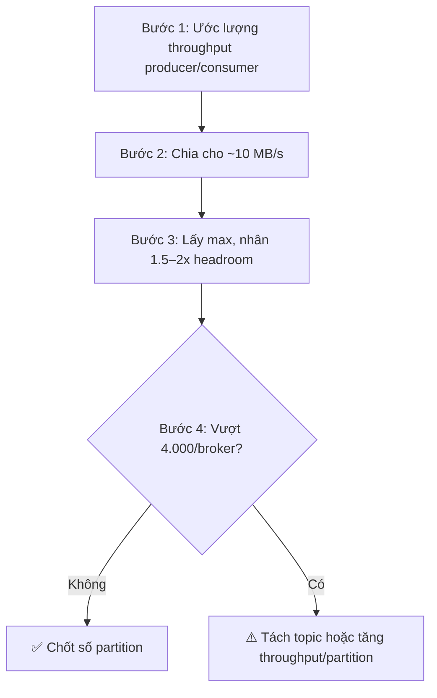

## Mục lục

- [Câu hỏi phỏng vấn](#1-câu-hỏi-phỏng-vấn)
- [Câu trả lời 30 giây](#2-câu-trả-lời-30-giây)
- [Bắt đầu từ: Partition là gì và tại sao nó giúp tăng tốc](#3-bắt-đầu-từ-partition-là-gì-và-tại-sao-nó-giúp-tăng-tốc)
- [Tại sao nhiều người nghĩ "càng nhiều càng tốt"](#4-tại-sao-nhiều-người-nghĩ-càng-nhiều-càng-tốt)
- [Chi phí ẩn thứ 1: Metadata phình to](#5-chi-phí-ẩn-thứ-1-metadata-phình-to)
- [Chi phí ẩn thứ 2: File handles — cái bẫy phổ biến nhất](#6-chi-phí-ẩn-thứ-2-file-handles--cái-bẫy-phổ-biến-nhất)
- [Chi phí ẩn thứ 3: Leader election chậm khi broker chết](#7-chi-phí-ẩn-thứ-3-leader-election-chậm-khi-broker-chết)
- [Chi phí ẩn thứ 4: End-to-end latency tăng](#8-chi-phí-ẩn-thứ-4-end-to-end-latency-tăng)
- [Số partition là vĩnh viễn — không giảm được](#9-số-partition-là-vĩnh-viên--không-giảm-được)
- [Công thức tính số partition](#10-công-thức-tính-số-partition)
- [Quy trình 4 bước chọn số partition](#11-quy-trình-4-bước-chọn-số-partition)
- [Tình huống thực tế: Over-partition gây sập Controller](#12-tình-huống-thực-tế-over-partition-gây-sập-controller)
- [Câu hỏi đào sâu](#13-câu-hỏi-đào-sâu)
- [Tóm tắt — Cheat sheet & 3 nguyên tắc](#14-tóm-tắt--cheat-sheet--3-nguyên-tắc)

---

## 1. Câu hỏi phỏng vấn

> *"Em nghe nói Kafka scale bằng partition, nên khi thiết kế topic mới `user-events` em quyết định tạo sẵn **200 partitions** để 'có chỗ mà scale'. Anh thấy sao? Partition càng nhiều thì throughput càng cao đúng không?"*

Câu hỏi này kiểm tra một điều: bạn có hiểu partition **vừa là đơn vị song song, vừa là đơn vị chi phí** hay không. Nhiều người chỉ nhìn thấy mặt trước (thêm partition → thêm song song → nhanh hơn) mà bỏ qua mặt sau (mỗi partition đều có giá phải trả).

> [!IMPORTANT]
> Partition cho phép throughput cao hơn, nhưng **mỗi partition đều có chi phí**: metadata, file handle, memory, replication overhead, và làm chậm leader election. Nguyên tắc đúng là **"vừa đủ cho throughput dự kiến, cộng một biên độ an toàn"** — không phải "càng nhiều càng tốt".

---

## 2. Câu trả lời 30 giây

> Partition là đơn vị song song: thêm partition → thêm consumer chạy đồng thời → throughput cao hơn. Nhưng mỗi partition không miễn phí — Kafka phải giữ metadata, mở file handle cho mỗi partition và mỗi replica, mỗi partition có leader election riêng, và replication tạo thêm traffic. Quá nhiều partition làm **controller chậm**, **end-to-end latency tăng**, và đặc biệt là **không giảm được** sau khi tạo.
>
> Nguyên tắc: ước lượng throughput cần → tính số partition tối thiểu → chừa dư khoảng 1.5–2x cho headroom. Production nên giữ tổng partition **dưới ~4000 partition/broker** và **dưới ~20.000 partition/cluster**.

---

## 3. Bắt đầu từ: Partition là gì và tại sao nó giúp tăng tốc

Trước khi nói "tại sao nhiều lại hại", phải hiểu rõ "tại sao nhiều lại tốt". Giả sử bạn có topic `orders` với **1 partition**:

```
Topic: orders — 1 partition

Producer ──▶ [ Partition 0 ] ──▶ Consumer 1
            (tất cả message)
```

Vấn đề: chỉ có **đúng 1 consumer** được đọc partition này (quy tắc Kafka: 1 partition → tối đa 1 consumer trong group). Dù bạn có 10 máy chủ, vẫn chỉ 1 máy làm việc. Producer ghi nhanh đến đâu, consumer xử lý kịp đến đó — nếu consumer chậm hơn producer, message chất đống.

Bây giờ tăng lên **3 partition**:

```
Topic: orders — 3 partitions

Producer ──┬─▶ [ Partition 0 ] ──▶ Consumer 1
           ├─▶ [ Partition 1 ] ──▶ Consumer 2
           └─▶ [ Partition 2 ] ──▶ Consumer 3
```

Bây giờ **3 consumer chạy song song**, mỗi cái xử lý 1/3 traffic. Throughput tổng **tăng 3 lần**. Đây chính là lý do người ta nói "thêm partition → nhanh hơn".

> [!NOTE]
> Đây là phần **đúng** của "càng nhiều càng tốt": **cho đến khi số partition = số consumer**, thêm partition thật sự tăng throughput. Vượt qua điểm đó, thêm partition chỉ mang lại chi phí mà không có lợi.

---

## 4. Tại sao nhiều người nghĩ "càng nhiều càng tốt"

Có 3 lý do khiến suy nghĩ này phổ biến:

**Lý do 1 — Đúng ở giai đoạn đầu.** Khi đi từ 1 lên 3, lên 6, lên 12 partition, throughput thật sự tăng. Ai lần đầu thấy điều này sẽ kết luận "thêm = tốt".

**Lý do 2 — Sợ "thiếu".** Vì Kafka **không cho giảm partition** sau khi tạo (sẽ giải thích ở mục 9), nhiều người chọn "lấy dư cho chắc" — tạo 100, 200 partition để sau này có chỗ scale.

**Lý do 3 — Không nhìn thấy chi phí ẩn.** Chi phí của partition không hiện ra ngay lập tức. Topic 50 partition chạy ngon lành vài tháng, đến khi cluster lớn hơn, broker chết một cái, mới thấy hậu quả.

Cái bẫy nằm ở: chi phí **tích lũy tuyến tính** theo số partition, nhưng lợi ích **chạm trần** khi đã đủ consumer. Biểu đồ quan hệ:

```
Throughput        Chi phí (metadata, file handle, election)
    ↑                          ↑
    │        ┌──── trần         │                          ╱
    │       ╱                   │                        ╱
    │      ╱                    │                      ╱
    │    ╱                      │                    ╱
    │  ╱                        │                  ╱
    │╱                          │                ╱
    └────────────▶ #partition   └────────────▶ #partition

  → Lợi ích chạm trần         → Chi phí tăng không ngừng
     khi đủ consumer             theo số partition
```

5 mục tiếp theo sẽ mổ xẻ từng loại chi phí ẩn, để bạn thấy "thêm 1 partition thì cái gì tăng theo".

---

## 5. Chi phí ẩn thứ 1: Metadata phình to

Kafka có một bộ phận gọi là **Controller** — một broker đặc biệt chịu trách nhiệm "biết mọi thứ" về cluster: topic nào có bao nhiêu partition, mỗi partition có leader là broker nào, ISR (bản sao đồng bộ) gồm những broker nào.

Mỗi partition thêm vào = Controller phải **thêm một bộ metadata mới** và **theo dõi nó liên tục**:

```
Mỗi partition, Controller phải lưu:
  • Leader hiện tại là broker nào
  • Danh sách replicas (vd RF=3 → 3 broker)
  • Danh sách ISR (replicas đã đồng bộ)
  • Trạng thái: Online / Offline / Under-replicated
```

Khi số partition **nhỏ** (vài trăm), Controller xử lý trong chớp mắt. Khi số partition **lớn** (vài chục nghìn), metadata trở thành gánh nặng:

| Số partition (toàn cluster) | Hậu quả lên Controller |
|------------------------------|------------------------|
| < 1.000 | Không đáng kể |
| 1.000 – 10.000 | Vẫn OK, cần giám sát |
| 10.000 – 50.000 | Controller chậm khi có sự cố |
| > 100.000 | Cần KRaft (thay ZooKeeper), tuning kỹ |

Hậu quả thực tế: khi một broker chết, Controller phải **elect lại leader cho mọi partition** nằm trên broker đó. 1.000 partition → xong trong vài giây. 10.000 partition → có thể vài chục giây, trong khi đó **toàn bộ những partition đó không đọc ghi được**.

> [!TIP]
> Đây là lý do số partition ảnh hưởng trực tiếp đến **thời gian phục hồi** khi broker chết — chi tiết ở mục 7.

---

## 6. Chi phí ẩn thứ 2: File handles — cái bẫy phổ biến nhất

Mỗi partition trên broker không phải là "một thứ" — nó là **nhiều file vật lý**. Kafka chia partition thành các **segment** (mỗi segment ~1GB), và mỗi segment tạo ra 3 file:

```
Partition 0 trên broker, gồm 2 segment:
├── 00000000000000000000.log         ← dữ liệu message
├── 00000000000000000000.index       ← index offset → vị trí byte
├── 00000000000000000000.timeindex   ← index theo timestamp
├── 00000000000000001000.log
├── 00000000000000001000.index
└── 00000000000000001000.timeindex
```

Mỗi file mở = **1 file handle**. Hệ điều hành giới hạn số file handle mỗi process (thường `ulimit -n` = 1024 mặc định, hoặc 65536 nếu đã tune).

Tính thử một bài toán cụ thể:

```
Giả sử:
  • Cluster 3 broker, RF=3
  • 1.000 partition
  • Mỗi partition có 2 segment

Mỗi broker chứa: 1.000 partition × 3 file/segment × 2 segment = 6.000 file handle
→ Vượt xa ulimit mặc định 1.024 → broker crash với lỗi:
   "Too many open files"
```

Đây là lỗi **rất phổ biến** khi người mới tạo quá nhiều partition mà không tune `ulimit`. Bài toán này càng tệ khi:

- Topic có retention dài → nhiều segment tích lũy
- Nhiều topic, mỗi topic nhiều partition
- RF cao (mỗi partition có nhiều bản sao = nhiều file handle trên nhiều broker)

> [!CAUTION]
> Nếu bắt buộc dùng nhiều partition, **luôn đặt `ulimit -n` cao** (≥ 100.000) cho user chạy Kafka. Đây là cấu hình bắt buộc trong production, không phải tùy chọn.

---

## 7. Chi phí ẩn thứ 3: Leader election chậm khi broker chết

Mỗi partition có **1 leader** (broker nhận đọc/ghi) và **N-1 follower** (bản sao). Khi leader chết, Kafka phải **bầu chọn** một follower lên làm leader mới — quá trình này gọi là **leader election**.

Quan trọng: **mỗi partition có election riêng**. Khi broker chết, **tất cả partition** mà broker đó làm leader đều phải elect lại **cùng lúc**:

```
Broker 3 chết — nó là leader của 3.000 partition:
   ┌─────────────────────────────────────────────┐
   │ Election partition 1  → chọn follower A     │
   │ Election partition 2  → chọn follower B     │
   │ Election partition 3  → chọn follower C     │
   │ ...                                         │
   │ Election partition 3000 → chọn follower Z   │
   └─────────────────────────────────────────────┘
   → 3.000 election đồng thời → Controller quá tải
   → Trong lúc election, 3.000 partition này KHÔNG đọc ghi được
```

| Số partition phải elect lại | Thời gian phục hồi điển hình |
|------------------------------|------------------------------|
| 100 | < 5 giây |
| 1.000 | ~10–20 giây |
| 5.000 | ~30–60 giây |
| 10.000+ | Vài phút (có thể gây cascading failure) |

Đây là mối liên hệ trực tiếp: **partition càng nhiều → broker chết càng lâu phục hồi → downtime càng dài**. Một cluster 50.000 partition có thể "đứng" vài phút khi một broker chết — đó là vài phút **toàn cluster không đọc ghi được** (vì Controller bị bão hòa).

> [!IMPORTANT]
> Đây là chi phí nguy hiểm nhất, vì nó **chỉ xuất hiện khi có sự cố**. Bình thường chạy ngon, đến lúc broker chết mới thấy — và lúc đó đã muộn.

---

## 8. Chi phí ẩn thứ 4: End-to-end latency tăng

Một tác động ít người để ý: thêm partition thường **tăng latency từng message** (thời gian từ lúc produce đến lúc consume xong), dù throughput tổng cao hơn.

Lý do nằm ở cách Producer gửi message. Kafka không gửi từng message ngay — nó **gom thành batch** để tối ưu network:

```
Producer có 2 chế độ gửi:
  • Gửi ngay khi batch đầy (batch.size)         → hiệu quả
  • Gửi khi hết thời gian chờ (linger.ms)      → fallback
```

Khi **ít partition**, message tập trung vào vài partition → batch đầy nhanh → gửi ngay → **latency thấp**:

```
Topic 2 partition, 1.000 msg/s:
   P0: nhận 500 msg/s → batch đầy sau 5ms → gửi ngay
   P1: nhận 500 msg/s → batch đầy sau 5ms → gửi ngay
   → latency mỗi msg ~5ms
```

Khi **nhiều partition**, message rải đều ra → mỗi partition nhận ít → batch chậm đầy → phải đợi `linger.ms` hết hạn:

```
Topic 200 partition, 1.000 msg/s:
   mỗi partition chỉ nhận 5 msg/s
   → batch chậm đầy (cần 100 msg mới đầy)
   → phải đợi linger.ms (vd 50ms) hết hạn mới gửi
   → latency mỗi msg ~50ms (gấp 10 lần!)
```

| # Partition | Traffic/phân ngành | Batch đầy sau | Latency TB |
|-------------|--------------------|---------------|------------|
| 2 | 500 msg/s mỗi P | ~5 ms | Thấp |
| 20 | 50 msg/s mỗi P | ~20 ms | Trung bình |
| 200 | 5 msg/s mỗi P | ~50 ms (chờ linger.ms) | Cao |

> [!NOTE]
> Hiện tượng này rõ nhất ở **tải thấp**. Khi traffic cao (10.000 msg/s), batch đầy nhanh dù chia nhiều partition. Nhưng ở tải thấp, "càng nhiều partition" lại khiến mỗi message **chậm hơn** — điều ngược lại với直觉.

---

## 9. Số partition là vĩnh viễn — không giảm được

Đây là lý do quan trọng nhất để **không** "tạo cho chắc". Vòng đời số partition:

```
Tạo topic với 6 partition
     │
     ▼
Cần thêm throughput → ALTER topic tăng lên 12 partition   ✅ CHO PHÉP
     │
     ▼
Traffic giảm, muốn giảm xuống 6 partition?
     │
     ▼
❌ KHÔNG THỂ. Kafka không hỗ trợ giảm partition.
     │
     ▼
Cách duy nhất: tạo topic mới (ít partition hơn)
              → migrate data sang
              → đổi producer/consumer trỏ sang topic mới
              → xóa topic cũ
   → rất đắt, có downtime logic
```

### Tại sao không giảm được?

Vì partition được quyết định bởi công thức:

```
partition = hash(key) % num_partitions
```

Giảm số partition làm **toàn bộ key đổi partition**:

```
Với 6 partition:   hash("user-123") % 6 = 2  → partition 2
Với 3 partition:   hash("user-123") % 3 = 2  → có thể là partition khác!
```

Nếu giảm partition, mọi message cũ (đã nằm ở partition 2) và message mới của cùng key `user-123` có thể nằm khác partition → **thứ tự bị phá vỡ**. Vì Kafka cam kết thứ tự **chỉ trong 1 partition**, việc giảm partition sẽ vi phạm cam kết này → Kafka **cấm** giảm partition.

> [!CAUTION]
> Hệ quả thực tế: nếu bạn tạo 200 partition "cho chắc" rồi thấy thừa, bạn phải **sống với 200 partition đó mãi mãi** (cùng toàn bộ chi phí ở các mục 5–8), hoặc trả giá migrate sang topic mới. "Tạo cho chắc" không phải miễn phí — nó là một khoản nợ vĩnh viễn.

---

## 10. Công thức tính số partition

Thay vì "cảm giác an toàn", hãy tính theo **throughput thực tế**.

### Công thức

```
số_partition ≥ max(
    throughput_producer_tổng / throughput_mỗi_partition,
    throughput_consumer_tổng / throughput_mỗi_partition
)
```

### Ví dụ tính cụ thể

Giả sử topic `orders` có:
- Producer ghi tổng **100 MB/s**
- Consumer xử lý tổng **60 MB/s** (nếu không bắt kịp, sẽ sinh lag)
- Một partition chịu được khoảng **10 MB/s** (rule of thumb)

```
Cần cho producer:  100 / 10 = 10 partition (để producer không bị bottleneck)
Cần cho consumer:   60 / 10 =  6 partition (để consumer bắt kịp)
→ max(10, 6) = 10 partition tối thiểu
→ thêm headroom 1.5–2x: 10 × 2 = 20 partition
```

> [!TIP]
> Con số "10 MB/s mỗi partition" chỉ là rule of thumb — phụ thuộc phần cứng, message size, replication factor. Thực tế nên **đo** trên môi trường của bạn. Nhưng dùng 10 MB/s làm điểm khởi đầu là an toàn cho đa số cấu hình.

### Rule of thumb theo quy mô

| Quy mô cluster | Số partition tối đa khuyến nghị |
|----------------|---------------------------------|
| Dev/Test | Không quan trọng |
| Production nhỏ (< 5 broker) | ~vài nghìn/cluster |
| Production lớn (10+ broker) | ~4.000/broker, < 20.000/cluster |
| LinkedIn-scale | 100.000+ (cần KRaft + tuning rất kỹ) |

---

## 11. Quy trình 4 bước chọn số partition



**Bước 1 — Ước lượng throughput.** Đây là bước khó nhất. Nếu không có số liệu, hãy ước lượng保守 từ dữ liệu lịch sử hoặc nghiệp vụ (vd: "5.000 order/giờ, mỗi order ~2KB = ~10KB/s" — con số thấp hơn bạn nghĩ).

**Bước 2 — Chia cho throughput mỗi partition.** Dùng 10 MB/s làm điểm khởi đầu.

**Bước 3 — Thêm headroom.** Luôn chừa 1.5–2x phòng trường hợp traffic tăng đột biến. Không bao giờ tạo đúng bằng số tối thiểu — bạn sẽ phải tăng lại (và tăng partition phá ordering, xem mục 9).

**Bước 4 — Kiểm tra ngưỡng an toàn.** Nếu số partition trên mỗi broker > 4.000, cân nhắc tách thành nhiều topic hoặc tối ưu lại.

> [!IMPORTANT]
> Đa số topic thực tế chỉ cần **6–12 partition**. Topic cần 50+ partition đã là throughput rất cao. Topic cần 200+ là trường hợp đặc biệt, phải tính kỹ.

---

## 12. Tình huống thực tế: Over-partition gây sập Controller

### Bối cảnh

Một team xây hệ thống event-sourcing cho 50 microservice. Vì sợ "sau này scale không kịp", mỗi microservice tạo **5–10 topic, mỗi topic 50–100 partition**. Tổng cộng: **~25.000 partition** trên cluster 6 broker (trung bình ~4.000 partition/broker), dùng ZooKeeper.

Mọi thứ chạy ngon lành 2 tháng đầu — vì bình thường không có sự cố gì.

### Sự cố

Một ngày, **Broker 3 crash** (lỗi đĩa). Theo lý thuyết, cluster có RF=3, mất 1 broker không nên gây downtime. Nhưng thực tế:

```
Broker 3 là leader của khoảng 4.000 partition (1/6 tổng số)
     │
     ▼
Controller phải elect lại leader cho 4.000 partition CÙNG LÚC
     │
     ▼
Mỗi election = 1 write metadata vào ZooKeeper
     │
     ▼
ZooKeeper trở thành bottleneck (4.000 write đồng thời)
     │
     ▼
Controller "đứng" vài phút trong lúc metadata cập nhật
     │
     ▼
Trong lúc đó: 4.000 partition không đọc ghi được
Producer/Consumer timeout → cascading failure
     │
     ▼
Tổng downtime: ~5 phút TOÀN CLUSTER
```

### Phân tích: tại sao chỉ mất 1 broker mà sập cả cluster?

| Yếu tố | Bình thường | Khi sự cố |
|--------|-------------|-----------|
| Số partition/broker | 4.000 (OK) | 4.000 phải elect lại (quá tải) |
| Controller | Rảnh | Bão hòa 4.000 election |
| ZooKeeper | Rảnh | 4.000 write đồng thời → nghẽn |
| Partition không đọc ghi được | 0 | 4.000 trong vài phút |

Nếu cluster chỉ có 1.000 partition tổng, Broker 3 chứa ~170 partition → election xong trong vài giây → không ai nhận ra có sự cố.

### Cách fix đúng gốc

**Ngắn hạn:**
- Giảm số partition (không được → phải migrate, đắt)
- Nâng cấp lên KRaft (thay ZooKeeper) → Controller chịu tải metadata tốt hơn nhiều

**Dài hạn:**
- Khôi phục topic thiết kế đúng: gộp các topic nhỏ, tính lại số partition theo công thức mục 10
- Giám sát số partition/broker, alert khi vượt ngưỡng
- Không bao giờ "tạo cho chắc" nữa

> [!WARNING]
> Bài học: over-partition là một khoản nợ kỹ thuật **âm thầm**. Nó không gây sự cố khi mọi thứ yên bình — chỉ lộ mặt khi broker chết, và lúc đó đã quá muộn. Chi phí thực sự của "200 partition cho chắc" là **5 phút downtime khi bạn cần HA nhất**.

---

## 13. Câu hỏi đào sâu

> **"Vậy bao giờ mới thật sự cần nhiều partition?"**
> Khi throughput rất cao (GB/s) và cần hàng chục/hàng trăm consumer song song. Lúc đó số partition lớn là **điều kiện cần**, không phải lỗi. Nhưng vẫn phải tính headroom cẩn thận, không "tạo gấp 10 lần cho chắc".

> **"Nếu tăng partition, ordering bị ảnh hưởng không?"**
> Có. Tăng partition làm `hash(key) % num_partitions` đổi với **toàn bộ key** → message cũ và mới của cùng key có thể nằm khác partition → ordering per-key bị phá. Chỉ tăng partition khi có thể chấp nhận điều đó, hoặc khi topic chưa có data.

> **"Có cách nào giảm partition mà không tạo topic mới?"**
> Không. Cách duy nhất: tạo topic mới (ít partition hơn) → dùng MirrorMaker/console-consumer migrate data → chuyển producer/consumer sang topic mới → xóa topic cũ. Phức tạp và có downtime logic.

> **"Topic compact có bị ảnh hưởng bởi số partition không?"**
> Có — log compaction chạy **per partition**. Nhiều partition = nhiều luồng compaction = CPU/IO cao hơn, và compaction chậm hơn nếu mỗi partition quá nhỏ.

---

## 14. Tóm tắt — Cheat sheet & 3 nguyên tắc

### Cheat sheet

```
╔═══════════════════════════════════════════════════════════════╗
║  Partition = đơn vị song song, NHƯNG cũng = đơn vị chi phí    ║
║  ───────────────────────────────────────────────────────────  ║
║  Thêm partition GIÚP khi:                                     ║
║   • số consumer < số partition (còn headroom scale)           ║
║  Thêm partition HẠI khi:                                      ║
║   • đã đủ consumer • metadata phình • latency tăng            ║
║   • không giảm được sau khi tạo                               ║
║  ───────────────────────────────────────────────────────────  ║
║  Công thức:                                                   ║
║   partition = ceil(max_throughput / ~10MB/s) × 1.5–2 headroom ║
║  Ngưỡng an toàn: < 4.000 partition/broker, < 20.000/cluster   ║
║  Broker fail: recovery time ∝ số partition phải elect lại     ║
╚═══════════════════════════════════════════════════════════════╝
```

### 3 nguyên tắc áp dụng ngay

> [!IMPORTANT]
> **1. Tính theo throughput, không theo "cảm giác an toàn".**
> Đừng tạo 100 partition "cho chắc". Tính throughput producer/consumer, chia cho ~10 MB/s mỗi partition, rồi nhân 1.5–2x. Đa số topic chỉ cần 6–12 partition.
>
> **2. Partition là vĩnh viễn — không giảm được.**
> Tạo dư một chút là được, đừng tạo gấp 10 lần. "Tạo cho chắc" là bẫy vì sau này không quay đầu, và mỗi partition thừa đều là chi phí vĩnh viễn.
>
> **3. Luôn đặt `ulimit` cao và theo dõi under-replicated partitions.**
> Nếu bắt buộc dùng nhiều partition: đặt `ulimit -n ≥ 100.000`, monitor under-replicated partitions, và cân nhắc KRaft thay ZooKeeper để Controller chịu tải metadata tốt hơn.

### Quote cuối

> Partition là **đơn vị song song**, nhưng cũng là **đơn vị nợ**. Mỗi partition bạn tạo là một khoản nợ metadata, file handle và election overhead mà bạn sẽ trả mỗi lần broker fail — và không bao giờ được xóa. Thiết kế topic đúng nghĩa là tính toán kỹ, không phải "lấy dư cho chắc".

<Cards>
  <Card title="Topics và Partitions" href="/core-concepts/topics-partitions/" description="Cấu trúc topic, partition, vì sao partition là đơn vị song song và chỉ tăng được không giảm" />
  <Card title="Partitioning Strategy" href="/core-concepts/partitioning-strategy/" description="Message keys, hot partitions, vì sao hash(key) quyết định partition" />
  <Card title="Consumer Groups" href="/core-concepts/consumer-groups/" description="Quy tắc partition-consumer mapping, vì sao số consumer bị chặn bởi số partition" />
</Cards>
