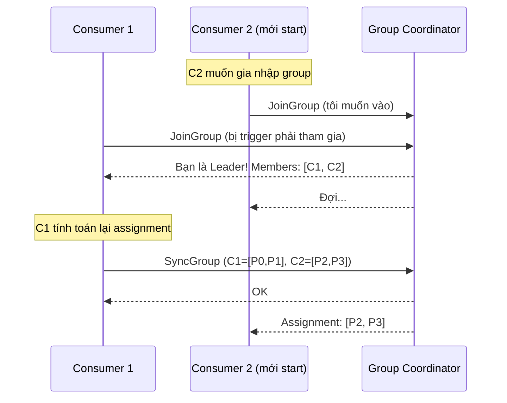
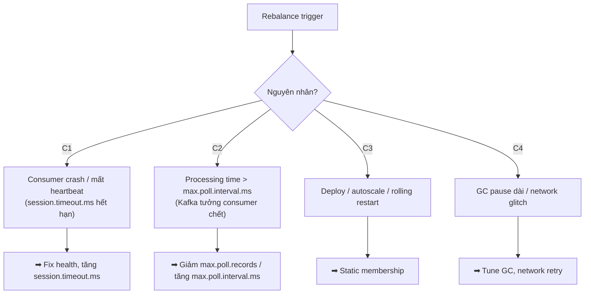

## Mục lục

- [Câu hỏi phỏng vấn](#1-câu-hỏi-phỏng-vấn)
- [Câu trả lời 30 giây](#2-câu-trả-lời-30-giây)
- [Bắt đầu từ: Rebalance là gì và khi nào xảy ra](#3-bắt-đầu-từ-rebalance-là-gì-và-khi-nào-xảy-ra)
- [Stop-the-world — gốc rễ của hiện tượng 'đứng'](#4-stop-the-world--gốc-rễ-của-hiện-tượng-đứng)
- [Vì sao eager protocol phải dừng toàn bộ](#5-vì-sao-eager-protocol-phải-dừng-toàn-bộ)
- [Khoảng dead time điển hình của mỗi lần rebalance](#6-khoảng-dead-time-điển-hình-của-mỗi-lần-rebalance)
- [4 Nguyên nhân trigger rebalance liên tục](#7-4-nguyên-nhân-trigger-rebalance-liên-tục)
- [Giải pháp 1: Static Membership — restart không trigger rebalance](#8-giải-pháp-1-static-membership--restart-không-trigger-rebalance)
- [Giải pháp 2: Cooperative Rebalance Protocol](#9-giải-pháp-2-cooperative-rebalance-protocol)
- [Tình huống thực tế: Rebalance storm do library bug](#10-tình-huống-thực-tế-rebalance-storm-do-library-bug)
- [Câu hỏi đào sâu](#11-câu-hỏi-đào-sâu)
- [Tóm tắt — Cheat sheet & 3 nguyên tắc](#12-tóm-tắt--cheat-sheet--3-nguyên-tắc)

---

## 1. Câu hỏi phỏng vấn

> *"Mỗi lần em deploy bản mới (rolling restart), hoặc đơn giản là có một consumer instance crash rồi tự restart, **toàn bộ consumer group 'đứng' không xử lý gì trong khoảng 30–60 giây**. Stack trace không có gì, log chỉ thấy 'Rebalance started'. Vì sao rebalance lại đình chỉ toàn bộ group? Có cách nào tránh không?"*

Câu hỏi này kiểm tra một điều: bạn có hiểu rebalance dùng **eager protocol** (stop-the-world) theo mặc định, và biết cách giảm thiểu bằng **static membership** + **cooperative protocol**.

> [!IMPORTANT]
> Mặc định Kafka dùng **eager rebalance**: khi một thành viên rời/gia nhập, **toàn bộ** consumer trong group **thu hồi hết partition, dừng xử lý, chờ phân lại**. Đó là "stop-the-world". Mỗi lần rebalance = một khoảng dead time. Nếu rebalance xảy ra thường xuyên (deploy, autoscale, GC pause), group gần như không xử lý được gì → hệ quả là lag tăng, SLA vi phạm.

---

## 2. Câu trả lời 30 giây

> Rebalance mặc định dùng **eager protocol**: mọi consumer **tạm dừng xử lý**, **commit offset**, **thu hồi toàn bộ partition**, rồi chờ leader phân lại — nên cả group "đứng" trong khi đó. Rebalance xảy ra khi: consumer join/leave/crash, subscription thay đổi. Nguyên nhân phổ biến gây rebalance liên tục: **processing time > `max.poll.interval.ms`** (Kafka tưởng consumer chết), **GC pause dài**, **deploy/autoscale**.
>
> Giảm thiểu bằng: (1) **Static Membership** (`group.instance.id`) — consumer rời không lập tức trigger rebalance, partition được giữ `session.timeout.ms`; (2) **Cooperative protocol** — chỉ di chuyển partition cần đổi, các partition khác **không dừng**; (3) cân `max.poll.records` × processing time < `max.poll.interval.ms` để không bị đẩy ra do "chậm poll".

---

## 3. Bắt đầu từ: Rebalance là gì và khi nào xảy ra

Trước khi nói "vì sao rebalance làm đứng", phải hiểu rebalance là gì và khi nào xảy ra.

**Rebalance** là quá trình Kafka **phân lại partition cho các consumer** trong group. Nó cần thiết trong 3 trường hợp:

```
1. Consumer mới GIA NHẬP group (scale up)
   → phải chia lại partition để consumer mới có việc

2. Consumer RỜI ĐI (graceful shutdown hoặc crash)
   → partition của nó phải được gán cho consumer khác

3. Topic metadata THAY ĐỔI (thêm partition)
   → phải phân lại để tận dụng partition mới
```

### Giao thức rebalance 3 bước

Khi một trong 3 trường hợp trên xảy ra, Kafka thực hiện 3 bước:



**Bước 1 — JoinGroup:** Tất cả consumer gửi "tôi muốn tham gia". Coordinator (một broker) chọn ra một consumer làm **Leader** (thường là consumer đầu tiên).

**Bước 2 — Tính assignment:** Leader consumer **tính toán** partition assignment (ai nhận partition nào), dựa trên strategy (Range, RoundRobin, Sticky...).

**Bước 3 — SyncGroup:** Leader gửi assignment lên Coordinator, Coordinator broadcast kết quả cho tất cả members. Mỗi consumer nhận "bạn được gán partition X, Y".

> [!NOTE]
> Trong suốt 3 bước này, **không consumer nào được phép xử lý message** — tất cả đang chờ phân lại partition. Đây chính là "stop-the-world", sẽ phân tích chi tiết ở mục 4–6.

---

## 4. Stop-the-world — gốc rễ của hiện tượng 'đứng'

### Hiện tượng

Khi rebalance trigger, **toàn bộ consumer trong group đồng loạt dừng xử lý**. Hình dung timeline:

```
Trước rebalance:
   C1 đang xử lý P0, P1   (đang xử lý message thứ 50)
   C2 đang xử lý P2, P3   (đang xử lý message thứ 80)

   T0: C3 mới start → rebalance trigger
   ─────────────────────────────────────
   T1: Coordinator yêu cầu tất cả "revoke partition"
   T2: ─── STOP-THE-WORLD ───
       C1 phải dừng xử lý P0, P1 (commit offset, buông tay)
       C2 phải dừng xử lý P2, P3 (commit offset, buông tay)
       C3 chưa có gì
       → KHÔNG AI xử lý gì trong khoảng này!
   ─────────────────────────────────────
   T3: C1 (Leader) tính assignment mới: C1=[P0], C2=[P1], C3=[P2,P3]
   T4: Coordinator broadcast, mọi consumer nhận assignment
   T5: Mỗi consumer "seek" về committed offset, bắt đầu poll lại
   ─────────────────────────────────────
   T6: ─── XỬ LÝ TIẾP ───
```

Trong khoảng T2–T5, **không một message nào được xử lý**. Đó là "đứng".

### Vì sao phải dừng tất cả?

Vì lý do **an toàn**: nếu không dừng, có nguy cơ **hai consumer cùng đọc một partition** — vi phạm quy tắc bất di bất dịch "1 partition → tối đa 1 consumer trong group". Để tránh race condition này, eager protocol chọn phương án **an toàn tuyệt đối**: thu hồi hết, rồi chia lại từ đầu.

> [!IMPORTANT]
> "Stop-the-world" không phải bug — nó là **lựa chọn thiết kế** của eager protocol. Đổi lại sự an toàn (không bao giờ có 2 consumer cùng partition) bằng giá "đứng toàn group mỗi lần rebalance". Mục 9 sẽ trình bày cooperative protocol — một thiết kế khác không phải trả giá này.

---

## 5. Vì sao eager protocol phải dừng toàn bộ

Để hiểu sâu hơn, hãy so sánh hai cách tiếp cận:

**Eager protocol (mặc định) — "thu hồi hết rồi chia lại":**
- Bước 1: Mọi consumer **revoke (buông tay)** toàn bộ partition
- Bước 2: Chờ tất cả ack "tôi đã buông"
- Bước 3: Leader tính assignment mới
- Bước 4: Mọi consumer **assign (nhận)** partition mới

```
Eager:    C1 buông P0,P1 ─┐
          C2 buông P2,P3 ─┤ ← khoảng dead time (không ai xử lý)
          C3 (chưa có)    ─┘
          → chia lại: C1=[P0], C2=[P1], C3=[P2,P3]
```

Vấn đề: ngay cả khi partition **không đổi chủ** (vd P0 vẫn thuộc C1), C1 vẫn phải buông rồi nhận lại → vẫn dừng xử lý trong lúc đó.

**Cooperative protocol — "chỉ di chuyển partition cần đổi":**
- Bước 1: Leader tính assignment mới, xác định **partition nào cần đổi chủ**
- Bước 2: Chỉ revoke những partition cần chuyển
- Bước 3: Assign cho consumer mới

```
Cooperative: C3 mới join
   C1 vẫn giữ P0, P1 (không dừng!)
   C2 vẫn giữ P2 (không dừng!)
   → chỉ C2 revoke P3 (partition cần chuyển)
   → C3 nhận P3
   → dead time chỉ cho P3, các partition khác liên tục
```

> [!TIP]
> Sự khác biệt là **phạm vi dừng**: eager dừng toàn bộ, cooperative chỉ dừng những partition thực sự đổi chủ. Khi cluster lớn (nhiều partition), sự khác biệt này rất lớn — eager phải revoke toàn bộ, cooperative chỉ revoke vài cái.

---

## 6. Khoảng dead time điển hình của mỗi lần rebalance

Một lần rebalance (eager) không kết thúc trong chớp mắt — nó gồm nhiều giai đoạn, mỗi giai đoạn tốn thời gian:

| Giai đoạn | Việc cần làm | Thời gian điển hình |
|-----------|--------------|---------------------|
| Phát hiện rebalance | Coordinator gửi JoinGroup request | 1–5 giây |
| Chờ tất cả members JoinGroup | Đợi mọi consumer ack | 5–20 giây |
| Tính assignment + SyncGroup | Leader tính + broadcast | < 1 giây |
| Re-seek + khởi động lại consumer | Mỗi consumer seek về offset | 1–5 giây |
| **Tổng dead time** | | **~10–60 giây mỗi lần** |

### Khi nào "đứng" trở thành thảm họa?

Một lần rebalance 30 giây là chấp nhận được (vd deploy 1 lần/tuần). Nhưng nếu rebalance xảy ra **liên tục** — gọi là **rebalance storm** — thì group gần như không xử lý được gì:

```
Rebalance storm (mỗi 1 phút rebalance 1 lần):
   phút 0:   rebalance → đứng 30s → xử lý 30s
   phút 1:   rebalance → đứng 30s → xử lý 30s
   phút 2:   rebalance → đứng 30s → xử lý 30s
   ...

   → throughput thực tế = 50% lý thuyết
   → lag tăng đều
   → nếu processing time dài, mỗi cycle processing chưa xong đã rebalance tiếp
```

> [!WARNING]
> Rebalance storm là một trong những nguyên nhân gây lag tăng đột biến khó chẩn đoán nhất. Bề ngoài consumer có vẻ "đang chạy" (CPU hoạt động), nhưng thực ra nó liên tục buông tay rồi nhận lại partition mà không xử lý được bao nhiêu message.

---

## 7. 4 Nguyên nhân trigger rebalance liên tục



### Chi tiết từng nguyên nhân

| Nguyên nhân | Cơ chế | Dấu hiệu trong log |
|-------------|--------|-------------------|
| **Processing > `max.poll.interval.ms`** | Consumer xử lý chậm, không kịp poll → Kafka tưởng chết | `member has failed with ... max.poll.interval` |
| **`session.timeout.ms` quá nhỏ** | Heartbeat không kịp gửi → Kafka tưởng chết | `member ... has expired` |
| **Deploy / rolling restart** | Consumer rời group (LeaveGroup) → rebalance | Trùng lúc deploy |
| **GC pause dài** | Consumer "đứng" trong lúc GC → miss heartbeat | GC log có pause > `session.timeout.ms` |

### Nguyên nhân nguy hiểm nhất: processing time > max.poll.interval.ms

Đây là nguyên nhân số một gây rebalance storm. Consumer **có vẻ đang chạy** (CPU bận xử lý), nhưng vì xử lý quá lâu, không kịp gọi `poll()` → Kafka tưởng consumer chết → trigger rebalance → consumer xử lý xong gọi poll → "tôi không còn partition" → join lại → rebalance tiếp.

```
Vòng lặp xấu:
   poll() → xử lý chậm → vượt max.poll.interval → rebalance
   → partition bị thu hồi → consumer xử lý xong → poll() không có gì
   → re-join → lại poll() → lại xử lý chậm → ...
```

Giải pháp: giảm `max.poll.records` (batch nhỏ hơn → xử lý xong nhanh hơn) hoặc tăng `max.poll.interval.ms` (cho phép batch lớn hơn). Ưu tiên cái đầu.

---

## 8. Giải pháp 1: Static Membership — restart không trigger rebalance

### Vấn đề mà static membership giải quyết

Khi consumer restart (deploy, autoscale), nó gửi `LeaveGroup` → trigger rebalance. Nếu deploy 10 pod theo kiểu rolling restart = 10 lần rebalance = 10 lần "đứng".

### Cách hoạt động

Static membership gán cho mỗi consumer một **ID cố định** (`group.instance.id`). Khi consumer rời group (restart), Kafka **không lập tức rebalance** — nó giữ nguyên partition assignment cho ID đó trong `session.timeout.ms`. Nếu consumer restart lại (với cùng ID) trong khoảng thời gian đó, nó **claim lại đúng partition cũ** → không rebalance.

```
KHÔNG dùng static membership:
   C1 restart → LeaveGroup → rebalance ngay → C1, C2, C3 đều dừng
   (dead time ~30s mỗi lần deploy)

DÙNG static membership (group.instance.id = "pod-1"):
   C1 (pod-1) restart → không gửi LeaveGroup, chỉ mất heartbeat
   Kafka giữ assignment cho pod-1 trong session.timeout.ms (vd 5 phút)
   C1 (pod-1) up lại → claim lại P0,P1 → KHÔNG REBALANCE
   (dead time = 0 nếu restart xong < session.timeout.ms)
```

### Cấu hình

```yaml
spring:
  kafka:
    consumer:
      properties:
        # Mỗi pod/instance dùng ID cố định (vd từ hostname/downward API)
        group.instance.id: "${HOSTNAME}"
        # Cho phép consumer restart trong khoảng này mà không trigger rebalance
        session.timeout.ms: 300000    # 5 phút — đủ cho restart
```

### Ví dụ Kubernetes

Dùng downward API truyền pod name làm `group.instance.id`:

```yaml
spec:
  containers:
    - name: order-service
      env:
        - name: HOSTNAME
          valueFrom:
            fieldRef:
              fieldPath: metadata.name
```

Mỗi pod có tên cố định (`order-service-7b8f-xyz`), dùng làm `group.instance.id` → restart pod không gây rebalance.

> [!TIP]
> Static membership rất hiệu quả cho **deploy/autoscale** — restart pod không gây rebalance nữa. Nhưng cần đảm bảo ID **duy nhất** trong group; nếu 2 pod dùng cùng `group.instance.id` → conflict.

---

## 9. Giải pháp 2: Cooperative Rebalance Protocol

### Vấn đề mà cooperative protocol giải quyết

Eager protocol "thu hồi tất cả rồi chia lại" — dừng toàn bộ. Cooperative protocol **chỉ di chuyển những partition cần đổi**, các partition khác **tiếp tục xử lý không gián đoạn**.

### So sánh eager vs cooperative

```
Tình huống: C3 mới join group (C1 đang giữ P0,P1; C2 đang giữ P2,P3)

EAGER (mặc định):
   C1 revoke P0,P1  ─┐
   C2 revoke P2,P3  ─┤ STOP toàn bộ (dead time dài)
   C3 (chưa có gì)  ─┘
   → chia lại từ đầu: C1=[P0], C2=[P1,P2], C3=[P3]

COOPERATIVE:
   C1 vẫn xử lý P0,P1 (không dừng!)
   C2 vẫn xử lý P2 (không dừng!)
   → chỉ C2 revoke P3 (partition cần chuyển)
   → C3 nhận P3
   → dead time chỉ cho P3, các partition khác liên tục
```

### Cấu hình

```yaml
spring:
  kafka:
    consumer:
      properties:
        partition.assignment.strategy: org.apache.kafka.clients.consumer.CooperativeStickyAssignor
```

### So sánh hiệu quả

| Khía cạnh | Eager | Cooperative |
|-----------|-------|-------------|
| Phạm vi dừng | Toàn bộ partition | Chỉ partition đổi chủ |
| Dead time khi C3 join | ~30 giây (cả group đứng) | ~1 giây (chỉ P3) |
| Yêu cầu | Mặc định | Tất cả consumer dùng cùng strategy |
| Phù hợp | Cluster nhỏ, rebalance hiếm | Production, rebalance thường xuyên |

> [!IMPORTANT]
> Cooperative protocol **giảm đáng kể dead time** khi rebalance. Đặc biệt hiệu quả khi cluster lớn (nhiều partition) — eager phải revoke toàn bộ, cooperative chỉ revoke vài cái. Đây là lựa chọn mặc định cho production từ Kafka 2.4+.

---

## 10. Tình huống thực tế: Rebalance storm do library bug

### Bối cảnh

Service consume topic `events` (12 partition, 4 consumer pod). Bình thường ổn. Đột nhiên một tuần, **mỗi 5–10 phút toàn bộ group đứng ~40 giây**, lag tăng vọt rồi giảm, lặp lại.

### Chẩn đoán sai lầm ban đầu

Team phản ứng theo thứ tự sai:

**Phản ứng 1 — "Kafka bị nghẽn":** tăng `session.timeout.ms`, restart cluster → không đỡ.

**Phản ứng 2 — "GC pause":** check GC log, không thấy pause dài.

**Phản ứng 3 — "Traffic spike":** check produce rate, đều đặn, không có spike.

### Tìm ra gốc rễ

Xem log consumer chi tiết, mỗi 5 phút thấy:

```
[Consumer clientId=consumer-1] Joining group...
[Consumer clientId=consumer-1] JoinGroup failed: member ... has failed
[Consumer clientId=consumer-1] Revoke partition: events-0, events-1, ...
```

→ Rebalance liên tục. Nhưng **không có consumer nào thực sự restart**. Vậy ai rời group?

### Sự thật

Một thư viện **third-party** (liveness probe handler) gọi `KafkaConsumer.close()` mỗi 5 phút "để kiểm tra health", rồi mở lại. Mỗi lần close → gửi `LeaveGroup` → **trigger rebalance toàn group**.

```
Hành vi sai:  liveness check → close() consumer → reopen
              → mỗi 5 phút 1 rebalance → group đứng 40s

Hành vi đúng: liveness check → chỉ kiểm tra connection/heartbeat
              → KHÔNG close consumer đang chạy
```

### Fix

```
Fix ngắn hạn:
   ✅ Gỡ bỏ close() trong health check
   ✅ Bật cooperative protocol (giảm dead time nếu rebalance vẫn xảy ra)

Fix dài hạn:
   ✅ Health check chỉ query AdminClient.describeCluster()
     không đụng vào consumer instance đang chạy
   ✅ Alert khi số rebalance / giờ > ngưỡng
   ✅ Dùng static membership để nhỏ giọt consumer không gây rebalance
```

> [!WARNING]
> Bài học: **rebalance liên tục thường do ứng dụng, không phải Kafka**. Bất kỳ thứ gì gọi `consumer.close()`, `unsubscribe()`, hoặc làm processing vượt `max.poll.interval.ms` đều trigger rebalance. Khi thấy rebalance storm, đầu tiên xem log "ai gọi close?" và "processing có vượt max.poll.interval.ms không" — thường tìm ra thủ phạm nhanh.

---

## 11. Câu hỏi đào sâu

> **"Vì sao Kafka không 'chuyển giao mềm' partition từ consumer này sang consumer kia?"**
> Có — đó chính là **cooperative protocol** (mục 9). Eager protocol cũ chọn "thu hồi hết rồi chia lại" vì đơn giản và an toàn (không bao giờ có 2 consumer cùng partition). Cooperative protocol phức tạp hơn nhưng giảm dead time. Trade-off là cần tất cả consumer trong group dùng cùng strategy.

> **"Static membership có nhược điểm gì?"**
> Có. Khi consumer rời group, partition của nó **không được gán cho ai** trong suốt `session.timeout.ms` → nếu consumer thực sự chết (không quay lại), partition đó **không được xử lý** cho tới khi timeout. Phải cân `session.timeout.ms`: đủ dài để restart, đủ ngắn để failover khi crash thật.

> **"Rebalance có gây duplicate message không?"**
> Có thể. Khi consumer bị đẩy ra giữa chừng, nó đã xử lý một số message nhưng **chưa kịp commit** → consumer mới nhận partition đó sẽ **reprocess** từ committed offset cũ. Đây là lý do consumer cần **idempotent**. Xem [Idempotency](/producers-consumers/idempotency/).

> **"Dùng nhiều consumer group khác nhau có giảm rebalance không?"**
> Có một phần: rebalance trong group A không ảnh hưởng group B. Nhưng mỗi group vẫn có rebalance riêng. Tách group phù hợp cho **các use case độc lập** (order-service vs analytics), không phải để "giảm rebalance".

---

## 12. Tóm tắt — Cheat sheet & 3 nguyên tắc

### Cheat sheet

```
╔═══════════════════════════════════════════════════════════════╗
║  Rebalance (eager) = STOP-THE-WORLD toàn group                  ║
║  ───────────────────────────────────────────────────────────   ║
║  Trigger: crash, leave, join, metadata change                   ║
║  Dead time: ~10–60s mỗi lần                                     ║
║  Storm = rebalance liên tục → group gần như không xử lý          ║
║  ───────────────────────────────────────────────────────────   ║
║  Giảm thiểu:                                                    ║
║   • Static Membership     → restart không trigger rebalance    ║
║   • Cooperative protocol  → chỉ di chuyển partition cần đổi    ║
║   • Cân max.poll.records × proc_time < max.poll.interval.ms    ║
║   • Alert khi rebalance/hour > ngưỡng                          ║
╚═══════════════════════════════════════════════════════════════╝
```

### 3 nguyên tắc áp dụng ngay

> [!IMPORTANT]
> **1. Mặc định là eager = stop-the-world. Bật cooperative ngay từ đầu.**
> Cooperative protocol (Kafka 2.4+) giảm dead time cực kỳ hiệu quả với chi phí cấu hình chỉ 1 dòng. Không có lý do gì dùng eager trong production mới.
>
> **2. Dùng static membership cho môi trường deploy thường xuyên.**
> Kubernetes rolling restart, autoscale — tất cả trigger rebalance. Static membership (`group.instance.id` + `session.timeout.ms` đủ dài) khiến restart "âm thầm", không ảnh hưởng group.
>
> **3. Cân `max.poll.records` với `max.poll.interval.ms`.**
> Nguyên nhân rebalance storm phổ biến nhất: processing chậm → Kafka tưởng consumer chết. Quy tắc: `max.poll.records × worst_case_processing_time < max.poll.interval.ms`. Khi thấy rebalance dày, đầu tiên xem log "max.poll.interval" trước khi đổ lỗi cho Kafka.

### Quote cuối

> Rebalance là **cơ chế an toàn** của Kafka — đảm bảo partition luôn có chủ, consumer luôn được gán. Nhưng eager protocol mặc định chọn **an toàn tuyệt đối** bằng giá "đứng toàn group". Hiểu được cơ chế này, bạn sẽ không còn ngạc nhiên khi deploy thấy lag tăng — và biết rằng static membership + cooperative protocol là cách khiến rebalance "âm thầm" thay vì "đình công".

<Cards>
  <Card title="Consumer Groups" href="/core-concepts/consumer-groups/" description="Rebalancing protocol 3 bước, AckMode và cách tránh rebalance storms" />
  <Card title="Offset Management" href="/core-concepts/offsets/" description="Offset commit, vì sao crash giữa chừng gây reprocess duplicate" />
  <Card title="Idempotency" href="/producers-consumers/idempotency/" description="Vì sao consumer cần idempotent để chịu được rebalance duplicate" />
</Cards>
