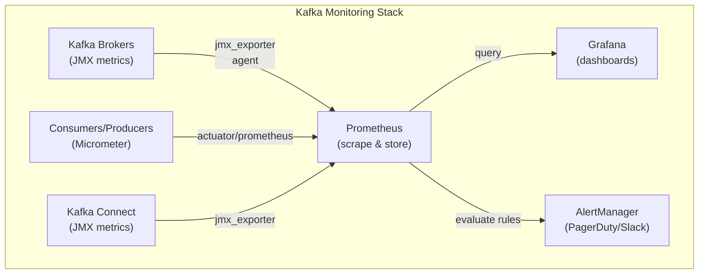

# Monitoring Kafka

## Mục lục

- [Tại sao Monitoring quan trọng?](#tại-sao-monitoring-quan-trọng)
- [Metrics Hierarchy](#metrics-hierarchy)
- [JMX Metrics — Broker Health](#jmx-metrics--broker-health)
- [Consumer Lag — Metric quan trọng nhất](#consumer-lag--metric-quan-trọng-nhất)
- [Producer Metrics](#producer-metrics)
- [Prometheus + Grafana Setup](#prometheus--grafana-setup)
- [Spring Boot Actuator Integration](#spring-boot-actuator-integration)
- [Alerting Rules](#alerting-rules)
- [CLI Commands cho Operations](#cli-commands-cho-operations)
- [Dashboard Checklist](#dashboard-checklist)

---

## Tại sao Monitoring quan trọng?

```
┌─────────────────────────────────────────────────────────────────────────────────┐
│                    KAFKA FAILURE SCENARIOS VÀ DẤU HIỆU                          │
├─────────────────────────────────────────────────────────────────────────────────┤
│                                                                                 │
│  Scenario 1: Consumer bị stuck                                                  │
│  Dấu hiệu: Consumer lag tăng liên tục, processing rate = 0                      │
│  Nguyên nhân thường gặp: Deadlock, OOM, database connection pool exhausted      │
│                                                                                 │
│  Scenario 2: Broker disk đầy                                                    │
│  Dấu hiệu: Produce fails, under-replicated partitions tăng                      │
│  Nguyên nhân: Retention quá cao, traffic spike, disk không đủ                   │
│                                                                                 │
│  Scenario 3: Rebalance storm                                                    │
│  Dấu hiệu: Rebalance frequency tăng, consumer lag spike mỗi rebalance           │
│  Nguyên nhân: Consumer timeout, GC pause, slow processing                       │
│                                                                                 │
│  Scenario 4: Network partition                                                  │
│  Dấu hiệu: Under-replicated partitions, leader election events                  │
│  Nguyên nhân: Network issues giữa brokers                                       │
│                                                                                 │
│  → Tất cả có thể phát hiện SỚM qua metrics!                                     │
└─────────────────────────────────────────────────────────────────────────────────┘
```

---

## Metrics Hierarchy



---

## JMX Metrics — Broker Health

### Critical Broker Metrics

| Metric (JMX) | Prometheus Name | Alert khi | Ý nghĩa |
|-------------|----------------|----------|---------|
| `UnderReplicatedPartitions` | `kafka_server_replicamanager_underreplicatedpartitions` | > 0 | Partitions chưa đủ replicas — risk! |
| `ActiveControllerCount` | `kafka_controller_kafkacontroller_activecontrollercount` | ≠ 1 | Phải luôn = 1 trong cluster |
| `OfflinePartitionsCount` | `kafka_controller_kafkacontroller_offlinepartitionscount` | > 0 | Partitions không có leader! |
| `BytesInPerSec` | `kafka_server_brokertopicmetrics_bytesin_total` | Spike bất thường | Network ingress |
| `MessagesInPerSec` | `kafka_server_brokertopicmetrics_messagesin_total` | Drop đột ngột | Producer issues |
| `NetworkProcessorAvgIdlePercent` | `kafka_network_socketserver_networkprocessoravgidlepercent` | < 0.3 | Network thread bận |
| `RequestHandlerAvgIdlePercent` | `kafka_server_kafkarequesthandlerpool_requesthandleravgidlepercent` | < 0.2 | Request handler bận |

### JMX Exporter Config (Docker)

```yaml
# docker-compose.yml — Kafka với JMX Exporter
kafka:
  image: confluentinc/cp-kafka:7.5.0
  environment:
    KAFKA_JMX_PORT: 9999
    KAFKA_JMX_HOSTNAME: kafka
    EXTRA_ARGS: "-javaagent:/opt/jmx-exporter/jmx_prometheus_javaagent.jar=7071:/opt/jmx-exporter/kafka-broker.yml"
  volumes:
    - ./jmx-exporter:/opt/jmx-exporter
```

```yaml
# kafka-broker.yml — JMX Exporter config
lowercaseOutputName: true
lowercaseOutputLabelNames: true
rules:
  - pattern: kafka.server<type=BrokerTopicMetrics, name=MessagesInPerSec><>OneMinuteRate
    name: kafka_server_brokertopicmetrics_messagesin_rate
    type: GAUGE

  - pattern: kafka.server<type=ReplicaManager, name=UnderReplicatedPartitions><>Value
    name: kafka_server_replicamanager_underreplicatedpartitions
    type: GAUGE

  - pattern: kafka.controller<type=KafkaController, name=ActiveControllerCount><>Value
    name: kafka_controller_kafkacontroller_activecontrollercount
    type: GAUGE

  - pattern: kafka.controller<type=KafkaController, name=OfflinePartitionsCount><>Value
    name: kafka_controller_kafkacontroller_offlinepartitionscount
    type: GAUGE

  - pattern: kafka.log<type=Log, name=Size, topic=(.+), partition=(.+)><>Value
    name: kafka_log_log_size_bytes
    labels:
      topic: "$1"
      partition: "$2"
    type: GAUGE
```

---

## Consumer Lag — Metric quan trọng nhất

**Consumer Lag** = số messages consumer chưa xử lý. Đây là chỉ số health quan trọng nhất.

```
┌─────────────────────────────────────────────────────────────────────────────────┐
│                    CONSUMER LAG INTERPRETATION                                  │
├──────────────────┬──────────────────────────────────────────────────────────────┤
│  LAG             │  MEANING                                                     │
├──────────────────┼──────────────────────────────────────────────────────────────┤
│  0               │  ✅ Perfect — consumer bắt kịp producer                      │
│  1 - 100         │  ✅ Normal fluctuation                                       │
│  100 - 1,000     │  ⚠️  Consumer đang chậm lại — điều tra                       │
│  1,000 - 10,000  │  🚨 Backlog nghiêm trọng — cần scale up                      │
│  > 10,000        │  🔥 Consumer không bắt kịp — urgent!                         │
│  Đang TĂNG       │  🔥 Xu hướng xấu dù lag hiện tại nhỏ                         │
│  Đang GIẢM       │  ✅ Consumer đang catch up                                   │
└──────────────────┴──────────────────────────────────────────────────────────────┘
```

### Xem Consumer Lag via CLI

```bash
# Lag của tất cả groups
kafka-consumer-groups.sh --bootstrap-server localhost:9092 --list

# Lag chi tiết của một group
kafka-consumer-groups.sh --bootstrap-server localhost:9092 \
    --describe --group order-service

# Output:
# GROUP         TOPIC   PARTITION  CURRENT-OFFSET  LOG-END-OFFSET  LAG   CONSUMER-ID
# order-service orders  0          1523            1530            7     consumer-1-xxx
# order-service orders  1          892             900             8     consumer-1-xxx
# order-service orders  2          2105            2105            0     consumer-2-xxx
# order-service orders  3          1800            1800            0     consumer-2-xxx

# Lag của tất cả groups cùng lúc
kafka-consumer-groups.sh --bootstrap-server localhost:9092 \
    --describe --all-groups
```

### Kafka Lag Exporter (Prometheus)

```yaml
# kafka-lag-exporter Docker service
kafka-lag-exporter:
  image: seglo/kafka-lag-exporter:0.8.2
  ports:
    - "8000:8000"
  volumes:
    - ./lag-exporter.conf:/opt/docker/conf/application.conf
```

```hocon
# lag-exporter.conf
kafka-lag-exporter {
  kafka-client-timeout = 10 seconds
  clusters = [
    {
      name = "production-cluster"
      bootstrap-brokers = "kafka:29092"
      consumer-group-whitelist = [".*"]
      topic-whitelist = [".*"]
    }
  ]
  prometheus {
    port = 8000
  }
}
```

**Prometheus metrics từ lag exporter:**

```
# Lag per partition
kafka_consumergroup_group_lag{
  group="order-service",
  topic="orders",
  partition="0"
} 7

# Max lag across all partitions
kafka_consumergroup_group_max_lag{
  group="order-service",
  topic="orders"
} 8

# Lag in time (seconds)
kafka_consumergroup_group_lag_seconds{
  group="order-service",
  topic="orders"
} 0.35
```

---

## Producer Metrics

| Metric | Prometheus Name | Alert khi |
|--------|----------------|----------|
| `record-send-rate` | `kafka_producer_record_send_rate` | Drops đột ngột |
| `record-error-rate` | `kafka_producer_record_error_rate` | > 0 |
| `request-latency-avg` | `kafka_producer_request_latency_avg` | > 500ms |
| `buffer-exhausted-rate` | `kafka_producer_buffer_exhausted_rate` | > 0 (memory full) |
| `batch-size-avg` | `kafka_producer_batch_size_avg` | < batch.size (inefficient) |
| `compression-rate-avg` | `kafka_producer_compression_rate_avg` | Monitor trend |

---

## Prometheus + Grafana Setup

```yaml
# prometheus.yml
global:
  scrape_interval: 15s
  evaluation_interval: 15s

scrape_configs:
  - job_name: 'kafka-brokers'
    static_configs:
      - targets: ['kafka-1:7071', 'kafka-2:7071', 'kafka-3:7071']
    relabel_configs:
      - source_labels: [__address__]
        target_label: broker
        regex: '([^:]+).*'

  - job_name: 'kafka-lag-exporter'
    static_configs:
      - targets: ['kafka-lag-exporter:8000']

  - job_name: 'spring-apps'
    metrics_path: '/actuator/prometheus'
    static_configs:
      - targets:
          - 'order-service:8080'
          - 'payment-service:8080'
          - 'notification-service:8080'
```

### Grafana Dashboard JSON (Key Panels)

```json
{
  "panels": [
    {
      "title": "Consumer Lag per Group",
      "type": "graph",
      "targets": [{
        "expr": "kafka_consumergroup_group_max_lag",
        "legendFormat": "{{group}} - {{topic}}"
      }]
    },
    {
      "title": "Under-Replicated Partitions",
      "type": "stat",
      "targets": [{
        "expr": "sum(kafka_server_replicamanager_underreplicatedpartitions)",
        "legendFormat": "Under-replicated"
      }],
      "thresholds": [
        {"value": 0, "color": "green"},
        {"value": 1, "color": "red"}
      ]
    },
    {
      "title": "Messages In Rate",
      "type": "graph",
      "targets": [{
        "expr": "rate(kafka_server_brokertopicmetrics_messagesin_total[5m])",
        "legendFormat": "{{broker}} - {{topic}}"
      }]
    }
  ]
}
```

---

## Spring Boot Actuator Integration

```yaml
# application.yml
management:
  endpoints:
    web:
      exposure:
        include: health,metrics,prometheus,info
  metrics:
    tags:
      application: ${spring.application.name}
      environment: ${spring.profiles.active}
    enable:
      kafka: true
  endpoint:
    health:
      show-details: always
```

```xml
<!-- pom.xml -->
<dependency>
    <groupId>io.micrometer</groupId>
    <artifactId>micrometer-registry-prometheus</artifactId>
</dependency>
```

**Spring Kafka metrics tự động exposed:**

| Metric | Ý nghĩa |
|--------|---------|
| `kafka.consumer.records.lag` | Lag per partition |
| `kafka.consumer.records.lag.max` | Max lag |
| `kafka.consumer.fetch.manager.records.consumed.rate` | Consume rate |
| `kafka.consumer.coordinator.commit.latency.avg` | Commit latency |
| `kafka.producer.record.send.rate` | Send rate |
| `kafka.producer.record.error.rate` | Error rate |

### Custom Health Indicator

```java
@Component
public class KafkaConsumerLagHealthIndicator implements HealthIndicator {

    private final AdminClient adminClient;
    private final long lagThreshold;

    @Override
    public Health health() {
        try {
            Map<String, ConsumerGroupDescription> groups =
                adminClient.describeConsumerGroups(List.of("order-service"))
                    .describedGroups()
                    .entrySet().stream()
                    .collect(Collectors.toMap(Map.Entry::getKey, e -> {
                        try { return e.getValue().get(); }
                        catch (Exception ex) { throw new RuntimeException(ex); }
                    }));

            // Check if any group is in bad state
            boolean healthy = groups.values().stream()
                .allMatch(g -> g.state() == ConsumerGroupState.STABLE);

            if (healthy) {
                return Health.up()
                    .withDetail("consumerGroups", groups.keySet())
                    .build();
            } else {
                return Health.down()
                    .withDetail("reason", "Consumer group not in STABLE state")
                    .withDetail("groups", groups)
                    .build();
            }
        } catch (Exception e) {
            return Health.down(e).build();
        }
    }
}
```

---

## Alerting Rules

```yaml
# kafka-alerts.yml — Prometheus AlertManager rules
groups:
  - name: kafka-critical
    rules:
      - alert: KafkaUnderReplicatedPartitions
        expr: kafka_server_replicamanager_underreplicatedpartitions > 0
        for: 1m
        labels:
          severity: critical
        annotations:
          summary: "Kafka has {{ $value }} under-replicated partitions"
          description: "Broker {{ $labels.broker }} — data loss risk!"

      - alert: KafkaNoActiveController
        expr: sum(kafka_controller_kafkacontroller_activecontrollercount) != 1
        for: 30s
        labels:
          severity: critical
        annotations:
          summary: "Kafka has {{ $value }} active controllers (expected 1)"

      - alert: KafkaOfflinePartitions
        expr: kafka_controller_kafkacontroller_offlinepartitionscount > 0
        for: 30s
        labels:
          severity: critical
        annotations:
          summary: "{{ $value }} partitions have no leader!"

  - name: kafka-warning
    rules:
      - alert: KafkaConsumerLagHigh
        expr: kafka_consumergroup_group_max_lag > 10000
        for: 5m
        labels:
          severity: warning
        annotations:
          summary: "Consumer group {{ $labels.group }} lag is {{ $value }}"

      - alert: KafkaConsumerLagGrowing
        expr: delta(kafka_consumergroup_group_max_lag[10m]) > 5000
        for: 5m
        labels:
          severity: warning
        annotations:
          summary: "Lag growing for group {{ $labels.group }}"

      - alert: KafkaBrokerDiskUsageHigh
        expr: (1 - node_filesystem_avail_bytes{mountpoint="/kafka"} /
                    node_filesystem_size_bytes{mountpoint="/kafka"}) > 0.8
        for: 5m
        labels:
          severity: warning
        annotations:
          summary: "Kafka broker disk usage > 80%"

      - alert: KafkaProducerErrors
        expr: rate(kafka_producer_record_error_rate[5m]) > 0
        for: 2m
        labels:
          severity: warning
        annotations:
          summary: "Producer errors detected in {{ $labels.application }}"
```

---

## CLI Commands cho Operations

```bash
# ─── Broker Health ──────────────────────────────────────────────────────────
# Xem all brokers
kafka-broker-api-versions.sh --bootstrap-server localhost:9092

# Xem topics với under-replicated info
kafka-topics.sh --bootstrap-server localhost:9092 --describe | grep -i "under"

# ─── Consumer Groups ────────────────────────────────────────────────────────
# Lag của tất cả groups
kafka-consumer-groups.sh --bootstrap-server localhost:9092 \
    --describe --all-groups | sort -k6 -rn | head -20

# Groups trong trạng thái xấu
kafka-consumer-groups.sh --bootstrap-server localhost:9092 \
    --describe --all-groups --state | grep -v "Stable"

# ─── Topic Inspection ───────────────────────────────────────────────────────
# Xem messages mới nhất của topic
kafka-console-consumer.sh --bootstrap-server localhost:9092 \
    --topic orders --from-beginning --max-messages 10

# Xem offset lớn nhất per partition
kafka-run-class.sh kafka.tools.GetOffsetShell \
    --broker-list localhost:9092 --topic orders --time -1

# ─── Disk & Log ─────────────────────────────────────────────────────────────
# Xem kích thước log theo topic
kafka-log-dirs.sh --bootstrap-server localhost:9092 \
    --describe --topic-list orders | python3 -c "
import sys, json
data = json.load(sys.stdin)
for broker in data['brokers']:
    for log in broker['logDirs']:
        for part in log['partitions']:
            print(f\"{part['partition']}: {part['size']} bytes\")
"
```

---

## Dashboard Checklist

```
📊 KAFKA MONITORING DASHBOARD — CHECKLIST

🔴 Critical (Alert immediately):
   [ ] Under-replicated partitions = 0
   [ ] Active controller count = 1
   [ ] Offline partitions = 0
   [ ] Broker disk < 80%

🟡 Warning (Monitor closely):
   [ ] Consumer lag per group (with threshold)
   [ ] Consumer lag trend (increasing?)
   [ ] Producer error rate = 0
   [ ] Request handler idle % > 20%
   [ ] Network processor idle % > 30%

🟢 Informational (Track over time):
   [ ] Messages in/out per second (by topic)
   [ ] Bytes in/out per second (by broker)
   [ ] Consumer lag in seconds
   [ ] Commit rate and latency
   [ ] Rebalance frequency
   [ ] GC pause time (from JVM metrics)
```

<Cards>
  <Card title="Performance Tuning" href="/operations/performance-tuning/" description="Throughput vs Latency config — producer, consumer, broker" />
  <Card title="Security" href="/operations/security/" description="SSL/TLS, SASL, ACL trong Kafka" />
  <Card title="Consumer Lag" href="/core-concepts/offsets/" description="Hiểu sâu về offset và consumer lag" />
</Cards>
