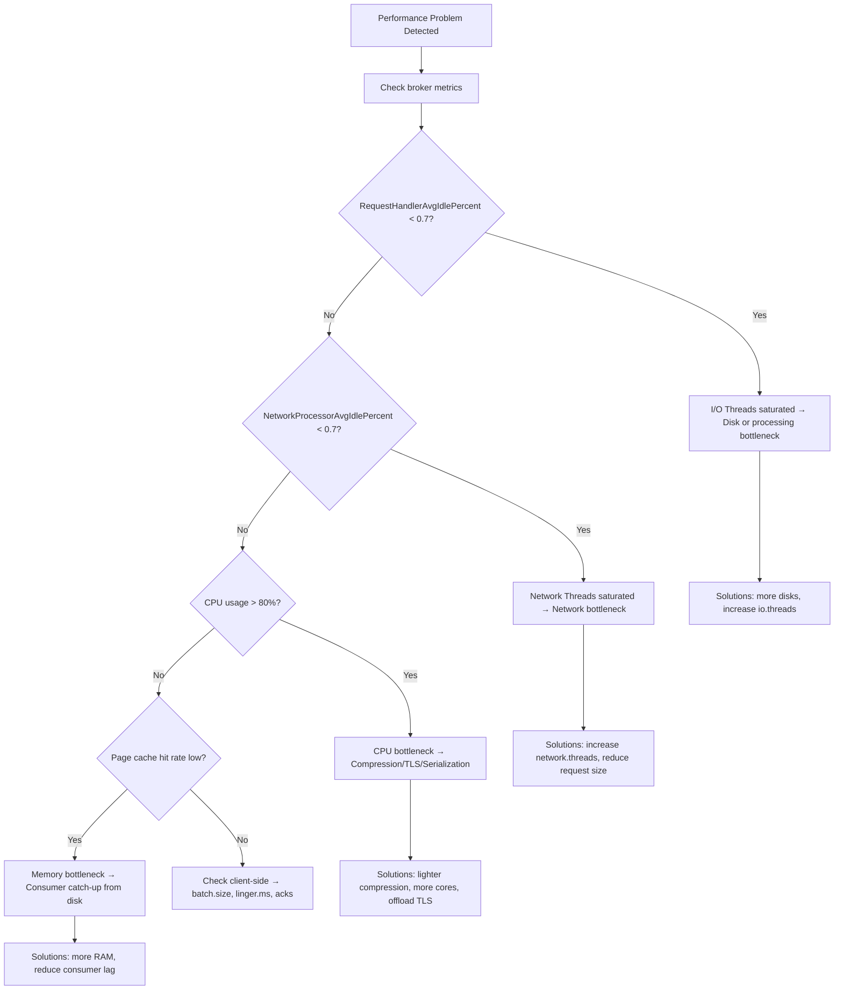

## Mục lục

- [Bối cảnh: Throughput giảm 10x khi lên production](#1-bối-cảnh-throughput-giảm-10x-khi-lên-production)
- [Performance Model — Kafka's 4 pillars](#2-performance-model--kafkas-4-pillars)
- [Bottleneck Diagnosis — Methodology](#3-bottleneck-diagnosis--methodology)
- [Producer Tuning — Throughput vs Latency](#4-producer-tuning--throughput-vs-latency)
- [Consumer Tuning — Parallelism & Processing](#5-consumer-tuning--parallelism--processing)
- [Broker Tuning — Thread pools & Network](#6-broker-tuning--thread-pools--network)
- [OS-Level Tuning — Page Cache & Kernel](#7-os-level-tuning--page-cache--kernel)
- [Disk Configuration — HDD vs SSD, RAID, Scheduler](#8-disk-configuration--hdd-vs-ssd-raid-scheduler)
- [JVM & GC Tuning — G1 vs ZGC](#9-jvm--gc-tuning--g1-vs-zgc)
- [Network Tuning — TCP & NIC](#10-network-tuning--tcp--nic)
- [Compression — Codec selection](#11-compression--codec-selection)
- [Benchmarking — Methodology & Tools](#12-benchmarking--methodology--tools)
- [Real-World Scenarios & Solutions](#13-real-world-scenarios--solutions)
- [Monitoring Dashboard — Key metrics](#14-monitoring-dashboard--key-metrics)
- [Tóm tắt — Tuning Cheat Sheet](#15-tóm-tắt--tuning-cheat-sheet)

---

## 1. Bối cảnh: Throughput giảm 10x khi lên production

Dev environment (3-node cluster, SSD, same AZ):
- Producer throughput: **500 MB/s**
- Consumer throughput: **800 MB/s**
- Produce latency p99: **5ms**

Production (3-node cluster, HDD, cross-AZ, encryption enabled):
- Producer throughput: **50 MB/s** (↓10x!)
- Consumer throughput: **200 MB/s** (↓4x!)
- Produce latency p99: **200ms** (↑40x!)

Root causes:
```
1. Cross-AZ replication: acks=all + 2ms RTT per replica = +4ms per batch
2. HDD random I/O: page cache miss → 8ms seek vs 0.1ms SSD
3. TLS encryption: CPU-bound → saturated at 800MB/s per broker
4. Default configs: linger.ms=0, batch.size=16KB → tiny batches
5. JVM: Default G1 GC with 30GB heap → 200ms GC pauses
```

> [!IMPORTANT]
> Kafka performance phụ thuộc vào **4 pillars**: Disk I/O pattern, Network bandwidth, CPU (compression/encryption), và Memory (page cache). Tuning Kafka = tìm pillar nào bottleneck rồi optimize nó. **Sai lầm lớn nhất**: tune mọi thứ mà không biết bottleneck ở đâu.

---

## 2. Performance Model — Kafka's 4 pillars

```
┌─────────────────────────────────────────────────────────────────────────┐
│                     KAFKA PERFORMANCE MODEL                              │
├─────────────────────────────────────────────────────────────────────────┤
│                                                                         │
│  ┌──────────┐   ┌──────────┐   ┌──────────┐   ┌──────────┐            │
│  │   DISK   │   │ NETWORK  │   │   CPU    │   │  MEMORY  │            │
│  │          │   │          │   │          │   │          │            │
│  │Sequential│   │Bandwidth │   │Compress  │   │PageCache │            │
│  │ I/O only │   │+ Latency │   │Encrypt   │   │ JVM Heap │            │
│  │          │   │          │   │Serialize │   │          │            │
│  └────┬─────┘   └────┬─────┘   └────┬─────┘   └────┬─────┘            │
│       │               │               │               │                 │
│       └───────────────┼───────────────┼───────────────┘                 │
│                       │               │                                 │
│               Throughput = min(Disk, Network, CPU) × PageCacheHitRate    │
│               Latency = Network RTT + DiskLatency + ProcessingTime      │
│                                                                         │
└─────────────────────────────────────────────────────────────────────────┘
```

| Pillar | Bottleneck signals | Tools |
|--------|-------------------|-------|
| **Disk** | High `iowait`, disk utilization 100%, high `request-latency` | `iostat -x 1`, JMX `RequestHandlerAvgIdle` |
| **Network** | NIC saturation, high `NetworkProcessorAvgIdle` drop | `iftop`, `ss -s`, JMX |
| **CPU** | High `sys%`, compression/TLS dominating | `top`, `perf top`, JMX |
| **Memory** | High page faults, consumer catch-up from disk | `vmstat`, `/proc/meminfo` |

---

## 3. Bottleneck Diagnosis — Methodology

### 3.1. Step-by-step diagnosis



### 3.2. Key diagnostic commands

```bash
# Disk I/O
iostat -x 1 5    # r_await, w_await > 10ms = disk slow
                 # %util > 90% = disk saturated

# Network
sar -n DEV 1 5   # rxkB/s, txkB/s vs NIC capacity
ss -s             # TCP retransmissions = network issues

# Memory
free -h           # available > data written last 30min?
cat /proc/meminfo | grep -E "Cached|Dirty|Writeback"

# JVM
jstat -gc <pid> 1000  # GC frequency and pause times
```

---

## 4. Producer Tuning — Throughput vs Latency

### 4.1. Tuning matrix

| Goal | `linger.ms` | `batch.size` | `compression` | `acks` | `buffer.memory` |
|------|------------|-------------|--------------|--------|----------------|
| **Max Throughput** | 100-200 | 512KB-1MB | lz4/zstd | 1 | 128MB |
| **Min Latency** | 0 | 16KB | none | 1 | 32MB |
| **Balanced (recommended)** | 20-50 | 64KB | lz4 | all | 64MB |
| **Max Durability** | 5-20 | 32KB | lz4 | all | 64MB |

### 4.2. Throughput calculation

```
Max Producer Throughput = batch.size × max.in.flight / RTT × Partitions

Ví dụ: batch.size=64KB, max.in.flight=5, RTT=2ms, 6 partitions
  = 64KB × 5 / 2ms × 6 = 960 MB/s (theoretical max)

Thực tế bị giới hạn bởi: min(network_bandwidth, disk_write_speed, CPU_compress)
```

### 4.3. linger.ms tuning

```
Low traffic (100 msg/s, 1KB each):
  linger.ms=0:  100 batches/s, mỗi batch 1KB → 100 requests/s (overhead!)
  linger.ms=50: ~5 batches/s, mỗi batch ~50KB → 5 requests/s (efficient!)
  linger.ms=200: ~1 batch/s, mỗi batch ~100KB → 1 request/s (latency 200ms!)

High traffic (100K msg/s, 1KB each):
  linger.ms=0:  batch.size fills in <1ms → batches đầy tự động!
  linger.ms=50: không khác biệt (batch đầy trước khi linger hết)

Rule: High traffic → linger.ms không quan trọng. Low traffic → linger.ms = throughput lever.
```

---

## 5. Consumer Tuning — Parallelism & Processing

### 5.1. Consumer throughput model

```
Consumer Throughput = Partitions × Processing_Speed_Per_Partition

Bottleneck thường gặp:
  1. Quá ít partitions (max parallelism = partition count)
  2. Processing chậm (DB write, API call per message)
  3. fetch.min.bytes quá nhỏ → nhiều fetch requests
  4. Deserialization chậm (complex schemas)
```

### 5.2. Tuning matrix

| Config | Default | Tuning for Throughput | Tuning for Latency |
|--------|---------|----------------------|--------------------|
| `fetch.min.bytes` | 1 | 64KB-1MB | 1 |
| `fetch.max.wait.ms` | 500 | 500 | 100 |
| `max.poll.records` | 500 | 1000-5000 | 100 |
| `max.partition.fetch.bytes` | 1MB | 4MB | 1MB |
| `fetch.max.bytes` | 50MB | 100MB | 50MB |

### 5.3. Consumer processing patterns

```java
// Pattern A: Sequential processing (simple, ordered)
while (true) {
    ConsumerRecords<K,V> records = consumer.poll(Duration.ofMillis(100));
    for (var record : records) {
        process(record);  // Sequential: 1 record at a time
    }
    consumer.commitSync();
}
// Throughput: limited by processing speed

// Pattern B: Micro-batching (parallel within batch)
while (true) {
    ConsumerRecords<K,V> records = consumer.poll(Duration.ofMillis(100));
    List<CompletableFuture<Void>> futures = new ArrayList<>();
    for (var record : records) {
        futures.add(CompletableFuture.runAsync(() -> process(record), executor));
    }
    CompletableFuture.allOf(futures.toArray(new CompletableFuture[0])).join();
    consumer.commitSync();
}
// Throughput: #threads × single processing speed
// WARNING: ordering NOT guaranteed within partition!

// Pattern C: Pause/resume (backpressure)
while (true) {
    ConsumerRecords<K,V> records = consumer.poll(Duration.ofMillis(100));
    if (processingQueue.size() > THRESHOLD) {
        consumer.pause(consumer.assignment());  // Stop fetching
    } else {
        consumer.resume(consumer.paused());     // Resume
    }
    // Submit to processing queue
}
```

---

## 6. Broker Tuning — Thread pools & Network

### 6.1. Thread pool sizing

| Config | Default | Formula | Notes |
|--------|---------|---------|-------|
| `num.network.threads` | 3 | = #NIC × 2-3 | Socket I/O (NIO) |
| `num.io.threads` | 8 | = #cores × 1-2 | Request processing + disk |
| `num.replica.fetchers` | 1 | 2-4 if replication lagging | Fetch from leaders |
| `num.recovery.threads.per.data.dir` | 1 | = #cores | Startup recovery speed |
| `background.threads` | 10 | OK default | Periodic tasks |

### 6.2. Queue monitoring

```
JMX: kafka.network:type=RequestChannel,name=RequestQueueSize
  → > 0 sustained = I/O threads can't keep up

JMX: kafka.network:type=RequestMetrics,name=RequestsPerSec,request=Produce
  → Baseline: know your normal
  → Spike: producer batching changed or more clients

JMX: kafka.server:type=KafkaRequestHandlerPool,name=RequestHandlerAvgIdlePercent
  → < 0.7 = I/O threads busy > 30% = consider adding
  → < 0.3 = CRITICAL — requests queuing, latency spiking
```

---

## 7. OS-Level Tuning — Page Cache & Kernel

### 7.1. Page Cache — Kafka's performance secret

```bash
# Kafka broker (64GB RAM, 6GB JVM heap):
# Available for page cache: 64 - 6 - 2(OS) ≈ 56GB

# Rule of thumb: page cache should hold last N minutes of writes
# If writing 500MB/s: 56GB / 500MB = ~112 seconds of hot data
# Consumers within 2 min of latest → pure page cache reads!
```

### 7.2. Critical kernel parameters

```bash
# /etc/sysctl.conf — KAFKA-OPTIMIZED

# Dirty page management (khi nào flush dirty pages ra disk)
vm.dirty_background_ratio = 5    # Start background flush at 5% dirty (default 10%)
vm.dirty_ratio = 60              # Start blocking at 60% dirty (default 20%)
# Kafka writes lots of sequential data → tăng dirty_ratio cho phép batch flush lớn hơn

# Virtual memory
vm.swappiness = 1                # Almost never swap (0 = never, risky)
                                 # Kafka: swap = death (latency spike 1000x)

# File system
vm.max_map_count = 262144        # mmap cho index files (mỗi segment = 1 mmap)
                                 # partitions × segments_per_partition × 2-3 files

# Network (see §10)
net.core.wmem_max = 2097152
net.core.rmem_max = 2097152
```

### 7.3. File system choice

| FS | Performance | Recommendation |
|----|-------------|----------------|
| **XFS** | Best sequential write, preallocate | **RECOMMENDED** for Kafka |
| **ext4** | Good, but worse preallocate | OK, but prefer XFS |
| **ZFS** | Overhead from checksumming | Not recommended |
| **Btrfs** | CoW overhead | Not recommended |

```bash
# Mount options for Kafka data dir (XFS):
/dev/sda1 /data/kafka xfs noatime,nodiratime,nobarrier 0 0
#                          ↑ CRITICAL: noatime = no access time update per read
#                            Kafka reads millions of files → atime update = disaster
```

---

## 8. Disk Configuration — HDD vs SSD, RAID, Scheduler

### 8.1. HDD vs SSD for Kafka

| | HDD | SSD | NVMe |
|--|---|---|---|
| Sequential write | 100-200 MB/s | 500-3000 MB/s | 2000-7000 MB/s |
| Sequential read | 100-200 MB/s | 500-3000 MB/s | 2000-7000 MB/s |
| Kafka use case | Budget, throughput OK | Production default | Ultra-low latency |
| Price/TB | $$ | $$$$ | $$$$$ |
| Best for | Write-heavy, large retention | Balanced workload | Latency-sensitive |

### 8.2. RAID configuration

```
RAID-10 (recommended):
  Stripe + Mirror → throughput × N/2, redundancy
  8 disks RAID-10 = 4× single disk throughput

JBOD (Just a Bunch Of Disks):
  Kafka supports multiple log.dirs (1 per disk)
  Pro: max throughput (no RAID overhead), cheaper
  Con: 1 disk fail = partitions on that disk OFFLINE
  → OK with RF=3 (data replicated to other brokers)
  → JBOD + Kafka replication = poor man's RAID with better recovery

RAID-5/6: NOT recommended (write penalty for parity calculation)
```

### 8.3. I/O scheduler

```bash
# For SSD/NVMe:
echo "none" > /sys/block/sda/queue/scheduler    # No scheduling needed (SSD has internal parallelism)

# For HDD:
echo "deadline" > /sys/block/sda/queue/scheduler  # Deadline scheduler (avoid starvation)
```

---

## 9. JVM & GC Tuning — G1 vs ZGC

### 9.1. Heap sizing

```bash
# RULE: Kafka broker heap = 4-6 GB. KHÔNG tăng thêm!
# Lý do: Kafka data bypass JVM heap (page cache + zero-copy)
# Heap chỉ chứa: metadata, request objects, index cache

export KAFKA_HEAP_OPTS="-Xms6g -Xmx6g"
# -Xms = -Xmx: pre-allocate, avoid dynamic resize during operation
```

### 9.2. G1 GC (default, production-proven)

```bash
export KAFKA_JVM_PERFORMANCE_OPTS="
  -XX:+UseG1GC
  -XX:MaxGCPauseMillis=20
  -XX:InitiatingHeapOccupancyPercent=35
  -XX:G1HeapRegionSize=16m
  -XX:MinMetaspaceFreeRatio=50
  -XX:MaxMetaspaceFreeRatio=80
"
# MaxGCPauseMillis=20: target 20ms pause (Kafka can tolerate ~20ms)
# IHOP=35: start concurrent GC earlier (avoid full GC)
```

### 9.3. ZGC (Kafka 3.x+, sub-millisecond pauses)

```bash
export KAFKA_JVM_PERFORMANCE_OPTS="
  -XX:+UseZGC
  -XX:+ZGenerational
"
# ZGC: <1ms GC pauses regardless of heap size
# Trade-off: ~5% throughput overhead vs G1
# Best for: latency-sensitive workloads (p99 < 10ms target)
```

### 9.4. GC comparison for Kafka

| | G1 | ZGC | Shenandoah |
|--|---|---|---|
| Typical pause | 10-50ms | <1ms | <10ms |
| Throughput overhead | Baseline | -3-5% | -5-10% |
| Heap support | 4-32GB | 4-16TB | 4-16TB |
| Maturity (Kafka) | Production-proven | Emerging (3.x+) | Less tested |
| Recommendation | Default choice | Ultra-low latency | Alternative to ZGC |

---

## 10. Network Tuning — TCP & NIC

### 10.1. TCP buffer sizes

```bash
# Increase socket buffers for high-throughput
net.core.wmem_default = 131072
net.core.wmem_max = 2097152
net.core.rmem_default = 131072
net.core.rmem_max = 2097152
net.ipv4.tcp_wmem = 4096 65536 2097152
net.ipv4.tcp_rmem = 4096 65536 2097152

# Kafka broker config (match kernel):
socket.send.buffer.bytes = 1048576    # 1MB (default 100KB)
socket.receive.buffer.bytes = 1048576  # 1MB (default 100KB)
```

### 10.2. Cross-AZ replication impact

```
Same AZ:   RTT ~0.5ms  → acks=all adds ~1ms per produce
Cross-AZ:  RTT ~2-5ms  → acks=all adds ~4-10ms per produce
Cross-Region: RTT ~50ms → acks=all adds ~100ms per produce (DON'T!)

Mitigation for cross-AZ:
  1. Tăng batch.size + linger.ms → amortize RTT over more records
  2. Tăng max.in.flight → overlap network waits
  3. Chấp nhận higher latency nhưng maintain throughput
```

---

## 11. Compression — Codec selection

### 11.1. Benchmark data (1KB messages, 1000 msg/batch)

| Codec | Ratio | Compress (MB/s) | Decompress (MB/s) | CPU | Network saved |
|-------|-------|-----------------|--------------------|----|---------------|
| none | 1.0x | ∞ | ∞ | 0% | 0% |
| **lz4** | 2.5x | 780 | 4000 | 15% | 60% |
| snappy | 2.3x | 580 | 2200 | 12% | 57% |
| **zstd** | 3.8x | 350 | 1400 | 30% | 74% |
| gzip | 3.5x | 90 | 400 | 60% | 71% |

### 11.2. Decision tree

```
Network-bound? → zstd (max compression, save bandwidth)
CPU-bound?    → none or lz4 (minimal CPU cost)
Balanced?     → lz4 (best ratio of compression/speed)
Low traffic?  → doesn't matter (overhead negligible)
```

> [!TIP]
> Compression hiệu quả nhất khi messages **similar** (same schema, same structure). JSON logs compress 3-5x, random binary chỉ 1.1x. Batch lớn hơn = compression ratio tốt hơn (more redundancy to exploit).

---

## 12. Benchmarking — Methodology & Tools

### 12.1. kafka-producer-perf-test

```bash
# Producer throughput test
kafka-producer-perf-test.sh \
  --topic perf-test \
  --num-records 10000000 \
  --record-size 1024 \
  --throughput -1 \         # unlimited (max throughput)
  --producer-props \
    bootstrap.servers=kafka:9092 \
    acks=all \
    linger.ms=20 \
    batch.size=65536 \
    compression.type=lz4

# Output:
# 10000000 records sent, 523456.7 records/sec (512.34 MB/sec),
# 3.2 ms avg latency, 45.0 ms max latency, 2 ms 50th, 5 ms 95th, 12 ms 99th
```

### 12.2. kafka-consumer-perf-test

```bash
# Consumer throughput test
kafka-consumer-perf-test.sh \
  --bootstrap-server kafka:9092 \
  --topic perf-test \
  --messages 10000000 \
  --threads 3

# Output:
# start.time, end.time, data.consumed.in.MB, MB.sec, data.consumed.in.nMsg, nMsg.sec
# 2024-01-15 12:00:00, 2024-01-15 12:00:12, 9765.6, 813.8, 10000000, 833333.3
```

### 12.3. Benchmarking methodology

```
1. Baseline: Measure with default configs
2. Change ONE variable at a time
3. Run each test 3× minimum (warmup + steady state)
4. Monitor ALL 4 pillars simultaneously (disk, network, CPU, memory)
5. Use production-like data (same message size, same key distribution)
6. Test with replication (acks=all) — don't benchmark acks=0 for production decisions
```

---

## 13. Real-World Scenarios & Solutions

| Scenario | Symptom | Root Cause | Solution |
|----------|---------|-----------|----------|
| Latency spike every 30s | p99 jumps 200ms | GC pause (G1, large heap) | Reduce heap to 6GB, tune IHOP=35 |
| Consumer lag growing | Lag increases linearly | Processing > consume rate | Add consumers, increase partitions |
| Broker OOM | Broker crash, OOM in logs | Too many partitions × segments × mmap | Reduce partitions, increase `log.segment.bytes` |
| Disk full | Broker reject writes | Retention too long + high throughput | Reduce retention, add disks |
| Cross-AZ slow | acks=all latency 50ms | AZ RTT + replication | Increase batch.size, accept latency |
| TLS throughput drop | 50% throughput loss with SSL | CPU-bound encryption | Enable hardware AES-NI, add cores |

---

## 14. Monitoring Dashboard — Key metrics

### 14.1. Broker health

| Metric | Healthy | Warning | Critical |
|--------|---------|---------|----------|
| RequestHandlerAvgIdlePercent | >0.7 | 0.5-0.7 | <0.3 |
| NetworkProcessorAvgIdlePercent | >0.7 | 0.5-0.7 | <0.3 |
| UnderReplicatedPartitions | 0 | 1-5 | >5 |
| IsrShrinkRate | 0 | occasional | sustained |
| LogFlushRateAndTimeMs (99th) | <10ms | 10-100ms | >100ms |
| RequestQueueSize | 0 | 1-10 | >10 |

### 14.2. Producer health

| Metric | Healthy | Warning | Critical |
|--------|---------|---------|----------|
| record-error-rate | 0 | >0 | sustained >0 |
| request-latency-avg | <10ms | 10-100ms | >100ms |
| batch-size-avg | >10KB | 1-10KB | <1KB |
| buffer-available-bytes | >80% | 50-80% | <20% |
| waiting-threads | 0 | >0 | sustained >0 |

---

## 15. Tóm tắt — Tuning Cheat Sheet

```
DIAGNOSIS FLOW:
  1. Identify bottleneck: Disk? Network? CPU? Memory?
  2. Measure baseline with perf-test tools
  3. Change ONE variable, measure again
  4. Iterate

PRODUCER TUNING (95% of cases):
  linger.ms=20-50, batch.size=64KB, compression=lz4, acks=all
  → Covers balanced throughput + durability

CONSUMER TUNING (key lever):
  Parallelism = partitions. Processing slow? → async, micro-batch, or more instances

BROKER TUNING:
  JVM: 4-6GB heap, G1 (or ZGC for <1ms pause)
  Threads: io.threads = 2×cores, network.threads = cores
  OS: vm.swappiness=1, noatime, XFS, deadline/none scheduler

5 NGUYÊN TẮC:
1. Tìm bottleneck TRƯỚC khi tune — đừng tune mù
2. Kafka heap = 4-6GB — tặng RAM cho OS page cache
3. linger.ms + batch.size quan trọng nhất ở producer
4. Partitions = parallelism ceiling — chọn đủ từ đầu
5. Benchmark với production-like conditions (acks=all, replication, compression)
```
