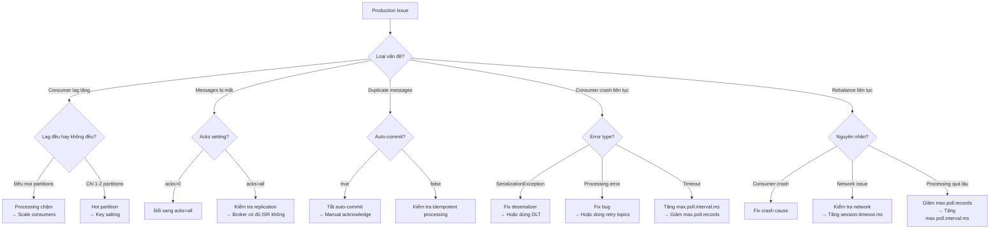

# Production Checklist

## Mục lục

- [Producer Checklist](#producer-checklist)
- [Consumer Checklist](#consumer-checklist)
- [Topic Design Best Practices](#topic-design-best-practices)
- [Testing Checklist](#testing-checklist)
- [Monitoring & Alerting](#monitoring--alerting)
- [Operations Readiness](#operations-readiness)
- [Common Production Issues](#common-production-issues)
- [Go-Live Checklist](#go-live-checklist)

---

## Producer Checklist

### Configuration — Dev vs Production

| Setting | Dev | Production | Tại sao |
|---------|-----|-----------|---------|
| `acks` | `1` | **`all`** | Đảm bảo tất cả ISR replicas nhận message |
| `enable.idempotence` | `false` | **`true`** | Ngăn duplicate sends khi retry |
| `retries` | `3` | **`2147483647`** | Retry đến khi `delivery.timeout.ms` |
| `max.in.flight.requests.per.connection` | `5` | **`5`** | (với idempotence) Giữ ordering |
| `compression.type` | `none` | **`lz4`** hoặc `snappy` | Giảm network/storage |
| `linger.ms` | `0` | **`5-20`** | Gom batch → tăng throughput |
| `batch.size` | `16384` | **`32768`+** | Batch lớn hơn → throughput cao hơn |
| `buffer.memory` | `33554432` | **`67108864`+** | 64MB+ buffer |
| `delivery.timeout.ms` | `120000` | **`120000`** | 2 phút delivery timeout |

### Configuration YAML — Production

```yaml
spring:
  kafka:
    producer:
      key-serializer: org.apache.kafka.common.serialization.StringSerializer
      value-serializer: org.springframework.kafka.support.serializer.JsonSerializer
      acks: all
      retries: 2147483647
      batch-size: 32768
      linger-ms: 10
      compression-type: lz4
      buffer-memory: 67108864
      properties:
        enable.idempotence: true
        max.in.flight.requests.per.connection: 5
        delivery.timeout.ms: 120000
```

### Code Checklist

```
[ ] Mọi send() đều có callback hoặc synchronous get()
[ ] Callback xử lý cả success VÀ failure
[ ] Không fire-and-forget cho critical messages
[ ] Key được chọn có chủ đích (ordering vs load balance)
[ ] Retry logic ở application level (nếu cần)
[ ] Error logging có đủ context (topic, key, offset)
```

---

## Consumer Checklist

### Configuration — Dev vs Production

| Setting | Dev | Production | Tại sao |
|---------|-----|-----------|---------|
| `enable.auto.commit` | `true` | **`false`** | Kiểm soát khi commit offset |
| `max.poll.records` | `500` | **`100-500`** | Tune theo processing time |
| `max.poll.interval.ms` | `300000` | **Theo workload** | Tránh rebalance không cần thiết |
| `session.timeout.ms` | `45000` | **`30000-60000`** | Balance detection vs stability |
| `heartbeat.interval.ms` | `3000` | **`1/3 session.timeout`** | Đủ heartbeat |
| `isolation.level` | `read_uncommitted` | **`read_committed`** | Nếu dùng transactions |
| `auto.offset.reset` | `earliest` | **Theo use case** | earliest hoặc latest |

### Configuration YAML — Production

```yaml
spring:
  kafka:
    consumer:
      group-id: ${spring.application.name}
      auto-offset-reset: earliest
      enable-auto-commit: false
      max-poll-records: 200
      key-deserializer: org.apache.kafka.common.serialization.StringDeserializer
      value-deserializer: org.springframework.kafka.support.serializer.JsonDeserializer
      properties:
        spring.json.trusted.packages: "com.example.events"
        max.poll.interval.ms: 300000
        session.timeout.ms: 45000
        heartbeat.interval.ms: 15000
        isolation.level: read_committed
```

### Code Checklist

```
[ ] Manual acknowledge sau khi xử lý thành công
[ ] Idempotent processing (UPSERT, dedup table, hoặc idempotency key)
[ ] Error handler configured (DefaultErrorHandler + DLT)
[ ] @DltHandler implement cho poison pill messages
[ ] Retry topics configured cho transient errors
[ ] Processing time < max.poll.interval.ms
[ ] Log足够 context khi xử lý fail (message, offset, exception)
```

---

## Topic Design Best Practices

| Aspect | Khuyến nghị | Lý do |
|--------|-----------|-------|
| **Partition Count** | Bắt đầu 6-12, có thể tăng sau | Không thể giảm partitions |
| **Replication Factor** | **3** cho production | Chịu được 2 broker failures |
| **Retention** | 7 ngày mặc định, điều chỉnh theo use case | Balance storage vs replay |
| **Naming Convention** | `{domain}.{entity}.{event}` | Ví dụ: `orders.purchase.created` |
| **Compaction** | Bật cho "current state" topics | Changelog, config topics |
| **Compression** | `lz4` hoặc `snappy` ở topic level | Giảm storage + network |
| **Cleanup Policy** | `delete` mặc định, `compact` cho state | Theo use case |

### Naming Convention Examples

```
✅ Tốt:
  orders.purchase.created
  orders.payment.completed
  users.profile.updated
  inventory.stock.adjusted

❌ Tệ:
  orders
  events
  data
  my-topic
```

### Partition Count Formula

```
partitions = max(
    target_throughput / throughput_per_partition,
    max_consumer_count
)
```

```
Ví dụ:
  Target: 100,000 msg/s
  Throughput per partition: ~10,000 msg/s
  Max consumers: 6 instances × 2 threads = 12

  → partitions = max(100000/10000, 12) = max(10, 12) = 12
```

> [!CAUTION]
> **Không thể giảm partition count sau khi tạo!** Hãy plan kỹ từ đầu. Nên chọn số partition cao hơn dự kiến một chút.

---

## Testing Checklist

```
[ ] Integration tests với @EmbeddedKafka
[ ] Test producer + consumer end-to-end
[ ] Test error handling (bad message → DLT)
[ ] Test retry mechanism (transient error → retry → success)
[ ] Test manual acknowledge (crash → message redelivered)
[ ] Test với JSON serialization
[ ] Test idempotent processing (send same message 2 lần)
[ ] Test consumer rebalance (start/stop consumer instances)
[ ] Chaos testing: kill broker, kill consumer
[ ] Test message ordering (gửi cùng key → verify order)
[ ] Load test với realistic data volume
[ ] Load test với realistic data skew (hot keys)
```

---

## Monitoring & Alerting

### Metrics bắt buộc

```
[ ] Consumer lag per partition
[ ] Consumer lag per consumer group
[ ] Producer send success/failure rate
[ ] Producer send latency (p50, p95, p99)
[ ] Broker disk usage
[ ] Under-replicated partitions
[ ] Offline partitions
[ ] Bytes in/out rate per broker
[ ] Active controller count
[ ] Request latency per broker
```

### Alert Rules bắt buộc

| Metric | Warning | Critical | Action |
|--------|---------|----------|--------|
| Consumer lag | > 1000 | > 10000 | Scale consumers, check processing |
| Under-replicated partitions | > 0 | > 1 | Check broker health, disk |
| Offline partitions | > 0 | > 0 | Urgent — data unavailable |
| Broker disk usage | > 70% | > 85% | Add disk, clean up |
| Producer error rate | > 1% | > 5% | Check broker connectivity |
| Consumer session timeout | > 3/min | > 10/min | Check processing time, network |
| Controller count | ≠ 1 | ≠ 1 | ZooKeeper/KRaft issue |

### Dashboard Panels bắt buộc

```
[ ] Consumer lag graph (per group, per partition)
[ ] Messages in/out rate
[ ] Bytes in/out rate
[ ] Producer success/failure
[ ] Broker health (disk, CPU, memory)
[ ] Replication status
[ ] Active connections
```

> [!TIP]
> Xem chi tiết setup Prometheus + Grafana tại [Monitoring Kafka](/operations/monitoring/).

---

## Operations Readiness

### Runbooks bắt buộc

```
[ ] Runbook: Reset consumer offsets
[ ] Runbook: Scale consumer group (thêm/giảm instances)
[ ] Runbook: Xử lý consumer lag lớn
[ ] Runbook: Xử lý rebalance storm
[ ] Runbook: Thêm partition vào topic
[ ] Runbook: Thay đổi retention policy
[ ] Runbook: Recover từ broker failure
[ ] Runbook: DLT processing procedure
[ ] Runbook: Backup và restore (nếu cần)
```

### Disaster Recovery

```
[ ] Nắm rõ RPO (Recovery Point Objective) cho từng topic
[ ] Nắm rõ RTO (Recovery Time Objective) cho từng service
[ ] Đã test failover scenario (broker down, network partition)
[ ] Có rollback plan cho version cũ
[ ] Có plan migrate data nếu cần chuyển cluster
```

### Documentation

```
[ ] Topic catalog (topic name, partitions, RF, owner, description)
[ ] Schema documentation (Avro/Protobuf/JSON)
[ ] Consumer group documentation (group.id, service, topics)
[ ] Producer documentation (service, topics, key strategy)
[ ] Architecture diagram (data flow giữa services)
```

---

## Common Production Issues

| Issue | Symptoms | Root Cause | Solution |
|-------|----------|-----------|----------|
| **Consumer lag tăng liên tục** | Lag metrics tăng dần, không giảm | Processing chậm hoặc producer đẩy nhanh | Scale consumers, tối ưu processing, thêm partitions |
| **Rebalance storm** | Frequent rebalances, processing gián đoạn | `max.poll.interval.ms` quá nhỏ hoặc consumer crash liên tục | Tăng timeout, fix crash cause, giảm processing time |
| **Duplicate messages** | Cùng message được xử lý 2 lần | Auto-commit + crash trước khi xử lý xong | Tắt auto-commit, manual ack, idempotent processing |
| **Lost messages** | Messages bị skip | `acks=0` hoặc consumer offset commit trước khi xử lý xong | Dùng `acks=all`, tắt auto-commit |
| **Hot partition** | Lag không đều giữa partitions | Key distribution không đều | Key salting, custom partitioner, separate topics |
| **Consumer không nhận message** | Không có log, lag = 0 | `auto.offset.reset=latest` + group mới | Dùng `earliest` hoặc reset offset manually |
| **Serialization error** | Consumer crash với `SerializationException` | Message format không match deserializer | Fix serializer/deserializer config, dùng DLT |
| **Out of memory** | Broker hoặc consumer OOM | Batch size quá lớn, messages quá lớn | Giảm `max.poll.records`, giảm `batch.size`, tăng heap |
| **Broker disk full** | Broker không write được | Retention quá dài hoặc throughput cao | Giảm retention, thêm disk, thêm brokers |

### Decision Flowchart cho Debugging



---

## Go-Live Checklist

```
GOING TO PRODUCTION:
====================

🔧 Configuration
  [ ] acks=all cho critical producers
  [ ] Idempotence enabled (enable.idempotence=true)
  [ ] Auto-commit disabled cho consumers
  [ ] Retry topics configured (@RetryableTopic)
  [ ] DLT handler implemented (@DltHandler)
  [ ] spring.json.trusted.packages set specific packages
  [ ] group.id không hardcode (dùng spring.application.name)

📊 Monitoring
  [ ] Consumer lag alerting (Prometheus/Grafana)
  [ ] Producer send failure alerting
  [ ] Broker disk space monitoring
  [ ] Under-replicated partitions alerting
  [ ] Offline partitions alerting
  [ ] Dashboard setup với các panels cần thiết

🔄 Operations
  [ ] Runbooks written và reviewed
  [ ] DLT processing procedure
  [ ] Disaster recovery plan tested
  [ ] Team được train về Kafka operations

🧪 Testing
  [ ] Integration tests pass
  [ ] Chaos testing (broker failure) pass
  [ ] Consumer restart behavior verified
  [ ] Message ordering verified
  [ ] Duplicate handling tested
  [ ] Load test passed với realistic data

📚 Documentation
  [ ] Topic catalog documented
  [ ] Schema documented
  [ ] Consumer group documented
  [ ] Architecture diagram updated
```

<Cards>
  <Card title="Monitoring" href="/operations/monitoring/" description="Prometheus, Grafana, consumer lag alerting" />
  <Card title="Performance Tuning" href="/operations/performance-tuning/" description="Producer/consumer/broker tuning, compression" />
  <Card title="Security" href="/operations/security/" description="SSL/TLS, SASL, ACL authorization" />
  <Card title="Testing" href="/setup/testing/" description="@EmbeddedKafka integration tests" />
</Cards>
