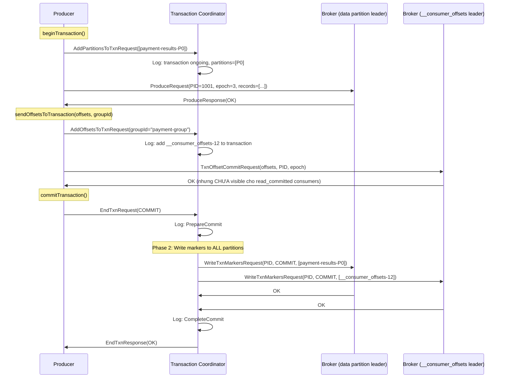

## Mục lục

- [Bối cảnh: Thanh toán bị trừ tiền 2 lần](#1-bối-cảnh-thanh-toán-bị-trừ-tiền-2-lần)
- [3 Delivery Guarantees — Từ lý thuyết đến thực tế](#2-3-delivery-guarantees--từ-lý-thuyết-đến-thực-tế)
- [Idempotent Producer — Dedup ở broker layer](#3-idempotent-producer--dedup-ở-broker-layer)
- [Transaction Coordinator — Orchestrator trung tâm](#4-transaction-coordinator--orchestrator-trung-tâm)
- [Transaction Protocol — Two-Phase Commit](#5-transaction-protocol--two-phase-commit)
- [Transaction Markers — Commit/Abort signals](#6-transaction-markers--commitabort-signals)
- [Zombie Fencing — ProducerEpoch mechanism](#7-zombie-fencing--producerepoch-mechanism)
- [Consume-Transform-Produce — End-to-End EOS](#8-consume-transform-produce--end-to-end-eos)
- [read_committed vs read_uncommitted](#9-read_committed-vs-read_uncommitted)
- [Transaction Timeout & Abort](#10-transaction-timeout--abort)
- [Performance Cost — EOS không miễn phí](#11-performance-cost--eos-không-miễn-phí)
- [Khi nào dùng / không dùng EOS](#12-khi-nào-dùng--không-dùng-eos)
- [Spring Boot Transaction Configuration](#13-spring-boot-transaction-configuration)
- [Common Pitfalls](#14-common-pitfalls)
- [Tóm tắt — Cheat sheet](#15-tóm-tắt--cheat-sheet)

---

## 1. Bối cảnh: Thanh toán bị trừ tiền 2 lần

Service xử lý payment consume từ topic `payment-requests`, trừ tiền rồi produce kết quả vào topic `payment-results`:

```
Consumer: poll() → payment-request {userId: U1, amount: 100}
Process:  debit account U1 by 100
Producer: send("payment-results", {userId: U1, status: "debited"})
Commit:   commitSync()  ← app crash NGAY TẠI ĐÂY trước khi commit
```

Sau restart, offset chưa commit → consumer **đọc lại** cùng message → trừ tiền **LẦN 2**. User U1 bị mất 200 thay vì 100.

Đây là **at-least-once** semantics: message được xử lý **ít nhất 1 lần**, có thể nhiều hơn. Ba vấn đề cần giải quyết:

| Vấn đề | Xảy ra khi | Kết quả |
|---------|-----------|---------|
| Producer duplicate | Network timeout → retry → ghi 2 lần | Duplicate output |
| Consumer re-read | Crash trước commit offset | Re-process input |
| Partial write | Crash giữa produce + commit | Produce thành công nhưng offset chưa commit |

> [!IMPORTANT]
> **Exactly-once = Idempotent Producer + Transactions + Consumer read_committed**. Không có silver bullet — phải kết hợp 3 layer. Thiếu bất kỳ 1 cái → vẫn có duplicate hoặc data loss.

---

## 2. 3 Delivery Guarantees — Từ lý thuyết đến thực tế

| Guarantee | Mô tả | Cơ chế Kafka | Trade-off |
|-----------|-------|-------------|-----------|
| **At-most-once** | Message xử lý tối đa 1 lần, có thể mất | Commit offset trước khi xử lý | Mất data, nhưng nhanh |
| **At-least-once** | Message xử lý ít nhất 1 lần, có thể duplicate | Xử lý xong rồi commit | Duplicate, nhưng không mất |
| **Exactly-once** | Message xử lý đúng 1 lần | Idempotent + Transaction + read_committed | Chậm hơn, phức tạp hơn |

```
At-most-once flow:
  commit() → process()    ← crash sau commit, trước process → MESSAGE MẤT

At-least-once flow:
  process() → commit()    ← crash sau process, trước commit → RE-PROCESS

Exactly-once flow:
  beginTransaction()
  process() + produce() + sendOffsetsToTransaction()
  commitTransaction()     ← atomic: all-or-nothing
```

---

## 3. Idempotent Producer — Dedup ở broker layer

### 3.1. PID + Sequence Number

```
Khi Producer init:
  → InitProducerIdRequest → Transaction Coordinator
  ← Response: PID=1001, Epoch=0

Mỗi batch gửi đi (per partition):
  ProduceRequest {
    producerId: 1001
    producerEpoch: 0
    baseSequence: 5        ← tăng dần per TopicPartition
    records: [msg1, msg2, msg3]
  }
```

### 3.2. Broker-side dedup

```
Broker tracking table (per PID, per partition):
┌──────┬────────────┬───────────────────┐
│ PID  │ Partition  │ Last 5 Sequences  │
├──────┼────────────┼───────────────────┤
│ 1001 │    P0      │ [1, 2, 3, 4, 5]   │
│ 1001 │    P1      │ [0, 1, 2]         │
│ 1002 │    P0      │ [0, 1]            │
└──────┴────────────┴───────────────────┘

Incoming batch: PID=1001, P0, seq=5
  → Already seen! → ACK without writing → DEDUP!

Incoming batch: PID=1001, P0, seq=6
  → Expected next → Write → Update table

Incoming batch: PID=1001, P0, seq=8
  → Gap! (missing 7) → OutOfOrderSequenceException → Producer handles
```

### 3.3. Giới hạn

- Dedup chỉ **trong producer session** (cùng PID). Restart → PID mới → không dedup cross-session
- Broker chỉ giữ **5 in-flight sequences** (= max.in.flight.requests.per.connection ≤ 5)
- Chỉ protect **producer → broker** layer, không protect consumer-side

---

## 4. Transaction Coordinator — Orchestrator trung tâm

### 4.1. Ai là Transaction Coordinator?

Tương tự Group Coordinator, mỗi `transactional.id` map tới 1 broker:

```java
int partition = Math.abs(transactionalId.hashCode() % transactionTopicPartitionCount); // 50
Broker txnCoordinator = leaderOf(__transaction_state, partition);
```

### 4.2. __transaction_state topic

Kafka lưu transaction state trong internal topic `__transaction_state` (50 partitions, log-compacted):

```
Key:   transactional.id = "payment-processor-1"
Value: {
  producerId: 1001,
  producerEpoch: 3,
  state: "CompleteCommit",       // Ongoing | PrepareCommit | CompleteCommit | PrepareAbort | CompleteAbort
  topicPartitions: [             // Partitions tham gia transaction
    {topic: "payment-results", partition: 0},
    {topic: "payment-results", partition: 2},
    {topic: "__consumer_offsets", partition: 12}   // offset commit cũng trong transaction!
  ],
  txnTimeoutMs: 60000,
  txnStartTimestamp: 1705305600000
}
```

### 4.3. Transaction Coordinator responsibilities

| Trách nhiệm | Chi tiết |
|-------------|---------|
| Assign PID + Epoch | InitProducerIdRequest → trả PID/Epoch |
| Track transaction state | Ongoing → PrepareCommit/Abort → Complete |
| Write transaction markers | Gửi WriteTxnMarkersRequest tới partition leaders |
| Fence zombies | Tăng epoch → old producer bị reject |
| Abort timeout transactions | Transaction chạy > `transaction.timeout.ms` → auto abort |

---

## 5. Transaction Protocol — Two-Phase Commit

### 5.1. Full transaction flow



### 5.2. Atomicity guarantee

Sau `commitTransaction()` thành công:
- Data records trong `payment-results` **visible** cho `read_committed` consumers
- Offset commit trong `__consumer_offsets` **committed**
- → Consumer sẽ KHÔNG re-read messages đã xử lý

Nếu crash giữa chừng:
- Transaction Coordinator detect timeout → auto **ABORT**
- Data records bị "invisible" (marker = ABORT)
- Offset KHÔNG commit → consumer sẽ re-read (safe, at-least-once fallback)

---

## 6. Transaction Markers — Commit/Abort signals

### 6.1. Marker = special record in partition

```
Partition "payment-results-0":
┌─────────────────────────────────────────────────────────────────────┐
│ Offset 0: [data record, PID=1001, txn]                             │
│ Offset 1: [data record, PID=1001, txn]                             │
│ Offset 2: [data record, PID=1002, no txn]   ← non-transactional    │
│ Offset 3: [data record, PID=1001, txn]                             │
│ Offset 4: [COMMIT MARKER, PID=1001]         ← Transaction committed │
│ Offset 5: [data record, PID=1003, txn]                             │
│ Offset 6: [ABORT MARKER, PID=1003]          ← Transaction aborted   │
│ Offset 7: [data record, PID=1004, txn]      ← ongoing, no marker yet│
└─────────────────────────────────────────────────────────────────────┘
```

### 6.2. Consumer filtering (read_committed)

```
Consumer (isolation.level=read_committed) đọc partition này:
  Offset 0: PID=1001, check → marker tại offset 4 = COMMIT → DELIVER
  Offset 1: PID=1001, check → COMMIT → DELIVER
  Offset 2: Non-transactional → DELIVER
  Offset 3: PID=1001, check → COMMIT → DELIVER
  Offset 4: Marker → SKIP
  Offset 5: PID=1003, check → marker tại offset 6 = ABORT → FILTER OUT
  Offset 6: Marker → SKIP
  Offset 7: PID=1004, no marker yet → BLOCK (chờ commit/abort)
```

### 6.3. Last Stable Offset (LSO)

**LSO** = offset nhỏ nhất của transaction chưa hoàn tất. `read_committed` consumer **không bao giờ** đọc qua LSO:

```
LSO = 7 (PID=1004 transaction ongoing)
Consumer can only see offsets < 7
→ Latency tăng nếu có long-running transactions!
```

---

## 7. Zombie Fencing — ProducerEpoch mechanism

### 7.1. Zombie scenario

```
Producer instance 1: transactional.id = "payment-1"
  T=0:  Init → PID=1001, Epoch=0
  T=1:  beginTransaction()
  T=2:  produce records...
  T=3:  NETWORK PARTITION (Instance 1 "disappears")

Instance 2 (restart/failover): transactional.id = "payment-1"
  T=4:  Init → PID=1001, Epoch=1   ← EPOCH TĂNG!
  T=5:  beginTransaction()
  T=6:  produce records...

Instance 1 (zombie) recovers:
  T=7:  Tries to produce with Epoch=0
        → Broker reject: ProducerFencedException (epoch 0 < current 1)
        → Zombie is FENCED!
```

### 7.2. Tại sao cần fencing?

Nếu không fence:
- 2 producers cùng `transactional.id` chạy song song
- Cả 2 ghi vào cùng partitions
- Transaction semantics bị phá vỡ (non-atomic writes)

Epoch guarantee: **chỉ 1 producer instance per transactional.id active tại bất kỳ thời điểm nào**.

---

## 8. Consume-Transform-Produce — End-to-End EOS

### 8.1. Pattern

```java
// End-to-end exactly-once với Spring Kafka
@Bean
public ConcurrentKafkaListenerContainerFactory<String, String> kafkaListenerFactory(
        ConsumerFactory<String, String> consumerFactory,
        KafkaTemplate<String, String> kafkaTemplate) {

    var factory = new ConcurrentKafkaListenerContainerFactory<String, String>();
    factory.setConsumerFactory(consumerFactory);

    // Key config: container manages transactions
    factory.getContainerProperties().setTransactionManager(
        new KafkaTransactionManager<>(producerFactory));
    factory.getContainerProperties().setEosMode(EOSMode.V2);  // KIP-447

    return factory;
}
```

### 8.2. EOS V2 (KIP-447) — Consumer Group awareness

```
EOS V1 (trước Kafka 2.5):
  Mỗi consumer instance cần transactional.id UNIQUE
  → Phải config tĩnh: "txn-processor-0", "txn-processor-1", ...
  → Khi rebalance: partition đổi consumer → cần fence old txn + init new txn
  → Phức tạp, chậm khi rebalance

EOS V2 (Kafka 2.5+, KIP-447):
  transactional.id = group.id + "-" + topicPartition
  → Automatic per partition
  → Khi rebalance: new consumer nhận partition + tự init transaction cho partition đó
  → Fence old owner automatically qua epoch bump
```

### 8.3. Atomic read-process-write

```
Exactly-once loop (atomic per poll batch):
┌─────────────────────────────────────────────────────────────────┐
│ 1. poll()              → đọc batch records                      │
│ 2. beginTransaction()                                           │
│ 3. process(records)    → business logic                         │
│ 4. produce(output)     → ghi kết quả vào output topic           │
│ 5. sendOffsetsToTxn()  → commit input offsets TRONG transaction  │
│ 6. commitTransaction() → atomic: output + offsets cùng commit   │
│                                                                 │
│ Crash ở bước 1-5: Transaction timeout → ABORT → re-read (safe) │
│ Crash ở bước 6:   TC detect timeout → ABORT or complete commit  │
└─────────────────────────────────────────────────────────────────┘
```

---

## 9. read_committed vs read_uncommitted

| | `read_uncommitted` (default) | `read_committed` |
|--|---|---|
| **Sees** | ALL records (kể cả transactional chưa commit) | Chỉ committed records + non-transactional |
| **Filters** | Không filter gì | Filter ABORT markers, block tại LSO |
| **Latency** | Lower (không chờ markers) | Higher (chờ transaction complete) |
| **Use case** | Non-critical reads, monitoring | EOS consumers |

```yaml
# Consumer config cho exactly-once
spring:
  kafka:
    consumer:
      isolation-level: read_committed    # QUAN TRỌNG cho EOS!
```

> [!WARNING]
> Nếu consumer dùng `read_uncommitted` (default), nó sẽ thấy records từ transactions đã ABORT → vẫn process duplicate/invalid data. EOS consumer **phải** set `read_committed`.

---

## 10. Transaction Timeout & Abort

### 10.1. Auto-abort mechanism

```
Producer beginTransaction() → 60s (transaction.timeout.ms) không commit/abort
  → Transaction Coordinator: "Transaction quá lâu"
  → Write ABORT markers tới mọi partitions trong transaction
  → Bump epoch (fence producer nếu nó vẫn sống)
  → Consumer (read_committed): filter aborted records
```

### 10.2. Implications

- `transaction.timeout.ms` (default 60s) phải > thời gian xử lý longest batch
- Quá ngắn: transaction bị abort giữa chừng khi processing chậm
- Quá dài: `read_committed` consumers bị block lâu tại LSO (chờ transaction hoàn tất)

---

## 11. Performance Cost — EOS không miễn phí

### 11.1. Overhead so với at-least-once

| Aspect | At-least-once | Exactly-once | Overhead |
|--------|---------------|-------------|----------|
| **Extra RPCs** | 0 | InitPID + AddPartitions + EndTxn + WriteTxnMarkers | +4-6 RPCs/txn |
| **Latency** | ~5ms/batch | ~15-30ms/batch | +2-6x |
| **Throughput** | 100% baseline | ~70-85% baseline | -15-30% |
| **Disk** | Data only | Data + markers + __transaction_state | +~5% |
| **Consumer latency** | Read immediately | Wait for commit marker (LSO) | +txn_duration |

### 11.2. Batching transactions để giảm overhead

```
Bad: 1 transaction per record (EOS overhead per record = rất đắt)
  records.forEach(r -> {
    beginTransaction();
    process(r);
    commitTransaction();  // 6 RPCs PER RECORD!
  });

Good: 1 transaction per poll batch
  List<Record> batch = poll();
  beginTransaction();
  batch.forEach(this::process);
  commitTransaction();  // 6 RPCs per BATCH (amortized)
```

---

## 12. Khi nào dùng / không dùng EOS

### 12.1. Dùng EOS

| Use case | Lý do |
|----------|-------|
| Financial transactions (payment, transfer) | Duplicate = mất tiền thật |
| Consume-Transform-Produce pipelines | Cần atomic read + write |
| Event sourcing (state rebuild) | Duplicate event = corrupted state |
| CDC sink (Kafka → DB) | Duplicate write = data inconsistency |

### 12.2. KHÔNG cần EOS

| Use case | Lý do | Thay thế |
|----------|-------|----------|
| Metrics/logs ingestion | Duplicate metric OK, idempotent aggregation | At-least-once + idempotent consumer |
| Cache update (SET semantics) | SET overwrite = naturally idempotent | At-least-once |
| Notification/email | Duplicate OK hoặc dedup ở application | At-least-once + dedup key |
| Real-time dashboard | Đọc latest value, old duplicate không ảnh hưởng | read_uncommitted for lowest latency |

---

## 13. Spring Boot Transaction Configuration

```yaml
spring:
  kafka:
    producer:
      transaction-id-prefix: payment-processor-   # Enable transactions
      acks: all                                    # Required for EOS
      enable-idempotence: true                     # Required (auto-enabled with txn)
      properties:
        max.in.flight.requests.per.connection: 5   # OK with idempotent
        transactional.id: ${spring.application.name}-${random.uuid}

    consumer:
      isolation-level: read_committed              # MUST for EOS consumer
      enable-auto-commit: false                    # Manual commit via transaction
      properties:
        # EOS V2 (Kafka 2.5+)
        partition.assignment.strategy: org.apache.kafka.clients.consumer.CooperativeStickyAssignor

    listener:
      ack-mode: record
```

```java
@KafkaListener(topics = "payment-requests", groupId = "payment-processor")
public void processPayment(ConsumerRecord<String, PaymentRequest> record,
                           @Header(KafkaHeaders.RECEIVED_PARTITION) int partition) {
    // Spring Kafka automatically wraps this in a transaction
    // (when KafkaTransactionManager is configured)

    PaymentResult result = paymentService.process(record.value());

    // Produce output — part of same transaction
    kafkaTemplate.send("payment-results", record.key(), result);

    // Offset commit happens automatically via sendOffsetsToTransaction
}
```

---

## 14. Common Pitfalls

| Pitfall | Triệu chứng | Root cause | Fix |
|---------|-------------|-----------|-----|
| Consumer thấy duplicates dù dùng txn | Records xuất hiện 2 lần | `isolation.level` vẫn là `read_uncommitted` (default) | Set `read_committed` |
| `ProducerFencedException` khi restart | Producer bị reject | 2 instances cùng `transactional.id` | Đảm bảo unique per instance (hoặc dùng EOS V2) |
| Transaction timeout abort | Processing quá lâu | `transaction.timeout.ms` < processing time | Tăng timeout hoặc giảm batch size |
| Consumer lag tăng đột ngột | `read_committed` block tại LSO | Long-running transaction block reads | Giảm `transaction.timeout.ms`, optimize processing |
| Throughput giảm 50% | EOS overhead | 1 transaction per message | Batch transactions (per poll batch) |
| Zombie producer still writing | Duplicate records appear | Epoch fencing chưa hoàn tất | Check `transactional.id` uniqueness |

---

## 15. Tóm tắt — Cheat sheet

```
EXACTLY-ONCE = 3 LAYERS:
  Layer 1: Idempotent Producer (PID + SeqNum → broker dedup)
  Layer 2: Transactions (atomic produce + offset commit)
  Layer 3: read_committed Consumer (filter aborted records)

TRANSACTION PROTOCOL:
  InitProducerId → AddPartitions → Produce → SendOffsets
  → EndTxn(COMMIT) → WriteTxnMarkers → CompleteCommit

ZOMBIE FENCING:
  Same transactional.id → Epoch bump → Old producer FENCED
  Only 1 active producer per transactional.id at any time

KEY COMPONENTS:
  Transaction Coordinator: Broker managing __transaction_state partition
  Transaction Markers: COMMIT/ABORT records written to data partitions
  LSO (Last Stable Offset): Consumer read boundary for read_committed

PERFORMANCE:
  EOS = -15-30% throughput, +2-6x latency per batch
  Mitigation: batch transactions per poll(), not per record

5 NGUYÊN TẮC:
1. EOS cần CẢ 3 layers — thiếu 1 = vẫn duplicate
2. read_committed consumer PHẢI set isolation.level (default = uncommitted!)
3. transaction.timeout.ms > longest processing time
4. Batch transactions per poll batch, KHÔNG per message
5. EOS V2 (Kafka 2.5+) = tự động fence per partition khi rebalance
```
