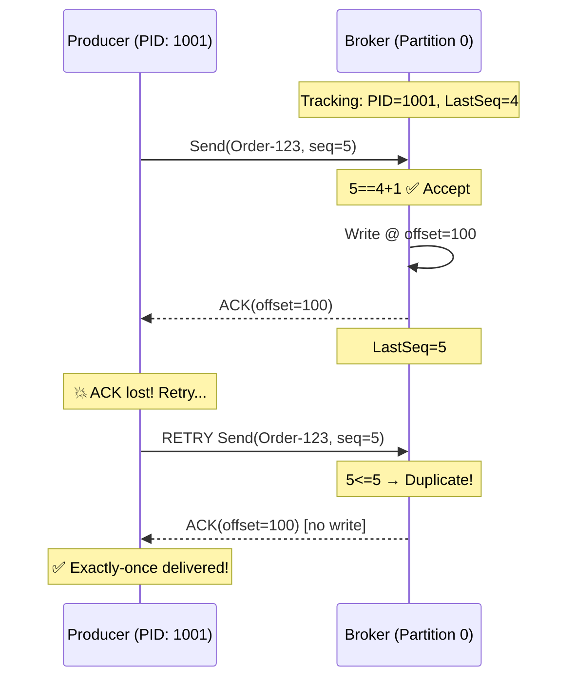
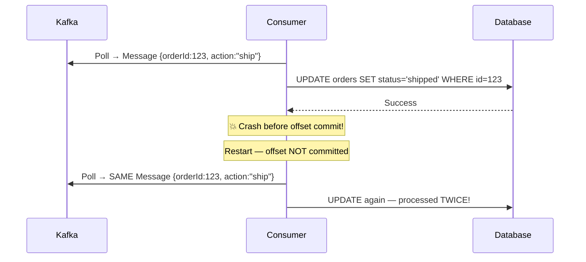
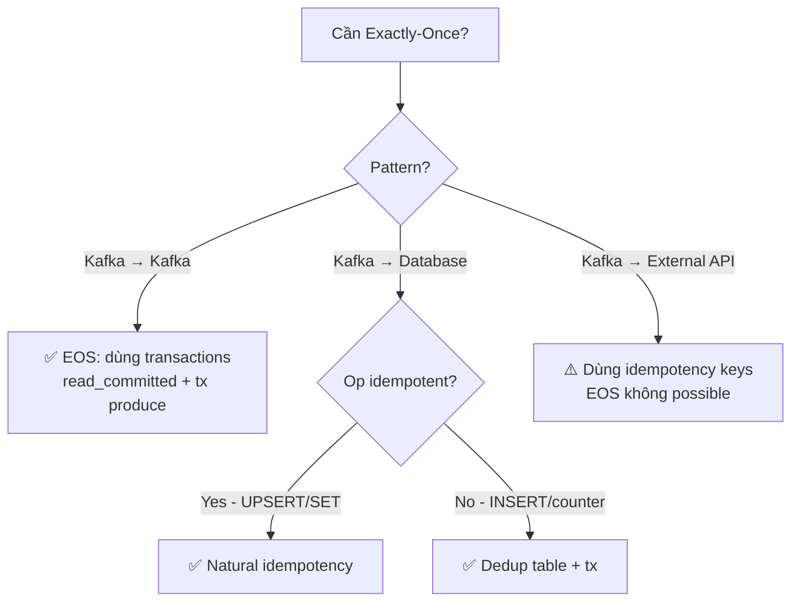

# Exactly-Once Semantics (EOS)

## Ba Delivery Guarantees

| Semantic | Cách xảy ra | Trade-off | Dùng khi |
|---------|-------------|-----------|----------|
| **At-Most-Once** | Commit offset *trước* khi xử lý | 🔥 Có thể mất message | Logs, metrics |
| **At-Least-Once** | Commit offset *sau* khi xử lý | ⚠️ Có thể duplicate | Đại đa số apps |
| **Exactly-Once** | Idempotent producer + transactions | ❌ Latency cao hơn | Payments, billing |

---

## Part 1: Producer Idempotency (Built-in)

### Vấn đề: Duplicate do Network Retry

```
Producer sends Order-123 → Broker writes ✅ → ACK 💥 LOST in network
Producer retries Order-123 → Broker writes AGAIN ✅
Consumer processes Order-123 TWICE → Double charge!
```

### Cơ chế PID + Sequence Number

Khi `enable.idempotence=true`, Kafka gán:
- **PID** (Producer ID): unique identifier per producer instance
- **Sequence Number**: tăng dần per-partition

```
┌─────────────────────────────────────────────────────────────┐
│  PRODUCER IDEMPOTENCY                                       │
├─────────────────────────────────────────────────────────────┤
│                                                             │
│  Message: {msg: "Order-123", pid: 1001, seq: 5}             │
│                    │                                        │
│  Broker Tracking:  ▼                                        │
│  ┌──────────┬───────────────────┐                           │
│  │   PID    │  Last Seq Accepted│                           │
│  ├──────────┼───────────────────┤                           │
│  │  1001    │       4           │ ← Current                 │
│  └──────────┴───────────────────┘                           │
│                                                             │
│  Incoming seq=5: 5 == 4+1? ✅ ACCEPT, write to log          │
│                                                             │
│  RETRY with seq=5: 5 == 5+1? ❌ Check: 5 <= 5? ✅           │
│  → REJECT duplicate, return same ACK (no double write)      │
└─────────────────────────────────────────────────────────────┘
```



### Configuration

```yaml
spring:
  kafka:
    producer:
      properties:
        enable.idempotence: true
      acks: all                         # Required (auto-set)
      retries: 2147483647               # Max retries
      properties:
        max.in.flight.requests.per.connection: 5  # ≤ 5 for ordering
```

### Real-World: Payment Service

| Scenario | Without Idempotency | With Idempotency |
|---------|--------------------| ----------------|
| User pays $100 | Charged $200 (duplicate) 😱 | Charged $100 ✅ |
| ACK lost network | Broker writes twice | Broker detects dup, ignores |
| Producer retries | 2 messages in Kafka | 1 message in Kafka |

### Limitations

> [!WARNING]
> Producer idempotency chỉ ngăn **automatic retry duplicates** (network-level). Không giúp được:
> - Producer restart → new PID → same message re-sent với PID mới
> - Application code gọi `send()` hai lần → cả hai đều ghi (seq khác nhau)

---

## Part 2: Consumer Idempotency (Application Responsibility)

### Tại sao Consumer Duplicates Xảy ra



### Strategy 1: Natural Idempotency (Best — no extra code)

```
✅ IDEMPOTENT operations (safe to repeat):
  SET status = 'shipped'       → same result every time
  UPSERT ON CONFLICT UPDATE    → overwrites with same data
  DELETE WHERE id = 123        → deleting twice = same result

❌ NOT IDEMPOTENT (dangerous to repeat):
  INSERT INTO orders (...)     → creates duplicate rows!
  UPDATE balance = balance + 100  → adds $100 each time!
  POST /api/orders             → creates new order each time!
```

**Convert non-idempotent to idempotent:**

```sql
-- ❌ Dangerous
INSERT INTO orders (id, ...) VALUES (auto_id, ...)

-- ✅ Safe UPSERT
INSERT INTO orders (id, status, updated_at) VALUES (:eventId, :status, :updatedAt)
ON CONFLICT (id) DO UPDATE SET
    status = EXCLUDED.status,
    updated_at = EXCLUDED.updated_at
WHERE orders.updated_at < EXCLUDED.updated_at
```

```java
@KafkaListener(topics = "order-events")
public void handleOrderEvent(OrderEvent event) {
    // ✅ UPSERT — safe to call multiple times
    orderRepository.upsert(event.getOrderId(), event.getStatus(), event.getUpdatedAt());
}
```

### Strategy 2: Deduplication Table

Khi không thể dùng natural idempotency (INSERT, counter, email sending):

```
Processing flow:
1. Check: SELECT 1 FROM processed_messages WHERE message_id = :id
2. If EXISTS → skip (already processed)
3. If NOT EXISTS → in transaction:
   a. INSERT INTO processed_messages(message_id) -- unique constraint
   b. Run business logic
   c. COMMIT
```

```java
@KafkaListener(topics = "payments")
public void handlePayment(PaymentEvent event) {
    String messageId = event.getMessageId();

    if (processedRepo.existsById(messageId)) {
        log.info("Duplicate, skipping: {}", messageId);
        return;
    }

    transactionTemplate.execute(status -> {
        try {
            processedRepo.save(new ProcessedMessage(messageId, Instant.now()));
        } catch (DataIntegrityViolationException e) {
            // Concurrent duplicate — another thread got it
            return null;
        }
        paymentService.chargeCustomer(event.getCustomerId(), event.getAmount());
        return null;
    });
}
```

```sql
CREATE TABLE processed_messages (
    message_id  VARCHAR(255) PRIMARY KEY,  -- Unique constraint = dedup
    processed_at TIMESTAMP DEFAULT NOW(),
    topic       VARCHAR(255)
);
```

### Strategy 3: Idempotency Key (External API)

```java
@KafkaListener(topics = "payment-requests")
public void processPayment(PaymentRequest request) {
    // Use business ID as idempotency key
    RequestOptions options = RequestOptions.builder()
        .setIdempotencyKey(request.getPaymentId())  // ✅ Stripe handles dedup!
        .build();

    PaymentIntent.create(params, options);
    // 2nd call with same key → Stripe returns cached response, charges once
}
```

---

## EOS: Khi nào dùng được?



**Full EOS config (Kafka-to-Kafka):**

```yaml
spring:
  kafka:
    producer:
      transaction-id-prefix: tx-svc-
      properties:
        enable.idempotence: true
      acks: all
      retries: 2147483647
    consumer:
      isolation-level: read_committed   # Only read committed tx messages
      enable-auto-commit: false
```

---

## Strategy Decision Matrix

| Scenario | Strategy | Example |
|---------|---------|---------|
| Status updates | Natural idempotency | `SET status = 'active'` |
| DB writes | UPSERT + dedup | `ON CONFLICT DO UPDATE` |
| External API | Idempotency keys | Stripe, PayPal headers |
| Balance updates | Version check | `WHERE version = X` |
| Email/SMS | Dedup table | Check before send |

---

## Checklist

```
✅ PRODUCER
   [ ] enable.idempotence=true
   [ ] acks=all
   [ ] retries=MAX_INT
   [ ] max.in.flight.requests ≤ 5

✅ CONSUMER
   [ ] Mỗi message có unique ID
   [ ] Chọn strategy theo operation type
   [ ] Dedup records cleanup (TTL 30 ngày)
   [ ] Test với duplicate messages

✅ MESSAGE DESIGN
   [ ] Include unique eventId mỗi message
   [ ] Include version/timestamp
```

> [!TIP]
> **Golden Rule**: Thiết kế giả định mỗi message sẽ arrive **ít nhất 2 lần**. Nếu consumer safe với điều đó → bạn đã đạt idempotency.

<Cards>
  <Card title="Kafka Transactions" href="/producers-consumers/transactions/" description="Dual Write Problem, Outbox Pattern" />
  <Card title="Retry & DLT" href="/producers-consumers/retry-dlt/" description="Non-blocking retries, @RetryableTopic" />
  <Card title="Consumer Groups" href="/core-concepts/consumer-groups/" description="Rebalancing và AckMode" />
</Cards>
