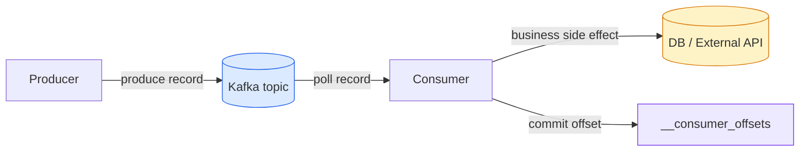
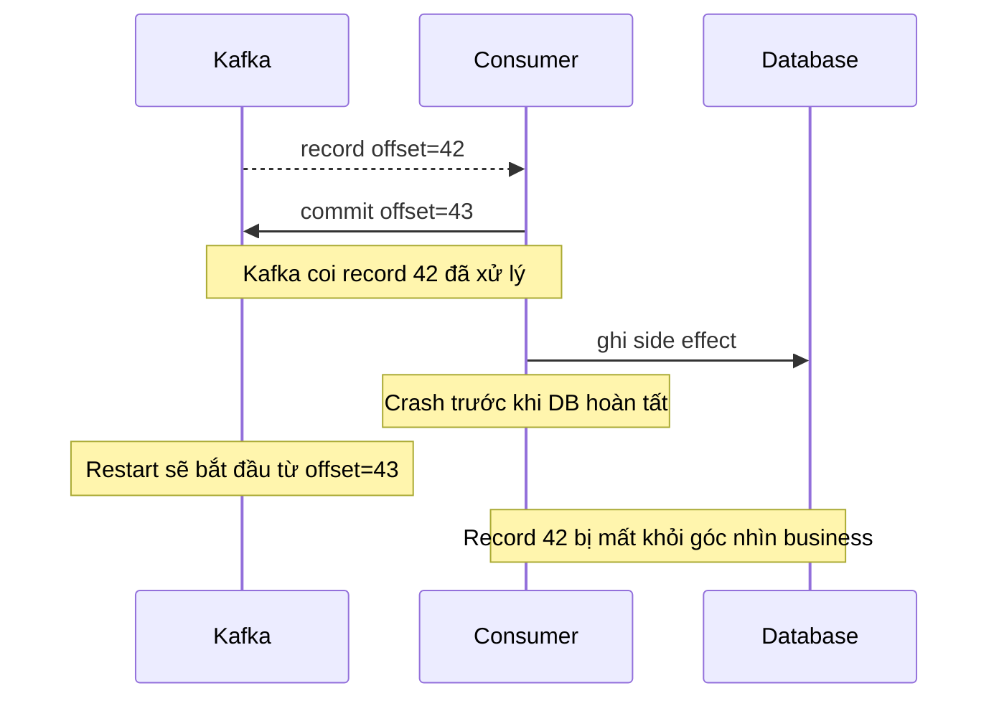
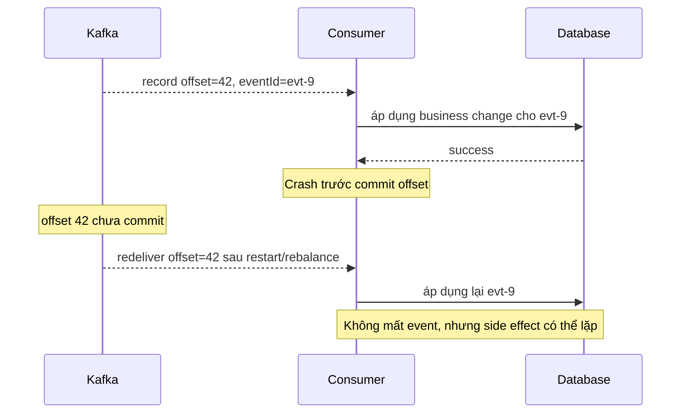
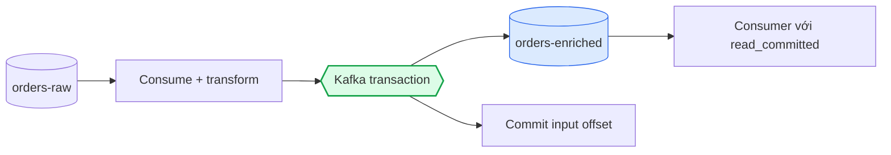
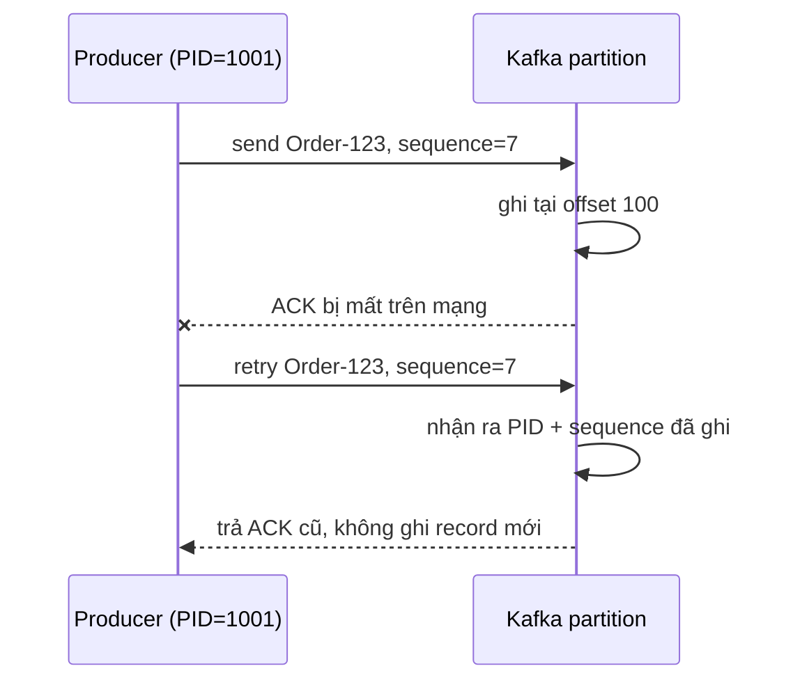
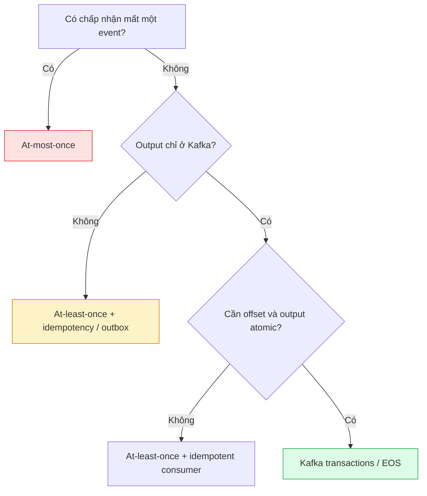

<Callout type="info" title="Phạm vi bài viết">
  Delivery guarantee luôn cần được đọc cùng phạm vi của nó: broker, một consumer group, luồng Kafka → Kafka, hay toàn bộ side effect ở database/API. Kafka có thể bảo đảm exactly-once cho một số luồng Kafka → Kafka; điều đó không tự động biến mọi thao tác với database hoặc API bên ngoài thành exactly-once.
</Callout>

## Mục lục

- [Mô hình tư duy: message có thể bị mất hoặc bị lặp](#mô-hình-tư-duy-message-có-thể-bị-mất-hoặc-bị-lặp)
  - [Ba điểm xác nhận quyết định guarantee](#ba-điểm-xác-nhận-quyết-định-guarantee)
- [At-Most-Once: ưu tiên không lặp](#at-most-once-ưu-tiên-không-lặp)
  - [Luồng xử lý và failure window](#luồng-xử-lý-và-failure-window)
  - [Khi nào nên dùng](#khi-nào-nên-dùng)
  - [Cấu hình Spring Kafka](#cấu-hình-spring-kafka)
- [At-Least-Once: ưu tiên không mất](#at-least-once-ưu-tiên-không-mất)
  - [Luồng xử lý và failure window](#luồng-xử-lý-và-failure-window-1)
  - [Nguồn tạo duplicate](#nguồn-tạo-duplicate)
  - [Cấu hình Spring Kafka](#cấu-hình-spring-kafka-1)
  - [Làm consumer an toàn với duplicate](#làm-consumer-an-toàn-với-duplicate)
- [Exactly-Once: không lặp trong phạm vi giao dịch](#exactly-once-không-lặp-trong-phạm-vi-giao-dịch)
  - [Định nghĩa chính xác và các điều kiện](#định-nghĩa-chính-xác-và-các-điều-kiện)
  - [Idempotent producer không phải end-to-end EOS](#idempotent-producer-không-phải-end-to-end-eos)
  - [Kafka transaction cho luồng Kafka → Kafka](#kafka-transaction-cho-luồng-kafka--kafka)
  - [Cấu hình Spring Kafka](#cấu-hình-spring-kafka-2)
  - [Kafka → database hoặc API bên ngoài](#kafka--database-hoặc-api-bên-ngoài)
- [So sánh và chọn guarantee](#so-sánh-và-chọn-guarantee)
- [Checklist thiết kế và kiểm thử](#checklist-thiết-kế-và-kiểm-thử)
- [Bước tiếp theo](#bước-tiếp-theo)

## Mô hình tư duy: message có thể bị mất hoặc bị lặp

Trong hệ phân tán, client không thể luôn biết broker hoặc downstream system đã thực hiện thao tác hay chưa. Ví dụ, producer gửi một record, broker đã ghi record đó, nhưng gói `ACK` bị mất trên đường về. Producer nhìn thấy timeout và phải chọn một trong hai hành động:

- **Không gửi lại**: tránh record trùng, nhưng record có thể chưa từng tới broker.
- **Gửi lại**: tăng khả năng record tới broker, nhưng có thể gửi bản sao của record đã được ghi.

Consumer cũng có cùng bài toán. Consumer xử lý xong một message rồi bị crash trước khi commit offset. Khi khởi động lại, nó sẽ đọc lại message đó. Nếu commit offset trước khi xử lý thì ngược lại: crash sau khi commit sẽ làm message không còn được đọc lại.

Nói ngắn gọn, ba guarantee là ba cách chọn vị trí của sự xác nhận khi failure xảy ra:

| Guarantee | Ưu tiên | Cái giá phải trả |
| --- | --- | --- |
| **At-most-once** | Không xử lý lặp | Có thể mất message hoặc bỏ qua side effect |
| **At-least-once** | Không bỏ qua message đã nhận | Có thể xử lý lặp |
| **Exactly-once** | Một input chỉ đóng góp một kết quả quan sát được, trong phạm vi xác định | Transaction, độ trễ và vận hành phức tạp hơn |

<Callout type="warn" title="Guarantee không phải thuộc tính riêng của producer">
  Một producer có thể gửi at-least-once, trong khi consumer lại xử lý at-most-once nếu commit offset trước business logic. Hãy mô tả guarantee cho **toàn bộ đoạn đường**: producer → Kafka → consumer → hệ thống đích.
</Callout>

### Ba điểm xác nhận quyết định guarantee

Ba điểm dưới đây là nơi cần kiểm tra khi đọc hoặc thiết kế một pipeline:


```mermaid
flowchart LR
    P[Producer] -->|produce record| K[(Kafka topic)]
    K -->|poll record| C[Consumer]
    C -->|business side effect| D[(DB / External API)]
    C -->|commit offset| O[__consumer_offsets]

    style K fill:#dbeafe,stroke:#2563eb
    style D fill:#fef3c7,stroke:#d97706
    style O fill:#ede9fe,stroke:#7c3aed
```

1. **Producer acknowledgment**: producer có retry khi không nhận `ACK` hay không?
2. **Business side effect**: database/API đã thay đổi trạng thái chưa?
3. **Offset commit**: Kafka đã đánh dấu consumer group đã xử lý record chưa?

Không thể atomically gộp database, API bên thứ ba và Kafka offset chỉ bằng một cờ cấu hình. Khi các bước này không nằm trong cùng transaction, luôn có một cửa sổ failure giữa chúng. Delivery guarantee là cách kiểm soát hậu quả của cửa sổ đó.

## At-Most-Once: ưu tiên không lặp

**At-most-once** nghĩa là một record được chuyển cho bước xử lý **tối đa một lần**. Hệ thống chấp nhận khả năng record không được xử lý lần nào nếu lỗi xuất hiện đúng lúc.

Đây là lựa chọn phù hợp khi giá trị của việc tránh duplicate cao hơn giá trị của từng message đơn lẻ. Chẳng hạn, bỏ sót một metric debug thường chấp nhận được; cộng trùng doanh thu thì không.

### Luồng xử lý và failure window

Với consumer, cách quen thuộc để có at-most-once là **commit offset trước business logic**:


```mermaid
sequenceDiagram
    participant K as Kafka
    participant C as Consumer
    participant DB as Database

    K-->>C: record offset=42
    C->>K: commit offset=43
    Note over K,C: Kafka coi record 42 đã xử lý
    C->>DB: ghi side effect
    Note over C: Crash trước khi DB hoàn tất
    Note over K: Restart sẽ bắt đầu từ offset=43
    Note over C,DB: Record 42 bị mất khỏi góc nhìn business
```

Offset `43` có nghĩa là consumer group sẽ đọc từ record kế tiếp; offset `42` đã được đánh dấu hoàn tất. Nếu process chết sau commit, Kafka sẽ không redeliver record `42`, dù xử lý business chưa xong.

Ở phía producer, gửi với `acks=0` hoặc chủ động không retry khi gặp lỗi cũng nghiêng về at-most-once. Producer giảm nguy cơ retry tạo duplicate, đổi lại nó không có xác nhận bền vững rằng broker đã ghi record.

### Khi nào nên dùng

Dùng at-most-once khi **mất một phần dữ liệu là chấp nhận được** và duplicate gây hại hoặc tốn kém hơn nhiều:

| Use case | Vì sao chấp nhận được |
| --- | --- |
| Telemetry, debug log, clickstream không dùng để billing | Một vài sự kiện bị mất không thay đổi quyết định chính |
| Cache invalidation có cơ chế refresh định kỳ | Cache có thể tự hội tụ lại sau một khoảng thời gian |
| Tín hiệu UI tức thời, không phải system of record | Người dùng có thể thực hiện lại thao tác hoặc state được tải lại |
| Pipeline best-effort với throughput cực cao | Giảm chi phí commit/retry quan trọng hơn độ đầy đủ tuyệt đối |

<Callout type="error" title="Không dùng cho side effect không thể đảo ngược">
  Không commit trước khi xử lý nếu record tạo đơn hàng, gửi lệnh thanh toán, ghi ledger hoặc kích hoạt workflow bắt buộc phải xảy ra. Một crash đúng giữa commit và side effect sẽ biến thành mất dữ liệu im lặng.
</Callout>

### Cấu hình Spring Kafka

Ví dụ dưới đây minh họa consumer commit offset trước listener. `AckMode.RECORD` vẫn commit **sau** listener, nên không đáp ứng mục tiêu này; cần acknowledge/commit trước khi gọi business logic.

```yaml
spring:
  kafka:
    consumer:
      enable-auto-commit: false
    listener:
      ack-mode: manual_immediate
```

```java
@KafkaListener(topics = "analytics-events", groupId = "analytics-best-effort")
public void consume(ConsumerRecord<String, AnalyticsEvent> record, Acknowledgment ack) {
    // Commit trước: sau dòng này Kafka sẽ không giao lại record khi process crash.
    ack.acknowledge();

    // Best-effort: lỗi hoặc crash ở đây có thể làm mất event.
    analyticsService.record(record.value());
}
```

Ở producer, chỉ dùng các cấu hình giảm độ bền như `acks=0` khi team đã chấp nhận rõ ràng data loss. Thực tế, nhiều hệ thống vẫn dùng producer bền vững (`acks=all`, retry) nhưng chọn at-most-once **ở consumer**; guarantee end-to-end vẫn là at-most-once vì consumer có thể bỏ qua xử lý.

## At-Least-Once: ưu tiên không mất

**At-least-once** nghĩa là sau khi producer đã được xác nhận và record còn trong retention, consumer sẽ tiếp tục thử cho tới khi record được xử lý thành công. Đổi lại, cùng một record có thể tới consumer nhiều hơn một lần.

Đây là guarantee thực tế nhất cho đa số hệ thống event-driven. Nó chịu được crash và lỗi mạng tốt, miễn là business logic có thể chịu duplicate.

### Luồng xử lý và failure window

Để đạt at-least-once ở consumer, đảo thứ tự: **xử lý business trước, commit offset sau**.


```mermaid
sequenceDiagram
    participant K as Kafka
    participant C as Consumer
    participant DB as Database

    K-->>C: record offset=42, eventId=evt-9
    C->>DB: áp dụng business change cho evt-9
    DB-->>C: success
    Note over C: Crash trước commit offset
    Note over K: offset 42 chưa commit
    K-->>C: redeliver offset=42 sau restart/rebalance
    C->>DB: áp dụng lại evt-9
    Note over C,DB: Không mất event, nhưng side effect có thể lặp
```

Với ví dụ này, Kafka đã làm đúng: nó giao lại record chưa được commit. Rủi ro nằm ở `UPDATE balance = balance + 100` hoặc gọi `POST /charge` lần thứ hai. Vì vậy at-least-once thường đi cùng **consumer idempotency**.

### Nguồn tạo duplicate

Duplicate không chỉ đến từ crash. Hãy xem nó là tình huống bình thường cần được thiết kế trước:

| Nguồn | Điều gì xảy ra | Hệ quả |
| --- | --- | --- |
| ACK của producer bị mất | Broker đã ghi nhưng producer timeout và retry | Có thể có record trùng nếu producer không idempotent |
| Crash sau side effect, trước offset commit | Record chưa được đánh dấu hoàn tất | Consumer đọc lại sau restart |
| Rebalance hoặc xử lý vượt quá `max.poll.interval.ms` | Partition bị chuyển sang instance khác | Record đang xử lý có thể bị giao lại |
| Retry/DLT workflow | Record được publish lại hoặc redrive | Consumer phải nhận diện cùng business event |
| Replay / reset offset | Chủ động chạy lại dữ liệu lịch sử | Cùng event có thể xuất hiện ở thời điểm khác |

<Callout type="idea" title="Nguyên tắc thiết kế">
  Hãy giả định mỗi event quan trọng sẽ xuất hiện ít nhất hai lần. Nếu state cuối cùng vẫn đúng khi điều đó xảy ra, consumer của bạn đã sẵn sàng cho at-least-once.
</Callout>

### Cấu hình Spring Kafka

Tắt auto commit để chỉ commit sau khi listener hoàn tất. Với listener thông thường, Spring Kafka có thể commit record sau khi method trả về thành công.

```yaml
spring:
  kafka:
    producer:
      acks: all
      properties:
        enable.idempotence: true
        retries: 2147483647
        max.in.flight.requests.per.connection: 5
    consumer:
      enable-auto-commit: false
    listener:
      ack-mode: record
```

```java
@KafkaListener(topics = "order-events", groupId = "fulfillment")
public void fulfill(OrderEvent event) {
    // Nếu method ném exception, offset không được commit bởi successful path.
    // Error handler / retry policy quyết định lần thử tiếp theo.
    fulfillmentService.apply(event);
}
```

`enable.idempotence=true` ở producer ngăn duplicate do **retry của chính producer** trong một producer session. Nó rất nên bật, nhưng nó không loại bỏ duplicate do consumer crash, rebalance hay replay. Vì vậy consumer vẫn phải idempotent.

### Làm consumer an toàn với duplicate

Chọn strategy theo bản chất side effect, không chỉ theo topic. Mỗi event nên có `eventId` ổn định hoặc business key ổn định như `paymentId`.

| Side effect | Strategy thường dùng | Ví dụ |
| --- | --- | --- |
| Gán một trạng thái | Natural idempotency | `SET status = 'SHIPPED'` |
| Ghi projection/read model | UPSERT có version hoặc timestamp | `INSERT ... ON CONFLICT DO UPDATE` |
| Tạo record một lần | Unique key / dedup table | `event_id` là primary key |
| Gọi cổng thanh toán | Idempotency key của provider | `Idempotency-Key: paymentId` |
| Counter hoặc balance | Lưu event ledger, version check, hoặc tính lại từ source | Tránh `balance = balance + amount` mù quáng |

Ví dụ dùng unique constraint làm điểm quyết định nguyên tử. Không dùng mẫu `SELECT exists` rồi mới ghi; hai worker có thể cùng thấy "chưa xử lý" và cùng chạy side effect.

```sql
CREATE TABLE processed_events (
    consumer_name TEXT NOT NULL,
    event_id      UUID NOT NULL,
    processed_at  TIMESTAMPTZ NOT NULL DEFAULT now(),
    PRIMARY KEY (consumer_name, event_id)
);
```

```java
@Transactional
public void apply(OrderPaid event) {
    // insertIfAbsent dùng INSERT ... ON CONFLICT DO NOTHING
    boolean claimed = processedEventRepository.insertIfAbsent(
        "billing-projection", event.eventId());

    if (!claimed) {
        return; // Một attempt trước đã/đang sở hữu event này.
    }

    // Side effect nằm cùng DB transaction với marker dedup.
    invoiceRepository.markPaid(event.orderId(), event.paidAt());
}
```

<Callout type="warn" title="Side effect bên ngoài DB">
  Ghi marker dedup trước rồi gọi email/HTTP API có thể tạo trạng thái "đã đánh dấu nhưng request chưa đi" nếu process crash. Với external API, ưu tiên API hỗ trợ idempotency key; với event publish từ DB, xem Transactional Outbox Pattern. Không có thứ tự gọi đơn giản nào giải quyết hoàn hảo hai hệ thống độc lập mà không có protocol bổ sung.
</Callout>

## Exactly-Once: không lặp trong phạm vi giao dịch

**Exactly-once semantics (EOS)** không có nghĩa "message vật lý chỉ xuất hiện đúng một lần ở mọi nơi". Retry, abort và redelivery vẫn có thể diễn ra bên trong hệ thống. Ý nghĩa thực tế là: với một phạm vi được Kafka quản lý transaction, một input record tạo ra **tối đa một kết quả committed có thể quan sát được**.

Ví dụ chuẩn là consume từ `orders-raw`, transform và publish sang `orders-enriched`. Output record và consumer offset được commit trong **cùng Kafka transaction**. Nếu application crash trước commit, output pending bị abort và offset cũng không tiến lên. Khi input được đọc lại, chỉ lần retry commit thành công mới lộ ra output.

### Định nghĩa chính xác và các điều kiện

EOS trong Kafka cần các điều kiện sau:

1. Producer tạo output phải là **transactional producer** với `transactional.id` ổn định theo instance.
2. Output records và offset của input phải được commit trong **cùng Kafka transaction**.
3. Consumer đọc output transaction phải dùng `isolation.level=read_committed` để không nhìn thấy record bị abort hoặc đang pending.
4. Toàn bộ kết quả cần bảo đảm phải ở trong Kafka transaction boundary. Database, email, HTTP API hoặc file system không tự động nằm trong boundary này.


```mermaid
flowchart LR
    I[(orders-raw)] --> C[Consume + transform]
    C --> T{{Kafka transaction}}
    T --> O[(orders-enriched)]
    T --> X[Commit input offset]
    O --> R[Consumer với read_committed]

    style T fill:#dcfce7,stroke:#16a34a,stroke-width:2px
    style O fill:#dbeafe,stroke:#2563eb
```

Nếu transaction commit thành công, output record **và** offset cùng xuất hiện. Nếu transaction abort, cả hai cùng biến mất khỏi góc nhìn `read_committed`. Đây là atomicity mà at-least-once không có.

### Idempotent producer không phải end-to-end EOS

Idempotent producer là một building block quan trọng, nhưng phạm vi của nó hẹp hơn EOS:


```mermaid
sequenceDiagram
    participant P as Producer (PID=1001)
    participant B as Kafka partition

    P->>B: send Order-123, sequence=7
    B->>B: ghi tại offset 100
    B--xP: ACK bị mất trên mạng
    P->>B: retry Order-123, sequence=7
    B->>B: nhận ra PID + sequence đã ghi
    B-->>P: trả ACK cũ, không ghi record mới
```

Kafka gán producer một **PID** (Producer ID) và sequence number tăng dần theo partition. Broker theo dõi sequence đã chấp nhận cho PID đó, nên retry cùng sequence không tạo record thứ hai.

Tuy nhiên, idempotent producer không giải quyết các trường hợp sau:

- Application gọi `send()` hai lần cho cùng business event. Hai lần gọi có hai sequence number khác nhau, nên cả hai đều hợp lệ.
- Producer restart và gửi lại cùng event logic với session/PID mới.
- Consumer đã chạy side effect rồi crash trước khi commit offset.
- Một record cần được ghi vào Kafka **và** database/API cùng lúc.

**Kết luận:** idempotence bảo vệ *retransmission ở producer*. EOS bảo vệ *consume-transform-produce trong transaction Kafka*. End-to-end exactly-once với external side effect cần thiết kế riêng.

### Kafka transaction cho luồng Kafka → Kafka

Luồng sau minh họa failure path. Từ góc nhìn consumer downstream dùng `read_committed`, không có output "mồ côi" nào được nhìn thấy.

```mermaid
sequenceDiagram
    participant In as orders-raw
    participant App as Enrichment service
    participant Out as orders-enriched
    participant Offset as __consumer_offsets

    In-->>App: poll offset 42
    App->>App: begin Kafka transaction
    App->>Out: send enriched event (pending)
    App->>Offset: add offset 43 to transaction
    Note over App: Crash hoặc exception
    App->>Out: abort transaction
    Note over Out,Offset: Output không visible, offset 42 không commit
    In-->>App: redeliver offset 42
    App->>App: retry và commit transaction
    Note over Out,Offset: Output visible một lần; offset cùng được commit
```

Với Kafka Streams, EOS được bật qua `processing.guarantee=exactly_once_v2`. Kafka Streams tự quản lý việc commit offset và output trong transaction, nên đây thường là cách ít boilerplate nhất cho pipeline transform thuần Kafka.

```properties
processing.guarantee=exactly_once_v2
```

Với Spring Kafka listener, container transaction manager và transactional `KafkaTemplate` thực hiện ý tưởng tương tự. Không tự gọi `consumer.commitSync()` bên trong luồng transactional; Spring cần đưa offsets của batch/record vào transaction đúng cách.

### Cấu hình Spring Kafka

Cấu hình dưới đây dành cho pipeline consume → transform → produce. `transaction-id-prefix` khiến Spring Boot tạo transactional producer factory; transactional producer cũng bật idempotence như một phần của transaction protocol.

```yaml
spring:
  kafka:
    producer:
      transaction-id-prefix: enrichment-${HOSTNAME:local}-
      properties:
        acks: all
    consumer:
      enable-auto-commit: false
      properties:
        isolation.level: read_committed
    listener:
      ack-mode: record
```

```java
@Configuration
class KafkaTransactionConfig {

    @Bean
    ConcurrentKafkaListenerContainerFactory<String, OrderEvent> kafkaListenerContainerFactory(
            ConsumerFactory<String, OrderEvent> consumerFactory,
            KafkaTransactionManager<String, Object> kafkaTransactionManager) {
        var factory = new ConcurrentKafkaListenerContainerFactory<String, OrderEvent>();
        factory.setConsumerFactory(consumerFactory);
        factory.getContainerProperties().setKafkaAwareTransactionManager(kafkaTransactionManager);
        return factory;
    }
}
```

```java
@KafkaListener(topics = "orders-raw", groupId = "enrichment")
public void enrich(OrderEvent event) {
    EnrichedOrderEvent output = enrichmentService.enrich(event);

    // KafkaTemplate tham gia transaction do listener container mở.
    kafkaTemplate.send("orders-enriched", event.orderId(), output);

    // Method trả về thành công: container gửi offset vào cùng transaction rồi commit.
    // Ném exception: transaction abort; input sẽ được redeliver.
}
```

<Callout type="warn" title="Đặt transactional.id duy nhất giữa các instance">
  Mỗi instance đồng thời cần transaction id/prefix không đụng nhau. Nếu hai process sống cùng lúc dùng cùng transactional id, Kafka sẽ fencing (chặn) producer cũ. Fencing là cơ chế an toàn, nhưng cấu hình trùng sẽ khiến service lỗi liên tục thay vì tăng throughput.
</Callout>

### Kafka → database hoặc API bên ngoài

Kafka transaction **không** bao bọc transaction của PostgreSQL, REST API, Stripe hoặc email provider. Vì vậy pipeline dưới đây chưa phải end-to-end EOS chỉ vì `KafkaTemplate` đã transactional:

```text
Kafka input ──► Consumer ──► PostgreSQL / HTTP API
                    │
                    └──► Kafka offset

Không có một transaction Kafka đơn lẻ bao trùm cả PostgreSQL/HTTP và offset.
```

Các lựa chọn thực tế:

| Đích | Cách đạt kết quả đúng | Guarantee thực tế |
| --- | --- | --- |
| Kafka topic khác | Kafka transaction + `read_committed` | Exactly-once trong Kafka |
| Database cùng service | Idempotent UPSERT hoặc dedup marker + business update trong một DB transaction | At-least-once delivery, effectively-once state change |
| External API có idempotency key | Gửi cùng key ổn định ở mọi lần retry | At-least-once delivery, external side effect effectively-once trong thời hạn key |
| Publish event sau DB write | Transactional Outbox + consumer idempotency | Không mất event; có thể duplicate khi publish, xử lý bằng dedup |

**Effectively-once** là thuật ngữ hữu ích ở đây: transport có thể at-least-once, nhưng state cuối cùng hoặc side effect quan sát được chỉ thay đổi một lần nhờ idempotency. Đây thường là mục tiêu production đúng đắn hơn lời hứa "exactly-once mọi nơi".

Ví dụ gọi payment provider:

```java
@KafkaListener(topics = "payment-requests", groupId = "payments")
public void charge(PaymentRequest event) {
    RequestOptions options = RequestOptions.builder()
        // Phải ổn định giữa mọi retry; không sinh UUID mới trong method này.
        .setIdempotencyKey(event.paymentId())
        .build();

    PaymentIntent.create(toParams(event), options);
    // Nếu crash trước commit offset, Kafka redeliver.
    // Provider nhận cùng key và trả lại kết quả cũ thay vì charge lần hai.
}
```

<Callout type="info" title="Đừng gọi đây là EOS end-to-end nếu chưa xác minh protocol">
  Một idempotency key chỉ hiệu quả nếu provider thực sự lưu kết quả theo key, từ chối key dùng với payload khác và có retention phù hợp với retry/replay của bạn. Ghi rõ thời hạn dedup và hành vi concurrent request trong contract của provider.
</Callout>

## So sánh và chọn guarantee

| Tiêu chí | At-most-once | At-least-once | Exactly-once trong Kafka |
| --- | --- | --- | --- |
| Mất record/side effect | Có thể | Mục tiêu là không, sau khi record đã được nhận bền vững | Không cho output/offset committed lệch nhau trong Kafka |
| Duplicate | Không redeliver sau commit sớm, nhưng có thể mất | Có thể và phải giả định có | Retry nội bộ có thể có, nhưng chỉ một kết quả transaction committed |
| Offset commit | Trước xử lý | Sau xử lý | Nằm trong Kafka transaction cùng output |
| Consumer idempotency | Không thay thế được validation, nhưng thường không phải để xử lý redelivery | Bắt buộc cho side effect quan trọng | Vẫn cần khi chạm DB/API bên ngoài Kafka |
| Độ phức tạp | Thấp | Trung bình | Cao hơn: transaction, `read_committed`, observability |
| Use case | Telemetry best-effort | Đa số business event | Kafka Streams, enrichment, aggregate, topic-to-topic pipeline |

Cây quyết định nhanh:


```mermaid
flowchart TD
    A[Có chấp nhận mất một event?] -->|Có| B[At-most-once]
    A -->|Không| C{Output chỉ ở Kafka?}
    C -->|Không| D[At-least-once + idempotency / outbox]
    C -->|Có| E{Cần offset và output atomic?}
    E -->|Không| F[At-least-once + idempotent consumer]
    E -->|Có| G[Kafka transactions / EOS]

    style B fill:#fee2e2,stroke:#dc2626
    style D fill:#fef3c7,stroke:#d97706
    style G fill:#dcfce7,stroke:#16a34a
```

Mặc định tốt cho một business consumer là: producer bền vững, consumer **at-least-once**, và handler idempotent. Chỉ thêm Kafka EOS khi pipeline Kafka → Kafka thực sự cần atomicity giữa output và offset. Đây là một quyết định theo failure mode, không phải checkbox để "an toàn hơn" một cách chung chung.

## Checklist thiết kế và kiểm thử

### Thiết kế

- [ ] Viết rõ guarantee theo toàn bộ đường đi, ví dụ: "Kafka → PostgreSQL là at-least-once delivery với idempotent state update".
- [ ] Mỗi event có `eventId` hoặc business id ổn định, được giữ nguyên qua retry và replay.
- [ ] Producer quan trọng dùng `acks=all`; bật idempotence hoặc transaction khi phù hợp.
- [ ] Consumer tắt auto commit; chỉ commit sau khi handler đã hoàn tất theo policy đã chọn.
- [ ] Consumer at-least-once có UPSERT, unique constraint/dedup store, versioning hoặc external idempotency key.
- [ ] Dedup store có retention lớn hơn khoảng retry, DLT redrive và replay mà business cho phép.
- [ ] Nếu dùng EOS, tất cả consumer đọc output cần `isolation.level=read_committed`.
- [ ] Transactional id của các instance được quản lý để vừa ổn định qua restart vừa không va chạm khi chạy đồng thời.

### Kiểm thử failure window

Đừng chỉ kiểm thử happy path. Tạo failure có chủ đích ở mỗi ranh giới xác nhận:

1. Ngắt mạng hoặc ép timeout sau khi broker ghi record nhưng trước khi producer nhận `ACK`.
2. Ném exception sau side effect database nhưng trước offset commit; xác nhận redelivery không làm đổi state lần hai.
3. Dừng process khi transaction đang mở; xác nhận `read_committed` consumer không thấy output aborted.
4. Trigger rebalance khi handler đang chạy, nhất là handler chậm hoặc có `concurrency > 1`.
5. Replay cùng event sau thời hạn dedup retention để kiểm chứng chính sách nghiệp vụ mong muốn.
6. Với external API, giả lập timeout ở response và kiểm tra retry gửi lại **cùng idempotency key**.

<Callout type="idea" title="Tín hiệu quan sát nên có">
  Theo dõi số retry producer, aborted transaction, consumer lag, số duplicate bị dedup, lỗi unique constraint, tuổi của outbox backlog và tỷ lệ API timeout. Những metric này cho biết guarantee đang hoạt động trong production, không chỉ tồn tại trên sơ đồ.
</Callout>

## Bước tiếp theo

<Cards>
  <Card title="Kafka Transactions" href="/producers-consumers/transactions/" description="Transaction, consume-transform-produce và Transactional Outbox Pattern." />
  <Card title="Idempotency & TOCTOU" href="/producers-consumers/idempotency/" description="Khử duplicate đúng cách và tránh race condition check-then-act." />
  <Card title="Retry & DLT" href="/producers-consumers/retry-dlt/" description="Chiến lược retry, backoff và Dead Letter Topic." />
</Cards>
