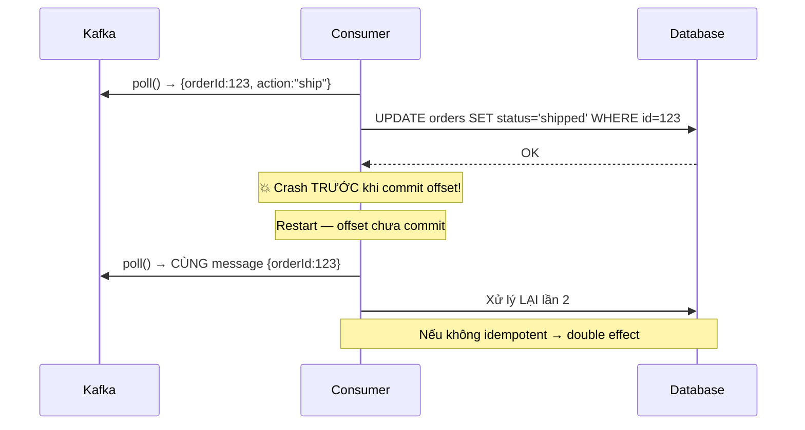
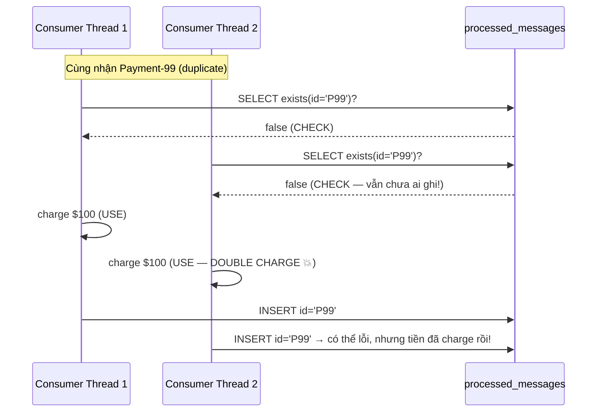
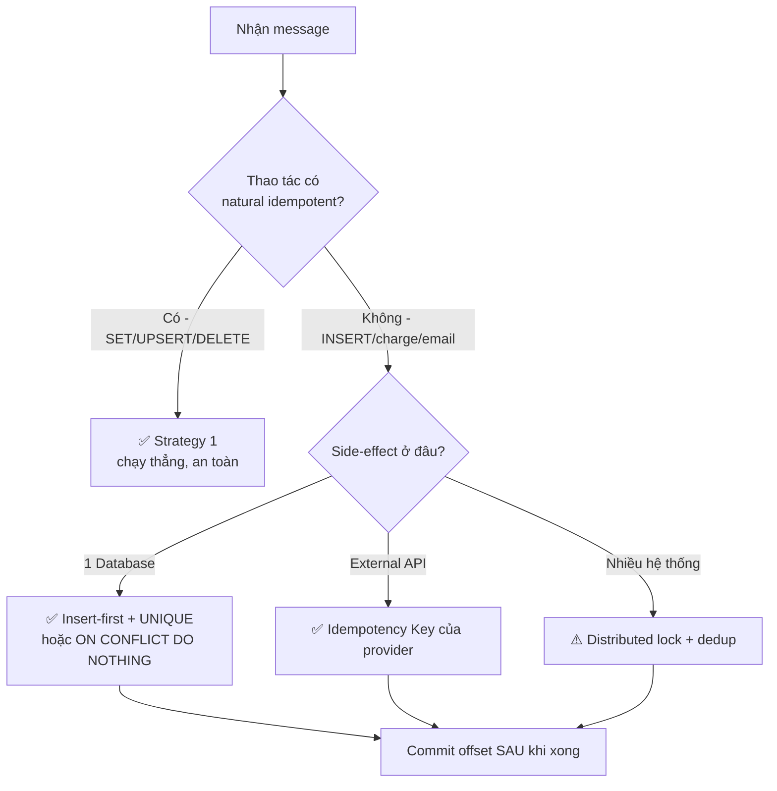

# Idempotency & TOCTOU Race Condition

> [!TIP]
> **Golden Rule của hệ phân tán**: Hãy thiết kế giả định **mỗi message sẽ đến ít nhất 2 lần**. Nếu code của bạn vẫn cho kết quả đúng khi xử lý lặp → bạn đã đạt idempotency.

Bài này đào sâu về **idempotency** (tính bất biến khi lặp) — một trong những thuộc tính quan trọng nhất khi xây dựng hệ thống message-driven. Nó bổ sung cho bài [Exactly-Once Semantics](/producers-consumers/exactly-once/): EOS nói về *delivery guarantee*, còn bài này tập trung vào *cách viết logic xử lý* sao cho an toàn khi duplicate xảy ra — kể cả khi có **nhiều thread/instance chạy song song** (phần TOCTOU).

---

## 1. Idempotency là gì?

Một thao tác là **idempotent** nếu thực hiện nó **nhiều lần** cho **cùng kết quả** như thực hiện **một lần**.

```
f(x) = f(f(x)) = f(f(f(x))) = ...
```

```
✅ IDEMPOTENT (lặp lại an toàn):
  SET status = 'shipped'          → chạy 100 lần vẫn = 'shipped'
  DELETE WHERE id = 123           → xoá lần 2 không đổi gì
  PUT /users/123 {name:"A"}       → ghi đè, kết quả như nhau
  balance = 500 (gán tuyệt đối)   → idempotent

❌ NON-IDEMPOTENT (lặp lại nguy hiểm):
  INSERT INTO orders (...)        → tạo dòng trùng
  balance = balance + 100         → cộng dồn mỗi lần gọi
  POST /payments {amount:100}     → charge mỗi lần
  counter++                       → tăng mỗi lần
```

> [!NOTE]
> Idempotency **không** có nghĩa là "không có side-effect". Nó có nghĩa là **side-effect không tích luỹ**: gọi lần 2 trở đi không làm thay đổi trạng thái thêm nữa.

### Vì sao Kafka *bắt buộc* phải quan tâm idempotency?

Kafka ở chế độ phổ biến nhất là **at-least-once**. Duplicate là chuyện **bình thường**, không phải lỗi hiếm gặp:

| Nguồn duplicate | Khi nào xảy ra |
|-----------------|----------------|
| Producer retry | ACK bị mất trên mạng → producer gửi lại |
| Consumer crash sau khi xử lý, trước khi commit offset | Restart → đọc lại message cũ |
| Consumer group **rebalance** | Partition bị reassign giữa chừng → message được xử lý lại bởi consumer khác |
| Reprocessing / replay | Reset offset để chạy lại, hoặc deploy lại service |



---

## 2. Hai loại Idempotency trong Kafka

Đừng nhầm lẫn — đây là **hai tầng khác nhau**, giải quyết **hai vấn đề khác nhau**.

```
┌──────────────────────────────────────────────────────────────┐
│ TẦNG 1: PRODUCER IDEMPOTENCY (Kafka lo hộ)                     │
│   - enable.idempotence=true                                   │
│   - Chống duplicate do PRODUCER RETRY (network-level)         │
│   - Phạm vi: 1 producer session, trong 1 partition            │
├──────────────────────────────────────────────────────────────┤
│ TẦNG 2: CONSUMER / PROCESSING IDEMPOTENCY (BẠN tự lo)         │
│   - Chống duplicate do CRASH, REBALANCE, REPLAY               │
│   - Đây là nơi TOCTOU race condition xuất hiện                │
│   - Phạm vi: business logic + database/API                    │
└──────────────────────────────────────────────────────────────┘
```

### 2.1 Producer Idempotency (built-in)

Khi `enable.idempotence=true`, broker dùng cặp **PID (Producer ID) + Sequence Number** để phát hiện và loại bỏ message trùng do retry. Chi tiết cơ chế này đã được mô tả trong bài [Exactly-Once Semantics](/producers-consumers/exactly-once/#part-1-producer-idempotency-built-in).

```yaml
spring:
  kafka:
    producer:
      properties:
        enable.idempotence: true
      acks: all                                    # bắt buộc (auto-set)
      retries: 2147483647
      properties:
        max.in.flight.requests.per.connection: 5   # ≤ 5 để giữ thứ tự
```

> [!WARNING]
> Producer idempotency **chỉ** chống duplicate do *automatic retry* trong **một** producer session. Nó **KHÔNG** giúp khi:
> - Producer restart → nhận PID mới → gửi lại cùng message logic.
> - Code gọi `send()` hai lần (bug ở tầng application).
> - Consumer xử lý lại do crash/rebalance.
>
> ⇒ Những trường hợp này phải xử lý ở **Tầng 2 (consumer idempotency)** — chủ đề chính của bài này.

### 2.2 Consumer / Processing Idempotency (trách nhiệm của bạn)

Đây là phần Kafka **không** làm hộ. Bạn phải đảm bảo: dù message được xử lý 1 hay N lần, **trạng thái cuối cùng vẫn đúng**.

Mỗi message cần một **idempotency key** ổn định (không đổi giữa các lần retry):

```
✅ Tốt: businessId có sẵn — orderId, paymentId, transactionId
✅ Tốt: eventId (UUID) do producer sinh và gắn vào payload
⚠️ Tránh: (topic, partition, offset) — sẽ ĐỔI sau khi reprocess/replay
⚠️ Tránh: timestamp xử lý — đổi mỗi lần
```

---

## 3. Các Strategy đạt Idempotency

### Strategy 1 — Natural Idempotency (tốt nhất, không cần thêm state)

Biến thao tác thành "ghi đè tuyệt đối" thay vì "tích luỹ".

```sql
-- ❌ Không idempotent
INSERT INTO orders (id, status) VALUES (auto_id, 'shipped');
UPDATE accounts SET balance = balance + 100 WHERE id = 1;

-- ✅ Idempotent: UPSERT (ghi đè)
INSERT INTO orders (id, status, updated_at)
VALUES (:orderId, :status, :updatedAt)
ON CONFLICT (id) DO UPDATE
SET status = EXCLUDED.status, updated_at = EXCLUDED.updated_at
WHERE orders.updated_at < EXCLUDED.updated_at;   -- chỉ apply event mới hơn
```

```java
@KafkaListener(topics = "order-events")
public void handle(OrderEvent event) {
    // UPSERT — gọi bao nhiêu lần cũng ra cùng kết quả
    orderRepository.upsert(event.getOrderId(), event.getStatus(), event.getUpdatedAt());
}
```

### Strategy 2 — Deduplication Table (dedup store)

Khi thao tác bản chất không idempotent (INSERT, gửi email, charge tiền), ta lưu lại "đã xử lý message nào" và **skip** nếu gặp lại.

```sql
CREATE TABLE processed_messages (
    message_id   VARCHAR(255) PRIMARY KEY,    -- UNIQUE constraint = lá chắn dedup
    processed_at TIMESTAMP DEFAULT NOW(),
    topic        VARCHAR(255)
);
```

Pattern "ngây thơ" mà **hầu hết mọi người viết đầu tiên** (và nó **có bug** — xem mục 4):

```java
// ⚠️ CÓ TOCTOU RACE CONDITION — đừng dùng nguyên bản này!
@KafkaListener(topics = "payments")
public void handle(PaymentEvent event) {
    String id = event.getPaymentId();
    if (processedRepo.existsById(id)) {   // (1) CHECK
        return;                            // đã xử lý → skip
    }
    paymentService.charge(event);          // (2) USE
    processedRepo.save(new Processed(id)); // (3) ghi dấu
}
```

### Strategy 3 — Idempotency Key cho External API

Đẩy trách nhiệm dedup cho hệ thống bên ngoài (Stripe, PayPal…) qua header idempotency key:

```java
RequestOptions options = RequestOptions.builder()
    .setIdempotencyKey(event.getPaymentId())   // Stripe tự khử trùng lặp
    .build();
PaymentIntent.create(params, options);          // gọi 2 lần → charge 1 lần
```

### Strategy 4 — Optimistic Locking / Version Check

Cho update cộng dồn hoặc cần thứ tự (vd: balance):

```sql
UPDATE accounts
SET balance = :newBalance, version = version + 1
WHERE id = :id AND version = :expectedVersion;   -- 0 row affected = đã bị xử lý
```

---

## 4. TOCTOU Race Condition — Deep Dive

> **TOCTOU = Time-Of-Check To Time-Of-Use**: một lớp lỗi race condition kinh điển, xảy ra khi bạn **kiểm tra** một điều kiện rồi **hành động** dựa trên kết quả đó, nhưng giữa hai bước, trạng thái **đã bị thay đổi** bởi một luồng khác. Quyết định của bạn bị ra dựa trên thông tin **đã cũ**.

### 4.1 Bản chất vấn đề

```
   THREAD A                          THREAD B
   ────────                          ────────
   CHECK: đã xử lý chưa? → CHƯA
                                     CHECK: đã xử lý chưa? → CHƯA
   USE:   charge tiền 💳
                                     USE:   charge tiền 💳   ← DOUBLE!
   ghi dấu processed
                                     ghi dấu processed
```

Khoảng trống giữa **CHECK** (bước 1) và **USE** (bước 2) chính là **cửa sổ race (race window)**. Bất kỳ ai cũng có thể "chen" vào giữa.

> [!WARNING]
> TOCTOU **không** phải lỗi hiếm trong Kafka. Nó xảy ra rất thực tế khi:
> - Nhiều consumer instance trong cùng group cùng nhận duplicate (ví dụ lúc **rebalance**, một partition tạm thời bị 2 consumer xử lý).
> - Listener container chạy **concurrency > 1** (nhiều thread cùng poll/xử lý).
> - Cùng một message được redeliver trong khi lần xử lý trước **chưa kịp ghi dấu**.

### 4.2 Vì sao pattern "check-then-act" ở Strategy 2 bị lỗi



Vấn đề cốt lõi: **CHECK và USE không nguyên tử (atomic)**. Việc `INSERT` ở cuối có UNIQUE constraint cũng **không cứu được**, vì tiền đã bị charge **trước khi** INSERT xảy ra.

### 4.3 Các cách KHỬ TOCTOU (đúng)

Nguyên tắc chung: **gộp CHECK và USE thành một thao tác nguyên tử**, hoặc **để database làm trọng tài** thông qua constraint/lock.

#### Fix 1 — "Insert-first" (để UNIQUE constraint quyết định) ⭐ khuyên dùng

Đảo ngược thứ tự: **ghi dấu TRƯỚC**, dùng chính UNIQUE constraint của DB làm điểm đồng bộ nguyên tử. Ai INSERT thành công thì mới được xử lý.

```java
@KafkaListener(topics = "payments")
public void handle(PaymentEvent event) {
    String id = event.getPaymentId();
    try {
        // CHECK + claim "quyền xử lý" trong CÙNG một thao tác nguyên tử
        processedRepo.insert(id);                  // INSERT ... (PK = id)
    } catch (DataIntegrityViolationException dup) {
        log.info("Duplicate, đã được xử lý: {}", id);
        return;                                    // ai đó đã claim trước → skip
    }
    paymentService.charge(event);                  // chỉ DUY NHẤT 1 thread tới đây
}
```

> [!TIP]
> UNIQUE/PRIMARY KEY constraint là một **atomic test-and-set** do database đảm bảo. Chỉ **một** transaction INSERT được `id`, các transaction còn lại nhận lỗi vi phạm constraint. Đây là cách đơn giản và đáng tin cậy nhất để diệt TOCTOU.

#### Fix 2 — Gói CHECK + USE + ghi dấu trong MỘT transaction

Để cả ba bước nằm trong cùng transaction DB, và dùng `INSERT` (không phải `SELECT` trước):

```java
@KafkaListener(topics = "payments")
@Transactional
public void handle(PaymentEvent event) {
    try {
        processedRepo.save(new Processed(event.getPaymentId()));  // dấu dedup
    } catch (DataIntegrityViolationException dup) {
        return;   // rollback an toàn, không charge
    }
    // Cùng transaction: nếu charge fail → rollback luôn cả dấu dedup
    accountRepo.upsertCharge(event.getPaymentId(), event.getAmount());
}
```

> [!WARNING]
> Transaction một mình **không đủ** nếu bạn vẫn `SELECT ... ` rồi `INSERT` ở mức isolation `READ_COMMITTED` (mặc định của Postgres/MySQL). Hai transaction song song vẫn có thể cùng đọc "chưa tồn tại". Phải dựa vào **UNIQUE constraint** (Fix 1) hoặc **khoá** (Fix 3), hoặc nâng isolation lên `SERIALIZABLE`.

#### Fix 3 — Atomic conditional write (UPSERT có điều kiện)

Gộp toàn bộ "nếu chưa xử lý thì xử lý" vào **một câu SQL** — không còn khe hở giữa check và use:

```sql
-- INSERT có điều kiện: chỉ thành công nếu chưa tồn tại
INSERT INTO payments (payment_id, amount, status)
VALUES (:paymentId, :amount, 'CHARGED')
ON CONFLICT (payment_id) DO NOTHING;
-- rowsAffected = 1 → mình là người xử lý; = 0 → đã có người khác
```

```java
int rows = jdbc.update(SQL, event.getPaymentId(), event.getAmount());
if (rows == 1) {
    externalGateway.charge(event);   // chỉ chạy khi mình "thắng" cuộc đua
}
```

#### Fix 4 — Distributed lock (khi side-effect ở ngoài DB)

Khi không thể dựa vào constraint của một DB duy nhất (vd: gọi nhiều hệ thống), dùng khoá phân tán (Redis `SET NX`, Redisson, ZooKeeper):

```java
String lockKey = "lock:payment:" + event.getPaymentId();
boolean acquired = redis.setIfAbsent(lockKey, "1", Duration.ofSeconds(30));  // atomic NX
if (!acquired) return;             // thread khác đang/đã xử lý
try {
    if (processedRepo.existsById(event.getPaymentId())) return;  // double-check
    paymentService.charge(event);
    processedRepo.save(new Processed(event.getPaymentId()));
} finally {
    redis.delete(lockKey);
}
```

> [!NOTE]
> Distributed lock đổi tính đúng đắn lấy thêm độ phức tạp (lock TTL, fencing token, lock service phải HA). Ưu tiên Fix 1/Fix 3 (đẩy việc đồng bộ cho DB constraint) khi side-effect chính nằm trong một database.

### 4.4 So sánh các cách Fix

| Cách | Cơ chế nguyên tử | Phù hợp khi | Bẫy thường gặp |
|------|------------------|-------------|----------------|
| Insert-first (Fix 1) | UNIQUE / PK constraint | Side-effect + dedup trong 1 DB | Phải xử lý đúng exception trùng |
| Transaction (Fix 2) | DB transaction + UNIQUE | Nhiều thao tác DB cùng nhau | `SELECT`-then-`INSERT` ở READ_COMMITTED vẫn race |
| Conditional write (Fix 3) | `ON CONFLICT DO NOTHING` | Logic gọn trong 1 câu SQL | Side-effect ngoài DB không bao trùm |
| Distributed lock (Fix 4) | Lock service (Redis/ZK) | Side-effect ở nhiều hệ thống | Lock TTL hết hạn sớm → mất mutual exclusion |

### 4.5 TOCTOU ngoài Kafka (để hiểu bản chất)

TOCTOU là khái niệm chung của hệ thống, không riêng Kafka:

```java
// Filesystem: file có thể bị đổi/xoá GIỮA check và use
if (file.exists() && file.canRead()) {   // CHECK
    read(file);                           // USE — file có thể đã bị xoá/đổi!
}
// ✅ Đúng: cứ mở rồi bắt exception (atomic), không check-then-open

// Security cổ điển: access(2) rồi open(2) → kẽ hở đổi symlink → leo thang quyền
```

Mẫu số chung: **đừng tin vào kết quả CHECK đã cũ**. Hoặc gộp check+use nguyên tử, hoặc thực hiện thẳng thao tác và xử lý lỗi.

---

## 5. Idempotency trong Spring Kafka — lưu ý thực chiến

```yaml
spring:
  kafka:
    consumer:
      enable-auto-commit: false        # tự quản offset → kiểm soát "xử lý xong rồi mới commit"
      isolation-level: read_committed   # nếu nguồn dùng transactions
    listener:
      ack-mode: record                  # commit sau MỖI record xử lý xong
      concurrency: 3                    # ⚠️ nhiều thread → TOCTOU phải được xử lý đúng!
```

> [!WARNING]
> `concurrency > 1` nghĩa là nhiều thread cùng xử lý các partition khác nhau. Hai bản duplicate của **cùng key** thường rơi vào **cùng partition** (nếu producer dùng key), nên cùng một thread xử lý tuần tự — giảm rủi ro. Nhưng trong lúc **rebalance**, hoặc khi message gửi **không có key**, duplicate có thể bị xử lý song song ⇒ **vẫn phải** dùng các Fix ở mục 4.

**Checklist xử lý duplicate đúng cách:**

```
✅ Mỗi message mang idempotency key ổn định (businessId / eventId), không phải offset
✅ Dùng UNIQUE/PK constraint làm trọng tài (insert-first), KHÔNG check-then-act
✅ Side-effect + ghi dấu dedup nằm trong cùng 1 transaction (hoặc 1 atomic write)
✅ Commit offset SAU khi xử lý xong (at-least-once)
✅ Dọn dedup table định kỳ (TTL ~ retention của topic, vd 7–30 ngày)
✅ Có test mô phỏng: gửi cùng message 2 lần + chạy song song 2 thread
```

---

## 6. Tổng kết



- **Idempotency** = lặp lại không đổi kết quả. Trong Kafka at-least-once, đây là **bắt buộc**, không phải tùy chọn.
- **Producer idempotency** (Kafka lo) chỉ chống retry-duplicate trong 1 session; **consumer idempotency** (bạn lo) chống crash/rebalance/replay duplicate.
- **TOCTOU** xuất hiện ngay khi bạn viết "check rồi mới act" mà hai bước không nguyên tử — đặc biệt nguy hiểm khi có nhiều thread/instance.
- Diệt TOCTOU bằng cách **biến check+act thành nguyên tử**: ưu tiên **insert-first + UNIQUE constraint** hoặc **conditional write**, dùng distributed lock chỉ khi side-effect trải trên nhiều hệ thống.

<Cards>
  <Card title="Exactly-Once Semantics" href="/producers-consumers/exactly-once/" description="Idempotent producer (PID + Seq), 3 delivery guarantees" />
  <Card title="Kafka Transactions" href="/producers-consumers/transactions/" description="Dual Write Problem, Outbox Pattern" />
  <Card title="Retry & DLT" href="/producers-consumers/retry-dlt/" description="Non-blocking retries, @RetryableTopic" />
  <Card title="Consumer Groups" href="/core-concepts/consumer-groups/" description="Rebalancing và AckMode" />
</Cards>
