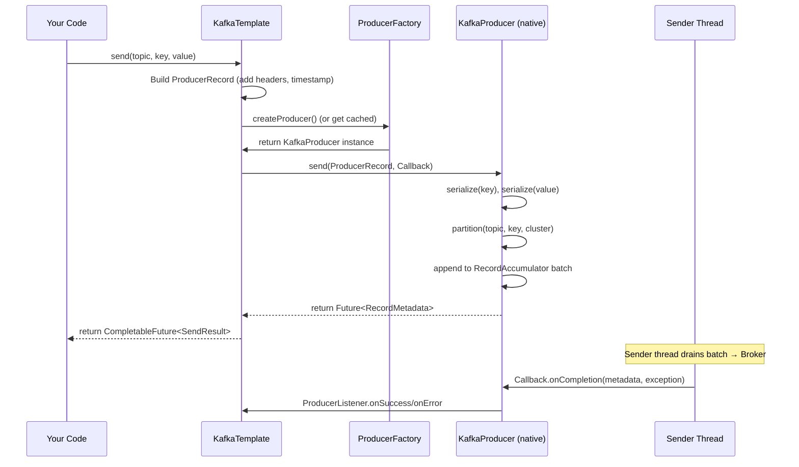

## Mục lục

- [Bối cảnh: send() trả về Future nhưng bạn ignore nó](#1-bối-cảnh-send-trả-về-future-nhưng-bạn-ignore-nó)
- [KafkaTemplate — Kiến trúc bên trong](#2-kafkatemplate--kiến-trúc-bên-trong)
- [ProducerFactory — Connection lifecycle](#3-producerfactory--connection-lifecycle)
- [4 Send Patterns — Từ fire-and-forget đến transactional](#4-4-send-patterns--từ-fire-and-forget-đến-transactional)
- [Callback & CompletableFuture — Async error handling](#5-callback--completablefuture--async-error-handling)
- [ProducerRecord — Anatomy đầy đủ](#6-producerrecord--anatomy-đầy-đủ)
- [Headers — Metadata pipeline](#7-headers--metadata-pipeline)
- [ProducerInterceptor — Cross-cutting concerns](#8-producerinterceptor--cross-cutting-concerns)
- [Transactional KafkaTemplate](#9-transactional-kafkatemplate)
- [RoutingKafkaTemplate — Multi-topic type-safe](#10-routingkafkatemplate--multi-topic-type-safe)
- [ReplyingKafkaTemplate — Request/Reply pattern](#11-replyingkafkatemplate--requestreply-pattern)
- [Error Handling & Retry ở Producer layer](#12-error-handling--retry-ở-producer-layer)
- [Metrics & Monitoring](#13-metrics--monitoring)
- [Common Pitfalls](#14-common-pitfalls)
- [Tóm tắt — Cheat sheet](#15-tóm-tắt--cheat-sheet)

---

## 1. Bối cảnh: send() trả về Future nhưng bạn ignore nó

```java
// Code đang chạy trên production — ai đó viết 6 tháng trước
@Service
public class OrderEventPublisher {
    @Autowired KafkaTemplate<String, OrderEvent> template;

    public void publishOrderCreated(Order order) {
        template.send("order-events", order.getId(), new OrderCreatedEvent(order));
        // ← Future bị IGNORE! Nếu gửi thất bại → SILENT DATA LOSS
        //    Không ai biết, không có alert, không có retry
    }
}
```

6 tháng sau, team phát hiện 0.3% orders không bao giờ đến analytics service. Root cause: network blips vào peak hours → ProduceRequest fail → no one checks the Future → messages biến mất.

> [!IMPORTANT]
> `KafkaTemplate.send()` là **async**. Nó trả về `CompletableFuture<SendResult>` — nếu bạn không handle nó, lỗi bị nuốt âm thầm. Doc này cover mọi pattern từ fire-and-forget (khi nào acceptable) đến production-grade error handling.

---

## 2. KafkaTemplate — Kiến trúc bên trong

### 2.1. Class hierarchy

```
KafkaTemplate<K, V>
├── implements KafkaOperations<K, V>
├── wraps: ProducerFactory<K, V>         → tạo/cache KafkaProducer instances
├── uses:  ProducerListener<K, V>        → callback khi send success/failure
├── uses:  ProducerInterceptor<K, V>     → pre-send hook
├── uses:  RecordMessageConverter        → convert Message → ProducerRecord
└── optional: transactional.id-prefix    → enable transactions
```

### 2.2. send() internal flow



---

## 3. ProducerFactory — Connection lifecycle

### 3.1. DefaultKafkaProducerFactory

```java
// Spring tạo 1 Factory duy nhất, factory quản lý Producer instances
@Bean
public ProducerFactory<String, OrderEvent> producerFactory() {
    Map<String, Object> props = Map.of(
        ProducerConfig.BOOTSTRAP_SERVERS_CONFIG, "kafka:9092",
        ProducerConfig.KEY_SERIALIZER_CLASS_CONFIG, StringSerializer.class,
        ProducerConfig.VALUE_SERIALIZER_CLASS_CONFIG, JsonSerializer.class,
        ProducerConfig.ACKS_CONFIG, "all",
        ProducerConfig.ENABLE_IDEMPOTENCE_CONFIG, true
    );
    return new DefaultKafkaProducerFactory<>(props);
}
```

### 3.2. Producer caching — Non-transactional vs Transactional

```
Non-transactional:
  DefaultKafkaProducerFactory giữ 1 singleton KafkaProducer (thread-safe)
  → Mọi thread share cùng 1 producer instance
  → send() thread-safe nhờ internal lock per-partition trong RecordAccumulator

Transactional:
  Mỗi thread cần 1 producer riêng (vì transaction state là per-producer)
  → ProducerFactory dùng ThreadLocal cache
  → producerPerThread=true hoặc pool of producers
  → Cẩn thận: leak nếu không close!
```

### 3.3. Producer lifecycle events

| Event | Hành vi |
|-------|---------|
| First `send()` call | Factory lazy-create Producer (connect to cluster) |
| Application shutdown | `KafkaTemplate.destroy()` → flush + close Producer |
| Transactional commit/abort | Producer trả lại pool (không close) |
| Connection error | Producer tự reconnect (background, transparent) |
| `AuthenticationException` | Producer die, factory tạo mới |

---

## 4. 4 Send Patterns — Từ fire-and-forget đến transactional

### Pattern 1: Fire-and-Forget (chỉ cho non-critical data)

```java
// Acceptable cho: metrics, logs, non-critical events
template.send("app-metrics", metricEvent);
// Không check result — nếu fail thì chấp nhận mất
```

### Pattern 2: Async with Callback (RECOMMENDED default)

```java
CompletableFuture<SendResult<String, OrderEvent>> future =
    template.send("order-events", order.getId(), event);

future.whenComplete((result, ex) -> {
    if (ex == null) {
        log.debug("Sent to partition={}, offset={}",
            result.getRecordMetadata().partition(),
            result.getRecordMetadata().offset());
    } else {
        log.error("Failed to send order event: {}", order.getId(), ex);
        // Retry logic, DLQ, alert...
        failedEventStore.save(order.getId(), event, ex);
    }
});
```

### Pattern 3: Synchronous (blocking — cho critical path)

```java
try {
    SendResult<String, OrderEvent> result =
        template.send("payment-events", paymentId, event).get(10, TimeUnit.SECONDS);
    // Chắc chắn đã ghi thành công → proceed
    log.info("Payment event confirmed at offset {}", result.getRecordMetadata().offset());
} catch (ExecutionException e) {
    // ProduceRequest failed
    throw new PaymentEventFailedException(paymentId, e.getCause());
} catch (TimeoutException e) {
    // Quá 10s chưa ack — broker có thể overloaded
    throw new PaymentEventTimeoutException(paymentId, e);
}
```

### Pattern 4: Transactional (atomic multi-produce)

```java
template.executeInTransaction(ops -> {
    ops.send("order-events", orderId, orderCreated);
    ops.send("inventory-events", skuId, stockReserved);
    ops.send("notification-events", userId, orderConfirmation);
    // All 3 sends atomic: all commit or all abort
    return null;
});
```

---

## 5. Callback & CompletableFuture — Async error handling

### 5.1. ProducerListener (global callback)

```java
@Bean
public KafkaTemplate<String, Object> kafkaTemplate(ProducerFactory<String, Object> pf) {
    KafkaTemplate<String, Object> template = new KafkaTemplate<>(pf);

    template.setProducerListener(new ProducerListener<>() {
        @Override
        public void onSuccess(ProducerRecord<String, Object> record,
                              RecordMetadata metadata) {
            metrics.incrementCounter("kafka.send.success",
                "topic", metadata.topic());
        }

        @Override
        public void onError(ProducerRecord<String, Object> record,
                            RecordMetadata metadata, Exception exception) {
            metrics.incrementCounter("kafka.send.error",
                "topic", record.topic(),
                "error", exception.getClass().getSimpleName());
            alertService.sendAlert("Kafka send failed: " + record.topic());
        }
    });

    return template;
}
```

### 5.2. Per-send callback vs Global listener

| | Per-send (Future.whenComplete) | Global (ProducerListener) |
|--|---|---|
| Scope | 1 message | ALL messages |
| Use case | Business logic per message | Cross-cutting (metrics, alerts) |
| Error handling | Specific retry/fallback | Generic logging/alerting |

---

## 6. ProducerRecord — Anatomy đầy đủ

```java
// Mọi send() cuối cùng đều tạo ProducerRecord
ProducerRecord<String, OrderEvent> record = new ProducerRecord<>(
    "order-events",          // topic (required)
    2,                       // partition (optional — override partitioner)
    System.currentTimeMillis(), // timestamp (optional — default: producer time)
    "order-123",             // key (optional — used for partitioning)
    new OrderCreatedEvent(), // value (required)
    headers                  // headers (optional — metadata)
);
```

### 6.1. KafkaTemplate convenience methods

| Method | Tạo ProducerRecord với |
|--------|----------------------|
| `send(topic, value)` | No key, no partition, no timestamp |
| `send(topic, key, value)` | Key (partitioning) |
| `send(topic, partition, key, value)` | Explicit partition |
| `send(topic, partition, timestamp, key, value)` | Everything explicit |
| `send(Message<V>)` | Spring Message → ProducerRecord conversion |

---

## 7. Headers — Metadata pipeline

### 7.1. Common header patterns

```java
// Distributed tracing
headers.add("trace-id", traceId.getBytes());
headers.add("span-id", spanId.getBytes());

// Event metadata
headers.add("event-type", "ORDER_CREATED".getBytes());
headers.add("source-service", "order-service".getBytes());
headers.add("correlation-id", correlationId.getBytes());
headers.add("produced-at", String.valueOf(Instant.now().toEpochMilli()).getBytes());

// Schema versioning
headers.add("schema-version", "2".getBytes());
```

### 7.2. Tại sao dùng Headers thay vì nhét vào value?

- **Consumer filtering**: Đọc headers mà KHÔNG deserialize value (rẻ!)
- **Schema evolution**: Header chứa version → consumer biết dùng deserializer nào
- **Cross-cutting**: Tracing, auth context — tách khỏi business payload
- **Routing**: SMT (Single Message Transform) trong Kafka Connect đọc headers

---

## 8. ProducerInterceptor — Cross-cutting concerns

```java
public class AuditInterceptor implements ProducerInterceptor<String, Object> {

    @Override
    public ProducerRecord<String, Object> onSend(ProducerRecord<String, Object> record) {
        // Enrich EVERY message with audit context
        record.headers().add("sent-by", SecurityContext.getCurrentUser().getBytes());
        record.headers().add("sent-at", Instant.now().toString().getBytes());
        record.headers().add("client-ip", RequestContext.getClientIp().getBytes());
        return record;
    }

    @Override
    public void onAcknowledgement(RecordMetadata metadata, Exception exception) {
        if (exception != null) {
            auditLog.recordFailure(metadata, exception);
        }
    }

    @Override
    public void close() { }

    @Override
    public void configure(Map<String, ?> configs) { }
}
```

```yaml
spring:
  kafka:
    producer:
      properties:
        interceptor.classes: com.example.AuditInterceptor,com.example.MetricsInterceptor
```

> [!NOTE]
> Interceptors chạy **trong application thread** (trước khi message vào RecordAccumulator). Nếu interceptor chậm → `send()` chậm → back-pressure. Giữ interceptor nhẹ, KHÔNG làm I/O.

---

## 9. Transactional KafkaTemplate

### 9.1. executeInTransaction vs @Transactional

```java
// Option 1: Programmatic (recommended cho Kafka-only transactions)
template.executeInTransaction(ops -> {
    ops.send("topic-a", key, value1);
    ops.send("topic-b", key, value2);
    return null;  // commit khi lambda return bình thường
    // exception → abort
});

// Option 2: @Transactional (cho Spring-managed transactions, DB + Kafka)
@Transactional
public void processOrder(Order order) {
    orderRepository.save(order);                        // DB
    template.send("order-events", order.getId(), event); // Kafka
    // Commit cả DB + Kafka khi method return
    // Caveat: Spring dùng ChainedTransactionManager hoặc JTA
}
```

### 9.2. Producer-per-thread trong transactional mode

```
Thread 1 → Producer A (PID=1001, txn-prefix-0)
Thread 2 → Producer B (PID=1002, txn-prefix-1)
Thread 3 → Producer C (PID=1003, txn-prefix-2)

Mỗi thread cần producer riêng vì transaction state (PID, epoch, sequence)
là per-producer. Nếu share → corrupt transaction state.
```

---

## 10. RoutingKafkaTemplate — Multi-topic type-safe

Khi bạn cần gửi đến nhiều topics với serializers khác nhau:

```java
@Bean
public RoutingKafkaTemplate routingTemplate(ProducerFactory<Object, Object> defaultPf) {
    // JSON serializer cho order-events
    Map<String, Object> jsonProps = Map.of(
        ProducerConfig.VALUE_SERIALIZER_CLASS_CONFIG, JsonSerializer.class);
    ProducerFactory<Object, Object> jsonPf = new DefaultKafkaProducerFactory<>(jsonProps);

    // Avro serializer cho user-events
    Map<String, Object> avroProps = Map.of(
        ProducerConfig.VALUE_SERIALIZER_CLASS_CONFIG, KafkaAvroSerializer.class);
    ProducerFactory<Object, Object> avroPf = new DefaultKafkaProducerFactory<>(avroProps);

    // Route by topic pattern
    Map<Pattern, ProducerFactory<Object, Object>> routes = new LinkedHashMap<>();
    routes.put(Pattern.compile("order-.*"), jsonPf);
    routes.put(Pattern.compile("user-.*"), avroPf);
    routes.put(Pattern.compile(".*"), defaultPf);  // fallback

    return new RoutingKafkaTemplate(routes);
}
```

---

## 11. ReplyingKafkaTemplate — Request/Reply pattern

```java
// Synchronous request-reply over Kafka (RPC-like)
@Bean
public ReplyingKafkaTemplate<String, Request, Response> replyingTemplate(
        ProducerFactory<String, Request> pf,
        ConcurrentMessageListenerContainer<String, Response> repliesContainer) {
    return new ReplyingKafkaTemplate<>(pf, repliesContainer);
}

// Usage:
ProducerRecord<String, Request> record =
    new ProducerRecord<>("request-topic", request);
RequestReplyFuture<String, Request, Response> future =
    replyingTemplate.sendAndReceive(record, Duration.ofSeconds(10));

// Blocks until response arrives on reply topic (or timeout)
ConsumerRecord<String, Response> response = future.get();
```

---

## 12. Error Handling & Retry ở Producer layer

### 12.1. Retriable vs Non-retriable errors

| Type | Examples | Producer behavior |
|------|----------|-------------------|
| **Retriable** | `NetworkException`, `NotLeaderOrFollowerException`, `TimeoutException` | Auto-retry (up to `delivery.timeout.ms`) |
| **Non-retriable** | `SerializationException`, `RecordTooLargeException`, `AuthorizationException` | Fail immediately, no retry |

### 12.2. Production error handling pattern

```java
@Component
@RequiredArgsConstructor
public class ResilientEventPublisher {
    private final KafkaTemplate<String, Object> template;
    private final FailedEventRepository failedEventRepo;

    public void publish(String topic, String key, Object event) {
        template.send(topic, key, event).whenComplete((result, ex) -> {
            if (ex != null) {
                handleSendFailure(topic, key, event, ex);
            }
        });
    }

    private void handleSendFailure(String topic, String key, Object event, Throwable ex) {
        Throwable cause = ex instanceof ExecutionException ? ex.getCause() : ex;

        if (cause instanceof SerializationException) {
            // Non-retriable: log and alert (data issue)
            log.error("Serialization failed for key={}", key, cause);
            alertService.critical("Kafka serialization error", cause);
        } else {
            // Retriable failed after exhausting retries: persist for later retry
            failedEventRepo.save(new FailedEvent(topic, key, event, cause.getMessage()));
            log.warn("Persisted failed event for retry: topic={}, key={}", topic, key);
        }
    }
}
```

---

## 13. Metrics & Monitoring

### 13.1. KafkaTemplate observable metrics (Spring Boot Actuator)

```yaml
management:
  metrics:
    tags:
      application: order-service
  endpoints:
    web:
      exposure:
        include: prometheus
```

Key metrics exposed via Micrometer:

| Metric | Meaning | Alert on |
|--------|---------|----------|
| `kafka.producer.record.send.total` | Total sends | Rate drop |
| `kafka.producer.record.error.total` | Failed sends | > 0 for > 1 min |
| `kafka.producer.request.latency.avg` | Avg broker latency | > 100ms |
| `kafka.producer.batch.size.avg` | Avg batch bytes | < 1KB (batching inefficient) |
| `kafka.producer.buffer.available.bytes` | Free buffer | < 10% (back-pressure incoming) |

---

## 14. Common Pitfalls

| Pitfall | Code | Fix |
|---------|------|-----|
| Ignoring send Future | `template.send(...)` no `.whenComplete()` | Always handle Future |
| Blocking in callback | `future.get()` inside async callback | Use separate executor |
| Wrong serializer | `ClassCastException` at runtime | Match serializer to type |
| Missing `acks=all` | Data loss on broker failure | Config `acks: all` |
| Transactional + shared producer | `IllegalStateException` | `producerPerThread: true` |
| Large messages (>1MB) | `RecordTooLargeException` | Increase `max.request.size` + broker `message.max.bytes` |

---

## 15. Tóm tắt — Cheat sheet

```
KAFKATEMPLATE INTERNALS:
  KafkaTemplate → ProducerFactory → KafkaProducer (cached singleton)
  send() → serialize → partition → RecordAccumulator → Sender → Broker

4 SEND PATTERNS:
  1. Fire-and-forget: template.send(...) — non-critical only
  2. Async callback:  send(...).whenComplete() — RECOMMENDED
  3. Synchronous:     send(...).get(timeout) — critical path
  4. Transactional:   executeInTransaction() — atomic multi-write

PRODUCER LIFECYCLE:
  Non-txn: 1 producer singleton (thread-safe, shared)
  Txn:     1 producer per thread (ThreadLocal cache)

ERROR HANDLING:
  Retriable: auto-retry until delivery.timeout.ms
  Non-retriable: fail immediately → handle in callback
  Production: persist failed events → retry later

5 NGUYÊN TẮC:
1. NEVER ignore send() Future — silent data loss
2. Async callback cho 99% cases, sync .get() cho critical path
3. ProducerListener cho cross-cutting (metrics), per-send callback cho business
4. Headers > stuffing metadata in value — cheaper, filterable
5. Transactional KafkaTemplate = 1 producer per thread (memory cost)
```
