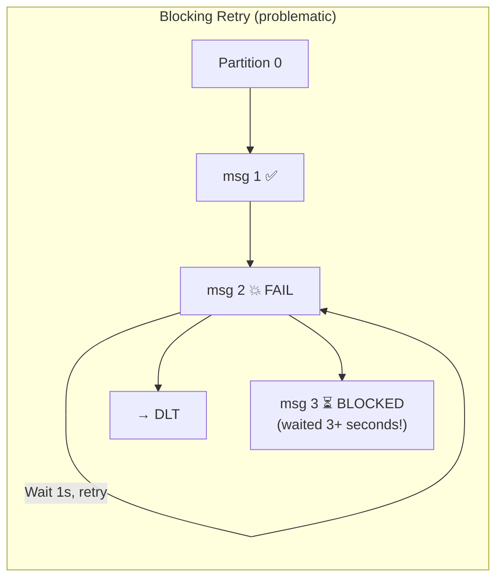
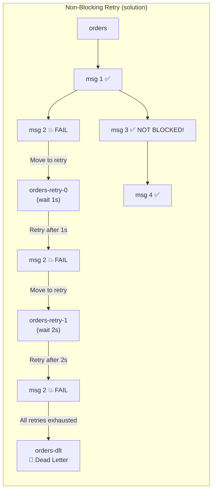
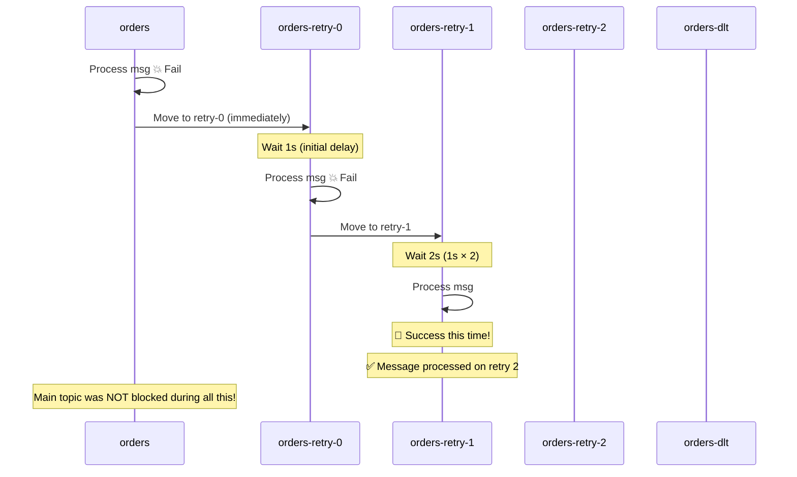
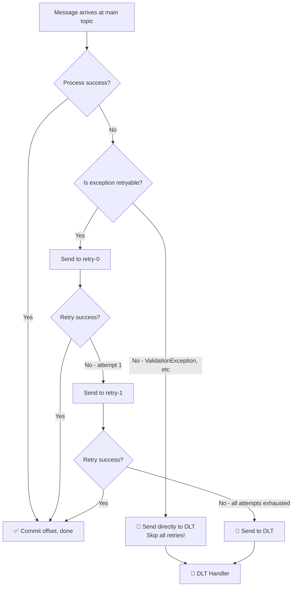
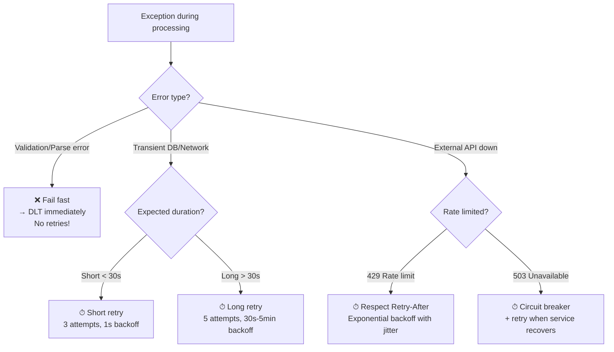

# Retry & Dead Letter Topic (DLT)

## Mục lục

- [The Poison Pill Problem](#the-poison-pill-problem)
- [Blocking Retry (Default — Nguy hiểm)](#blocking-retry-default--nguy-hiểm)
- [Non-Blocking Retries: Retry Topics](#non-blocking-retries-retry-topics)
- [@RetryableTopic: Annotation-based Config](#retryabletopic-annotation-based-config)
- [Retry Topology: Cách hoạt động](#retry-topology-cách-hoạt-động)
- [Dead Letter Topic (DLT)](#dead-letter-topic-dlt)
- [Phân loại Retryable vs Non-Retryable Errors](#phân-loại-retryable-vs-non-retryable-errors)
- [DLT Processing Patterns](#dlt-processing-patterns)
- [Production Configuration](#production-configuration)

---

## The Poison Pill Problem

**Poison Pill** là message mà consumer không thể xử lý được — ném exception mỗi lần thử. Không có strategy, nó sẽ **block toàn bộ partition**.

```
┌─────────────────────────────────────────────────────────────────────────────────┐
│                        THE POISON PILL PROBLEM                                  │
├─────────────────────────────────────────────────────────────────────────────────┤
│                                                                                 │
│   Partition 0:                                                                  │
│   ┌────────┬──────────┬────────┬────────┬────────┐                              │
│   │ msg 1  │  msg 2   │ msg 3  │ msg 4  │ msg 5  │                              │
│   │  ✅ OK │ 💥 POISON│  ⏳    │  ⏳    │  ⏳    │                              │
│   └────────┴──────────┴────────┴────────┴────────┘                              │
│                                                                                 │
│   What happens without a strategy:                                              │
│   → Consumer processes msg 1 ✅                                                 │
│   → Consumer processes msg 2 💥 Exception!                                      │
│   → Kafka retries msg 2 💥 Exception again!                                     │
│   → Retry... retry... retry...                                                  │
│   → msg 3, 4, 5 are STUCK FOREVER                                               │
│   → Consumer lag grows indefinitely                                             │
│   → Service appears stuck/unhealthy                                             │
│                                                                                 │
│   Impact: ONE bad message can halt ALL processing on that partition             │
└─────────────────────────────────────────────────────────────────────────────────┘
```

---

## Blocking Retry (Default — Nguy hiểm)

Default behavior của Spring Kafka khi dùng `DefaultErrorHandler` với `FixedBackOff`:



**Vấn đề**: Trong thời gian retry msg 2 (3s), msg 3, 4, 5 bị chặn. Với nhiều messages poison, delay tích lũy cực lớn.

---

## Non-Blocking Retries: Retry Topics

**Giải pháp**: Thay vì retry tại chỗ, chuyển message sang **secondary retry topic**. Main partition tiếp tục xử lý các messages khác!



**Key insight**: Main topic tiếp tục chạy. Message hỏng bị "parked" trong retry topics cho đến khi hết attempts hoặc thành công.

---

## @RetryableTopic: Annotation-based Config

Cách đơn giản nhất để cấu hình non-blocking retries:

```java
@Service
@Slf4j
public class OrderConsumer {

    @RetryableTopic(
        attempts = "4",                           // 1 original + 3 retries
        backoff = @Backoff(
            delay = 1000,                         // 1s initial delay
            multiplier = 2.0,                     // Exponential backoff
            maxDelay = 10000                      // Max 10s between retries
        ),
        autoCreateTopics = "true",                // Auto-create retry/DLT topics
        topicSuffixingStrategy = TopicSuffixingStrategy.SUFFIX_WITH_INDEX_VALUE,
        // Only retry on these exceptions:
        include = {TransientServiceException.class, DatabaseConnectionException.class},
        // Never retry these (fail fast → DLT):
        exclude = {InvalidMessageException.class, ValidationException.class}
    )
    @KafkaListener(topics = "orders", groupId = "order-group")
    public void processOrder(
            @Payload String order,
            @Header(KafkaHeaders.RECEIVED_TOPIC) String topic) {

        log.info("Processing from topic: {}, message: {}", topic, order);
        orderService.process(order);
    }

    @DltHandler
    public void handleDlt(
            String order,
            @Header(KafkaHeaders.RECEIVED_TOPIC) String topic,
            @Header(KafkaHeaders.EXCEPTION_MESSAGE) String exceptionMessage) {

        log.error("Message failed all retries. Topic: {}, Error: {}", topic, exceptionMessage);

        // Options:
        // 1. Alert ops team
        alertService.sendAlert("DLT message received", order, exceptionMessage);
        // 2. Store in DB for manual review
        failedMessageRepo.save(new FailedMessage(order, exceptionMessage));
        // 3. Send Slack/PagerDuty notification
    }
}
```

### Bean-based Configuration (more control)

```java
@Configuration
@EnableKafka
public class KafkaRetryConfig {

    @Bean
    public RetryTopicConfiguration orderRetryTopicConfig(
            KafkaTemplate<String, String> template) {

        return RetryTopicConfigurationBuilder
            .newInstance()
            // Attempt schedule: attempt 1 immediately, retry 1 after 1s, retry 2 after 5s, retry 3 after 30s
            .exponentialBackoff(1_000, 2, 30_000)
            .maxAttempts(4)
            .includeTopic("orders")
            // Không retry validation errors
            .doNotRetryOnDexceptions(ValidationException.class, JsonParseException.class)
            // Custom DLT processing bean
            .dltHandlerMethod("orderDltConsumer", "handle")
            .create(template);
    }
}
```

---

## Retry Topology: Cách hoạt động

### Topics được tạo tự động

Với config `attempts = "4"` và topic `orders`:

| Topic | Purpose | Delay trước khi retry |
|-------|---------|----------------------|
| `orders` | Original topic | — |
| `orders-retry-0` | Retry attempt 1 | 1s |
| `orders-retry-1` | Retry attempt 2 | 2s |
| `orders-retry-2` | Retry attempt 3 | 4s |
| `orders-dlt` | Dead Letter | (no retry) |

### Sequence Diagram với Exponential Backoff



### Headers được ghi lại

Kafka tự động ghi vào message headers khi chuyển qua retry topics:

```java
@KafkaListener(topics = "orders-retry-0")
public void handleRetry(
        String message,
        @Header(RetryTopicHeaders.DEFAULT_HEADER_ATTEMPTS) int attemptNumber,
        @Header(RetryTopicHeaders.DEFAULT_HEADER_ORIGINAL_TIMESTAMP) long originalTimestamp,
        @Header(KafkaHeaders.EXCEPTION_MESSAGE) String lastError) {

    log.warn("Retry attempt #{}, original error: {}", attemptNumber, lastError);
}
```

---

## Dead Letter Topic (DLT)

### Khi nào message đến DLT?



### DLT Handler hoàn chỉnh

```java
@Service
@Slf4j
public class OrderDltHandler {

    private final AlertService alertService;
    private final FailedMessageRepository repo;
    private final SlackNotifier slack;

    @DltHandler
    public void handle(
            String message,
            @Header(KafkaHeaders.RECEIVED_TOPIC) String topic,
            @Header(KafkaHeaders.RECEIVED_PARTITION) int partition,
            @Header(KafkaHeaders.OFFSET) long offset,
            @Header(KafkaHeaders.EXCEPTION_FQCN) String exceptionClass,
            @Header(KafkaHeaders.EXCEPTION_MESSAGE) String exceptionMessage,
            @Header(RetryTopicHeaders.DEFAULT_HEADER_ATTEMPTS) int attempts) {

        log.error("""
            ❌ Message moved to DLT after {} attempts
            Topic: {}, Partition: {}, Offset: {}
            Exception: {}
            Error: {}
            Message: {}
            """, attempts, topic, partition, offset,
                 exceptionClass, exceptionMessage, message);

        // 1. Persist for manual review
        repo.save(FailedMessage.builder()
            .topic(topic)
            .partition(partition)
            .offset(offset)
            .payload(message)
            .errorClass(exceptionClass)
            .errorMessage(exceptionMessage)
            .attempts(attempts)
            .createdAt(Instant.now())
            .build());

        // 2. Alert ops team
        slack.sendAlert(String.format(
            ":red_circle: DLT message in `%s`\nAttempts: %d\nError: %s",
            topic, attempts, exceptionMessage));
    }
}
```

---

## Phân loại Retryable vs Non-Retryable Errors

Không phải mọi error đều nên retry. Phân loại đúng tránh lãng phí thời gian:

```
┌─────────────────────────────────────────────────────────────────────────────────┐
│                    ERROR CLASSIFICATION                                         │
├──────────────────────────────────────┬──────────────────────────────────────────┤
│  ✅ RETRYABLE (Transient)            │  ❌ NON-RETRYABLE (Permanent)            │
├──────────────────────────────────────┼──────────────────────────────────────────┤
│  Database connection timeout         │  Validation error (bad data)             │
│  Redis unavailable                   │  Deserialization/parse error             │
│  External API rate limit (429)       │  Business rule violation                 │
│  Network timeout                     │  Authentication/Authorization error      │
│  Deadlock (retry may succeed)        │  Not Found (404) — won't appear          │
│  Service temporarily down (503)      │  Data type mismatch                      │
│                                      │  Missing required fields                 │
│  → Retry with backoff                │  → Fail fast → DLT immediately           │
└──────────────────────────────────────┴──────────────────────────────────────────┘
```

```java
@RetryableTopic(
    attempts = "4",
    backoff = @Backoff(delay = 1000, multiplier = 2),
    // ✅ Retry these
    include = {
        DataAccessException.class,        // DB issues
        ResourceAccessException.class,    // Network issues
        ServiceUnavailableException.class // External service down
    },
    // ❌ Never retry — fail fast to DLT
    exclude = {
        ValidationException.class,
        DeserializationException.class,
        BusinessRuleException.class
    }
)
@KafkaListener(topics = "orders")
public void process(String order) { ... }
```

---

## DLT Processing Patterns

### Pattern 1: Alert + Store (Most Common)

```java
@DltHandler
public void handleDlt(String message, @Header(KafkaHeaders.RECEIVED_TOPIC) String topic) {
    // Store for investigation
    failedMessageRepo.save(new FailedMessage(message, topic));
    // Alert
    alertService.sendPagerDuty("DLT message: " + topic);
}
```

### Pattern 2: Scheduled Reprocessing

Đôi khi DLT message có thể processed lại sau khi fix code/data. Implement reprocessing job:

```java
@Service
public class DltReprocessingService {

    private final KafkaTemplate<String, String> kafkaTemplate;
    private final FailedMessageRepository repo;

    // Scheduled job — e.g., every night
    @Scheduled(cron = "0 2 * * *")  // 2 AM daily
    public void reprocessDlt() {
        List<FailedMessage> messages = repo.findByStatus(FailedMessageStatus.PENDING_REPROCESS);

        messages.forEach(msg -> {
            try {
                // Re-send to original topic (not DLT)
                kafkaTemplate.send(msg.getOriginalTopic(), msg.getPayload());
                msg.setStatus(FailedMessageStatus.REPROCESSED);
                repo.save(msg);
            } catch (Exception e) {
                log.error("Failed to reprocess: {}", msg.getId(), e);
            }
        });
    }
}
```

### Pattern 3: Manual Review Dashboard

```java
@RestController
@RequestMapping("/admin/dlt")
public class DltAdminController {

    @GetMapping
    public Page<FailedMessage> listDltMessages(
            @RequestParam(defaultValue = "0") int page,
            @RequestParam String topic) {
        return repo.findByTopic(topic, PageRequest.of(page, 20));
    }

    @PostMapping("/{id}/reprocess")
    public ResponseEntity<Void> reprocess(@PathVariable Long id) {
        FailedMessage msg = repo.findById(id).orElseThrow();
        kafkaTemplate.send(msg.getOriginalTopic(), msg.getPayload());
        return ResponseEntity.ok().build();
    }

    @DeleteMapping("/{id}")
    public ResponseEntity<Void> discard(@PathVariable Long id) {
        repo.deleteById(id);
        return ResponseEntity.ok().build();
    }
}
```

---

## Production Configuration

### Full application.yml cho Error Handling

```yaml
spring:
  kafka:
    consumer:
      enable-auto-commit: false
      # Đủ thời gian cho các retry operations
      max-poll-interval-ms: 600000   # 10 minutes
      max-poll-records: 10           # Ít records hơn để tránh timeout khi retry

    listener:
      ack-mode: MANUAL_IMMEDIATE
      # Container-level error handler
      missing-topics-fatal: false    # Không crash khi retry topics chưa tồn tại

# Retry topic config (tạo topics trước khi deploy)
# kafka-topics.sh --create --topic orders-retry-0 --partitions 3 --replication-factor 3
# kafka-topics.sh --create --topic orders-retry-1 --partitions 3 --replication-factor 3
# kafka-topics.sh --create --topic orders-dlt --partitions 3 --replication-factor 3
```

### Monitoring Retry Health

```java
@Component
@Slf4j
public class RetryMonitor {

    // Alert khi DLT có messages
    @EventListener
    public void onDltMessage(ConsumerRecordRecoverer.RecovererPublisher.DltPublisherEvent event) {
        metricsService.increment("kafka.dlt.messages", "topic", event.topic());
        log.warn("Message sent to DLT: {}", event.topic());
    }

    // Kiểm tra retry lag định kỳ
    @Scheduled(fixedDelay = 60000)
    public void monitorRetryLag() {
        List<String> retryTopics = List.of("orders-retry-0", "orders-retry-1", "orders-dlt");
        retryTopics.forEach(topic -> {
            long lag = kafkaLagService.getLag(topic, "order-group");
            if (lag > 100) {
                alertService.warn("Retry topic lag: " + topic + " = " + lag);
            }
        });
    }
}
```

### Retry Strategy Decision Guide



---

## Quick Reference

| Scenario | Config | Note |
|---------|--------|------|
| Simple 3 retries, 1s | `@Backoff(delay=1000)`, `attempts="4"` | Good default |
| Exponential backoff | `@Backoff(delay=1000, multiplier=2, maxDelay=30000)` | Recommended |
| Skip validation errors | `exclude={ValidationException.class}` | Fail fast |
| Custom DLT topic | `dltTopicSuffix = "-dead-letter"` | Naming control |
| Disable auto-create | `autoCreateTopics = "false"` | Prefer manual creation in prod |
| DLT handler | `@DltHandler` on separate method | Required for graceful handling |

<Cards>
  <Card title="Exactly-Once Semantics" href="/producers-consumers/exactly-once/" description="Idempotent producer, consumer deduplication" />
  <Card title="Kafka Transactions" href="/producers-consumers/transactions/" description="Dual Write Problem, Outbox Pattern" />
  <Card title="Consumer API" href="/producers-consumers/consumer-api/" description="@KafkaListener, headers, concurrency" />
</Cards>
