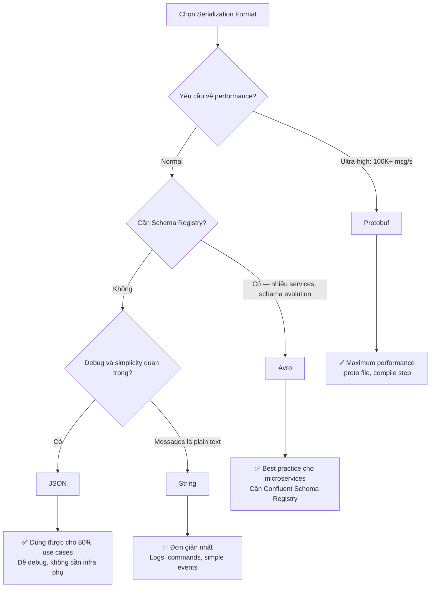

# Serialization

## Mục lục

- [Tại sao cần Serialization?](#tại-sao-cần-serialization)
- [So sánh các Format](#so-sánh-các-format)
- [String Serialization](#string-serialization)
- [JSON Serialization](#json-serialization)
- [Avro + Schema Registry](#avro--schema-registry)
- [Protobuf](#protobuf)
- [Custom Serializer](#custom-serializer)
- [Security: trusted.packages](#security-trustedpackages)
- [Chọn Format nào?](#chọn-format-nào)

---

## Tại sao cần Serialization?

Kafka truyền dữ liệu dưới dạng **bytes**. Java objects phải được chuyển đổi sang bytes trước khi gửi (serialize), và ngược lại khi nhận (deserialize).

```
┌─────────────────────────────────────────────────────────────────────┐
│                    SERIALIZATION FLOW                               │
├─────────────────────────────────────────────────────────────────────┤
│                                                                     │
│  Producer:                                                          │
│  OrderEvent ──[Serializer]──▶ bytes ──▶ Kafka Topic                 │
│                                                                     │
│  Consumer:                                                          │
│  Kafka Topic ──▶ bytes ──[Deserializer]──▶ OrderEvent               │
│                                                                     │
│  Key cũng cần được serialize/deserialize riêng!                     │
│  String "order-123" ──[StringSerializer]──▶ bytes                   │
└─────────────────────────────────────────────────────────────────────┘
```

---

## So sánh các Format

| Format | Serializer | Deserializer | Kích thước | Tốc độ | Debug | Schema Evolution | Dùng khi |
|--------|-----------|-------------|-----------|-------|-------|-----------------|---------|
| **String** | `StringSerializer` | `StringDeserializer` | Lớn | Nhanh | ✅ Dễ | ❌ Không | Logs, simple events |
| **JSON** | `JsonSerializer` | `JsonDeserializer` | Lớn | Trung bình | ✅ Dễ | ⚠️ Không an toàn | Hầu hết apps |
| **Avro** | `KafkaAvroSerializer` | `KafkaAvroDeserializer` | Nhỏ (compact) | Nhanh | ⚠️ Khó | ✅ Schema Registry | Enterprise, microservices |
| **Protobuf** | `KafkaProtobufSerializer` | `KafkaProtobufDeserializer` | Rất nhỏ | Rất nhanh | ⚠️ Khó | ✅ .proto file | High-throughput, performance-critical |
| **Bytes** | `ByteArraySerializer` | `ByteArrayDeserializer` | Tùy | Tùy | ❌ Khó | ❌ Manual | Custom binary, passthrough |

---

## String Serialization

Đơn giản nhất — dùng cho logs, commands, plain text events.

### Cấu hình

```yaml
spring:
  kafka:
    producer:
      key-serializer: org.apache.kafka.common.serialization.StringSerializer
      value-serializer: org.apache.kafka.common.serialization.StringSerializer
    consumer:
      key-deserializer: org.apache.kafka.common.serialization.StringDeserializer
      value-deserializer: org.apache.kafka.common.serialization.StringDeserializer
```

### Sử dụng

```java
// Producer
kafkaTemplate.send("logs", "server-1", "ERROR: Connection timeout to DB");

// Consumer
@KafkaListener(topics = "logs")
public void handleLog(String logMessage) {
    logStorage.save(logMessage);
}
```

**Dùng khi:**
- Events đơn giản, không có nested structure
- Cần human-readable messages trong broker
- Prototyping, debugging

---

## JSON Serialization

Phổ biến nhất cho business applications — gửi và nhận Java objects trực tiếp.

### Cấu hình Producer

```yaml
spring:
  kafka:
    producer:
      key-serializer: org.apache.kafka.common.serialization.StringSerializer
      value-serializer: org.springframework.kafka.support.serializer.JsonSerializer
      properties:
        # Thêm type headers để consumer biết class nào để deserialize
        spring.json.add.type.headers: true
```

### Cấu hình Consumer

```yaml
spring:
  kafka:
    consumer:
      key-deserializer: org.apache.kafka.common.serialization.StringDeserializer
      value-deserializer: org.springframework.kafka.support.serializer.JsonDeserializer
      properties:
        # Giới hạn packages được phép deserialize
        spring.json.trusted.packages: "com.example.events"
        # Nếu consumer dùng class khác package với producer
        spring.json.type.mapping: "order:com.example.events.OrderEvent,payment:com.example.events.PaymentEvent"
```

### Sử dụng

```java
public record OrderEvent(
    String orderId,
    String customerId,
    BigDecimal amount,
    String status,
    Instant createdAt
) {}

// Producer — gửi POJO trực tiếp
@Service
public class OrderProducer {
    private final KafkaTemplate<String, OrderEvent> kafkaTemplate;

    public void send(OrderEvent event) {
        kafkaTemplate.send("orders", event.orderId(), event);
    }
}

// Consumer — nhận POJO trực tiếp
@KafkaListener(topics = "orders", groupId = "order-group")
public void handle(OrderEvent event) {
    log.info("Received order: {}", event.orderId());
}
```

### Giá trị thực tế trên Kafka (bytes)

```json
{
  "@class": "com.example.events.OrderEvent",
  "orderId": "order-123",
  "customerId": "cust-456",
  "amount": 299.99,
  "status": "CREATED",
  "createdAt": "2024-01-15T10:30:00Z"
}
```

---

## Avro + Schema Registry

Avro là lựa chọn tốt nhất cho **microservices enterprise** — compact, schema evolution, backward/forward compatibility.

### Yêu cầu

- **Schema Registry** (Confluent Schema Registry hoặc AWS Glue Schema Registry)
- Dependency `confluent-avro`:

```xml
<dependency>
    <groupId>io.confluent</groupId>
    <artifactId>kafka-avro-serializer</artifactId>
    <version>7.5.0</version>
</dependency>
```

### Define Schema (.avsc file)

```json
{
  "type": "record",
  "name": "OrderEvent",
  "namespace": "com.example.events",
  "fields": [
    {"name": "orderId", "type": "string"},
    {"name": "customerId", "type": "string"},
    {"name": "amount", "type": "double"},
    {"name": "status", "type": "string"},
    {"name": "createdAt", "type": "long", "logicalType": "timestamp-millis"},
    {"name": "notes", "type": ["null", "string"], "default": null}
  ]
}
```

### Cấu hình

```yaml
spring:
  kafka:
    producer:
      value-serializer: io.confluent.kafka.serializers.KafkaAvroSerializer
      properties:
        schema.registry.url: http://localhost:8081
    consumer:
      value-deserializer: io.confluent.kafka.serializers.KafkaAvroDeserializer
      properties:
        schema.registry.url: http://localhost:8081
        specific.avro.reader: true  # Dùng generated classes
```

### Schema Evolution — Ưu điểm lớn nhất của Avro

```
Version 1: OrderEvent (orderId, amount, status)
Version 2: OrderEvent (orderId, amount, status, shippingAddress) ← thêm field mới

Rule: Field mới PHẢI có default value
→ Consumer V1 vẫn đọc được message V2 (bỏ qua shippingAddress)
→ Consumer V2 đọc được message V1 (shippingAddress = null default)
→ Không cần deploy tất cả services cùng lúc!
```

**Dùng khi:**
- Nhiều services consume cùng event
- Schema thay đổi thường xuyên (thêm fields)
- Team cần strict schema governance

---

## Protobuf

Hiệu quả nhất về kích thước và tốc độ — dùng cho ultra-high throughput.

### Define Schema (.proto file)

```protobuf
syntax = "proto3";
package com.example.events;

message OrderEvent {
  string order_id = 1;
  string customer_id = 2;
  double amount = 3;
  string status = 4;
  int64 created_at_ms = 5;
}
```

### Dependency

```xml
<dependency>
    <groupId>io.confluent</groupId>
    <artifactId>kafka-protobuf-serializer</artifactId>
    <version>7.5.0</version>
</dependency>
```

### Cấu hình

```yaml
spring:
  kafka:
    producer:
      value-serializer: io.confluent.kafka.serializers.protobuf.KafkaProtobufSerializer
      properties:
        schema.registry.url: http://localhost:8081
    consumer:
      value-deserializer: io.confluent.kafka.serializers.protobuf.KafkaProtobufDeserializer
      properties:
        schema.registry.url: http://localhost:8081
        specific.protobuf.value.type: com.example.events.OrderEvent
```

---

## Custom Serializer

Khi cần format đặc biệt (encryption, compression, proprietary binary format):

```java
// Custom Serializer
public class EncryptedSerializer implements Serializer<OrderEvent> {

    private final ObjectMapper objectMapper = new ObjectMapper();
    private final EncryptionService encryptionService;

    @Override
    public byte[] serialize(String topic, OrderEvent data) {
        try {
            byte[] jsonBytes = objectMapper.writeValueAsBytes(data);
            return encryptionService.encrypt(jsonBytes);  // Encrypt trước khi gửi
        } catch (JsonProcessingException e) {
            throw new SerializationException("Cannot serialize OrderEvent", e);
        }
    }

    @Override
    public void close() {}
}

// Custom Deserializer
public class EncryptedDeserializer implements Deserializer<OrderEvent> {

    private final ObjectMapper objectMapper = new ObjectMapper();
    private final EncryptionService encryptionService;

    @Override
    public OrderEvent deserialize(String topic, byte[] data) {
        try {
            byte[] decryptedBytes = encryptionService.decrypt(data);
            return objectMapper.readValue(decryptedBytes, OrderEvent.class);
        } catch (IOException e) {
            throw new SerializationException("Cannot deserialize OrderEvent", e);
        }
    }
}
```

---

## Security: trusted.packages

> [!CAUTION]
> **Lỗi bảo mật phổ biến nhất với JSON Deserialization:**

`JsonDeserializer` mặc định tin tưởng class type từ `@class` header trong message. Nếu attacker kiểm soát được Kafka topic, họ có thể inject message với class độc hại (gadget chain attacks).

### ❌ Không an toàn

```yaml
spring.json.trusted.packages: "*"  # Cho phép BẤT KỲ class nào!
```

### ✅ An toàn

```yaml
spring:
  kafka:
    consumer:
      properties:
        # Chỉ cho phép packages cụ thể
        spring.json.trusted.packages: "com.example.events,com.example.dto"
```

### ✅ Tốt nhất — Disable type header, khai báo explicit target type

```java
@Bean
public ConsumerFactory<String, OrderEvent> orderConsumerFactory() {
    JsonDeserializer<OrderEvent> deserializer = new JsonDeserializer<>(OrderEvent.class);
    deserializer.addTrustedPackages("com.example.events");
    deserializer.setUseTypeHeaders(false);  // ← Không tin header, tự biết class

    return new DefaultKafkaConsumerFactory<>(
        consumerConfigs(),
        new StringDeserializer(),
        deserializer
    );
}
```

---

## Chọn Format nào?



<Cards>
  <Card title="Producer API" href="/producers-consumers/producer-api/" description="KafkaTemplate và các send patterns" />
  <Card title="Consumer API" href="/producers-consumers/consumer-api/" description="@KafkaListener, headers, concurrency" />
  <Card title="Spring Boot Setup" href="/setup/spring-boot/" description="Dependencies, cấu hình đầy đủ" />
</Cards>
