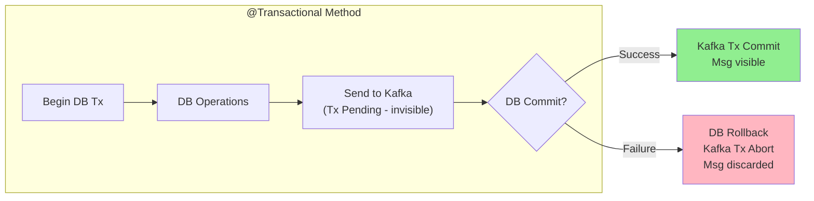
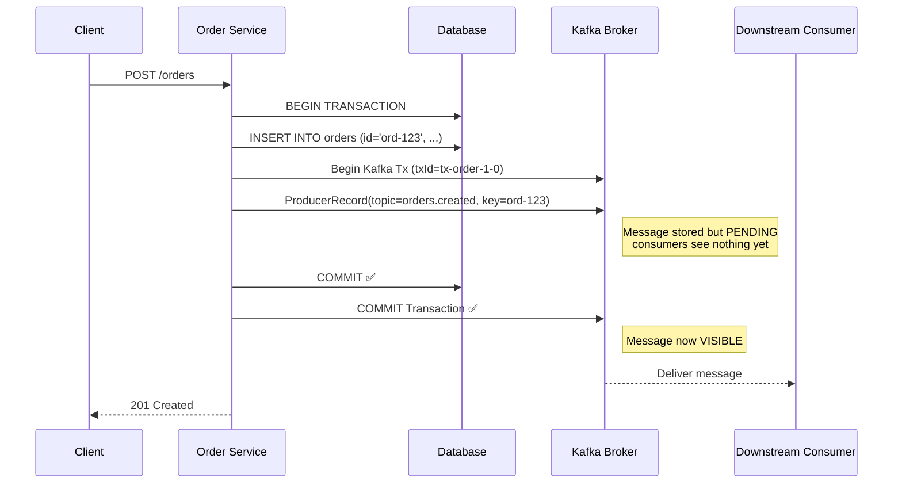
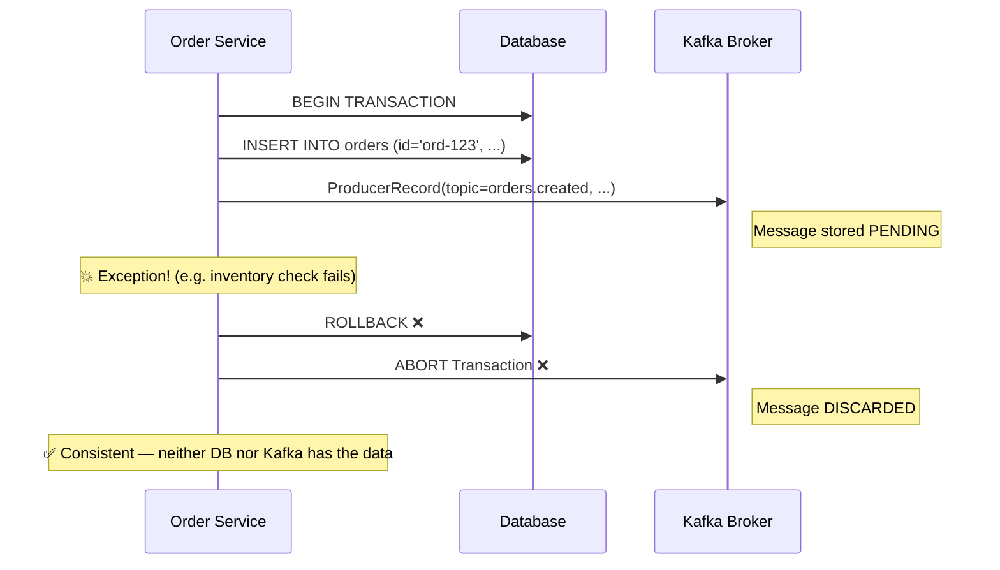
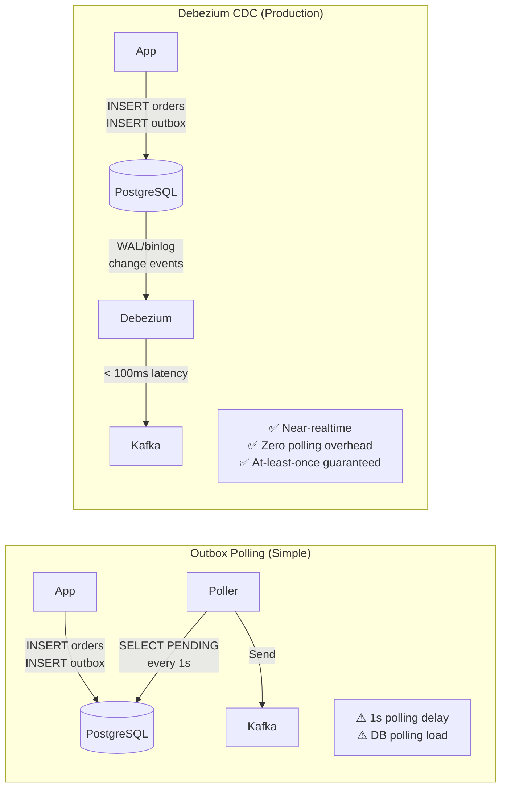
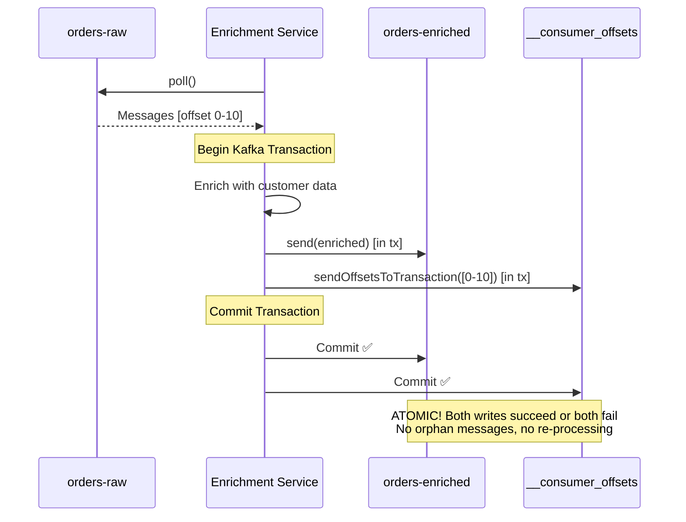

# Kafka Transactions

## Mục lục

- [The Dual Write Problem](#the-dual-write-problem)
- [Solution 1: Transactional Synchronization (1PC)](#solution-1-transactional-synchronization-1pc)
- [Sequence Diagram: Thành công và Thất bại](#sequence-diagram-thành-công-và-thất-bại)
- [Caveat: The Last-Mile Problem](#caveat-the-last-mile-problem)
- [Solution 2: Transactional Outbox Pattern](#solution-2-transactional-outbox-pattern)
- [Implementation: Outbox Pattern trong Spring Boot](#implementation-outbox-pattern-trong-spring-boot)
- [Consume-Transform-Produce (Kafka → Kafka)](#consume-transform-produce-kafka--kafka)
- [So sánh các Approaches](#so-sánh-các-approaches)

---

## The Dual Write Problem

Đây là bài toán xảy ra mọi lúc trong microservices: bạn muốn **lưu dữ liệu vào DB** VÀ **gửi event lên Kafka** trong cùng một "business operation".

```
┌─────────────────────────────────────────────────────────────────────────────────┐
│                        THE DUAL WRITE PROBLEM                                   │
├─────────────────────────────────────────────────────────────────────────────────┤
│                                                                                 │
│   Scenario: User places an Order                                                │
│                                                                                 │
│   What we want: Atomic                                                          │
│   ┌──────────┐                                                                  │
│   │  Order   │                                                                  │
│   │ Service  │──── 1. Save Order to DB ───▶ ✅ Database                         │
│   │          │──── 2. Send to Kafka ──────▶ ✅ Kafka                            │
│   └──────────┘          ↑ Both must succeed or both must fail                   │
│                                                                                 │
│   What can go wrong:                                                            │
│                                                                                 │
│   ❌ Case 1: DB success, Kafka fails                                            │
│      Order saved in DB, but no downstream service knows!                        │
│      Inventory not updated, email not sent, payment not initiated               │
│                                                                                 │
│   ❌ Case 2: Kafka success, DB fails (after rollback)                           │
│      Event sent to Kafka, but no order in DB                                    │
│      Downstream services process a "ghost order"                                │
│                                                                                 │
│   ❌ Case 3: Process crashes between step 1 and step 2                          │
│      DB committed, Kafka never sent                                             │
│      Silent data loss                                                           │
└─────────────────────────────────────────────────────────────────────────────────┘
```

> [!CAUTION]
> **Không có "true distributed transaction"** giữa Database và Kafka (XA transactions tồn tại nhưng rất chậm và phức tạp). Kafka không hỗ trợ XA. Thay vào đó, dùng các patterns được thiết kế cho distributed systems.

---

## Solution 1: Transactional Synchronization (1PC)

Spring Kafka cho phép **synchronize** Kafka transaction với DB transaction. Đây không phải true XA nhưng xử lý được 99% cases.

### Cách hoạt động



### Setup

**Bước 1: Enable transactional producer**

```yaml
spring:
  kafka:
    producer:
      transaction-id-prefix: tx-order-service-
      acks: all
```

**Bước 2: Dùng `@Transactional`**

```java
@Service
public class OrderService {

    private final KafkaTemplate<String, OrderEvent> kafkaTemplate;
    private final OrderRepository orderRepo;

    @Transactional  // ← Spring DB transaction
    public OrderDto createOrder(CreateOrderRequest request) {
        // Step 1: Save to DB — trong DB transaction
        Order order = Order.from(request);
        orderRepo.save(order);

        // Step 2: Send to Kafka — join DB transaction "logically"
        // Message được broker lưu nhưng status = PENDING (consumers không thấy)
        // Chỉ trở thành COMMITTED khi DB transaction commit thành công
        kafkaTemplate.send("orders.created", order.getId(), OrderEvent.from(order));

        // Nếu exception xảy ra ở đây:
        // → DB rollback
        // → Kafka abort transaction → message bị discard
        return OrderDto.from(order);
    }
}
```

> [!NOTE]
> **Điều kiện**: `KafkaTemplate` phải được cấu hình với `transaction-id-prefix`. Spring sẽ tự động phát hiện và join transaction của DB.

---

## Sequence Diagram: Thành công và Thất bại

### Happy Path



### Error Path



---

## Caveat: The Last-Mile Problem

> [!WARNING]
> **Vấn đề không thể tránh khỏi với 1PC**: Nếu DB commit **thành công** nhưng Kafka commit **thất bại** (network down, broker crash), bạn vẫn có inconsistency.

```
Timeline:
──────────────────────────────────────────────────────────────────────
  DB Commit ✅ ──▶ Kafka Commit Request ──▶ 💥 NETWORK FAILURE ──▶ ???
──────────────────────────────────────────────────────────────────────

Result:
  - Database: Order exists (committed)
  - Kafka: Message NOT delivered (broker didn't receive commit)

Impact:
  - Inventory service never received "order created" event
  - No email sent to customer
  - System in inconsistent state — very hard to detect!
```

**Xác suất xảy ra**: Nhỏ nhưng không phải zero. Với traffic cao (millions/day), điều này xảy ra.

**Giải pháp**: Transactional Outbox Pattern.

---

## Solution 2: Transactional Outbox Pattern

**Ý tưởng cốt lõi**: Thay vì gửi message *trực tiếp* lên Kafka, lưu message vào một **bảng `outbox`** trong *cùng database transaction* với business data. Một poller riêng đọc bảng này và gửi lên Kafka.

```
┌─────────────────────────────────────────────────────────────────────────────────┐
│                    TRANSACTIONAL OUTBOX PATTERN                                 │
├─────────────────────────────────────────────────────────────────────────────────┤
│                                                                                 │
│  PHASE 1: Business Transaction (Atomic in same DB)                              │
│  ┌───────────────────────────────────────────────────────────┐                  │
│  │  BEGIN TRANSACTION                                        │                  │
│  │    INSERT INTO orders (id, ...) VALUES (...)              │                  │
│  │    INSERT INTO outbox (event_id, topic, payload, status)  │ ← KEY!           │
│  │  COMMIT                                                   │                  │
│  └───────────────────────────────────────────────────────────┘                  │
│                   ↓                                                             │
│  PHASE 2: Outbox Poller (separate process)                                      │
│  ┌───────────────────────────────────────────────────────────┐                  │
│  │  SELECT * FROM outbox WHERE status = 'PENDING'            │                  │
│  │  → For each row:                                          │                  │
│  │      kafkaTemplate.send(topic, payload)                   │                  │
│  │      UPDATE outbox SET status = 'SENT'                    │                  │
│  └───────────────────────────────────────────────────────────┘                  │
│                                                                                 │
│  Why this works:                                                                │
│  - Phase 1: DB is ACID — both orders + outbox row committed atomically          │
│  - Phase 2: At-least-once delivery (poller can retry safely)                    │
│  - If broker down → rows stay PENDING → retry later                             │
│  - No "last-mile" problem!                                                      │
└─────────────────────────────────────────────────────────────────────────────────┘
```

---

## Implementation: Outbox Pattern trong Spring Boot

### Database Schema

```sql
CREATE TABLE outbox_events (
    id          UUID PRIMARY KEY DEFAULT gen_random_uuid(),
    event_id    VARCHAR(255) UNIQUE NOT NULL,   -- Business ID (deduplicate)
    topic       VARCHAR(255) NOT NULL,
    partition_key VARCHAR(255),                  -- Kafka message key
    payload     JSONB NOT NULL,
    status      VARCHAR(50) DEFAULT 'PENDING',  -- PENDING | SENT | FAILED
    created_at  TIMESTAMP DEFAULT NOW(),
    sent_at     TIMESTAMP,
    retry_count INT DEFAULT 0
);

-- Index để poller chạy nhanh
CREATE INDEX idx_outbox_status_created ON outbox_events(status, created_at)
    WHERE status = 'PENDING';
```

### Outbox Entity

```java
@Entity
@Table(name = "outbox_events")
public class OutboxEvent {

    @Id
    @GeneratedValue(strategy = GenerationType.UUID)
    private UUID id;

    @Column(unique = true, nullable = false)
    private String eventId;  // Business-level dedup key

    @Column(nullable = false)
    private String topic;

    private String partitionKey;

    @Column(columnDefinition = "jsonb")
    private String payload;

    @Enumerated(EnumType.STRING)
    private OutboxStatus status = OutboxStatus.PENDING;

    private LocalDateTime createdAt = LocalDateTime.now();
    private LocalDateTime sentAt;
    private int retryCount = 0;

    public enum OutboxStatus {
        PENDING, SENT, FAILED
    }
}
```

### Service Layer: Business Logic + Outbox

```java
@Service
public class OrderService {

    private final OrderRepository orderRepo;
    private final OutboxEventRepository outboxRepo;
    private final ObjectMapper objectMapper;

    @Transactional  // ← SINGLE DB transaction
    public OrderDto createOrder(CreateOrderRequest request) {
        // Step 1: Save business data
        Order order = Order.builder()
            .id(UUID.randomUUID().toString())
            .customerId(request.getCustomerId())
            .totalAmount(request.getTotalAmount())
            .status(OrderStatus.CREATED)
            .build();
        orderRepo.save(order);

        // Step 2: Save outbox event (SAME transaction as order!)
        OutboxEvent outboxEvent = OutboxEvent.builder()
            .eventId("order-created-" + order.getId())  // Unique event ID
            .topic("orders.created")
            .partitionKey(order.getId())
            .payload(objectMapper.writeValueAsString(OrderCreatedEvent.from(order)))
            .build();
        outboxRepo.save(outboxEvent);

        // ✅ Both committed atomically by DB
        // If DB fails → both rolled back → no orphan events
        return OrderDto.from(order);
    }
}
```

### Outbox Poller

```java
@Service
@Slf4j
public class OutboxPoller {

    private final OutboxEventRepository outboxRepo;
    private final KafkaTemplate<String, String> kafkaTemplate;

    // Poll every 1 second
    @Scheduled(fixedDelay = 1000)
    @Transactional
    public void pollAndPublish() {
        List<OutboxEvent> pendingEvents = outboxRepo
            .findTop100ByStatusOrderByCreatedAtAsc(OutboxStatus.PENDING);

        for (OutboxEvent event : pendingEvents) {
            try {
                // Send to Kafka (at-least-once)
                kafkaTemplate.send(event.getTopic(), event.getPartitionKey(), event.getPayload())
                    .get(5, TimeUnit.SECONDS);  // Synchronous wait

                // Mark as sent
                event.setStatus(OutboxStatus.SENT);
                event.setSentAt(LocalDateTime.now());
                outboxRepo.save(event);

                log.info("Published event: {}", event.getEventId());

            } catch (Exception e) {
                // Don't fail the entire batch — mark as failed and retry later
                event.setRetryCount(event.getRetryCount() + 1);
                if (event.getRetryCount() >= 5) {
                    event.setStatus(OutboxStatus.FAILED);
                    log.error("Event failed after 5 retries: {}", event.getEventId());
                    // Alert ops team!
                }
                outboxRepo.save(event);
            }
        }
    }
}
```

> [!TIP]
> **Production considerations:**
> - Dùng **Debezium** (CDC) thay vì polling nếu bạn cần sub-second latency. Debezium đọc DB binlog và publish lên Kafka ngay lập tức.
> - Nếu dùng polling, batch size 100-1000 rows thường đủ. Tránh `SELECT *` không có LIMIT.
> - Cleanup old `SENT` events định kỳ (retention: 30 ngày).

### Advanced: Debezium CDC (Production Alternative)



---

## Consume-Transform-Produce (Kafka → Kafka)

Khi bạn cần **đọc từ một Kafka topic, transform, và ghi vào topic khác** một cách atomic — Kafka transactions hoạt động hoàn hảo.



```java
@Service
public class OrderEnrichmentService {

    private final KafkaTemplate<String, String> kafkaTemplate;

    @KafkaListener(
        topics = "orders-raw",
        groupId = "enrichment-group",
        containerFactory = "transactionalListenerContainerFactory"
    )
    @Transactional("kafkaTransactionManager")
    public void enrich(
            @Payload String rawOrder,
            @Header(KafkaHeaders.RECEIVED_PARTITION) int partition,
            @Header(KafkaHeaders.OFFSET) long offset,
            Acknowledgment ack) {

        // Transform
        String enriched = enrich(rawOrder);

        // Send to output topic (within same Kafka transaction)
        kafkaTemplate.send("orders-enriched", enriched);

        // Offset commit is part of the transaction
        // → If send fails, offset NOT committed → message reprocessed
        // → If all succeeds, both output message + offset committed atomically
    }

    private String enrich(String raw) {
        // Business logic: add customer info, normalize fields, etc.
        return raw + " [enriched]";
    }
}
```

---

## So sánh các Approaches

| Approach | Consistency | Latency | Complexity | Best For |
|---------|-------------|---------|------------|---------|
| **Direct send (no tx)** | ❌ Risk of dual write | ✅ Lowest | ✅ Simple | Dev/test, non-critical |
| **@Transactional 1PC** | ⚠️ 99% — last mile risk | ✅ Low | ✅ Medium | Low-stakes, simple setup |
| **Outbox + Poller** | ✅ High — guaranteed | ⚠️ ~1s delay | ⚠️ Medium | Monolith + Kafka |
| **Outbox + Debezium** | ✅ Highest — CDC | ✅ < 100ms | ❌ Complex | Enterprise, high throughput |
| **Kafka-to-Kafka Tx** | ✅ Full EOS | ⚠️ +100ms | ⚠️ Medium | Stream processing |

<Cards>
  <Card title="Exactly-Once Semantics" href="/producers-consumers/exactly-once/" description="Idempotent producer, consumer deduplication strategies" />
  <Card title="Retry & Dead Letter Topic" href="/producers-consumers/retry-dlt/" description="@RetryableTopic, DLT patterns, non-blocking retries" />
  <Card title="Producer API" href="/producers-consumers/producer-api/" description="KafkaTemplate, callbacks, và production config" />
</Cards>
