# Spring Boot Setup

## Mục lục

- [Dependencies](#dependencies)
- [Cấu hình cơ bản](#cấu-hình-cơ-bản)
- [JSON Serialization](#json-serialization)
- [So sánh Serializers/Deserializers](#so-sánh-serializersdeserializers)
- [Spring Kafka Components](#spring-kafka-components)
- [Kiến trúc Producer và Consumer](#kiến-trúc-producer-và-consumer)
- [Cấu hình Production-ready](#cấu-hình-production-ready)

---

## Dependencies

### Maven

```xml
<dependency>
    <groupId>org.springframework.kafka</groupId>
    <artifactId>spring-kafka</artifactId>
    <!-- Version được quản lý bởi Spring Boot BOM -->
</dependency>
```

### Gradle

```groovy
implementation 'org.springframework.kafka:spring-kafka'
```

> [!NOTE]
> Nếu dùng Spring Boot, version của `spring-kafka` được quản lý tự động bởi `spring-boot-dependencies` BOM. Không cần khai báo version riêng.

---

## Cấu hình cơ bản

Spring Boot auto-configure hầu hết setting khi phát hiện `spring-kafka` trên classpath. Chỉ cần khai báo tối thiểu trong `application.yml`:

```yaml
spring:
  kafka:
    bootstrap-servers: localhost:9092  # Danh sách brokers (cách nhau bằng dấu phẩy)

    producer:
      key-serializer: org.apache.kafka.common.serialization.StringSerializer
      value-serializer: org.apache.kafka.common.serialization.StringSerializer
      retries: 3

    consumer:
      group-id: my-application-group
      auto-offset-reset: earliest
      key-deserializer: org.apache.kafka.common.serialization.StringDeserializer
      value-deserializer: org.apache.kafka.common.serialization.StringDeserializer
```

### Property Reference — Giải thích đầy đủ

| Property | Mặc định | Giá trị hợp lệ | Mô tả |
|----------|---------|---------------|-------|
| `bootstrap-servers` | `localhost:9092` | `host:port,...` | Địa chỉ brokers để kết nối ban đầu |
| **Producer** | | | |
| `producer.acks` | `1` | `0`, `1`, `all` | `0`=fire-forget, `1`=leader ack, `all`=toàn bộ ISR ack |
| `producer.retries` | `2147483647` | integer | Số lần retry trước khi fail |
| `producer.batch-size` | `16384` | bytes | Kích thước batch gom messages |
| `producer.linger-ms` | `0` | ms | Thời gian chờ thêm để gom batch |
| `producer.buffer-memory` | `33554432` | bytes | Tổng bộ nhớ buffer (32MB mặc định) |
| `producer.compression-type` | `none` | `none`, `gzip`, `snappy`, `lz4`, `zstd` | Nén message trước khi gửi |
| **Consumer** | | | |
| `consumer.group-id` | *(bắt buộc)* | string | **Required** — tên consumer group |
| `consumer.auto-offset-reset` | `latest` | `earliest`, `latest`, `none` | Bắt đầu từ đâu nếu không có offset |
| `consumer.enable-auto-commit` | `true` | boolean | Tự động commit offset |
| `consumer.auto-commit-interval-ms` | `5000` | ms | Tần suất auto-commit |
| `consumer.max-poll-records` | `500` | integer | Số records tối đa mỗi lần `poll()` |
| `consumer.max-poll-interval-ms` | `300000` | ms | Thời gian tối đa giữa 2 lần poll |
| `consumer.session-timeout-ms` | `45000` | ms | Timeout để coi consumer là dead |
| `consumer.heartbeat-interval-ms` | `3000` | ms | Tần suất gửi heartbeat |

---

## JSON Serialization

Hầu hết ứng dụng thực tế trao đổi Java objects (POJOs), không phải plain String. Spring Kafka hỗ trợ JSON serialization tích hợp sẵn.

### Cấu hình Producer

```yaml
spring:
  kafka:
    producer:
      value-serializer: org.springframework.kafka.support.serializer.JsonSerializer
```

### Cấu hình Consumer

```yaml
spring:
  kafka:
    consumer:
      value-deserializer: org.springframework.kafka.support.serializer.JsonDeserializer
      properties:
        spring.json.trusted.packages: "com.example.events,com.example.dto"
```

### Sử dụng với POJO

```java
// POJO — không cần annotation đặc biệt
public record OrderEvent(
    String orderId,
    String customerId,
    BigDecimal amount,
    Instant createdAt
) {}

// Producer
@Service
public class OrderProducer {
    private final KafkaTemplate<String, OrderEvent> kafkaTemplate;

    public void sendOrder(OrderEvent event) {
        kafkaTemplate.send("orders", event.orderId(), event);
    }
}

// Consumer
@KafkaListener(topics = "orders", groupId = "order-group")
public void handleOrder(OrderEvent event) {
    log.info("Received order: {}", event.orderId());
    processOrder(event);
}
```

> [!IMPORTANT]
> **JSON Security** — `spring.json.trusted.packages`:
> - Trong dev: có thể dùng `"*"` cho tiện
> - Trong production: **phải** liệt kê packages cụ thể
> - Lý do: Dùng `"*"` cho phép deserialization bất kỳ class nào từ message → security risk (gadget chain attacks)

### Type Mapping (Khi Producer và Consumer dùng package khác nhau)

Khi producer và consumer ở service khác nhau và POJO không cùng package:

```yaml
spring:
  kafka:
    producer:
      properties:
        spring.json.type.mapping: "order:com.producer.dto.OrderEvent"

    consumer:
      properties:
        spring.json.type.mapping: "order:com.consumer.dto.OrderEvent"
        spring.json.trusted.packages: "com.consumer.dto"
```

Consumer chỉ cần field names match — không cần cùng class type.

---

## So sánh Serializers/Deserializers

| Format | Serializer | Deserializer | Ưu điểm | Nhược điểm | Dùng khi |
|--------|-----------|-------------|---------|-----------|---------|
| **String** | `StringSerializer` | `StringDeserializer` | Đơn giản, readable | Không có structure | Logs, simple events |
| **JSON** | `JsonSerializer` | `JsonDeserializer` | Flexible, debug dễ | Kích thước lớn hơn, parse chậm hơn | Hầu hết ứng dụng |
| **Avro** | `KafkaAvroSerializer` | `KafkaAvroDeserializer` | Schema evolution, compact | Cần Schema Registry | Enterprise, backward compat |
| **Protobuf** | `KafkaProtobufSerializer` | `KafkaProtobufDeserializer` | Rất compact, nhanh | Cần thêm setup | High-performance systems |
| **Bytes** | `ByteArraySerializer` | `ByteArrayDeserializer` | Toàn quyền kiểm soát | Phải tự xử lý | Custom binary formats |

> [!TIP]
> **Khuyến nghị chọn format:**
> - Mới bắt đầu: **JSON** — dễ debug, không cần infrastructure phụ
> - Microservices lớn, schema thay đổi thường xuyên: **Avro** + Schema Registry
> - Ultra-high throughput (100K+ msg/s): **Protobuf**

---

## Spring Kafka Components

| Component | Chức năng | Cách dùng | Khi nào customize |
|-----------|-----------|-----------|------------------|
| `KafkaTemplate<K,V>` | Gửi messages đến Kafka | Inject qua `@Autowired`, gọi `.send()` | Custom serializers, headers |
| `@KafkaListener` | Consume messages | Annotate method | Luôn dùng cho consumers |
| `MessageListenerContainer` | Quản lý poll loop và threading | Auto-configured | Concurrency, error handling |
| `ConsumerFactory<K,V>` | Tạo Kafka consumers | Define `@Bean` nếu custom | SSL, SASL, custom deserializers |
| `ProducerFactory<K,V>` | Tạo Kafka producers | Define `@Bean` nếu custom | Transactions, idempotence |
| `KafkaAdmin` | Quản lý topics programmatically | Auto-configured, inject để dùng | Tạo/xóa topics trong code |
| `ConcurrentKafkaListenerContainerFactory` | Cấu hình listener containers | Define `@Bean` | Custom ack mode, concurrency |

---

## Kiến trúc Producer và Consumer

```mermaid
flowchart LR
    subgraph "Producer Side"
        App1["Your App\n(OrderService)"] --> KT["KafkaTemplate&lt;K,V&gt;\n.send(topic, key, value)"]
        KT --> PF["ProducerFactory\n(ThreadLocal caching)"]
        PF --> Ser["Serialization\nKey + Value → Bytes"]
        Ser --> Buf["Producer Buffer\n(batch.size, linger.ms)"]
        Buf --> Broker["Kafka Broker\n(Leader Partition)"]
    end

    subgraph "Consumer Side"
        Broker --> MLC["MessageListenerContainer\n(Poll Loop)"]
        MLC --> CF["ConsumerFactory"]
        CF --> Deser["Deserialization\nBytes → Key + Value"]
        Deser --> KL["@KafkaListener Method\nhandleOrder(OrderEvent)"]
        KL --> App2["Your App\n(OrderConsumer)"]
    end
```



---

## Cấu hình Production-ready

Cấu hình đầy đủ cho môi trường production:

```yaml
spring:
  kafka:
    bootstrap-servers: kafka1:9092,kafka2:9092,kafka3:9092  # Multiple brokers

    producer:
      key-serializer: org.apache.kafka.common.serialization.StringSerializer
      value-serializer: org.springframework.kafka.support.serializer.JsonSerializer
      # Reliability
      acks: all                          # Chờ tất cả ISR replicas ack
      retries: 2147483647                # Retry cho đến delivery.timeout.ms
      # Performance
      batch-size: 32768                  # 32KB batch size
      linger-ms: 10                      # Chờ 10ms để gom batch
      compression-type: lz4             # Nén messages
      buffer-memory: 67108864           # 64MB buffer
      properties:
        enable.idempotence: true         # Idempotent producer
        max.in.flight.requests.per.connection: 5
        delivery.timeout.ms: 120000      # 2 phút delivery timeout

    consumer:
      group-id: ${spring.application.name}
      auto-offset-reset: earliest
      key-deserializer: org.apache.kafka.common.serialization.StringDeserializer
      value-deserializer: org.springframework.kafka.support.serializer.JsonDeserializer
      # Reliability
      enable-auto-commit: false          # Manual commit
      max-poll-records: 100              # Tune based on processing time
      properties:
        spring.json.trusted.packages: "com.example.events"
        max.poll.interval.ms: 300000
        session.timeout.ms: 45000
        heartbeat.interval.ms: 15000
        isolation.level: read_committed  # Nếu dùng transactions
```

<Cards>
  <Card title="Producer API" href="/producers-consumers/producer-api/" description="KafkaTemplate methods, send patterns, callbacks" />
  <Card title="Consumer API" href="/producers-consumers/consumer-api/" description="@KafkaListener, headers, concurrency scaling" />
  <Card title="Testing" href="/setup/testing/" description="@EmbeddedKafka cho integration tests" />
</Cards>
