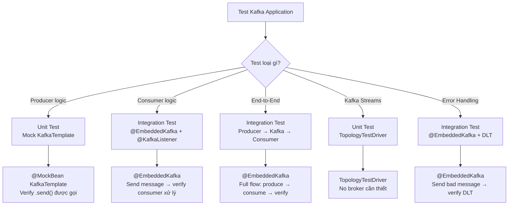
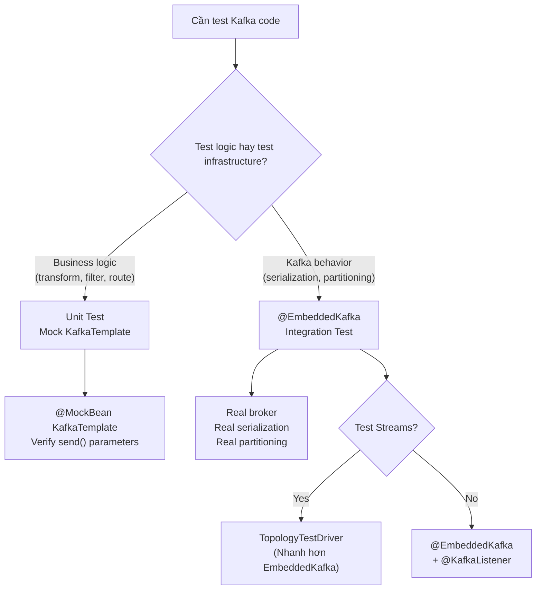

# Testing Kafka

## Mục lục

- [Testing Strategies](#testing-strategies)
- [@EmbeddedKafka — Integration Tests](#embeddedkafka--integration-tests)
- [Test Producer](#test-producer)
- [Test Consumer](#test-consumer)
- [Test Producer + Consumer cùng lúc](#test-producer--consumer-cùng-lúc)
- [Awaitility — Đợi bất đồng bộ](#awaitility--đợi-bất-đồng-bộ)
- [Test với @DltHandler](#test-với-dlthandler)
- [Test với Manual Acknowledge](#test-với-manual-acknowledge)
- [Test với JSON Serialization](#test-với-json-serialization)
- [Test với Multiple Topics](#test-với-multiple-topics)
- [TopologyTestDriver — Kafka Streams](#topologytestdriver--kafka-streams)
- [Unit Test vs Integration Test](#unit-test-vs-integration-test)
- [Common Pitfalls](#common-pitfalls)

---

## Testing Strategies



---

## @EmbeddedKafka — Integration Tests

`@EmbeddedKafka` khởi động một **Kafka broker thu nhỏ** trong quá trình test — không cần Docker hay Kafka cài sẵn.

### Dependency

```xml
<dependency>
    <groupId>org.springframework.kafka</groupId>
    <artifactId>spring-kafka-test</artifactId>
    <scope>test</scope>
</dependency>
```

### Test cơ bản

```java
@SpringBootTest
@EmbeddedKafka(
    partitions = 1,
    topics = { "orders" },
    brokerProperties = {
        "listeners=PLAINTEXT://localhost:0",
        "auto.create.topics.enable=true"
    }
)
class KafkaOrderTest {

    @Autowired
    private KafkaTemplate<String, String> kafkaTemplate;

    @Autowired
    private KafkaListenerEndpointRegistry registry;

    @Autowired
    private EmbeddedKafkaBroker embeddedKafka;

    @Test
    void testSendAndReceive() throws Exception {
        // 1. Gửi message
        kafkaTemplate.send("orders", "order-123", "{\"amount\":100}")
            .get(5, TimeUnit.SECONDS);

        // 2. Đợi consumer xử lý (xem Awaitility bên dưới)
        Thread.sleep(2000);
    }

    @BeforeEach
    void setup() {
        // Đảm bảo tất cả listener containers đang chạy
        registry.getListenerContainers().forEach(container -> {
            if (!container.isRunning()) {
                container.start();
            }
        });
    }
}
```

### Tùy chỉnh @EmbeddedKafka

```java
@EmbeddedKafka(
    count = 3,                          // Số brokers trong cluster
    partitions = 3,                     // Số partitions mỗi topic
    topics = { "orders", "payments" },  // Tạo sẵn topics
    controlledShutdown = true,          // Graceful shutdown
    brokerProperties = {
        "listeners=PLAINTEXT://localhost:0",       // Port ngẫu nhiên
        "auto.create.topics.enable=true",
        "log.dirs=target/embedded-kafka/logs",     // Log directory
        "offsets.topic.replication.factor=1"       // Cho test nhanh
    }
)
```

### Override bootstrap-servers cho test

```yaml
# src/test/resources/application-test.yml
spring:
  kafka:
    bootstrap-servers: ${spring.embedded.kafka.brokers}
```

Hoặc dùng `@DynamicPropertySource`:

```java
@DynamicPropertySource
static void kafkaProperties(DynamicPropertyRegistry registry) {
    registry.add("spring.kafka.bootstrap-servers",
        () -> embeddedKafka.getBrokersAsString());
}
```

---

## Test Producer

### Verify send được gọi (Unit Test với Mock)

```java
@ExtendWith(MockitoExtension.class)
class OrderProducerTest {

    @Mock
    private KafkaTemplate<String, String> kafkaTemplate;

    @Mock
    private CompletableFuture<SendResult<String, String>> future;

    @InjectMocks
    private OrderProducer orderProducer;

    @Test
    void shouldSendOrderToCorrectTopic() {
        // Arrange
        when(kafkaTemplate.send(eq("orders"), eq("order-123"), anyString()))
            .thenReturn(future);

        // Act
        orderProducer.sendOrder("order-123", "{\"amount\":100}");

        // Assert
        verify(kafkaTemplate).send("orders", "order-123", "{\"amount\":100}");
    }
}
```

### Verify send thực tế (Integration Test)

```java
@SpringBootTest
@EmbeddedKafka(partitions = 1, topics = { "orders" })
class OrderProducerIntegrationTest {

    @Autowired
    private KafkaTemplate<String, String> kafkaTemplate;

    @Autowired
    private EmbeddedKafkaBroker embeddedKafka;

    @Test
    void shouldSendMessageToKafka() throws Exception {
        // Act
        SendResult<String, String> result = kafkaTemplate
            .send("orders", "order-123", "{\"amount\":100}")
            .get(5, TimeUnit.SECONDS);

        // Assert
        assertThat(result.getRecordMetadata().topic()).isEqualTo("orders");
        assertThat(result.getRecordMetadata().partition()).isZero();
        assertThat(result.getRecordMetadata().hasOffset()).isTrue();

        // Verify bằng Consumer (đọc lại message)
        Consumer<String, String> consumer = createConsumer();
        consumer.subscribe(List.of("orders"));
        ConsumerRecords<String, String> records = consumer.poll(Duration.ofSeconds(5));

        assertThat(records.count()).isEqualTo(1);
        assertThat(records.iterator().next().value()).contains("order-123");
        consumer.close();
    }

    private Consumer<String, String> createConsumer() {
        Properties props = new Properties();
        props.put(ConsumerConfig.BOOTSTRAP_SERVERS_CONFIG,
            embeddedKafka.getBrokersAsString());
        props.put(ConsumerConfig.GROUP_ID_CONFIG, "test-group");
        props.put(ConsumerConfig.KEY_DESERIALIZER_CLASS_CONFIG,
            StringDeserializer.class);
        props.put(ConsumerConfig.VALUE_DESERIALIZER_CLASS_CONFIG,
            StringDeserializer.class);
        props.put(ConsumerConfig.AUTO_OFFSET_RESET_CONFIG, "earliest");
        return new KafkaConsumer<>(props);
    }
}
```

---

## Test Consumer

### Test cơ bản: gửi message, verify consumer xử lý

```java
@SpringBootTest
@EmbeddedKafka(partitions = 1, topics = { "orders" })
class OrderConsumerTest {

    @Autowired
    private KafkaTemplate<String, String> kafkaTemplate;

    @Autowired
    private OrderConsumer orderConsumer;

    @Test
    void shouldProcessOrderMessage() {
        // Arrange
        String message = "{\"orderId\":\"123\",\"amount\":100}";

        // Act
        kafkaTemplate.send("orders", "order-123", message);

        // Assert — dùng Awaitility để đợi async processing
        await().atMost(5, SECONDS)
            .untilAsserted(() -> {
                assertThat(orderConsumer.getProcessedOrders())
                    .contains("order-123");
            });
    }
}
```

### Consumer với state để test

```java
@Service
public class OrderConsumer {

    private final List<String> processedOrders = new CopyOnWriteArrayList<>();

    @KafkaListener(topics = "orders", groupId = "test-order-group")
    public void handleOrder(String message) {
        processedOrders.add(message);
        // process logic...
    }

    // Getter cho test
    public List<String> getProcessedOrders() {
        return processedOrders;
    }

    // Reset cho test
    public void clear() {
        processedOrders.clear();
    }
}
```

---

## Test Producer + Consumer cùng lúc

Đây là test quan trọng nhất — verify **end-to-end flow**:

```java
@SpringBootTest
@EmbeddedKafka(
    partitions = 3,
    topics = { "orders" }
)
class OrderEndToEndTest {

    @Autowired
    private OrderProducer orderProducer;

    @Autowired
    private OrderConsumer orderConsumer;

    @Autowired
    private KafkaListenerEndpointRegistry registry;

    @BeforeEach
    void setup() {
        registry.getListenerContainers().forEach(
            MessageListenerContainer::start
        );
        orderConsumer.clear();
    }

    @Test
    void shouldSendAndProcessOrder() {
        // 1. Producer gửi message
        orderProducer.sendOrder("order-999", "{\"amount\":500}");

        // 2. Verify consumer nhận và xử lý
        await().atMost(5, SECONDS)
            .untilAsserted(() -> {
                List<String> processed = orderConsumer.getProcessedOrders();
                assertThat(processed).hasSize(1);
                assertThat(processed.get(0)).contains("order-999");
            });
    }

    @Test
    void shouldProcessMultipleMessagesInOrder() {
        // 1. Gửi nhiều messages cùng key (cùng partition → ordering)
        for (int i = 1; i <= 5; i++) {
            orderProducer.sendOrder("order-key", "{\"seq\":" + i + "}");
        }

        // 2. Verify TẤT CẢ được xử lý và đúng thứ tự
        await().atMost(10, SECONDS)
            .untilAsserted(() -> {
                assertThat(orderConsumer.getProcessedOrders()).hasSize(5);
            });
    }
}
```

---

## Awaitility — Đợi bất đồng bộ

Kafka consumer xử lý **bất đồng bộ** → cần Awaitility thay vì `Thread.sleep()`.

### Dependency

```xml
<dependency>
    <groupId>org.awaitility</groupId>
    <artifactId>awaitility</artifactId>
    <scope>test</scope>
</dependency>
```

### Các patterns phổ biến

```java
import static org.awaitility.Awaitility.await;
import static java.util.concurrent.TimeUnit.SECONDS;

// 1. Đợi cho đến khi điều kiện đúng
await().atMost(5, SECONDS)
    .untilAsserted(() -> {
        assertThat(consumer.getProcessedCount()).isEqualTo(1);
    });

// 2. Đợi cho đến khi list không empty
await().atMost(5, SECONDS)
    .until(() -> !consumer.getProcessedOrders().isEmpty());

// 3. Polling interval tuỳ chỉnh
await()
    .pollInterval(100, MILLISECONDS)  // Check mỗi 100ms
    .atMost(5, SECONDS)
    .until(() -> consumer.getProcessedCount() > 0);

// 4. Ignore exceptions trong lúc đợi
await()
    .atMost(5, SECONDS)
    .ignoreExceptions()
    .untilAsserted(() -> {
        // Có thể throw exception trong lúc consumer chưa xử lý xong
        assertThat(repository.findById("order-123")).isPresent();
    });
```

> [!WARNING]
> **Không dùng `Thread.sleep()` trong tests!** Tests sẽ flaky — đôi khi pass, đôi khi fail tùy tốc độ máy. Awaitility poll liên tục cho đến khi condition match.

---

## Test với @DltHandler

```java
@SpringBootTest
@EmbeddedKafka(partitions = 1, topics = { "orders", "orders-retry-0", "orders-dlt" })
class DeadLetterTopicTest {

    @Autowired
    private KafkaTemplate<String, String> kafkaTemplate;

    @Autowired
    private DltHandlerComponent dltHandler;

    @BeforeEach
    void clear() {
        dltHandler.clear();
    }

    @Test
    void shouldSendFailedMessageToDlt() {
        // Gửi message sẽ gây exception
        kafkaTemplate.send("orders", "bad-message", "INVALID_JSON");

        // Đợi message đến DLT
        await().atMost(15, SECONDS)
            .untilAsserted(() -> {
                assertThat(dltHandler.getDeadLetters()).hasSize(1);
                assertThat(dltHandler.getDeadLetters().get(0))
                    .contains("INVALID_JSON");
            });
    }
}
```

```java
@Component
public class DltHandlerComponent {

    private final List<String> deadLetters = new CopyOnWriteArrayList<>();

    @DltHandler
    public void handleDlt(String message) {
        deadLetters.add(message);
        log.error("DLT received: {}", message);
    }

    public List<String> getDeadLetters() { return deadLetters; }
    public void clear() { deadLetters.clear(); }
}
```

---

## Test với Manual Acknowledge

```java
@SpringBootTest
@EmbeddedKafka(partitions = 1, topics = { "orders" })
class ManualAckTest {

    @Autowired
    private KafkaTemplate<String, String> kafkaTemplate;

    @Autowired
    private ManualAckConsumer manualAckConsumer;

    @Test
    void shouldOnlyAckAfterSuccessfulProcessing() {
        String message = "{\"orderId\":\"123\"}";
        kafkaTemplate.send("orders", "order-123", message);

        await().atMost(5, SECONDS)
            .untilAsserted(() -> {
                assertThat(manualAckConsumer.getAcknowledgedMessages())
                    .contains("order-123");
            });
    }
}
```

```java
@Service
public class ManualAckConsumer {

    private final List<String> acknowledgedMessages = new CopyOnWriteArrayList<>();

    @KafkaListener(
        topics = "orders",
        groupId = "manual-ack-group",
        containerFactory = "kafkaListenerContainerFactory"
    )
    public void listen(
            String message,
            Acknowledgment ack) {

        try {
            // Xử lý business logic
            processMessage(message);

            // Chỉ acknowledge SAU khi xử lý thành công
            ack.acknowledge();
            acknowledgedMessages.add(message);

        } catch (Exception e) {
            // Không acknowledge → message sẽ được redelivered
            log.error("Processing failed, NOT acknowledging", e);
        }
    }

    public List<String> getAcknowledgedMessages() {
        return acknowledgedMessages;
    }
}
```

---

## Test với JSON Serialization

```java
@SpringBootTest
@EmbeddedKafka(partitions = 1, topics = { "orders" })
class JsonSerializationTest {

    @Autowired
    private KafkaTemplate<String, OrderEvent> kafkaTemplate;

    @Autowired
    private JsonOrderConsumer jsonConsumer;

    @Test
    void shouldSerializeAndDeserializeOrderEvent() {
        OrderEvent event = new OrderEvent("order-123", "cust-456",
            new BigDecimal("299.99"), Instant.now());

        kafkaTemplate.send("orders", event.orderId(), event);

        await().atMost(5, SECONDS)
            .untilAsserted(() -> {
                OrderEvent received = jsonConsumer.getLastEvent();
                assertThat(received).isNotNull();
                assertThat(received.orderId()).isEqualTo("order-123");
                assertThat(received.amount()).isEqualByComparingTo("299.99");
            });
    }
}
```

---

## Test với Multiple Topics

```java
@SpringBootTest
@EmbeddedKafka(
    partitions = 2,
    topics = {
        "order-created",
        "order-validated",
        "order-shipped"
    }
)
class MultiTopicFlowTest {

    @Autowired
    private KafkaTemplate<String, String> kafkaTemplate;

    @Autowired
    private OrderFlowConsumer orderFlowConsumer;

    @Test
    void shouldProcessOrderThroughAllStages() {
        // Stage 1: Order created
        kafkaTemplate.send("order-created", "order-1",
            "{\"orderId\":\"order-1\",\"status\":\"CREATED\"}");

        // Đợi Stage 1 → verify consumer gửi sang topic tiếp theo
        await().atMost(5, SECONDS)
            .untilAsserted(() -> {
                assertThat(orderFlowConsumer.getCreatedOrders())
                    .contains("order-1");
            });

        // Stage 2: Order validated (producer gửi sang topic khác)
        await().atMost(5, SECONDS)
            .untilAsserted(() -> {
                assertThat(orderFlowConsumer.getValidatedOrders())
                    .contains("order-1");
            });
    }
}
```

---

## TopologyTestDriver — Kafka Streams

Cho Kafka Streams, **không cần @EmbeddedKafka** — dùng `TopologyTestDriver` nhanh hơn:

```java
class OrderStreamProcessorTest {

    private TopologyTestDriver testDriver;
    private TestInputTopic<String, String> inputTopic;
    private TestOutputTopic<String, String> outputTopic;

    @BeforeEach
    void setup() {
        StreamsBuilder builder = new StreamsBuilder();

        // Build topology giống production
        new OrderStreamProcessor().buildPipeline(builder);

        Topology topology = builder.build();
        testDriver = new TopologyTestDriver(topology,
            new Properties() {{
                put(StreamsConfig.APPLICATION_ID_CONFIG, "test-app");
                put(StreamsConfig.BOOTSTRAP_SERVERS_CONFIG, "dummy:9092");
            }});

        inputTopic = testDriver.createInputTopic("orders",
            new StringSerializer(), new StringSerializer());
        outputTopic = testDriver.createOutputTopic("orders-processed",
            new StringDeserializer(), new StringDeserializer());
    }

    @Test
    void shouldFilterAndTransformOrders() {
        // Pipe input
        inputTopic.pipeInput("order-1", "{\"amount\":100}");
        inputTopic.pipeInput("order-2", "{\"amount\":5}");
        inputTopic.pipeInput("order-3", "{\"amount\":200}");

        // Verify output
        assertThat(outputTopic.readRecord().key()).isEqualTo("order-1");
        assertThat(outputTopic.readRecord().key()).isEqualTo("order-3");
        // order-2 bị filter (amount < 10)
        assertThat(outputTopic.isEmpty()).isTrue();
    }

    @Test
    void shouldAdvanceTimeForWindowedOperations() {
        Instant start = Instant.parse("2024-01-01T00:00:00Z");

        // Gửi messages tại các thời điểm khác nhau
        inputTopic.pipeInput("order-1", "{\"amount\":100}", start);
        inputTopic.pipeInput("order-2", "{\"amount\":200}",
            start.plusMillis(60_000)); // 1 phút sau

        // Advance Kafka clock
        testDriver.advanceWallClockTime(Duration.ofMinutes(5));

        // Verify windowed aggregation
        // ...
    }

    @AfterEach
    void cleanup() {
        testDriver.close();
    }
}
```

> [!TIP]
> **TopologyTestDriver** chạy trong memory, không cần network/broker → test chạy rất nhanh (ms thay vì giây). Dùng cho unit tests Kafka Streams logic.

---

## Unit Test vs Integration Test

| Khía cạnh | Unit Test | Integration Test (@EmbeddedKafka) |
|-----------|-----------|----------------------------------|
| **Speed** | < 100ms | 2-10s |
| **Broker** | Không cần | Embedded broker |
| **Test cái gì** | Business logic | Kafka serialization, partitioning, consumer behavior |
| **Isolation** | Full mock | Real Kafka behavior |
| **Dùng khi** | Transform logic, filter, routing | End-to-end flow, error handling, rebalancing |

### Khi nào dùng cái nào?



---

## Common Pitfalls

| Pitfall | Nguyên nhân | Fix |
|---------|------------|-----|
| **Test flaky (đôi khi pass/fail)** | Dùng `Thread.sleep()` thay vì Awaitility | Dùng `await().untilAsserted()` |
| **Consumer không nhận message** | Listener container chưa start | Gọi `registry.getListenerContainers().forEach(c -> c.start())` |
| **Timeout khi send** | `bootstrap-servers` không trỏ đúng embedded broker | Override `spring.kafka.bootstrap-servers` trong test config |
| **Deserialization error** | Consumer dùng String nhưng producer gửi JSON (hoặc ngược lại) | Đảm bảo serializer/deserializer match trong test config |
| **Test chậm** | Tạo quá nhiều topics/brokers | Tối thiểu: 1 broker, 1 partition/topic |
| **State rò rỉ giữa tests** | Consumer state không được clear giữa tests | Clear state trong `@BeforeEach` |
| **Port conflict** | Nhiều test classes chạy song song | Dùng `@EmbeddedKafka(listeners = "PLAINTEXT://localhost:0")` — port ngẫu nhiên |

> [!TIP]
> **Best Practice**: Tạo `@TestConfiguration` class dùng chung cho tất cả Kafka tests:

```java
@TestConfiguration
public class KafkaTestConfig {

    @Bean
    public EmbeddedKafkaBroker embeddedKafkaBroker() {
        return new EmbeddedKafkaBroker(1, true, 1)
            .brokerListProperty("spring.kafka.bootstrap-servers");
    }
}
```

<Cards>
  <Card title="Spring Boot Setup" href="/setup/spring-boot/" description="Cấu hình Spring Kafka, JSON serialization" />
  <Card title="Consumer API" href="/producers-consumers/consumer-api/" description="@KafkaListener, headers, concurrency" />
  <Card title="Retry & DLT" href="/producers-consumers/retry-dlt/" description="Non-blocking retries và Dead Letter Topic" />
</Cards>
