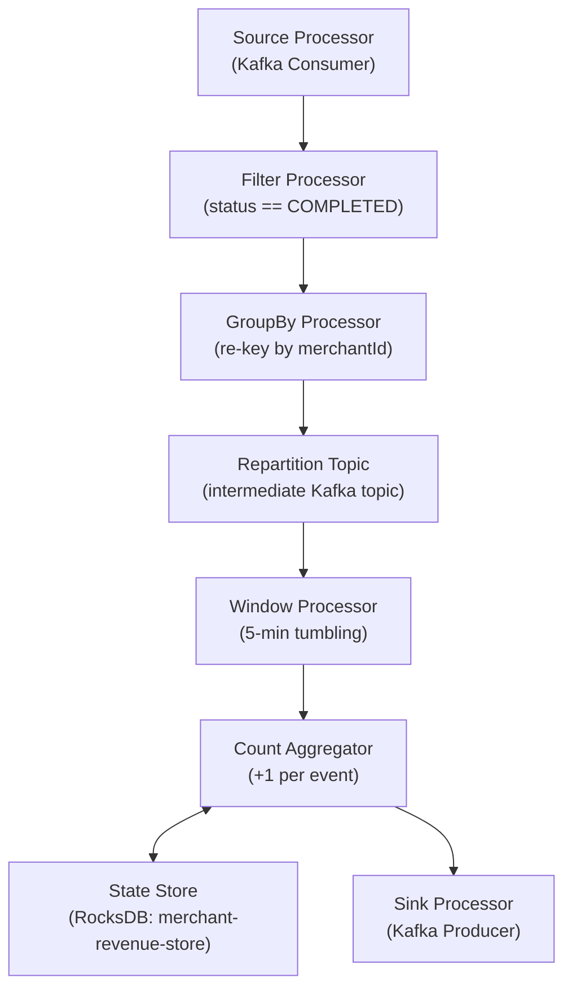
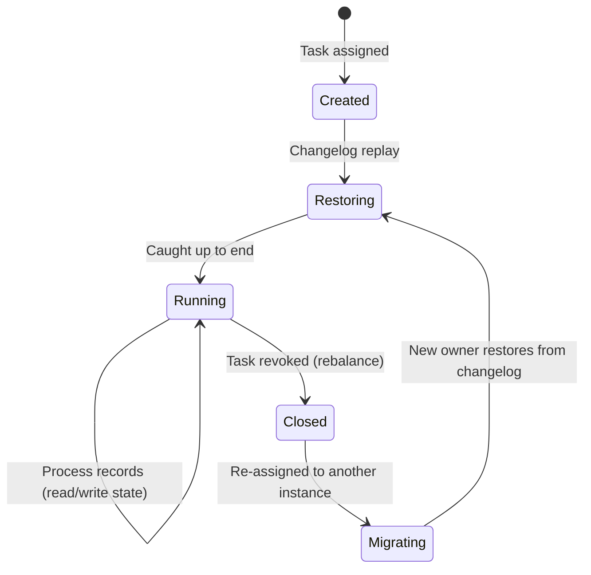

## Mục lục

- [Bối cảnh: Real-time aggregation mà không cần Spark/Flink cluster](#1-bối-cảnh-real-time-aggregation-mà-không-cần-sparkflink-cluster)
- [Kafka Streams vs Flink vs Spark — Khi nào dùng gì](#2-kafka-streams-vs-flink-vs-spark--khi-nào-dùng-gì)
- [Architecture — Library, không phải cluster](#3-architecture--library-không-phải-cluster)
- [Topology — Processor DAG internals](#4-topology--processor-dag-internals)
- [KStream vs KTable — Stream-Table duality](#5-kstream-vs-ktable--stream-table-duality)
- [State Stores — RocksDB & Changelog](#6-state-stores--rocksdb--changelog)
- [Windowing — Time-based aggregation internals](#7-windowing--time-based-aggregation-internals)
- [Exactly-Once Processing — End-to-End](#8-exactly-once-processing--end-to-end)
- [Threading Model — StreamThread & Tasks](#9-threading-model--streamthread--tasks)
- [Rebalancing & Standby Replicas](#10-rebalancing--standby-replicas)
- [Joins — KStream-KStream, KStream-KTable, KTable-KTable](#11-joins--kstream-kstream-kstream-ktable-ktable-ktable)
- [Interactive Queries — Query state stores directly](#12-interactive-queries--query-state-stores-directly)
- [Punctuators & Processing Time](#13-punctuators--processing-time)
- [Common Pitfalls & Production Tuning](#14-common-pitfalls--production-tuning)
- [Tóm tắt — Cheat sheet](#15-tóm-tắt--cheat-sheet)

---

## 1. Bối cảnh: Real-time aggregation mà không cần Spark/Flink cluster

Bạn cần tính **doanh thu per merchant mỗi 5 phút** cho fraud detection. Options:

```
Option A: Spark Streaming
  + Mature, SQL support
  - Cần Spark cluster (Yarn/K8s), 6+ nodes, DevOps overhead
  - Micro-batch: latency 1-30 seconds
  - Separate deployment from your service

Option B: Apache Flink
  + True stream processing, exactly-once
  - Cần Flink cluster, TaskManager instances
  - Complex deployment (savepoints, checkpoints)

Option C: Kafka Streams
  + JUST A LIBRARY — chạy trong service process (Spring Boot JAR)
  + Không cần cluster riêng, deploy = deploy service
  + Exactly-once built-in
  + State store = RocksDB embedded (no external DB needed!)
  - Chỉ đọc/ghi Kafka (input/output đều phải là Kafka topics)
```

> [!IMPORTANT]
> Kafka Streams là **library** (JAR dependency), KHÔNG phải framework hay cluster. Nó chạy trong application process giống bất kỳ library nào. Scaling = tăng instances của application (giống scaling consumers). State = local RocksDB + changelog topic (tự recover khi crash).

---

## 2. Kafka Streams vs Flink vs Spark — Khi nào dùng gì

| Criteria | Kafka Streams | Flink | Spark Streaming |
|----------|---------------|-------|-----------------|
| **Deployment** | Library trong app | Cluster riêng | Cluster riêng |
| **Input/Output** | Chỉ Kafka | Kafka + files + DB + ... | Kafka + files + DB + ... |
| **Latency** | Event-by-event (~ms) | Event-by-event (~ms) | Micro-batch (1-30s) |
| **State** | Local RocksDB + changelog | Managed (RocksDB/heap) | External (HDFS/S3) |
| **Exactly-once** | Built-in (Kafka transactions) | Checkpoint-based | Checkpoint-based |
| **Scaling** | Partitions = max parallelism | TaskManager slots | Executors |
| **SQL support** | KSQL (separate) | FlinkSQL | SparkSQL |
| **Best for** | Kafka-centric microservices | Complex event processing | Batch + streaming hybrid |

---

## 3. Architecture — Library, không phải cluster

```
┌─────────────────────────────────────────────────────────────────────────┐
│                     Your Application (Spring Boot)                        │
├─────────────────────────────────────────────────────────────────────────┤
│                                                                         │
│  ┌────────────────────────────────────────────────────────────┐         │
│  │              Kafka Streams Library (in-process)              │         │
│  │                                                            │         │
│  │  ┌──────────┐  ┌──────────┐  ┌──────────┐                  │         │
│  │  │StreamTask│  │StreamTask│  │StreamTask│   (1 per partition) │       │
│  │  │  P0      │  │  P1      │  │  P2      │                  │         │
│  │  │┌────────┐│  │┌────────┐│  │┌────────┐│                  │         │
│  │  ││RocksDB ││  ││RocksDB ││  ││RocksDB ││  (local state)   │         │
│  │  │└────────┘│  │└────────┘│  │└────────┘│                  │         │
│  │  └──────────┘  └──────────┘  └──────────┘                  │         │
│  │         ↕              ↕              ↕                     │         │
│  │  ┌──────────────────────────────────────────────────┐       │         │
│  │  │           Kafka Consumer + Producer               │       │         │
│  │  │  (input topics)          (output + changelog)     │       │         │
│  │  └──────────────────────────────────────────────────┘       │         │
│  └────────────────────────────────────────────────────────────┘         │
│                                                                         │
│  ┌──────────────────┐                                                   │
│  │  REST API / gRPC  │  ← Interactive Queries (read state stores)       │
│  └──────────────────┘                                                   │
└─────────────────────────────────────────────────────────────────────────┘
```

---

## 4. Topology — Processor DAG internals

### 4.1. Topology = Directed Acyclic Graph

```java
StreamsBuilder builder = new StreamsBuilder();

// DSL tạo topology
KStream<String, OrderEvent> orders = builder.stream("order-events");

KTable<String, Long> revenuePerMerchant = orders
    .filter((key, event) -> event.getStatus() == COMPLETED)
    .groupBy((key, event) -> event.getMerchantId())
    .windowedBy(TimeWindows.ofSizeWithNoGrace(Duration.ofMinutes(5)))
    .count(Materialized.as("merchant-revenue-store"));

revenuePerMerchant.toStream().to("merchant-revenue-5min");
```

### 4.2. Internal topology DAG



### 4.3. Sub-topologies

Khi có `groupBy()` / `join()` thay đổi key → Kafka Streams tạo **repartition topic** và chia topology thành **sub-topologies**:

```
Sub-topology 0: Source → Filter → GroupBy → SINK(repartition-topic)
Sub-topology 1: SOURCE(repartition-topic) → Window → Count → Sink

Mỗi sub-topology scale ĐỘC LẬP (khác partition count)
```

---

## 5. KStream vs KTable — Stream-Table duality

### 5.1. KStream = Event log (mọi event đều giữ)

```
KStream<String, Integer> stream:
  (Alice, +100)  ← deposit event
  (Alice, -50)   ← withdrawal event
  (Alice, +200)  ← deposit event
  → 3 records (tất cả giữ, represent CHANGES)
```

### 5.2. KTable = Materialized view (latest per key)

```
KTable<String, Integer> table:
  (Alice, +100)  → state: {Alice: 100}
  (Alice, -50)   → state: {Alice: -50}   (REPLACE previous!)
  (Alice, +200)  → state: {Alice: 200}   (REPLACE previous!)
  → Chỉ giữ LATEST value per key (represent CURRENT STATE)
```

### 5.3. Duality — Chuyển đổi qua lại

```java
// Stream → Table: aggregate
KTable<String, Long> counts = stream.groupByKey().count();

// Table → Stream: toStream()
KStream<String, Long> changes = counts.toStream();
// Mỗi lần count thay đổi → emit event vào stream
```

### 5.4. Backed by Kafka topics

```
KTable = compacted topic (cleanup.policy=compact)
  → Kafka giữ latest value per key (log compaction)
  → KTable state = reading compacted topic from beginning

KStream = regular topic (cleanup.policy=delete)
  → Kafka giữ mọi event cho đến retention hết
```

---

## 6. State Stores — RocksDB & Changelog

### 6.1. Tại sao cần State Store?

Aggregation (count, sum, reduce) cần **nhớ kết quả trung gian**. Nếu in-memory: crash = mất state = phải recompute từ đầu.

### 6.2. RocksDB — Embedded key-value store

```
State Store mặc định = RocksDB (embedded C++ library, JNI wrapper):
  + Persistent on disk (survive restart)
  + Efficient for random read/write (LSM-tree)
  + Handles state larger than memory (spill to disk)
  - Tuning cần thiết cho large state (block cache, write buffer)

Alternative: In-memory store
  + Faster (no disk)
  - State lost on restart (phải restore từ changelog)
  - State phải fit in RAM
```

### 6.3. Changelog topic — Fault tolerance

```
Mỗi state store có 1 changelog topic:
  app-id-merchant-revenue-store-changelog (compacted)

Every state update:
  put(key="merchant-123", value=500)
  → ALSO produce to changelog: (key="merchant-123", value=500)

Khi crash & restart:
  1. Tạo RocksDB mới (empty)
  2. Consume changelog topic from beginning
  3. Replay all records into RocksDB
  4. State restored!

Recovery time ∝ state size / consumer throughput
  1GB state, 100MB/s consume → ~10 seconds recovery
```

### 6.4. State store lifecycle



---

## 7. Windowing — Time-based aggregation internals

### 7.1. Window types

| Type | Mô tả | Use case |
|------|-------|----------|
| **Tumbling** | Fixed-size, non-overlapping | "Count per 5 minutes" |
| **Hopping** | Fixed-size, overlapping (advance < size) | "Average per 5 min, slide every 1 min" |
| **Sliding** | Event-triggered, continuous | "Count within 5 min of each event" |
| **Session** | Gap-based, variable size | "Activity session (idle > 30 min = new session)" |

### 7.2. Tumbling window internal

```
Window size = 5 minutes, no grace period

Timeline:
  Window [00:00 - 05:00): events A, B, C → count = 3
  Window [05:00 - 10:00): events D, E    → count = 2
  Window [10:00 - 15:00): event F        → count = 1

State store key = (original_key, window_start, window_end)
  ("merchant-1", 1705305600000, 1705305900000) → 3
  ("merchant-1", 1705305900000, 1705306200000) → 2
```

### 7.3. Grace period — Late arrivals

```java
TimeWindows.ofSizeAndGrace(Duration.ofMinutes(5), Duration.ofMinutes(1))
```

```
Window [00:00 - 05:00) closes at 05:00 + 1 min grace = 06:00
  Event arrives at 05:30 with event-time 04:59 → ACCEPTED (within grace)
  Event arrives at 06:30 with event-time 04:59 → DROPPED (past grace)
```

> [!WARNING]
> Grace period = trade-off giữa **completeness** (accept late events) và **timeliness** (emit results sooner). Window results chỉ emit khi window + grace period closes. Longer grace = more accurate nhưng higher latency.

---

## 8. Exactly-Once Processing — End-to-End

### 8.1. processing.guarantee=exactly_once_v2

```java
Properties props = new Properties();
props.put(StreamsConfig.PROCESSING_GUARANTEE_CONFIG,
    StreamsConfig.EXACTLY_ONCE_V2);
// Internally:
//   - Producer: transactional (per-task PID)
//   - Consumer: read_committed isolation
//   - Offset commit: within producer transaction
//   - State store changelog: within same transaction
```

### 8.2. Atomic unit

```
1 transaction per task per commit interval:
  ┌─────────────────────────────────────────────────────────┐
  │ Transaction (atomic):                                   │
  │   1. Process input records → update state store         │
  │   2. Produce output records to output topic             │
  │   3. Produce state changes to changelog topic           │
  │   4. Commit input offsets                               │
  │ All 4 happen together or none.                          │
  └─────────────────────────────────────────────────────────┘
```

### 8.3. commit.interval.ms

```
Default:
  at_least_once → commit.interval.ms = 30000 (30s)
  exactly_once  → commit.interval.ms = 100 (100ms)

100ms EOS: Mỗi 100ms commit transaction → overhead cao hơn nhưng tighter guarantee
Increase cho throughput, decrease cho lower duplicate risk window
```

---

## 9. Threading Model — StreamThread & Tasks

### 9.1. Thread hierarchy

```
KafkaStreams instance
├── StreamThread-1
│   ├── StreamTask (P0-sub0, P0-sub1)    ← 1 task per partition per sub-topology
│   ├── StreamTask (P1-sub0, P1-sub1)
│   └── StandbyTask (P2-sub0)            ← standby replica
├── StreamThread-2
│   ├── StreamTask (P2-sub0, P2-sub1)
│   ├── StreamTask (P3-sub0, P3-sub1)
│   └── StandbyTask (P0-sub0)
└── GlobalStreamThread                    ← GlobalKTable consumer
```

### 9.2. num.stream.threads

```java
props.put(StreamsConfig.NUM_STREAM_THREADS_CONFIG, 4);
// 4 threads, mỗi thread xử lý subset of tasks
// Max parallelism = min(num.stream.threads × instances, input partitions)
```

### 9.3. Task assignment

```
Input topic: 6 partitions
2 instances × 2 threads each = 4 StreamThreads total

Instance 1, Thread 1: Task(P0), Task(P1)
Instance 1, Thread 2: Task(P2)
Instance 2, Thread 1: Task(P3), Task(P4)
Instance 2, Thread 2: Task(P5)
```

---

## 10. Rebalancing & Standby Replicas

### 10.1. Problem: State store recovery sau rebalance

```
Instance A xử lý P0 → state store 5GB trên disk
Instance A crash → P0 reassign cho Instance B
Instance B: phải restore 5GB state từ changelog topic
  → 5GB / 100MB/s = 50 seconds downtime cho P0!
```

### 10.2. Standby Replicas — Hot standby

```java
props.put(StreamsConfig.NUM_STANDBY_REPLICAS_CONFIG, 1);
// Mỗi task có 1 standby copy trên instance khác
// Standby liên tục consume changelog → state gần identical
```

```
Normal operation:
  Instance A: Active Task P0 (state: 5GB, latest)
  Instance B: Standby Task P0 (state: 5GB - 100MB, trailing)

Instance A crash:
  Instance B: Standby → Active (chỉ cần restore 100MB gap)
  Recovery time: 100MB / 100MB/s = 1 second! (vs 50s without standby)
```

### 10.3. Rack-aware assignment

```java
props.put(StreamsConfig.RACK_AWARE_ASSIGNMENT_TAGS_CONFIG, "az");
props.put("client.rack", "us-east-1a");
// Standby replicas đặt ở AZ khác với active → survive AZ failure
```

---

## 11. Joins — KStream-KStream, KStream-KTable, KTable-KTable

### 11.1. Join types

| Join | Left | Right | Windowed? | Co-partitioned? | Use case |
|------|------|-------|-----------|-----------------|----------|
| **KStream-KStream** | Stream | Stream | YES (required) | YES | Correlate events within time window |
| **KStream-KTable** | Stream | Table | NO | YES | Enrich stream with lookup data |
| **KTable-KTable** | Table | Table | NO | YES | Maintain joined materialized view |
| **KStream-GlobalKTable** | Stream | GlobalKTable | NO | NO (broadcast) | Enrich with small reference data |

### 11.2. Co-partitioning requirement

```
Để join KStream-KStream hoặc KStream-KTable:
  1. Cả 2 topics phải có CÙNG SỐ partitions
  2. Cả 2 phải dùng CÙNG partition strategy (same key → same partition number)
  
Nếu không:
  → Kafka Streams tự tạo repartition topic → re-key data
  → Network + disk overhead
```

### 11.3. KStream-KStream join (windowed)

```java
KStream<String, Order> orders = builder.stream("orders");
KStream<String, Payment> payments = builder.stream("payments");

KStream<String, OrderWithPayment> joined = orders.join(
    payments,
    (order, payment) -> new OrderWithPayment(order, payment),
    JoinWindows.ofTimeDifferenceWithNoGrace(Duration.ofMinutes(10))
    // Order và Payment phải arrive within 10 phút của nhau
);
```

---

## 12. Interactive Queries — Query state stores directly

### 12.1. Expose state store via REST

```java
@RestController
public class MerchantRevenueController {
    private final KafkaStreams streams;

    @GetMapping("/revenue/{merchantId}")
    public Long getRevenue(@PathVariable String merchantId) {
        ReadOnlyKeyValueStore<String, Long> store =
            streams.store(
                StoreQueryParameters.fromNameAndType(
                    "merchant-revenue-store",
                    QueryableStoreTypes.keyValueStore()));

        return store.get(merchantId);  // Local lookup, no network!
    }
}
```

### 12.2. Distributed queries (key on different instance)

```java
// Key might be on another instance
KeyQueryMetadata metadata = streams.queryMetadataForKey(
    "merchant-revenue-store", merchantId, Serdes.String().serializer());

if (metadata.activeHost().equals(thisHost)) {
    return localStore.get(merchantId);
} else {
    // Forward request to correct instance
    return restClient.get(metadata.activeHost() + "/revenue/" + merchantId);
}
```

---

## 13. Punctuators & Processing Time

### 13.1. Punctuator — Periodic actions

```java
// Processor API: emit aggregated result every 30 seconds
context.schedule(Duration.ofSeconds(30), PunctuationType.WALL_CLOCK_TIME,
    timestamp -> {
        KeyValueIterator<String, Long> iter = store.all();
        while (iter.hasNext()) {
            KeyValue<String, Long> kv = iter.next();
            context.forward(kv.key, kv.value);  // Emit to downstream
        }
        iter.close();
    });
```

### 13.2. Event Time vs Processing Time vs Wall-Clock Time

| Type | Meaning | Use |
|------|---------|-----|
| **Event time** | Timestamp from record (producer set) | Windowing, ordering |
| **Processing time** | Current time when processing | Logging, metrics |
| **Wall-clock time** | System clock (periodic) | Punctuators, timeouts |

---

## 14. Common Pitfalls & Production Tuning

| Pitfall | Triệu chứng | Fix |
|---------|-------------|-----|
| State store quá lớn | Disk full, OOM | Set retention on windows, use session windows |
| Rebalance slow (large state) | 60s+ downtime per rebalance | Enable standby replicas |
| Repartition topic explosion | Disk usage spike | Minimize groupBy/join re-keys |
| Serialization errors | `ClassCastException` | Use correct Serde per operation |
| Exactly-once slow | Low throughput | Increase `commit.interval.ms` (100→500) |
| Hot partition | 1 task slow, others idle | Better key distribution |

### 14.1. Production config

```java
props.put(StreamsConfig.NUM_STREAM_THREADS_CONFIG, Runtime.getRuntime().availableProcessors());
props.put(StreamsConfig.NUM_STANDBY_REPLICAS_CONFIG, 1);
props.put(StreamsConfig.PROCESSING_GUARANTEE_CONFIG, StreamsConfig.EXACTLY_ONCE_V2);
props.put(StreamsConfig.COMMIT_INTERVAL_MS_CONFIG, 200);
props.put(StreamsConfig.producerPrefix(ProducerConfig.ACKS_CONFIG), "all");
props.put(StreamsConfig.REPLICATION_FACTOR_CONFIG, 3);
// RocksDB tuning
props.put(StreamsConfig.ROCKSDB_CONFIG_SETTER_CLASS_CONFIG, CustomRocksDBConfig.class);
```

---

## 15. Tóm tắt — Cheat sheet

```
KAFKA STREAMS = LIBRARY (not cluster):
  Deploy = deploy your app. Scale = add instances.
  Input/Output = Kafka topics only.

CORE ABSTRACTIONS:
  KStream = event log (all events kept, represents changes)
  KTable  = materialized view (latest per key, represents state)
  State Store = RocksDB + changelog topic (fault-tolerant, local)

TOPOLOGY:
  Source → Processor → Processor → Sink (DAG)
  GroupBy/Join → creates repartition topic → splits into sub-topologies

STATE:
  Local RocksDB (fast reads) + changelog topic (recovery)
  Standby replicas = hot standby (fast failover)

EXACTLY-ONCE:
  1 transaction per task per commit interval
  = atomic: process + produce output + produce changelog + commit offset

THREADING:
  StreamThread → StreamTasks (1 per input partition per sub-topology)
  Parallelism = min(threads × instances, partitions)

5 NGUYÊN TẮC:
1. Kafka Streams = library, KHÔNG cần cluster — scale bằng add instances
2. State store = RocksDB + changelog → survive crash, no external DB
3. Co-partitioning required for joins (same key → same partition number)
4. Standby replicas giảm rebalance downtime từ 50s → <1s
5. exactly_once_v2 = default cho financial/critical — at_least_once cho throughput
```
