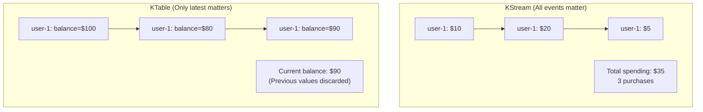
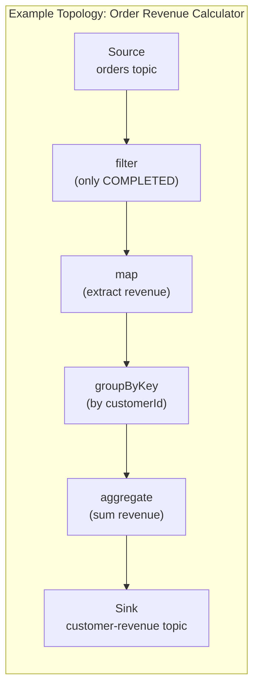
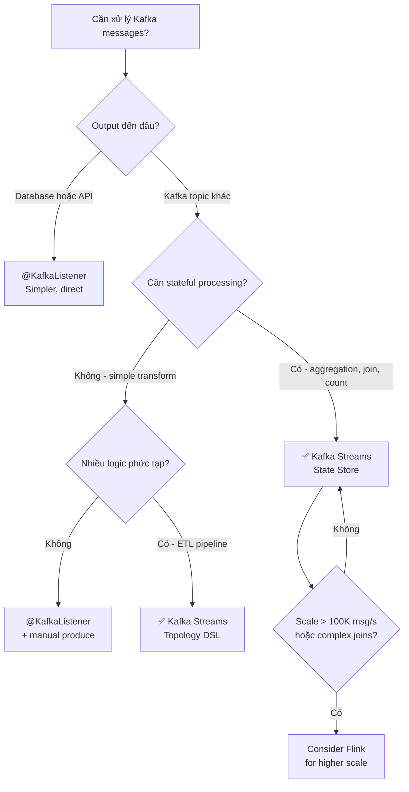

# Kafka Streams: Tổng quan

## Mục lục

- [Kafka Streams là gì?](#kafka-streams-là-gì)
- [Kafka Streams vs @KafkaListener](#kafka-streams-vs-kafkalistener)
- [Kafka Streams vs Apache Flink / Spark](#kafka-streams-vs-apache-flink--spark)
- [Core Abstractions: KStream và KTable](#core-abstractions-kstream-và-ktable)
- [Stream Processing Topology](#stream-processing-topology)
- [State Management](#state-management)
- [Khi nào dùng Kafka Streams](#khi-nào-dùng-kafka-streams)
- [Setup trong Spring Boot](#setup-trong-spring-boot)

---

## Kafka Streams là gì?

**Kafka Streams** là một **client library** (không phải cluster riêng) cho phép bạn xây dựng ứng dụng xử lý dữ liệu streaming trực tiếp trong JVM application của mình.

```
┌─────────────────────────────────────────────────────────────────────────────────┐
│                    KAFKA STREAMS ARCHITECTURE                                   │
├─────────────────────────────────────────────────────────────────────────────────┤
│                                                                                 │
│   Traditional Kafka Consumer:                                                   │
│   ┌────────────┐     poll()     ┌─────────────┐    write    ┌────────────────┐  │
│   │   Kafka    │ ────────────▶  │  Your App   │ ─────────▶  │  Database/API  │  │
│   │  (source)  │                │  (process)  │             │  (sink)        │  │
│   └────────────┘                └─────────────┘             └────────────────┘  │
│                                                                                 │
│   Kafka Streams:                                                                │
│   ┌────────────┐   read from   ┌──────────────────────────┐  write to           │
│   │  Input     │ ────────────▶ │     Kafka Streams App    │ ─────────▶ Output   │
│   │  Topic(s)  │               │  ┌─────────────────────┐ │  Topic(s)           │
│   └────────────┘               │  │  Processing Topology│ │                     │
│                                │  │  filter → map →     │ │                     │
│                                │  │  groupBy → aggregate│ │                     │
│                                │  └─────────────────────┘ │                     │
│                                │  Built-in:               │                     │
│                                │  • State Stores (RocksDB)│                     │
│                                │  • Windowing             │                     │
│                                │  • Joins                 │                     │
│                                └──────────────────────────┘                     │
│                                                                                 │
│   Key Difference: Kafka → Kafka. Input and output are BOTH Kafka topics         │
└─────────────────────────────────────────────────────────────────────────────────┘
```

**3 đặc điểm cốt lõi:**

1. **Embedded library** — không cần cluster riêng (khác Flink/Spark). Deploy như regular Spring Boot app
2. **Kafka-to-Kafka** — đọc từ Kafka topic, xử lý, ghi ra Kafka topic khác
3. **Stateful processing** — tích hợp sẵn state store (RocksDB) để lưu aggregations, joins

---

## Kafka Streams vs @KafkaListener

| Tiêu chí | `@KafkaListener` | Kafka Streams |
|---------|-----------------|---------------|
| **Pattern** | Kafka → App → Database/API | Kafka → Transform → Kafka |
| **Stateless** | ✅ Dễ — mỗi message độc lập | ⚠️ Cần suy nghĩ về state |
| **Stateful** | ❌ Tự quản lý (Redis, DB) | ✅ Built-in State Store |
| **Windowing** | ❌ Tự implement | ✅ Tumbling, Hopping, Session |
| **Stream joins** | ❌ Phức tạp | ✅ KStream-KStream, KStream-KTable |
| **Exactly-once** | ⚠️ Complex setup | ✅ Built-in với processing.guarantee |
| **Complexity** | ✅ Thấp | ⚠️ Cao hơn |
| **Use case** | DB writes, API calls, notifications | ETL, aggregations, real-time analytics |

> [!TIP]
> **Rule of thumb**: Nếu output đến Database hoặc external service → `@KafkaListener`. Nếu cần transform/aggregate và output ngược lại Kafka hoặc cần real-time analytics → Kafka Streams.

---

## Kafka Streams vs Apache Flink / Spark

| Tiêu chí | Kafka Streams | Apache Flink | Spark Streaming |
|---------|---------------|-------------|----------------|
| **Deployment** | ✅ Embedded trong app | ❌ Cluster riêng | ❌ Cluster riêng |
| **Language** | Java/Kotlin | Java/Scala/Python | Python/Scala/Java |
| **Source/Sink** | Kafka only | Any (Kafka, DB, S3...) | Any |
| **Throughput** | ⚠️ Medium | ✅ Very high | ✅ High |
| **Latency** | ✅ Very low (ms) | ✅ Low (ms) | ⚠️ Seconds (micro-batch) |
| **State mgmt** | ✅ RocksDB built-in | ✅ Advanced | ✅ Advanced |
| **Ops complexity** | ✅ Low (just a jar) | ❌ High | ❌ High |
| **When to use** | Kafka-native apps | Complex stream processing | Batch + stream hybrid |

---

## Core Abstractions: KStream và KTable

### KStream — Unbounded Event Stream

**KStream** đại diện cho **stream of events** — mỗi record là một sự kiện độc lập, giống append-only log.

```
KStream<String, OrderEvent>:

Time: ────────────────────────────────────────────────────────→
      [order-1: $100] [order-2: $50] [order-1: CANCEL] [order-3: $200]

Mỗi record là một EVENT — không overwrite record trước đó
Phù hợp: Transaction logs, click events, sensor readings
```

### KTable — Changelog Stream (Materialized View)

**KTable** đại diện cho **current state** — chỉ giữ giá trị mới nhất per key (như database table).

```
KTable<String, UserProfile>:

Key "user-1":  ──[profile-v1]──[profile-v2]──[profile-v3]────→
                                              ↑ Only this kept!

Phù hợp: User profiles, account balances, configuration
```

### KStream vs KTable: Semantic khác nhau



### GlobalKTable — Replicated State

```java
// KTable: partitioned (each instance has subset of keys)
KTable<String, Product> productTable = builder.table("products");

// GlobalKTable: fully replicated on EVERY instance
// Use when: lookup table, config, reference data
GlobalKTable<String, Product> globalProducts = builder.globalTable("products");
```

---

## Stream Processing Topology

Mỗi Kafka Streams app định nghĩa một **topology** — directed acyclic graph (DAG) của operations:



**Loại nodes trong topology:**

| Node Type | Role | Ví dụ |
|-----------|------|-------|
| **Source** | Đọc từ Kafka topic | `builder.stream("orders")` |
| **Processor** | Transform/filter records | `filter()`, `map()`, `flatMap()` |
| **Stateful** | Aggregate, join với state | `groupByKey().count()`, `join()` |
| **Sink** | Ghi ra Kafka topic | `.to("output-topic")` |

---

## State Management

Kafka Streams tự động quản lý **State Stores** (dùng RocksDB locally + changelog topic trên Kafka):

```
┌─────────────────────────────────────────────────────────────────────────────────┐
│                    STATE STORE ARCHITECTURE                                     │
├─────────────────────────────────────────────────────────────────────────────────┤
│                                                                                 │
│  Kafka Streams Instance:                                                        │
│  ┌───────────────────────────────────────────────────────┐                      │
│  │  Processing Logic                                     │                      │
│  │  ┌────────────────────────────────────────────────┐   │                      │
│  │  │  groupBy("customerId").count()                 │   │                      │
│  │  └───────────────────┬────────────────────────────┘   │                      │
│  │                      │ read/write                     │                      │
│  │  ┌───────────────────▼────────────────────────────┐   │                      │
│  │  │  Local State Store (RocksDB)                   │   │                      │
│  │  │  customer-1 → 42 orders                        │   │                      │
│  │  │  customer-2 → 7 orders                         │   │                      │
│  │  │  customer-3 → 108 orders                       │   │                      │
│  │  └───────────────────┬────────────────────────────┘   │                      │
│  └──────────────────────┼────────────────────────────────┘                      │
│                         │ backed up to                                          │
│  ┌──────────────────────▼─────────────────────────────┐                         │
│  │  Kafka Changelog Topic                             │                         │
│  │  (stores-order-count-changelog)                    │                         │
│  │  Dùng để restore state khi instance restart!       │                         │
│  └────────────────────────────────────────────────────┘                         │
│                                                                                 │
│  Benefits:                                                                      │
│  ✅ Sub-millisecond reads (local RocksDB)                                       │
│  ✅ Durable (backed by Kafka)                                                   │
│  ✅ Auto-restored after crash                                                   │
└─────────────────────────────────────────────────────────────────────────────────┘
```

---

## Khi nào dùng Kafka Streams



**Use cases phù hợp nhất:**

| Use Case | Dùng Kafka Streams? | Lý do |
|---------|--------------------|----|
| Real-time fraud detection | ✅ | Windowing + stateful pattern matching |
| Order count per customer (hourly) | ✅ | Tumbling window aggregation |
| Enrich order with customer data | ✅ | KStream-KTable join |
| Send confirmation email | ❌ | `@KafkaListener` đơn giản hơn |
| Save order to database | ❌ | `@KafkaListener` đơn giản hơn |
| Complex ML pipeline | ❌ | Flink/Spark phù hợp hơn |

---

## Setup trong Spring Boot

### Dependencies

```xml
<!-- pom.xml -->
<dependency>
    <groupId>org.apache.kafka</groupId>
    <artifactId>kafka-streams</artifactId>
</dependency>
<dependency>
    <groupId>org.springframework.kafka</groupId>
    <artifactId>spring-kafka</artifactId>
</dependency>
```

### application.yml

```yaml
spring:
  kafka:
    bootstrap-servers: localhost:9092
    streams:
      application-id: order-analytics-app   # Unique ID — acts as consumer group ID
      properties:
        default.key.serde: org.apache.kafka.common.serialization.Serdes$StringSerde
        default.value.serde: org.apache.kafka.common.serialization.Serdes$StringSerde

        # Exactly-once processing
        processing.guarantee: exactly_once_v2

        # State store directory
        state.dir: /tmp/kafka-streams

        # Auto-create internal topics
        num.stream.threads: 2   # Parallelism per instance
```

### Kích hoạt Kafka Streams

```java
@SpringBootApplication
@EnableKafkaStreams          // ← Bắt buộc
public class OrderAnalyticsApplication {
    public static void main(String[] args) {
        SpringApplication.run(OrderAnalyticsApplication.class, args);
    }
}
```

<Cards>
  <Card title="Kafka Streams API" href="/streams/streams-api/" description="DSL operators: filter, map, groupByKey, windowing, joins với code examples" />
  <Card title="Transactions" href="/producers-consumers/transactions/" description="Consume-Transform-Produce EOS pattern" />
  <Card title="Kafka vs Others" href="/fundamentals/kafka-vs-others/" description="Khi nào dùng Kafka Streams vs Flink vs Spark" />
</Cards>
