# Deep Dive: Apache Kafka with Spring Boot

This guide provides a comprehensive overview of Apache Kafka and how to integrate it effectively with Spring Boot applications.

## 1. Kafka Fundamentals: The Core

Before diving into Spring Boot, it's crucial to have a mental model of how Kafka works. Kafka is not just a message queue; it is a **distributed streaming platform**.

### 1.1 Key Architecture

- **Broker**: A Kafka server. A cluster consists of multiple brokers to provide scalability and high availability.
- **Topic**: A logical category or feed name to which records are published. Topics are the "mailboxes" of Kafka.
- **Partition**: Topics are split into **partitions**. This is the unit of parallelism.
  - _Ordering_: Ordering is guaranteed _only within a partition_, not across the entire topic.
  - _Replication_: Partitions are replicated across brokers for fault tolerance. Each partition has one **Leader** (handles all reads/writes) and zero or more **Followers** (passively replicate).
- **ISR (In-Sync Replicas)**: The subset of replicas that are fully caught up with the leader. Only members of the ISR are eligible to be elected as a new leader.

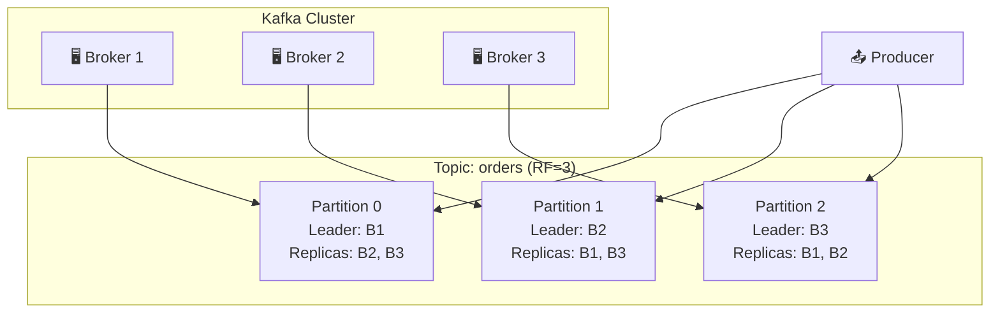

**Quick Reference: Core Components**

| Component     | Description                    | Analogy                  |
| ------------- | ------------------------------ | ------------------------ |
| **Broker**    | A Kafka server node            | A post office branch     |
| **Topic**     | Logical message category       | A mailbox label          |
| **Partition** | Ordered, immutable log segment | A specific mailbox slot  |
| **Leader**    | Partition's primary handler    | The clerk at the counter |
| **Follower**  | Partition's backup copy        | Backup paperwork         |
| **ISR**       | Fully synced replicas          | Verified backup copies   |

### 1.2 The Log Abstraction

Kafka treats data as a **commit log**.

- **Append-Only**: New messages are always written to the end.
- **Immutable**: Once written, data is (generally) not changed.
- **Offset**: A unique integer sequence number assigned to each record in a partition. It points to the position in the log.

**Visualizing the Commit Log**:

```
┌─────────────────────────────────────────────────────────────────┐
│                     Partition 0 (Commit Log)                    │
├─────┬─────┬─────┬─────┬─────┬─────┬─────┬─────┬─────┬─────┬─────┤
│ msg │ msg │ msg │ msg │ msg │ msg │ msg │ msg │ msg │ msg │ ... │
│  0  │  1  │  2  │  3  │  4  │  5  │  6  │  7  │  8  │  9  │     │
├─────┴─────┴─────┴─────┴─────┴─────┴─────┴─────┴─────┴─────┴─────┤
│  ↑                         ↑                               ↑   │
│ Offset 0               Offset 5                    Latest (9)  │
│ (Oldest)           (Consumer Position)              (Newest)   │
└─────────────────────────────────────────────────────────────────┘

Write Direction ──────────────────────────────────────────────────→
```

**Key Insight**: Consumers track their position via offsets. Different consumer groups can be at different offsets on the same partition.

### 1.3 Consumers & Consumer Groups (Deep Dive)

This is where the magic (and complexity) happens.

- **Consumer Group**: A logical grouping of consumers. A topic's partitions are divided among the consumers in the group.
  - **Rule**: One partition is consumed by EXACTLY ONE consumer instance **within a specific group**.
  - _Clarification_: If you have **Multiple Consumer Groups** (e.g., `analytics-group` and `log-group`), **BOTH** groups will get a copy of the message from the partition. This is how Kafka does Pub/Sub.

#### Scenario: How Rebalancing Works

**Rebalancing** is the process of re-assigning partitions to consumers. It happens when:

1.  A new consumer joins the group.
2.  A consumer leaves (shuts down cleanly) or crashes (loss of heartbeat).
3.  The topic metadata changes (e.g., new partitions added).

**The Rebalancing Protocol (simplified):**

1.  **FindCoordinator**: Consumers find which broker is the Group Coordinator.
2.  **JoinGroup**: All consumers send a request to join. The Coordinator picks a "Leader" consumer.
3.  **SyncGroup**: The Leader calculates the partition assignments (who gets what) and sends it to the Coordinator, which broadcasts it to all members.

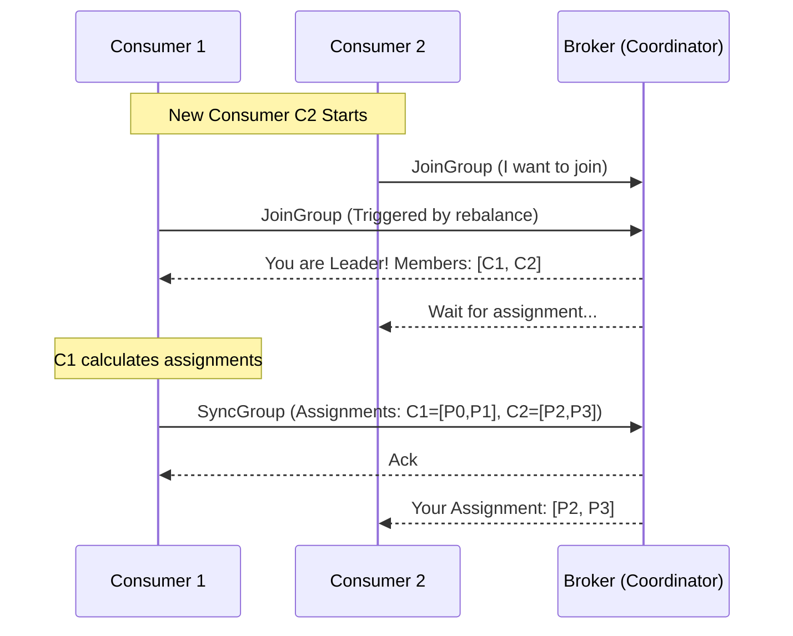

---

#### Real World Example: "The Scaling Event"

Imagine a Topic `orders` with **4 Partitions** (P0, P1, P2, P3).

1.  **Start State**: You have **1 Consumer (C1)**.
    - C1 owns [P0, P1, P2, P3].
2.  **Scale Up**: You start **C2**.
    - **Rebalance triggers**. Usage stops briefly (depending on strategy).
    - Kafka assigns: C1 -> [P0, P1], C2 -> [P2, P3].
3.  **Crash**: C2 crashes (stops sending heartbeats).
    - Coordinator waits for `session.timeout.ms`.
    - **Rebalance triggers**.
    - Kafka assigns: C1 -> [P0, P1, P2, P3].

#### How Offsets Work

Offsets are stored in a special internal topic `__consumer_offsets`.

- **Auto-Commit**: By default, libraries commit offsets periodically (e.g., every 5s).
  - _Risk_: If your app crashes after processing a message but _before_ the auto-commit, you will process that message again (Duplicate!).
- **Manual Commit**: You decide when to say "I'm done".
  - _AckMode_: In Spring, you can control this via `AckMode` (e.g., `RECORD`, `BATCH`, `MANUAL_IMMEDIATE`).

**Spring Kafka AckMode Comparison**:

| AckMode            | When Offset Committed                        | Throughput | Duplicate Risk | Best For                              |
| ------------------ | -------------------------------------------- | ---------- | -------------- | ------------------------------------- |
| `RECORD`           | After each record processed                  | 🐢 Low     | ✅ Minimal     | Critical data, exactly-once semantics |
| `BATCH`            | After all records in `poll()` batch          | 🚀 High    | ⚠️ Moderate    | Balanced throughput/safety            |
| `TIME`             | After configured time interval               | 🚗 Medium  | ⚠️ Moderate    | Time-based commits                    |
| `COUNT`            | After N records processed                    | 🚗 Medium  | ⚠️ Moderate    | Count-based commits                   |
| `MANUAL`           | When you call `Acknowledgment.acknowledge()` | ⚙️ Custom  | ✅ You control | Complex processing logic              |
| `MANUAL_IMMEDIATE` | Immediately on `acknowledge()` call          | ⚙️ Custom  | ✅ Minimal     | Real-time commit needed               |

> [!TIP] > **Default**: Spring uses `BATCH` mode. For most applications, this provides a good balance. Use `MANUAL` when you need to acknowledge after async processing completes.

#### Deep Dive: How Kafka Stores Consumer Offsets

Understanding **where** and **how** offsets are stored is crucial for debugging consumer issues and understanding Kafka's reliability guarantees.

##### The `__consumer_offsets` Topic

Kafka stores all consumer offsets in a special internal topic called **`__consumer_offsets`**. This topic:

- Is automatically created by Kafka (default: 50 partitions, RF=3)
- Uses **log compaction** to keep only the latest offset per key
- Is managed entirely by Kafka (you don't write to it directly)

##### Offset Storage Key Structure

The key insight: **Offsets are tracked per (Consumer Group + Topic + Partition)**, NOT per individual consumer instance.

```
┌────────────────────────────────────────────────────────────────────────────┐
│                     __consumer_offsets Internal Topic                      │
├────────────────────────────────────────────────────────────────────────────┤
│                                                                            │
│  ┌─────────────────────────────────┐     ┌─────────────────────────────┐  │
│  │ Key (Composite)                 │     │ Value                       │  │
│  ├─────────────────────────────────┤     ├─────────────────────────────┤  │
│  │ • Consumer Group ID             │ ──▶ │ • Committed Offset          │  │
│  │ • Topic Name                    │     │ • Metadata (optional)       │  │
│  │ • Partition Number              │     │ • Commit Timestamp          │  │
│  └─────────────────────────────────┘     └─────────────────────────────┘  │
│                                                                            │
│  Examples:                                                                 │
│  ┌─────────────────────────────────────────────────────────────────────┐  │
│  │ (order-group, orders, 0)  →  { offset: 1523, timestamp: ... }       │  │
│  │ (order-group, orders, 1)  →  { offset: 892,  timestamp: ... }       │  │
│  │ (order-group, orders, 2)  →  { offset: 2105, timestamp: ... }       │  │
│  │ (analytics-group, orders, 0) → { offset: 500, timestamp: ... }      │  │
│  │ (analytics-group, orders, 1) → { offset: 500, timestamp: ... }      │  │
│  └─────────────────────────────────────────────────────────────────────┘  │
│                                                                            │
└────────────────────────────────────────────────────────────────────────────┘
```

##### Why Per Group, Not Per Consumer Instance?

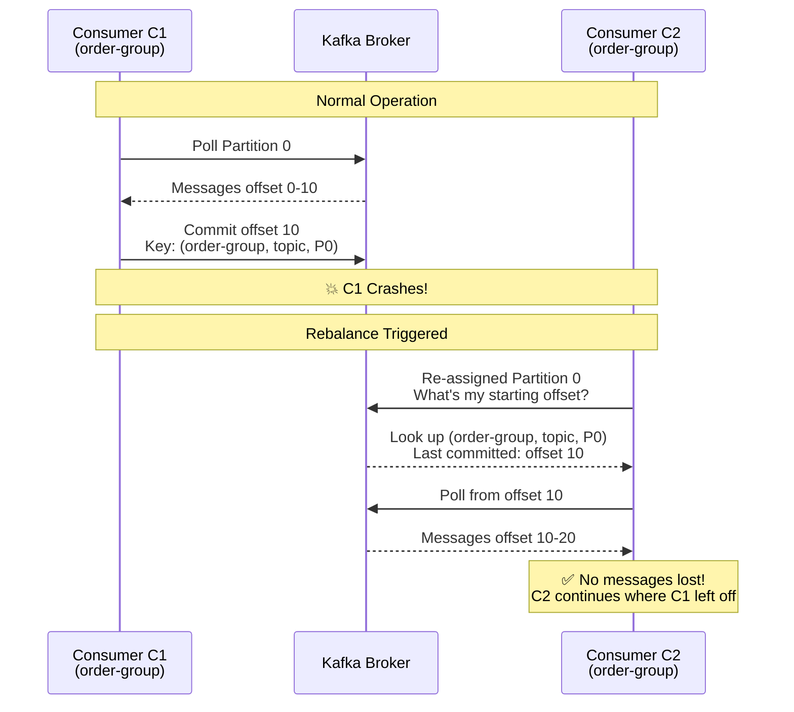

**Key Benefits of Group-Level Tracking:**

| Benefit                 | Explanation                                                      |
| ----------------------- | ---------------------------------------------------------------- |
| **Fault Tolerance**     | When a consumer crashes, another can resume from the same offset |
| **Elastic Scaling**     | Add/remove consumers without losing progress                     |
| **Stateless Consumers** | Consumers don't need local state; Kafka is the source of truth   |
| **Multiple Groups**     | Different groups track independent progress on same topic        |

##### Multiple Consumer Groups - Independent Offsets

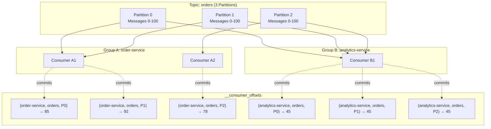

**Notice**: Group A is at offset ~85, Group B is at offset 45. They progress independently!

**Key Partition-Consumer Relationship Rules:**

| Rule                                               | Description                                                                                    | Example from Diagram                                          |
| -------------------------------------------------- | ---------------------------------------------------------------------------------------------- | ------------------------------------------------------------- |
| **Partition → 1 Consumer (within group)**          | Each partition can only be consumed by **exactly ONE consumer** within a single consumer group | P0 → CA1 only (not CA1 AND CA2) in Group A                    |
| **Partition → Multiple Consumers (across groups)** | The same partition can be consumed by **multiple consumers from DIFFERENT groups**             | P0 → CA1 (Group A) AND CB1 (Group B)                          |
| **Consumer → Multiple Partitions**                 | A single consumer can consume from **multiple partitions** simultaneously                      | CA1 consumes from P0 AND P1; CB1 consumes from P0, P1, AND P2 |

> [!TIP] > **Summary**: Within a group, it's a 1:1 mapping (partition to consumer). Across groups, it's many-to-many. A consumer can handle multiple partitions, but a partition can only have one consumer per group.

##### Offset Commit Flow (Detailed)

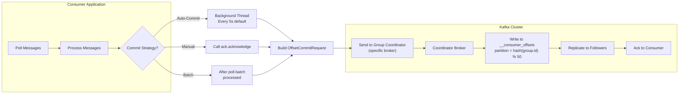

##### Offset Storage Summary Table

| Question                      | Answer                                           |
| ----------------------------- | ------------------------------------------------ |
| **Where are offsets stored?** | `__consumer_offsets` internal topic              |
| **What is the key?**          | `(group.id, topic, partition)`                   |
| **What is the value?**        | Offset number + metadata + timestamp             |
| **Who manages it?**           | Kafka broker (Group Coordinator)                 |
| **Per consumer instance?**    | ❌ No, per Consumer Group                        |
| **How to find coordinator?**  | `hash(group.id) % __consumer_offsets_partitions` |
| **Retention policy?**         | Log compaction (keeps latest per key)            |
| **Default partition count?**  | 50 partitions                                    |

> [!NOTE] > **Historical Note**: Before Kafka 0.9, offsets were stored in ZooKeeper. This caused scalability issues, so Kafka moved to storing offsets in a regular (compacted) topic.

##### Deep Dive: Consumer Lifecycle & Offset Behavior

Understanding what happens to offsets during consumer lifecycle events is critical for building reliable Kafka applications.

###### Scenario 1: Consumer Disconnects (Crash or Graceful Shutdown)

```
┌─────────────────────────────────────────────────────────────────────────────────┐
│                    BEFORE: Normal Operation                                     │
├─────────────────────────────────────────────────────────────────────────────────┤
│                                                                                 │
│   Topic: orders (4 Partitions)                                                  │
│   ┌─────┐ ┌─────┐ ┌─────┐ ┌─────┐                                              │
│   │ P0  │ │ P1  │ │ P2  │ │ P3  │                                              │
│   └──┬──┘ └──┬──┘ └──┬──┘ └──┬──┘                                              │
│      │       │       │       │                                                  │
│      └───┬───┘       └───┬───┘                                                  │
│          ▼               ▼                                                      │
│     ┌─────────┐     ┌─────────┐                                                │
│     │Consumer │     │Consumer │     Consumer Group: order-group                │
│     │   C1    │     │   C2    │                                                │
│     │ P0, P1  │     │ P2, P3  │                                                │
│     └─────────┘     └─────────┘                                                │
│                                                                                 │
│   __consumer_offsets:                                                          │
│   ┌───────────────────────────────────────────────────────────────┐            │
│   │ (order-group, orders, P0) → offset: 150                       │            │
│   │ (order-group, orders, P1) → offset: 200                       │            │
│   │ (order-group, orders, P2) → offset: 175                       │            │
│   │ (order-group, orders, P3) → offset: 180                       │            │
│   └───────────────────────────────────────────────────────────────┘            │
└─────────────────────────────────────────────────────────────────────────────────┘

                              💥 C2 CRASHES!

┌─────────────────────────────────────────────────────────────────────────────────┐
│                    AFTER: Rebalance Complete                                    │
├─────────────────────────────────────────────────────────────────────────────────┤
│                                                                                 │
│   Topic: orders (4 Partitions)                                                  │
│   ┌─────┐ ┌─────┐ ┌─────┐ ┌─────┐                                              │
│   │ P0  │ │ P1  │ │ P2  │ │ P3  │                                              │
│   └──┬──┘ └──┬──┘ └──┬──┘ └──┬──┘                                              │
│      │       │       │       │                                                  │
│      └───────┴───────┴───────┘                                                  │
│                  ▼                                                              │
│             ┌─────────┐                                                        │
│             │Consumer │     C1 now owns ALL partitions                         │
│             │   C1    │                                                        │
│             │P0,P1,P2,│                                                        │
│             │   P3    │                                                        │
│             └─────────┘                                                        │
│                                                                                 │
│   __consumer_offsets: (UNCHANGED! Offsets are preserved)                       │
│   ┌───────────────────────────────────────────────────────────────┐            │
│   │ (order-group, orders, P0) → offset: 150  ← C1 continues here  │            │
│   │ (order-group, orders, P1) → offset: 200  ← C1 continues here  │            │
│   │ (order-group, orders, P2) → offset: 175  ← C1 takes over here │            │
│   │ (order-group, orders, P3) → offset: 180  ← C1 takes over here │            │
│   └───────────────────────────────────────────────────────────────┘            │
│                                                                                 │
│   ✅ C1 resumes P2 & P3 from where C2 left off (offsets 175 & 180)             │
└─────────────────────────────────────────────────────────────────────────────────┘
```

**Timeline of Consumer Crash:**

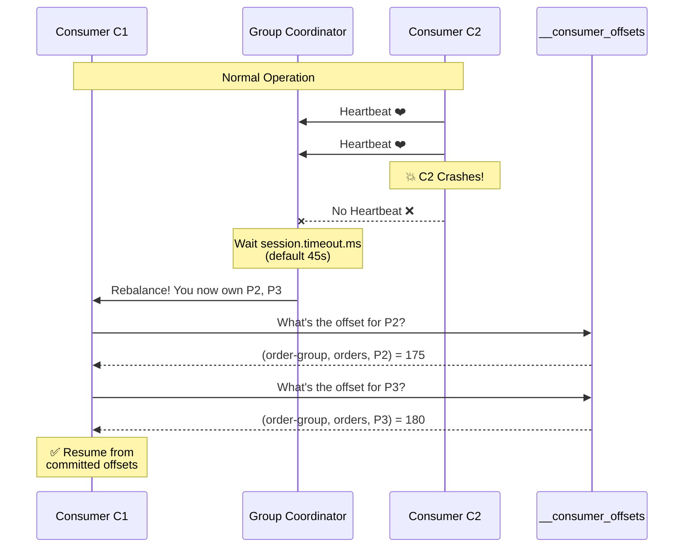

**Key Insight**: The offset belongs to the **GROUP**, not the consumer instance. When C2 crashes, its offsets remain in `__consumer_offsets`. C1 simply looks up these offsets and continues.

---

###### Scenario 2: New Consumer Joins the Group

```
┌─────────────────────────────────────────────────────────────────────────────────┐
│                    BEFORE: Single Consumer                                      │
├─────────────────────────────────────────────────────────────────────────────────┤
│                                                                                 │
│   Topic: orders (4 Partitions)                                                  │
│   ┌─────┐ ┌─────┐ ┌─────┐ ┌─────┐                                              │
│   │ P0  │ │ P1  │ │ P2  │ │ P3  │                                              │
│   │@100 │ │@150 │ │@200 │ │@175 │  ← Current offsets                           │
│   └──┬──┘ └──┬──┘ └──┬──┘ └──┬──┘                                              │
│      └───────┴───────┴───────┘                                                  │
│                  ▼                                                              │
│             ┌─────────┐                                                        │
│             │   C1    │     Handling all 4 partitions                          │
│             └─────────┘                                                        │
└─────────────────────────────────────────────────────────────────────────────────┘

                              🆕 C2 JOINS!

┌─────────────────────────────────────────────────────────────────────────────────┐
│                    AFTER: Load Balanced                                         │
├─────────────────────────────────────────────────────────────────────────────────┤
│                                                                                 │
│   ┌─────┐ ┌─────┐ ┌─────┐ ┌─────┐                                              │
│   │ P0  │ │ P1  │ │ P2  │ │ P3  │                                              │
│   │@100 │ │@150 │ │@200 │ │@175 │  ← Offsets UNCHANGED                         │
│   └──┬──┘ └──┬──┘ └──┬──┘ └──┬──┘                                              │
│      └───┬───┘       └───┬───┘                                                  │
│          ▼               ▼                                                      │
│     ┌─────────┐     ┌─────────┐                                                │
│     │   C1    │     │   C2    │                                                │
│     │ P0, P1  │     │ P2, P3  │                                                │
│     └─────────┘     └─────────┘                                                │
│                                                                                 │
│   C1: Continues P0 from offset 100, P1 from offset 150                         │
│   C2: Starts P2 from offset 200, P3 from offset 175 (GROUP's offsets!)         │
│                                                                                 │
│   ✅ C2 does NOT start from 0 - it uses the GROUP's committed offsets          │
└─────────────────────────────────────────────────────────────────────────────────┘
```

**Critical Understanding**: When C2 joins:

1. C2 does NOT have its own offset - it uses the **group's offset**
2. C2 continues from where the group left off (offset 200 for P2, 175 for P3)
3. No messages are re-processed, no messages are skipped

---

###### Scenario 3: Consumer Leaves Gracefully vs Crash

| Aspect                | Graceful Shutdown                   | Crash                                  |
| --------------------- | ----------------------------------- | -------------------------------------- |
| **How Detected**      | Consumer sends `LeaveGroup` request | Coordinator detects missing heartbeats |
| **Detection Time**    | Immediate                           | `session.timeout.ms` (default 45s)     |
| **Offset Impact**     | Last committed offset preserved     | Last committed offset preserved        |
| **Uncommitted Work**  | Can commit before leaving           | Lost - will be reprocessed             |
| **Rebalance Trigger** | Immediate                           | After timeout                          |

```mermaid
flowchart TD
    subgraph "Graceful Shutdown"
        A1[Consumer calls close] --> A2[Commit pending offsets]
        A2 --> A3[Send LeaveGroup to Coordinator]
        A3 --> A4[Immediate Rebalance]
        A4 --> A5["✅ No message loss<br/>✅ No duplicates"]
    end

    subgraph "Crash"
        B1["💥 Process killed/OOM/Network"] --> B2[No heartbeat sent]
        B2 --> B3["Wait session.timeout.ms<br/>(45 seconds)"]
        B3 --> B4[Coordinator marks consumer dead]
        B4 --> B5[Rebalance triggered]
        B5 --> B6["⚠️ Uncommitted messages<br/>will be reprocessed"]
    end

```

---

###### Scenario 4: All Consumers Leave - What Happens to Offsets?

```
┌─────────────────────────────────────────────────────────────────────────────────┐
│                    ALL CONSUMERS GONE                                           │
├─────────────────────────────────────────────────────────────────────────────────┤
│                                                                                 │
│   Topic: orders (4 Partitions)                                                  │
│   ┌─────┐ ┌─────┐ ┌─────┐ ┌─────┐                                              │
│   │ P0  │ │ P1  │ │ P2  │ │ P3  │   No consumers attached!                     │
│   └─────┘ └─────┘ └─────┘ └─────┘                                              │
│                                                                                 │
│   __consumer_offsets: STILL EXISTS!                                            │
│   ┌───────────────────────────────────────────────────────────────┐            │
│   │ (order-group, orders, P0) → offset: 500                       │            │
│   │ (order-group, orders, P1) → offset: 600                       │            │
│   │ (order-group, orders, P2) → offset: 550                       │            │
│   │ (order-group, orders, P3) → offset: 580                       │            │
│   └───────────────────────────────────────────────────────────────┘            │
│                                                                                 │
│   Offsets retained for: offsets.retention.minutes (default: 10080 = 7 days)    │
└─────────────────────────────────────────────────────────────────────────────────┘

                    ⏰ 3 days later... New consumer starts

┌─────────────────────────────────────────────────────────────────────────────────┐
│                    NEW CONSUMER WITH SAME GROUP ID                              │
├─────────────────────────────────────────────────────────────────────────────────┤
│                                                                                 │
│   ┌─────┐ ┌─────┐ ┌─────┐ ┌─────┐                                              │
│   │ P0  │ │ P1  │ │ P2  │ │ P3  │                                              │
│   │@500 │ │@600 │ │@550 │ │@580 │  ← Resumes from stored offsets!              │
│   └──┬──┘ └──┬──┘ └──┬──┘ └──┬──┘                                              │
│      └───────┴───────┴───────┘                                                  │
│                  ▼                                                              │
│             ┌─────────┐                                                        │
│             │ C1 NEW  │     Uses same group.id = "order-group"                 │
│             └─────────┘                                                        │
│                                                                                 │
│   ✅ Continues from offset 500, 600, 550, 580 - no reprocessing!               │
└─────────────────────────────────────────────────────────────────────────────────┘
```

**Offset Retention Timeline:**

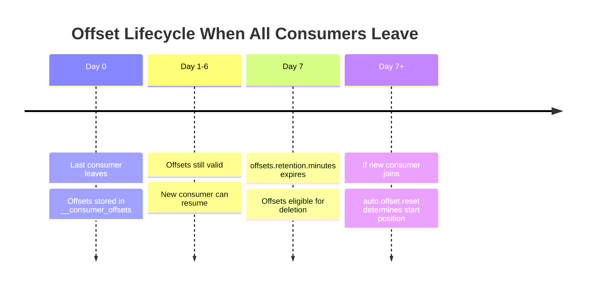

---

###### Scenario 5: New Consumer Group (Never Consumed Before)

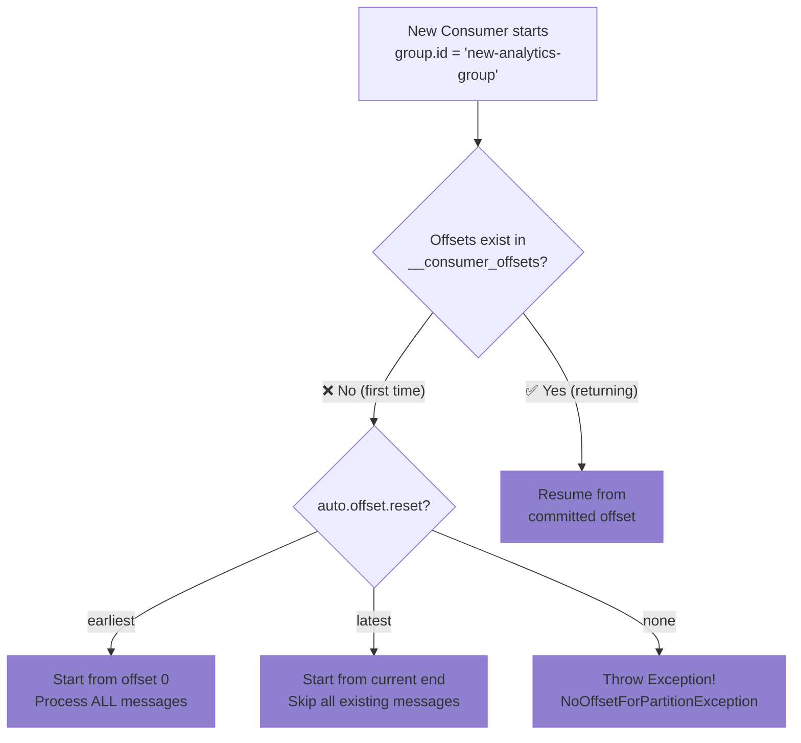

**Practical Example - Two Different Groups:**

```
Topic: orders (Messages 0-1000 exist)

┌─────────────────────────────────────────────────────────────────────┐
│  Group A: "order-processing-group"                                  │
│  - Has been running for weeks                                       │
│  - Current offset: 950                                              │
│  - Will continue from 950                                           │
└─────────────────────────────────────────────────────────────────────┘

┌─────────────────────────────────────────────────────────────────────┐
│  Group B: "new-analytics-group" (BRAND NEW)                         │
│  - Never consumed before                                            │
│  - No offset in __consumer_offsets                                  │
│                                                                     │
│  If auto.offset.reset=earliest → Start from 0 (process all 1000)   │
│  If auto.offset.reset=latest   → Start from 1000 (wait for new)    │
└─────────────────────────────────────────────────────────────────────┘
```

---

###### Complete Consumer Lifecycle State Machine

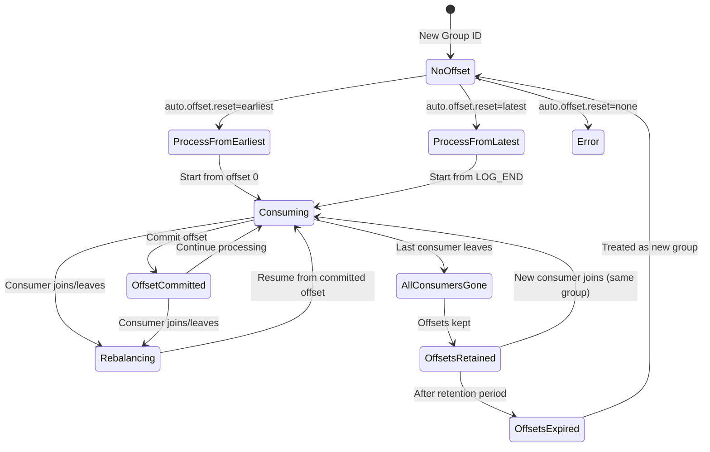

---

###### Summary: Offset Behavior Matrix

| Event                           | Offset Impact                                    | Recovery Behavior                             |
| ------------------------------- | ------------------------------------------------ | --------------------------------------------- |
| **Consumer crashes**            | Preserved in `__consumer_offsets`                | Other consumers resume from committed offset  |
| **Consumer graceful shutdown**  | Final offset committed, then preserved           | Same as crash, but immediate rebalance        |
| **New consumer joins group**    | No change to existing offsets                    | New consumer uses group's committed offsets   |
| **Consumer removed from group** | Offsets remain                                   | Redistributed partitions use existing offsets |
| **All consumers leave**         | Offsets retained for `offsets.retention.minutes` | New consumers resume if within retention      |
| **New consumer group created**  | No offsets exist                                 | `auto.offset.reset` determines start position |
| **Offsets expired**             | Deleted from `__consumer_offsets`                | Treated as new group                          |

> [!CAUTION] > **Common Pitfalls:**
>
> 1. **Changing group.id between deployments** → Loses all offset progress, starts fresh
> 2. **Processing time > auto.commit.interval** → Risk of duplicate processing on crash
> 3. **Offsets expired during long maintenance** → May reprocess or skip messages unexpectedly

> [!IMPORTANT] > **Common Debugging Tip**: If consumers are re-processing old messages after a restart, check:
>
> 1. Is `enable.auto.commit=true` but processing takes longer than `auto.commit.interval.ms`?
> 2. Is the consumer group ID changing between restarts?
> 3. Are offsets being reset due to `auto.offset.reset` policy?

##### Offset Management: CLI Commands & Operations

Kafka provides CLI tools to inspect and manage consumer offsets. These are essential for debugging and operational tasks.

**Essential kafka-consumer-groups.sh Commands:**

```bash
# List all consumer groups
kafka-consumer-groups.sh --bootstrap-server localhost:9092 --list

# Describe a specific group (shows offsets, lag, and assignments)
kafka-consumer-groups.sh --bootstrap-server localhost:9092 \
    --describe --group order-group

# Example output:
# GROUP        TOPIC    PARTITION  CURRENT-OFFSET  LOG-END-OFFSET  LAG   CONSUMER-ID
# order-group  orders   0          1523            1530            7     consumer-1-xxx
# order-group  orders   1          892             900             8     consumer-1-xxx
# order-group  orders   2          2105            2105            0     consumer-2-xxx
```

**Understanding Consumer Lag:**

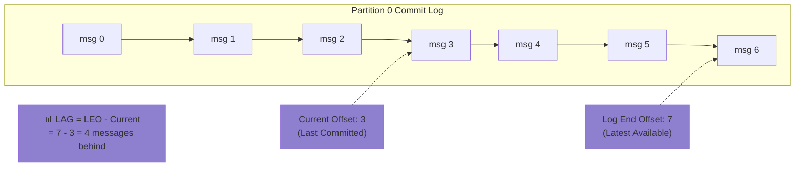

**Lag Interpretation Guide:**

| Lag Value      | Interpretation                       | Action                        |
| -------------- | ------------------------------------ | ----------------------------- |
| **0**          | Consumer is caught up                | ✅ Healthy                    |
| **1-100**      | Minor lag, likely normal fluctuation | 👀 Monitor                    |
| **100-1000**   | Consumer struggling to keep up       | ⚠️ Investigate                |
| **1000+**      | Serious backlog                      | 🚨 Scale up or fix processing |
| **Increasing** | Getting worse over time              | 🔥 Urgent attention needed    |

##### Resetting Consumer Offsets

Sometimes you need to reprocess messages (e.g., bug fix, new feature). Kafka allows offset reset with the consumer group **stopped**.

**Reset Strategies:**

```bash
# ⚠️ IMPORTANT: Stop all consumers in the group first!

# Reset to earliest (reprocess everything)
kafka-consumer-groups.sh --bootstrap-server localhost:9092 \
    --group order-group --reset-offsets --to-earliest \
    --topic orders --execute

# Reset to latest (skip to end, ignore backlog)
kafka-consumer-groups.sh --bootstrap-server localhost:9092 \
    --group order-group --reset-offsets --to-latest \
    --topic orders --execute

# Reset to specific offset
kafka-consumer-groups.sh --bootstrap-server localhost:9092 \
    --group order-group --reset-offsets --to-offset 1000 \
    --topic orders:0 --execute  # partition 0 only

# Reset to specific datetime
kafka-consumer-groups.sh --bootstrap-server localhost:9092 \
    --group order-group --reset-offsets \
    --to-datetime 2024-01-15T10:00:00.000 \
    --topic orders --execute

# Shift by N (go back 100 messages)
kafka-consumer-groups.sh --bootstrap-server localhost:9092 \
    --group order-group --reset-offsets --shift-by -100 \
    --topic orders --execute
```

**Offset Reset Decision Flowchart:**

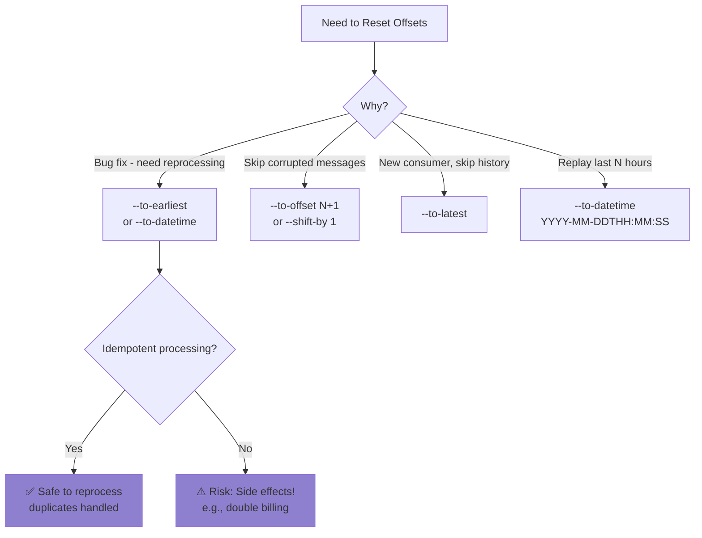

> [!CAUTION] > **Before Resetting Offsets:**
>
> 1. **Stop ALL consumers** in the group first
> 2. Ensure your processing is **idempotent** if reprocessing
> 3. Use `--dry-run` to preview changes before `--execute`
> 4. Consider downstream effects (will you send duplicate events?)

##### Monitoring Offsets in Spring Boot

You can programmatically access offset information in Spring:

```java
@Autowired
private KafkaListenerEndpointRegistry registry;

@Autowired
private ConsumerFactory<String, String> consumerFactory;

// Get current positions for a listener
public void logConsumerPositions() {
    registry.getListenerContainers().forEach(container -> {
        // Access metrics and assignment info
        container.getAssignedPartitions().forEach(tp -> {
            System.out.println("Assigned: " + tp);
        });
    });
}

// Use AdminClient to describe consumer groups
public void describeConsumerGroup(String groupId) {
    try (AdminClient admin = AdminClient.create(
            Map.of("bootstrap.servers", "localhost:9092"))) {

        DescribeConsumerGroupsResult result = admin
            .describeConsumerGroups(List.of(groupId));

        ConsumerGroupDescription description =
            result.describedGroups().get(groupId).get();

        description.members().forEach(member -> {
            System.out.println("Member: " + member.consumerId());
            System.out.println("Partitions: " + member.assignment().topicPartitions());
        });
    }
}
```

**Spring Boot Actuator Kafka Metrics:**

If using Spring Boot Actuator, key Kafka consumer metrics are exposed:

| Metric                                                | Description                   |
| ----------------------------------------------------- | ----------------------------- |
| `kafka.consumer.records.lag`                          | Current lag per partition     |
| `kafka.consumer.records.lag.max`                      | Maximum lag across partitions |
| `kafka.consumer.fetch.manager.records.consumed.total` | Total records consumed        |
| `kafka.consumer.coordinator.commit.latency.avg`       | Avg commit latency            |

```yaml
# Enable in application.yml
management:
  endpoints:
    web:
      exposure:
        include: health,metrics,prometheus
  metrics:
    enable:
      kafka: true
```

---

## 2. Spring for Apache Kafka

Spring Boot uses the [Spring for Apache Kafka](https://spring.io/projects/spring-kafka) project to provide high-level abstractions.

### Key Abstractions

1.  **`KafkaTemplate<K, V>`**: The core class for sending messages. It handles the serialization and network communication.
2.  **`@KafkaListener`**: An annotation-driven approach to define message consumers easily.
3.  **`MessageListenerContainer`**: The underlying engine that polls Kafka, dispatches messages to your listeners, and handles offset commits.

**Spring Kafka Component Reference**:

| Component                                 | Purpose                        | How to Use                              | When to Customize               |
| ----------------------------------------- | ------------------------------ | --------------------------------------- | ------------------------------- |
| `KafkaTemplate<K,V>`                      | Send messages to Kafka         | Inject via `@Autowired`, call `.send()` | Custom serializers, headers     |
| `@KafkaListener`                          | Consume messages               | Annotate a method                       | Always use for consumers        |
| `MessageListenerContainer`                | Manages poll loop & threading  | Auto-configured                         | Concurrency, error handling     |
| `ConsumerFactory<K,V>`                    | Creates Kafka consumers        | Define `@Bean` if custom config         | SSL, SASL, custom deserializers |
| `ProducerFactory<K,V>`                    | Creates Kafka producers        | Define `@Bean` if custom config         | Transactions, idempotence       |
| `KafkaAdmin`                              | Manage topics programmatically | Auto-configured, inject to use          | Create/delete topics in code    |
| `ConcurrentKafkaListenerContainerFactory` | Configure listener containers  | Define `@Bean`                          | Custom ack mode, concurrency    |

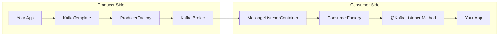

---

## 3. Setup & Configuration

### 3.1 Dependencies

For a Maven project, add the starter:

```xml
<dependency>
    <groupId>org.springframework.kafka</groupId>
    <artifactId>spring-kafka</artifactId>
</dependency>
```

For Gradle:

```gradle
implementation 'org.springframework.kafka:spring-kafka'
```

### 3.2 Basic Configuration (`application.yml`)

Spring Boot auto-configuration makes setup easy. You mainly need to point to your brokers.

```yaml
spring:
  kafka:
    bootstrap-servers: localhost:9092 # Comma-separated list of brokers

    # Producer Defaults
    producer:
      key-serializer: org.apache.kafka.common.serialization.StringSerializer
      value-serializer: org.apache.kafka.common.serialization.StringSerializer
      # optimization settings
      retries: 3

    # Consumer Defaults
    consumer:
      group-id: my-application-group
      auto-offset-reset: earliest # Start from beginning if no offset exists
      key-deserializer: org.apache.kafka.common.serialization.StringDeserializer
      value-deserializer: org.apache.kafka.common.serialization.StringDeserializer
```

**Essential Configuration Properties Reference**:

| Property                           | Default          | Values                       | Description                                   |
| ---------------------------------- | ---------------- | ---------------------------- | --------------------------------------------- |
| `bootstrap-servers`                | `localhost:9092` | host:port list               | Broker addresses (comma-separated)            |
| **Producer**                       |
| `producer.acks`                    | `1`              | `0`, `1`, `all`              | 0=fire-forget, 1=leader ack, all=full ISR ack |
| `producer.retries`                 | `2147483647`     | integer                      | Retry attempts before failure                 |
| `producer.batch-size`              | `16384`          | bytes                        | Batch size before sending                     |
| `producer.linger-ms`               | `0`              | ms                           | Wait time to batch more messages              |
| `producer.buffer-memory`           | `33554432`       | bytes                        | Total memory for buffering                    |
| **Consumer**                       |
| `consumer.group-id`                | -                | string                       | **Required** - Consumer group name            |
| `consumer.auto-offset-reset`       | `latest`         | `earliest`, `latest`, `none` | Where to start if no offset                   |
| `consumer.enable-auto-commit`      | `true`           | boolean                      | Auto-commit offsets                           |
| `consumer.auto-commit-interval-ms` | `5000`           | ms                           | Auto-commit frequency                         |
| `consumer.max-poll-records`        | `500`            | integer                      | Max records per poll()                        |

### 3.3 Handling JSON Objects (Real World)

Strings are boring. In real apps, you exchange objects.

**Producer Config**:

```yaml
spring.kafka.producer.value-serializer: org.springframework.kafka.support.serializer.JsonSerializer
```

**Consumer Config**:

```yaml
spring.kafka.consumer.value-deserializer: org.springframework.kafka.support.serializer.JsonDeserializer
spring.kafka.consumer.properties:
  spring.json.trusted.packages: "*" # WARNING: In prod, list specific packages for security
```

**Usage**:

```java
public void sendOrder(Order order) { // Order is a POJO
    kafkaTemplate.send("orders", order.getId(), order);
}
```

**Serializer/Deserializer Comparison**:

| Format       | Serializer                | Deserializer                | Pros                      | Cons                     | Use Case                     |
| ------------ | ------------------------- | --------------------------- | ------------------------- | ------------------------ | ---------------------------- |
| **String**   | `StringSerializer`        | `StringDeserializer`        | Simple, human-readable    | No structure             | Logs, simple messages        |
| **JSON**     | `JsonSerializer`          | `JsonDeserializer`          | Flexible, easy debug      | Larger size, slower      | Most applications            |
| **Avro**     | `KafkaAvroSerializer`     | `KafkaAvroDeserializer`     | Schema evolution, compact | Requires Schema Registry | Enterprise, evolving schemas |
| **Protobuf** | `KafkaProtobufSerializer` | `KafkaProtobufDeserializer` | Very compact, fast        | More setup required      | High-performance systems     |
| **Bytes**    | `ByteArraySerializer`     | `ByteArrayDeserializer`     | Full control              | Manual handling          | Custom binary formats        |

> [!IMPORTANT] > **JSON Security**: Always set `spring.json.trusted.packages` to specific packages in production. Using `"*"` allows deserialization of any class, which is a security risk.

---

## 4. Producing Messages

The `KafkaTemplate` provides convenient methods to send data.

**KafkaTemplate Methods Quick Reference**:

| Method Signature                                | Description                    | Partition Selection            |
| ----------------------------------------------- | ------------------------------ | ------------------------------ |
| `send(topic, value)`                            | Send value only                | Round-robin / Sticky           |
| `send(topic, key, value)`                       | Send with key                  | `hash(key) % partitions`       |
| `send(topic, partition, key, value)`            | Send to specific partition     | Explicit partition             |
| `send(topic, partition, timestamp, key, value)` | Full control                   | Explicit partition + timestamp |
| `send(ProducerRecord<K,V>)`                     | Complete record with headers   | As specified in record         |
| `sendDefault(value)`                            | Send to default topic          | Round-robin                    |
| `sendDefault(key, value)`                       | Send to default topic with key | `hash(key) % partitions`       |

### 4.1 Simple Production (Asynchronous)

```java
@Service
public class OrderProducer {

    private final KafkaTemplate<String, String> kafkaTemplate;

    public OrderProducer(KafkaTemplate<String, String> kafkaTemplate) {
        this.kafkaTemplate = kafkaTemplate;
    }

    public void sendOrder(String orderId, String orderData) {
        // Topic, Key, Value
        // Using a Key ensures all messages for same order go to SAME partition (Ordering)
        kafkaTemplate.send("orders", orderId, orderData);
    }
}
```

### 4.2 Handling Results (Callbacks)

Since `send()` is async, it returns a `CompletableFuture<SendResult<K, V>>`. You should attach callbacks to handle success or failure (e.g., broker down).

```java
public void sendOrderWithCallback(String orderId, String orderData) {
    var future = kafkaTemplate.send("orders", orderId, orderData);

    future.whenComplete((result, ex) -> {
        if (ex == null) {
            System.out.println("Sent " + orderData + " with offset " + result.getRecordMetadata().offset());
        } else {
            System.err.println("Unable to send message: " + ex.getMessage());
        }
    });
}
```

---

## 5. Consuming Messages

Spring makes consumption easy with `@KafkaListener`.

**@KafkaListener Annotation Parameters**:

| Parameter          | Type     | Default     | Description                          |
| ------------------ | -------- | ----------- | ------------------------------------ |
| `topics`           | String[] | -           | Topic names to subscribe to          |
| `groupId`          | String   | from config | Override consumer group ID           |
| `concurrency`      | String   | `"1"`       | Number of consumer threads           |
| `containerFactory` | String   | default     | Custom container factory bean        |
| `errorHandler`     | String   | -           | Bean name for error handler          |
| `topicPattern`     | String   | -           | Regex pattern for topic subscription |
| `autoStartup`      | String   | `"true"`    | Start listening on app startup       |
| `properties`       | String[] | -           | Additional consumer properties       |

### 5.1 The Simple Listener

```java
@Service
public class OrderConsumer {

    @KafkaListener(topics = "orders", groupId = "order-group")
    public void listen(String message) {
        System.out.println("Received Message: " + message);
        // Process message...
    }
}
```

### 5.2 Accessing Headers & Metadata

Often you need the partition, offset, or custom headers.

```java
@KafkaListener(topics = "orders", groupId = "order-group")
public void listenWithHeaders(
        @Payload String message,
        @Header(KafkaHeaders.RECEIVED_PARTITION) int partition,
        @Header(KafkaHeaders.OFFSET) long offset) {

    System.out.printf("Received %s from P%d at Offset %d%n", message, partition, offset);
}
```

**Available Headers for Injection**:

| Header Constant      | Type   | Description           |
| -------------------- | ------ | --------------------- |
| `RECEIVED_TOPIC`     | String | Topic name            |
| `RECEIVED_PARTITION` | int    | Partition number      |
| `OFFSET`             | long   | Message offset        |
| `RECEIVED_KEY`       | K      | Message key           |
| `RECEIVED_TIMESTAMP` | long   | Message timestamp     |
| `GROUP_ID`           | String | Consumer group ID     |
| `CORRELATION_ID`     | byte[] | Correlation ID header |

### 5.3 Concurrency (Scaling Up)

"How do I process faster?"

- **Concurrency Level**: If you set `concurrency = "3"`, Spring creates **3 consumer threads** for this listener.
  - _Constraint_: Total threads across all instances <= Total Partitions. Excess threads sit idle.

```java
@KafkaListener(topics = "orders", groupId = "order-group", concurrency = "3")
public void listenParallel(String message) { ... }
```

**Concurrency Scaling Scenarios**:

| Partitions | App Instances | Concurrency/Instance | Total Threads | Active | Idle | Status            |
| ---------- | ------------- | -------------------- | ------------- | ------ | ---- | ----------------- |
| 4          | 1             | 2                    | 2             | 2      | 0    | ✅ Under-utilized |
| 4          | 1             | 4                    | 4             | 4      | 0    | ✅ Optimal        |
| 4          | 1             | 6                    | 6             | 4      | 2    | ⚠️ 2 idle threads |
| 4          | 2             | 2                    | 4             | 4      | 0    | ✅ Optimal        |
| 4          | 2             | 4                    | 8             | 4      | 4    | ⚠️ 4 idle threads |
| 12         | 3             | 4                    | 12            | 12     | 0    | ✅ Optimal        |

> [!TIP] > **Formula**: `Active Threads = min(Total Threads, Total Partitions)`
> Design for `Total Partitions >= Expected Max Threads` to avoid idle consumers.

---

## 6. Advanced Integration: Transactions & Reliability

### 6.1 Kafka + Database Transactions (The "Dual Write" Problem)

**The Scenario**: You want to save an Order to your Database AND send a Kafka message.

- If DB commit fails, you shouldn't send the message.
- If Kafka send fails, you should rollback the DB.

**Solution 1: Transactional Synchronization (Best Effort 1PC)**
Spring allows you to synchronize the Kafka transaction with the DB transaction. This is not a true distributed transaction (XA), but it handles 99% of use cases.

**Requirements**:

1.  Enable transactions in `application.yml`:
    ```yaml
    spring:
      kafka:
        producer:
          transaction-id-prefix: tx- # Enables transactional producer
    ```
2.  Use `@Transactional`.

```java
@Service
public class OrderService {

    private final KafkaTemplate<String, String> kafkaTemplate;
    private final OrderRepository orderRepo;

    // This annotation starts a DB transaction.
    // Because kafkaTemplate is transactional, it will join "logically".
    @Transactional
    public void createOrder(Order order) {
        // 1. Save to DB
        orderRepo.save(order);

        // 2. Send to Kafka
        // The message is sent to the broker but marked "Pending".
        // It will only be "Committed" (visible to consumers) if the DB tx commits successfully.
        kafkaTemplate.send("orders", order.getId(), "Created");

        // If an exception is thrown here, DB rolls back AND Kafka sends a generic abort.
    }
}
```

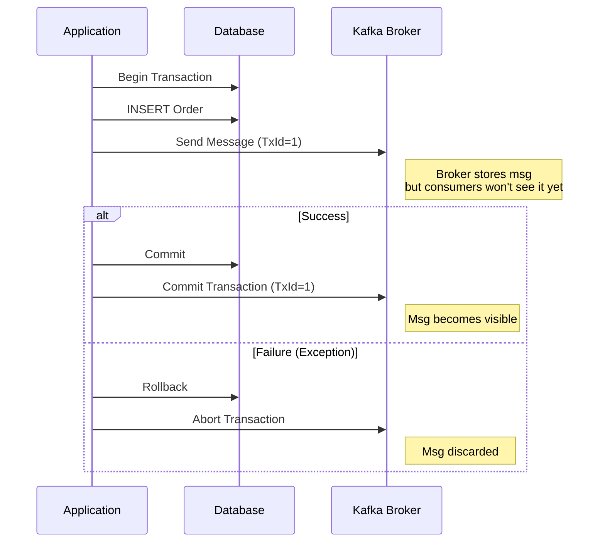

**Caveat**: If the DB commit succeeds, but the subsequent network call to "commit" the Kafka transaction fails, you might have inconsistencies (Data in DB, not in Kafka).

- **Mitigation**: The **Transactional Outbox Pattern**. Save the message to a "outbox" table in the SAME DB transaction. A separate poller reads the table and pushes to Kafka.

### 6.2 Error Handling & Retry (The "Poison Pill")

What if your logic throws an exception while consuming?

**Default Behavior**: Spring will catch the error, log it, and then **Retrying**. If it keeps failing, it might get into an infinite loop or drop the message depending on config.

**Best Practice: Dead Letter Topic (DLT)**
Use a `DeadLetterPublishingRecoverer`. If a message fails N times, send it to `orders.DLT` so you don't block the main queue.

```java
@Bean
public CommonErrorHandler errorHandler(KafkaTemplate<Object, Object> template) {
    // Up to 3 retry attempts (4 total), 1 second apart
    DefaultErrorHandler handler = new DefaultErrorHandler(
            new DeadLetterPublishingRecoverer(template),
            new FixedBackOff(1000L, 3)); // interval=1000ms, maxAttempts=3
    return handler;
}
```

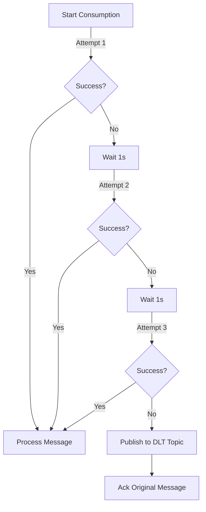

---

## 7. Testing with `@EmbeddedKafka`

Don't require a running Kafka for unit tests. Use the embedded broker.

```java
@SpringBootTest
@EmbeddedKafka(partitions = 1, topics = { "orders" })
class KafkaOrderTest {

    @Autowired
    private KafkaTemplate<String, String> template;

    @Autowired
    private KafkaListenerEndpointRegistry registry;

    @Test
    void testSendAndReceive() {
        template.send("orders", "test-order");
        // Use Awaitility or similar to verify consumption
    }
}
```

---

## 8. Common Misconceptions & FAQ

### 8.1 "Does a partition just connect to one consumer?"

**Short Answer**: Yes AND No. It depends on the **Consumer Group**.

- **Within ONE Group**: Yes. A partition is processed by _only one_ consumer instance to guarantee order.
- **Across MANY Groups**: No. Each group gets its own copy.

**Visualizing Fan-Out vs Load Balancing**:

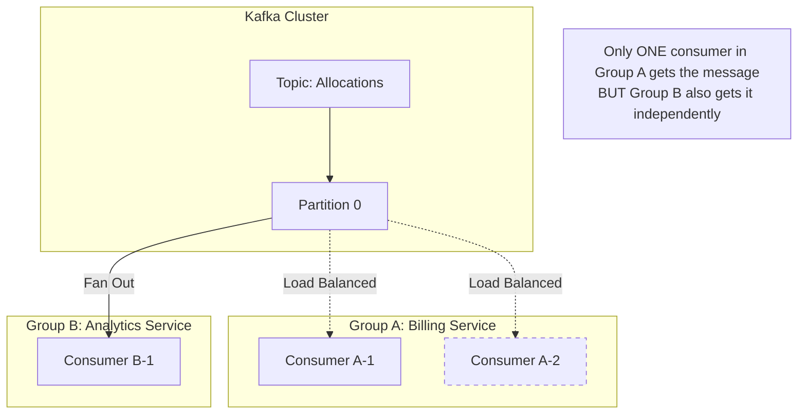

### 8.2 "Does Kafka guarantee Global Ordering?"

**Myth**: "If I send msg A then msg B, all consumers see A then B."
**Reality**: Kafka only guarantees ordering **within a Partition**.

- If A goes to Partition 0 and B goes to Partition 1, a consumer might see B before A.
- _Fix_: Use the same **Key** if relative order matters (e.g., `orderId`).

### 8.3 "Does Kafka push data to me?"

**Myth**: Kafka pushes messages like a webhook.
**Reality**: Kafka Consumers **POLL** (pull) data.

- Your application allows the `poll()` loop to run.
- This is why effective "backpressure" is easier; if you are slow, you just poll slower.

### 8.4 "Should I just add more consumers to go faster?"

**Trap**: The "Idle Consumer" Problem.

- If you have **10 Partitions** and start **15 Consumers**, **5 will do nothing**.
- You cannot have more active consumers than partitions in a single group.

---

## 9. Deep Dive: Message Keys & Partitioning Strategy

You asked: _"How do I set it? When? What are the trade-offs?"_

**Decision Flowchart: Should I Use a Key?**

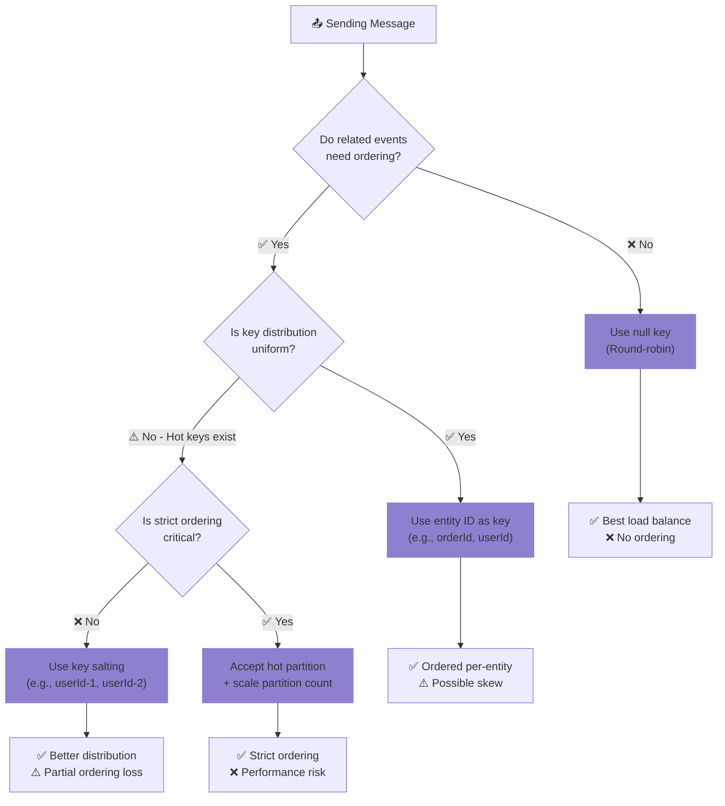

### 9.1 How to set a Key

In Spring Boot, it's just the second argument to `send()`.

```java
// Template signature: send(topic, key, value)
kafkaTemplate.send("orders", "order-123", myOrderObj);
```

### 9.2 Strategy: To Key or Not to Key?

**Key Strategy Comparison Table**:

| Strategy               | Key Value       | Partition Selection | Ordering        | Load Balance               | Use Case                          |
| ---------------------- | --------------- | ------------------- | --------------- | -------------------------- | --------------------------------- |
| **No Key**             | `null`          | Sticky/Round-robin  | ❌ None         | ✅ Perfect                 | Logs, metrics, independent events |
| **Entity Key**         | `orderId`       | `hash % partitions` | ✅ Per-entity   | ⚠️ Depends on distribution | Order events, user actions        |
| **Compound Key**       | `region:userId` | `hash % partitions` | ✅ Per-compound | ⚠️ Better than single      | Multi-tenant systems              |
| **Salted Key**         | `userId-{0-9}`  | Spread across 10    | ⚠️ Partial      | ✅ Better for hot keys     | Celebrity/VIP users               |
| **Explicit Partition** | Any             | You choose          | ⚠️ Manual       | ⚠️ Manual                  | Special routing needs             |

#### Option A: No Key (The "Spray and Pray")

If you pass `null` as the key.

- **Behavior**: Kafka (default partitioner) uses **Sticky Partitioning**. It sticks to one partition for a batch of messages, then switches to the next. Effectively Round-Robin.
- **Pros**: Perfect Load Balancing. All consumers share the work equally.
- **Cons**: **NO Ordering**. Order #1 could process after Order #2 for the same customer.

#### Option B: With Key (The "Semantic Partitioning")

If you pass a specific value (e.g., `customerId`).

- **Behavior**: `hash(key) % num_partitions`.
- **Pros**: **Strict Ordering**. All events for `customerId=100` ALWAYS go to Partition 5.
- **Cons**: **Data Skew** (Hot Partitions).

### 9.3 The Trade-off

> **You trade Load Balancing for Ordering.**

- If you need to process updates to a State Machine (e.g. Created -> Paid -> Shipped), you **MUST** use a Key.
- If you are just logging events (e.g. "User clicked button"), you **SHOULD NOT** use a Key.

**Trade-off Matrix**:

| Requirement         | No Key     | Entity Key      | Salted Key |
| ------------------- | ---------- | --------------- | ---------- |
| Max Throughput      | ✅ Best    | ⚠️ Variable     | ✅ Good    |
| Ordering per Entity | ❌ None    | ✅ Guaranteed   | ⚠️ Partial |
| Load Balance        | ✅ Perfect | ⚠️ Risk of skew | ✅ Better  |
| Simplicity          | ✅ Easy    | ✅ Easy         | ⚠️ Complex |

### 9.4 Real World Problem: The "Justin Bieber" Effect (Data Skew)

**Scenario**: You are Twitter. You partition by `userId`.

- **Normal Users**: Send 1 tweet/day.
- **Justin Bieber**: Sends 1 tweet/day, BUT his key might be used for "Follower Notification" events? (Bad example, but imagine a key that has 1000x more traffic).
- **The Problem**:
  - Partition 1 (Normal users): 10 msg/sec. Consumer A is bored.
  - Partition 2 (Justin Bieber): 10,000 msg/sec. Consumer B is melting and lagging 5 hours behind.
  - **This is a "Hot Partition".**

**Solution: Salting (Split Key)**
If ordering is less important than survival for huge keys.

1.  **Detect** the "Hot Key" (Justin Bieber).
2.  **Appended Randomness**: Instead of key=`bieber`, send as `bieber-1`, `bieber-2` ... `bieber-10`.
3.  **Result**: Messages are scattered to 10 partitions.
4.  **Trade-off**: You lost strict global ordering for Bieber, but your cluster survives. You handle re-sequencing in the app layer if needed.

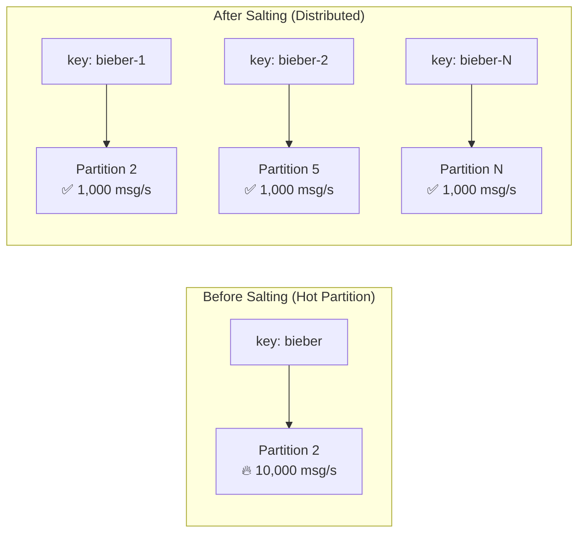

### 9.5 Deep Dive: Hot Partitions - Causes, Detection & Solutions

A **Hot Partition** is a partition that receives disproportionately more traffic than others, causing performance bottlenecks, consumer lag, and potential system failures.

#### What is a Hot Partition?

```
┌─────────────────────────────────────────────────────────────────────────────────┐
│                         HOT PARTITION VISUALIZED                                │
├─────────────────────────────────────────────────────────────────────────────────┤
│                                                                                 │
│   Topic: user-events (6 Partitions)                                             │
│                                                                                 │
│   Messages/sec per partition:                                                   │
│                                                                                 │
│   P0: ████░░░░░░░░░░░░░░░░░░░░░░░░░░  500 msg/s   ✅ Normal                     │
│   P1: ███░░░░░░░░░░░░░░░░░░░░░░░░░░░  400 msg/s   ✅ Normal                     │
│   P2: █████████████████████████████░  50,000 msg/s 🔥 HOT!                      │
│   P3: ████░░░░░░░░░░░░░░░░░░░░░░░░░░  450 msg/s   ✅ Normal                     │
│   P4: ███░░░░░░░░░░░░░░░░░░░░░░░░░░░  380 msg/s   ✅ Normal                     │
│   P5: ████░░░░░░░░░░░░░░░░░░░░░░░░░░  420 msg/s   ✅ Normal                     │
│                                                                                 │
│   Consumer Lag:                                                                 │
│   P0: 0      P1: 0      P2: 2,500,000 🚨   P3: 0      P4: 0      P5: 0          │
│                                                                                 │
│   Problem: P2 receives 100x more traffic → Consumer can't keep up!             │
└─────────────────────────────────────────────────────────────────────────────────┘
```

#### Why Hot Partitions Happen

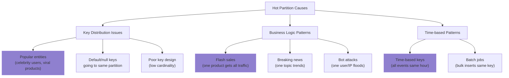

#### Real-World Examples of Hot Partitions

##### Example 1: E-Commerce Flash Sale

```
┌─────────────────────────────────────────────────────────────────────────────────┐
│                    SCENARIO: Black Friday Flash Sale                            │
├─────────────────────────────────────────────────────────────────────────────────┤
│                                                                                 │
│   Topic: order-events                                                           │
│   Key: productId                                                                │
│                                                                                 │
│   Normal Day:                                                                   │
│   ┌──────────┐ ┌──────────┐ ┌──────────┐ ┌──────────┐                          │
│   │Product A │ │Product B │ │Product C │ │Product D │                          │
│   │ 100/sec  │ │ 120/sec  │ │  80/sec  │ │ 110/sec  │                          │
│   └────┬─────┘ └────┬─────┘ └────┬─────┘ └────┬─────┘                          │
│        │            │            │            │                                 │
│        ▼            ▼            ▼            ▼                                 │
│      [P0]        [P1]         [P2]         [P3]     ← Balanced                  │
│                                                                                 │
│   Flash Sale Day (iPhone 50% off):                                              │
│   ┌──────────┐ ┌──────────┐ ┌──────────┐ ┌──────────┐                          │
│   │Product A │ │ iPhone   │ │Product C │ │Product D │                          │
│   │ 100/sec  │ │50,000/sec│ │  80/sec  │ │ 110/sec  │                          │
│   └────┬─────┘ └────┬─────┘ └────┬─────┘ └────┬─────┘                          │
│        │            │            │            │                                 │
│        ▼            ▼            ▼            ▼                                 │
│      [P0]        [P1] 🔥       [P2]         [P3]                                │
│     Normal      MELTING!      Normal       Normal                              │
│                                                                                 │
│   Result:                                                                       │
│   - P1 consumer 5 hours behind                                                  │
│   - Orders stuck in queue                                                       │
│   - Customers see "processing" for hours                                        │
│   - Revenue loss!                                                               │
└─────────────────────────────────────────────────────────────────────────────────┘
```

##### Example 2: Social Media Viral Event

```
┌─────────────────────────────────────────────────────────────────────────────────┐
│                    SCENARIO: Celebrity Tweet Goes Viral                         │
├─────────────────────────────────────────────────────────────────────────────────┤
│                                                                                 │
│   Topic: notifications                                                          │
│   Key: targetUserId (who receives the notification)                             │
│                                                                                 │
│   When @elonmusk tweets:                                                        │
│   - 150 million followers                                                       │
│   - Each follower gets a notification                                           │
│   - All notifications have different targetUserId (followers)                   │
│   - ✅ Distributed evenly - NO hot partition                                    │
│                                                                                 │
│   When someone @mentions @elonmusk:                                             │
│   - Notification key = "elonmusk" (target)                                      │
│   - 10,000 people mention him per minute                                        │
│   - All go to SAME partition!                                                   │
│   - 🔥 HOT PARTITION                                                            │
│                                                                                 │
│   ┌─────────────────────────────────────────────────────────────┐              │
│   │  @user1 mentions @elonmusk  ──┐                             │              │
│   │  @user2 mentions @elonmusk  ──┤                             │              │
│   │  @user3 mentions @elonmusk  ──┼──▶ Partition 7 🔥           │              │
│   │  @user4 mentions @elonmusk  ──┤    (key: "elonmusk")        │              │
│   │  ... 10,000 more ...        ──┘                             │              │
│   └─────────────────────────────────────────────────────────────┘              │
└─────────────────────────────────────────────────────────────────────────────────┘
```

##### Example 3: IoT Sensor Data

```
┌─────────────────────────────────────────────────────────────────────────────────┐
│                    SCENARIO: IoT Temperature Sensors                            │
├─────────────────────────────────────────────────────────────────────────────────┤
│                                                                                 │
│   Topic: sensor-readings                                                        │
│   Key: regionId                                                                 │
│                                                                                 │
│   Problem: Uneven sensor distribution                                           │
│                                                                                 │
│   ┌─────────────────┐  ┌─────────────────┐  ┌─────────────────┐                │
│   │   Region: NYC   │  │  Region: Rural  │  │ Region: Tokyo   │                │
│   │   50,000 sensors│  │    500 sensors  │  │  80,000 sensors │                │
│   │   500K msg/sec  │  │   5K msg/sec    │  │   800K msg/sec  │                │
│   └────────┬────────┘  └────────┬────────┘  └────────┬────────┘                │
│            │                    │                    │                          │
│            ▼                    ▼                    ▼                          │
│        [P0] 🔥              [P1] ✅              [P2] 🔥🔥                      │
│        HOT                  Normal               VERY HOT                       │
│                                                                                 │
│   Better Key Design: sensorId instead of regionId                              │
│   - 130,500 unique sensors                                                      │
│   - Distributed across all partitions evenly                                    │
└─────────────────────────────────────────────────────────────────────────────────┘
```

#### How to Detect Hot Partitions

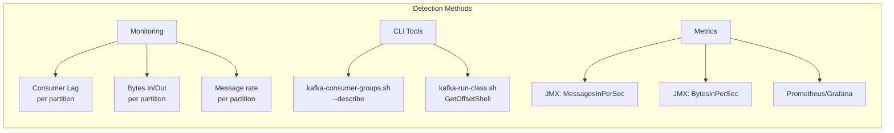

**CLI Detection Commands:**

```bash
# Check consumer lag per partition - look for uneven LAG values
kafka-consumer-groups.sh --bootstrap-server localhost:9092 \
    --describe --group order-service

# Example output showing hot partition:
# GROUP         TOPIC    PARTITION  CURRENT-OFFSET  LOG-END-OFFSET  LAG
# order-service orders   0          1000            1005            5       ← OK
# order-service orders   1          500             2500000         2499500 ← 🔥 HOT!
# order-service orders   2          800             810             10      ← OK
# order-service orders   3          1200            1210            10      ← OK

# Check partition sizes
kafka-log-dirs.sh --bootstrap-server localhost:9092 \
    --describe --topic-list orders
```

#### Solutions for Hot Partitions

##### Solution 1: Key Salting (Recommended for Most Cases)

```
┌─────────────────────────────────────────────────────────────────────────────────┐
│                         KEY SALTING STRATEGY                                    │
├─────────────────────────────────────────────────────────────────────────────────┤
│                                                                                 │
│   Original Key: "celebrity-user-123"                                            │
│   All messages → hash("celebrity-user-123") % 6 → Partition 2 🔥                │
│                                                                                 │
│   Salted Keys: "celebrity-user-123-0", "celebrity-user-123-1", ... "-9"         │
│                                                                                 │
│   ┌─────────────────────────────────────────────────────────────────────────┐  │
│   │  Message 1: key = "celebrity-user-123-0" → hash() % 6 → P0              │  │
│   │  Message 2: key = "celebrity-user-123-1" → hash() % 6 → P3              │  │
│   │  Message 3: key = "celebrity-user-123-2" → hash() % 6 → P1              │  │
│   │  Message 4: key = "celebrity-user-123-3" → hash() % 6 → P5              │  │
│   │  Message 5: key = "celebrity-user-123-4" → hash() % 6 → P2              │  │
│   │  ...                                                                     │  │
│   └─────────────────────────────────────────────────────────────────────────┘  │
│                                                                                 │
│   Result: 50,000 msg/sec distributed across ~10 partitions = 5,000/partition   │
│                                                                                 │
│   Trade-off: Lost strict ordering for this key (acceptable for most cases)     │
└─────────────────────────────────────────────────────────────────────────────────┘
```

**Java Implementation - Key Salting:**

```java
@Service
public class SaltedKeyProducer {

    private final KafkaTemplate<String, OrderEvent> kafkaTemplate;
    private final Random random = new Random();

    // Number of salt buckets - tune based on expected hot key traffic
    private static final int SALT_BUCKETS = 10;

    // Set of known hot keys (can be loaded from config/database)
    private final Set<String> hotKeys = Set.of(
        "celebrity-user-123",
        "viral-product-456",
        "breaking-news-topic"
    );

    public void sendEvent(String key, OrderEvent event) {
        String finalKey = key;

        // Apply salting only to known hot keys
        if (hotKeys.contains(key)) {
            int salt = random.nextInt(SALT_BUCKETS);
            finalKey = key + "-" + salt;
        }

        kafkaTemplate.send("orders", finalKey, event);
    }

    // For cases where you need partial ordering within salt bucket
    public void sendEventWithConsistentSalt(String key, String subKey, OrderEvent event) {
        String finalKey = key;

        if (hotKeys.contains(key)) {
            // Use subKey hash for consistent routing within the hot key
            // e.g., same session always goes to same salt bucket
            int salt = Math.abs(subKey.hashCode()) % SALT_BUCKETS;
            finalKey = key + "-" + salt;
        }

        kafkaTemplate.send("orders", finalKey, event);
    }
}
```

##### Solution 2: Custom Partitioner

```java
/**
 * Custom partitioner that handles hot keys specially
 */
public class HotKeyAwarePartitioner implements Partitioner {

    private final Set<String> hotKeys = new ConcurrentHashMap<String, Boolean>().keySet(true);
    private final AtomicInteger roundRobinCounter = new AtomicInteger(0);

    @Override
    public void configure(Map<String, ?> configs) {
        // Load hot keys from config
        String hotKeyList = (String) configs.get("hot.keys");
        if (hotKeyList != null) {
            Arrays.stream(hotKeyList.split(","))
                  .map(String::trim)
                  .forEach(hotKeys::add);
        }
    }

    @Override
    public int partition(String topic, Object key, byte[] keyBytes,
                        Object value, byte[] valueBytes, Cluster cluster) {

        List<PartitionInfo> partitions = cluster.partitionsForTopic(topic);
        int numPartitions = partitions.size();

        if (key == null) {
            // Null key: round-robin
            return Math.abs(roundRobinCounter.getAndIncrement()) % numPartitions;
        }

        String keyStr = key.toString();

        if (hotKeys.contains(keyStr)) {
            // Hot key: distribute across ALL partitions using round-robin
            return Math.abs(roundRobinCounter.getAndIncrement()) % numPartitions;
        }

        // Normal key: use default murmur2 hash
        return Utils.toPositive(Utils.murmur2(keyBytes)) % numPartitions;
    }

    @Override
    public void close() {}
}
```

**Configuration:**

```yaml
spring:
  kafka:
    producer:
      properties:
        partitioner.class: com.example.HotKeyAwarePartitioner
        hot.keys: celebrity-user-123,viral-product-456
```

##### Solution 3: Separate Topics for Hot Keys

```mermaid
graph TB
    subgraph "Before: Single Topic"
        P1[Producer] --> T1[orders topic]
        T1 --> C1[Consumer Group]
    end

    subgraph "After: Split by Traffic Pattern"
        P2[Producer] --> R{Router}
        R -->|"Normal keys"| T2[orders-normal<br/>6 partitions]
        R -->|"Hot keys"| T3[orders-high-volume<br/>24 partitions]

        T2 --> C2[Consumer Group A<br/>6 instances]
        T3 --> C3[Consumer Group B<br/>24 instances]
    end

    style T3 fill:#87CE
```

**Implementation:**

```java
@Service
public class TopicRoutingProducer {

    private final KafkaTemplate<String, OrderEvent> kafkaTemplate;
    private final Set<String> hotKeys;

    private static final String NORMAL_TOPIC = "orders-normal";
    private static final String HIGH_VOLUME_TOPIC = "orders-high-volume";

    public void sendEvent(String key, OrderEvent event) {
        String topic = hotKeys.contains(key) ? HIGH_VOLUME_TOPIC : NORMAL_TOPIC;
        kafkaTemplate.send(topic, key, event);
    }
}
```

##### Solution 4: Increase Partitions (Temporary Relief)

```
┌─────────────────────────────────────────────────────────────────────────────────┐
│                    INCREASE PARTITIONS                                          │
├─────────────────────────────────────────────────────────────────────────────────┤
│                                                                                 │
│   Before: 6 partitions, hot key always goes to P2                               │
│   hash("hot-key") % 6 = 2                                                       │
│                                                                                 │
│   After: 24 partitions                                                          │
│   hash("hot-key") % 24 = 14                                                     │
│                                                                                 │
│   ⚠️ WARNING: This does NOT fix the problem!                                    │
│   - The hot key STILL goes to ONE partition (now P14 instead of P2)            │
│   - Only helps if you have MANY hot keys that happen to collide                │
│   - More partitions = more consumers can be added                               │
│                                                                                 │
│   When it DOES help:                                                            │
│   - Multiple different hot keys were colliding on same partition               │
│   - You need more consumer parallelism overall                                  │
│                                                                                 │
│   When it DOESN'T help:                                                         │
│   - Single key causing all the traffic (still goes to 1 partition)             │
│   - You've already maxed out consumers = partitions                             │
└─────────────────────────────────────────────────────────────────────────────────┘
```

#### Solution Comparison Matrix

| Solution               | Ordering Preserved         | Complexity | Throughput Gain        | Best For                          |
| ---------------------- | -------------------------- | ---------- | ---------------------- | --------------------------------- |
| **Key Salting**        | ❌ Lost for hot keys       | Low        | High (10x+)            | Most cases, unknown hot keys      |
| **Consistent Salting** | ⚠️ Partial (within bucket) | Medium     | Medium (bucket count)  | Need some ordering within hot key |
| **Custom Partitioner** | ❌ Lost for hot keys       | Medium     | High                   | Predictable hot keys              |
| **Separate Topics**    | ✅ Within each topic       | High       | Very High              | Very different traffic patterns   |
| **More Partitions**    | ✅ Full                    | Low        | ⚠️ Only for collisions | Multiple hot keys colliding       |

#### Hot Partition Decision Flowchart

```mermaid
flowchart TD
    A[Detected Hot Partition] --> B{Is it a single hot key<br/>or multiple keys colliding?}

    B -->|Single Hot Key| C{Do you need strict<br/>ordering for this key?}
    B -->|Multiple Keys Colliding| D[Increase Partition Count]

    C -->|"Yes, ordering critical"| E{Can you scale<br/>consumer processing?}
    C -->|"No, ordering not needed"| F[Use Key Salting]

    E -->|Yes| G["Accept hot partition<br/>+ Faster consumer processing<br/>+ Dedicated consumer for hot partition"]
    E -->|No| H{Is partial ordering<br/>acceptable?}

    H -->|Yes| I["Consistent Salting<br/>(salt by sub-key)"]
    H -->|No| J["Separate Topic<br/>for hot key"]

    F --> K["✅ Distribute load<br/>across all partitions"]
    D --> L["✅ Reduce collisions<br/>(won't fix single hot key)"]
    G --> M["⚠️ Monitor lag closely"]
    I --> N["✅ Partial ordering preserved"]
    J --> O["✅ Full control<br/>dedicated resources"]

    style F fill:#87CE
    style K fill:#87CE
    style I fill:#87CE
    style J fill:#87CE
```

#### Monitoring Hot Partitions - Grafana Dashboard Example

```
┌─────────────────────────────────────────────────────────────────────────────────┐
│                    KAFKA PARTITION HEALTH DASHBOARD                             │
├─────────────────────────────────────────────────────────────────────────────────┤
│                                                                                 │
│   📊 Messages In Rate (per partition)                                           │
│   ┌─────────────────────────────────────────────────────────────────────────┐  │
│   │     P0 ████████░░░░░░░░░░░░░░░░░░░░░░░░░░░░  2,000/s                    │  │
│   │     P1 ████████░░░░░░░░░░░░░░░░░░░░░░░░░░░░  2,100/s                    │  │
│   │     P2 ████████████████████████████████████  50,000/s  🔥 ALERT!        │  │
│   │     P3 ████████░░░░░░░░░░░░░░░░░░░░░░░░░░░░  1,900/s                    │  │
│   │     P4 ████████░░░░░░░░░░░░░░░░░░░░░░░░░░░░  2,050/s                    │  │
│   │     P5 ████████░░░░░░░░░░░░░░░░░░░░░░░░░░░░  1,950/s                    │  │
│   └─────────────────────────────────────────────────────────────────────────┘  │
│                                                                                 │
│   📈 Consumer Lag (per partition)                                               │
│   ┌─────────────────────────────────────────────────────────────────────────┐  │
│   │  50k │                           ╭──────                                │  │
│   │      │                          ╱                                       │  │
│   │  25k │                        ╱                                         │  │
│   │      │      P2 (Hot!) ──────╱                                           │  │
│   │   0  │ ════════════════════════════════════ P0,P1,P3,P4,P5 (Normal)     │  │
│   │      └──────────────────────────────────────────────────────────────    │  │
│   │        00:00    06:00    12:00    18:00    24:00                        │  │
│   └─────────────────────────────────────────────────────────────────────────┘  │
│                                                                                 │
│   🚨 Alerts                                                                     │
│   ┌─────────────────────────────────────────────────────────────────────────┐  │
│   │  [CRITICAL] Partition 2 lag > 10,000 for 5 minutes                      │  │
│   │  [WARNING]  Partition 2 message rate 25x higher than average            │  │
│   └─────────────────────────────────────────────────────────────────────────┘  │
└─────────────────────────────────────────────────────────────────────────────────┘
```

**Prometheus Alert Rules:**

```yaml
groups:
  - name: kafka-hot-partition-alerts
    rules:
      # Alert when one partition has 10x more traffic than average
      - alert: KafkaHotPartitionDetected
        expr: |
          kafka_server_brokertopicmetrics_messagesin_total{topic="orders"} 
          / on(topic) group_left 
          avg(kafka_server_brokertopicmetrics_messagesin_total{topic="orders"}) by (topic) 
          > 10
        for: 5m
        labels:
          severity: warning
        annotations:
          summary: "Hot partition detected in topic {{ $labels.topic }}"

      # Alert when consumer lag is growing on specific partition
      - alert: KafkaPartitionLagGrowing
        expr: |
          delta(kafka_consumergroup_lag{topic="orders"}[5m]) > 10000
        for: 5m
        labels:
          severity: critical
        annotations:
          summary: "Partition {{ $labels.partition }} lag growing rapidly"
```

> [!TIP] > **Prevention is Better than Cure:**
>
> 1. Design keys with uniform distribution in mind
> 2. Monitor partition metrics from day one
> 3. Have a salting strategy ready before hot keys appear
> 4. Load test with realistic (skewed) data distributions

> [!CAUTION] > **Common Mistakes:**
>
> 1. Using `null` keys thinking it distributes evenly (it does, but you lose ordering entirely)
> 2. Assuming more partitions will fix a single hot key (it won't)
> 3. Not testing with production-like skewed data
> 4. Ignoring hot partitions until consumer lag becomes critical

---

## 10. Exactly-Once Semantics (EOS)

Kafka supports **exactly-once semantics** (EOS) for specific patterns. Understanding when it applies is crucial.

### 10.1 The Three Delivery Guarantees

```mermaid
graph TD
    subgraph "Delivery Semantics Spectrum"
        A["At-Most-Once<br/>🔥 May lose messages"] --> B["At-Least-Once<br/>⚠️ May have duplicates"]
        B --> C["Exactly-Once<br/>✅ No loss, no duplicates"]
    end

    style A fill:#87CE
    style B fill:#87CE
    style C fill:#87CE
```

| Semantic          | Description                    | When It Happens                    | Trade-off                           |
| ----------------- | ------------------------------ | ---------------------------------- | ----------------------------------- |
| **At-Most-Once**  | Message may be lost            | Commit offset before processing    | ✅ Fast, ❌ Data loss risk          |
| **At-Least-Once** | Message processed 1+ times     | Commit offset after processing     | ✅ No loss, ❌ Duplicates           |
| **Exactly-Once**  | Message processed exactly once | Idempotent producer + transactions | ✅ Perfect, ❌ Complexity & latency |

### 10.2 Enabling Exactly-Once in Spring Boot

**Requirements for EOS:**

1. **Idempotent Producer** - Ensures no duplicate sends
2. **Transactional Producer** - Atomic batch sends
3. **Consumer `isolation.level=read_committed`** - Only read committed messages

```yaml
spring:
  kafka:
    producer:
      # Enable idempotence (prevents duplicate sends due to retries)
      properties:
        enable.idempotence: true
      # Enable transactions
      transaction-id-prefix: tx-order-service-
      # Required settings for idempotence
      acks: all
      retries: 2147483647

    consumer:
      # Only read committed (transactional) messages
      isolation-level: read_committed
      # Disable auto-commit for manual control
      enable-auto-commit: false
```

### 10.3 EOS Pattern: Consume-Transform-Produce

The most common EOS pattern is reading from one topic, transforming, and writing to another topic atomically.

```mermaid
sequenceDiagram
    participant Input as Input Topic
    participant App as Application
    participant Output as Output Topic
    participant Offsets as __consumer_offsets

    App->>Input: poll()
    Input-->>App: Messages [0-10]

    Note over App: Begin Transaction

    App->>App: Transform messages
    App->>Output: send(transformed) [in tx]
    App->>Offsets: sendOffsetsToTransaction() [in tx]

    Note over App: Commit Transaction

    App->>Output: Transaction Commit
    App->>Offsets: Transaction Commit

    Note over Output,Offsets: Both writes are atomic!<br/>Either BOTH succeed or BOTH fail
```

**Code Example:**

```java
@Service
public class ExactlyOnceProcessor {

    private final KafkaTemplate<String, String> kafkaTemplate;

    @KafkaListener(topics = "input-topic", groupId = "eos-group")
    @Transactional("kafkaTransactionManager")
    public void processWithEOS(
            @Payload String message,
            @Header(KafkaHeaders.RECEIVED_PARTITION) int partition,
            @Header(KafkaHeaders.OFFSET) long offset,
            Acknowledgment ack) {

        // Transform
        String transformed = transform(message);

        // Produce to output topic (within same transaction)
        kafkaTemplate.send("output-topic", transformed);

        // Offset commit is part of the transaction
        // When transaction commits, offset is committed atomically
    }
}
```

### 10.4 When EOS Works vs. Doesn't Work

```mermaid
flowchart TD
    A[Do I need Exactly-Once?] --> B{What's your pattern?}

    B -->|Kafka → Kafka| C["✅ EOS Supported<br/>Use transactions"]
    B -->|Kafka → Database| D{Can you make DB idempotent?}
    B -->|Kafka → External API| E["⚠️ EOS Not Possible<br/>Use idempotency keys"]

    D -->|Yes - Upsert/Idempotent| F["✅ Effectively Once<br/>At-least-once + idempotent consumer"]
    D -->|No - INSERT only| G["❌ Risk of duplicates<br/>Consider Outbox Pattern"]

    style C fill:#87CE
    style F fill:#87CE
    style E fill:#87CE
    style G fill:#87CE
```

> [!WARNING] > **EOS Limitations:**
>
> - Only works for **Kafka-to-Kafka** workflows (read from Kafka, write to Kafka)
> - Does NOT work for Kafka → Database (use Outbox pattern or idempotent consumers)
> - Does NOT work for Kafka → External API (use idempotency keys)
> - Adds latency (~100-200ms per transaction)

### 10.5 Deep Dive: Idempotency in Kafka

**Idempotency** means that performing an operation multiple times produces the same result as performing it once. In Kafka, this is critical because network failures and retries can cause duplicate messages.

#### Why Idempotency Matters - The Duplicate Problem

```
┌─────────────────────────────────────────────────────────────────────────────────┐
│                    THE DUPLICATE MESSAGE PROBLEM                                │
├─────────────────────────────────────────────────────────────────────────────────┤
│                                                                                 │
│   Without Idempotency:                                                          │
│                                                                                 │
│   Producer                    Broker                     Result                 │
│      │                          │                          │                    │
│      │──── Send Message A ─────▶│                          │                    │
│      │                          │ ✅ Written to log        │                    │
│      │                          │                          │                    │
│      │◀─── ACK ─────────────────│                          │                    │
│      │      💥 LOST IN NETWORK! │                          │                    │
│      │                          │                          │                    │
│      │ (Producer times out,     │                          │                    │
│      │  thinks it failed)       │                          │                    │
│      │                          │                          │                    │
│      │──── Retry Message A ────▶│                          │                    │
│      │                          │ ✅ Written AGAIN!        │                    │
│      │◀─── ACK ─────────────────│                          │                    │
│      │                          │                          │                    │
│                                                                                 │
│   Kafka Log:                                                                    │
│   ┌────────┬────────┬────────┬────────┐                                        │
│   │ Msg A  │ Msg A  │ Msg B  │ Msg C  │   ← DUPLICATE!                         │
│   │ off:0  │ off:1  │ off:2  │ off:3  │                                        │
│   └────────┴────────┴────────┴────────┘                                        │
│                                                                                 │
│   Consumer processes Message A TWICE → Double charge, double order, etc!       │
└─────────────────────────────────────────────────────────────────────────────────┘
```

#### Two Types of Idempotency in Kafka

```mermaid
flowchart TB
    A[Idempotency in Kafka] --> B[Producer Idempotency]
    A --> C[Consumer Idempotency]

    B --> B1["Built-in Kafka feature<br/>enable.idempotence=true"]
    B --> B2["Prevents duplicate WRITES<br/>to Kafka"]
    B --> B3["Uses PID + Sequence Number"]

    C --> C1["Application responsibility<br/>You must implement it!"]
    C --> C2["Prevents duplicate PROCESSING<br/>by consumers"]
    C --> C3["Uses deduplication strategies"]

    style B fill:#90EE90
    style C fill:#FFD700
```

---

#### Part 1: Producer Idempotency (Built-in)

##### How Kafka Producer Idempotency Works

When you enable `enable.idempotence=true`, Kafka assigns each producer:

- **PID (Producer ID)**: Unique identifier for the producer instance
- **Sequence Number**: Incrementing number for each message per partition

```
┌─────────────────────────────────────────────────────────────────────────────────┐
│                    PRODUCER IDEMPOTENCY MECHANISM                               │
├─────────────────────────────────────────────────────────────────────────────────┤
│                                                                                 │
│   Producer (PID: 1001)                                                          │
│   ┌─────────────────────────────────────────────────────────────────┐          │
│   │  Message: "Order-123"                                            │          │
│   │  Partition: 0                                                    │          │
│   │  Sequence: 5                                                     │          │
│   │  PID: 1001                                                       │          │
│   └─────────────────────────────────────────────────────────────────┘          │
│                              │                                                  │
│                              ▼                                                  │
│   Broker (Partition 0)                                                          │
│   ┌─────────────────────────────────────────────────────────────────┐          │
│   │  Tracking Table:                                                 │          │
│   │  ┌────────────┬─────────────────────┐                           │          │
│   │  │   PID      │  Last Seq Number    │                           │          │
│   │  ├────────────┼─────────────────────┤                           │          │
│   │  │   1001     │        4            │  ← Current state          │          │
│   │  │   1002     │        12           │                           │          │
│   │  └────────────┴─────────────────────┘                           │          │
│   │                                                                  │          │
│   │  Incoming message: PID=1001, Seq=5                              │          │
│   │  Check: Is Seq (5) == Last Seq + 1 (4+1=5)? ✅ YES              │          │
│   │  Action: Accept message, update Last Seq to 5                   │          │
│   └─────────────────────────────────────────────────────────────────┘          │
│                                                                                 │
│   RETRY SCENARIO (Same message sent again):                                     │
│   ┌─────────────────────────────────────────────────────────────────┐          │
│   │  Incoming message: PID=1001, Seq=5 (RETRY!)                     │          │
│   │  Check: Is Seq (5) == Last Seq + 1 (5+1=6)? ❌ NO               │          │
│   │  Check: Is Seq (5) <= Last Seq (5)? ✅ YES (Already seen!)      │          │
│   │  Action: REJECT as duplicate, return success to producer        │          │
│   └─────────────────────────────────────────────────────────────────┘          │
└─────────────────────────────────────────────────────────────────────────────────┘
```

##### Sequence Diagram: Idempotent Producer in Action

```mermaid
sequenceDiagram
    participant P as Producer<br/>(PID: 1001)
    participant B as Broker<br/>(Partition 0)

    Note over B: Tracking: PID=1001, LastSeq=4

    P->>B: Send(msg="Order-123", seq=5)
    Note over B: seq=5, lastSeq=4<br/>5 == 4+1 ✅ Accept
    B->>B: Write to log
    B-->>P: ACK (offset=100)
    Note over B: Update: LastSeq=5

    Note over P: 💥 ACK lost in network!
    Note over P: Timeout... retry!

    P->>B: RETRY Send(msg="Order-123", seq=5)
    Note over B: seq=5, lastSeq=5<br/>5 <= 5 → Duplicate!
    B-->>P: ACK (offset=100) [same offset]
    Note over B: No write, just ACK

    Note over P: ✅ Producer happy<br/>Message delivered exactly once
```

##### Enabling Producer Idempotency

```yaml
spring:
  kafka:
    producer:
      # Enable idempotent producer
      properties:
        enable.idempotence: true

      # These are REQUIRED for idempotence (auto-set when idempotence=true)
      acks: all                    # Must be 'all'
      retries: 2147483647          # Unlimited retries

      # This is ALLOWED with idempotence (≤5)
      properties:
        max.in.flight.requests.per.connection: 5
```

**What happens when you enable idempotence:**

| Setting                  | Without Idempotence         | With Idempotence       |
| ------------------------ | --------------------------- | ---------------------- |
| `acks`                   | Can be 0, 1, all            | **Must be `all`**      |
| `retries`                | Default varies              | **Set to MAX_INT**     |
| `max.in.flight.requests` | Any value                   | **≤ 5** (for ordering) |
| Duplicate protection     | ❌ None                     | ✅ Per partition       |
| Ordering guarantee       | ❌ Can be violated on retry | ✅ Preserved           |

##### Real-World Example: Payment Processing

```
┌─────────────────────────────────────────────────────────────────────────────────┐
│              REAL-WORLD: PAYMENT SERVICE WITH IDEMPOTENT PRODUCER               │
├─────────────────────────────────────────────────────────────────────────────────┤
│                                                                                 │
│   Scenario: User pays $100 for Order #12345                                     │
│                                                                                 │
│   WITHOUT Idempotent Producer:                                                  │
│   ┌─────────────────────────────────────────────────────────────────────────┐  │
│   │ 1. Payment Service sends: {orderId: 12345, amount: $100}                │  │
│   │ 2. Broker writes message, sends ACK                                      │  │
│   │ 3. 💥 Network glitch - ACK lost                                          │  │
│   │ 4. Payment Service retries: {orderId: 12345, amount: $100}              │  │
│   │ 5. Broker writes AGAIN (doesn't know it's a duplicate)                  │  │
│   │ 6. Downstream consumer charges customer $100 TWICE!                     │  │
│   │                                                                          │  │
│   │ Result: Customer charged $200 instead of $100 😱                        │  │
│   └─────────────────────────────────────────────────────────────────────────┘  │
│                                                                                 │
│   WITH Idempotent Producer:                                                     │
│   ┌─────────────────────────────────────────────────────────────────────────┐  │
│   │ 1. Payment Service sends: {orderId: 12345, amount: $100, PID: 1, Seq: 5}│  │
│   │ 2. Broker writes message, sends ACK                                      │  │
│   │ 3. 💥 Network glitch - ACK lost                                          │  │
│   │ 4. Payment Service retries: {orderId: 12345, amount: $100, PID: 1, Seq: 5}│ │
│   │ 5. Broker: "PID=1, Seq=5 already seen!" → Rejects duplicate            │  │
│   │ 6. Returns same ACK to producer                                         │  │
│   │ 7. Downstream consumer processes payment exactly once                   │  │
│   │                                                                          │  │
│   │ Result: Customer charged $100 exactly once ✅                           │  │
│   └─────────────────────────────────────────────────────────────────────────┘  │
└─────────────────────────────────────────────────────────────────────────────────┘
```

##### Limitations of Producer Idempotency

```mermaid
flowchart TD
    A[Producer Idempotency Limitations] --> B["Only within single producer session"]
    A --> C["Only prevents network-retry duplicates"]
    A --> D["Does NOT help with application-level retries"]

    B --> B1["If producer restarts → new PID<br/>Previous messages could be re-sent"]

    C --> C1["Broker detects: same PID + same Seq<br/>Only catches automatic retries"]

    D --> D1["If YOUR code sends same message twice<br/>(different Seq numbers)<br/>Both will be written!"]

    style B1 fill:#87CE
    style D1 fill:#87CE
```

```
Example of what Producer Idempotency DOES NOT prevent:

// This will create duplicates even with idempotence!
public void processOrder(Order order) {
    kafkaTemplate.send("payments", order);  // Seq: 1

    // ... some code ...

    // Bug: accidentally sending again!
    kafkaTemplate.send("payments", order);  // Seq: 2 (different seq!)
}

// Both messages are written - idempotence can't help here!
```

---

#### Part 2: Consumer Idempotency (Application Responsibility)

Producer idempotency prevents duplicate writes to Kafka. But what about consumers processing the same message twice?

##### Why Consumer Duplicates Happen

```mermaid
sequenceDiagram
    participant K as Kafka
    participant C as Consumer
    participant DB as Database

    C->>K: Poll messages
    K-->>C: Message: {orderId: 123, action: "ship"}

    C->>DB: UPDATE orders SET status='shipped' WHERE id=123
    DB-->>C: Success

    Note over C: About to commit offset...
    Note over C: 💥 Consumer crashes!

    Note over C: Consumer restarts

    C->>K: Poll messages (offset not committed!)
    K-->>C: Message: {orderId: 123, action: "ship"} [SAME MESSAGE!]

    C->>DB: UPDATE orders SET status='shipped' WHERE id=123
    Note over DB: Processed TWICE!
```

##### Consumer Idempotency Strategies

###### Strategy 1: Idempotent Database Operations (Natural Idempotency)

Some operations are naturally idempotent:

```
┌─────────────────────────────────────────────────────────────────────────────────┐
│                    NATURALLY IDEMPOTENT OPERATIONS                              │
├─────────────────────────────────────────────────────────────────────────────────┤
│                                                                                 │
│   ✅ IDEMPOTENT (Safe to repeat):                                               │
│   ┌─────────────────────────────────────────────────────────────────────────┐  │
│   │  • SET status = 'shipped'           (same result every time)            │  │
│   │  • UPSERT (INSERT ... ON CONFLICT UPDATE)                               │  │
│   │  • DELETE WHERE id = 123            (deleting twice = same result)      │  │
│   │  • PUT /api/orders/123              (replace entire resource)           │  │
│   └─────────────────────────────────────────────────────────────────────────┘  │
│                                                                                 │
│   ❌ NOT IDEMPOTENT (Dangerous to repeat):                                      │
│   ┌─────────────────────────────────────────────────────────────────────────┐  │
│   │  • INSERT INTO orders (...)         (creates duplicate rows)            │  │
│   │  • UPDATE balance = balance + 100   (adds $100 each time!)             │  │
│   │  • POST /api/orders                 (creates new order each time)       │  │
│   │  • counter++                        (increments each time)              │  │
│   └─────────────────────────────────────────────────────────────────────────┘  │
│                                                                                 │
│   Converting Non-Idempotent to Idempotent:                                      │
│   ┌─────────────────────────────────────────────────────────────────────────┐  │
│   │  ❌ UPDATE balance = balance + 100                                      │  │
│   │  ✅ UPDATE balance = 500 WHERE version = 3                              │  │
│   │                                                                          │  │
│   │  ❌ INSERT INTO orders (id, ...) VALUES (auto_id, ...)                  │  │
│   │  ✅ INSERT INTO orders (id, ...) VALUES (event_id, ...)                 │  │
│   │     ON CONFLICT (id) DO NOTHING                                         │  │
│   └─────────────────────────────────────────────────────────────────────────┘  │
└─────────────────────────────────────────────────────────────────────────────────┘
```

**Java Example - Idempotent Database Update:**

```java
@Service
public class OrderConsumer {

    @Autowired
    private OrderRepository orderRepository;

    @KafkaListener(topics = "order-events")
    public void handleOrderEvent(OrderEvent event) {
        // ✅ IDEMPOTENT: Using UPSERT pattern
        orderRepository.upsert(
            event.getOrderId(),
            event.getStatus(),
            event.getUpdatedAt()
        );
    }
}

// Repository with idempotent upsert
@Repository
public class OrderRepository {

    @Query("""
        INSERT INTO orders (id, status, updated_at)
        VALUES (:id, :status, :updatedAt)
        ON CONFLICT (id) DO UPDATE SET
            status = :status,
            updated_at = :updatedAt
        WHERE orders.updated_at < :updatedAt
        """)
    void upsert(String id, String status, Instant updatedAt);
}
```

###### Strategy 2: Deduplication Table (Message Tracking)

Track processed message IDs to detect duplicates:

```
┌─────────────────────────────────────────────────────────────────────────────────┐
│                    DEDUPLICATION TABLE PATTERN                                  │
├─────────────────────────────────────────────────────────────────────────────────┤
│                                                                                 │
│   Kafka Message:                                                                │
│   ┌─────────────────────────────────────────────────────────────────┐          │
│   │  {                                                               │          │
│   │    "messageId": "evt-abc-123",   ← Unique ID per message        │          │
│   │    "orderId": "order-456",                                       │          │
│   │    "action": "charge",                                           │          │
│   │    "amount": 100                                                 │          │
│   │  }                                                               │          │
│   └─────────────────────────────────────────────────────────────────┘          │
│                                                                                 │
│   Consumer Logic:                                                               │
│   ┌─────────────────────────────────────────────────────────────────┐          │
│   │  1. Check: Does messageId exist in processed_messages table?    │          │
│   │     ┌────────────────────────────────────────────────┐          │          │
│   │     │ SELECT 1 FROM processed_messages               │          │          │
│   │     │ WHERE message_id = 'evt-abc-123'               │          │          │
│   │     └────────────────────────────────────────────────┘          │          │
│   │                                                                  │          │
│   │  2. If EXISTS → Skip (already processed)                        │          │
│   │     If NOT EXISTS → Process in transaction:                     │          │
│   │        a. INSERT INTO processed_messages (message_id, ...)      │          │
│   │        b. Do actual business logic                              │          │
│   │        c. COMMIT transaction                                    │          │
│   └─────────────────────────────────────────────────────────────────┘          │
│                                                                                 │
│   processed_messages table:                                                     │
│   ┌─────────────────┬─────────────────┬─────────────────┐                      │
│   │   message_id    │   processed_at  │   topic         │                      │
│   ├─────────────────┼─────────────────┼─────────────────┤                      │
│   │ evt-abc-123     │ 2024-01-15 10:30│ payments        │                      │
│   │ evt-def-456     │ 2024-01-15 10:31│ payments        │                      │
│   │ evt-ghi-789     │ 2024-01-15 10:32│ payments        │                      │
│   └─────────────────┴─────────────────┴─────────────────┘                      │
└─────────────────────────────────────────────────────────────────────────────────┘
```

**Java Implementation:**

```java
@Service
public class IdempotentPaymentConsumer {

    @Autowired
    private ProcessedMessageRepository processedRepo;

    @Autowired
    private PaymentService paymentService;

    @Autowired
    private TransactionTemplate transactionTemplate;

    @KafkaListener(topics = "payments")
    public void handlePayment(PaymentEvent event) {
        String messageId = event.getMessageId();

        // Check if already processed
        if (processedRepo.existsById(messageId)) {
            log.info("Duplicate message detected, skipping: {}", messageId);
            return;  // Skip duplicate
        }

        // Process in transaction (dedup + business logic atomic)
        transactionTemplate.execute(status -> {
            // Insert dedup record (will fail if duplicate due to unique constraint)
            try {
                processedRepo.save(new ProcessedMessage(messageId, Instant.now()));
            } catch (DataIntegrityViolationException e) {
                log.info("Concurrent duplicate detected: {}", messageId);
                return null;  // Another thread processed it
            }

            // Actual business logic
            paymentService.processPayment(event);
            return null;
        });
    }
}

@Entity
@Table(name = "processed_messages")
public class ProcessedMessage {
    @Id
    private String messageId;  // Unique constraint
    private Instant processedAt;

    @Column(nullable = false)
    private String topic;
}
```

###### Strategy 3: Idempotency Key Pattern (for External APIs)

```mermaid
sequenceDiagram
    participant K as Kafka
    participant C as Consumer
    participant API as Payment Gateway<br/>(Stripe/PayPal)

    Note over C: Message: {idempotencyKey: "pay-123", amount: $100}

    C->>API: POST /charge<br/>Idempotency-Key: pay-123<br/>Amount: $100
    API-->>C: 200 OK {chargeId: "ch_abc"}

    Note over C: 💥 Consumer crashes before commit!

    Note over C: Consumer restarts, reprocesses same message

    C->>API: POST /charge<br/>Idempotency-Key: pay-123<br/>Amount: $100

    Note over API: "I've seen pay-123 before!"<br/>Return cached response

    API-->>C: 200 OK {chargeId: "ch_abc"} [Same response!]

    Note over C: ✅ Customer charged only once!
```

**Implementation with Stripe:**

```java
@Service
public class StripePaymentConsumer {

    @KafkaListener(topics = "payment-requests")
    public void processPayment(PaymentRequest request) {

        // Use Kafka message ID or business ID as idempotency key
        String idempotencyKey = request.getPaymentId();

        try {
            PaymentIntentCreateParams params = PaymentIntentCreateParams.builder()
                .setAmount(request.getAmount())
                .setCurrency("usd")
                .setCustomer(request.getCustomerId())
                .build();

            RequestOptions options = RequestOptions.builder()
                .setIdempotencyKey(idempotencyKey)  // ✅ Stripe handles dedup!
                .build();

            PaymentIntent.create(params, options);

        } catch (StripeException e) {
            // Handle error
        }
    }
}
```

##### Real-World Example: E-Commerce Order Processing

```
┌─────────────────────────────────────────────────────────────────────────────────┐
│                REAL-WORLD: IDEMPOTENT ORDER PROCESSING SYSTEM                   │
├─────────────────────────────────────────────────────────────────────────────────┤
│                                                                                 │
│   Order Event:                                                                  │
│   {                                                                             │
│     "eventId": "evt-order-12345-v1",    ← Unique event ID                      │
│     "orderId": "order-12345",                                                   │
│     "customerId": "cust-789",                                                   │
│     "action": "PLACE_ORDER",                                                    │
│     "items": [...],                                                             │
│     "total": 299.99,                                                            │
│     "version": 1                         ← For optimistic locking              │
│   }                                                                             │
│                                                                                 │
│   Multiple Downstream Consumers:                                                │
│   ┌─────────────────────────────────────────────────────────────────────────┐  │
│   │                                                                          │  │
│   │   ┌──────────────┐    Idempotency Strategy:                             │  │
│   │   │  Inventory   │    UPSERT with version check                         │  │
│   │   │   Service    │    UPDATE inventory SET qty = qty - X                │  │
│   │   └──────────────┘    WHERE version = event.version                     │  │
│   │                                                                          │  │
│   │   ┌──────────────┐    Idempotency Strategy:                             │  │
│   │   │   Payment    │    Idempotency Key to Stripe                         │  │
│   │   │   Service    │    Idempotency-Key: "evt-order-12345-v1"            │  │
│   │   └──────────────┘                                                       │  │
│   │                                                                          │  │
│   │   ┌──────────────┐    Idempotency Strategy:                             │  │
│   │   │   Email      │    Deduplication table                               │  │
│   │   │   Service    │    Check sent_emails before sending                  │  │
│   │   └──────────────┘                                                       │  │
│   │                                                                          │  │
│   │   ┌──────────────┐    Idempotency Strategy:                             │  │
│   │   │  Shipping    │    Natural idempotency (SET status)                  │  │
│   │   │   Service    │    UPDATE shipments SET status='pending'             │  │
│   │   └──────────────┘    WHERE order_id = X                                │  │
│   │                                                                          │  │
│   └─────────────────────────────────────────────────────────────────────────┘  │
│                                                                                 │
│   Even if Kafka delivers the message 3 times, each service handles it safely!  │
└─────────────────────────────────────────────────────────────────────────────────┘
```

##### Idempotency Strategy Decision Matrix

| Scenario                    | Best Strategy                   | Example                 |
| --------------------------- | ------------------------------- | ----------------------- |
| **Simple status updates**   | Natural idempotency             | `SET status = 'active'` |
| **Database writes**         | UPSERT / Dedup table            | `ON CONFLICT DO UPDATE` |
| **External API calls**      | Idempotency keys                | Stripe, PayPal headers  |
| **Counter/balance updates** | Event sourcing or version check | `WHERE version = X`     |
| **Email/SMS sending**       | Dedup table                     | Check before send       |
| **File operations**         | Checksum + overwrite            | Write with same name    |

##### Idempotency Decision Flowchart

```mermaid
flowchart TD
    A[Need Idempotent Consumer?] --> B{What's the operation?}

    B -->|Database Write| C{Is it naturally<br/>idempotent?}
    B -->|External API| D{Does API support<br/>idempotency keys?}
    B -->|Side Effect<br/>Email/SMS/Webhook| E[Use Deduplication Table]

    C -->|"Yes (SET, DELETE, UPSERT)"| F["✅ Use as-is<br/>No extra work needed"]
    C -->|"No (INSERT, INCREMENT)"| G{Can you redesign<br/>to use UPSERT?}

    G -->|Yes| H["Use UPSERT with<br/>event ID as key"]
    G -->|No| I["Use Dedup Table +<br/>Transaction"]

    D -->|Yes| J["✅ Pass event ID as<br/>Idempotency-Key header"]
    D -->|No| K["Store result in DB<br/>Check before calling"]

    style F fill:#87CE
    style J fill:#87CE
    style H fill:#87CE
    style E fill:#87CE
```

##### Complete Idempotency Checklist

```
✅ PRODUCER IDEMPOTENCY
   [ ] enable.idempotence=true in config
   [ ] acks=all configured
   [ ] retries set appropriately
   [ ] max.in.flight.requests.per.connection ≤ 5

✅ CONSUMER IDEMPOTENCY
   [ ] Every message has a unique ID (eventId/messageId)
   [ ] Chose appropriate strategy per operation type:
       [ ] Database: UPSERT or dedup table
       [ ] External API: Idempotency keys
       [ ] Side effects: Dedup table
   [ ] Dedup records cleaned up periodically (TTL)
   [ ] Tested with duplicate messages in integration tests

✅ MESSAGE DESIGN
   [ ] Include unique eventId in every message
   [ ] Include version/timestamp for ordering
   [ ] Include enough context for idempotent processing
```

> [!TIP] > **Golden Rule**: Design your system assuming every message will be delivered AT LEAST twice. If your consumer can handle that safely, you're idempotent!

> [!CAUTION] > **Common Mistakes:**
>
> 1. Relying ONLY on producer idempotency (doesn't help consumer-side duplicates)
> 2. Using auto-generated IDs instead of business/event IDs for dedup
> 3. Forgetting to wrap dedup check + business logic in a transaction
> 4. Not cleaning up old dedup records (table grows forever)

---

## 11. Non-Blocking Retries & Retry Topics

Spring Kafka 2.7+ introduced **non-blocking retries** using retry topics. This prevents a single failing message from blocking the entire partition.

### 11.1 The Problem: Blocking Retries

```mermaid
graph LR
    subgraph "Blocking Retry (Default)"
        P0["Partition 0"] --> M1["msg 1 ✅"]
        M1 --> M2["msg 2 💥 FAILS"]
        M2 -->|"Retry 1"| M2
        M2 -->|"Retry 2"| M2
        M2 -->|"Retry 3"| M2
        M2 --> M3["msg 3 ⏳ BLOCKED!"]
    end
```

**Problem**: Messages 3, 4, 5... are stuck waiting while message 2 keeps retrying!

### 11.2 The Solution: Retry Topics

```mermaid
graph LR
    subgraph "Non-Blocking Retry (Retry Topics)"
        P0["orders"] --> M1["msg 1 ✅"]
        M1 --> M2["msg 2 💥 FAILS"]
        M2 --> RT1["orders-retry-0"]
        M1 --> M3["msg 3 ✅ NOT BLOCKED!"]

        RT1 -->|"After delay"| M2R["msg 2 retry 💥"]
        M2R --> RT2["orders-retry-1"]

        RT2 -->|"After delay"| M2R2["msg 2 retry 💥"]
        M2R2 --> DLT["orders-dlt<br/>(Dead Letter)"]
    end
```

### 11.3 Configuring Retry Topics in Spring Boot

```java
@Configuration
@EnableKafka
public class KafkaRetryConfig {

    @Bean
    public RetryTopicConfiguration retryTopic(KafkaTemplate<String, String> template) {
        return RetryTopicConfigurationBuilder
                .newInstance()
                .fixedBackOff(3000)  // 3 second delay between retries
                .maxAttempts(4)       // 3 retries + 1 original = 4 attempts
                .includeTopic("orders")
                .create(template);
    }
}

// Or use annotation-based configuration
@RetryableTopic(
    attempts = "4",
    backoff = @Backoff(delay = 1000, multiplier = 2.0, maxDelay = 10000),
    autoCreateTopics = "true",
    topicSuffixingStrategy = TopicSuffixingStrategy.SUFFIX_WITH_INDEX_VALUE
)
@KafkaListener(topics = "orders", groupId = "order-group")
public void processOrder(String order) {
    // Process order - if exception thrown, message goes to retry topic
    processOrderLogic(order);
}

@DltHandler
public void handleDlt(String order, @Header(KafkaHeaders.RECEIVED_TOPIC) String topic) {
    // Handle messages that failed all retries
    log.error("Message failed all retries, moved to DLT: {}", order);
    alertingService.notifyFailure(order);
}
```

### 11.4 Retry Topic Naming Convention

Spring creates these topics automatically:

| Topic             | Purpose           | Example          |
| ----------------- | ----------------- | ---------------- |
| `{topic}`         | Original topic    | `orders`         |
| `{topic}-retry-0` | 1st retry attempt | `orders-retry-0` |
| `{topic}-retry-1` | 2nd retry attempt | `orders-retry-1` |
| `{topic}-retry-2` | 3rd retry attempt | `orders-retry-2` |
| `{topic}-dlt`     | Dead Letter Topic | `orders-dlt`     |

**Retry Flow with Exponential Backoff:**

```mermaid
sequenceDiagram
    participant Main as orders
    participant R0 as orders-retry-0
    participant R1 as orders-retry-1
    participant DLT as orders-dlt

    Main->>Main: Process msg 💥 Fail
    Main->>R0: Move to retry-0

    Note over R0: Wait 1s (initial delay)
    R0->>R0: Process msg 💥 Fail
    R0->>R1: Move to retry-1

    Note over R1: Wait 2s (delay × multiplier)
    R1->>R1: Process msg 💥 Fail
    R1->>DLT: Move to DLT

    Note over DLT: 🚨 Alert ops team!<br/>Manual investigation needed
```

> [!TIP] > **When to Use Retry Topics:**
>
> - External service temporarily unavailable
> - Transient database errors
> - Rate limiting from external APIs
>
> **When NOT to Use:**
>
> - Invalid message format (will never succeed)
> - Business validation failures
> - For these, fail fast and send directly to DLT

---

## 12. Production Best Practices Checklist

### 12.1 Producer Best Practices

```mermaid
mindmap
  root((Producer<br/>Best Practices))
    Reliability
      acks=all
      enable.idempotence=true
      retries=MAX_INT
      max.in.flight.requests=5
    Performance
      batch.size=32KB+
      linger.ms=5-100
      compression.type=lz4
      buffer.memory=64MB+
    Monitoring
      Record send latency
      Failed sends counter
      Buffer exhaustion alerts
```

**Producer Configuration Checklist:**

| Setting                                 | Dev Value | Prod Value             | Why                                  |
| --------------------------------------- | --------- | ---------------------- | ------------------------------------ |
| `acks`                                  | `1`       | `all`                  | Ensure all replicas have the message |
| `enable.idempotence`                    | `false`   | `true`                 | Prevent duplicate sends on retry     |
| `retries`                               | `3`       | `2147483647`           | Retry until `delivery.timeout.ms`    |
| `max.in.flight.requests.per.connection` | `5`       | `5` (with idempotence) | Allows ordering with high throughput |
| `compression.type`                      | `none`    | `lz4` or `snappy`      | Reduce network/storage               |
| `linger.ms`                             | `0`       | `5-20`                 | Batch more messages                  |
| `batch.size`                            | `16384`   | `32768`+               | Larger batches = better throughput   |

### 12.2 Consumer Best Practices

```mermaid
mindmap
  root((Consumer<br/>Best Practices))
    Reliability
      enable.auto.commit=false
      Manual ack after processing
      Idempotent processing
      DLT for poison pills
    Performance
      Tune max.poll.records
      Match concurrency to partitions
      Optimize processing time
    Monitoring
      Consumer lag alerts
      Processing time metrics
      Rebalance frequency
```

**Consumer Configuration Checklist:**

| Setting                 | Dev Value          | Prod Value        | Why                                    |
| ----------------------- | ------------------ | ----------------- | -------------------------------------- |
| `enable.auto.commit`    | `true`             | `false`           | Control when offsets commit            |
| `max.poll.records`      | `500`              | `100-1000`        | Tune based on processing time          |
| `max.poll.interval.ms`  | `300000`           | Based on workload | Avoid unnecessary rebalances           |
| `session.timeout.ms`    | `45000`            | `30000-60000`     | Balance failure detection vs stability |
| `heartbeat.interval.ms` | `3000`             | `10000`           | 1/3 of session.timeout                 |
| `isolation.level`       | `read_uncommitted` | `read_committed`  | If using transactions                  |

### 12.3 Topic Design Best Practices

| Aspect                 | Recommendation                       | Reason                            |
| ---------------------- | ------------------------------------ | --------------------------------- |
| **Partition Count**    | Start with 6-12, can always add more | Can't reduce partitions           |
| **Replication Factor** | 3 for production                     | Survive 2 broker failures         |
| **Retention**          | 7 days default, adjust per use case  | Balance storage vs replay ability |
| **Naming Convention**  | `{domain}.{entity}.{event}`          | e.g., `orders.purchase.created`   |
| **Compaction**         | Enable for "current state" topics    | Changelog, config topics          |

### 12.4 Operational Readiness Checklist

```
✅ BEFORE GOING TO PRODUCTION:

🔧 Configuration
  [ ] acks=all for critical producers
  [ ] Idempotence enabled
  [ ] Auto-commit disabled for consumers
  [ ] Retry topics configured
  [ ] DLT handler implemented

📊 Monitoring
  [ ] Consumer lag alerting (Prometheus/Grafana)
  [ ] Producer send failure alerting
  [ ] Broker disk space monitoring
  [ ] Under-replicated partitions alerting

🔄 Operations
  [ ] Runbook for offset reset
  [ ] Runbook for rebalance issues
  [ ] DLT processing procedure
  [ ] Disaster recovery plan

🧪 Testing
  [ ] Chaos testing (broker failure)
  [ ] Consumer restart behavior verified
  [ ] Message ordering verified
  [ ] Duplicate handling tested

📚 Documentation
  [ ] Topic catalog (who owns what)
  [ ] Schema documentation
  [ ] Consumer group documentation
```

### 12.5 Common Production Issues & Solutions

| Issue                     | Symptoms                     | Solution                                               |
| ------------------------- | ---------------------------- | ------------------------------------------------------ |
| **Consumer Lag Growing**  | Lag metrics increasing       | Scale consumers, optimize processing, add partitions   |
| **Rebalance Storms**      | Frequent rebalances          | Increase `session.timeout.ms`, check consumer health   |
| **Duplicate Messages**    | Same message processed twice | Implement idempotent processing, check commit timing   |
| **Lost Messages**         | Messages missing             | Check `acks`, replication, consumer offsets            |
| **Hot Partitions**        | Uneven lag across partitions | Review key distribution, consider salting              |
| **Consumer Not Starting** | No messages received         | Check `auto.offset.reset`, group.id, topic permissions |

---

## 13. Quick Reference Card

### Producer Send Patterns

```java
// Fire and forget (fast, risky)
kafkaTemplate.send("topic", value);

// With callback (recommended)
kafkaTemplate.send("topic", key, value)
    .whenComplete((result, ex) -> { /* handle */ });

// Synchronous (slow but certain)
kafkaTemplate.send("topic", key, value).get(10, TimeUnit.SECONDS);

// With headers
ProducerRecord<String, String> record = new ProducerRecord<>("topic", key, value);
record.headers().add("correlation-id", correlationId.getBytes());
kafkaTemplate.send(record);
```

### Consumer Patterns

```java
// Simple
@KafkaListener(topics = "topic")
void listen(String msg) { }

// With metadata
@KafkaListener(topics = "topic")
void listen(@Payload String msg,
            @Header(KafkaHeaders.OFFSET) long offset) { }

// Manual ack
@KafkaListener(topics = "topic")
void listen(String msg, Acknowledgment ack) {
    process(msg);
    ack.acknowledge();
}

// Batch
@KafkaListener(topics = "topic")
void listen(List<String> messages) { }
```

### Key Formulas

```
Consumer Lag = Log End Offset - Current Offset
Max Active Consumers = Number of Partitions
Partition = hash(key) % num_partitions
Coordinator Partition = hash(group.id) % 50
```
